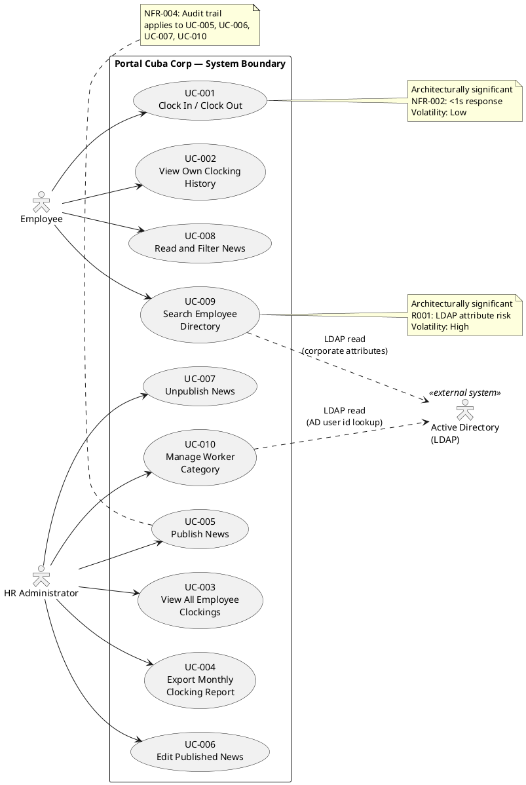
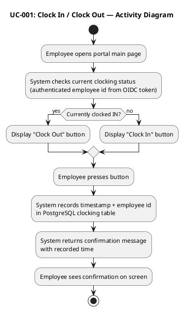
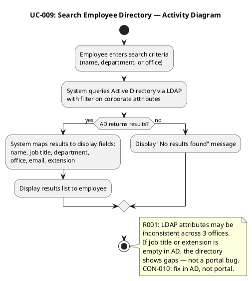

## Document Control

| Field | Value |
|---|---|
| Phase | Inception |
| Status | Draft |
| Milestone Target | End of Inception |
| Iteration | 1 (Cycle 1) |

## Use-Case Diagram

## Actors

| ID | Actor | Type | Description | Source |
|---|---|---|---|---|
| ACT-001 | Employee | Human (primary) | Any authenticated Cuba Corp employee (200 across 3 offices). Uses the portal for clocking, news reading, and directory search. | STK-004 |
| ACT-002 | HR Administrator | Human (primary) | HR staff member with elevated permissions (determined by OIDC role claims from Keycloak). Manages news, views all clockings, exports reports, manages worker categories. | STK-001 |
| ACT-003 | Active Directory (LDAP) | External system | System of record for employee corporate data (name, job title, department, office, email, extension). Read-only access from portal. | CON-005, CON-009 |
| ACT-004 | Keycloak (OIDC) | External system (cross-cutting) | Provides authentication and authorization via OIDC. NOT a use case actor — cross-cutting mechanism specified in Supplementary Specification. | CON-004 |

### Actor-Goal Matrix

| Actor | Goal | Use Case |
|---|---|---|
| Employee | Record work time | UC-001 |
| Employee | Review own clocking history | UC-002 |
| Employee | Stay informed about company news | UC-008 |
| Employee | Find a colleague's contact info | UC-009 |
| HR Administrator | Monitor all employee clockings | UC-003 |
| HR Administrator | Generate monthly clocking report | UC-004 |
| HR Administrator | Publish internal news | UC-005 |
| HR Administrator | Correct a published news item | UC-006 |
| HR Administrator | Retire a news item without deleting it | UC-007 |
| HR Administrator | Assign worker categories | UC-010 |

## Use-Case Survey

| UC ID | Name | Source | Primary Actor | MoSCoW | Volatility | Architecturally Significant | Detail Level |
|---|---|---|---|---|---|---|---|
| UC-001 | Clock In / Clock Out | FR-001 | Employee | Must | Low | Yes (NFR-002: <1s) | Detailed |
| UC-002 | View Own Clocking History | FR-002 | Employee | Must | Low | No | Outline |
| UC-003 | View All Employee Clockings | FR-003 | HR Administrator | Must | Low | No | Outline |
| UC-004 | Export Monthly Clocking Report | FR-004 | HR Administrator | Must | Low | No | Outline |
| UC-005 | Publish News | FR-005 | HR Administrator | Must | Medium | No | Outline |
| UC-006 | Edit Published News | FR-006 | HR Administrator | Must | Medium | No | Outline |
| UC-007 | Unpublish News | FR-007 | HR Administrator | Must | Low | No | Outline |
| UC-008 | Read and Filter News | FR-008 | Employee | Must | Medium | No | Outline |
| UC-009 | Search Employee Directory | FR-009 | Employee | Must | High | Yes (R001: LDAP risk) | Detailed |
| UC-010 | Manage Worker Category | FR-010 | HR Administrator | Must | Medium | No | Outline |

## Use-Case Specifications

### UC-001: Clock In / Clock Out — DETAILED

| Field | Value |
|---|---|
| Source | FR-001 |
| Primary Actor | Employee (ACT-001) |
| Trigger | Employee opens the portal main page |
| Preconditions | Employee is authenticated via Keycloak OIDC |
| Postconditions | Clocking record persisted in PostgreSQL with employee id, timestamp, and direction (in/out); confirmation displayed |
| MoSCoW | Must |
| Volatility | Low |

**Main Flow:**
1. Employee navigates to the portal main page.
2. System retrieves the employee's current clocking status from the database (authenticated employee id from OIDC token).
3. System displays a "Clock In" or "Clock Out" button depending on current status.
4. Employee presses the button.
5. System records the timestamp, employee id, and clock direction in the clocking table.
6. System displays a confirmation message showing the recorded time.

**Alternative Flows:**
- **A1: Network error during recording** — System displays an error message; no partial record is saved. Employee can retry.

**Activity Diagram:**

---

### UC-002: View Own Clocking History — OUTLINE

| Field | Value |
|---|---|
| Source | FR-002 |
| Primary Actor | Employee (ACT-001) |
| Trigger | Employee selects "My Clocking History" |
| Preconditions | Employee authenticated |
| Postconditions | Current month's clocking records displayed |
| MoSCoW | Must |
| Volatility | Low |

**Outline:** Employee views their own clocking entries for the current month, sorted by date. Read-only display.

---

### UC-003: View All Employee Clockings — OUTLINE

| Field | Value |
|---|---|
| Source | FR-003 |
| Primary Actor | HR Administrator (ACT-002) |
| Trigger | HR selects "All Employee Clockings" |
| Preconditions | HR Administrator authenticated with HR role |
| Postconditions | All employees' clocking records displayed |
| MoSCoW | Must |
| Volatility | Low |

**Outline:** HR views clocking entries for all employees. May filter by employee or date range. Read-only display.

---

### UC-004: Export Monthly Clocking Report — OUTLINE

| Field | Value |
|---|---|
| Source | FR-004 |
| Primary Actor | HR Administrator (ACT-002) |
| Trigger | HR selects "Export CSV" |
| Preconditions | HR Administrator authenticated; clocking data exists for selected period |
| Postconditions | CSV file downloaded to HR's workstation |
| MoSCoW | Must |
| Volatility | Low |

**Outline:** HR selects a month and exports all employee clocking data as a CSV file. Format supports BG-002 (eliminate Excel).

---

### UC-005: Publish News — OUTLINE

| Field | Value |
|---|---|
| Source | FR-005 |
| Primary Actor | HR Administrator (ACT-002) |
| Trigger | HR selects "Publish News" |
| Preconditions | HR Administrator authenticated with HR role |
| Postconditions | News item persisted as published; audit record created (author + timestamp) |
| MoSCoW | Must |
| Volatility | Medium |

**Outline:** HR creates a news item with title, body, date, and category (General, HR, IT, Events). On publish, the system records the author identity and timestamp (NFR-004). The item becomes visible to employees (UC-008).

---

### UC-006: Edit Published News — OUTLINE

| Field | Value |
|---|---|
| Source | FR-006 |
| Primary Actor | HR Administrator (ACT-002) |
| Trigger | HR selects "Edit" on a published news item |
| Preconditions | News item exists and is published; HR Administrator authenticated |
| Postconditions | News item updated; audit record created (editor + timestamp) |
| MoSCoW | Must |
| Volatility | Medium |

**Outline:** HR edits title, body, date, or category of an already-published news item. Every edit is audited identically to the original publication (NFR-004). The item remains visible to employees.

---

### UC-007: Unpublish News — OUTLINE

| Field | Value |
|---|---|
| Source | FR-007 |
| Primary Actor | HR Administrator (ACT-002) |
| Trigger | HR selects "Unpublish" on a news item |
| Preconditions | News item is currently published; HR Administrator authenticated |
| Postconditions | News item hidden from employees; record preserved with audit entry (who + when); NOT deleted |
| MoSCoW | Must |
| Volatility | Low |

**Outline:** HR unpublishes a news item. The item is hidden from the employee view but the record is never deleted (CON-013). The audit trail records who unpublished and when (NFR-004).

---

### UC-008: Read and Filter News — OUTLINE

| Field | Value |
|---|---|
| Source | FR-008 |
| Primary Actor | Employee (ACT-001) |
| Trigger | Employee opens the portal main page |
| Preconditions | Employee authenticated |
| Postconditions | Published news items displayed, sorted by date, with optional category filter and featured banners |
| MoSCoW | Must |
| Volatility | Medium |

**Outline:** Employee sees published news on the main page, sorted by date. Can filter by category (General, HR, IT, Events). Featured news items appear with a banner at the top. Read-only — no comments or reactions.

---

### UC-009: Search Employee Directory — DETAILED

| Field | Value |
|---|---|
| Source | FR-009 |
| Primary Actor | Employee (ACT-001) |
| Trigger | Employee enters search criteria in the directory |
| Preconditions | Employee authenticated; Active Directory reachable via LDAP |
| Postconditions | Matching employee records displayed with corporate data only |
| MoSCoW | Must |
| Volatility | High |

**Main Flow:**
1. Employee enters search criteria (name, department, or office).
2. System queries Active Directory via LDAP using the search filter on corporate attributes.
3. AD returns matching entries.
4. System maps each entry to display fields: name, job title, department, office, email, extension phone number.
5. System displays the results list to the employee.

**Alternative Flows:**
- **A1: No results** — System displays "No results found" message.
- **A2: AD LDAP attributes missing** — If an AD entry has empty attributes (e.g., no extension), the field is displayed as blank or "N/A". This is an AD data quality issue (R001), not a portal error. Per CON-010, the fix is in AD, not the portal.
- **A3: AD unreachable** — System displays an error message indicating the directory is temporarily unavailable.

**Activity Diagram:**

---

### UC-010: Manage Worker Category — OUTLINE

| Field | Value |
|---|---|
| Source | FR-010 |
| Primary Actor | HR Administrator (ACT-002) |
| Trigger | HR selects "Manage Worker Categories" |
| Preconditions | HR Administrator authenticated with HR role |
| Postconditions | Worker category link (AD user id → category) created/updated; audit record created |
| MoSCoW | Must |
| Volatility | Medium |

**Outline:** HR assigns or updates a worker category for an employee. The local table stores only two columns: AD user id and category. The portal reads the rest of the employee data from AD at read time (CON-009). Any change to a worker's category is audited (NFR-004). No synchronization, no reconciliation, no conflict resolution.

## Traceability

| Element | Traces From | Link Type | Traces To |
|---|---|---|---|
| UC-001 | FR-001 | Refines | FEAT-001 |
| UC-002 | FR-002 | Refines | FEAT-002 |
| UC-003 | FR-003 | Refines | FEAT-003 |
| UC-004 | FR-004 | Refines | FEAT-004 |
| UC-005 | FR-005, NFR-004 | Refines | FEAT-005 |
| UC-006 | FR-006, NFR-004 | Refines | FEAT-006 |
| UC-007 | FR-007, CON-013, NFR-004 | Refines | FEAT-007 |
| UC-008 | FR-008 | Refines | FEAT-008 |
| UC-009 | FR-009, CON-005, CON-012 | Refines | FEAT-009 |
| UC-010 | FR-010, CON-009, NFR-004 | Refines | FEAT-010 |
| ACT-001 | STK-004 | Derives | UC-001, UC-002, UC-008, UC-009 |
| ACT-002 | STK-001 | Derives | UC-003..UC-007, UC-010 |
| ACT-003 | CON-005, CON-009 | Derives | UC-009, UC-010 |
| UC-009 | R001 | DependsOn | (LDAP attribute consistency) |