## Document Control

| Field | Value |
|---|---|
| Phase | Elaboration |
| Status | Draft |
| Milestone Target | End of Elaboration |
| Iteration | 1 (Cycle 1) |
| Date | 2026-08-28 |

## Use-Case Diagram

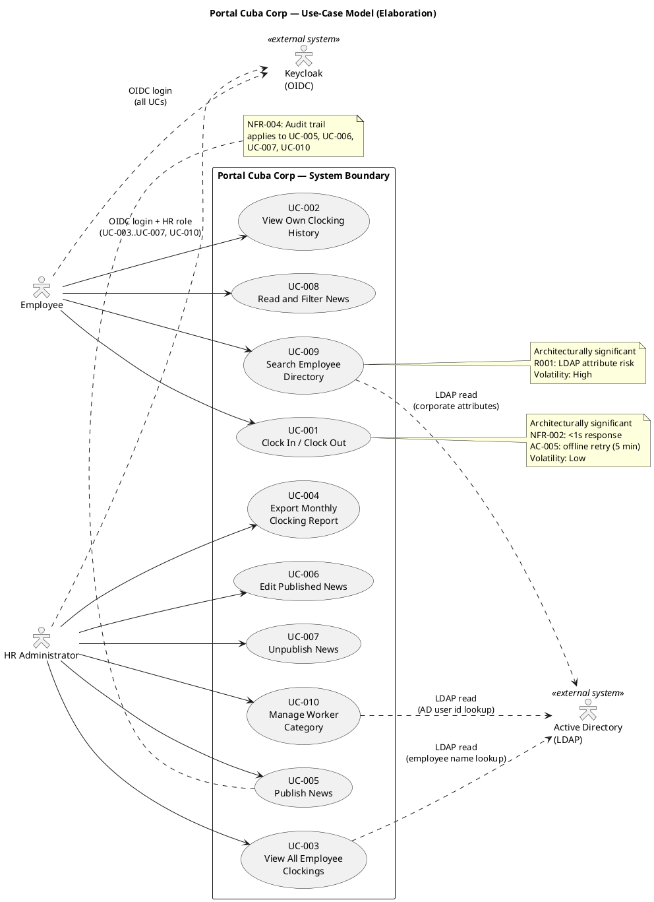

## Actors

| ID | Actor | Type | Description | Source |
|---|---|---|---|---|
| ACT-001 | Employee | Human (primary) | Any authenticated Cuba Corp employee (200 across 3 offices). Uses the portal for clocking, news reading, and directory search. | STK-004 |
| ACT-002 | HR Administrator | Human (primary) | HR staff member with elevated permissions (determined by OIDC role claims from Keycloak). Manages news, views all clockings, exports reports, manages worker categories. | STK-001 |
| ACT-003 | Active Directory (LDAP) | External system | Corporate directory accessed via LDAP for read-only employee data (name, job title, department, office, email, extension). System of record for employee attributes. | CON-005, CON-009 |
| ACT-004 | Keycloak (OIDC) | External system | Identity provider for authentication and authorization. Portal is an OIDC client only — no provisioning or management. | CON-004 |

## Use-Case Survey

| UC ID | Name | Source | Primary Actor | MoSCoW | Volatility | Architecturally Significant | Detail Level |
|---|---|---|---|---|---|---|---|
| UC-001 | Clock In / Clock Out | FR-001 | Employee | Must | Low | Yes (NFR-002: <1s, AC-005: offline retry) | Detailed |
| UC-002 | View Own Clocking History | FR-002 | Employee | Must | Low | No | Detailed |
| UC-003 | View All Employee Clockings | FR-003 | HR Administrator | Must | Low | No | Detailed |
| UC-004 | Export Monthly Clocking Report | FR-004 | HR Administrator | Must | Low | No | Detailed |
| UC-005 | Publish News | FR-005 | HR Administrator | Must | Medium | No | Detailed |
| UC-006 | Edit Published News | FR-006 | HR Administrator | Must | Medium | No | Detailed |
| UC-007 | Unpublish News | FR-007 | HR Administrator | Must | Low | No | Detailed |
| UC-008 | Read and Filter News | FR-008 | Employee | Must | Medium | No | Detailed |
| UC-009 | Search Employee Directory | FR-009 | Employee | Must | High | Yes (R001: LDAP risk) | Detailed |
| UC-010 | Manage Worker Category | FR-010 | HR Administrator | Must | Medium | No | Detailed |

## Use-Case Specifications

### UC-001: Clock In / Clock Out — DETAILED

| Field | Value |
|---|---|
| Source | FR-001 |
| Primary Actor | Employee (ACT-001) |
| Trigger | Employee opens the portal main page |
| Preconditions | Employee is authenticated via Keycloak OIDC |
| Postconditions | Clocking record persisted in PostgreSQL with employee id, client-side timestamp, clock direction (in/out), and idempotency key; confirmation displayed |
| MoSCoW | Must |
| Volatility | Low |

**Main Flow:**
1. Employee navigates to the portal main page.
2. System retrieves the employee's current clocking status from the database (authenticated employee id from OIDC token).
3. System displays a "Clock In" or "Clock Out" button depending on current status.
4. Employee presses the button.
5. Client records the press timestamp and generates an idempotency key in localStorage.
6. Client sends POST request to server with timestamp and idempotency key.
7. Server records the clocking entry (employee id, client timestamp, direction, idempotency key) in PostgreSQL.
8. Server returns confirmation with the recorded time.
9. Employee sees confirmation on screen.

**Alternative Flows:**
- **A1: Network error during POST (offline retry — AC-005 resolved):** Client stores the press in localStorage and retries the POST for up to 5 minutes. When the network is restored, the server accepts the original client-side timestamp (the moment the employee pressed) and rejects duplicates by idempotency key. This is a page-level script on an already-rendered Razor page — no SPA, no client-side router (CON-002 stands). This is not the excluded sync work: one action, one queue, one entity, nothing to reconcile.
- **A2: Network not restored within 5 minutes:** Client stops retrying and displays "Clocking not recorded — report to HR." The employee reports the clocking to HR manually.
- **A3: Duplicate POST received (idempotency):** Server detects the idempotency key already exists in the clocking table and returns the original confirmation without creating a duplicate record.

**Activity Diagram:**

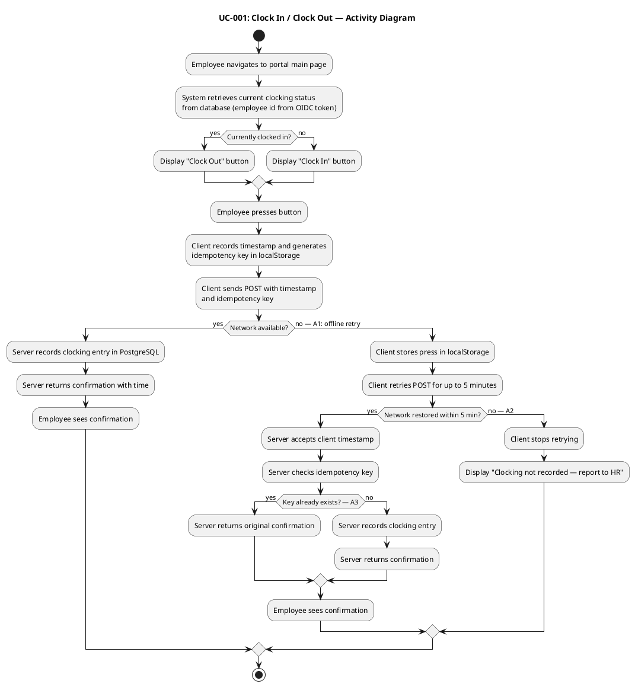

---

### UC-002: View Own Clocking History — DETAILED

| Field | Value |
|---|---|
| Source | FR-002 |
| Primary Actor | Employee (ACT-001) |
| Trigger | Employee selects "My Clockings" from the portal navigation |
| Preconditions | Employee is authenticated via Keycloak OIDC |
| Postconditions | Employee's clocking history for the current month is displayed |
| MoSCoW | Must |
| Volatility | Low |

**Main Flow:**
1. Employee navigates to the "My Clockings" page.
2. System retrieves the employee id from the OIDC token.
3. System queries clocking records for the current month (employee id, date range = month-to-date).
4. System displays the clocking history table: date, time, direction (in/out).

**Alternative Flows:**
- **A1: No clockings recorded this month:** System displays "No clockings recorded this month."

**Activity Diagram:**

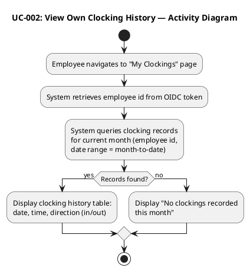

---

### UC-003: View All Employee Clockings — DETAILED

| Field | Value |
|---|---|
| Source | FR-003 |
| Primary Actor | HR Administrator (ACT-002) |
| Trigger | HR Administrator selects "All Clockings" from the portal navigation |
| Preconditions | HR Administrator is authenticated via Keycloak OIDC with HR role |
| Postconditions | All employees' clocking records for the current month are displayed |
| MoSCoW | Must |
| Volatility | Low |

**Main Flow:**
1. HR Administrator navigates to the "All Clockings" page.
2. System verifies HR role from OIDC token claims.
3. System queries all clocking records for the current month (all employees).
4. System resolves employee names from AD via LDAP at read time using the employee id on each record (CON-009: no local copy of employee data).
5. System displays the clocking table: employee name, date, time, direction (in/out).

**Alternative Flows:**
- **A1: No clockings recorded this month:** System displays "No clockings recorded this month."
- **A2: AD unavailable during name resolution:** System displays clocking records with employee id instead of name and shows a warning "AD unavailable — showing employee IDs instead of names."

**Activity Diagram:**

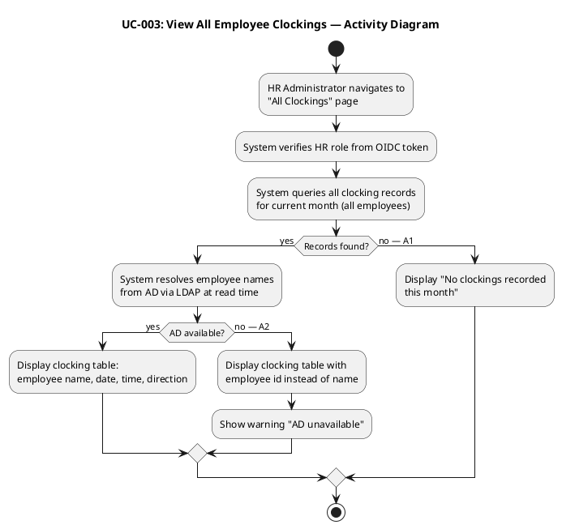

---

### UC-004: Export Monthly Clocking Report — DETAILED

| Field | Value |
|---|---|
| Source | FR-004 |
| Primary Actor | HR Administrator (ACT-002) |
| Trigger | HR Administrator selects "Export Monthly Report" |
| Preconditions | HR Administrator is authenticated via Keycloak OIDC with HR role |
| Postconditions | CSV file containing all clocking records for the selected month is downloaded |
| MoSCoW | Must |
| Volatility | Low |

**Main Flow:**
1. HR Administrator selects "Export Monthly Report."
2. System verifies HR role from OIDC token claims.
3. HR selects the target month and year.
4. System queries all clocking records for the selected month (all employees).
5. System resolves employee names from AD via LDAP at read time (CON-009).
6. System generates a CSV file with columns: employee id, employee name, date, clock-in time, clock-out time.
7. Browser downloads the CSV file.

**Alternative Flows:**
- **A1: No clockings found for selected month:** System displays "No clockings found for selected month."
- **A2: AD unavailable during name resolution:** CSV is generated with employee id only; a note column indicates "name unavailable."

**Activity Diagram:**

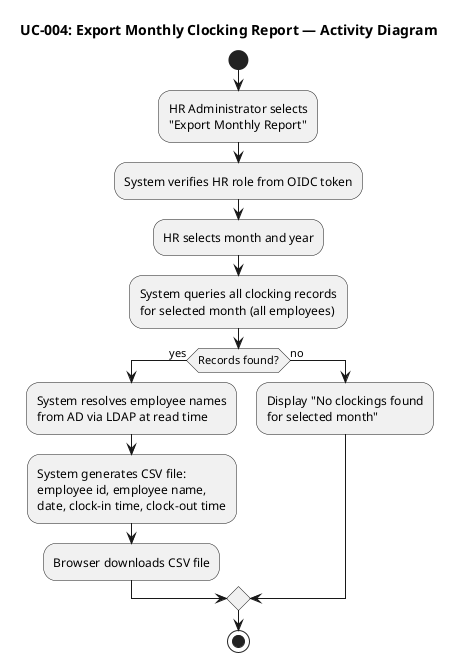

---

### UC-005: Publish News — DETAILED

| Field | Value |
|---|---|
| Source | FR-005 |
| Primary Actor | HR Administrator (ACT-002) |
| Trigger | HR Administrator selects "Publish News" |
| Preconditions | HR Administrator is authenticated via Keycloak OIDC with HR role |
| Postconditions | News item persisted with status = Published; audit record created (author identity + timestamp, action = Published) |
| MoSCoW | Must |
| Volatility | Medium |

**Main Flow:**
1. HR Administrator selects "Publish News."
2. System verifies HR role from OIDC token claims.
3. HR enters news details: title, body, category (General, HR, IT, Events), date.
4. System validates required fields (title, body, category, date are non-empty).
5. System persists the news item in PostgreSQL with status = Published.
6. System creates an audit record: author identity (from OIDC token), timestamp, action = Published (NFR-004, AUD-001).
7. System displays "News published successfully."

**Alternative Flows:**
- **A1: Validation errors:** System displays validation errors. HR corrects and resubmits.

**Activity Diagram:**

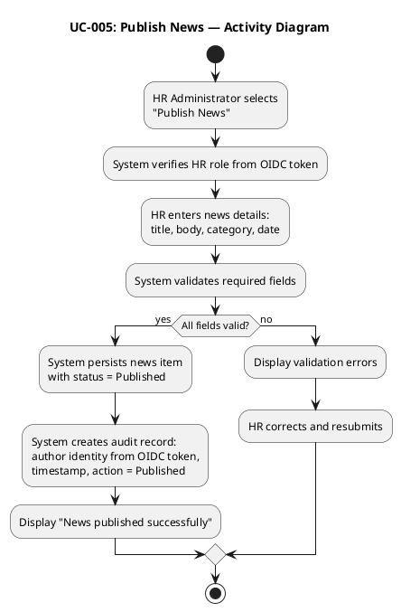

---

### UC-006: Edit Published News — DETAILED

| Field | Value |
|---|---|
| Source | FR-006 |
| Primary Actor | HR Administrator (ACT-002) |
| Trigger | HR Administrator selects a published news item to edit |
| Preconditions | HR Administrator is authenticated via Keycloak OIDC with HR role; news item exists and is published |
| Postconditions | News item updated in database; audit record created (author identity + timestamp, action = Edited) |
| MoSCoW | Must |
| Volatility | Medium |

**Main Flow:**
1. HR Administrator selects a published news item to edit.
2. System verifies HR role from OIDC token claims.
3. System loads the news item details (title, body, category, date).
4. HR modifies one or more fields (title, body, category, date).
5. System validates required fields.
6. System updates the news item in the database.
7. System creates an audit record: author identity (from OIDC token), timestamp, action = Edited (NFR-004, AUD-001).
8. System displays "News updated successfully."

**Alternative Flows:**
- **A1: Validation errors:** System displays validation errors. HR corrects and resubmits.

**Activity Diagram:**

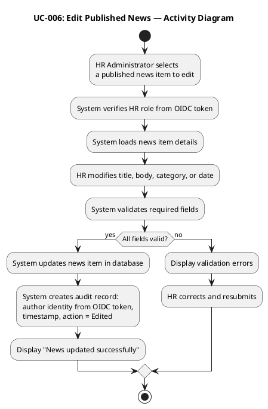

---

### UC-007: Unpublish News — DETAILED

| Field | Value |
|---|---|
| Source | FR-007 |
| Primary Actor | HR Administrator (ACT-002) |
| Trigger | HR Administrator selects a published news item and clicks "Unpublish" |
| Preconditions | HR Administrator is authenticated via Keycloak OIDC with HR role; news item exists and is published |
| Postconditions | News item status set to Unpublished (NOT deleted — CON-013); audit record created (author identity + timestamp, action = Unpublished); employees no longer see the item |
| MoSCoW | Must |
| Volatility | Low |

**Main Flow:**
1. HR Administrator selects a published news item.
2. System verifies HR role from OIDC token claims.
3. HR clicks "Unpublish."
4. System sets the news item status to Unpublished (CON-013: record is NOT deleted — it stays in the database for audit trail traceability).
5. System creates an audit record: author identity (from OIDC token), timestamp, action = Unpublished (NFR-004, AUD-001).
6. System displays "News unpublished successfully."

**Alternative Flows:**
- (none — this is a single-action use case with no conditional branches)

**Activity Diagram:**

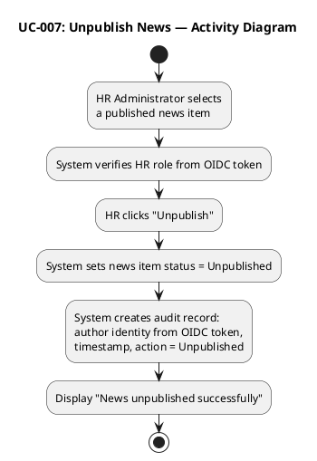

---

### UC-008: Read and Filter News — DETAILED

| Field | Value |
|---|---|
| Source | FR-008 |
| Primary Actor | Employee (ACT-001) |
| Trigger | Employee navigates to the portal main page |
| Preconditions | Employee is authenticated via Keycloak OIDC |
| Postconditions | Published news items displayed sorted by date descending; featured news shown with banners at top |
| MoSCoW | Must |
| Volatility | Medium |

**Main Flow:**
1. Employee navigates to the portal main page.
2. System retrieves published news items sorted by date descending.
3. System retrieves featured news items (banner flag = true).
4. If featured news exists, system displays featured news banners at the top.
5. System displays the news list below the banners.
6. Employee may select a category filter (General, HR, IT, Events).
7. System filters the news list by the selected category and displays the filtered results.

**Alternative Flows:**
- **A1: No featured news:** System displays the normal news list only (no banners).
- **A2: No published news:** System displays "No news available."
- **A3: No news in selected category:** System displays "No news in this category."

**Activity Diagram:**

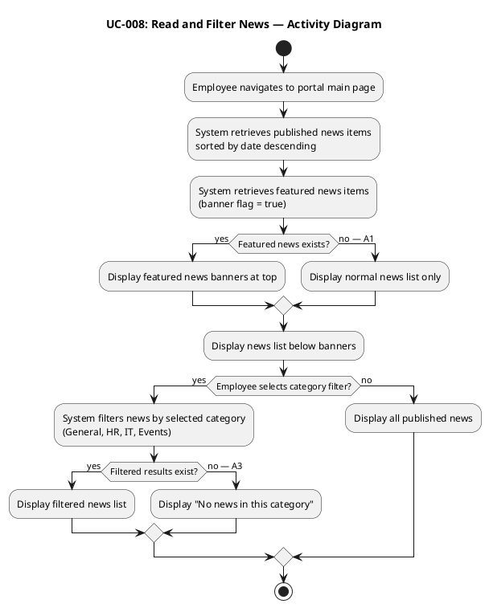

---

### UC-009: Search Employee Directory — DETAILED

| Field | Value |
|---|---|
| Source | FR-009 |
| Primary Actor | Employee (ACT-001) |
| Trigger | Employee enters a search term in the directory search field |
| Preconditions | Employee is authenticated via Keycloak OIDC |
| Postconditions | Matching employee records displayed with corporate data only (name, job title, department, office, email, extension) |
| MoSCoW | Must |
| Volatility | High |

**Main Flow:**
1. Employee enters a search term (name, department, or office) in the directory search field.
2. System queries Active Directory via LDAP using the search term (CON-005: AD is the system of record).
3. System retrieves matching employee records with corporate attributes only: name, job title, department, office, email, extension (CON-012: no private personal information).
4. System displays the search results as a list of employee entries.
5. Employee views the desired colleague's contact information.

**Alternative Flows:**
- **A1: No matching results:** System displays "No employees found matching your search."
- **A2: AD unavailable (LDAP error):** System displays "Directory unavailable" (R001: LDAP attributes may be inconsistent across 3 offices — if job title or extension is empty in AD, the directory shows gaps, not a portal bug. CON-010: fix in AD, not portal.)
- **A3: Partial AD attributes:** Some fields (e.g., extension) are empty in AD for certain employees. System displays the available fields and leaves empty fields blank — no error.

**Activity Diagram:**

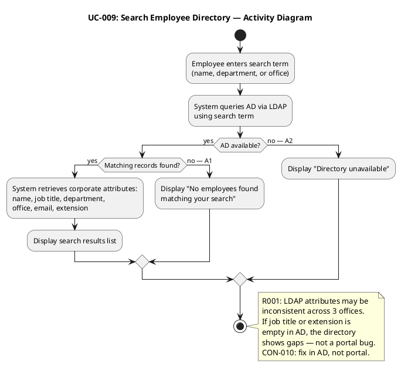

---

### UC-010: Manage Worker Category — DETAILED

| Field | Value |
|---|---|
| Source | FR-010 |
| Primary Actor | HR Administrator (ACT-002) |
| Trigger | HR Administrator selects "Manage Worker Categories" |
| Preconditions | HR Administrator is authenticated via Keycloak OIDC with HR role |
| Postconditions | Worker category link (AD user id → category) created/updated in local table; audit record created (author identity + timestamp, action = CategoryChanged) |
| MoSCoW | Must |
| Volatility | Medium |

**Main Flow:**
1. HR Administrator selects "Manage Worker Categories."
2. System verifies HR role from OIDC token claims.
3. System displays current worker category assignments (AD user id, category).
4. HR selects an employee (looks up AD user id via LDAP).
5. System confirms the employee exists in AD.
6. HR assigns or updates the worker category.
7. System validates the category value.
8. System persists the worker category link (AD user id, category) in the local table (CON-009: local table holds only two columns — AD user id and category. No employee data copied).
9. System creates an audit record: author identity (from OIDC token), timestamp, action = CategoryChanged (NFR-004, AUD-002).
10. System displays "Category updated successfully."

**Alternative Flows:**
- **A1: Employee not found in AD:** System displays "Employee not found in AD."
- **A2: Invalid category value:** System displays a validation error.

**Activity Diagram:**

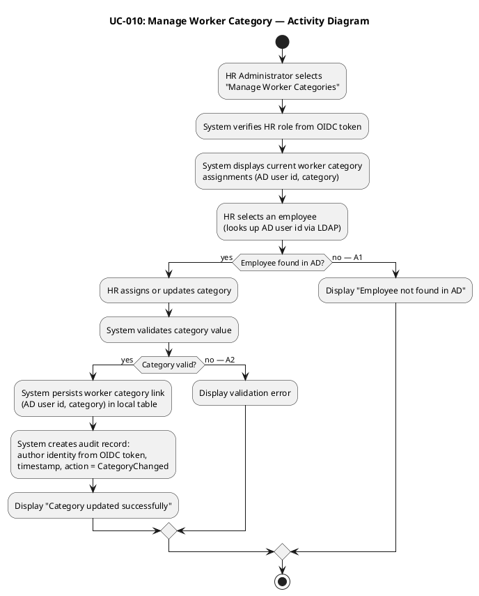

## Traceability

| Element | Traces From | Link Type | Traces To |
|---|---|---|---|
| UC-001 | FR-001, AC-005 | Refines | REQ-001, REL-003, REL-004 |
| UC-002 | FR-002 | Refines | REQ-002 |
| UC-003 | FR-003 | Refines | REQ-003 |
| UC-004 | FR-004 | Refines | REQ-004 |
| UC-005 | FR-005, NFR-004 | Refines | REQ-005 |
| UC-006 | FR-006, NFR-004 | Refines | REQ-006 |
| UC-007 | FR-007, CON-013, NFR-004 | Refines | REQ-007 |
| UC-008 | FR-008 | Refines | REQ-008 |
| UC-009 | FR-009, CON-005, CON-012 | Refines | REQ-009 |
| UC-010 | FR-010, CON-009, NFR-004 | Refines | REQ-010 |
| ACT-001 | STK-004 | Derives | UC-001, UC-002, UC-008, UC-009 |
| ACT-002 | STK-001 | Derives | UC-003..UC-007, UC-010 |
| ACT-003 | CON-005, CON-009 | Derives | UC-003, UC-009, UC-010 |
| ACT-004 | CON-004 | Derives | All UCs (auth) |
| UC-009 | R001 | DependsOn | (LDAP attribute consistency) |