## Document Control
| Field | Value |
|---|---|
| Phase | Construction |
| Status | Draft |
| Milestone Target | End of Construction |
| Iteration | 2 (Cycle 1) |
| Date | 2026-08-28 |
| Prior Phase | Elaboration (LCA achieved — 0 Critical, 0 Major open; stakeholder sanction GRANTED) |
| Evolution | Construction Iter 1: Requirements baseline preserved — no approved CR affects scope or NFRs. All Elaboration implementation decisions (offline retry with idempotency key in UC-001, audit trail in UC-005/006/007/010, AD read-only in UC-009/010) already reflected in Elaboration baseline. Document Control updated to Construction phase. Construction Iter 2: CR-010 (IsFeatured flag) — [DERIVED] marker RETIRED. CR-010 was CCB-approved (Construction C1), which constitutes stakeholder confirmation. IsFeatured is now an approved extension of FR-008's featured banner requirement, no longer pending confirmation. UC-005 and UC-006 updated to reflect approved status. Use-Case Diagram and Traceability updated to remove [DERIVED] marker. CR-011 (idempotency key) remains reflected in UC-001 from Elaboration baseline — no changes needed. |
## Use-Case Diagram
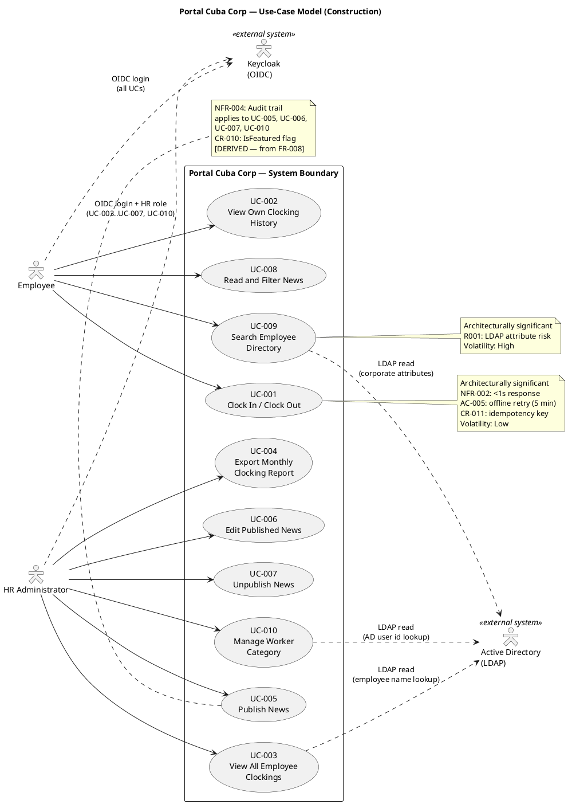
## Actors

| ID | Actor | Type | Description | Source |
|---|---|---|---|---|
| ACT-001 | Employee | Human (primary) | Any authenticated Cuba Corp employee (200 across 3 offices). Uses the portal for clocking, news reading, and directory search. | STK-004 |
| ACT-002 | HR Administrator | Human (primary) | HR staff member with elevated permissions (determined by OIDC role claims from Keycloak). Manages news, views all clockings, exports reports, manages worker categories. | STK-001 |
| ACT-003 | Active Directory (LDAP) | External system | Corporate directory accessed via LDAP for read-only employee data (name, job title, department, office, email, extension). System of record for employee attributes. | CON-005, CON-009 |
| ACT-004 | Keycloak (OIDC) | External system | Identity provider for authentication and authorization. Portal is an OIDC client only — no provisioning or management. | CON-004 |

## Use-Case Survey

| UC ID | Name | Source | Primary Actor | MoSCoW | Volatility | Architecturally Significant | Detail Level |
|---|---|---|---|---|---|---|---|
| UC-001 | Clock In / Clock Out | FR-001 | Employee | Must | Low | Yes (NFR-002: <1s, AC-005: offline retry) | Detailed |
| UC-002 | View Own Clocking History | FR-002 | Employee | Must | Low | No | Detailed |
| UC-003 | View All Employee Clockings | FR-003 | HR Administrator | Must | Low | No | Detailed |
| UC-004 | Export Monthly Clocking Report | FR-004 | HR Administrator | Must | Low | No | Detailed |
| UC-005 | Publish News | FR-005 | HR Administrator | Must | Medium | No | Detailed |
| UC-006 | Edit Published News | FR-006 | HR Administrator | Must | Medium | No | Detailed |
| UC-007 | Unpublish News | FR-007 | HR Administrator | Must | Low | No | Detailed |
| UC-008 | Read and Filter News | FR-008 | Employee | Must | Medium | No | Detailed |
| UC-009 | Search Employee Directory | FR-009 | Employee | Must | High | Yes (R001: LDAP risk) | Detailed |
| UC-010 | Manage Worker Category | FR-010 | HR Administrator | Must | Medium | No | Detailed |

## Use-Case Specifications
### UC-001: Clock In / Clock Out — DETAILED

| Field | Value |
|---|---|
| Source | FR-001 |
| Primary Actor | Employee (ACT-001) |
| Trigger | Employee opens the portal main page |
| Preconditions | Employee is authenticated via Keycloak OIDC |
| Postconditions | Clocking record persisted in PostgreSQL with employee id, client-side timestamp, clock direction (in/out), and idempotency key; confirmation displayed |
| MoSCoW | Must |
| Volatility | Low |

**Main Flow:**
1. Employee navigates to the portal main page.
2. System retrieves the employee's current clocking status from the database (authenticated employee id from OIDC token).
3. System displays a "Clock In" or "Clock Out" button depending on current status.
4. Employee presses the button.
5. Client records the press timestamp and generates an idempotency key in localStorage.
6. Client sends POST request to server with timestamp and idempotency key.
7. Server records the clocking entry (employee id, client timestamp, direction, idempotency key) in PostgreSQL.
8. Server returns confirmation with the recorded time.
9. Employee sees confirmation on screen.

**Alternative Flows:**
- **A1: Network error during POST (offline retry — AC-005 resolved):** Client stores the press in localStorage and retries the POST for up to 5 minutes. When the network is restored, the server accepts the original client-side timestamp (the moment the employee pressed) and rejects duplicates by idempotency key. This is a page-level script on an already-rendered Razor page — no SPA, no client-side router (CON-002 stands). This is not the excluded sync work: one action, one queue, one entity, nothing to reconcile.
- **A2: Network not restored within 5 minutes:** Client stops retrying and displays "Clocking not recorded — report to HR." The employee reports the clocking to HR manually.
- **A3: Duplicate POST received (idempotency):** Server detects the idempotency key already exists in the clocking table and returns the original confirmation without creating a duplicate record.

**Activity Diagram:**

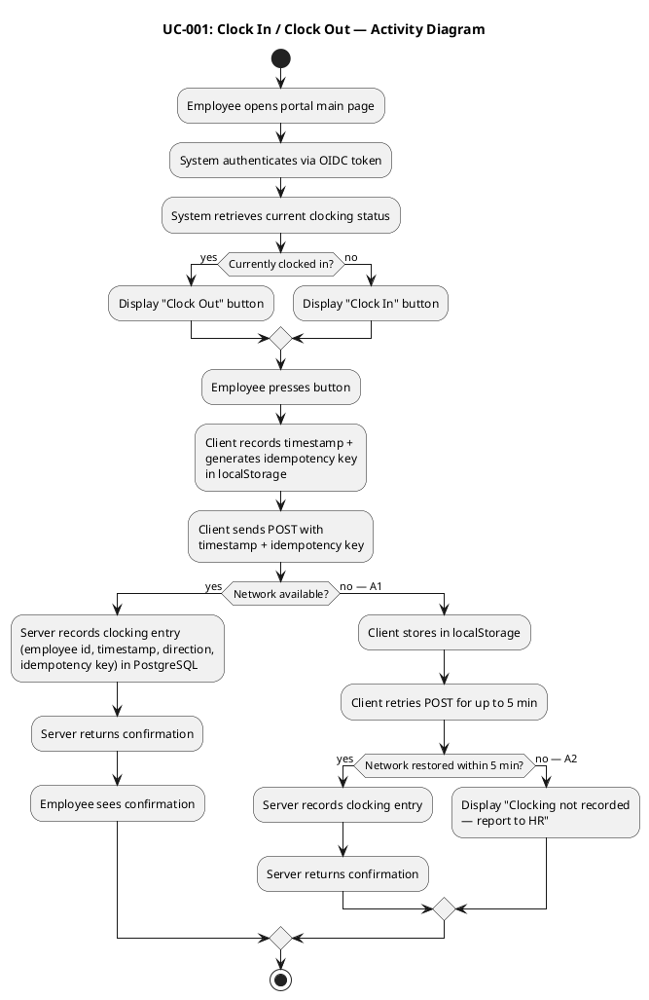

### UC-002: View Own Clocking History — DETAILED

| Field | Value |
|---|---|
| Source | FR-002 |
| Primary Actor | Employee (ACT-001) |
| Trigger | Employee selects "My Clocking History" |
| Preconditions | Employee is authenticated via Keycloak OIDC |
| Postconditions | Employee sees their clocking records for the current month |
| MoSCoW | Must |
| Volatility | Low |

**Main Flow:**
1. Employee navigates to "My Clocking History" page.
2. System retrieves the employee's clocking records for the current month from PostgreSQL (filtered by authenticated employee id).
3. System displays the list of clocking entries (date, time in, time out).

**Alternative Flows:**
- **A1: No clocking records for current month:** System displays "No clocking records for this month."

**Activity Diagram:**

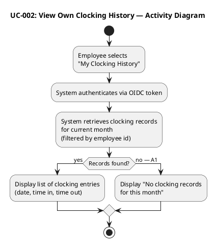

### UC-003: View All Employee Clockings — DETAILED

| Field | Value |
|---|---|
| Source | FR-003 |
| Primary Actor | HR Administrator (ACT-002) |
| Trigger | HR Administrator selects "View All Clockings" |
| Preconditions | HR Administrator is authenticated via Keycloak OIDC with HR role |
| Postconditions | HR Administrator sees clocking records for all employees |
| MoSCoW | Must |
| Volatility | Low |

**Main Flow:**
1. HR Administrator navigates to "All Employee Clockings" page.
2. System verifies HR role from OIDC token claims.
3. System retrieves all employees' clocking records from PostgreSQL.
4. System resolves employee display names from Active Directory via LDAP (AD user id → name).
5. System displays the list of clocking entries (employee name, date, time in, time out).

**Alternative Flows:**
- **A1: AD lookup fails for an employee:** System displays the AD user id instead of the name and logs a warning.

**Activity Diagram:**

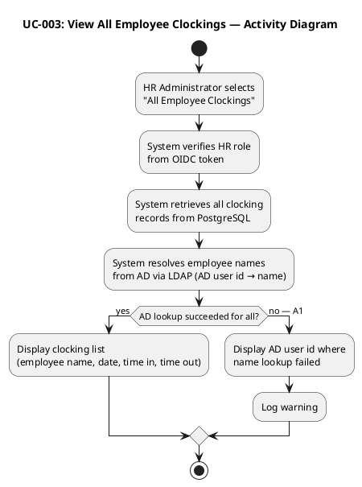

### UC-004: Export Monthly Clocking Report — DETAILED

| Field | Value |
|---|---|
| Source | FR-004 |
| Primary Actor | HR Administrator (ACT-002) |
| Trigger | HR Administrator selects "Export Monthly Report" |
| Preconditions | HR Administrator is authenticated via Keycloak OIDC with HR role |
| Postconditions | CSV file downloaded containing all employees' clockings for the selected month |
| MoSCoW | Must |
| Volatility | Low |

**Main Flow:**
1. HR Administrator navigates to "Export Monthly Report" page.
2. System verifies HR role from OIDC token claims.
3. HR Administrator selects a month and year.
4. System retrieves all clocking records for the selected month from PostgreSQL.
5. System resolves employee display names from Active Directory via LDAP.
6. System generates a CSV file with columns: Employee Name, Date, Time In, Time Out.
7. System returns the CSV file as a download.

**Alternative Flows:**
- **A1: No clocking records for selected month:** System displays "No clocking records for the selected month" and does not generate a file.

**Activity Diagram:**

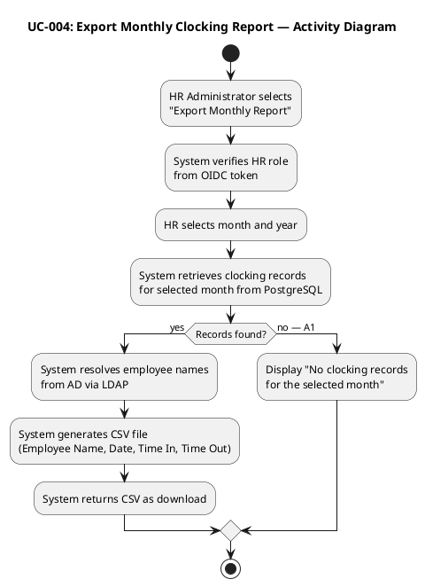

### UC-005: Publish News — DETAILED

| Field | Value |
|---|---|
| Source | FR-005 |
| Primary Actor | HR Administrator (ACT-002) |
| Trigger | HR Administrator selects "Publish News" |
| Preconditions | HR Administrator is authenticated via Keycloak OIDC with HR role |
| Postconditions | News item persisted in PostgreSQL with title, body, category, IsFeatured flag, author identity, and publication timestamp; audit record created (NFR-004) |
| MoSCoW | Must |
| Volatility | Medium |

**Main Flow:**
1. HR Administrator navigates to the "Publish News" page.
2. System verifies HR role from OIDC token claims.
3. System displays the publish form with fields: title, body, category (General, HR, IT, Events), and an IsFeatured checkbox `[DERIVED — from FR-008, awaiting stakeholder confirmation]`.
4. HR Administrator enters title, body, selects a category, and optionally checks the IsFeatured checkbox to mark the news as a featured banner.
5. HR Administrator clicks "Publish".
6. System validates that title and body are non-empty.
7. System creates a NewsItem with Title, Body, Category, IsFeatured, Status=Published, AuthorId (from OIDC token), CreatedAt (current timestamp).
8. System persists the NewsItem in PostgreSQL.
9. System creates an audit record: author identity, timestamp, action=Publish (NFR-004).
10. System displays "News published successfully".

**Alternative Flows:**
- **A1: Title or body empty:** System displays a validation error and does not persist the news item.

**Activity Diagram:**

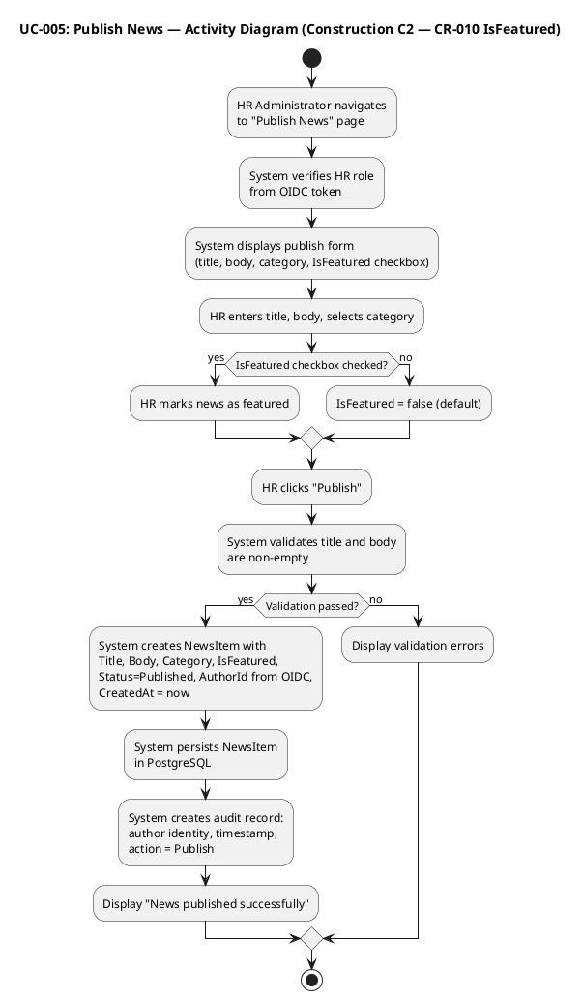

### UC-006: Edit Published News — DETAILED

| Field | Value |
|---|---|
| Source | FR-006 |
| Primary Actor | HR Administrator (ACT-002) |
| Trigger | HR Administrator selects a news item to edit |
| Preconditions | HR Administrator is authenticated via Keycloak OIDC with HR role; a published news item exists |
| Postconditions | News item updated in PostgreSQL with modified fields (title, body, category, IsFeatured); audit record created (NFR-004) |
| MoSCoW | Must |
| Volatility | Medium |

**Main Flow:**
1. HR Administrator navigates to the news management list.
2. System verifies HR role from OIDC token claims.
3. System displays the list of all news items.
4. HR Administrator selects a news item to edit.
5. System loads the current values: title, body, category, and IsFeatured flag.
6. System displays the edit form pre-populated with current values, including the IsFeatured checkbox `[DERIVED — from FR-008, awaiting stakeholder confirmation]`.
7. HR Administrator modifies title, body, category, and/or toggles the IsFeatured checkbox.
8. HR Administrator clicks "Save Changes".
9. System validates that title and body are non-empty.
10. System updates the NewsItem in place: Title, Body, Category, IsFeatured, UpdatedAt (current timestamp).
11. System creates an audit record: author identity, timestamp, action=Edit (NFR-004).
12. System displays "News updated successfully".

**Alternative Flows:**
- **A1: Title or body empty:** System displays a validation error and does not update the news item.
- **A2: News item not found:** System displays "News item not found."

**Activity Diagram:**

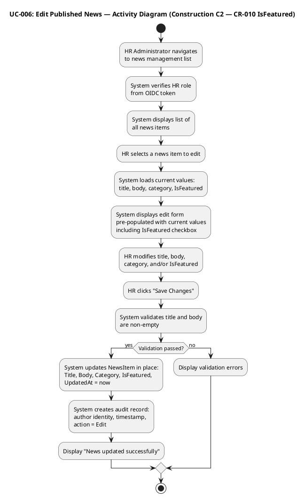

### UC-007: Unpublish News — DETAILED

| Field | Value |
|---|---|
| Source | FR-007 |
| Primary Actor | HR Administrator (ACT-002) |
| Trigger | HR Administrator selects "Unpublish" on a news item |
| Preconditions | HR Administrator is authenticated via Keycloak OIDC with HR role; a published news item exists |
| Postconditions | News item Status set to Unpublished; record preserved (never deleted, CON-013); audit record created (NFR-004) |
| MoSCoW | Must |
| Volatility | Low |

**Main Flow:**
1. HR Administrator navigates to the news management list.
2. System verifies HR role from OIDC token claims.
3. System displays the list of all news items with their current status.
4. HR Administrator selects "Unpublish" on a published news item.
5. System sets the NewsItem Status to Unpublished (record preserved, NOT deleted — CON-013).
6. System creates an audit record: author identity, timestamp, action=Unpublish (NFR-004).
7. System displays "News unpublished successfully".

**Alternative Flows:**
- **A1: News item already unpublished:** System displays "This news item is already unpublished."
- **A2: News item not found:** System displays "News item not found."

**Activity Diagram:**

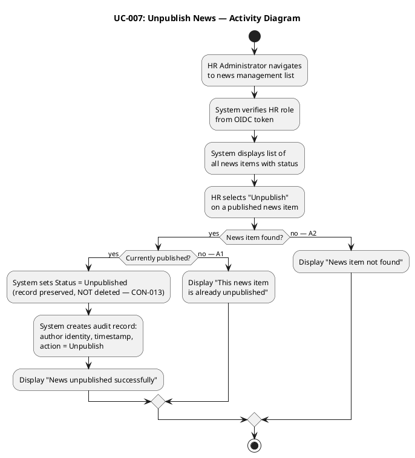

### UC-008: Read and Filter News — DETAILED

| Field | Value |
|---|---|
| Source | FR-008 |
| Primary Actor | Employee (ACT-001) |
| Trigger | Employee opens the portal main page |
| Preconditions | Employee is authenticated via Keycloak OIDC |
| Postconditions | Employee sees published news items sorted by date, optionally filtered by category, with featured news displayed as banners at the top |
| MoSCoW | Must |
| Volatility | Medium |

**Main Flow:**
1. Employee navigates to the portal main page.
2. System authenticates via OIDC token.
3. System retrieves featured published news items (IsFeatured=true, Status=Published) and displays them as banners at the top.
4. System retrieves all published news items sorted by date (newest first).
5. System displays the news list with title, date, category, and body excerpt.

**Alternative Flows:**
- **A1: Employee filters by category:** Employee selects a category filter (General, HR, IT, Events). System filters the news list to show only items in the selected category. Featured banners remain at the top regardless of category filter.
- **A2: No featured news items:** System skips the featured banner section and displays only the sorted news list.
- **A3: No published news items:** System displays "No news available."

**Activity Diagram:**

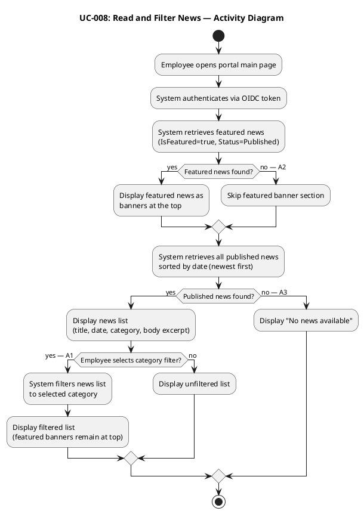

### UC-009: Search Employee Directory — DETAILED

| Field | Value |
|---|---|
| Source | FR-009 |
| Primary Actor | Employee (ACT-001) |
| Trigger | Employee selects "Employee Directory" and enters search criteria |
| Preconditions | Employee is authenticated via Keycloak OIDC |
| Postconditions | Employee sees matching colleagues with corporate data only (name, job title, department, office, email, extension) |
| MoSCoW | Must |
| Volatility | High |

**Main Flow:**
1. Employee navigates to the "Employee Directory" page.
2. System authenticates via OIDC token.
3. System displays the search form with fields: name, department, office.
4. Employee enters search criteria (one or more fields).
5. System queries Active Directory via LDAP with the search criteria.
6. System displays matching entries with: name, job title, department, office, email, extension phone number (CON-012: corporate data only).

**Alternative Flows:**
- **A1: No results found:** System displays "No employees found matching your search."
- **A2: AD LDAP connection fails:** System displays "Directory service temporarily unavailable. Please try again later."
- **A3: LDAP attribute missing for an employee (R001):** System displays the entry with available fields and shows "—" for missing attributes.

**Activity Diagram:**

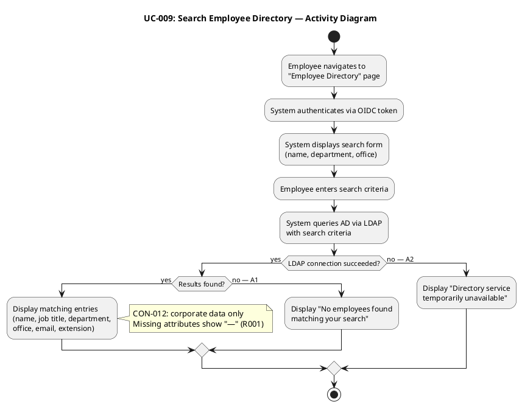

### UC-010: Manage Worker Category — DETAILED

| Field | Value |
|---|---|
| Source | FR-010 |
| Primary Actor | HR Administrator (ACT-002) |
| Trigger | HR Administrator selects "Manage Worker Categories" |
| Preconditions | HR Administrator is authenticated via Keycloak OIDC with HR role |
| Postconditions | Worker category link (AD user id → category) persisted in local PostgreSQL table; audit record created (NFR-004) |
| MoSCoW | Must |
| Volatility | Medium |

**Main Flow:**
1. HR Administrator navigates to "Manage Worker Categories" page.
2. System verifies HR role from OIDC token claims.
3. System displays current worker category assignments (AD user id, category) from the local table.
4. HR Administrator selects an employee (looks up AD user id via LDAP).
5. HR Administrator assigns or updates the worker category.
6. System validates the category value.
7. System persists the worker category link (AD user id, category) in the local PostgreSQL table (CON-009: two columns, nothing else).
8. System creates an audit record: author identity from OIDC token, timestamp, action=CategoryChanged (NFR-004).
9. System displays "Category updated successfully".

**Alternative Flows:**
- **A1: Employee not found in AD:** System displays "Employee not found in AD."
- **A2: Invalid category value:** System displays a validation error.

**Activity Diagram:**

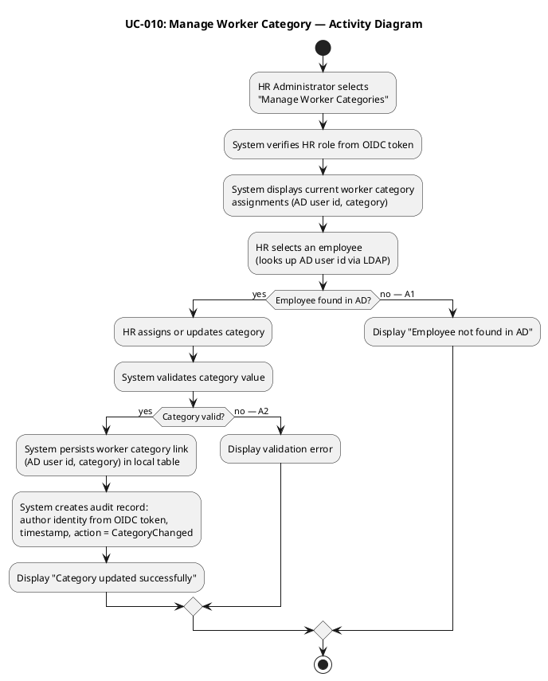
## Traceability
### Consolidated Requirements Traceability Flow

The following diagram shows the complete traceability chain from stakeholder needs (business goals) through declared features (FR-NNN) to use cases (UC-NNN) and acceptance criteria (AC-NNN). This consolidated view fulfills the Work Order's instruction to produce a consolidated requirements specification from all use cases and supplementary requirements.

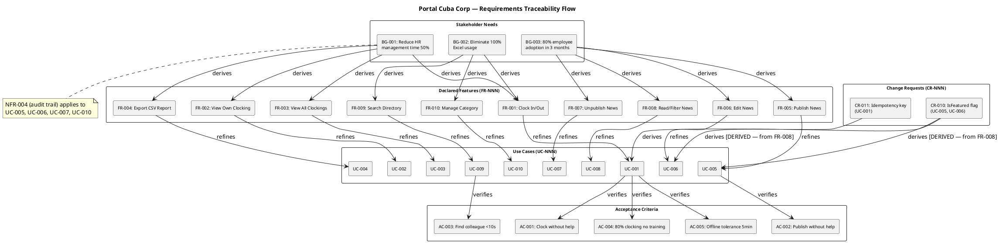

### Traceability Table

| Element | Traces From | Link Type | Traces To |
|---|---|---|---|
| UC-001 | FR-001, AC-005, CR-011 | Refines | REQ-001, REL-003, REL-004, PERF-002, AC-001, AC-004, AC-005 |
| UC-002 | FR-002 | Refines | REQ-002 |
| UC-003 | FR-003 | Refines | REQ-003, PERF-005, REL-006 |
| UC-004 | FR-004 | Refines | REQ-004, PERF-004, STD-003 |
| UC-005 | FR-005, NFR-004, CR-010 | Refines | REQ-005, AUD-001, AC-002 |
| UC-006 | FR-006, NFR-004, CR-010 | Refines | REQ-006, AUD-001 |
| UC-007 | FR-007, CON-013, NFR-004 | Refines | REQ-007, AUD-001, AUD-003 |
| UC-008 | FR-008 | Refines | REQ-008, USA-001 |
| UC-009 | FR-009, CON-005, CON-012 | Refines | REQ-009, SEC-004, SEC-005, PERF-003, SUP-003, R001, AC-003 |
| UC-010 | FR-010, CON-009, NFR-004 | Refines | REQ-010, AUD-002, DC-006 |
| ACT-001 | STK-004 | Derives | UC-001, UC-002, UC-008, UC-009 |
| ACT-002 | STK-001 | Derives | UC-003..UC-007, UC-010 |
| ACT-003 | CON-005, CON-009 | Derives | UC-003, UC-009, UC-010 |
| ACT-004 | CON-004 | Derives | All UCs (auth) |
| UC-001..UC-004 | BG-001, BG-002 | Derives | (Business Goals) |
| UC-005..UC-008 | BG-003 | Derives | (Business Goals) |
| UC-009 | BG-002 | Derives | (Business Goals) |
| UC-009 | R001 | DependsOn | (LDAP attribute consistency) |
| CR-010 | FR-008 | Derives | UC-005, UC-006 (IsFeatured flag) |
| CR-011 | AC-005 | Derives | UC-001 (idempotency key) |
