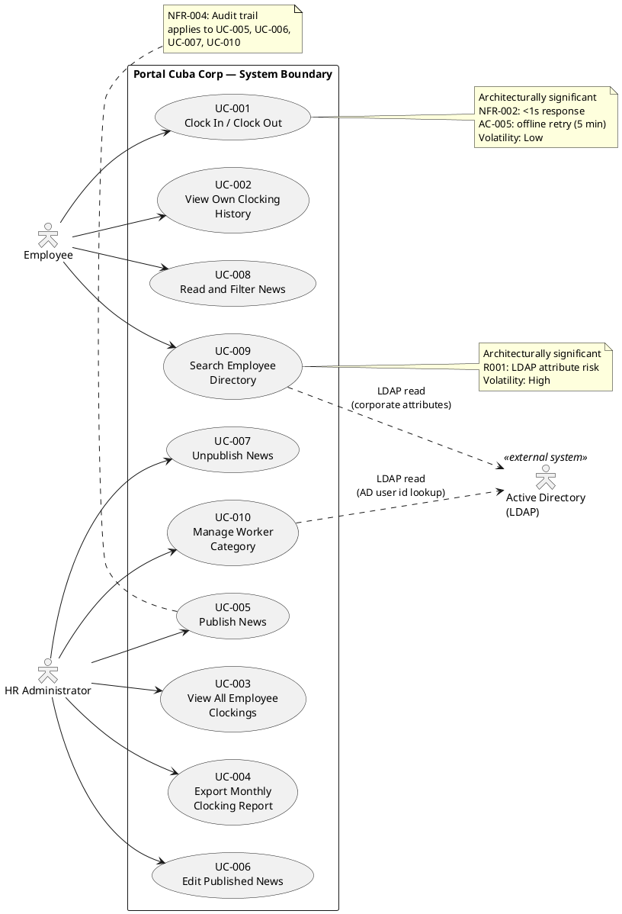
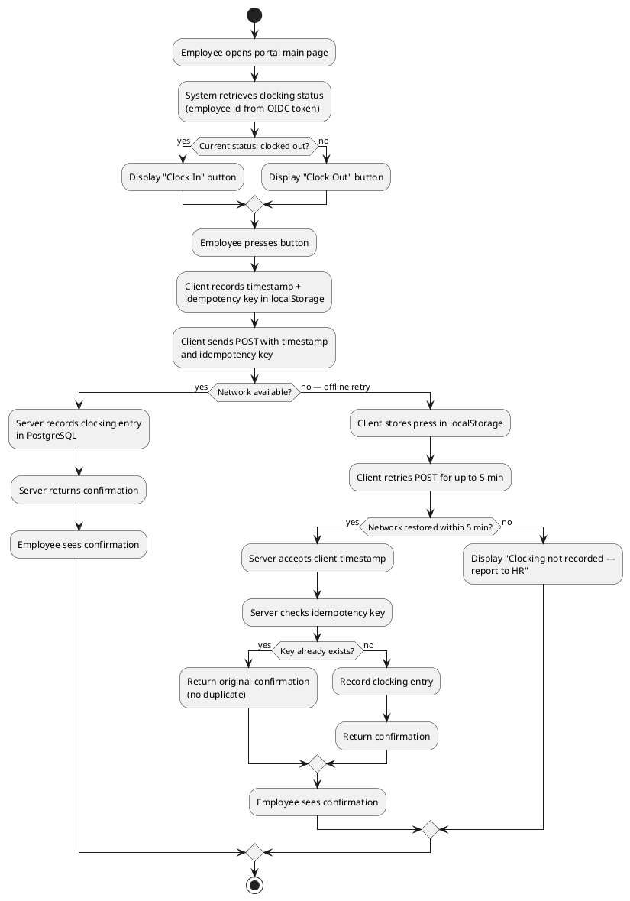
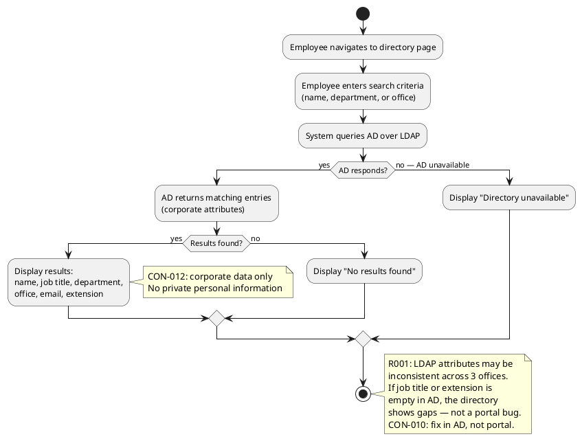

## Document Control

| Field | Value |
|---|---|
| Phase | Inception |
| Status | Draft |
| Milestone Target | End of Inception |
| Iteration | 2 (Cycle 1) |
| Date | 2026-08-28 |

## Use-Case Diagram

## Actors

| ID | Actor | Type | Description | Source |
|---|---|---|---|---|
| ACT-001 | Employee | Human (primary) | Any authenticated Cuba Corp employee (200 across 3 offices). Uses the portal for clocking, news reading, and directory search. | STK-004 |
| ACT-002 | HR Administrator | Human (primary) | HR staff member with elevated permissions (determined by OIDC role claims from Keycloak). Manages news, views all clockings, exports reports, manages worker categories. | STK-001 |
| ACT-003 | Active Directory (LDAP) | External system | Corporate directory accessed over LDAP for employee data (job title, department, office, email, extension). Read-only — the portal never writes to AD. | CON-005, CON-009 |

## Use-Case Survey

| UC ID | Name | Source | Primary Actor | MoSCoW | Volatility | Architecturally Significant | Detail Level |
|---|---|---|---|---|---|---|---|
| UC-001 | Clock In / Clock Out | FR-001 | Employee | Must | Low | Yes (NFR-002: <1s, AC-005: offline retry) | Detailed |
| UC-002 | View Own Clocking History | FR-002 | Employee | Must | Low | No | Outline |
| UC-003 | View All Employee Clockings | FR-003 | HR Administrator | Must | Low | No | Outline |
| UC-004 | Export Monthly Clocking Report | FR-004 | HR Administrator | Must | Low | No | Outline |
| UC-005 | Publish News | FR-005 | HR Administrator | Must | Medium | No | Outline |
| UC-006 | Edit Published News | FR-006 | HR Administrator | Must | Medium | No | Outline |
| UC-007 | Unpublish News | FR-007 | HR Administrator | Must | Low | No | Outline |
| UC-008 | Read and Filter News | FR-008 | Employee | Must | Medium | No | Outline |
| UC-009 | Search Employee Directory | FR-009 | Employee | Must | High | Yes (R001: LDAP risk) | Detailed |
| UC-010 | Manage Worker Category | FR-010 | HR Administrator | Must | Medium | No | Outline |

## Use-Case Specifications

### UC-001: Clock In / Clock Out — DETAILED

| Field | Value |
|---|---|
| Source | FR-001 |
| Primary Actor | Employee (ACT-001) |
| Trigger | Employee opens the portal main page |
| Preconditions | Employee is authenticated via Keycloak OIDC |
| Postconditions | Clocking record persisted in PostgreSQL with employee id, client-side timestamp, clock direction (in/out), and idempotency key; confirmation displayed |
| MoSCoW | Must |
| Volatility | Low |

**Main Flow:**
1. Employee navigates to the portal main page.
2. System retrieves the employee's current clocking status from the database (authenticated employee id from OIDC token).
3. System displays a "Clock In" or "Clock Out" button depending on current status.
4. Employee presses the button.
5. Client records the press timestamp and generates an idempotency key in localStorage.
6. Client sends POST request to server with timestamp and idempotency key.
7. Server records the clocking entry (employee id, client timestamp, direction, idempotency key) in PostgreSQL.
8. Server returns confirmation with the recorded time.
9. Employee sees confirmation on screen.

**Alternative Flows:**
- **A1: Network error during POST (offline retry — AC-005 resolved):** Client stores the press in localStorage and retries the POST for up to 5 minutes. When the network is restored, the server accepts the original client-side timestamp (the moment the employee pressed) and rejects duplicates by idempotency key. This is a page-level script on an already-rendered Razor page — no SPA, no client-side router (CON-002 stands). This is not the excluded sync work: one action, one queue, one entity, nothing to reconcile.
- **A2: Network not restored within 5 minutes:** Client stops retrying and displays "Clocking not recorded — report to HR." The employee reports the clocking to HR manually.
- **A3: Duplicate POST received (idempotency):** Server detects the idempotency key already exists in the clocking table and returns the original confirmation without creating a duplicate record.

**Activity Diagram:**

---

### UC-002: View Own Clocking History — OUTLINE

| Field | Value |
|---|---|
| Source | FR-002 |
| Primary Actor | Employee (ACT-001) |
| Trigger | Employee selects "My Clocking History" |
| Preconditions | Employee is authenticated |
| Postconditions | Employee sees their clocking records for the current month |
| MoSCoW | Must |
| Volatility | Low |

**Outline:** Employee views their own clocking history for the current month. Data is read from the portal's PostgreSQL database (not AD). Display includes date, clock-in time, clock-out time per day.

---

### UC-003: View All Employee Clockings — OUTLINE

| Field | Value |
|---|---|
| Source | FR-003 |
| Primary Actor | HR Administrator (ACT-002) |
| Trigger | HR selects "View All Clockings" |
| Preconditions | HR Administrator authenticated with HR role |
| Postconditions | HR sees clocking records for all employees |
| MoSCoW | Must |
| Volatility | Low |

**Outline:** HR views all employees' clocking records. Display includes employee name (resolved from AD), date, clock-in/out times. Filterable by employee and date range.

---

### UC-004: Export Monthly Clocking Report — OUTLINE

| Field | Value |
|---|---|
| Source | FR-004 |
| Primary Actor | HR Administrator (ACT-002) |
| Trigger | HR selects "Export CSV" |
| Preconditions | HR Administrator authenticated with HR role |
| Postconditions | CSV file downloaded with monthly clocking data |
| MoSCoW | Must |
| Volatility | Low |

**Outline:** HR exports a monthly clocking report in CSV format. The report includes all employees' clocking data for the selected month. Employee names are resolved from AD at export time.

---

### UC-005: Publish News — OUTLINE

| Field | Value |
|---|---|
| Source | FR-005 |
| Primary Actor | HR Administrator (ACT-002) |
| Trigger | HR selects "Publish News" |
| Preconditions | HR Administrator authenticated with HR role |
| Postconditions | News item published with title, body, date, category; audit record created (author + timestamp) |
| MoSCoW | Must |
| Volatility | Medium |

**Outline:** HR publishes internal news with title, body, date, and category (General, HR, IT, Events). Publication is audited — author and timestamp recorded (NFR-004). Published news is visible to all employees.

---

### UC-006: Edit Published News — OUTLINE

| Field | Value |
|---|---|
| Source | FR-006 |
| Primary Actor | HR Administrator (ACT-002) |
| Trigger | HR selects "Edit" on a published news item |
| Preconditions | HR Administrator authenticated with HR role; news item exists and is published |
| Postconditions | News item updated; audit record created (editor + timestamp) |
| MoSCoW | Must |
| Volatility | Medium |

**Outline:** HR edits a published news item (title, body, category). Every edit is audited exactly like the original publication — who and when (NFR-004). A typo should not force a republish.

---

### UC-007: Unpublish News — OUTLINE

| Field | Value |
|---|---|
| Source | FR-007 |
| Primary Actor | HR Administrator (ACT-002) |
| Trigger | HR selects "Unpublish" on a news item |
| Preconditions | HR Administrator authenticated with HR role; news item is published |
| Postconditions | News item hidden from employees; record preserved (never deleted); audit record created |
| MoSCoW | Must |
| Volatility | Low |

**Outline:** HR unpublishes a news item, which hides it from employees but never deletes it (CON-013). The record stays for traceability and audit (NFR-004). Unpublishing is audited — who and when.

---

### UC-008: Read and Filter News — OUTLINE

| Field | Value |
|---|---|
| Source | FR-008 |
| Primary Actor | Employee (ACT-001) |
| Trigger | Employee opens the portal main page |
| Preconditions | Employee is authenticated |
| Postconditions | Employee sees published news sorted by date, optionally filtered by category |
| MoSCoW | Must |
| Volatility | Medium |

**Outline:** Employees see news on the main page sorted by date. They can filter by category (General, HR, IT, Events). Featured news appears with a banner at the top. Read-only — no comments or reactions.

---

### UC-009: Search Employee Directory — DETAILED

| Field | Value |
|---|---|
| Source | FR-009 |
| Primary Actor | Employee (ACT-001) |
| Trigger | Employee enters search criteria in the directory |
| Preconditions | Employee is authenticated via Keycloak OIDC |
| Postconditions | Matching employee entries displayed with corporate data from AD |
| MoSCoW | Must |
| Volatility | High |

**Main Flow:**
1. Employee navigates to the directory page.
2. Employee enters search criteria: name, department, or office.
3. System queries Active Directory over LDAP with the search criteria.
4. AD returns matching entries with corporate attributes (name, job title, department, office, email, extension).
5. System displays results in a list.
6. Employee views colleague's corporate contact information.

**Alternative Flows:**
- **A1: No results found:** System displays "No results found" message.
- **A2: LDAP attribute missing (R001):** If a corporate attribute (e.g., extension) is empty in AD for a given employee, the directory shows that field as blank or "N/A" — this is an AD data quality issue, not a portal bug (CON-010). The employee should report the gap to the Infrastructure team.
- **A3: AD unavailable:** System displays "Directory unavailable — please try again later" message.

**Activity Diagram:**

---

### UC-010: Manage Worker Category — OUTLINE

| Field | Value |
|---|---|
| Source | FR-010 |
| Primary Actor | HR Administrator (ACT-002) |
| Trigger | HR selects "Manage Worker Categories" |
| Preconditions | HR Administrator authenticated with HR role |
| Postconditions | Worker category link (AD user id → category) created/updated; audit record created |
| MoSCoW | Must |
| Volatility | Medium |

**Outline:** HR assigns or updates a worker category for an employee. The local table stores only two columns: AD user id and category. The portal reads the rest of the employee data from AD at read time (CON-009). Any change to a worker's category is audited (NFR-004). No synchronization, no reconciliation, no conflict resolution.

## Traceability

| Element | Traces From | Link Type | Traces To |
|---|---|---|---|
| UC-001 | FR-001, AC-005 | Refines | REQ-001, REL-003, REL-004 |
| UC-002 | FR-002 | Refines | REQ-002 |
| UC-003 | FR-003 | Refines | REQ-003 |
| UC-004 | FR-004 | Refines | REQ-004 |
| UC-005 | FR-005, NFR-004 | Refines | REQ-005 |
| UC-006 | FR-006, NFR-004 | Refines | REQ-006 |
| UC-007 | FR-007, CON-013, NFR-004 | Refines | REQ-007 |
| UC-008 | FR-008 | Refines | REQ-008 |
| UC-009 | FR-009, CON-005, CON-012 | Refines | REQ-009 |
| UC-010 | FR-010, CON-009, NFR-004 | Refines | REQ-010 |
| ACT-001 | STK-004 | Derives | UC-001, UC-002, UC-008, UC-009 |
| ACT-002 | STK-001 | Derives | UC-003..UC-007, UC-010 |
| ACT-003 | CON-005, CON-009 | Derives | UC-009, UC-010 |
| UC-009 | R001 | DependsOn | (LDAP attribute consistency) |