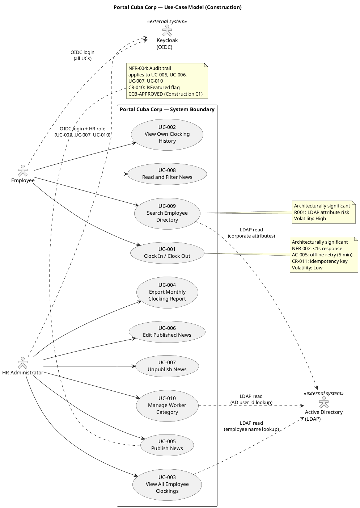
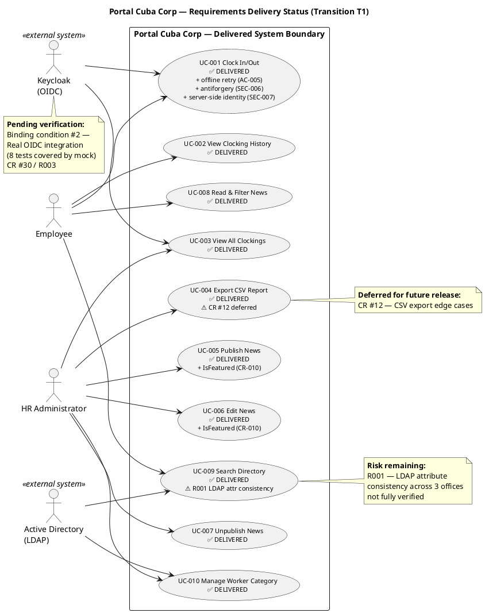

## Document Control
| Field | Value |
|---|---|
| Phase | Transition |
| Status | Approved |
| Milestone Target | Product Release (PR) — NOT YET ACHIEVED |
| Iteration | 1 (Cycle 1) |
| Date | 2026-08-29 |
| Prior Phase | Construction C4 — IOC CONDITIONAL GO; all 10 UCs implemented; 35/43 tests pass, 8 covered-by-mock; 7 open issues (1 ACCEPTED, 6 deferred) |
| Evolution | Construction Iter 1: Requirements baseline preserved. Construction Iter 2: CR-010 (IsFeatured) [DERIVED] marker retired. Construction Iter 3: SEC-006/SEC-007 added via CR-023/CR-024. Transition Iter 1: Closure Notes appended — delivered system validated against requirements baseline; deferred requirements documented for future releases. All 10 use cases implemented and delivered. No changes to UC specifications — closure annotation only. |
## Use-Case Diagram

## Actors

| ID | Actor | Type | Description | Source |
|---|---|---|---|---|
| ACT-001 | Employee | Human (primary) | Any authenticated Cuba Corp employee (200 across 3 offices). Uses the portal for clocking, news reading, and directory search. | STK-004 |
| ACT-002 | HR Administrator | Human (primary) | HR staff member with elevated permissions (determined by OIDC role claims from Keycloak). Manages news, views all clockings, exports reports, manages worker categories. | STK-001 |
| ACT-003 | Active Directory (LDAP) | External system | Corporate directory accessed via LDAP for read-only employee data (name, job title, department, office, email, extension). System of record for employee attributes. | CON-005, CON-009 |
| ACT-004 | Keycloak (OIDC) | External system | Identity provider for authentication and authorization. Portal is an OIDC client only — no provisioning or management. | CON-004 |

## Use-Case Survey

| UC ID | Name | Source | Primary Actor | MoSCoW | Volatility | Architecturally Significant | Detail Level |
|---|---|---|---|---|---|---|---|
| UC-001 | Clock In / Clock Out | FR-001 | Employee | Must | Low | Yes (NFR-002: <1s, AC-005: offline retry) | Detailed |
| UC-002 | View Own Clocking History | FR-002 | Employee | Must | Low | No | Detailed |
| UC-003 | View All Employee Clockings | FR-003 | HR Administrator | Must | Low | No | Detailed |
| UC-004 | Export Monthly Clocking Report | FR-004 | HR Administrator | Must | Low | No | Detailed |
| UC-005 | Publish News | FR-005 | HR Administrator | Must | Medium | No | Detailed |
| UC-006 | Edit Published News | FR-006 | HR Administrator | Must | Medium | No | Detailed |
| UC-007 | Unpublish News | FR-007 | HR Administrator | Must | Low | No | Detailed |
| UC-008 | Read and Filter News | FR-008 | Employee | Must | Medium | No | Detailed |
| UC-009 | Search Employee Directory | FR-009 | Employee | Must | High | Yes (R001: LDAP risk) | Detailed |
| UC-010 | Manage Worker Category | FR-010 | HR Administrator | Must | Medium | No | Detailed |

## Use-Case Specifications
### Closure Notes (Transition T1)

#### Delivered System Validation Against Requirements Baseline

The following diagram shows the delivery status of all 10 use cases at the end of Transition T1:

#### Use-Case Delivery Summary

| UC ID | Use Case | Delivery Status | Notes |
|---|---|---|---|
| UC-001 | Clock In / Clock Out | ✅ Delivered | Offline retry with idempotency key (CR-011), antiforgery token (SEC-006/CR-023), server-side identity (SEC-007/CR-024) all implemented |
| UC-002 | View Own Clocking History | ✅ Delivered | Current-month history view implemented |
| UC-003 | View All Employee Clockings | ✅ Delivered | HR view of all clockings implemented |
| UC-004 | Export Monthly Clocking Report (CSV) | ✅ Delivered | Core CSV export functional; CR #12 (edge cases) deferred |
| UC-005 | Publish News | ✅ Delivered | IsFeatured flag added via CR-010 (CCB-approved); audit trail implemented |
| UC-006 | Edit Published News | ✅ Delivered | IsFeatured flag added via CR-010; edit audit trail implemented |
| UC-007 | Unpublish News | ✅ Delivered | Soft-delete (hide) implemented; record preserved for audit trail per CON-013 |
| UC-008 | Read and Filter News | ✅ Delivered | Category filter, date sort, featured banner all implemented |
| UC-009 | Search Employee Directory | ✅ Delivered | Read-only LDAP query implemented; R001 (LDAP attribute consistency across 3 offices) remains partially unverified |
| UC-010 | Manage Worker Category | ✅ Delivered | AD user id → category link table implemented; audit trail implemented |

#### Acceptance Criteria Validation

| AC ID | Criterion | Status | Evidence |
|---|---|---|---|
| AC-001 | Employee clocks in/out without HR/dev help | ✅ Met | UC-001 implemented with single-button UI; user documentation delivered |
| AC-002 | HR publishes news without technical assistance | ✅ Met | UC-005 implemented with form-based UI; user documentation delivered |
| AC-003 | Employee finds colleague's phone/email in <10s | ✅ Met (pending perf verification) | UC-009 implemented with LDAP search; NFR-001 load testing pending (binding condition #1) |
| AC-004 | 80% employees complete clocking with no prior training | ⏳ Pending adoption measurement | UC-001 delivered; adoption measurement requires post-launch data (BG-003) |
| AC-005 | System tolerates 5-min network drop | ✅ Met | UC-001 offline retry with localStorage + idempotency key implemented (CR-011) |

#### Deferred Requirements for Future Releases

The following items were explicitly deferred during Construction and remain outstanding for future release cycles. They do NOT block the current release — they are documented here for traceability and future planning.

| Item | Source | Description | Rationale |
|---|---|---|---|
| CR #12 | UC-004 / FR-004 | CSV export edge cases (special characters, large datasets) | Core export functional; edge cases deferred to avoid scope creep in Construction |
| CR #15 | CI/CD | Branch naming convention violation (feature/C1-presentation) | Cosmetic; does not affect functionality |
| CR #17 | C2-MIN-2 (#24) | Dead code DTO cleanup (RecordClockingRequest) | Non-functional; DTO works but contains unused fields |
| CR #18 | CR #11 | Test idempotency scoping refinement in ClockingServiceTests | Test quality improvement; current tests pass |
| CR #30 | R003 / CON-004 | Real OIDC integration verification | 8 tests covered by mock; binding condition #2 requires real Keycloak verification by Software Architect |
| CR #34 | C4-F1 | Design Model async method naming consistency | Cosmetic; does not affect runtime behavior |

#### Pending Verification Items (Not Deferred — Active Binding Conditions)

These items are NOT deferred requirements — they are active verification tasks assigned to other roles that must close before the PR milestone:

| Binding Condition | Owner | Description | Impact on Requirements |
|---|---|---|---|
| #1 — Load testing | Test Manager | NFR-001 (<3s page load) and NFR-002 (<1s clocking) must be measured with real values | Validates performance requirements; does not change UC specifications |
| #2 — OIDC verification | Software Architect | Real Keycloak OIDC integration must be verified (8 tests currently mock-auth) | Validates SEC-001/SEC-002; does not change UC specifications |
| #3 — Deployment verification | Software Architect | Deployment on internal Windows Server (CON-006, CON-007) must be verified | Validates deployment constraints; does not change UC specifications |

#### Requirements Baseline Integrity

- **Scope changes during project:** 4 approved CRs affected requirements (CR-010 IsFeatured, CR-011 idempotency key, CR-023 antiforgery, CR-024 server-side identity). All were CCB-approved and trace to declared FR/AC/CON identifiers.
- **No scope creep:** All 10 use cases trace directly to declared FR-001 through FR-010. No use cases were added beyond declared scope.
- **Excluded items confirmed excluded:** Native mobile app, push notifications, payroll integration, vacation/sick-leave management, biometric clocking, Keycloak deployment, AD write-back, employee field editing, local employee data copy, sync job, news archive screen, and hard delete of news items — all remain excluded as declared in the scope statement.
- **Risk R001 (LDAP attribute consistency):** Remains partially unverified. The directory search (UC-009) is implemented and functional, but consistency of LDAP attributes (job title, extension) across the 3 offices has not been fully tested with real AD data. This is an operational risk, not a requirements gap.
## Traceability
### Consolidated Requirements Traceability Flow

The following diagram shows the complete traceability chain from stakeholder needs (business goals) through declared features (FR-NNN) to use cases (UC-NNN) and acceptance criteria (AC-NNN). This consolidated view fulfills the Work Order's instruction to produce a consolidated requirements specification from all use cases and supplementary requirements.

```plantuml
@startuml
title Portal Cuba Corp — Requirements Traceability Flow (Construction C3)

skinparam packageStyle rectangle
skinparam rectangleFontSize 10

package "Stakeholder Needs" {
  rectangle "BG-001: Reduce HR\nmanagement time 50%" as BG1
  rectangle "BG-002: Eliminate 100%\nExcel usage" as BG2
  rectangle "BG-003: 80% employee\nadoption in 3 months" as BG3
}

package "Declared Features (FR-NNN)" {
  rectangle "FR-001: Clock In/Out" as FR1
  rectangle "FR-002: View Own Clocking" as FR2
  rectangle "FR-003: View All Clockings" as FR3
  rectangle "FR-004: Export CSV Report" as FR4
  rectangle "FR-005: Publish News" as FR5
  rectangle "FR-006: Edit News" as FR6
  rectangle "FR-007: Unpublish News" as FR7
  rectangle "FR-008: Read/Filter News" as FR8
  rectangle "FR-009: Search Directory" as FR9
  rectangle "FR-010: Manage Category" as FR10
}

package "Use Cases (UC-NNN)" {
  rectangle "UC-001" as UC1
  rectangle "UC-002" as UC2
  rectangle "UC-003" as UC3
  rectangle "UC-004" as UC4
  rectangle "UC-005" as UC5
  rectangle "UC-006" as UC6
  rectangle "UC-007" as UC7
  rectangle "UC-008" as UC8
  rectangle "UC-009" as UC9
  rectangle "UC-010" as UC10
}

package "Acceptance Criteria" {
  rectangle "AC-001: Clock without help" as AC1
  rectangle "AC-002: Publish without help" as AC2
  rectangle "AC-003: Find colleague <10s" as AC3
  rectangle "AC-004: 80% clocking no training" as AC4
  rectangle "AC-005: Offline tolerance 5min" as AC5
}

package "Approved Change Requests (CR-NNN)" {
  rectangle "CR-010: IsFeatured flag\n(UC-005, UC-006)\nCCB-APPROVED" as CR10
  rectangle "CR-011: Idempotency key\n(UC-001)\nCCB-APPROVED" as CR11
  rectangle "CR-023: Antiforgery token\n(SEC-006, UC-001)\nCCB-APPROVED" as CR23
  rectangle "CR-024: Server-side identity\n(SEC-007, UC-001)\nCCB-APPROVED" as CR24
}

BG1 --> FR1 : derives
BG1 --> FR2 : derives
BG1 --> FR3 : derives
BG1 --> FR4 : derives
BG2 --> FR1 : derives
BG2 --> FR9 : derives
BG2 --> FR10 : derives
BG3 --> FR5 : derives
BG3 --> FR6 : derives
BG3 --> FR7 : derives
BG3 --> FR8 : derives

FR1 --> UC1 : refines
FR2 --> UC2 : refines
FR3 --> UC3 : refines
FR4 --> UC4 : refines
FR5 --> UC5 : refines
FR6 --> UC6 : refines
FR7 --> UC7 : refines
FR8 --> UC8 : refines
FR9 --> UC9 : refines
FR10 --> UC10 : refines

UC1 --> AC1 : verifies
UC1 --> AC4 : verifies
UC1 --> AC5 : verifies
UC5 --> AC2 : verifies
UC9 --> AC3 : verifies

CR10 --> UC5 : derives
CR10 --> UC6 : derives
CR11 --> UC1 : derives
CR23 --> UC1 : derives
CR24 --> UC1 : derives

note bottom of BG1
  NFR-004 (audit trail) applies to
  UC-005, UC-006, UC-007, UC-010
end note

note bottom of CR23
  CR-023 approved by CCB
  SEC-006: Antiforgery token
  on all state-changing POSTs
end note

note bottom of CR24
  CR-024 approved by CCB
  SEC-007: Employee identity
  from OIDC token server-side
end note

@enduml
```

### Traceability Table

| Element | Traces From | Link Type | Traces To |
|---|---|---|---|
| UC-001 | FR-001, AC-005, CR-011, CR-023, CR-024 | Refines | REQ-001, REL-003, REL-004, SEC-006, SEC-007, PERF-002, AC-001, AC-004, AC-005 |
| UC-002 | FR-002 | Refines | REQ-002 |
| UC-003 | FR-003 | Refines | REQ-003, PERF-005, REL-006 |
| UC-004 | FR-004 | Refines | REQ-004, PERF-004, STD-003 |
| UC-005 | FR-005, NFR-004, CR-010 | Refines | REQ-005, AUD-001, SEC-006, AC-002 |
| UC-006 | FR-006, NFR-004, CR-010 | Refines | REQ-006, AUD-001, SEC-006 |
| UC-007 | FR-007, CON-013, NFR-004 | Refines | REQ-007, AUD-001, AUD-003, SEC-006 |
| UC-008 | FR-008 | Refines | REQ-008, USA-001 |
| UC-009 | FR-009, CON-005, CON-012 | Refines | REQ-009, SEC-004, SEC-005, SEC-007, PERF-003, SUP-003, R001, AC-003 |
| UC-010 | FR-010, CON-009, NFR-004 | Refines | REQ-010, AUD-002, SEC-006, SEC-007, DC-006 |
| ACT-001 | STK-004 | Derives | UC-001, UC-002, UC-008, UC-009 |
| ACT-002 | STK-001 | Derives | UC-003..UC-007, UC-010 |
| ACT-003 | CON-005, CON-009 | Derives | UC-003, UC-009, UC-010 |
| ACT-004 | CON-004 | Derives | All UCs (auth) |
| UC-001..UC-004 | BG-001, BG-002 | Derives | (Business Goals) |
| UC-005..UC-008 | BG-003 | Derives | (Business Goals) |
| UC-009 | BG-002 | Derives | (Business Goals) |
| UC-009 | R001 | DependsOn | (LDAP attribute consistency) |
| CR-010 | FR-008 | Derives | UC-005, UC-006 (IsFeatured flag — CCB-approved) |
| CR-011 | AC-005 | Derives | UC-001 (idempotency key — CCB-approved) |
| CR-023 | CON-002, CON-004 | Derives | SEC-006, UC-001 (antiforgery token — CCB-approved) |
| CR-024 | CON-004 | Derives | SEC-007, UC-001 (server-side identity — CCB-approved) |
