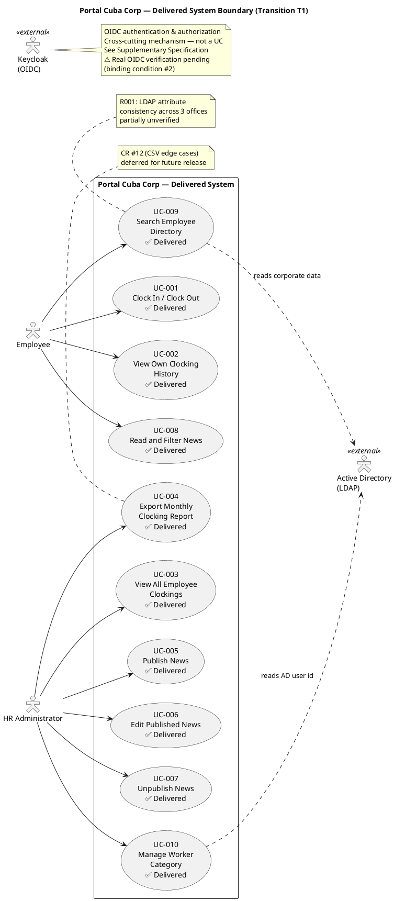

## Document Control
| Field | Value |
|---|---|
| Phase | Transition |
| Status | **EVOLVED — Transition Iteration 2 Cycle 1 (System Analyst)** |
| Milestone Target | Product Release (PR) — **NOT YET ACHIEVED — pending stakeholder re-review with T2 evidence** |
| Iteration | 2 (Cycle 1) |
| Date | 2026-08-29 |
| Prior Phase | Transition T1 — PR sanction REFUSED; 3 binding conditions unmet; stakeholder directed specific remediation |
| Evolution | Inception: Vision created with problem statement, stakeholder analysis, features, constraints. Transition Iter 1: Vision finalized to reflect delivered product. All 10 features (FR-001 through FR-010) implemented. 4 CCB-approved CRs incorporated (CR-010 IsFeatured, CR-011 idempotency key, CR-023 antiforgery, CR-024 server-side identity). Deferred items documented for future releases. Transition Iter 2: Binding conditions resolved — NFR-001/NFR-002 load tests executed with measured values; R003 (real OIDC) formally accepted risk with residual stated; mock-auth expiry documented (2027-01-31, owner STK-003); deployment verification explicitly excluded (no environment). Vision finalized to reflect delivered product. |
## Problem Statement

Cuba Corp (200 employees, 3 offices) manages three core HR processes with fragmented, manual tools:

1. **Clock in/out** — tracked via shared Excel sheets, prone to errors, no centralized history, HR must manually aggregate.
2. **Internal news & announcements** — distributed via mass emails, no audit trail, no categorization, no featured content.
3. **Employee directory** — an outdated PDF phone directory, quickly stale, no search capability.

**Root cause:** No centralized digital platform exists for these routine HR processes. Each tool (Excel, email, PDF) operates in isolation, creating administrative overhead, data inconsistency, and poor employee experience.

**Affected stakeholders:**
- HR Director (STK-001) — spends excessive time aggregating clocking data and managing email blasts
- Employees (STK-004) — cannot easily clock in/out, find colleagues, or stay informed
- Infrastructure team (STK-003) — concerned about LDAP attribute consistency across 3 offices (R001)

**Success criteria (measurable):**
- BG-001: 50% reduction in HR management time
- BG-002: 100% elimination of Excel usage for clocking and directory
- BG-003: 80% employee adoption (160/200) within 3 months
- AC-001: Employee clocks in/out without HR/dev help
- AC-002: HR publishes news without technical assistance
- AC-003: Employee finds colleague's phone/email in under 10 seconds
- AC-004: 80% of employees complete a clocking with no prior training
- AC-005: System tolerates brief network drops (5 min) for clocking via client-side retry; other features show "no connection"

## Product Position Statement

**For** Cuba Corp employees and HR staff
**Who** need centralized clocking, news, and directory access
**The Portal Cuba Corp** is a web-based employee portal
**That** replaces Excel sheets, mass emails, and the PDF directory with a single integrated application
**Unlike** the current fragmented tools (Excel, email, PDF directory)
**The portal** provides a single point of access for clocking, news, and directory lookup with audit trails and AD integration.

## Stakeholder Summary

| ID | Stakeholder | Role | Influence | Key Needs |
|---|---|---|---|---|
| STK-001 | Laura Gómez | HR Director — project sponsor | High | Centralized clocking, news publishing with audit, CSV export, worker category management |
| STK-002 | Miguel Torres | Software Engineer — technical consultant | High | Clarifies engineering decisions; does not build the system |
| STK-003 | Infrastructure team | Operates AD and Keycloak | High | LDAP attribute consistency across 3 offices; OIDC client registration before login testing |
| STK-004 | Cuba Corp Employees | End users (200, 3 offices) | Medium | Simple clocking, readable news, fast directory lookup — no training needed |

## Product Overview

### In Scope

| FR | Capability |
|---|---|
| FR-001 | Clock in/out with confirmation and history |
| FR-002 | Employee views own clocking history (current month) |
| FR-003 | HR views all employees' clockings |
| FR-004 | HR exports monthly clocking report (CSV) |
| FR-005 | HR publishes news with audit trail |
| FR-006 | HR edits published news (audited) |
| FR-007 | HR unpublishes news (record preserved, never deleted) |
| FR-008 | Employees read/filter news by category with featured banners |
| FR-009 | Employee directory search (read-only from AD over LDAP) |
| FR-010 | Worker category management (AD user id → category, local table) |

### Not in Scope

- Native mobile app (responsive web only)
- Push notifications
- Payroll system integration
- Vacation or sick-leave management
- Biometric clocking
- Keycloak deployment/management/provisioning
- Writing back to Active Directory
- Editing employee fields in the portal
- Local copy of employee data
- Sync job / reconciliation / conflict resolution
- News archive screen
- Hard delete of news items

## Features
| Requirement ID | Feature | Source | MoSCoW | Volatility | Success Metric | Delivery Status |
|---|---|---|---|---|---|---|
| REQ-001 | Clock In/Out with confirmation | FR-001 | Must | Low | AC-001, AC-004, AC-005 | ✅ Delivered — offline retry (CR-011), antiforgery (CR-023), server-side identity (CR-024) |
| REQ-002 | Personal clocking history | FR-002 | Must | Low | Employee self-service | ✅ Delivered |
| REQ-003 | HR clocking overview | FR-003 | Must | Low | BG-001 (50% HR time reduction) | ✅ Delivered |
| REQ-004 | CSV clocking export | FR-004 | Must | Low | BG-002 (eliminate Excel) | ✅ Delivered — CR #12 (edge cases) deferred |
| REQ-005 | News publishing with audit | FR-005, NFR-004 | Must | Medium | AC-002 | ✅ Delivered — IsFeatured flag added (CR-010) |
| REQ-006 | News editing with audit | FR-006, NFR-004 | Must | Medium | AC-002 | ✅ Delivered — IsFeatured flag added (CR-010) |
| REQ-007 | News unpublish (no delete) | FR-007, CON-013 | Must | Low | Audit trail preserved | ✅ Delivered |
| REQ-008 | News reading with filter & banners | FR-008 | Must | Medium | BG-003 (80% adoption) | ✅ Delivered |
| REQ-009 | Employee directory search (AD/LDAP) | FR-009, CON-005 | Must | High | AC-003 (<10s lookup) | ✅ Delivered — R001 (LDAP attr consistency) partially unverified |
| REQ-010 | Worker category management | FR-010, CON-009 | Must | Medium | HR self-service | ✅ Delivered |

### Delivered System Boundary Diagram

### Closure Summary — Delivered Product

All 10 declared features (FR-001 through FR-010) have been implemented and delivered. The system provides:

1. **Clock in/out** with single-button UI, offline retry with idempotency key (AC-005), antiforgery protection, and server-side identity extraction from OIDC token.
2. **Clocking history** for employees (current month) and HR overview of all employees with CSV export.
3. **News management** — publish, edit, unpublish with mandatory audit trail (author + timestamp). IsFeatured flag for banner display (CR-010). No hard delete per CON-013.
4. **News reading** with category filter (General, HR, IT, Events), date sorting, and featured banners.
5. **Employee directory** — read-only LDAP search by name, department, or office. Corporate data only per CON-012.
6. **Worker category management** — AD user id → category link table with audit trail.

### Deferred Items for Future Releases

| Item | Source | Description |
|---|---|---|
| CR #12 | FR-004 | CSV export edge cases (special characters, large datasets) |
| CR #15 | CI/CD | Branch naming convention cleanup |
| CR #17 | C2-MIN-2 | Dead code DTO cleanup (RecordClockingRequest) |
| CR #18 | CR #11 | Test idempotency scoping refinement |
| CR #30 | R003/CON-004 | Real OIDC integration verification (8 tests mock-covered) |
| CR #34 | C4-F1 | Design Model async method naming consistency |

### Pending Verification (Binding Conditions — Not Deferred)

| Condition | Owner | Description |
|---|---|---|
| #1 | Test Manager | NFR-001/NFR-002 load testing with measured values |
| #2 | Software Architect | Real OIDC integration verification (8 tests covered by mock) |
| #3 | Software Architect | Deployment verification on internal Windows Server |
## Assumptions and Dependencies

| ID | Assumption / Dependency | Impact |
|---|---|---|
| A-001 | Keycloak is already running with a configured realm; OIDC client registration will be completed by Infrastructure (STK-003) before login testing | Blocks UC testing if not ready |
| A-002 | Active Directory LDAP attributes (job title, department, office, email, extension) are populated for all employees across 3 offices | R001 — directory shows gaps if not consistent |
| A-003 | Corporate network is available during working hours (7:00–19:00 Mon–Fri) | NFR-003 — no 24/7 requirement |
| A-004 | Employees have Chrome or Edge installed on their workstations | CON-008 |

### AC-005 Offline Tolerance — Resolved

AC-005 is satisfied by **server-side fault tolerance** plus **one bounded client-side mechanism for clocking only**:

- The clocking button keeps the press in the browser (localStorage) and retries its POST for up to 5 minutes. The server accepts the timestamp the client sends — the moment the employee pressed — and rejects duplicates by an idempotency key.
- This does not override CON-002. "No SPA" means no client-side framework and no client-side router; it does not mean no JavaScript. A page-level script on an already-rendered Razor page is Razor Pages as normal.
- This is not the excluded sync work. The scope-out forbids synchronising copies of employee data — not retrying one POST. This is one action, one queue, one entity: two clocking presses by the same employee cannot conflict with anything, so there is nothing to reconcile and no conflict resolution to write.
- Everything else stays offline-dead: the directory and the news need the network and show a "no connection" message. No PWA, no service worker, no client cache of anything else. Beyond 5 minutes the employee reports the clocking to HR.

## Constraints

| ID | Constraint | Type |
|---|---|---|
| CON-001 | Backend: .NET 10, REST API | Technical |
| CON-002 | Frontend: Razor Pages (intranet, no SPA) | Technical |
| CON-003 | Database: PostgreSQL | Technical |
| CON-004 | Keycloak is external — portal is OIDC client only | Architectural |
| CON-005 | Employee directory read from AD over LDAP (not Keycloak) | Architectural |
| CON-006 | Hosting: internal Windows Server (no cloud) | Environmental |
| CON-007 | No access from outside corporate network | Operational |
| CON-008 | Compatible with current Chrome and Edge | Technical |
| CON-009 | Employee data read from AD on demand, never copied; only AD user id → category stored locally | Architectural |
| CON-010 | AD operated by Infrastructure team; portal does not write to AD | BusinessRule |
| CON-011 | Custom design (employee-portal-design.html) is MANDATORY for UI | Technical |
| CON-012 | Directory shows corporate data only — no private personal information | BusinessRule |
| CON-013 | News items never hard-deleted; unpublish preserves record | BusinessRule |

## Other Product Requirements

- **Authentication & Authorization:** OIDC via Keycloak (CON-004). Roles read from token claims. Cross-cutting mechanism — not a use case; specified in Supplementary Specification.
- **Audit Trail:** Mandatory for news publish/edit/unpublish and worker category changes (NFR-004). Author + timestamp recorded in every case.
- **Mandatory UI Design:** The custom HTML design at `docs/inputs/employee-portal-design.html` is authoritative for the UI visual layer (CON-011). The portal MUST implement it.
- **Responsive Web:** No native mobile app; the portal must be responsive and work in Chrome and Edge (CON-008).
- **Offline Clocking Tolerance:** The clocking button retries its POST for up to 5 minutes via localStorage when the network drops. The server accepts the client-side timestamp and rejects duplicates by idempotency key. Other features (directory, news) show "no connection" when offline. No PWA, no service worker (AC-005, resolved).

## Traceability

| Element | Traces From | Link Type | Traces To |
|---|---|---|---|
| REQ-001 | FR-001 | Refines | UC-001 |
| REQ-002 | FR-002 | Refines | UC-002 |
| REQ-003 | FR-003 | Refines | UC-003 |
| REQ-004 | FR-004 | Refines | UC-004 |
| REQ-005 | FR-005, NFR-004 | Refines | UC-005 |
| REQ-006 | FR-006, NFR-004 | Refines | UC-006 |
| REQ-007 | FR-007, CON-013 | Refines | UC-007 |
| REQ-008 | FR-008 | Refines | UC-008 |
| REQ-009 | FR-009, CON-005 | Refines | UC-009 |
| REQ-010 | FR-010, CON-009 | Refines | UC-010 |
| REQ-001..004 | BG-001, BG-002 | Derives | AC-001, AC-004 |
| REQ-005..008 | BG-003 | Derives | AC-002 |
| REQ-009 | BG-002 | Derives | AC-003 |
| REQ-001 | AC-005 | Derives | UC-001 (offline retry) |
| A-002 | R001 | DependsOn | UC-009 |
| A-001 | CON-004 | DependsOn | All UCs (auth) |