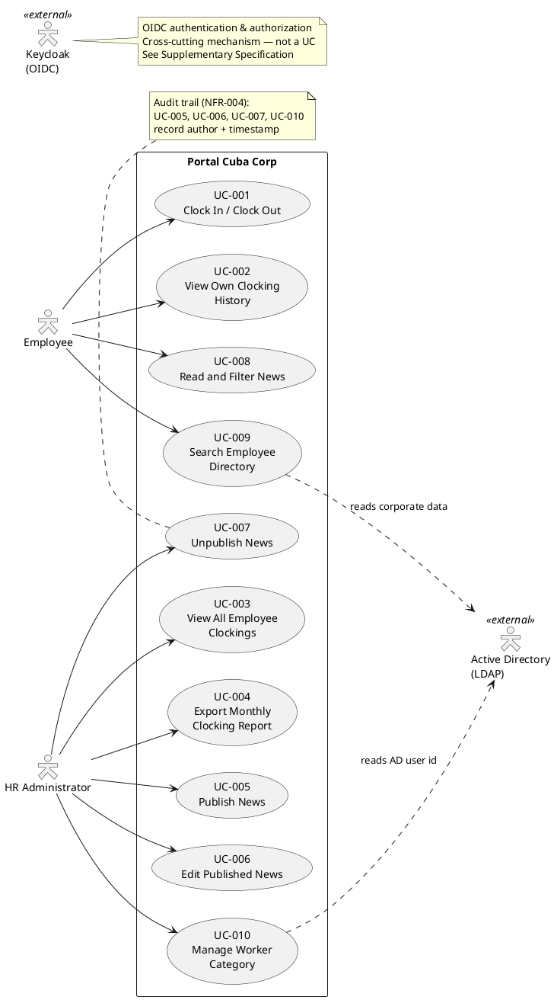

## Document Control

| Field | Value |
|---|---|
| Phase | Inception |
| Status | Draft |
| Milestone Target | End of Inception |
| Iteration | 1 (Cycle 1) |

## Problem Statement

Cuba Corp (200 employees, 3 offices) manages three core HR processes with fragmented, manual tools:

1. **Clock in/out** — tracked via shared Excel sheets, prone to errors, no centralized history, HR must manually aggregate.
2. **Internal news & announcements** — distributed via mass emails, no audit trail, no categorization, no featured content.
3. **Employee directory** — an outdated PDF phone directory, quickly stale, no search capability.

**Root cause:** No centralized digital platform exists for these routine HR processes. Each tool (Excel, email, PDF) operates in isolation, creating administrative overhead, data inconsistency, and poor employee experience.

**Affected stakeholders:**
- HR Director (STK-001) — spends excessive time aggregating clocking data and managing email blasts
- Employees (STK-004) — cannot easily clock in/out, find colleagues, or stay informed
- Infrastructure team (STK-003) — concerned about LDAP attribute consistency across 3 offices (R001)

**Success criteria (measurable):**
- BG-001: 50% reduction in HR management time
- BG-002: 100% elimination of Excel usage for clocking and directory
- BG-003: 80% employee adoption (160/200) within 3 months
- AC-001: Employee clocks in/out without HR/dev help
- AC-002: HR publishes news without technical assistance
- AC-003: Employee finds colleague's phone/email in under 10 seconds
- AC-004: 80% of employees complete a clocking with no prior training

## Product Position Statement

**For** Cuba Corp employees and HR staff
**Who** need centralized clocking, news, and directory access
**The Portal Cuba Corp** is a web-based employee portal
**That** replaces Excel sheets, mass emails, and the PDF directory with a single integrated application
**Unlike** the current fragmented manual tools
**Our product** provides real-time clocking with confirmation, audited news management, and live AD-backed directory search — all in one responsive web interface accessible from the corporate browser.

## Stakeholder Summary

| ID | Stakeholder | Role | Influence | Key Needs |
|---|---|---|---|---|
| STK-001 | Laura Gómez | HR Director — project sponsor | High | Centralized clocking, news publishing with audit, CSV export, worker category management |
| STK-002 | Miguel Torres | Software Engineer — technical consultant | High | Clarifies engineering decisions; does not build the system |
| STK-003 | Infrastructure team | Operates AD and Keycloak | High | LDAP attribute consistency across 3 offices; OIDC client registration before login testing |
| STK-004 | Cuba Corp Employees | End users (200, 3 offices) | Medium | Simple clocking, readable news, fast directory lookup — no training needed |

## Product Overview

### In Scope

| FR | Capability |
|---|---|
| FR-001 | Clock in/out with confirmation and history |
| FR-002 | Employee views own clocking history (current month) |
| FR-003 | HR views all employees' clockings |
| FR-004 | HR exports monthly clocking report (CSV) |
| FR-005 | HR publishes news with audit trail |
| FR-006 | HR edits published news (audited) |
| FR-007 | HR unpublishes news (record preserved, never deleted) |
| FR-008 | Employees read/filter news by category with featured banners |
| FR-009 | Employee directory search (read-only from AD over LDAP) |
| FR-010 | Worker category management (AD user id → category, local table) |

### Not in Scope

- Native mobile app (responsive web only)
- Push notifications
- Payroll system integration
- Vacation or sick-leave management
- Biometric clocking
- Keycloak deployment/management/provisioning
- Writing back to Active Directory
- Editing employee fields in the portal
- Local copy of employee data
- Sync job / reconciliation / conflict resolution
- News archive screen
- Hard delete of news items

## Features

| Feature ID | Feature | Source | MoSCoW | Volatility | Success Metric |
|---|---|---|---|---|---|
| FEAT-001 | Clock In/Out with confirmation | FR-001 | Must | Low | AC-001, AC-004 |
| FEAT-002 | Personal clocking history | FR-002 | Must | Low | Employee self-service |
| FEAT-003 | HR clocking overview | FR-003 | Must | Low | BG-001 (50% HR time reduction) |
| FEAT-004 | CSV clocking export | FR-004 | Must | Low | BG-002 (eliminate Excel) |
| FEAT-005 | News publishing with audit | FR-005, NFR-004 | Must | Medium | AC-002 |
| FEAT-006 | News editing with audit | FR-006, NFR-004 | Must | Medium | AC-002 |
| FEAT-007 | News unpublish (no delete) | FR-007, CON-013 | Must | Low | Audit trail preserved |
| FEAT-008 | News reading with filter & banners | FR-008 | Must | Medium | BG-003 (80% adoption) |
| FEAT-009 | Employee directory search (AD/LDAP) | FR-009, CON-005 | Must | High | AC-003 (<10s lookup) |
| FEAT-010 | Worker category management | FR-010, CON-009 | Must | Medium | HR self-service |

### System Boundary Diagram

## Assumptions and Dependencies

| ID | Assumption / Dependency | Impact |
|---|---|---|
| A-001 | Keycloak is already running with a configured realm; OIDC client registration will be completed by Infrastructure (STK-003) before login testing | Blocks UC testing if not ready |
| A-002 | Active Directory LDAP attributes (job title, department, office, email, extension) are populated for all employees across 3 offices | R001 — directory shows gaps if not consistent |
| A-003 | Corporate network is available during working hours (7:00–19:00 Mon–Fri) | NFR-003 — no 24/7 requirement |
| A-004 | Employees have Chrome or Edge installed on their workstations | CON-008 |

### [SCOPE_QUESTION — AC-005 offline tolerance]

AC-005 states: "The system works temporarily offline: if the network drops for 5 minutes, the data syncs once it is back." This conflicts with:
- CON-002 (Razor Pages, server-rendered — no SPA, no client-side offline capability)
- CON-006 (internal Windows Server hosting)
- CON-007 (no access from outside corporate network)

A server-rendered Razor Pages application cannot function during a network outage because the browser cannot reach the server. "Offline" in this context likely means **server-side fault tolerance** (the server stays up during a brief network partition and data is eventually consistent), not client-side offline operation. However, the declared scope also excludes "sync job / reconciliation / conflict resolution" — which is what "data syncs once it is back" implies.

This is a consequential gap affecting architecture and scope. Escalating to stakeholder.

## Constraints

| ID | Constraint | Type |
|---|---|---|
| CON-001 | Backend: .NET 10, REST API | Technical |
| CON-002 | Frontend: Razor Pages (intranet, no SPA) | Technical |
| CON-003 | Database: PostgreSQL | Technical |
| CON-004 | Keycloak is external — portal is OIDC client only | Architectural |
| CON-005 | Employee directory read from AD over LDAP (not Keycloak) | Architectural |
| CON-006 | Hosting: internal Windows Server (no cloud) | Environmental |
| CON-007 | No access from outside corporate network | Operational |
| CON-008 | Compatible with current Chrome and Edge | Technical |
| CON-009 | Employee data read from AD on demand, never copied; only AD user id → category stored locally | Architectural |
| CON-010 | AD operated by Infrastructure team; portal does not write to AD | BusinessRule |
| CON-011 | Custom design (employee-portal-design.html) is MANDATORY for UI | Technical |
| CON-012 | Directory shows corporate data only — no private personal information | BusinessRule |
| CON-013 | News items never hard-deleted; unpublish preserves record | BusinessRule |

## Other Product Requirements

- **Authentication & Authorization:** OIDC via Keycloak (CON-004). Roles read from token claims. Cross-cutting mechanism — not a use case; specified in Supplementary Specification.
- **Audit Trail:** Mandatory for news publish/edit/unpublish and worker category changes (NFR-004). Author + timestamp recorded in every case.
- **Mandatory UI Design:** The custom HTML design at `docs/inputs/employee-portal-design.html` is authoritative for the UI visual layer (CON-011). The portal MUST implement it.
- **Responsive Web:** No native mobile app; the portal must be responsive and work in Chrome and Edge (CON-008).

## Traceability

| Element | Traces From | Link Type | Traces To |
|---|---|---|---|
| FEAT-001 | FR-001 | Refines | UC-001 |
| FEAT-002 | FR-002 | Refines | UC-002 |
| FEAT-003 | FR-003 | Refines | UC-003 |
| FEAT-004 | FR-004 | Refines | UC-004 |
| FEAT-005 | FR-005, NFR-004 | Refines | UC-005 |
| FEAT-006 | FR-006, NFR-004 | Refines | UC-006 |
| FEAT-007 | FR-007, CON-013 | Refines | UC-007 |
| FEAT-008 | FR-008 | Refines | UC-008 |
| FEAT-009 | FR-009, CON-005 | Refines | UC-009 |
| FEAT-010 | FR-010, CON-009 | Refines | UC-010 |
| FEAT-001..004 | BG-001, BG-002 | Derives | AC-001, AC-004 |
| FEAT-005..008 | BG-003 | Derives | AC-002 |
| FEAT-009 | BG-002 | Derives | AC-003 |
| A-002 | R001 | DependsOn | UC-009 |
| A-001 | CON-004 | DependsOn | All UCs (auth) |