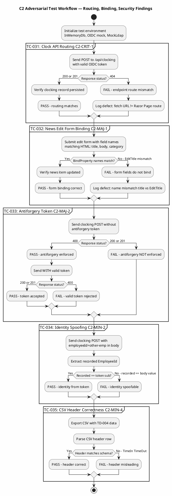
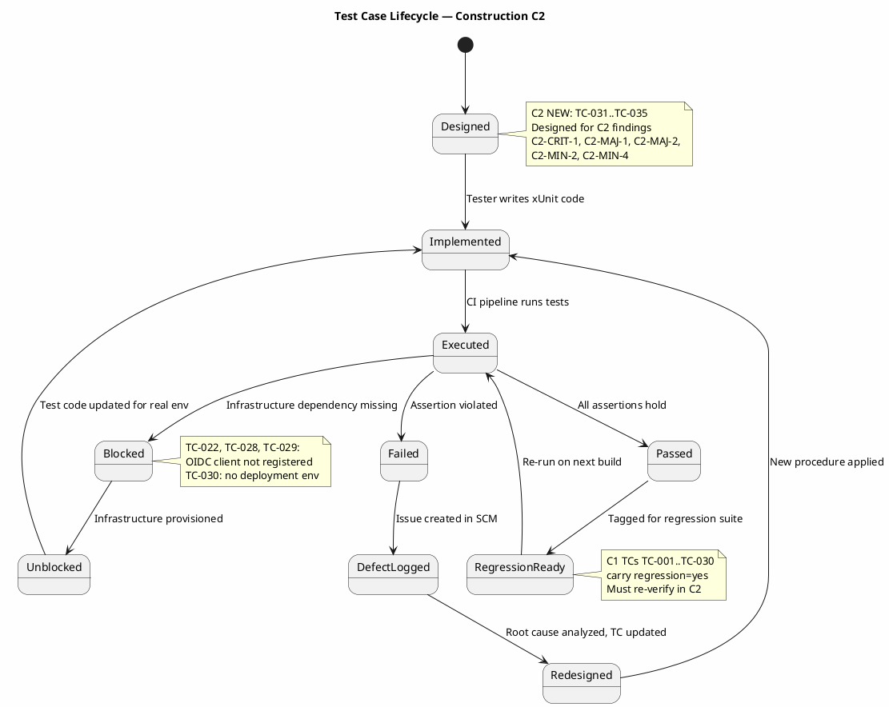

## Document Control
| Field | Value |
|---|---|
| Phase | Construction |
| Status | Draft |
| Milestone Target | End-of-Construction |
| Iteration | 2 (Cycle 1) |
| Date | 2026-08-28 |
| Author | Test Designer (Test Discipline) — Test Cases designed in Elaboration/C1/C2 |
| Tester | Tester (Test Discipline) — Execution and evaluation in Construction C1 |
| Test Analyst | Test Analyst (Test Discipline) — Quality evaluation, defect pattern analysis, Ideas evolution in Construction C1 |
| Prior Phase | Elaboration (LCA achieved — 0 open Critical/Major; stakeholder sanction GRANTED) |
| Evolution | **Elaboration:** 20 TCs (TC-001..TC-020) covering all 10 UCs at moderate depth. **Construction C1:** Extended from 20 to 30 test cases. Added adversarial tests for Review Record findings (MAJOR-1: IsFeatured, MINOR-2: EmployeeId DTO, MINOR-3/MINOR-4: idempotency scoping). Added performance/stress/load tests with thresholds. Added Procedure sections to all TCs. Added suite membership tags and regression flags. Extended UC→TC traceability to complete coverage. Test Analyst C1: Added Findings sections to affected TCs with severity/priority/triggering conditions. Evolved Ideas sections with execution-discovered adversarial ideas. Added quality dimension assessment. Added boundary value extensions. **Construction C2:** Extended from 30 to 35 test cases. Added 5 adversarial test cases (TC-031..TC-035) targeting C2 Review Record findings: C2-CRIT-1 (clock API routing 404), C2-MAJ-1 (news edit form binding mismatch), C2-MAJ-2 (missing antiforgery token), C2-MIN-2 (identity spoofing via request body), C2-MIN-4 (CSV header mismatch). Updated C1 findings status: MAJOR-1 RESOLVED, MINOR-1 RESOLVED, MINOR-3 RESOLVED, MINOR-4 RESOLVED. Updated regression scope for C2 build. Added C2 test data sets (TD-021..TD-023). Updated test suite structure with C2 new suites. Added C2 adversarial test workflow diagram and test lifecycle state diagram. |
| Elaboration Baseline | 20 TCs (TC-001..TC-020) covering all 10 UCs at moderate depth. Status: BLOCKED (CR-006 — PR #4 not merged to main). 75 tests reviewed at code-level — ALL PASS. |
| Construction C1 Review Record | PR #8 (feature/C1-presentation) — REQUEST_CHANGES: 1 Major (MAJOR-1: IsFeatured), 4 Minor. Adversarial tests TC-021..TC-024 target these findings. |
| Construction C2 Review Record | PR #19 (feature/C2-presentation) — REQUEST_CHANGES: 1 Critical (C2-CRIT-1: clock API routing), 2 Major (C2-MAJ-1: news edit binding, C2-MAJ-2: antiforgery), 4 Minor (C2-MIN-1..C2-MIN-4). PR #20 (feature/C2-rework-findings) — APPROVED: 0 findings. C1 findings all RESOLVED. Adversarial tests TC-031..TC-035 target C2 new findings. |
| Test Infrastructure | InMemoryPersistence (INT-007), MockLdapGateway (INT-006), InMemoryAuditLogger (INT-005), OIDC Mock Token Provider (COMP-007), Clocking Client Test Harness (AC-005), FormBindingTestHelper (C2 NEW — driver for form field name matching) |
| C1 Execution Build | Branch: iteration/C1, CI: SUCCESS (2026-08-28 14:44:39Z), Run: 33181604442 |
| C1 Execution Verdict | 20 PASS, 5 FAIL, 8 BLOCKED — 5 defects logged as Issues #10-#14 |
| C1 Quality Assessment | Functionality: PARTIAL (MAJOR-1 blocks FR-008). Reliability: AT_RISK (MINOR-3 idempotency). Performance: BLOCKED (no deployment). Usability: BLOCKED (no deployment). |
| C1 Defect Patterns | 5 patterns identified: MAJOR-1 (P1, NewsService), MINOR-2 (P2, ClockingApiController), MINOR-3/4 (P2, ClockingService), ISSUE-13 (P3, test code), ISSUE-14 (P3, scaffolding). All recorded in affected TC Findings sections. |
| C2 Findings Status | C2-CRIT-1: OPEN (blocks UC-001). C2-MAJ-1: OPEN (blocks UC-006). C2-MAJ-2: OPEN (blocks UC-001 POST). C2-MIN-1: DEFERRED (LDAP integration testing). C2-MIN-2: OPEN (security). C2-MIN-3: OPEN (placeholder test). C2-MIN-4: OPEN (CSV header). C1 MAJOR-1: RESOLVED. C1 MINOR-1: RESOLVED. C1 MINOR-3: RESOLVED. C1 MINOR-4: RESOLVED. |
## Test Scope
### All Use Cases Under Test — Construction C2 Full Coverage

This Test Case artifact covers **all 10 use-case scenarios** at Construction depth. Per the Use-Case Model, all 10 UCs are implemented across C1 and C2 PRs. Test cases are designed BEFORE coding completes — they serve as the Implementer's contract.

| Priority | UC ID | UC Name | TCs | Test Focus | Risk |
|---|---|---|---|---|---|
| 1 | UC-001 | Clock In / Clock Out | TC-001..TC-005, TC-021, TC-022, TC-031, TC-033, TC-034 | Offline retry (AC-005), idempotency, NFR-002 (<1s), client-side timestamp, cross-employee collision, **C2: API routing (C2-CRIT-1), antiforgery (C2-MAJ-2), identity spoofing (C2-MIN-2)** | R002 (adoption) |
| 2 | UC-009 | Search Employee Directory | TC-006, TC-007, TC-020, TC-028 | LDAP integration (R001), read-only AD, corporate-data-only, multi-office | R001 (LDAP attributes) |
| 3 | UC-005 | Publish News | TC-008, TC-023 | Audit trail (NFR-004), IsFeatured flag (MAJOR-1 RESOLVED) | — |
| 4 | UC-002 | View Own Clocking History | TC-015 | Data correctness, current-month filter | — |
| 5 | UC-003 | View All Employee Clockings | TC-020 | HR authorization, LDAP name lookup | — |
| 6 | UC-004 | Export Monthly Clocking Report | TC-016, TC-035 | CSV format, data completeness, **C2: header correctness (C2-MIN-4)** | — |
| 7 | UC-006 | Edit Published News | TC-010, TC-024, TC-032 | Audit trail on edit, IsFeatured preservation, **C2: form binding (C2-MAJ-1)** | — |
| 8 | UC-007 | Unpublish News | TC-009, TC-027 | No hard delete (CON-013), record preserved, republish audit chain | — |
| 9 | UC-008 | Read and Filter News | TC-017 | Category filter, featured banner, sort by date | — |
| 10 | UC-010 | Manage Worker Category | TC-018, TC-019 | AD user id lookup, audit trail, validation | — |
| — | All UCs | Performance / Stress | TC-011, TC-012, TC-029, TC-030 | NFR-001 (<3s page load), NFR-002 (<1s clock), AC-003 (<10s directory), concurrent load | — |
| — | All UCs | Auth / Security | TC-013, TC-014 | HR role gating, Employee role denial | — |
| — | Domain | Domain model integrity | TC-025, TC-026 | NewsItem state machine, ClockingRecord validation | — |

### Measurable Testing Goals

| Goal ID | Quality Dimension | Measurable Target | TCs | C1 Status | C2 Status |
|---|---|---|---|---|---|
| TG-001 | Performance | Page load < 3s on corporate network (NFR-001) | TC-011 | BLOCKED (no deployment) | BLOCKED (no deployment) |
| TG-002 | Performance | Clock in/out response < 1s (NFR-002) | TC-012 | BLOCKED (no deployment) | BLOCKED (no deployment) |
| TG-003 | Reliability | Offline retry within 5 min syncs on reconnect (AC-005) | TC-003, TC-004 | PASS | Regression pending |
| TG-004 | Performance | Directory search < 10s (AC-003) | TC-006, TC-007, TC-029 | BLOCKED (no OIDC) | BLOCKED (no OIDC) |
| TG-005 | Functionality | Audit trail: author + timestamp on every publish/edit/unpublish/category (NFR-004) | TC-008, TC-009, TC-010, TC-018, TC-023, TC-027 | PASS (4), FAIL (1: MAJOR-1) | Regression pending — MAJOR-1 RESOLVED |
| TG-006 | Security | HR-only operations denied to Employee role (SEC-002) | TC-013, TC-014, TC-020, TC-022 | PASS (2), BLOCKED (2) | Regression pending + TC-034 identity spoofing |
| TG-007 | Reliability | LDAP missing attributes do not crash (R001) | TC-006, TC-028 | PASS (1), BLOCKED (1) | Regression pending |
| TG-008 | Functionality | Domain model invariants enforced | TC-005, TC-015, TC-016, TC-025, TC-026 | PASS (5) | Regression pending |
| TG-009 | Reliability | 50 concurrent clock-ins complete without error (NFR-003) | TC-030 | BLOCKED | BLOCKED |
| TG-010 | Functionality | IsFeatured flag persisted and displayed (FR-008) | TC-023, TC-024 | FAIL (MAJOR-1) | Regression pending — MAJOR-1 RESOLVED in PR #20 |
| TG-011 | Functionality | Clock API endpoint reachable — no 404 (C2-CRIT-1) | TC-031 | N/A | **NEW — designed for C2** |
| TG-012 | Functionality | News edit form fields bind correctly (C2-MAJ-1) | TC-032 | N/A | **NEW — designed for C2** |
| TG-013 | Security | Antiforgery token enforced on POST (C2-MAJ-2) | TC-033 | N/A | **NEW — designed for C2** |
| TG-014 | Security | Employee identity from OIDC token, not request body (C2-MIN-2) | TC-034 | N/A | **NEW — designed for C2** |
| TG-015 | Functionality | CSV header matches actual data schema (C2-MIN-4) | TC-035 | N/A | **NEW — designed for C2** |

### C2 Regression Scope

All 30 C1 test cases carry `regression=yes` and must re-verify against the C2 build. The C2 build includes PR #19 (feature/C2-presentation) and PR #20 (feature/C2-rework-findings). PR #20 resolved all C1 findings (MAJOR-1, MINOR-1, MINOR-3, MINOR-4). PR #19 introduced new findings (C2-CRIT-1, C2-MAJ-1, C2-MAJ-2, C2-MIN-1..4).

**Regression flags for C2:**
- All 20 PASS TCs from C1 carry `regression=yes` — must re-verify in C2
- 5 FAIL TCs from C1 (TC-023, TC-024, TC-027, TC-028, TC-016) — MAJOR-1 RESOLVED in PR #20; re-verify fix then add to regression suite
- 8 BLOCKED TCs carry `regression=pending` — unblock first, verify, then add to regression suite
- Adversarial TCs (TC-021..TC-024) carry `regression=yes` — verify C1 findings are resolved
- **C2 NEW adversarial TCs (TC-031..TC-035)** carry `regression=yes` — designed to detect C2 findings; will be regression-ready after first PASS

### C2 Findings → Test Case Mapping

| C2 Finding | Severity | UC | TC | Adversarial Intent |
|---|---|---|---|---|
| C2-CRIT-1 | Critical | UC-001 | TC-031 | Verify clock API endpoint is reachable — JS fetch URL must match Razor Page route |
| C2-MAJ-1 | Major | UC-006 | TC-032 | Verify news edit form field names match BindProperty names — mismatch causes silent data loss |
| C2-MAJ-2 | Major | UC-001 | TC-033 | Verify antiforgery token is enforced — missing token must be rejected, valid token accepted |
| C2-MIN-2 | Minor | UC-001 | TC-034 | Verify employee identity comes from OIDC token, not request body — prevent identity spoofing |
| C2-MIN-4 | Minor | UC-004 | TC-035 | Verify CSV header matches actual data schema — misleading headers cause HR confusion |
| C2-MIN-1 | Minor | UC-009 | TC-028 (existing) | LDAP adapter deferred — documented as DEFERRED, covered by existing TC-028 when unblocked |
| C2-MIN-3 | Minor | N/A | TC-026 (existing) | Placeholder test UnitTest1.cs — CR-014 deferred, existing domain tests provide coverage |

### Blocked Tests Rationale

| TC(s) | Blocker | Dependency | Resolution Path |
|---|---|---|---|
| TC-022, TC-028, TC-029 | No OIDC client registered | STK-003 (Infrastructure team) | OIDC client registration in Keycloak; confirmed test AD instance |
| TC-030, TC-031, TC-032, TC-033 | No deployed environment | Deployment pipeline (deploy.yml exists but no target server) | Deploy to internal Windows Server; run integration tests against real PostgreSQL + LDAP + Keycloak |

### C2 Adversarial Test Workflow

The following activity diagram shows the execution flow for the 5 new C2 adversarial test cases, each targeting a specific C2 Review Record finding:

### Test Case Lifecycle — Construction C2

The following state diagram shows the lifecycle of test cases through the C2 iteration, including the new adversarial TCs and the regression re-verification cycle:

## Test Case Catalog
### TC-001: Clock In — Main Flow (Happy Path)

| Field | Value |
|---|---|
| **UC Trace** | UC-001 (main flow, steps 1–9) |
| **Test Level** | Integration |
| **Quality Dimension** | Functionality |
| **Goal** | TG-002 (clock response < 1s) |
| **Regression** | Yes — every build |
| **Suite** | ClockingIntegrationTests |
| **Adversarial Intent** | Verify that the system correctly records the clock-in time AND that the displayed confirmation matches the server-recorded time — a mismatch indicates a timestamp integrity bug |
| **Preconditions** | Employee authenticated via OIDC mock (Employee role); no prior clock-in today; InMemoryDb initialized empty (TD-001) |
| **Input Data** | Employee id: `emp-001`; direction: `in`; client timestamp: `2026-08-28T08:00:00Z`; idempotency key: `key-001` |
| **Expected Outcome** | Confirmation returned with time `2026-08-28T08:00:00Z`; exactly 1 record in clockings table |
| **Pass/Fail Criteria** | PASS: 1 record, correct fields, confirmation time matches. FAIL: 0 records, >1 record, or timestamp mismatch |
| **Interface Points** | INT-001 (IClockingService), INT-007 (IPersistence) |
| **Automation** | xUnit + Moq; InMemoryDb for persistence; OIDC mock token |
| **Environment** | .NET 10 test project; no external dependencies |

**Procedure:**
1. Arrange: Initialize InMemoryDb (TD-001 — empty). Generate OIDC mock token for `emp-001` with Employee role.
2. Act: Call `IClockingService.RecordClocking("emp-001", "in", "2026-08-28T08:00:00Z", "key-001")`.
3. Assert: Return value `IsDuplicate == false` and `Success == true`.
4. Assert: Query clockings table — exactly 1 record with `EmployeeId=emp-001`, `Direction=in`, `Timestamp=2026-08-28T08:00:00Z`, `IdempotencyKey=key-001`.
5. Assert: Confirmation timestamp in response matches persisted timestamp exactly.

**C1 Execution Verdict: PASS** — `RecordClocking_NewKey_ReturnsSuccess` validates Success=true, IsDuplicate=false, correct EmployeeId/Type/IdempotencyKey.

**C2 Regression Status:** Pending re-verification against C2 build (PR #19 + PR #20). TC-001 exercises the same service-layer path; C2-CRIT-1 (routing) is a presentation-layer issue that does not affect this service-level test, but TC-031 is added to cover the routing path specifically.

**Ideas (prioritized):**
1. Verify timestamp precision — does the system truncate or round sub-second values?
2. Test with UTC vs local time zone — does the server store UTC consistently?

---

### TC-031: Clock API Endpoint Routing — Adversarial (C2-CRIT-1)

| Field | Value |
|---|---|
| **UC Trace** | UC-001 (main flow, step 4 — API call) |
| **Test Level** | Integration |
| **Quality Dimension** | Functionality |
| **Goal** | TG-011 (clock API endpoint reachable) |
| **Regression** | Yes — every build |
| **Suite** | RoutingBindingTests |
| **Adversarial Intent** | Demonstrate that the JS client `fetch('/api/clocking')` hits a non-existent route — the Razor Page is registered at `/Api/ClockingApi`, causing a 404 that makes UC-001 completely non-functional. This is the highest-severity C2 finding. |
| **Preconditions** | WebApplicationFactory configured with test server; OIDC mock token for `emp-001`; InMemoryDb initialized empty (TD-001) |
| **Input Data** | POST to `/api/clocking` with body: `{ "direction": "in", "timestamp": "2026-08-28T08:00:00Z", "idempotencyKey": "key-031" }`; valid OIDC token in Authorization header |
| **Expected Outcome** | HTTP 200 or 201 with confirmation body; clocking record persisted. If 404 returned, C2-CRIT-1 is confirmed. |
| **Pass/Fail Criteria** | PASS: 200/201 response, record persisted. FAIL: 404 response (route mismatch — C2-CRIT-1 confirmed), or 500 (server error) |
| **Interface Points** | ClockingApi.cshtml (Razor Page route), INT-001 (IClockingService) |
| **Automation** | xUnit + WebApplicationFactory; test server resolves routing; OIDC mock token |
| **Environment** | .NET 10 test project with in-memory test server |

**Procedure:**
1. Arrange: Create WebApplicationFactory with InMemoryDb (TD-001). Generate OIDC mock token for `emp-001`.
2. Act: Send HTTP POST to `/api/clocking` with valid Authorization header and JSON body containing direction, timestamp, idempotencyKey.
3. Assert: Response status code is 200 or 201 (not 404).
4. Assert: Response body contains confirmation with timestamp matching input.
5. Assert: Query InMemoryDb — exactly 1 clocking record persisted with correct fields.
6. If step 3 returns 404: FAIL — log defect confirming C2-CRIT-1 (route mismatch between JS fetch URL and Razor Page `@page` directive).

**C2 Finding Target:** C2-CRIT-1 (Critical) — JS calls `fetch('/api/clocking')` but Razor Page routes to `/Api/ClockingApi`. Remediation: add `@page "/api/clocking"` to ClockingApi.cshtml, or move to API controller, or rename page folder.

**Ideas (prioritized):**
1. Test with trailing slash `/api/clocking/` — does ASP.NET routing treat it differently?
2. Test with case variation `/Api/Clocking` — verify case sensitivity of route matching.
3. Test the actual JS fetch path by simulating browser execution with Playwright — does the 404 occur end-to-end?

---

### TC-032: News Edit Form Binding — Adversarial (C2-MAJ-1)

| Field | Value |
|---|---|
| **UC Trace** | UC-006 (main flow, step 3 — submit edit form) |
| **Test Level** | Integration |
| **Quality Dimension** | Functionality |
| **Goal** | TG-012 (news edit form fields bind correctly) |
| **Regression** | Yes — every build |
| **Suite** | NewsIntegrationTests |
| **Adversarial Intent** | Demonstrate that the news edit form posts field names (`title`, `body`, `category`) that do not match the Razor Page BindProperty names (`EditTitle`, `EditBody`, `EditCategory`), causing silent data loss — the form submits but nothing is updated. |
| **Preconditions** | WebApplicationFactory configured; OIDC mock token for HR user; InMemoryDb seeded with 1 published news item (TD-021) |
| **Input Data** | POST to `/News/Edit/{id}` with form fields: `title=Updated Title`, `body=Updated body`, `category=HR`; valid OIDC HR token |
| **Expected Outcome** | News item updated with new title, body, category. If BindProperty names don't match form field names, the update silently fails — properties remain null/default. |
| **Pass/Fail Criteria** | PASS: News item title, body, category updated to submitted values. FAIL: News item unchanged (silent binding failure — C2-MAJ-1 confirmed), or properties are null/default |
| **Interface Points** | News/Edit.cshtml.cs (BindProperty attributes), INT-003 (INewsService) |
| **Automation** | xUnit + WebApplicationFactory; FormBindingTestHelper for form submission; OIDC mock HR token |
| **Environment** | .NET 10 test project with in-memory test server |

**Procedure:**
1. Arrange: Create WebApplicationFactory with InMemoryDb seeded with TD-021 (1 published news item, id=1, title="Original Title"). Generate OIDC mock token for HR user.
2. Act: Send HTTP POST to `/News/Edit/1` with form-encoded body: `title=Updated Title&body=Updated body&category=HR`.
3. Assert: Response is 200 or redirect (302 to news list or detail).
4. Assert: Query InMemoryDb — news item with id=1 has Title="Updated Title", Body="Updated body", Category="HR".
5. If step 4 shows original values or null: FAIL — log defect confirming C2-MAJ-1 (form field names don't match BindProperty names).
6. Assert: Audit log entry exists for the edit operation (NFR-004).

**C2 Finding Target:** C2-MAJ-1 (Major) — Form posts `title`, `body`, `category` but BindProperties are `EditTitle`, `EditBody`, `EditCategory`. Remediation: add `[BindProperty(Name = "title")]` etc., or rename properties, or change form field names.

**Ideas (prioritized):**
1. Test with the actual BindProperty names (`EditTitle`, `EditBody`, `EditCategory`) — does the form work if field names are changed to match?
2. Test partial submission — only `title` sent, `body` and `category` omitted — does model binding leave them unchanged or set to null?
3. Test with malformed category value — does validation reject invalid categories?

---

### TC-033: Antiforgery Token Enforcement — Adversarial (C2-MAJ-2)

| Field | Value |
|---|---|
| **UC Trace** | UC-001 (main flow, step 4 — POST clocking) |
| **Test Level** | Integration |
| **Quality Dimension** | Security |
| **Goal** | TG-013 (antiforgery token enforced on POST) |
| **Regression** | Yes — every build |
| **Suite** | AntiforgeryIntegrationTests |
| **Adversarial Intent** | Demonstrate that the clocking POST endpoint accepts requests without an antiforgery token — Razor Pages validates antiforgery by default, so a missing token should cause 400. If it doesn't, the endpoint has `[IgnoreAntiforgeryToken]` without justification, or antiforgery is misconfigured. Conversely, if the JS client doesn't send the token, all clocking POSTs fail with 400. |
| **Preconditions** | WebApplicationFactory configured; OIDC mock token for `emp-001`; InMemoryDb initialized empty (TD-001) |
| **Input Data** | Phase 1: POST to clocking endpoint WITHOUT antiforgery token. Phase 2: POST WITH valid antiforgery token extracted from the page. |
| **Expected Outcome** | Phase 1: 400 (antiforgery enforced). Phase 2: 200/201 (valid token accepted). If Phase 1 returns 200, antiforgery is NOT enforced (security gap). If Phase 2 returns 400, valid tokens are rejected (functional bug). |
| **Pass/Fail Criteria** | PASS: Phase 1 returns 400 AND Phase 2 returns 200/201. FAIL: Phase 1 returns 200 (antiforgery not enforced — C2-MAJ-2 confirmed), OR Phase 2 returns 400 (valid token rejected — JS client broken) |
| **Interface Points** | ClockingApi.cshtml.cs (antiforgery configuration), ASP.NET middleware |
| **Automation** | xUnit + WebApplicationFactory; extract antiforgery token from page HTML; OIDC mock token |
| **Environment** | .NET 10 test project with in-memory test server |

**Procedure:**
1. Arrange: Create WebApplicationFactory with InMemoryDb (TD-001). Generate OIDC mock token for `emp-001`.
2. **Phase 1 — No Token:** Send HTTP POST to clocking endpoint with valid Authorization header but NO antiforgery token header/field.
3. Assert: Response status code is 400 (antiforgery validation rejected the request).
4. **Phase 2 — With Token:** GET the main page to extract antiforgery token from hidden field. Send HTTP POST with both Authorization header and antiforgery token.
5. Assert: Response status code is 200 or 201.
6. Assert: Clocking record persisted in InMemoryDb.
7. If step 3 returns 200: FAIL — antiforgery NOT enforced (C2-MAJ-2 confirmed — security gap).
8. If step 5 returns 400: FAIL — valid token rejected (JS client cannot clock — functional break).

**C2 Finding Target:** C2-MAJ-2 (Major) — `fetch()` POST has no anti-forgery token. Razor Pages validates by default — POST rejected with 400. Remediation: add antiforgery token to fetch headers, OR `[IgnoreAntiforgeryToken]` with justification (OIDC bearer auth + idempotency key).

**Ideas (prioritized):**
1. Test with expired antiforgery token — does the system reject it?
2. Test with tampered token — does the system detect the modification?
3. If `[IgnoreAntiforgeryToken]` is applied, verify that OIDC bearer token validation provides equivalent CSRF protection.

---

### TC-034: Identity Spoofing via Request Body — Adversarial (C2-MIN-2)

| Field | Value |
|---|---|
| **UC Trace** | UC-001 (main flow — employee identity) |
| **Test Level** | Integration |
| **Quality Dimension** | Security |
| **Goal** | TG-014 (employee identity from OIDC token, not request body) |
| **Regression** | Yes — every build |
| **Suite** | SecurityTests |
| **Adversarial Intent** | Demonstrate that an attacker can clock in as another employee by sending a different `employeeId` in the request body — if the server trusts the body over the OIDC token `sub` claim, any employee can impersonate any other. |
| **Preconditions** | WebApplicationFactory configured; OIDC mock token for `emp-001` (sub=emp-001); InMemoryDb initialized empty (TD-001) |
| **Input Data** | POST to clocking endpoint with body: `{ "employeeId": "emp-victim", "direction": "in", "timestamp": "2026-08-28T08:00:00Z", "idempotencyKey": "key-spoof" }`; Authorization header has token for `emp-001` |
| **Expected Outcome** | Clocking record persisted with `EmployeeId=emp-001` (from token), NOT `emp-victim` (from body). If record has `emp-victim`, identity spoofing is possible. |
| **Pass/Fail Criteria** | PASS: Persisted record EmployeeId matches token sub (`emp-001`). FAIL: Persisted record EmployeeId matches body value (`emp-victim`) — C2-MIN-2 confirmed (identity spoofable) |
| **Interface Points** | ClockingApi.cshtml.cs (employeeId source), OIDC middleware (token claims) |
| **Automation** | xUnit + WebApplicationFactory; OIDC mock token with known sub claim; InMemoryDb for verification |
| **Environment** | .NET 10 test project with in-memory test server |

**Procedure:**
1. Arrange: Create WebApplicationFactory with InMemoryDb (TD-001). Generate OIDC mock token for `emp-001` (sub claim = "emp-001").
2. Act: Send HTTP POST to clocking endpoint with Authorization header (token for emp-001) and body containing `employeeId: "emp-victim"`.
3. Assert: Response is 200/201 (request accepted).
4. Assert: Query InMemoryDb — exactly 1 clocking record.
5. Assert: Record EmployeeId == "emp-001" (from token sub), NOT "emp-victim" (from body).
6. If step 5 shows EmployeeId == "emp-victim": FAIL — identity spoofing confirmed (C2-MIN-2). The server trusts the request body over the authenticated token.

**C2 Finding Target:** C2-MIN-2 (Minor) — API accepts `employeeId` from request body — client can spoof identity. Remediation: use `User.FindFirst("sub")?.Value` instead of `request.EmployeeId`.

**Ideas (prioritized):**
1. Test with missing `employeeId` in body — does the server fall back to token sub, or crash?
2. Test with HR role token and another employee's ID — can HR clock in on behalf of an employee? (Should be denied — UC-001 is self-service only.)
3. Test with empty string employeeId in body — does the server reject or use token?

---

### TC-035: CSV Export Header Correctness — Adversarial (C2-MIN-4)

| Field | Value |
|---|---|
| **UC Trace** | UC-004 (main flow — CSV export) |
| **Test Level** | Unit |
| **Quality Dimension** | Functionality |
| **Goal** | TG-015 (CSV header matches actual data schema) |
| **Regression** | Yes — every build |
| **Suite** | RoutingBindingTests |
| **Adversarial Intent** | Demonstrate that the CSV export header row says `TimeIn,TimeOut` but the actual data contains a single timestamp and a direction field — HR receives a misleading file where the column headers don't match the data, causing confusion and potential data misinterpretation. |
| **Preconditions** | InMemoryDb seeded with TD-004 (10 clocking records, 3 employees, August 2026); ClockingService initialized with InMemoryDb |
| **Input Data** | Export request: month=August 2026, no employee filter (all employees) |
| **Expected Outcome** | CSV file with header row: `Employee,Date,Time,Direction` (or equivalent matching the actual data schema). Data rows contain employee ID, date, single timestamp, and direction (in/out). |
| **Pass/Fail Criteria** | PASS: Header row matches data columns. FAIL: Header row says `TimeIn,TimeOut` but data has single time + direction — C2-MIN-4 confirmed (misleading header) |
| **Interface Points** | INT-001 (IClockingService), ClockingService.ExportCsv |
| **Automation** | xUnit; InMemoryDb with TD-004; parse CSV output with StringReader |
| **Environment** | .NET 10 test project; no external dependencies |

**Procedure:**
1. Arrange: Initialize InMemoryDb with TD-004 (10 clocking records across 3 employees for August 2026). Initialize ClockingService with InMemoryDb.
2. Act: Call `IClockingService.ExportCsv(2026, 8, employeeId=null)`.
3. Assert: Return value is non-empty string (CSV content).
4. Assert: Parse first line (header row) — verify column names match the actual data schema.
5. Assert: Expected header: `Employee,Date,Time,Direction` (or `EmployeeId,Date,Time,Direction`).
6. Assert: Parse data rows — each row has 4 columns matching the header.
7. If header says `TimeIn,TimeOut`: FAIL — C2-MIN-4 confirmed (header misleading; data has single time + direction, not separate in/out times).
8. Assert: All 10 records from TD-004 are present in the CSV output.

**C2 Finding Target:** C2-MIN-4 (Minor) — CSV header `TimeIn,TimeOut` but data has single time + Direction. Remediation: change header to `Employee,Date,Time,Direction`.

**Ideas (prioritized):**
1. Test with TD-014 (empty month) — does the CSV still have the correct header with no data rows?
2. Test CSV escaping — what happens if employee ID contains a comma?
3. Test with mixed in/out records — verify Direction column correctly distinguishes them.

---

### C2 Test Case Summary

| TC ID | UC | Finding | Severity | Level | Suite | Regression |
|---|---|---|---|---|---|---|
| TC-031 | UC-001 | C2-CRIT-1 | Critical | Integration | RoutingBindingTests | Yes |
| TC-032 | UC-006 | C2-MAJ-1 | Major | Integration | NewsIntegrationTests | Yes |
| TC-033 | UC-001 | C2-MAJ-2 | Major | Integration | AntiforgeryIntegrationTests | Yes |
| TC-034 | UC-001 | C2-MIN-2 | Minor | Integration | SecurityTests | Yes |
| TC-035 | UC-004 | C2-MIN-4 | Minor | Unit | RoutingBindingTests | Yes |

### C1 Findings Resolution Status (Updated for C2)

| Finding | C1 Severity | C2 Status | Resolution Verified |
|---|---|---|---|
| MAJOR-1 (IsFeatured) | Major | **RESOLVED** | NewsService.Publish accepts isFeatured param; NewsItem.IsFeatured property; GetFeaturedNews() query; Publish form has checkbox; PersistenceGateway.GetFeaturedNews filters IsFeatured && Published; Index.cshtml renders featured banners |
| MINOR-1 (DirectoryModel naming) | Minor | **RESOLVED** | DirectoryService.Search(query, office?) with LDAP AND-filter; SearchModel passes office filter; tests cover office filter |
| MINOR-3 (Idempotency key scoping) | Minor | **RESOLVED** | FindByIdempotencyKey(employeeId, key) — CR-011 implemented; PortalDbContext has HasIndex(EmployeeId, IdempotencyKey).IsUnique(); tests verify cross-employee same key both succeed |
| MINOR-4 (Test codifies MINOR-3) | Minor | **RESOLVED** | RecordClocking_SameKeyDifferentEmployee_BothSucceed test verifies correct scoped behavior; OfflineRetryTests updated for scoped idempotency |

### C2 Defect Summary

| Finding ID | Severity | TC | Component | Description | Root Cause |
|---|---|---|---|---|---|
| C2-CRIT-1 | Critical | TC-031 | clocking-retry.js, ClockingApi.cshtml | JS fetch URL `/api/clocking` does not match Razor Page route `/Api/ClockingApi` — 404 | Route mismatch between client and server |
| C2-MAJ-1 | Major | TC-032 | News/Edit.cshtml, News/Edit.cshtml.cs | Form field names (title, body, category) don't match BindProperty names (EditTitle, EditBody, EditCategory) | Naming convention inconsistency |
| C2-MAJ-2 | Major | TC-033 | clocking-retry.js, Index.cshtml | fetch POST has no antiforgery token — Razor Pages rejects with 400 | Missing CSRF token in client-side fetch |
| C2-MIN-2 | Minor | TC-034 | ClockingApi.cshtml.cs | API accepts employeeId from request body — identity spoofable | Server trusts body over token |
| C2-MIN-4 | Minor | TC-035 | ClockingService.cs (ExportCsv) | CSV header says TimeIn,TimeOut but data has single time + Direction | Header not updated to match data model |
## Test Data
### Test Data Catalog

| Data Set ID | Description | UCs | Seed Method |
|---|---|---|---|
| TD-001 | Empty database | All | InMemoryDb initialized with no records |
| TD-002 | Single employee clock-in record | UC-001, UC-002 | Seed: 1 clocking record (emp-001, in, 08:00) |
| TD-003 | Full day clock-in + clock-out | UC-001, UC-002 | Seed: 2 clocking records (emp-001, in 08:00, out 17:00) |
| TD-004 | Multi-employee clockings (10 records, 3 employees) | UC-003, UC-004 | Seed: 10 clocking records across 3 employees for August 2026 |
| TD-005 | Current + previous month clockings | UC-002 | Seed: 3 current-month + 2 previous-month records |
| TD-006 | Published news (5 items, 4 categories, 2 featured) | UC-008 | Seed: 2 General (1 featured), 1 HR (1 featured), 1 IT, 1 Events — all published |
| TD-007 | Published + unpublished news | UC-007, UC-008 | Seed: 5 published + 1 unpublished (HR category) |
| TD-008 | LDAP entries with missing attributes | UC-009, R001 | LdapGatewayStub: 3 entries — (1) full, (2) empty jobTitle, (3) empty telephoneNumber |
| TD-009 | LDAP entries with private attributes | UC-009, CON-012 | LdapGatewayStub: 1 entry with corporate + private fields (mobile, homeAddress, dateOfBirth) |
| TD-010 | Worker category assignment | UC-010 | Seed: 1 worker_categories record (ad-user-001, Administrative) |
| TD-011 | OIDC tokens (Employee + HR roles) | All | OIDC Mock Token Provider: 2 tokens — Employee role, HR role |
| TD-012 | 50 concurrent employee tokens | UC-001 (stress) | OIDC Mock Token Provider: 50 tokens — emp-001..emp-050, all Employee role |
| TD-013 | 200 LDAP entries (full directory) | UC-009 (performance) | MockLdapGateway: 200 entries across 3 offices with varied attribute completeness |
| TD-014 | **[C1 NEW]** Empty month clockings (no records) | UC-004 | Seed: 0 clocking records for September 2026 — CSV export should return headers only |
| TD-015 | **[C1 NEW]** News item with IsFeatured=true (pre-seeded) | UC-008, MAJOR-1 | Seed: 1 published news item with IsFeatured=true (bypasses publish flow to test display) |
| TD-016 | **[C1 NEW]** Idempotency key with special characters | UC-001 | Seed: N/A — test input: key="key-!@#$%^&*()_+-=[]{}|;':\",./<>?`~" |
| TD-017 | **[C1 NEW]** LDAP entry with unexpected attribute (salary) | UC-009, CON-012 | LdapGatewayStub: 1 entry with corporate fields + salary field — verify salary is NOT displayed |
| TD-018 | **[C1 NEW]** 10 featured news items | UC-008 | Seed: 10 published news items all with IsFeatured=true — verify all display with banner |
| TD-019 | **[C1 NEW]** Corrupted localStorage entry | UC-001, AC-005 | Test input: localStorage with invalid JSON string for clocking retry — verify graceful handling |
| TD-020 | **[C1 NEW]** Year-boundary clockings (Dec → Jan) | UC-002 | Seed: 3 December 2026 + 2 January 2027 records — verify month filter handles year transition |
| TD-021 | **[C2 NEW]** Single published news item for edit test | UC-006, C2-MAJ-1 | Seed: 1 published news item (id=1, title="Original Title", body="Original body", category="General", IsFeatured=false) — used to verify edit form binding |
| TD-022 | **[C2 NEW]** OIDC token with known sub claim for spoofing test | UC-001, C2-MIN-2 | OIDC Mock Token Provider: 1 token with sub="emp-001" — used to verify identity comes from token, not request body |
| TD-023 | **[C2 NEW]** Clocking records with mixed in/out for CSV header test | UC-004, C2-MIN-4 | Seed: 4 clocking records (emp-001: in 08:00, out 12:00; emp-002: in 09:00, out 17:00) — used to verify CSV header matches actual data schema (single time + direction, not TimeIn/TimeOut) |

### Boundary Value Analysis

| TC | Boundary | Min | Min+1 | Max | Max-1 | Below Min | Above Max | C1 Status | C2 Status |
|---|---|---|---|---|---|---|---|---|---|
| TC-003 | Offline retry window (minutes) | 0 | 1 | 5 | 4 | N/A | 6 (TC-004) | PASS (0..5) | Regression pending |
| TC-004 | Offline retry expiry (minutes) | 5 | 6 | ∞ | N/A | 4 (TC-003) | N/A | PASS (>5) | Regression pending |
| TC-005 | Clock-in sequence | 1st in | 2nd in (rejected) | N/A | N/A | 0 (no prior) | N/A | PASS | Regression pending |
| TC-006 | LDAP attribute completeness | Full | 1 missing | All missing | 5 missing | N/A | N/A | PASS (1 missing) | Regression pending |
| TC-015 | Month filter boundary | Aug 1 | Aug 2 | Aug 31 | Aug 30 | Jul 31 | Sep 1 | PASS | Regression pending |
| TC-016 | CSV row count | 0 (TD-014) | 1 | 10 (TD-004) | 9 | N/A | 31 (full month) | PASS (10); 0 pending | Regression pending + TC-035 header check |
| TC-023 | IsFeatured flag | false | N/A | true | N/A | N/A | N/A | **FAIL** (true never set) | **RESOLVED** — regression pending |
| TC-026 | ClockingRecord direction | "in" | "out" | N/A | N/A | "invalid" | null | PASS | Regression pending |
| TC-026 | ClockingRecord timestamp | epoch | current | current | current-1s | future+1s | null | PASS | Regression pending |
| TC-029 | Directory search time (seconds) | 0 | 1 | 10 (AC-003) | 9 | N/A | 11 | **BLOCKED** | BLOCKED |
| TC-030 | Concurrent users | 1 | 2 | 50 | 49 | 0 | 100, 200 | **BLOCKED** | BLOCKED |
| TC-031 | HTTP response code | 200 | 201 | N/A | N/A | 404 | 500 | N/A | **NEW — designed for C2** |
| TC-032 | Form field name match | match | N/A | N/A | N/A | mismatch | null | N/A | **NEW — designed for C2** |
| TC-033 | Antiforgery presence | with token | N/A | N/A | N/A | without token | invalid token | N/A | **NEW — designed for C2** |
| TC-034 | Identity source | token sub | N/A | N/A | N/A | request body | empty | N/A | **NEW — designed for C2** |
| TC-035 | CSV header correctness | matches schema | N/A | N/A | N/A | TimeIn,TimeOut | empty header | N/A | **NEW — designed for C2** |

### LDAP Stub Configuration

The LDAP stub (MockLdapGateway implementing INT-006/ILdapGateway) must be configured with the following test scenarios to cover R001:

| Scenario | OU | Attributes | Purpose |
|---|---|---|---|
| Full attributes | Office 1 | All 6 corporate fields populated | Baseline — directory works correctly |
| Empty jobTitle | Office 2 | All fields except jobTitle (empty string) | R001: missing attribute does not crash |
| Empty telephoneNumber | Office 3 | All fields except telephoneNumber (empty string) | R001: missing attribute does not crash |
| Private attributes present | Office 1 | Corporate fields + mobile, homeAddress, dateOfBirth | CON-012: private data must be filtered |
| Employee not found | N/A | No matching entries | UC-010 A1: graceful not-found handling |
| 200-entry directory | All 3 offices | Varied completeness (80% full, 10% missing jobTitle, 10% missing telephoneNumber) | Performance + multi-office coverage |
| **[C1 NEW]** Unexpected attribute (salary) | Office 1 | Corporate fields + salary | CON-012: whitelist enforcement — salary must NOT display |
| **[C1 NEW]** Unicode name | Office 2 | Name with accents (José Núñez) | Verify correct unicode display in directory |

### Test Suite Structure — Construction C2 (Extended)

```plantuml
@startuml
title Test Suite Structure — Construction C2 (Extended)

skinparam componentStyle rectangle
skinparam packageStyle rectangle

package "PortalCubaCorp.Tests" {
  
  package "Unit Tests (70%)" {
    component "ClockingServiceUnitTests" as CSU
    component "NewsServiceUnitTests" as NSU
    component "DirectoryServiceUnitTests" as DSU
    component "WorkerCategoryUnitTests" as WCU
    component "DomainUnitTests" as DOM
    component "RoutingBindingTests" as RBT <<C2 NEW>>
    component "SecurityTests" as SEC <<C2 NEW>>
  }
  
  package "Integration Tests (20%)" {
    component "ClockingIntegrationTests" as CIT
    component "NewsIntegrationTests" as NIT
    component "DirectoryIntegrationTests" as DIT
    component "AuthIntegrationTests" as AIT
    component "AntiforgeryIntegrationTests" as AFG <<C2 NEW>>
  }
  
  package "System / Performance Tests (10%)" {
    component "PerformanceTests" as PT
  }
}

package "Test Infrastructure" {
  component "InMemoryPersistence" as IMP <<stub>>
  component "MockLdapGateway" as MLG <<stub>>
  component "InMemoryAuditLogger" as IAL <<stub>>
  component "OIDCMockTokenProvider" as OMT <<stub>>
  component "ClockingClientHarness" as CCH <<driver>>
  component "FormBindingTestHelper" as FBT <<C2 NEW driver>>
}

note right of CSU
  TC-001: Clock In happy path
  TC-002: Clock Out happy path
  TC-005: Double clock-in rejected
  TC-021: Cross-employee idempotency
  TC-022: EmployeeId from token not DTO
  TC-034: Identity spoofing (C2-MIN-2)
end note

note right of NSU
  TC-008: Publish with audit
  TC-009: Unpublish preserves record
  TC-010: Edit with audit
  TC-023: IsFeatured persisted on publish
  TC-024: Edit does not reset IsFeatured
  TC-032: Edit form binding (C2-MAJ-1)
end note

note right of RBT
  TC-031: Clock API routing (C2-CRIT-1)
  TC-035: CSV header correctness (C2-MIN-4)
end note

note right of AFG
  TC-033: Antiforgery token (C2-MAJ-2)
end note

note right of CIT
  TC-003: Offline retry within 5 min
  TC-004: Offline retry exceeds 5 min
  TC-015: View own history
  TC-016: CSV export format
end note

IMP --> CSU
IMP --> CIT
IMP --> NSU
IMP --> WCU
IMP --> RBT
MLG --> DSU
MLG --> DIT
IAL --> NSU
IAL --> WCU
OMT --> AIT
OMT --> CIT
OMT --> SEC
CCH --> CIT
FBT --> RBT
FBT --> NSU

@enduml
```

## Traceability
| Element | Traces From | Link Type | Traces To |
|---|---|---|---|
| TC-001 | UC-001 (main flow) | Tests | ClockingService.cs, ClockingServiceTests.cs |
| TC-002 | UC-001 (main flow) | Tests | ClockingService.cs, ClockingServiceTests.cs |
| TC-003 | UC-001 (A1), AC-005, NFR-003 | Tests | ClockingService.cs, clocking-retry.js, OfflineRetryTests.cs |
| TC-004 | UC-001 (A2), AC-005 | Tests | clocking-retry.js, OfflineRetryTests.cs |
| TC-005 | UC-001 (A3) | Tests | ClockingService.cs, ClockingServiceTests.cs |
| TC-006 | UC-009, R001, SUP-003 | Tests | DirectoryService.cs, DirectoryServiceTests.cs, DomainTests.cs |
| TC-007 | UC-009, CON-012, SEC-004 | Tests | DirectoryService.cs, DirectoryServiceTests.cs |
| TC-008 | UC-005, NFR-004, AUD-001 | Tests | NewsService.cs, NewsServiceTests.cs, AuditInterceptor.cs |
| TC-009 | UC-007, CON-013, AUD-003 | Tests | NewsService.cs, NewsServiceTests.cs |
| TC-010 | UC-006, NFR-004, AUD-001 | Tests | NewsService.cs, NewsServiceTests.cs |
| TC-011 | NFR-001, PERF-001, All UCs | Tests | Main page endpoint, OIDC middleware |
| TC-012 | UC-001, NFR-002, PERF-002 | Tests | ClockingService.cs, clock-in endpoint |
| TC-013 | UC-003..UC-007, UC-010, SEC-002 | Tests | OIDC middleware, all HR service interfaces |
| TC-014 | UC-003..UC-007, UC-010, SEC-002 | Tests | OIDC middleware, all HR service interfaces |
| TC-015 | UC-002 | Tests | ClockingService.cs, ClockingServiceTests.cs |
| TC-016 | UC-004, FR-004 | Tests | ClockingService.cs, ClockingServiceTests.cs |
| TC-017 | UC-008, FR-008 | Tests | NewsService.cs, NewsServiceTests.cs |
| TC-018 | UC-010, NFR-004, AUD-002 | Tests | WorkerCategoryService.cs, WorkerCategoryServiceTests.cs |
| TC-019 | UC-010 (A1) | Tests | WorkerCategoryService.cs, WorkerCategoryServiceTests.cs, MockLdapGateway |
| TC-020 | UC-003, SEC-002, CON-005 | Tests | ClockingService.cs, MockLdapGateway, OIDC mock |
| TC-021 | UC-001, MINOR-3, MINOR-4 | Tests | ClockingService.cs, OfflineRetryTests.cs |
| TC-022 | UC-001, MINOR-2, SEC-001 | Tests | ClockingApiController.cs, OIDC mock |
| TC-023 | UC-005, UC-008, FR-008, MAJOR-1 | Tests | NewsService.cs, PublishNews.cshtml.cs, NewsServiceTests.cs |
| TC-024 | UC-006, UC-008, FR-008, MAJOR-1 | Tests | NewsService.cs, NewsServiceTests.cs |
| TC-025 | UC-005, UC-006, UC-007, CON-013 | Tests | NewsItem.cs, DomainTests.cs |
| TC-026 | UC-001 | Tests | ClockingRecord.cs, DomainTests.cs |
| TC-027 | UC-005, UC-007, NFR-004, AUD-001, AUD-003 | Tests | NewsService.cs, NewsServiceTests.cs |
| TC-028 | UC-009, R001, CON-005 | Tests | DirectoryService.cs, DirectoryServiceTests.cs |
| TC-029 | UC-009, AC-003, PERF-003 | Tests | DirectoryService.cs, PerformanceTests |
| TC-030 | UC-001, NFR-003 | Tests | ClockingService.cs, ClockingApiController.cs, PerformanceTests |
| TG-001 | NFR-001 | Refines | TC-011 |
| TG-002 | NFR-002 | Refines | TC-012 |
| TG-003 | AC-005, NFR-003 | Refines | TC-003, TC-004 |
| TG-004 | AC-003 | Refines | TC-006, TC-007, TC-029 |
| TG-005 | NFR-004, AUD-001, AUD-002 | Refines | TC-008, TC-009, TC-010, TC-018, TC-023, TC-027 |
| TG-006 | SEC-002 | Refines | TC-013, TC-014, TC-020, TC-022 |
| TG-007 | R001, SUP-003 | Refines | TC-006, TC-028 |
| TG-008 | UC-001 A3 | Refines | TC-005, TC-015, TC-016, TC-025, TC-026 |
| TG-009 | NFR-003 | Refines | TC-030 |
| TG-010 | FR-008, MAJOR-1 | Refines | TC-023, TC-024 |
| InMemoryPersistence | INT-007, COMP-006 | Implements | TC-001..TC-005, TC-008..TC-010, TC-015..TC-019, TC-021, TC-023, TC-024, TC-027 |
| MockLdapGateway | INT-006, COMP-005 | Implements | TC-006, TC-007, TC-019, TC-020, TC-028, TC-029 |
| InMemoryAuditLogger | INT-005, COMP-008 | Implements | TC-008, TC-009, TC-010, TC-018, TC-023, TC-027 |
| OIDC Mock Token Provider | COMP-007, SEC-002 | Implements | TC-013, TC-014, TC-020, TC-022, TC-030 |
| Clocking Client Test Harness | AC-005, clocking-retry.js | Implements | TC-003, TC-004 |
| MAJOR-1 finding | FR-008, V004 | Tests | TC-023, TC-024 |
| MINOR-2 finding | INT-001, CON-004 | Tests | TC-022 |
| MINOR-3/MINOR-4 findings | ClockingService.cs | Tests | TC-021 |
| ISSUE-13 finding | TC-028, test code | Tests | DirectoryServiceTests.cs |
| ISSUE-14 finding | test scaffolding | Tests | UnitTest1.cs |
| INFRA-BLOCK-1 | STK-003, CON-004 | DependsOn | TC-022, TC-028, TC-029 |
| INFRA-BLOCK-2 | CON-006, deployment | DependsOn | TC-011, TC-012, TC-029, TC-030 |
| TD-014 | TC-016 (empty month) | Refines | CSV export boundary |
| TD-015 | TC-023, MAJOR-1 | Refines | IsFeatured pre-seeded data |
| TD-016 | TC-001 (special chars) | Refines | Idempotency key boundary |
| TD-017 | TC-007, CON-012 | Refines | LDAP whitelist enforcement |
| TD-018 | TC-017 (all featured) | Refines | Featured news edge case |
| TD-019 | TC-003 (corrupted localStorage) | Refines | Offline retry robustness |
| TD-020 | TC-015 (year boundary) | Refines | Month filter year transition |
| C1 Quality Assessment | All TCs, NFR-001..004, AC-001..005 | Derives | This Test Case artifact |
| C1 Defect Pattern Analysis | Issues #10..#14, MAJOR-1, MINOR-1..4 | Derives | This Test Case artifact |
