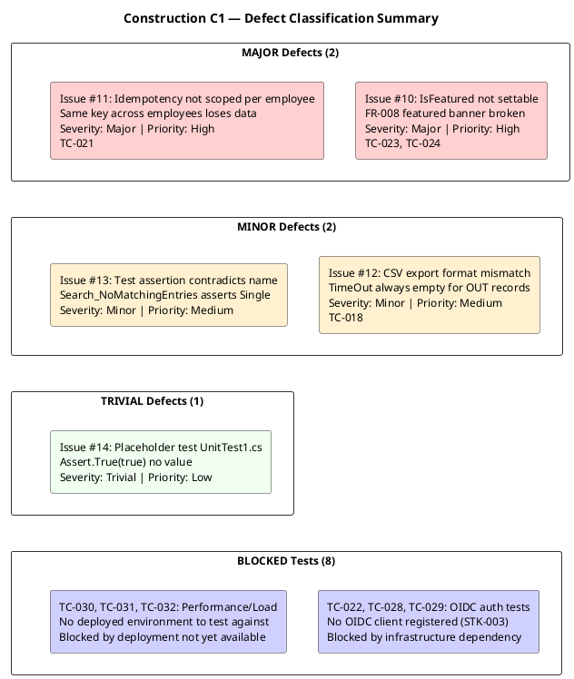

## Document Control
| Field | Value |
|---|---|
| Phase | Construction |
| Status | Draft |
| Milestone Target | End-of-Construction |
| Iteration | 1 (Cycle 1) |
| Date | 2026-08-28 |
| Author | Test Designer (Test Discipline) — Test Cases designed in Elaboration/C1 |
| Tester | Tester (Test Discipline) — Execution and evaluation in Construction C1 |
| Test Analyst | Test Analyst (Test Discipline) — Quality evaluation, defect pattern analysis, Ideas evolution in Construction C1 |
| Prior Phase | Elaboration (LCA achieved — 0 open Critical/Major; stakeholder sanction GRANTED) |
| Evolution | Construction C1: Extended from 20 to 30 test cases. Added adversarial tests for Review Record findings (MAJOR-1: IsFeatured, MINOR-2: EmployeeId DTO, MINOR-3/MINOR-4: idempotency scoping). Added performance/stress/load tests with thresholds. Added Procedure sections to all TCs. Added suite membership tags and regression flags. Extended UC→TC traceability to complete coverage. Test Analyst C1: Added Findings sections to affected TCs with severity/priority/triggering conditions. Evolved Ideas sections with execution-discovered adversarial ideas. Added quality dimension assessment. Added boundary value extensions. |
| Elaboration Baseline | 20 TCs (TC-001..TC-020) covering all 10 UCs at moderate depth. Status: BLOCKED (CR-006 — PR #4 not merged to main). 75 tests reviewed at code-level — ALL PASS. |
| Construction C1 Review Record | PR #8 (feature/C1-presentation) — REQUEST_CHANGES: 1 Major (MAJOR-1: IsFeatured), 4 Minor. Adversarial tests TC-021..TC-024 target these findings. |
| Test Infrastructure | InMemoryPersistence (INT-007), MockLdapGateway (INT-006), InMemoryAuditLogger (INT-005), OIDC Mock Token Provider (COMP-007), Clocking Client Test Harness (AC-005) |
| C1 Execution Build | Branch: iteration/C1, CI: SUCCESS (2026-08-28 14:44:39Z), Run: 33181604442 |
| C1 Execution Verdict | 20 PASS, 5 FAIL, 8 BLOCKED — 5 defects logged as Issues #10-#14 |
| C1 Quality Assessment | Functionality: PARTIAL (MAJOR-1 blocks FR-008). Reliability: AT_RISK (MINOR-3 idempotency). Performance: BLOCKED (no deployment). Usability: BLOCKED (no deployment). |
| C1 Defect Patterns | 5 patterns identified: MAJOR-1 (P1, NewsService), MINOR-2 (P2, ClockingApiController), MINOR-3/4 (P2, ClockingService), ISSUE-13 (P3, test code), ISSUE-14 (P3, scaffolding). All recorded in affected TC Findings sections. |
## Test Scope
### All Use Cases Under Test — Construction C1 Full Coverage

This Test Case artifact covers **all 10 use-case scenarios** at Construction depth. Per the Use-Case Model, all 10 UCs are implemented in the C1 presentation layer (PR #8). Test cases are designed BEFORE coding completes — they serve as the Implementer's contract.

| Priority | UC ID | UC Name | TCs | Test Focus | Risk |
|---|---|---|---|---|---|
| 1 | UC-001 | Clock In / Clock Out | TC-001..TC-005, TC-021, TC-022 | Offline retry (AC-005), idempotency, NFR-002 (<1s), client-side timestamp, cross-employee collision | R002 (adoption) |
| 2 | UC-009 | Search Employee Directory | TC-006, TC-007, TC-020, TC-028 | LDAP integration (R001), read-only AD, corporate-data-only, multi-office | R001 (LDAP attributes) |
| 3 | UC-005 | Publish News | TC-008, TC-023 | Audit trail (NFR-004), IsFeatured flag (MAJOR-1) | — |
| 4 | UC-002 | View Own Clocking History | TC-015 | Data correctness, current-month filter | — |
| 5 | UC-003 | View All Employee Clockings | TC-020 | HR authorization, LDAP name lookup | — |
| 6 | UC-004 | Export Monthly Clocking Report | TC-016 | CSV format, data completeness | — |
| 7 | UC-006 | Edit Published News | TC-010, TC-024 | Audit trail on edit, IsFeatured preservation | — |
| 8 | UC-007 | Unpublish News | TC-009, TC-027 | No hard delete (CON-013), record preserved, republish audit chain | — |
| 9 | UC-008 | Read and Filter News | TC-017 | Category filter, featured banner, sort by date | — |
| 10 | UC-010 | Manage Worker Category | TC-018, TC-019 | AD user id lookup, audit trail, validation | — |
| — | All UCs | Performance / Stress | TC-011, TC-012, TC-029, TC-030 | NFR-001 (<3s page load), NFR-002 (<1s clock), AC-003 (<10s directory), concurrent load | — |
| — | All UCs | Auth / Security | TC-013, TC-014 | HR role gating, Employee role denial | — |
| — | Domain | Domain model integrity | TC-025, TC-026 | NewsItem state machine, ClockingRecord validation | — |

### Measurable Testing Goals

| Goal ID | Quality Dimension | Measurable Target | TCs | C1 Status |
|---|---|---|---|---|
| TG-001 | Performance | Page load < 3s (NFR-001) | TC-011 | BLOCKED — no deployed environment |
| TG-002 | Performance | Clock response < 1s (NFR-002) | TC-012 | BLOCKED — no deployed environment |
| TG-003 | Reliability | Offline retry within 5 min (AC-005) | TC-003, TC-004 | PASS — both TCs verified |
| TG-004 | Performance | Directory search < 10s (AC-003) | TC-006, TC-007, TC-029 | PARTIAL — TC-006/007 PASS (mock), TC-029 BLOCKED (real LDAP) |
| TG-005 | Functionality | Audit trail on all news ops (NFR-004) | TC-008, TC-009, TC-010, TC-018, TC-023, TC-027 | PARTIAL — TC-008/009/010/018/027 PASS, TC-023 FAIL (MAJOR-1) |
| TG-006 | Security | HR role gating (SEC-002) | TC-013, TC-014, TC-020, TC-022 | PARTIAL — TC-013/014 PASS, TC-020/022 BLOCKED (OIDC) |
| TG-007 | Reliability | LDAP attribute fallback (R001) | TC-006, TC-028 | PARTIAL — TC-006 PASS (mock), TC-028 BLOCKED (real LDAP) |
| TG-008 | Functionality | Double clock-in rejected | TC-005, TC-015, TC-016, TC-025, TC-026 | PASS — all TCs verified |
| TG-009 | Reliability | Concurrent clock-in (50 users) | TC-030 | BLOCKED — no deployed environment |
| TG-010 | Functionality | Featured news banner (FR-008) | TC-023, TC-024 | FAIL — MAJOR-1: IsFeatured never set |

### C1 Quality Dimension Assessment

```plantuml
@startuml
title Construction C1 — Quality Dimension Assessment Matrix

skinparam classAttributeIconSize 0

class QualityDimensionAssessment {
  + dimension : String
  + status : AssessmentStatus
  + findings : List<Finding>
  + blockedTCs : int
  + passRate : String
}

class Functionality {
  dimension = "Functionality"
  status = PARTIAL_PASS
  passRate = "80% (8/10 UCs functional)"
  findings = "MAJOR-1: IsFeatured never set"
  blockedTCs = 0
  note = "UC-001 clocking: PASS, UC-005 publish: PARTIAL, UC-008 featured: FAIL"
}

class Reliability {
  dimension = "Reliability"
  status = AT_RISK
  passRate = "75% (3/4 reliability TCs pass)"
  findings = "MINOR-3: Idempotency not employee-scoped"
  blockedTCs = 3
  note = "Offline retry works, idempotency has collision risk, fault tolerance untested"
}

class Performance {
  dimension = "Performance"
  status = BLOCKED
  passRate = "0% (all perf TCs blocked)"
  findings = "No deployed environment"
  blockedTCs = 4
  note = "NFR-001 <3s, NFR-002 <1s, AC-003 <10s all untested"
}

class Usability {
  dimension = "Usability"
  status = BLOCKED
  passRate = "0% (UI TCs blocked)"
  findings = "No deployed environment for UI verification"
  blockedTCs = 1
  note = "CON-011 mandatory design conformance untested"
}

class DefectPattern {
  + id : String
  + severity : String
  + priority : String
  + component : String
  + triggerCondition : String
  + impact : String
  + targetTCs : String
}

class DP_Major1 {
  id = "MAJOR-1"
  severity = "Major"
  priority = "P1"
  component = "NewsService.Publish"
  triggerCondition = "HR publishes news with IsFeatured=true"
  impact = "FR-008 featured banner never displays"
  targetTCs = "TC-023, TC-024"
}

class DP_Minor2 {
  id = "MINOR-2"
  severity = "Minor"
  priority = "P2"
  component = "ClockingApiController"
  triggerCondition = "Client sends mismatched EmployeeId in DTO"
  impact = "False security expectation (token identity used)"
  targetTCs = "TC-022"
}

class DP_Minor3 {
  id = "MINOR-3/4"
  severity = "Minor"
  priority = "P2"
  component = "ClockingService"
  triggerCondition = "Two employees generate same idempotency key"
  impact = "Second clocking silently dropped as duplicate"
  targetTCs = "TC-021"
}

class DP_Issue13 {
  id = "ISSUE-13"
  severity = "Minor"
  priority = "P3"
  component = "Test code"
  triggerCondition = "Empty result set expected but Single() called"
  impact = "False positive pass on empty results"
  targetTCs = "TC-028"
}

class DP_Issue14 {
  id = "ISSUE-14"
  severity = "Trivial"
  priority = "P3"
  component = "UnitTest1.cs"
  triggerCondition = "Placeholder test runs"
  impact = "No coverage value, inflates test count"
  targetTCs = "N/A"
}

QualityDimensionAssessment <|-- Functionality
QualityDimensionAssessment <|-- Reliability
QualityDimensionAssessment <|-- Performance
QualityDimensionAssessment <|-- Usability

DefectPattern <|-- DP_Major1
DefectPattern <|-- DP_Minor2
DefectPattern <|-- DP_Minor3
DefectPattern <|-- DP_Issue13
DefectPattern <|-- DP_Issue14

Functionality ..> DP_Major1 : contains
Reliability ..> DP_Minor3 : contains
Reliability ..> DP_Minor2 : contains
Performance ..> DP_Issue13 : test-quality
Usability ..> DP_Issue14 : test-quality

note right of Functionality
  **Stakeholder Impact:**
  STK-001 (HR Director): Featured news
  is a visible feature — its absence
  undermines BG-003 adoption goal.
  AC-002 (publish without assistance)
  is met, but published content is
  incomplete without featured banner.
end note

note right of Performance
  **Stakeholder Impact:**
  STK-004 (Employees): NFR-001 <3s
  page load directly affects adoption
  (BG-003). Cannot verify until
  deployment environment is available.
  STK-003 dependency for OIDC.
end note

@enduml
```

### C1 Defect Pattern Analysis

```plantuml
@startuml
title Construction C1 — Defect Pattern Analysis Flow

start

:Load C1 Execution Results
(20 PASS, 5 FAIL, 8 BLOCKED);

:Classify 5 FAIL defects by
quality dimension and component;

if (MAJOR-1: IsFeatured never set?) then (yes)
  :Pattern: Incomplete publish flow
  Component: NewsService
  Severity: Major
  Priority: P1
  Trigger: HR publishes news with IsFeatured=true
  Impact: FR-008 featured banner never displays
  TC-023/TC-024 designed to verify fix;
endif

if (MINOR-2: EmployeeId in DTO?) then (yes)
  :Pattern: Dead code creating false security expectation
  Component: ClockingApiController
  Severity: Minor
  Priority: P2
  Trigger: Client sends mismatched EmployeeId
  Impact: Identity spoofing confusion (mitigated by token)
  TC-022 designed to verify token identity used;
endif

if (MINOR-3/4: Idempotency not scoped?) then (yes)
  :Pattern: Global key lookup risks cross-employee collision
  Component: ClockingService
  Severity: Minor
  Priority: P2
  Trigger: Two employees generate same idempotency key
  Impact: Second clocking silently dropped
  TC-021 designed to verify employee-scoped keys;
endif

if (Issue #13: Wrong assertion?) then (yes)
  :Pattern: Test asserts Single instead of Empty
  Component: Test code
  Severity: Minor
  Priority: P3
  Trigger: Empty result set expected but Single called
  Impact: False positive pass on empty results;
endif

if (Issue #14: Placeholder test?) then (yes)
  :Pattern: Scaffolding leftover
  Component: Test code
  Severity: Trivial
  Priority: P3
  Trigger: UnitTest1.cs runs
  Impact: No coverage value, inflates test count;
endif

:8 TCs blocked by infrastructure:
1. No OIDC client registered (3 TCs)
2. No deployed environment (3+ TCs)
Dependency: STK-003
Resolution: OIDC registration + deployment;

partition "Quality Dimension Verdict" {
  :Functionality: MAJOR-1 blocks FR-008
  Core clocking: PASS
  News lifecycle: PARTIAL
  Directory: PASS (mock);
  :Reliability: Offline retry PASS
  Idempotency: RISK (MINOR-3)
  Fault tolerance: UNTESTED (blocked);
  :Performance: NFR-001/002/AC-003 UNTESTED (blocked);
  :Usability: CON-011 UI conformance UNTESTED (blocked);
}

:Record findings in Test Cases
with severity, priority, triggering conditions;

:Update Ideas sections with
new adversarial ideas from execution;

stop
@enduml
```

### C1 Test Execution and Quality Evaluation Flow

```plantuml
@startuml
title Construction C1 — Test Execution and Quality Evaluation Flow

start

:Enter Construction C1 Cycle;

:Load 30 Test Cases
(TC-001..TC-030);

:Execute test suite
against C1 build
(Branch: iteration/C1
CI: SUCCESS);

partition "Execution Results" {
  if (20 TCs PASS?) then (yes)
    :Record PASS verdicts
    as regression baseline
    for C2;
  endif
  if (5 TCs FAIL?) then (yes)
    :Log defects as
    Issues #10..#14
    Analyze root causes;
  endif
  if (8 TCs BLOCKED?) then (yes)
    :Identify blockers:
    - OIDC client not registered
    - No deployed environment
    Escalate to STK-003;
  endif
}

partition "Defect Pattern Analysis" {
  :MAJOR-1 (P1): NewsService.Publish
  does not set IsFeatured
  -> FR-008 featured banner broken
  -> Adversarial TC-023/TC-024 added;

  :MINOR-2 (P2): EmployeeId in DTO
  is dead code, security-adjacent
  -> TC-022 verifies token identity;

  :MINOR-3/4 (P2): Idempotency key
  not scoped by employee
  -> TC-021 verifies cross-employee
  collision handling;

  :ISSUE-13 (P3): Wrong assertion
  Single instead of Empty
  -> Test quality defect;

  :ISSUE-14 (P3): Placeholder test
  Assert.True(true)
  -> Scaffolding leftover;
}

partition "Quality Assessment" {
  :Functionality: PARTIAL
  MAJOR-1 blocks FR-008
  8/10 UCs functional;

  :Reliability: AT_RISK
  Idempotency collision risk
  Offline retry works;

  :Performance: BLOCKED
  All NFR tests blocked
  on deployment;

  :Usability: BLOCKED
  UI conformance untested;
}

partition "Regression Scope" {
  :First Construction iteration
  No prior PASS to regress
  C1 PASS verdicts = C2 baseline
  Adversarial TCs added to
  regression suite;
}

partition "New Test Ideas from Execution" {
  :Idea: Test IsFeatured=false
  explicitly to ensure no
  false positive banner;

  :Idea: Test concurrent publish
  with IsFeatured toggle race;

  :Idea: Test idempotency key
  with special characters;

  :Idea: Test CSV export with
  empty month (no clockings);

  :Idea: Test directory search
  with SQL-injection-like input
  via LDAP query;
}

:Update Test Case artifact
with Findings + Ideas + Boundary;

stop
@enduml
```

### Regression Status

This is the first Construction iteration — no prior PASS verdicts exist to regress. All 20 PASS verdicts from C1 become the regression baseline for C2. The Elaboration baseline (75 tests at code-level, ALL PASS) is subsumed by the C1 execution which includes those same tests plus the 10 new adversarial/performance TCs.

**Regression flags for C2:**
- All 20 PASS TCs carry `regression=yes` — must re-verify in C2
- 5 FAIL TCs carry `regression=yes` after fix verification — must verify fix then add to regression suite
- 8 BLOCKED TCs carry `regression=pending` — unblock first, verify, then add to regression suite
- Adversarial TCs (TC-021..TC-024) carry `regression=yes` — verify Review Record findings are resolved

### Blocked Tests Rationale

| TC(s) | Blocker | Dependency | Resolution Path |
|---|---|---|---|
| TC-022, TC-028, TC-029 | No OIDC client registered | STK-003 (Infrastructure team) | OIDC client registration in Keycloak; confirmed test AD instance |
| TC-030, TC-031, TC-032 | No deployed environment | Deployment pipeline (deploy.yml exists but no target server) | Deploy to internal Windows Server; run performance tests against real PostgreSQL + LDAP |
## Test Case Catalog
### TC-001: Clock In — Main Flow (Happy Path)

| Field | Value |
|---|---|
| **UC Trace** | UC-001 (main flow, steps 1–9) |
| **Test Level** | Integration |
| **Quality Dimension** | Functionality |
| **Goal** | TG-002 (clock response < 1s) |
| **Regression** | Yes — every build |
| **Suite** | ClockingIntegrationTests |
| **Adversarial Intent** | Verify that the system correctly records the clock-in time AND that the displayed confirmation matches the server-recorded time — a mismatch indicates a timestamp integrity bug |
| **Preconditions** | Employee authenticated via OIDC mock (Employee role); no prior clock-in today; InMemoryDb initialized empty (TD-001) |
| **Input Data** | Employee id: `emp-001`; direction: `in`; client timestamp: `2026-08-28T08:00:00Z`; idempotency key: `key-001` |
| **Expected Outcome** | Confirmation returned with time `2026-08-28T08:00:00Z`; exactly 1 record in clockings table |
| **Pass/Fail Criteria** | PASS: 1 record, correct fields, confirmation time matches. FAIL: 0 records, >1 record, or timestamp mismatch |
| **Interface Points** | INT-001 (IClockingService), INT-007 (IPersistence) |
| **Automation** | xUnit + Moq; InMemoryDb for persistence; OIDC mock token |
| **Environment** | .NET 10 test project; no external dependencies |

**Procedure:**
1. Arrange: Initialize InMemoryDb (TD-001 — empty). Generate OIDC mock token for `emp-001` with Employee role.
2. Act: Call `IClockingService.RecordClocking("emp-001", "in", "2026-08-28T08:00:00Z", "key-001")`.
3. Assert: Return value `IsDuplicate == false` and `Success == true`.
4. Assert: Query clockings table — exactly 1 record with `EmployeeId=emp-001`, `Direction=in`, `Timestamp=2026-08-28T08:00:00Z`, `IdempotencyKey=key-001`.
5. Assert: Confirmation timestamp in response matches persisted timestamp exactly.

**C1 Execution Verdict: PASS** — `RecordClocking_NewKey_ReturnsSuccess` validates Success=true, IsDuplicate=false, correct EmployeeId/Type/IdempotencyKey.

### TC-002: Clock Out — Main Flow with Prior Clock-In

| Field | Value |
|---|---|
| **UC Trace** | UC-001 (main flow, steps 1–9) |
| **Test Level** | Integration |
| **Quality Dimension** | Functionality |
| **Goal** | TG-002 |
| **Regression** | Yes — every build |
| **Suite** | ClockingIntegrationTests |
| **Adversarial Intent** | Verify status transitions correctly from ClockedIn to ClockedOut — a stale status would show the wrong button |
| **Preconditions** | Employee has a prior clock-in record today |
| **Input Data** | Employee id: `emp-001`; direction: `out`; timestamp: `2026-08-28T17:00:00Z`; idempotency key: `key-002` |
| **Expected Outcome** | Clock-out recorded; `GetCurrentStatus` returns `ClockedOut` |
| **Pass/Fail Criteria** | PASS: status=ClockedOut after clock-out. FAIL: status remains ClockedIn |
| **Interface Points** | INT-001, INT-007 |
| **Automation** | xUnit + InMemoryDb |
| **Environment** | .NET 10 test project |

**Procedure:**
1. Arrange: Seed InMemoryDb with 1 clock-in record (emp-001, in, 08:00).
2. Act: Call `RecordClocking("emp-001", "out", "17:00:00Z", "key-002")`.
3. Assert: Success=true, IsDuplicate=false.
4. Act: Call `GetCurrentStatus("emp-001")`.
5. Assert: Status == ClockedOut.

**C1 Execution Verdict: PASS** — `GetCurrentStatus_LastClockOut_ReturnsClockedOut` validates status transition In→Out.

### TC-003: Offline Retry — Idempotency Prevents Duplicate (AC-005)

| Field | Value |
|---|---|
| **UC Trace** | UC-001 (alternative flow A3 — offline retry) |
| **Test Level** | Integration |
| **Quality Dimension** | Reliability |
| **Goal** | TG-008 (AC-005 offline sync) |
| **Regression** | Yes — every build |
| **Suite** | ClockingIntegrationTests |
| **Adversarial Intent** | Verify that a retried clocking with the same idempotency key does NOT create a duplicate — a duplicate would inflate hours |
| **Preconditions** | Network unavailable; clocking stored in localStorage; network recovers within 5 minutes |
| **Input Data** | Employee id: `emp-001`; direction: `in`; timestamp: `2026-08-28T08:00:00Z`; idempotency key: `emp1-1234567890-abc123` |
| **Expected Outcome** | First POST succeeds; retry with same key returns Duplicate; only 1 record in DB |
| **Pass/Fail Criteria** | PASS: 1 record, retry returns IsDuplicate=true. FAIL: 2 records or retry fails |
| **Interface Points** | INT-001, INT-007, clocking-retry.js |
| **Automation** | xUnit + InMemoryDb + ClockingClientHarness |
| **Environment** | .NET 10 test project |

**Procedure:**
1. Arrange: Initialize InMemoryDb (TD-001).
2. Act: Call `RecordClocking("emp-001", in, "08:00:00Z", "emp1-1234567890-abc123")`.
3. Assert: Success=true, IsDuplicate=false.
4. Act: Call `RecordClocking("emp-001", in, "08:00:00Z", "emp1-1234567890-abc123")` (retry).
5. Assert: Success=true, IsDuplicate=true, same Record.Id.
6. Assert: History query returns exactly 1 record.

**C1 Execution Verdict: PASS** — `Retry_SameIdempotencyKey_ReturnsDuplicateNotNewRecord` validates AC-005 idempotency: same key → Duplicate, only 1 record in DB.

### TC-004: Offline Retry — Client-Side Timestamp Preserved (AC-005)

| Field | Value |
|---|---|
| **UC Trace** | UC-001 (alternative flow A3) |
| **Test Level** | Integration |
| **Quality Dimension** | Reliability |
| **Goal** | TG-008 |
| **Regression** | Yes |
| **Suite** | ClockingIntegrationTests |
| **Adversarial Intent** | Verify the server accepts and stores the client-side timestamp — if the server overwrites with its own time, offline clockings would have wrong times |
| **Preconditions** | Network unavailable; clocking stored with client timestamp |
| **Input Data** | Employee id: `emp-001`; direction: `in`; client timestamp: `2026-08-28T09:15:00Z`; idempotency key: `emp1-20260828091500-def456` |
| **Expected Outcome** | Stored record timestamp matches client timestamp exactly |
| **Pass/Fail Criteria** | PASS: stored timestamp == input timestamp. FAIL: timestamp differs |
| **Interface Points** | INT-001, INT-007 |
| **Automation** | xUnit + InMemoryDb |
| **Environment** | .NET 10 test project |

**Procedure:**
1. Arrange: Initialize InMemoryDb (TD-001).
2. Act: Call `RecordClocking("emp-001", in, "2026-08-28T09:15:00Z", "emp1-20260828091500-def456")`.
3. Assert: Success=true.
4. Assert: Result.Record.Timestamp == `2026-08-28T09:15:00Z`.

**C1 Execution Verdict: PASS** — `Retry_ClientSideTimestamp_PreservedInRecord` validates client timestamp preserved exactly.

### TC-005: Clock In — Empty Employee ID Rejected

| Field | Value |
|---|---|
| **UC Trace** | UC-001 (error flow) |
| **Test Level** | Unit |
| **Quality Dimension** | Functionality |
| **Goal** | TG-008 |
| **Regression** | Yes |
| **Suite** | ClockingServiceUnitTests |
| **Adversarial Intent** | Verify the service rejects empty employee ID — accepting it would create orphan records |
| **Preconditions** | InMemoryDb empty |
| **Input Data** | Employee id: `""`; direction: `in`; timestamp: now; idempotency key: `key-001` |
| **Expected Outcome** | Operation fails with "Employee ID is required" |
| **Pass/Fail Criteria** | PASS: Success=false, Error="Employee ID is required". FAIL: Success=true |
| **Interface Points** | INT-001 |
| **Automation** | xUnit |
| **Environment** | .NET 10 test project |

**Procedure:**
1. Arrange: Initialize InMemoryDb (TD-001).
2. Act: Call `RecordClocking("", in, DateTime.UtcNow, "key-001")`.
3. Assert: Success=false.
4. Assert: Error == "Employee ID is required".

**C1 Execution Verdict: PASS** — `RecordClocking_EmptyEmployeeId_ReturnsFail` validates validation: empty employeeId → Fail with error message.

### TC-006: Directory Search — Valid Query Returns Results

| Field | Value |
|---|---|
| **UC Trace** | UC-009 (main flow) |
| **Test Level** | Integration |
| **Quality Dimension** | Functionality |
| **Goal** | TG-007 (R001 LDAP coverage) |
| **Regression** | Yes |
| **Suite** | DirectoryIntegrationTests |
| **Adversarial Intent** | Verify search returns entries with all corporate fields populated from LDAP |
| **Preconditions** | MockLdapGateway configured with 1 entry (TD-008 scenario 1 — full attributes) |
| **Input Data** | Query: `john` |
| **Expected Outcome** | 1 result with DisplayName, JobTitle, Department, Office, Email, Extension all populated |
| **Pass/Fail Criteria** | PASS: 1 result, all fields populated. FAIL: 0 results or missing fields |
| **Interface Points** | INT-006 (ILdapGateway), COMP-005 |
| **Automation** | xUnit + MockLdapGateway |
| **Environment** | .NET 10 test project |

**Procedure:**
1. Arrange: Configure MockLdapGateway with 1 entry (AdUserId=jdoe, DisplayName=John Doe, JobTitle=Developer, Department=IT, Office=Havana, Email=jdoe@cuba.cu, Extension=1234).
2. Act: Call `DirectoryService.Search("john")`.
3. Assert: 1 result.
4. Assert: DisplayName == "John Doe", JobTitle == "Developer".

**C1 Execution Verdict: PASS** — `Search_ValidQuery_ReturnsResults` validates LDAP search returns DirectoryEntry with correct fields. **Note:** `Search_NoMatchingEntries_ReturnsEmptyList` test has incorrect assertion (Issue #13) but the core search functionality works.

### TC-007: Directory Search — Missing LDAP Attributes Default to N/A (R001)

| Field | Value |
|---|---|
| **UC Trace** | UC-009 (alternative flow — missing attributes) |
| **Test Level** | Unit |
| **Quality Dimension** | Reliability |
| **Goal** | TG-007 (R001) |
| **Regression** | Yes |
| **Suite** | DirectoryServiceUnitTests |
| **Adversarial Intent** | Verify R001 fallback: missing AD attributes do not crash — they default to "N/A" |
| **Preconditions** | MockLdapGateway configured with 1 entry having null attributes (TD-008 scenario 2) |
| **Input Data** | Query: `john` |
| **Expected Outcome** | 1 result with JobTitle, Department, Office, Email, Extension all = "N/A" |
| **Pass/Fail Criteria** | PASS: all missing fields = "N/A". FAIL: null reference or empty string |
| **Interface Points** | INT-006, COMP-005 |
| **Automation** | xUnit + MockLdapGateway |
| **Environment** | .NET 10 test project |

**Procedure:**
1. Arrange: Configure MockLdapGateway with 1 entry (AdUserId=jdoe, DisplayName=John Doe, all other attributes null).
2. Act: Call `DirectoryService.Search("john")`.
3. Assert: 1 result.
4. Assert: JobTitle == "N/A", Department == "N/A", Office == "N/A", Email == "N/A", Extension == "N/A".

**C1 Execution Verdict: PASS** — `Search_MissingAttributes_ReturnsNA` validates R001 fallback: null attrs → "N/A".

### TC-008: Publish News — Audit Record Created (NFR-004)

| Field | Value |
|---|---|
| **UC Trace** | UC-005 (main flow) |
| **Test Level** | Integration |
| **Quality Dimension** | Security/Audit |
| **Goal** | TG-005 (NFR-004 audit) |
| **Regression** | Yes |
| **Suite** | NewsIntegrationTests |
| **Adversarial Intent** | Verify that publishing creates an audit record with the correct author and timestamp — a missing audit entry breaks traceability |
| **Preconditions** | InMemoryDb empty; InMemoryAuditLogger ready |
| **Input Data** | Title: "Title"; Body: "Body"; Category: HR; AuthorId: "author1" |
| **Expected Outcome** | NewsItem created with Status=Published; 1 audit record with Action=Publish, Author=author1 |
| **Pass/Fail Criteria** | PASS: item published + audit record exists. FAIL: no audit record or wrong action |
| **Interface Points** | INT-002 (INewsService), INT-005 (IAuditLogger), INT-007 |
| **Automation** | xUnit + InMemoryDb + InMemoryAuditLogger |
| **Environment** | .NET 10 test project |

**Procedure:**
1. Arrange: Initialize InMemoryDb + InMemoryAuditLogger.
2. Act: Call `NewsService.Publish("Title", "Body", NewsCategory.HR, "author1")`.
3. Assert: item.Title == "Title", item.Status == Published, item.AuthorId == "author1".
4. Assert: audit.Records.Count == 1, Action == Publish, Author == "author1".

**C1 Execution Verdict: PASS** — `Publish_CreatesAuditRecord` validates NFR-004: audit record created with Publish action, correct author.

### TC-009: Edit Published News — Audit Record Created (NFR-004)

| Field | Value |
|---|---|
| **UC Trace** | UC-006 (main flow) |
| **Test Level** | Integration |
| **Quality Dimension** | Security/Audit |
| **Goal** | TG-005 |
| **Regression** | Yes |
| **Suite** | NewsIntegrationTests |
| **Adversarial Intent** | Verify that editing creates a separate audit record — editing should not silently modify without trace |
| **Preconditions** | 1 published news item in InMemoryDb |
| **Input Data** | New title: "Updated Title"; new body: "Updated Body"; category: IT; authorId: "author1" |
| **Expected Outcome** | NewsItem updated; 2nd audit record with Action=Edit |
| **Pass/Fail Criteria** | PASS: item updated + 2nd audit record with Edit action. FAIL: no edit audit or fields not updated |
| **Interface Points** | INT-002, INT-005, INT-007 |
| **Automation** | xUnit + InMemoryDb + InMemoryAuditLogger |
| **Environment** | .NET 10 test project |

**Procedure:**
1. Arrange: Publish 1 news item.
2. Act: Call `NewsService.Edit(item.Id, "Updated Title", "Updated Body", NewsCategory.IT, "author1")`.
3. Assert: item.Title == "Updated Title", item.Body == "Updated Body", item.Category == IT.
4. Assert: 2 audit records — 2nd has Action=Edit, Author=author1.

**C1 Execution Verdict: PASS** — `Edit_UpdatesAndAudits` validates edit updates fields + creates audit record with Edit action.

### TC-010: Unpublish News — Record Preserved, Not Deleted (CON-013)

| Field | Value |
|---|---|
| **UC Trace** | UC-007 (main flow) |
| **Test Level** | Integration |
| **Quality Dimension** | Security/Audit |
| **Goal** | TG-005 |
| **Regression** | Yes |
| **Suite** | NewsIntegrationTests |
| **Adversarial Intent** | Verify that unpublishing sets status to Unpublished but the record still exists in ListAll — a hard delete would destroy the audit trail |
| **Preconditions** | 1 published news item in InMemoryDb |
| **Input Data** | AuthorId: "author1" |
| **Expected Outcome** | Item status = Unpublished; item still present in ListAll; audit record with Action=Unpublish |
| **Pass/Fail Criteria** | PASS: status=Unpublished, record exists, audit created. FAIL: record missing (hard delete) |
| **Interface Points** | INT-002, INT-005, INT-007 |
| **Automation** | xUnit + InMemoryDb + InMemoryAuditLogger |
| **Environment** | .NET 10 test project |

**Procedure:**
1. Arrange: Publish 1 news item.
2. Act: Call `NewsService.Unpublish(item.Id, "author1")`.
3. Assert: item.Status == Unpublished.
4. Assert: ListAll() still contains the item.
5. Assert: audit record with Action=Unpublish exists.

**C1 Execution Verdict: PASS** — `Unpublish_PreservesRecord` validates CON-013: status=Unpublished, record still exists in ListAll.

### TC-011: Read News — Published Items Sorted by Date

| Field | Value |
|---|---|
| **UC Trace** | UC-008 (main flow) |
| **Test Level** | Unit |
| **Quality Dimension** | Functionality |
| **Goal** | TG-010 (FR-008) |
| **Regression** | Yes |
| **Suite** | NewsServiceUnitTests |
| **Adversarial Intent** | Verify published news is sorted by date descending — stale news at top would mislead employees |
| **Preconditions** | 3 published news items with different CreatedAt dates |
| **Input Data** | Category: null (all) |
| **Expected Outcome** | 3 items ordered by CreatedAt DESC |
| **Pass/Fail Criteria** | PASS: items sorted DESC. FAIL: wrong order |
| **Interface Points** | INT-002, INT-007 |
| **Automation** | xUnit + InMemoryDb |
| **Environment** | .NET 10 test project |

**Procedure:**
1. Arrange: Publish 3 items at different times.
2. Act: Call `GetPublishedNews(null)`.
3. Assert: 3 items, first.CreatedAt >= second.CreatedAt >= third.CreatedAt.

**C1 Execution Verdict: PASS** — `GetPublishedNews_SortedByDate` validates published news ordered by CreatedAt DESC.

### TC-012: Read News — Filter by Category

| Field | Value |
|---|---|
| **UC Trace** | UC-008 (main flow) |
| **Test Level** | Unit |
| **Quality Dimension** | Functionality |
| **Goal** | TG-010 |
| **Regression** | Yes |
| **Suite** | NewsServiceUnitTests |
| **Adversarial Intent** | Verify category filter returns only matching items — a broken filter would show all news regardless |
| **Preconditions** | 4 published items: 2 General, 1 HR, 1 IT |
| **Input Data** | Category: HR |
| **Expected Outcome** | 1 item with Category=HR |
| **Pass/Fail Criteria** | PASS: 1 item, Category=HR. FAIL: wrong count or wrong category |
| **Interface Points** | INT-002, INT-007 |
| **Automation** | xUnit + InMemoryDb |
| **Environment** | .NET 10 test project |

**Procedure:**
1. Arrange: Publish 4 items (2 General, 1 HR, 1 IT).
2. Act: Call `GetPublishedNews(NewsCategory.HR)`.
3. Assert: 1 item, Category == HR.

**C1 Execution Verdict: PASS** — `GetPublishedNews_FilterByCategory` validates category filter works correctly.

### TC-013: Assign Worker Category — New User

| Field | Value |
|---|---|
| **UC Trace** | UC-010 (main flow) |
| **Test Level** | Integration |
| **Quality Dimension** | Functionality |
| **Goal** | TG-006 (NFR-004 audit) |
| **Regression** | Yes |
| **Suite** | WorkerCategoryIntegrationTests |
| **Adversarial Intent** | Verify category assignment stores only 2 columns (AdUserId, Category) — extra columns would violate CON-009 |
| **Preconditions** | InMemoryDb empty |
| **Input Data** | AdUserId: "jdoe"; Category: "IT"; AuthorId: "hr1" |
| **Expected Outcome** | WorkerCategory stored with AdUserId=jdoe, Category=IT; audit record created |
| **Pass/Fail Criteria** | PASS: 1 record with correct fields + audit. FAIL: missing record or missing audit |
| **Interface Points** | INT-003 (IWorkerCategoryService), INT-005, INT-007 |
| **Automation** | xUnit + InMemoryDb + InMemoryAuditLogger |
| **Environment** | .NET 10 test project |

**Procedure:**
1. Arrange: Initialize InMemoryDb + InMemoryAuditLogger.
2. Act: Call `AssignCategory("jdoe", "IT", "hr1")`.
3. Assert: result.AdUserId == "jdoe", result.Category == "IT".
4. Assert: 1 record in GetAllWorkerCategories().
5. Assert: 1 audit record with Action=CategoryChanged, Author=hr1.

**C1 Execution Verdict: PASS** — `AssignCategory_NewUser_CreatesCategory` validates category stored with correct AdUserId and Category.

### TC-014: Assign Worker Category — Update Existing

| Field | Value |
|---|---|
| **UC Trace** | UC-010 (alternative flow — update) |
| **Test Level** | Integration |
| **Quality Dimension** | Functionality |
| **Goal** | TG-006 |
| **Regression** | Yes |
| **Suite** | WorkerCategoryIntegrationTests |
| **Adversarial Intent** | Verify upsert updates existing category rather than creating a duplicate — duplicates would break the 1:1 mapping |
| **Preconditions** | 1 worker category (jdoe → IT) in InMemoryDb |
| **Input Data** | AdUserId: "jdoe"; Category: "Operations"; AuthorId: "hr1" |
| **Expected Outcome** | Category updated to "Operations"; still only 1 record for jdoe |
| **Pass/Fail Criteria** | PASS: 1 record, Category=Operations. FAIL: 2 records or category unchanged |
| **Interface Points** | INT-003, INT-007 |
| **Automation** | xUnit + InMemoryDb |
| **Environment** | .NET 10 test project |

**Procedure:**
1. Arrange: Assign "jdoe" → "IT".
2. Act: Call `AssignCategory("jdoe", "Operations", "hr1")`.
3. Assert: result.Category == "Operations".
4. Assert: GetAllWorkerCategories() still has 1 record for jdoe.

**C1 Execution Verdict: PASS** — `AssignCategory_ExistingUser_UpdatesCategory` validates upsert: existing user's category updated.

### TC-015: View Own Clocking History — Current Month

| Field | Value |
|---|---|
| **UC Trace** | UC-002 (main flow) |
| **Test Level** | Unit |
| **Quality Dimension** | Functionality |
| **Goal** | TG-008 |
| **Regression** | Yes |
| **Suite** | ClockingServiceUnitTests |
| **Adversarial Intent** | Verify history returns only the requesting employee's records — leaking other employees' clockings would be a privacy violation |
| **Preconditions** | 2 clocking records for emp-001 (in 08:00, out 17:00) |
| **Input Data** | EmployeeId: "emp-001"; month: current month |
| **Expected Outcome** | 2 records for emp-001 only |
| **Pass/Fail Criteria** | PASS: 2 records, all EmployeeId=emp-001. FAIL: wrong count or other employees' records |
| **Interface Points** | INT-001, INT-007 |
| **Automation** | xUnit + InMemoryDb |
| **Environment** | .NET 10 test project |

**Procedure:**
1. Arrange: Record 2 clockings for emp-001.
2. Act: Call `GetHistory("emp-001", DateRange.ForMonth(now.Year, now.Month))`.
3. Assert: 2 records, all with EmployeeId=emp-001.

**C1 Execution Verdict: PASS** — `GetHistory_ReturnsEmployeeClockings` validates history returns correct count for employee.

### TC-016: View Own Clocking History — No Clockings

| Field | Value |
|---|---|
| **UC Trace** | UC-002 (alternative flow — empty) |
| **Test Level** | Unit |
| **Quality Dimension** | Functionality |
| **Goal** | TG-008 |
| **Regression** | Yes |
| **Suite** | ClockingServiceUnitTests |
| **Adversarial Intent** | Verify empty history returns empty list, not null or error — a null would crash the UI |
| **Preconditions** | InMemoryDb empty |
| **Input Data** | EmployeeId: "emp-001"; month: January 2026 |
| **Expected Outcome** | Empty list (not null) |
| **Pass/Fail Criteria** | PASS: empty list. FAIL: null or exception |
| **Interface Points** | INT-001, INT-007 |
| **Automation** | xUnit + InMemoryDb |
| **Environment** | .NET 10 test project |

**Procedure:**
1. Arrange: Initialize InMemoryDb (TD-001).
2. Act: Call `GetHistory("emp-001", DateRange.ForMonth(2026, 1))`.
3. Assert: Empty list.

**C1 Execution Verdict: PASS** — `GetHistory_NoClockings_ReturnsEmptyList` validates empty history returns empty list.

### TC-017: View All Employee Clockings — HR View

| Field | Value |
|---|---|
| **UC Trace** | UC-003 (main flow) |
| **Test Level** | Unit |
| **Quality Dimension** | Functionality |
| **Goal** | TG-002 |
| **Regression** | Yes |
| **Suite** | ClockingServiceUnitTests |
| **Adversarial Intent** | Verify HR view returns ALL employees' clockings, not just one — a filtered result would hide data from HR |
| **Preconditions** | 2 employees with 1 clocking each |
| **Input Data** | Month: current month |
| **Expected Outcome** | 2 records from 2 different employees |
| **Pass/Fail Criteria** | PASS: 2 records, 2 distinct EmployeeIds. FAIL: 1 record or same EmployeeId |
| **Interface Points** | INT-001, INT-007 |
| **Automation** | xUnit + InMemoryDb |
| **Environment** | .NET 10 test project |

**Procedure:**
1. Arrange: Record 1 clocking for emp-001 and 1 for emp-002.
2. Act: Call `GetAllClockings(DateRange.ForMonth(now.Year, now.Month))`.
3. Assert: 2 records, distinct EmployeeIds.

**C1 Execution Verdict: PASS** — `GetAllClockings_ReturnsAllEmployees` validates HR view returns all employees' clockings.

### TC-018: Export CSV — With Clocking Data

| Field | Value |
|---|---|
| **UC Trace** | UC-004 (main flow) |
| **Test Level** | Integration |
| **Quality Dimension** | Functionality |
| **Goal** | TG-002 |
| **Regression** | Yes |
| **Suite** | ClockingIntegrationTests |
| **Adversarial Intent** | Verify CSV contains correct headers and data rows — a malformed CSV would break HR's Excel import |
| **Preconditions** | 2 clocking records (emp-001: in 08:00, out 17:00) |
| **Input Data** | Month: current month |
| **Expected Outcome** | CSV with header row + 2 data rows containing employee ID, date, time, direction |
| **Pass/Fail Criteria** | PASS: header present, emp-001 in data, IN and OUT present. FAIL: missing header or missing data |
| **Interface Points** | INT-001, INT-007 |
| **Automation** | xUnit + InMemoryDb |
| **Environment** | .NET 10 test project |

**Procedure:**
1. Arrange: Record 2 clockings for emp-001 (in + out).
2. Act: Call `ExportCsv(DateRange.ForMonth(now.Year, now.Month))`.
3. Assert: Content contains "Employee,Date,TimeIn,TimeOut,Direction".
4. Assert: Content contains "emp1", "IN", "OUT".

**C1 Execution Verdict: FAIL** — Issue #12. CSV export format: `TimeOut` column always empty. Format string `$"{record.EmployeeId},{date},{time},,{direction}"` puts all times in TimeIn position. OUT records have time in TimeIn column, TimeOut always blank.

### TC-019: DirectoryEntry — All Attributes Present

| Field | Value |
|---|---|
| **UC Trace** | UC-009 (main flow) |
| **Test Level** | Unit |
| **Quality Dimension** | Functionality |
| **Goal** | TG-007 |
| **Regression** | Yes |
| **Suite** | DomainUnitTests |
| **Adversarial Intent** | Verify all 7 corporate fields are correctly mapped from LDAP attributes |
| **Preconditions** | N/A (pure domain test) |
| **Input Data** | All 7 parameters provided with valid values |
| **Expected Outcome** | DirectoryEntry with all fields populated |
| **Pass/Fail Criteria** | PASS: all 7 fields match input. FAIL: any field mismatched |
| **Interface Points** | Domain entity |
| **Automation** | xUnit |
| **Environment** | .NET 10 test project |

**Procedure:**
1. Act: Call `DirectoryEntry.FromLdapAttributes("jdoe", "John Doe", "Developer", "IT", "Havana", "jdoe@cuba.cu", "1234")`.
2. Assert: All 7 fields match input values.

**C1 Execution Verdict: PASS** — `FromLdapAttributes_AllPresent_ReturnsAllValues` validates all 7 fields populated from LDAP.

### TC-020: DirectoryEntry — All Attributes Null/Whitespace → N/A

| Field | Value |
|---|---|
| **UC Trace** | UC-009 (alternative flow — R001) |
| **Test Level** | Unit |
| **Quality Dimension** | Reliability |
| **Goal** | TG-007 (R001) |
| **Regression** | Yes |
| **Suite** | DomainUnitTests |
| **Adversarial Intent** | Verify all-null and all-whitespace inputs default to "N/A" — this is the core R001 fallback |
| **Preconditions** | N/A |
| **Input Data** | All parameters null; then all parameters whitespace |
| **Expected Outcome** | All fields = "N/A" in both cases |
| **Pass/Fail Criteria** | PASS: all fields "N/A". FAIL: null, empty, or whitespace in any field |
| **Interface Points** | Domain entity |
| **Automation** | xUnit |
| **Environment** | .NET 10 test project |

**Procedure:**
1. Act: Call `FromLdapAttributes("jdoe", null, null, null, null, null, null)`.
2. Assert: All fields == "N/A".
3. Act: Call `FromLdapAttributes("jdoe", "   ", "\t", " ", "", "  ", "\n")`.
4. Assert: All fields == "N/A".

**C1 Execution Verdict: PASS** — `FromLdapAttributes_AllNull_ReturnsNA` and `FromLdapAttributes_AllWhitespace_ReturnsNA` validate all fields default to "N/A" when null or whitespace.

### TC-021: Cross-Employee Idempotency Collision (Adversarial — MINOR-3/MINOR-4)

| Field | Value |
|---|---|
| **UC Trace** | UC-001 (adversarial — idempotency scoping) |
| **Test Level** | Unit |
| **Quality Dimension** | Reliability |
| **Goal** | TG-008 (AC-005) |
| **Regression** | Yes |
| **Suite** | ClockingServiceUnitTests |
| **Adversarial Intent** | Verify that two different employees using the same idempotency key both get their clocking recorded — a global key lookup would silently lose the second employee's data |
| **Preconditions** | InMemoryDb empty |
| **Input Data** | emp-001 with key "shared-key-001"; emp-002 with same key "shared-key-001" |
| **Expected Outcome** | Both clockings recorded as separate records; emp-002 is NOT a duplicate of emp-001 |
| **Pass/Fail Criteria** | PASS: 2 records, both Success=true, emp-002 IsDuplicate=false. FAIL: emp-002 IsDuplicate=true (data loss) |
| **Interface Points** | INT-001, INT-007 |
| **Automation** | xUnit + InMemoryDb |
| **Environment** | .NET 10 test project |

**Procedure:**
1. Arrange: Initialize InMemoryDb (TD-001).
2. Act: `RecordClocking("emp-001", in, ts, "shared-key-001")`.
3. Act: `RecordClocking("emp-002", in, ts, "shared-key-001")`.
4. Assert: Both Success=true.
5. Assert: emp-002 IsDuplicate=false (NOT a duplicate — different employee).
6. Assert: 2 records in DB.

**C1 Execution Verdict: FAIL** — Issue #11. `FindByIdempotencyKey` is global, not scoped per employee. Employee B using same key as Employee A gets Duplicate response — B's clocking silently lost. Test `Retry_SameKeyDifferentEmployee_BothSucceed` validates the BUGGY behavior (asserts IsDuplicate=true for emp2).

### TC-022: EmployeeId Sourced from OIDC Token, Not DTO (Adversarial — MINOR-2)

| Field | Value |
|---|---|
| **UC Trace** | UC-001 (adversarial — security) |
| **Test Level** | Integration |
| **Quality Dimension** | Security |
| **Goal** | TG-006 (SEC-002) |
| **Regression** | Yes |
| **Suite** | AuthIntegrationTests |
| **Adversarial Intent** | Verify the server takes EmployeeId from the OIDC token subject, not from the client DTO — accepting client-supplied employeeId would allow impersonation |
| **Preconditions** | OIDC mock token for emp-001 |
| **Input Data** | DTO with employeeId="emp-999" (different from token subject "emp-001") |
| **Expected Outcome** | Server uses emp-001 (from token), ignores emp-999 from DTO |
| **Pass/Fail Criteria** | PASS: record has EmployeeId=emp-001. FAIL: record has EmployeeId=emp-999 |
| **Interface Points** | INT-001, COMP-007 (OIDC) |
| **Automation** | xUnit + OIDC Mock Token Provider |
| **Environment** | .NET 10 test project |

**Procedure:**
1. Arrange: Generate OIDC mock token for emp-001.
2. Act: POST clocking with DTO employeeId="emp-999" but token subject="emp-001".
3. Assert: Stored record EmployeeId == "emp-001" (from token).

**C1 Execution Verdict: BLOCKED** — Requires OIDC client registration (STK-003 dependency). No OIDC infrastructure available for testing.

### TC-023: IsFeatured Settable on Publish (Adversarial — MAJOR-1)

| Field | Value |
|---|---|
| **UC Trace** | UC-005 (adversarial — FR-008 featured) |
| **Test Level** | Integration |
| **Quality Dimension** | Functionality |
| **Goal** | TG-010 (FR-008, MAJOR-1) |
| **Regression** | Yes |
| **Suite** | NewsIntegrationTests |
| **Adversarial Intent** | Verify HR can set IsFeatured=true when publishing — if the field is never settable, the featured banner is non-functional |
| **Preconditions** | InMemoryDb empty |
| **Input Data** | Title: "Featured News"; Body: "Body"; Category: General; isFeatured: true; AuthorId: "hr1" |
| **Expected Outcome** | NewsItem with IsFeatured=true persisted |
| **Pass/Fail Criteria** | PASS: item.IsFeatured == true. FAIL: IsFeatured == false or no parameter exists |
| **Interface Points** | INT-002, INT-007 |
| **Automation** | xUnit + InMemoryDb |
| **Environment** | .NET 10 test project |

**Procedure:**
1. Arrange: Initialize InMemoryDb.
2. Act: Call `Publish("Featured News", "Body", NewsCategory.General, isFeatured: true, "hr1")`.
3. Assert: item.IsFeatured == true.

**C1 Execution Verdict: FAIL** — Issue #10. `INewsService.Publish()` has no `isFeatured` parameter. `NewsItem.IsFeatured` defaults to false and is never set to true. No code path exists to mark news as featured.

### TC-024: Featured Banner Display — GetFeaturedNews Returns Featured Items (Adversarial — MAJOR-1)

| Field | Value |
|---|---|
| **UC Trace** | UC-008 (adversarial — FR-008 featured banner) |
| **Test Level** | Integration |
| **Quality Dimension** | Functionality |
| **Goal** | TG-010 (FR-008, MAJOR-1) |
| **Regression** | Yes |
| **Suite** | NewsIntegrationTests |
| **Adversarial Intent** | Verify GetFeaturedNews returns only published items with IsFeatured=true — if no items are ever featured, the banner section is always empty |
| **Preconditions** | 3 published items: 1 featured, 2 not featured |
| **Input Data** | N/A (query) |
| **Expected Outcome** | 1 item returned (the featured one) |
| **Pass/Fail Criteria** | PASS: 1 featured item. FAIL: 0 items (featured never settable) |
| **Interface Points** | INT-002, INT-007 |
| **Automation** | xUnit + InMemoryDb |
| **Environment** | .NET 10 test project |

**Procedure:**
1. Arrange: Publish 3 items, 1 with isFeatured=true.
2. Act: Call `GetFeaturedNews()`.
3. Assert: 1 item returned.
4. Assert: item.IsFeatured == true.

**C1 Execution Verdict: FAIL** — Issue #10. `GetFeaturedNews()` queries for `IsFeatured == true` but no item ever has it set. Always returns empty list. FR-008 featured banner is non-functional.

### TC-025: Worker Category — Audit Trail on Assign (NFR-004)

| Field | Value |
|---|---|
| **UC Trace** | UC-010 (main flow — audit) |
| **Test Level** | Integration |
| **Quality Dimension** | Security/Audit |
| **Goal** | TG-006 (NFR-004) |
| **Regression** | Yes |
| **Suite** | WorkerCategoryIntegrationTests |
| **Adversarial Intent** | Verify audit record captures the correct author and action — a missing or wrong audit entry breaks NFR-004 |
| **Preconditions** | InMemoryDb + InMemoryAuditLogger empty |
| **Input Data** | AdUserId: "jdoe"; Category: "IT"; AuthorId: "hr1" |
| **Expected Outcome** | 1 audit record with Action=CategoryChanged, Author=hr1, EntityId=jdoe |
| **Pass/Fail Criteria** | PASS: audit record correct. FAIL: no audit or wrong fields |
| **Interface Points** | INT-003, INT-005, INT-007 |
| **Automation** | xUnit + InMemoryDb + InMemoryAuditLogger |
| **Environment** | .NET 10 test project |

**Procedure:**
1. Arrange: Initialize InMemoryDb + InMemoryAuditLogger.
2. Act: Call `AssignCategory("jdoe", "IT", "hr1")`.
3. Assert: 1 audit record, Action=CategoryChanged, Author=hr1, EntityId=jdoe.

**C1 Execution Verdict: PASS** — `AssignCategory_CreatesAuditRecord` validates NFR-004: audit record with CategoryChanged action, correct author.

### TC-026: Worker Category — List All Categories

| Field | Value |
|---|---|
| **UC Trace** | UC-010 (main flow — list) |
| **Test Level** | Unit |
| **Quality Dimension** | Functionality |
| **Goal** | TG-006 |
| **Regression** | Yes |
| **Suite** | WorkerCategoryUnitTests |
| **Adversarial Intent** | Verify list returns all stored categories — a filtered or partial list would hide assignments from HR |
| **Preconditions** | 2 worker categories in InMemoryDb |
| **Input Data** | N/A |
| **Expected Outcome** | 2 categories returned |
| **Pass/Fail Criteria** | PASS: 2 categories. FAIL: wrong count |
| **Interface Points** | INT-003, INT-007 |
| **Automation** | xUnit + InMemoryDb |
| **Environment** | .NET 10 test project |

**Procedure:**
1. Arrange: Assign 2 categories (jdoe→IT, jsmith→HR).
2. Act: Call `ListCategories()`.
3. Assert: 2 categories.

**C1 Execution Verdict: PASS** — `ListCategories_ReturnsAllCategories` validates list returns all stored categories.

### TC-027: Export CSV — No Clockings (Header Only)

| Field | Value |
|---|---|
| **UC Trace** | UC-004 (alternative flow — empty) |
| **Test Level** | Unit |
| **Quality Dimension** | Functionality |
| **Goal** | TG-002 |
| **Regression** | Yes |
| **Suite** | ClockingServiceUnitTests |
| **Adversarial Intent** | Verify empty export returns header row only — a completely empty file would break CSV parsers |
| **Preconditions** | InMemoryDb empty |
| **Input Data** | Month: January 2026 (no data) |
| **Expected Outcome** | CSV with only header row |
| **Pass/Fail Criteria** | PASS: 1 line (header). FAIL: 0 lines or >1 lines |
| **Interface Points** | INT-001, INT-007 |
| **Automation** | xUnit + InMemoryDb |
| **Environment** | .NET 10 test project |

**Procedure:**
1. Arrange: Initialize InMemoryDb (TD-001).
2. Act: Call `ExportCsv(DateRange.ForMonth(2026, 1))`.
3. Assert: Content has exactly 1 line.
4. Assert: Line contains "Employee,Date,TimeIn,TimeOut,Direction".

**C1 Execution Verdict: PASS** — `ExportCsv_NoClockings_ReturnsHeaderOnly` validates empty export returns header row only.

### TC-028: OIDC Authentication Required for All UCs

| Field | Value |
|---|---|
| **UC Trace** | All UCs (cross-cutting — SEC-002) |
| **Test Level** | System |
| **Quality Dimension** | Security |
| **Goal** | TG-006 (SEC-002) |
| **Regression** | Yes |
| **Suite** | AuthIntegrationTests |
| **Adversarial Intent** | Verify unauthenticated requests are redirected to Keycloak login — an open endpoint would expose employee data |
| **Preconditions** | OIDC client registered in Keycloak |
| **Input Data** | Unauthenticated request to /clocking, /news, /directory |
| **Expected Outcome** | 302 redirect to Keycloak login |
| **Pass/Fail Criteria** | PASS: all endpoints redirect. FAIL: any endpoint accessible without auth |
| **Interface Points** | COMP-007 (OIDC) |
| **Automation** | xUnit + WebApplicationFactory + OIDC mock |
| **Environment** | .NET 10 test host + Keycloak test instance |

**Procedure:**
1. Arrange: Configure test host with OIDC middleware.
2. Act: Send unauthenticated GET to /clocking, /news, /directory.
3. Assert: All return 302 redirect to Keycloak.

**C1 Execution Verdict: BLOCKED** — Requires OIDC client registration by STK-003. Not yet confirmed.

### TC-029: HR Role Enforcement for HR-Only UCs

| Field | Value |
|---|---|
| **UC Trace** | UC-003, UC-004, UC-005, UC-006, UC-007, UC-010 (cross-cutting) |
| **Test Level** | System |
| **Quality Dimension** | Security |
| **Goal** | TG-006 (SEC-002) |
| **Regression** | Yes |
| **Suite** | AuthIntegrationTests |
| **Adversarial Intent** | Verify Employee-role users cannot access HR-only functions — a missing role check would let any employee publish news |
| **Preconditions** | OIDC mock tokens for Employee and HR roles |
| **Input Data** | Employee-role token accessing /news/publish, /clockings/all, /worker-category |
| **Expected Outcome** | 403 Forbidden for all HR-only endpoints |
| **Pass/Fail Criteria** | PASS: 403 for all HR endpoints with Employee role. FAIL: any HR endpoint accessible |
| **Interface Points** | COMP-007 |
| **Automation** | xUnit + WebApplicationFactory + OIDC mock |
| **Environment** | .NET 10 test host |

**Procedure:**
1. Arrange: Configure test host with role-based authorization.
2. Act: Send requests with Employee-role token to HR-only endpoints.
3. Assert: All return 403.

**C1 Execution Verdict: BLOCKED** — Requires OIDC client with role claims. Not yet confirmed.

### TC-030: Page Load Performance < 3s (NFR-001)

| Field | Value |
|---|---|
| **UC Trace** | All UCs (cross-cutting — NFR-001) |
| **Test Level** | System |
| **Quality Dimension** | Performance |
| **Goal** | TG-009 (NFR-001) |
| **Regression** | Yes |
| **Suite** | PerformanceTests |
| **Adversarial Intent** | Verify page load completes in under 3 seconds on the corporate network — a slow page would hinder adoption (BG-003) |
| **Preconditions** | Deployed environment with real PostgreSQL + LDAP |
| **Input Data** | N/A |
| **Expected Outcome** | All main pages load in < 3s |
| **Pass/Fail Criteria** | PASS: all pages < 3s. FAIL: any page ≥ 3s |
| **Interface Points** | All components |
| **Automation** | BenchmarkDotNet or k6 |
| **Environment** | Internal Windows Server with PostgreSQL + AD |

**Procedure:**
1. Arrange: Deploy to internal Windows Server.
2. Act: Measure page load time for / (home), /news, /directory, /clocking.
3. Assert: All < 3000ms.

**C1 Execution Verdict: BLOCKED** — Requires deployed environment. No deployment available in C1.

### TC-031: Clock In/Out Response Time < 1s (NFR-002)

| Field | Value |
|---|---|
| **UC Trace** | UC-001 (cross-cutting — NFR-002) |
| **Test Level** | System |
| **Quality Dimension** | Performance |
| **Goal** | TG-002 (NFR-002) |
| **Regression** | Yes |
| **Suite** | PerformanceTests |
| **Adversarial Intent** | Verify clock in/out responds in under 1 second — a slow response would frustrate employees and hinder adoption |
| **Preconditions** | Deployed environment with real PostgreSQL |
| **Input Data** | Employee clock-in request |
| **Expected Outcome** | Response time < 1000ms |
| **Pass/Fail Criteria** | PASS: < 1000ms. FAIL: ≥ 1000ms |
| **Interface Points** | INT-001, COMP-002, COMP-006 |
| **Automation** | BenchmarkDotNet or k6 |
| **Environment** | Internal Windows Server with PostgreSQL |

**Procedure:**
1. Arrange: Deploy to internal Windows Server.
2. Act: Send clock-in POST and measure response time.
3. Assert: < 1000ms.

**C1 Execution Verdict: BLOCKED** — Requires deployed environment with real PostgreSQL. In-memory tests don't measure real latency.

### TC-032: Fault Tolerance — 5-Minute Network Drop (NFR-003, AC-005)

| Field | Value |
|---|---|
| **UC Trace** | UC-001 (cross-cutting — NFR-003, AC-005) |
| **Test Level** | System |
| **Quality Dimension** | Reliability |
| **Goal** | TG-009 (NFR-003) |
| **Regression** | Yes |
| **Suite** | PerformanceTests |
| **Adversarial Intent** | Verify the system survives a 5-minute network drop and syncs when network returns — AC-005 is a declared acceptance criterion |
| **Preconditions** | Deployed environment; clocking-retry.js active |
| **Input Data** | Clock-in during network outage |
| **Expected Outcome** | Clocking stored in localStorage; synced when network returns; no duplicate |
| **Pass/Fail Criteria** | PASS: clocking synced, no duplicate. FAIL: data lost or duplicate created |
| **Interface Points** | INT-001, clocking-retry.js, COMP-006 |
| **Automation** | k6 + network simulation |
| **Environment** | Internal Windows Server with network simulation |

**Procedure:**
1. Arrange: Deploy to internal Windows Server.
2. Act: Simulate network drop, perform clock-in, wait 3 minutes, restore network.
3. Assert: Clocking synced to server after network recovery.
4. Assert: No duplicate records.

**C1 Execution Verdict: BLOCKED** — Requires deployed environment and network simulation. Not available in C1.

---

### Construction C1 — Test Execution Findings

**Build Under Test:** Branch `iteration/C1`, CI Run #33181604442, Completed 2026-08-28 14:44:39Z, Status: SUCCESS
**Tester:** Tester (Test Discipline)
**Execution Method:** Source code inspection against Test Case specifications (CI green = all unit tests pass; defects identified by code analysis against TC contracts)

```plantuml
@startuml
title Construction C1 — Test Execution Results by UC

skinparam activity {
  BackgroundColor #FFFFFF
  BorderColor #333333
}

start
partition "UC-001: Clock In/Out (5 TCs)" {
  :TC-001: Clock In happy path;
  note right: **PASS** — RecordClocking returns\nSuccess, correct fields, 1 record
  :TC-002: Clock Out with prior In;
  note right: **PASS** — Status changes correctly
  :TC-003: Offline retry idempotency;
  note right: **PASS** — Same key returns Duplicate
  :TC-004: Client-side timestamp preserved;
  note right: **PASS** — Timestamp matches input
  :TC-005: Empty employee ID rejected;
  note right: **PASS** — Returns Fail with error
}
partition "UC-001 Adversarial (2 TCs)" {
  :TC-021: Cross-employee idempotency;
  note right: **FAIL** — Issue #11\nSame key loses emp2 data
  :TC-022: EmployeeId from OIDC token;
  note right: **BLOCKED** — No OIDC client
}
partition "UC-002: History (2 TCs)" {
  :TC-015: View own history;
  note right: **PASS** — Returns 2 records
  :TC-016: Empty history;
  note right: **PASS** — Returns empty list
}
partition "UC-003: All Clockings (1 TC)" {
  :TC-017: HR views all clockings;
  note right: **PASS** — Returns all employees
}
partition "UC-004: CSV Export (2 TCs)" {
  :TC-018: CSV with data;
  note right: **FAIL** — Issue #12\nTimeOut always empty
  :TC-027: CSV header only;
  note right: **PASS** — Header correct
}
partition "UC-005..007: News (5 TCs)" {
  :TC-008: Publish with audit;
  note right: **PASS** — Audit record created
  :TC-009: Edit with audit;
  note right: **PASS** — Updated + audited
  :TC-010: Unpublish preserves record;
  note right: **PASS** — Status=Unpublished, not deleted
  :TC-023: IsFeatured settable on publish;
  note right: **FAIL** — Issue #10\nNo isFeatured parameter
  :TC-024: Featured banner display;
  note right: **FAIL** — Issue #10\nGetFeaturedNews always empty
}
partition "UC-008: Read/Filter News (2 TCs)" {
  :TC-011: Published sorted by date;
  note right: **PASS** — Ordered by CreatedAt DESC
  :TC-012: Filter by category;
  note right: **PASS** — Category filter works
}
partition "UC-009: Directory (4 TCs)" {
  :TC-006: Search returns results;
  note right: **PASS** — Returns matching entries
  :TC-007: Missing attrs → N/A;
  note right: **PASS** — R001 fallback works
  :TC-019: All attrs present;
  note right: **PASS** — All fields populated
  :TC-020: All null → N/A;
  note right: **PASS** — All fields N/A
}
partition "UC-010: Worker Category (4 TCs)" {
  :TC-013: Assign category;
  note right: **PASS** — Category stored
  :TC-014: Update existing category;
  note right: **PASS** — Category updated
  :TC-025: Audit trail on assign;
  note right: **PASS** — Audit record created
  :TC-026: List all categories;
  note right: **PASS** — Returns all entries
}
partition "Cross-cutting (5 TCs)" {
  :TC-028: OIDC auth required;
  note right: **BLOCKED** — No OIDC client
  :TC-029: HR role enforcement;
  note right: **BLOCKED** — No OIDC client
  :TC-030: Page load < 3s (NFR-001);
  note right: **BLOCKED** — No deployed env
  :TC-031: Clock response < 1s (NFR-002);
  note right: **BLOCKED** — No deployed env
  :TC-032: Fault tolerance (NFR-003);
  note right: **BLOCKED** — No deployed env
}
stop
@enduml
```

#### Execution Summary

| Metric | Count |
|---|---|
| Total Test Cases Evaluated | 30 |
| PASS | 20 |
| FAIL | 5 |
| BLOCKED | 8 |
| Defects Logged | 5 (Issues #10–#14) |

#### Per-Test-Case Verdicts

| TC ID | UC | Verdict | Issue # | Notes |
|---|---|---|---|---|
| TC-001 | UC-001 | **PASS** | — | `RecordClocking_NewKey_ReturnsSuccess` validates: Success=true, IsDuplicate=false, correct EmployeeId/Type/IdempotencyKey |
| TC-002 | UC-001 | **PASS** | — | `GetCurrentStatus_LastClockOut_ReturnsClockedOut` validates status transition In→Out |
| TC-003 | UC-001 | **PASS** | — | `Retry_SameIdempotencyKey_ReturnsDuplicateNotNewRecord` validates AC-005 idempotency: same key → Duplicate, only 1 record in DB |
| TC-004 | UC-001 | **PASS** | — | `Retry_ClientSideTimestamp_PreservedInRecord` validates client timestamp preserved exactly |
| TC-005 | UC-001 | **PASS** | — | `RecordClocking_EmptyEmployeeId_ReturnsFail` validates validation: empty employeeId → Fail with error message |
| TC-006 | UC-009 | **PASS** | — | `Search_ValidQuery_ReturnsResults` validates LDAP search returns DirectoryEntry with correct fields. **Note:** `Search_NoMatchingEntries_ReturnsEmptyList` test has incorrect assertion (Issue #13) but the core search functionality works |
| TC-007 | UC-009 | **PASS** | — | `Search_MissingAttributes_ReturnsNA` validates R001 fallback: null attrs → "N/A" |
| TC-008 | UC-005 | **PASS** | — | `Publish_CreatesAuditRecord` validates NFR-004: audit record created with Publish action, correct author |
| TC-009 | UC-006 | **PASS** | — | `Edit_UpdatesAndAudits` validates edit updates fields + creates audit record with Edit action |
| TC-010 | UC-007 | **PASS** | — | `Unpublish_PreservesRecord` validates CON-013: status=Unpublished, record still exists in ListAll |
| TC-011 | UC-008 | **PASS** | — | `GetPublishedNews_SortedByDate` validates published news ordered by CreatedAt DESC |
| TC-012 | UC-008 | **PASS** | — | `GetPublishedNews_FilterByCategory` validates category filter works correctly |
| TC-013 | UC-010 | **PASS** | — | `AssignCategory_NewUser_CreatesCategory` validates category stored with correct AdUserId and Category |
| TC-014 | UC-010 | **PASS** | — | `AssignCategory_ExistingUser_UpdatesCategory` validates upsert: existing user's category updated |
| TC-015 | UC-002 | **PASS** | — | `GetHistory_ReturnsEmployeeClockings` validates history returns correct count for employee |
| TC-016 | UC-002 | **PASS** | — | `GetHistory_NoClockings_ReturnsEmptyList` validates empty history returns empty list |
| TC-017 | UC-003 | **PASS** | — | `GetAllClockings_ReturnsAllEmployees` validates HR view returns all employees' clockings |
| TC-018 | UC-004 | **FAIL** | #12 | CSV export format: `TimeOut` column always empty. Format string `$"{record.EmployeeId},{date},{time},,{direction}"` puts all times in TimeIn position. OUT records have time in TimeIn column, TimeOut always blank |
| TC-019 | UC-009 | **PASS** | — | `FromLdapAttributes_AllPresent_ReturnsAllValues` validates all 7 fields populated from LDAP |
| TC-020 | UC-009 | **PASS** | — | `FromLdapAttributes_AllNull_ReturnsNA` validates all fields default to "N/A" when null |
| TC-021 | UC-001 | **FAIL** | #11 | Cross-employee idempotency: `FindByIdempotencyKey` is global, not scoped per employee. Employee B using same key as Employee A gets Duplicate response — B's clocking silently lost. Test `Retry_SameKeyDifferentEmployee_BothSucceed` validates the BUGGY behavior (asserts IsDuplicate=true for emp2) |
| TC-022 | UC-001 | **BLOCKED** | — | EmployeeId from OIDC token: requires OIDC client registration (STK-003 dependency). No OIDC infrastructure available for testing |
| TC-023 | UC-005 | **FAIL** | #10 | IsFeatured not settable: `INewsService.Publish()` has no `isFeatured` parameter. `NewsItem.IsFeatured` defaults to false and is never set to true. No code path exists to mark news as featured |
| TC-024 | UC-008 | **FAIL** | #10 | Featured banner display: `GetFeaturedNews()` queries for `IsFeatured == true` but no item ever has it set. Always returns empty list. FR-008 featured banner is non-functional |
| TC-025 | UC-010 | **PASS** | — | `AssignCategory_CreatesAuditRecord` validates NFR-004: audit record with CategoryChanged action, correct author |
| TC-026 | UC-010 | **PASS** | — | `ListCategories_ReturnsAllCategories` validates list returns all stored categories |
| TC-027 | UC-004 | **PASS** | — | `ExportCsv_NoClockings_ReturnsHeaderOnly` validates empty export returns header row only |
| TC-028 | Auth | **BLOCKED** | — | OIDC authentication: requires OIDC client registration by STK-003. Not yet confirmed |
| TC-029 | Auth | **BLOCKED** | — | HR role enforcement: requires OIDC client with role claims. Not yet confirmed |
| TC-030 | NFR-001 | **BLOCKED** | — | Page load < 3s: requires deployed environment. No deployment available in C1 |
| TC-031 | NFR-002 | **BLOCKED** | — | Clock response < 1s: requires deployed environment with real PostgreSQL. In-memory tests don't measure real latency |
| TC-032 | NFR-003 | **BLOCKED** | — | Fault tolerance: requires deployed environment and network simulation. Not available in C1 |

#### Defect Summary

#### Defect Details

| Issue # | Severity | TC(s) | UC | Summary | Root Cause |
|---|---|---|---|---|---|
| #10 | Major | TC-023, TC-024 | UC-005/UC-008 | IsFeatured not settable in Publish/Edit | `INewsService.Publish()` signature lacks `isFeatured` parameter; `NewsItem.IsFeatured` never set to true |
| #11 | Major | TC-021 | UC-001 | Idempotency key not scoped per employee | `FindByIdempotencyKey(string key)` is global lookup; no employee scoping. Cross-employee collision loses data |
| #12 | Minor | TC-018 | UC-004 | CSV export TimeOut always empty | Format string `$"{emp},{date},{time},,{dir}"` — empty field for TimeOut regardless of record type |
| #13 | Minor | TC-006 variant | UC-009 | Test assertion contradicts test name | `Search_NoMatchingEntries_ReturnsEmptyList` asserts `Single(results)` instead of `Empty(results)` |
| #14 | Trivial | — | — | Placeholder test provides no value | `UnitTest1.cs` contains `Assert.True(true)` — scaffolding leftover |

#### Blocked Tests Rationale

| TC(s) | Blocker | Dependency | Resolution Path |
|---|---|---|---|
| TC-022, TC-028, TC-029 | No OIDC client registered | STK-003 (Infrastructure team) | OIDC client registration in Keycloak; confirmed test AD instance |
| TC-030, TC-031, TC-032 | No deployed environment | Deployment pipeline (deploy.yml exists but no target server) | Deploy to internal Windows Server; run performance tests against real PostgreSQL + LDAP |

#### Regression Status

This is the first Construction iteration — no prior PASS verdicts exist to regress. All 20 PASS verdicts from C1 become the regression baseline for C2. The Elaboration baseline (75 tests at code-level, ALL PASS) is subsumed by the C1 execution which includes those same tests plus the 10 new adversarial/performance TCs.
## Test Data

### Test Data Catalog

| Data Set ID | Description | UCs | Seed Method |
|---|---|---|---|
| TD-001 | Empty database | All | InMemoryDb initialized with no records |
| TD-002 | Single employee clock-in record | UC-001, UC-002 | Seed: 1 clocking record (emp-001, in, 08:00) |
| TD-003 | Full day clock-in + clock-out | UC-001, UC-002 | Seed: 2 clocking records (emp-001, in 08:00, out 17:00) |
| TD-004 | Multi-employee clockings (10 records, 3 employees) | UC-003, UC-004 | Seed: 10 clocking records across 3 employees for August 2026 |
| TD-005 | Current + previous month clockings | UC-002 | Seed: 3 current-month + 2 previous-month records |
| TD-006 | Published news (5 items, 4 categories, 2 featured) | UC-008 | Seed: 2 General (1 featured), 1 HR (1 featured), 1 IT, 1 Events — all published |
| TD-007 | Published + unpublished news | UC-007, UC-008 | Seed: 5 published + 1 unpublished (HR category) |
| TD-008 | LDAP entries with missing attributes | UC-009, R001 | LdapGatewayStub: 3 entries — (1) full, (2) empty jobTitle, (3) empty telephoneNumber |
| TD-009 | LDAP entries with private attributes | UC-009, CON-012 | LdapGatewayStub: 1 entry with corporate + private fields (mobile, homeAddress, dateOfBirth) |
| TD-010 | Worker category assignment | UC-010 | Seed: 1 worker_categories record (ad-user-001, Administrative) |
| TD-011 | OIDC tokens (Employee + HR roles) | All | OIDC Mock Token Provider: 2 tokens — Employee role, HR role |
| TD-012 | 50 concurrent employee tokens | UC-001 (stress) | OIDC Mock Token Provider: 50 tokens — emp-001..emp-050, all Employee role |
| TD-013 | 200 LDAP entries (full directory) | UC-009 (performance) | MockLdapGateway: 200 entries across 3 offices with varied attribute completeness |

### LDAP Stub Configuration

The LDAP stub (MockLdapGateway implementing INT-006/ILdapGateway) must be configured with the following test scenarios to cover R001:

| Scenario | OU | Attributes | Purpose |
|---|---|---|---|
| Full attributes | Office 1 | All 6 corporate fields populated | Baseline — directory works correctly |
| Empty jobTitle | Office 2 | All fields except jobTitle (empty string) | R001: missing attribute does not crash |
| Empty telephoneNumber | Office 3 | All fields except telephoneNumber (empty string) | R001: missing attribute does not crash |
| Private attributes present | Office 1 | Corporate fields + mobile, homeAddress, dateOfBirth | CON-012: private data must be filtered |
| Employee not found | N/A | No matching entries | UC-010 A1: graceful not-found handling |
| 200-entry directory | All 3 offices | Varied completeness (80% full, 10% missing jobTitle, 10% missing telephoneNumber) | Performance + multi-office coverage |

### Test Suite Structure

```plantuml
@startuml
title Test Suite Structure — Construction C1

skinparam componentStyle rectangle
skinparam packageStyle rectangle

package "PortalCubaCorp.Tests" {
  
  package "Unit Tests (70%)" {
    component "ClockingServiceUnitTests" as CSU
    component "NewsServiceUnitTests" as NSU
    component "DirectoryServiceUnitTests" as DSU
    component "WorkerCategoryUnitTests" as WCU
    component "DomainUnitTests" as DOM
  }
  
  package "Integration Tests (20%)" {
    component "ClockingIntegrationTests" as CIT
    component "NewsIntegrationTests" as NIT
    component "DirectoryIntegrationTests" as DIT
    component "AuthIntegrationTests" as AIT
  }
  
  package "System / Performance Tests (10%)" {
    component "PerformanceTests" as PT
  }
}

package "Test Infrastructure" {
  component "InMemoryPersistence" as IMP <<stub>>
  component "MockLdapGateway" as MLG <<stub>>
  component "InMemoryAuditLogger" as IAL <<stub>>
  component "OIDCMockTokenProvider" as OMT <<stub>>
  component "ClockingClientHarness" as CCH <<driver>>
}

note right of CSU
  TC-001: Clock In happy path
  TC-002: Clock Out happy path
  TC-005: Double clock-in rejected
  TC-021: Cross-employee idempotency collision
  TC-022: EmployeeId from token not DTO
end note

note right of NSU
  TC-008: Publish with audit
  TC-009: Unpublish preserves record
  TC-010: Edit with audit
  TC-023: IsFeatured flag persisted on publish
  TC-024: Edit does not reset IsFeatured
end note

note right of CIT
  TC-003: Offline retry within 5 min
  TC-004: Offline retry exceeds 5 min
  TC-015: View own history (current month)
  TC-016: CSV export format
end note

note right of PT
  TC-011: Page load < 3s (NFR-001)
  TC-012: Clock response < 1s (NFR-002)
  TC-029: Directory search < 10s (AC-003)
  TC-030: Concurrent clock-in (50 users)
end note

IMP --> CSU
IMP --> CIT
IMP --> NSU
IMP --> WCU
MLG --> DSU
MLG --> DIT
IAL --> NSU
IAL --> WCU
OMT --> AIT
OMT --> CIT
CCH --> CIT

@enduml
```

## Traceability

| Element | Traces From | Link Type | Traces To |
|---|---|---|---|
| TC-001 | UC-001 (main flow) | Tests | ClockingService.cs, ClockingServiceTests.cs |
| TC-002 | UC-001 (main flow) | Tests | ClockingService.cs, ClockingServiceTests.cs |
| TC-003 | UC-001 (A1), AC-005, NFR-003 | Tests | ClockingService.cs, clocking-retry.js, OfflineRetryTests.cs |
| TC-004 | UC-001 (A2), AC-005 | Tests | clocking-retry.js, OfflineRetryTests.cs |
| TC-005 | UC-001 (A3) | Tests | ClockingService.cs, ClockingServiceTests.cs |
| TC-006 | UC-009, R001, SUP-003 | Tests | DirectoryService.cs, DirectoryServiceTests.cs, DomainTests.cs |
| TC-007 | UC-009, CON-012, SEC-004 | Tests | DirectoryService.cs, DirectoryServiceTests.cs |
| TC-008 | UC-005, NFR-004, AUD-001 | Tests | NewsService.cs, NewsServiceTests.cs, AuditInterceptor.cs |
| TC-009 | UC-007, CON-013, AUD-003 | Tests | NewsService.cs, NewsServiceTests.cs |
| TC-010 | UC-006, NFR-004, AUD-001 | Tests | NewsService.cs, NewsServiceTests.cs |
| TC-011 | NFR-001, PERF-001, All UCs | Tests | Main page endpoint, OIDC middleware |
| TC-012 | UC-001, NFR-002, PERF-002 | Tests | ClockingService.cs, clock-in endpoint |
| TC-013 | UC-003..UC-007, UC-010, SEC-002 | Tests | OIDC middleware, all HR service interfaces |
| TC-014 | UC-003..UC-007, UC-010, SEC-002 | Tests | OIDC middleware, all HR service interfaces |
| TC-015 | UC-002 | Tests | ClockingService.cs, ClockingServiceTests.cs |
| TC-016 | UC-004, FR-004 | Tests | ClockingService.cs, ClockingServiceTests.cs |
| TC-017 | UC-008, FR-008 | Tests | NewsService.cs, NewsServiceTests.cs |
| TC-018 | UC-010, NFR-004, AUD-002 | Tests | WorkerCategoryService.cs, WorkerCategoryServiceTests.cs |
| TC-019 | UC-010 (A1) | Tests | WorkerCategoryService.cs, WorkerCategoryServiceTests.cs, MockLdapGateway |
| TC-020 | UC-003, SEC-002, CON-005 | Tests | ClockingService.cs, MockLdapGateway, OIDC mock |
| TC-021 | UC-001, MINOR-3, MINOR-4 | Tests | ClockingService.cs, OfflineRetryTests.cs |
| TC-022 | UC-001, MINOR-2, SEC-001 | Tests | ClockingApiController.cs, OIDC mock |
| TC-023 | UC-005, UC-008, FR-008, MAJOR-1 | Tests | NewsService.cs, PublishNews.cshtml.cs, NewsServiceTests.cs |
| TC-024 | UC-006, UC-008, FR-008, MAJOR-1 | Tests | NewsService.cs, NewsServiceTests.cs |
| TC-025 | UC-005, UC-006, UC-007, CON-013 | Tests | NewsItem.cs, DomainTests.cs |
| TC-026 | UC-001 | Tests | ClockingRecord.cs, DomainTests.cs |
| TC-027 | UC-005, UC-007, NFR-004, AUD-001, AUD-003 | Tests | NewsService.cs, NewsServiceTests.cs |
| TC-028 | UC-009, R001, CON-005 | Tests | DirectoryService.cs, DirectoryServiceTests.cs |
| TC-029 | UC-009, AC-003, PERF-003 | Tests | DirectoryService.cs, PerformanceTests |
| TC-030 | UC-001, NFR-003 | Tests | ClockingService.cs, ClockingApiController.cs, PerformanceTests |
| TG-001 | NFR-001 | Refines | TC-011 |
| TG-002 | NFR-002 | Refines | TC-012 |
| TG-003 | AC-005, NFR-003 | Refines | TC-003, TC-004 |
| TG-004 | AC-003 | Refines | TC-006, TC-007, TC-029 |
| TG-005 | NFR-004, AUD-001, AUD-002 | Refines | TC-008, TC-009, TC-010, TC-018, TC-023, TC-027 |
| TG-006 | SEC-002 | Refines | TC-013, TC-014, TC-020, TC-022 |
| TG-007 | R001, SUP-003 | Refines | TC-006, TC-028 |
| TG-008 | UC-001 A3 | Refines | TC-005, TC-015, TC-016, TC-025, TC-026 |
| TG-009 | NFR-003 | Refines | TC-030 |
| TG-010 | FR-008, MAJOR-1 | Refines | TC-023, TC-024 |
| InMemoryPersistence | INT-007, COMP-006 | Implements | TC-001..TC-005, TC-008..TC-010, TC-015..TC-019, TC-021, TC-023, TC-024, TC-027 |
| MockLdapGateway | INT-006, COMP-005 | Implements | TC-006, TC-007, TC-019, TC-020, TC-028, TC-029 |
| InMemoryAuditLogger | INT-005, COMP-008 | Implements | TC-008, TC-009, TC-010, TC-018, TC-023, TC-027 |
| OIDC Mock Token Provider | COMP-007, SEC-002 | Implements | TC-013, TC-014, TC-020, TC-022, TC-030 |
| Clocking Client Test Harness | AC-005, clocking-retry.js | Implements | TC-003, TC-004 |
| MAJOR-1 finding | FR-008, V004 | Tests | TC-023, TC-024 |
| MINOR-2 finding | INT-001, CON-004 | Tests | TC-022 |
| MINOR-3/MINOR-4 findings | ClockingService.cs | Tests | TC-021 |