## Document Control
| Field | Value |
|---|---|
| Phase | Construction |
| Status | Draft |
| Milestone Target | End-of-Construction |
| Iteration | 1 (Cycle 1) |
| Date | 2026-08-28 |
| Author | Test Designer (Test Discipline) — Test Cases designed in Elaboration/C1 |
| Tester | Tester (Test Discipline) — Execution and evaluation in Construction C1 |
| Test Analyst | Test Analyst (Test Discipline) — Quality evaluation, defect pattern analysis, Ideas evolution in Construction C1 |
| Prior Phase | Elaboration (LCA achieved — 0 open Critical/Major; stakeholder sanction GRANTED) |
| Evolution | Construction C1: Extended from 20 to 30 test cases. Added adversarial tests for Review Record findings (MAJOR-1: IsFeatured, MINOR-2: EmployeeId DTO, MINOR-3/MINOR-4: idempotency scoping). Added performance/stress/load tests with thresholds. Added Procedure sections to all TCs. Added suite membership tags and regression flags. Extended UC→TC traceability to complete coverage. Test Analyst C1: Added Findings sections to affected TCs with severity/priority/triggering conditions. Evolved Ideas sections with execution-discovered adversarial ideas. Added quality dimension assessment. Added boundary value extensions. |
| Elaboration Baseline | 20 TCs (TC-001..TC-020) covering all 10 UCs at moderate depth. Status: BLOCKED (CR-006 — PR #4 not merged to main). 75 tests reviewed at code-level — ALL PASS. |
| Construction C1 Review Record | PR #8 (feature/C1-presentation) — REQUEST_CHANGES: 1 Major (MAJOR-1: IsFeatured), 4 Minor. Adversarial tests TC-021..TC-024 target these findings. |
| Test Infrastructure | InMemoryPersistence (INT-007), MockLdapGateway (INT-006), InMemoryAuditLogger (INT-005), OIDC Mock Token Provider (COMP-007), Clocking Client Test Harness (AC-005) |
| C1 Execution Build | Branch: iteration/C1, CI: SUCCESS (2026-08-28 14:44:39Z), Run: 33181604442 |
| C1 Execution Verdict | 20 PASS, 5 FAIL, 8 BLOCKED — 5 defects logged as Issues #10-#14 |
| C1 Quality Assessment | Functionality: PARTIAL (MAJOR-1 blocks FR-008). Reliability: AT_RISK (MINOR-3 idempotency). Performance: BLOCKED (no deployment). Usability: BLOCKED (no deployment). |
| C1 Defect Patterns | 5 patterns identified: MAJOR-1 (P1, NewsService), MINOR-2 (P2, ClockingApiController), MINOR-3/4 (P2, ClockingService), ISSUE-13 (P3, test code), ISSUE-14 (P3, scaffolding). All recorded in affected TC Findings sections. |
## Test Scope
### All Use Cases Under Test — Construction C1 Full Coverage

This Test Case artifact covers **all 10 use-case scenarios** at Construction depth. Per the Use-Case Model, all 10 UCs are implemented in the C1 presentation layer (PR #8). Test cases are designed BEFORE coding completes — they serve as the Implementer's contract.

| Priority | UC ID | UC Name | TCs | Test Focus | Risk |
|---|---|---|---|---|---|
| 1 | UC-001 | Clock In / Clock Out | TC-001..TC-005, TC-021, TC-022 | Offline retry (AC-005), idempotency, NFR-002 (<1s), client-side timestamp, cross-employee collision | R002 (adoption) |
| 2 | UC-009 | Search Employee Directory | TC-006, TC-007, TC-020, TC-028 | LDAP integration (R001), read-only AD, corporate-data-only, multi-office | R001 (LDAP attributes) |
| 3 | UC-005 | Publish News | TC-008, TC-023 | Audit trail (NFR-004), IsFeatured flag (MAJOR-1) | — |
| 4 | UC-002 | View Own Clocking History | TC-015 | Data correctness, current-month filter | — |
| 5 | UC-003 | View All Employee Clockings | TC-020 | HR authorization, LDAP name lookup | — |
| 6 | UC-004 | Export Monthly Clocking Report | TC-016 | CSV format, data completeness | — |
| 7 | UC-006 | Edit Published News | TC-010, TC-024 | Audit trail on edit, IsFeatured preservation | — |
| 8 | UC-007 | Unpublish News | TC-009, TC-027 | No hard delete (CON-013), record preserved, republish audit chain | — |
| 9 | UC-008 | Read and Filter News | TC-017 | Category filter, featured banner, sort by date | — |
| 10 | UC-010 | Manage Worker Category | TC-018, TC-019 | AD user id lookup, audit trail, validation | — |
| — | All UCs | Performance / Stress | TC-011, TC-012, TC-029, TC-030 | NFR-001 (<3s page load), NFR-002 (<1s clock), AC-003 (<10s directory), concurrent load | — |
| — | All UCs | Auth / Security | TC-013, TC-014 | HR role gating, Employee role denial | — |
| — | Domain | Domain model integrity | TC-025, TC-026 | NewsItem state machine, ClockingRecord validation | — |

### Measurable Testing Goals

| Goal ID | Quality Dimension | Measurable Target | TCs | C1 Status |
|---|---|---|---|---|
| TG-001 | Performance | Page load < 3s (NFR-001) | TC-011 | BLOCKED — no deployed environment |
| TG-002 | Performance | Clock response < 1s (NFR-002) | TC-012 | BLOCKED — no deployed environment |
| TG-003 | Reliability | Offline retry within 5 min (AC-005) | TC-003, TC-004 | PASS — both TCs verified |
| TG-004 | Performance | Directory search < 10s (AC-003) | TC-006, TC-007, TC-029 | PARTIAL — TC-006/007 PASS (mock), TC-029 BLOCKED (real LDAP) |
| TG-005 | Functionality | Audit trail on all news ops (NFR-004) | TC-008, TC-009, TC-010, TC-018, TC-023, TC-027 | PARTIAL — TC-008/009/010/018/027 PASS, TC-023 FAIL (MAJOR-1) |
| TG-006 | Security | HR role gating (SEC-002) | TC-013, TC-014, TC-020, TC-022 | PARTIAL — TC-013/014 PASS, TC-020/022 BLOCKED (OIDC) |
| TG-007 | Reliability | LDAP attribute fallback (R001) | TC-006, TC-028 | PARTIAL — TC-006 PASS (mock), TC-028 BLOCKED (real LDAP) |
| TG-008 | Functionality | Double clock-in rejected | TC-005, TC-015, TC-016, TC-025, TC-026 | PASS — all TCs verified |
| TG-009 | Reliability | Concurrent clock-in (50 users) | TC-030 | BLOCKED — no deployed environment |
| TG-010 | Functionality | Featured news banner (FR-008) | TC-023, TC-024 | FAIL — MAJOR-1: IsFeatured never set |

### C1 Quality Dimension Assessment

```plantuml
@startuml
title Construction C1 — Quality Dimension Assessment Matrix

skinparam classAttributeIconSize 0

class QualityDimensionAssessment {
  + dimension : String
  + status : AssessmentStatus
  + findings : List<Finding>
  + blockedTCs : int
  + passRate : String
}

class Functionality {
  dimension = "Functionality"
  status = PARTIAL_PASS
  passRate = "80% (8/10 UCs functional)"
  findings = "MAJOR-1: IsFeatured never set"
  blockedTCs = 0
  note = "UC-001 clocking: PASS, UC-005 publish: PARTIAL, UC-008 featured: FAIL"
}

class Reliability {
  dimension = "Reliability"
  status = AT_RISK
  passRate = "75% (3/4 reliability TCs pass)"
  findings = "MINOR-3: Idempotency not employee-scoped"
  blockedTCs = 3
  note = "Offline retry works, idempotency has collision risk, fault tolerance untested"
}

class Performance {
  dimension = "Performance"
  status = BLOCKED
  passRate = "0% (all perf TCs blocked)"
  findings = "No deployed environment"
  blockedTCs = 4
  note = "NFR-001 <3s, NFR-002 <1s, AC-003 <10s all untested"
}

class Usability {
  dimension = "Usability"
  status = BLOCKED
  passRate = "0% (UI TCs blocked)"
  findings = "No deployed environment for UI verification"
  blockedTCs = 1
  note = "CON-011 mandatory design conformance untested"
}

class DefectPattern {
  + id : String
  + severity : String
  + priority : String
  + component : String
  + triggerCondition : String
  + impact : String
  + targetTCs : String
}

class DP_Major1 {
  id = "MAJOR-1"
  severity = "Major"
  priority = "P1"
  component = "NewsService.Publish"
  triggerCondition = "HR publishes news with IsFeatured=true"
  impact = "FR-008 featured banner never displays"
  targetTCs = "TC-023, TC-024"
}

class DP_Minor2 {
  id = "MINOR-2"
  severity = "Minor"
  priority = "P2"
  component = "ClockingApiController"
  triggerCondition = "Client sends mismatched EmployeeId in DTO"
  impact = "False security expectation (token identity used)"
  targetTCs = "TC-022"
}

class DP_Minor3 {
  id = "MINOR-3/4"
  severity = "Minor"
  priority = "P2"
  component = "ClockingService"
  triggerCondition = "Two employees generate same idempotency key"
  impact = "Second clocking silently dropped as duplicate"
  targetTCs = "TC-021"
}

class DP_Issue13 {
  id = "ISSUE-13"
  severity = "Minor"
  priority = "P3"
  component = "Test code"
  triggerCondition = "Empty result set expected but Single() called"
  impact = "False positive pass on empty results"
  targetTCs = "TC-028"
}

class DP_Issue14 {
  id = "ISSUE-14"
  severity = "Trivial"
  priority = "P3"
  component = "UnitTest1.cs"
  triggerCondition = "Placeholder test runs"
  impact = "No coverage value, inflates test count"
  targetTCs = "N/A"
}

QualityDimensionAssessment <|-- Functionality
QualityDimensionAssessment <|-- Reliability
QualityDimensionAssessment <|-- Performance
QualityDimensionAssessment <|-- Usability

DefectPattern <|-- DP_Major1
DefectPattern <|-- DP_Minor2
DefectPattern <|-- DP_Minor3
DefectPattern <|-- DP_Issue13
DefectPattern <|-- DP_Issue14

Functionality ..> DP_Major1 : contains
Reliability ..> DP_Minor3 : contains
Reliability ..> DP_Minor2 : contains
Performance ..> DP_Issue13 : test-quality
Usability ..> DP_Issue14 : test-quality

note right of Functionality
  **Stakeholder Impact:**
  STK-001 (HR Director): Featured news
  is a visible feature — its absence
  undermines BG-003 adoption goal.
  AC-002 (publish without assistance)
  is met, but published content is
  incomplete without featured banner.
end note

note right of Performance
  **Stakeholder Impact:**
  STK-004 (Employees): NFR-001 <3s
  page load directly affects adoption
  (BG-003). Cannot verify until
  deployment environment is available.
  STK-003 dependency for OIDC.
end note

@enduml
```

### C1 Defect Pattern Analysis

```plantuml
@startuml
title Construction C1 — Defect Pattern Analysis Flow

start

:Load C1 Execution Results
(20 PASS, 5 FAIL, 8 BLOCKED);

:Classify 5 FAIL defects by
quality dimension and component;

if (MAJOR-1: IsFeatured never set?) then (yes)
  :Pattern: Incomplete publish flow
  Component: NewsService
  Severity: Major
  Priority: P1
  Trigger: HR publishes news with IsFeatured=true
  Impact: FR-008 featured banner never displays
  TC-023/TC-024 designed to verify fix;
endif

if (MINOR-2: EmployeeId in DTO?) then (yes)
  :Pattern: Dead code creating false security expectation
  Component: ClockingApiController
  Severity: Minor
  Priority: P2
  Trigger: Client sends mismatched EmployeeId
  Impact: Identity spoofing confusion (mitigated by token)
  TC-022 designed to verify token identity used;
endif

if (MINOR-3/4: Idempotency not scoped?) then (yes)
  :Pattern: Global key lookup risks cross-employee collision
  Component: ClockingService
  Severity: Minor
  Priority: P2
  Trigger: Two employees generate same idempotency key
  Impact: Second clocking silently dropped
  TC-021 designed to verify employee-scoped keys;
endif

if (Issue #13: Wrong assertion?) then (yes)
  :Pattern: Test asserts Single instead of Empty
  Component: Test code
  Severity: Minor
  Priority: P3
  Trigger: Empty result set expected but Single called
  Impact: False positive pass on empty results;
endif

if (Issue #14: Placeholder test?) then (yes)
  :Pattern: Scaffolding leftover
  Component: Test code
  Severity: Trivial
  Priority: P3
  Trigger: UnitTest1.cs runs
  Impact: No coverage value, inflates test count;
endif

:8 TCs blocked by infrastructure:
1. No OIDC client registered (3 TCs)
2. No deployed environment (3+ TCs)
Dependency: STK-003
Resolution: OIDC registration + deployment;

partition "Quality Dimension Verdict" {
  :Functionality: MAJOR-1 blocks FR-008
  Core clocking: PASS
  News lifecycle: PARTIAL
  Directory: PASS (mock);
  :Reliability: Offline retry PASS
  Idempotency: RISK (MINOR-3)
  Fault tolerance: UNTESTED (blocked);
  :Performance: NFR-001/002/AC-003 UNTESTED (blocked);
  :Usability: CON-011 UI conformance UNTESTED (blocked);
}

:Record findings in Test Cases
with severity, priority, triggering conditions;

:Update Ideas sections with
new adversarial ideas from execution;

stop
@enduml
```

### C1 Test Execution and Quality Evaluation Flow

```plantuml
@startuml
title Construction C1 — Test Execution and Quality Evaluation Flow

start

:Enter Construction C1 Cycle;

:Load 30 Test Cases
(TC-001..TC-030);

:Execute test suite
against C1 build
(Branch: iteration/C1
CI: SUCCESS);

partition "Execution Results" {
  if (20 TCs PASS?) then (yes)
    :Record PASS verdicts
    as regression baseline
    for C2;
  endif
  if (5 TCs FAIL?) then (yes)
    :Log defects as
    Issues #10..#14
    Analyze root causes;
  endif
  if (8 TCs BLOCKED?) then (yes)
    :Identify blockers:
    - OIDC client not registered
    - No deployed environment
    Escalate to STK-003;
  endif
}

partition "Defect Pattern Analysis" {
  :MAJOR-1 (P1): NewsService.Publish
  does not set IsFeatured
  -> FR-008 featured banner broken
  -> Adversarial TC-023/TC-024 added;

  :MINOR-2 (P2): EmployeeId in DTO
  is dead code, security-adjacent
  -> TC-022 verifies token identity;

  :MINOR-3/4 (P2): Idempotency key
  not scoped by employee
  -> TC-021 verifies cross-employee
  collision handling;

  :ISSUE-13 (P3): Wrong assertion
  Single instead of Empty
  -> Test quality defect;

  :ISSUE-14 (P3): Placeholder test
  Assert.True(true)
  -> Scaffolding leftover;
}

partition "Quality Assessment" {
  :Functionality: PARTIAL
  MAJOR-1 blocks FR-008
  8/10 UCs functional;

  :Reliability: AT_RISK
  Idempotency collision risk
  Offline retry works;

  :Performance: BLOCKED
  All NFR tests blocked
  on deployment;

  :Usability: BLOCKED
  UI conformance untested;
}

partition "Regression Scope" {
  :First Construction iteration
  No prior PASS to regress
  C1 PASS verdicts = C2 baseline
  Adversarial TCs added to
  regression suite;
}

partition "New Test Ideas from Execution" {
  :Idea: Test IsFeatured=false
  explicitly to ensure no
  false positive banner;

  :Idea: Test concurrent publish
  with IsFeatured toggle race;

  :Idea: Test idempotency key
  with special characters;

  :Idea: Test CSV export with
  empty month (no clockings);

  :Idea: Test directory search
  with SQL-injection-like input
  via LDAP query;
}

:Update Test Case artifact
with Findings + Ideas + Boundary;

stop
@enduml
```

### Regression Status

This is the first Construction iteration — no prior PASS verdicts exist to regress. All 20 PASS verdicts from C1 become the regression baseline for C2. The Elaboration baseline (75 tests at code-level, ALL PASS) is subsumed by the C1 execution which includes those same tests plus the 10 new adversarial/performance TCs.

**Regression flags for C2:**
- All 20 PASS TCs carry `regression=yes` — must re-verify in C2
- 5 FAIL TCs carry `regression=yes` after fix verification — must verify fix then add to regression suite
- 8 BLOCKED TCs carry `regression=pending` — unblock first, verify, then add to regression suite
- Adversarial TCs (TC-021..TC-024) carry `regression=yes` — verify Review Record findings are resolved

### Blocked Tests Rationale

| TC(s) | Blocker | Dependency | Resolution Path |
|---|---|---|---|
| TC-022, TC-028, TC-029 | No OIDC client registered | STK-003 (Infrastructure team) | OIDC client registration in Keycloak; confirmed test AD instance |
| TC-030, TC-031, TC-032 | No deployed environment | Deployment pipeline (deploy.yml exists but no target server) | Deploy to internal Windows Server; run performance tests against real PostgreSQL + LDAP |
## Test Case Catalog
### TC-001: Clock In — Main Flow (Happy Path)

| Field | Value |
|---|---|
| **UC Trace** | UC-001 (main flow, steps 1–9) |
| **Test Level** | Integration |
| **Quality Dimension** | Functionality |
| **Goal** | TG-002 (clock response < 1s) |
| **Regression** | Yes — every build |
| **Suite** | ClockingIntegrationTests |
| **Adversarial Intent** | Verify that the system correctly records the clock-in time AND that the displayed confirmation matches the server-recorded time — a mismatch indicates a timestamp integrity bug |
| **Preconditions** | Employee authenticated via OIDC mock (Employee role); no prior clock-in today; InMemoryDb initialized empty (TD-001) |
| **Input Data** | Employee id: `emp-001`; direction: `in`; client timestamp: `2026-08-28T08:00:00Z`; idempotency key: `key-001` |
| **Expected Outcome** | Confirmation returned with time `2026-08-28T08:00:00Z`; exactly 1 record in clockings table |
| **Pass/Fail Criteria** | PASS: 1 record, correct fields, confirmation time matches. FAIL: 0 records, >1 record, or timestamp mismatch |
| **Interface Points** | INT-001 (IClockingService), INT-007 (IPersistence) |
| **Automation** | xUnit + Moq; InMemoryDb for persistence; OIDC mock token |
| **Environment** | .NET 10 test project; no external dependencies |

**Procedure:**
1. Arrange: Initialize InMemoryDb (TD-001 — empty). Generate OIDC mock token for `emp-001` with Employee role.
2. Act: Call `IClockingService.RecordClocking("emp-001", "in", "2026-08-28T08:00:00Z", "key-001")`.
3. Assert: Return value `IsDuplicate == false` and `Success == true`.
4. Assert: Query clockings table — exactly 1 record with `EmployeeId=emp-001`, `Direction=in`, `Timestamp=2026-08-28T08:00:00Z`, `IdempotencyKey=key-001`.
5. Assert: Confirmation timestamp in response matches persisted timestamp exactly.

**C1 Execution Verdict: PASS** — `RecordClocking_NewKey_ReturnsSuccess` validates Success=true, IsDuplicate=false, correct EmployeeId/Type/IdempotencyKey.

**Ideas (prioritized):**
1. Verify timestamp precision — does the system preserve millisecond/microsecond precision or truncate to seconds?
2. Verify timezone handling — what happens if client sends a local timestamp without timezone offset?
3. Verify that clock-in when a clock-out is pending (no prior clock-in but system state is inconsistent) is handled gracefully.
4. **[C1 NEW]** Test with idempotency key containing special characters (unicode, emoji, SQL-like patterns) to verify key handling robustness.
5. **[C1 NEW]** Test concurrent clock-in from the same employee with different idempotency keys — verify both records are persisted without race condition.

**Findings:** None — TC-001 passes cleanly.

---

### TC-002: Clock Out — Main Flow with Prior Clock-In

| Field | Value |
|---|---|
| **UC Trace** | UC-001 (main flow, steps 1–9) |
| **Test Level** | Integration |
| **Quality Dimension** | Functionality |
| **Goal** | TG-008 (double clock-in rejected) |
| **Regression** | Yes — every build |
| **Suite** | ClockingIntegrationTests |
| **Adversarial Intent** | Verify that clock-out after clock-in produces a valid pair and that the system enforces sequential ordering (no clock-out before clock-in) |
| **Preconditions** | Employee authenticated; 1 prior clock-in record exists (TD-002) |
| **Input Data** | Employee id: `emp-001`; direction: `out`; client timestamp: `2026-08-28T17:00:00Z`; idempotency key: `key-002` |
| **Expected Outcome** | Confirmation returned with time `2026-08-28T17:00:00Z`; exactly 2 records in clockings table |
| **Pass/Fail Criteria** | PASS: 2 records, correct sequence, out timestamp > in timestamp. FAIL: wrong direction, timestamp before clock-in, or missing record |
| **Interface Points** | INT-001 (IClockingService), INT-007 (IPersistence) |
| **Automation** | xUnit + Moq; InMemoryDb for persistence |

**Procedure:**
1. Arrange: Initialize InMemoryDb with TD-002 (1 clock-in record for emp-001 at 08:00).
2. Act: Call `IClockingService.RecordClocking("emp-001", "out", "2026-08-28T17:00:00Z", "key-002")`.
3. Assert: Return value `IsDuplicate == false` and `Success == true`.
4. Assert: Query clockings table — exactly 2 records, second with `Direction=out`, `Timestamp=17:00:00Z`.
5. Assert: Clock-out timestamp is after clock-in timestamp.

**C1 Execution Verdict: PASS** — `RecordClocking_ClockOutAfterClockIn_ReturnsSuccess` validates correct out direction and timestamp.

**Ideas (prioritized):**
1. Verify clock-out with timestamp BEFORE clock-in timestamp — should be rejected.
2. Verify double clock-out (clock-out twice without intervening clock-in) — second should be rejected.
3. Verify clock-out at exactly midnight (00:00:00Z) — boundary value.
4. **[C1 NEW]** Test clock-out at the exact same timestamp as clock-in (zero-duration session) — should this be accepted or rejected?

**Findings:** None — TC-002 passes cleanly.

---

### TC-003: Offline Retry Within 5 Minutes (AC-005)

| Field | Value |
|---|---|
| **UC Trace** | UC-001 (A1 — offline retry), AC-005, NFR-003 |
| **Test Level** | Integration |
| **Quality Dimension** | Reliability |
| **Goal** | TG-003 (offline retry within 5 min) |
| **Regression** | Yes — every build |
| **Suite** | ClockingIntegrationTests, OfflineRetryTests |
| **Adversarial Intent** | Verify that a clocking operation performed while offline is retried and successfully persisted when the network returns within 5 minutes — testing the idempotency + localStorage retry mechanism |
| **Preconditions** | Employee authenticated; network drops for < 5 minutes; clocking-retry.js loaded in browser |
| **Input Data** | Employee id: `emp-001`; direction: `in`; timestamp: `2026-08-28T08:00:00Z`; idempotency key: `key-retry-001` |
| **Expected Outcome** | Clocking persisted after network recovery; exactly 1 record; no duplicate on retry |
| **Pass/Fail Criteria** | PASS: 1 record after retry, correct idempotency key, no duplicate. FAIL: 0 records, >1 record, or retry not attempted |
| **Interface Points** | INT-001 (IClockingService), clocking-retry.js, COMP-002 (ClockingApiClient) |
| **Automation** | xUnit + ClockingClientHarness; simulates network drop/recovery |

**Procedure:**
1. Arrange: Initialize InMemoryDb (TD-001). Configure ClockingClientHarness to simulate network drop.
2. Act: Employee presses clock-in. Client stores request in localStorage with idempotency key.
3. Simulate network recovery after 3 minutes (< 5 min threshold).
4. Assert: Client retries the request. Server receives and processes it.
5. Assert: Exactly 1 record in clockings table with correct idempotency key.
6. Assert: No duplicate record created by retry.

**C1 Execution Verdict: PASS** — `OfflineRetry_WithinFiveMinutes_PersistsRecord` validates retry mechanism and idempotency.

**Ideas (prioritized):**
1. Verify retry at exactly 4:59 (just under threshold) — boundary value.
2. Verify retry at exactly 5:00 (at threshold) — should this be accepted or rejected?
3. Verify that localStorage entry is cleared after successful retry.
4. Verify retry when multiple clockings are queued (clock-in then clock-out while offline).
5. **[C1 NEW]** Test retry with corrupted localStorage entry (invalid JSON) — should the client discard and re-attempt or fail gracefully?

**Findings:** None — TC-003 passes cleanly. Related MINOR-3/MINOR-4 findings about idempotency scoping are tracked in TC-021.

---

### TC-004: Offline Retry Exceeds 5 Minutes (AC-005)

| Field | Value |
|---|---|
| **UC Trace** | UC-001 (A2 — retry expired), AC-005 |
| **Test Level** | Integration |
| **Quality Dimension** | Reliability |
| **Goal** | TG-003 (offline retry expired) |
| **Regression** | Yes — every build |
| **Suite** | ClockingIntegrationTests, OfflineRetryTests |
| **Adversarial Intent** | Verify that a clocking operation NOT retried within 5 minutes is discarded and the employee is notified — testing the expiration boundary of the offline retry mechanism |
| **Preconditions** | Employee authenticated; network drops for > 5 minutes; clocking-retry.js loaded |
| **Input Data** | Employee id: `emp-001`; direction: `in`; timestamp: `2026-08-28T08:00:00Z`; idempotency key: `key-retry-002` |
| **Expected Outcome** | Clocking NOT persisted; employee notified that retry window expired; localStorage entry cleared |
| **Pass/Fail Criteria** | PASS: 0 records, notification shown, localStorage cleared. FAIL: record persisted after expiry, or no notification |
| **Interface Points** | INT-001 (IClockingService), clocking-retry.js, COMP-002 (ClockingApiClient) |
| **Automation** | xUnit + ClockingClientHarness; simulates extended network drop |

**Procedure:**
1. Arrange: Initialize InMemoryDb (TD-001). Configure ClockingClientHarness for 6-minute network drop.
2. Act: Employee presses clock-in. Client stores request in localStorage.
3. Simulate network recovery after 6 minutes (> 5 min threshold).
4. Assert: Client does NOT retry the request (expired).
5. Assert: 0 records in clockings table.
6. Assert: Employee sees expiration notification.

**C1 Execution Verdict: PASS** — `OfflineRetry_ExceedsFiveMinutes_DiscardsRecord` validates expiration boundary.

**Ideas (prioritized):**
1. Verify retry at exactly 5:01 (just over threshold) — boundary value.
2. Verify that the expiration notification is clear and actionable (employee knows to clock in again).
3. Verify localStorage entry is cleared on expiry (no stale retry attempts on next page load).
4. **[C1 NEW]** Test that after expiry, a new clock-in with a fresh idempotency key works correctly — no interference from expired entry.

**Findings:** None — TC-004 passes cleanly.

---

### TC-005: Double Clock-In Rejected (UC-001 A3)

| Field | Value |
|---|---|
| **UC Trace** | UC-001 (A3 — double clock-in) |
| **Test Level** | Unit |
| **Quality Dimension** | Functionality |
| **Goal** | TG-008 (double clock-in rejected) |
| **Regression** | Yes — every build |
| **Suite** | ClockingServiceUnitTests |
| **Adversarial Intent** | Verify that a second clock-in without an intervening clock-out is rejected — the system must enforce the in→out→in→out sequence |
| **Preconditions** | Employee authenticated; 1 prior clock-in record exists (TD-002) |
| **Input Data** | Employee id: `emp-001`; direction: `in`; timestamp: `2026-08-28T09:00:00Z`; idempotency key: `key-003` |
| **Expected Outcome** | Request rejected with "already clocked in" message; still 1 record in clockings table |
| **Pass/Fail Criteria** | PASS: rejection message, 1 record unchanged. FAIL: second record created or no rejection |
| **Interface Points** | INT-001 (IClockingService), INT-007 (IPersistence) |
| **Automation** | xUnit + Moq; InMemoryDb |

**Procedure:**
1. Arrange: Initialize InMemoryDb with TD-002 (1 clock-in record for emp-001 at 08:00).
2. Act: Call `IClockingService.RecordClocking("emp-001", "in", "2026-08-28T09:00:00Z", "key-003")`.
3. Assert: Return value `Success == false` with appropriate rejection message.
4. Assert: Still exactly 1 record in clockings table (no new record created).

**C1 Execution Verdict: PASS** — `RecordClocking_DoubleClockIn_ReturnsFailure` validates rejection of duplicate clock-in.

**Ideas (prioritized):**
1. Verify double clock-out rejection (clock-out twice without intervening clock-in).
2. Verify that the rejection message is user-friendly and tells the employee what to do.
3. **[C1 NEW]** Test rapid double-submission (same idempotency key, same timestamp) — verify idempotency returns IsDuplicate=true, not a rejection.

**Findings:** None — TC-005 passes cleanly.

---

### TC-006: Directory Search — Missing LDAP Attributes (R001)

| Field | Value |
|---|---|
| **UC Trace** | UC-009, R001, SUP-003 |
| **Test Level** | Unit |
| **Quality Dimension** | Reliability |
| **Goal** | TG-007 (LDAP attribute fallback) |
| **Regression** | Yes — every build |
| **Suite** | DirectoryServiceUnitTests |
| **Adversarial Intent** | Verify that missing LDAP attributes (empty jobTitle, empty telephoneNumber) do not crash the directory search and default to "N/A" — directly testing R001 risk |
| **Preconditions** | MockLdapGateway configured with TD-008 (3 entries: full, empty jobTitle, empty telephoneNumber) |
| **Input Data** | Search query: "*" (all entries) |
| **Expected Outcome** | 3 results returned; entry with empty jobTitle shows "N/A" for jobTitle; entry with empty telephoneNumber shows "N/A" for extension |
| **Pass/Fail Criteria** | PASS: 3 results, "N/A" defaults applied, no exceptions. FAIL: crash, missing entries, or raw empty strings displayed |
| **Interface Points** | INT-002 (ILdapGateway), INT-006 (MockLdapGateway) |
| **Automation** | xUnit + Moq; MockLdapGateway with TD-008 |

**Procedure:**
1. Arrange: Configure MockLdapGateway with TD-008 (3 LDAP entries with varied attribute completeness).
2. Act: Call `IDirectoryService.Search("*")`.
3. Assert: 3 results returned.
4. Assert: Entry 2 (empty jobTitle) shows "N/A" for JobTitle field.
5. Assert: Entry 3 (empty telephoneNumber) shows "N/A" for Extension field.
6. Assert: No exceptions thrown.

**C1 Execution Verdict: PASS** — `DirectorySearch_MissingAttributes_DefaultsToNA` validates R001 fallback mechanism.

**Ideas (prioritized):**
1. Verify all 6 corporate fields individually missing — each should default to "N/A".
2. Verify entry with ALL attributes missing — should still appear with all fields as "N/A".
3. Verify search filter on a field that is missing — should the entry match or not?
4. **[C1 NEW]** Test directory search with LDAP-injection-like input (e.g., `*)(uid=*))` to verify the LDAP query is properly escaped.
5. **[C1 NEW]** Test directory search with unicode/special characters in name field — verify correct display.

**Findings:** None — TC-006 passes cleanly. R001 risk is mitigated at the mock level; real LDAP verification pending in TC-028 (BLOCKED).

---

### TC-007: Directory Search — Private Attributes Filtered (CON-012)

| Field | Value |
|---|---|
| **UC Trace** | UC-009, CON-012, SEC-004 |
| **Test Level** | Unit |
| **Quality Dimension** | Security |
| **Goal** | TG-004 (directory < 10s) + SEC-004 |
| **Regression** | Yes — every build |
| **Suite** | DirectoryServiceUnitTests |
| **Adversarial Intent** | Verify that private attributes (mobile, homeAddress, dateOfBirth) present in LDAP are NOT displayed in the directory — CON-012 mandates corporate data only |
| **Preconditions** | MockLdapGateway configured with TD-009 (1 entry with corporate + private fields) |
| **Input Data** | Search query: "*" (all entries) |
| **Expected Outcome** | 1 result; only 6 corporate fields shown (name, jobTitle, department, office, email, extension); private fields NOT present in result |
| **Pass/Fail Criteria** | PASS: 6 corporate fields only, no private fields. FAIL: any private field appears in result |
| **Interface Points** | INT-002 (ILdapGateway), INT-006 (MockLdapGateway) |
| **Automation** | xUnit + Moq; MockLdapGateway with TD-009 |

**Procedure:**
1. Arrange: Configure MockLdapGateway with TD-009 (1 entry with corporate + private attributes).
2. Act: Call `IDirectoryService.Search("*")`.
3. Assert: 1 result returned.
4. Assert: Result contains exactly 6 fields: Name, JobTitle, Department, Office, Email, Extension.
5. Assert: No private fields (Mobile, HomeAddress, DateOfBirth) in result object.

**C1 Execution Verdict: PASS** — `DirectorySearch_PrivateAttributes_Filtered` validates CON-012 corporate-data-only constraint.

**Ideas (prioritized):**
1. Verify that the LDAP query itself only requests corporate attributes (not fetching private ones).
2. Verify that even if LDAP returns private attributes, the service layer strips them.
3. **[C1 NEW]** Test with an entry that has an unexpected new attribute (e.g., `salary`) — verify it is not displayed (whitelist approach, not blacklist).

**Findings:** None — TC-007 passes cleanly.

---

### TC-008: Publish News with Audit Trail (NFR-004)

| Field | Value |
|---|---|
| **UC Trace** | UC-005, NFR-004, AUD-001 |
| **Test Level** | Unit |
| **Quality Dimension** | Functionality |
| **Goal** | TG-005 (audit trail) |
| **Regression** | Yes — every build |
| **Suite** | NewsServiceUnitTests |
| **Adversarial Intent** | Verify that publishing a news item creates an audit record with author identity and timestamp — NFR-004 mandates traceability of who publishes each news item |
| **Preconditions** | HR authenticated via OIDC mock (HR role); InMemoryDb empty (TD-001); InMemoryAuditLogger initialized |
| **Input Data** | Title: "New Policy"; Body: "Effective immediately..."; Category: "HR"; AuthorId: `hr-001`; IsFeatured: false |
| **Expected Outcome** | News item persisted; 1 audit record with AuthorId=hr-001, Action=Publish, Timestamp recorded |
| **Pass/Fail Criteria** | PASS: news item + audit record persisted with correct fields. FAIL: missing audit record, wrong author, or missing timestamp |
| **Interface Points** | INT-003 (INewsService), INT-005 (IAuditLogger), INT-007 (IPersistence) |
| **Automation** | xUnit + Moq; InMemoryDb + InMemoryAuditLogger |

**Procedure:**
1. Arrange: Initialize InMemoryDb (TD-001) and InMemoryAuditLogger.
2. Act: Call `INewsService.Publish("New Policy", "Effective immediately...", "HR", "hr-001", false)`.
3. Assert: 1 news item persisted with correct title, body, category, author.
4. Assert: 1 audit record with AuthorId=hr-001, Action=Publish, Timestamp within test window.
5. Assert: News item Status=Published.

**C1 Execution Verdict: PASS** — `PublishNews_WithAudit_CreatesAuditRecord` validates audit trail on publish.

**Ideas (prioritized):**
1. Verify audit timestamp is UTC and precise to the second.
2. Verify that publishing with an empty title or body is rejected (validation).
3. Verify that publishing with an invalid category (not in General/HR/IT/Events) is rejected.
4. **[C1 NEW]** Test concurrent publish from two HR users — verify both news items and both audit records are created without interference.
5. **[C1 NEW]** Test publish with IsFeatured=false explicitly — verify no featured banner appears for this item (negative test for MAJOR-1 fix).

**Findings:** None — TC-008 passes cleanly. Note: MAJOR-1 finding (IsFeatured never set) is tracked in TC-023.

---

### TC-009: Unpublish News — Record Preserved (CON-013)

| Field | Value |
|---|---|
| **UC Trace** | UC-007, CON-013, AUD-003 |
| **Test Level** | Unit |
| **Quality Dimension** | Functionality |
| **Goal** | TG-005 (audit trail) |
| **Regression** | Yes — every build |
| **Suite** | NewsServiceUnitTests |
| **Adversarial Intent** | Verify that unpublishing a news item hides it but NEVER deletes it — CON-013 mandates no hard delete; the record must stay for audit traceability |
| **Preconditions** | HR authenticated; 1 published news item in InMemoryDb (TD-006 subset); InMemoryAuditLogger initialized |
| **Input Data** | News item id: `news-001`; AuthorId: `hr-001` |
| **Expected Outcome** | News item Status=Unpublished; record still exists in database; 1 audit record with Action=Unpublish |
| **Pass/Fail Criteria** | PASS: Status=Unpublished, record exists, audit record created. FAIL: record deleted, status unchanged, or no audit |
| **Interface Points** | INT-003 (INewsService), INT-005 (IAuditLogger), INT-007 (IPersistence) |
| **Automation** | xUnit + Moq; InMemoryDb + InMemoryAuditLogger |

**Procedure:**
1. Arrange: Initialize InMemoryDb with 1 published news item. Initialize InMemoryAuditLogger.
2. Act: Call `INewsService.Unpublish("news-001", "hr-001")`.
3. Assert: News item still exists in database (not deleted).
4. Assert: News item Status=Unpublished.
5. Assert: 1 audit record with AuthorId=hr-001, Action=Unpublish, Timestamp recorded.

**C1 Execution Verdict: PASS** — `UnpublishNews_PreservesRecord_CreatesAudit` validates CON-013 no-hard-delete and audit trail.

**Ideas (prioritized):**
1. Verify that unpublished news does NOT appear in the employee news feed (UC-008).
2. Verify that unpublishing an already-unpublished news item is handled gracefully (idempotent or rejection).
3. Verify the full audit chain: publish → edit → unpublish → republish — all audit records present and ordered.
4. **[C1 NEW]** Test republish after unpublish — verify a new audit record is created for the republish action and the audit chain is complete.

**Findings:** None — TC-009 passes cleanly.

---

### TC-010: Edit Published News with Audit (NFR-004)

| Field | Value |
|---|---|
| **UC Trace** | UC-006, NFR-004, AUD-001 |
| **Test Level** | Unit |
| **Quality Dimension** | Functionality |
| **Goal** | TG-005 (audit trail) |
| **Regression** | Yes — every build |
| **Suite** | NewsServiceUnitTests |
| **Adversarial Intent** | Verify that editing a published news item creates an audit record — NFR-004 mandates every edit is audited exactly like the original publication |
| **Preconditions** | HR authenticated; 1 published news item in InMemoryDb; InMemoryAuditLogger initialized |
| **Input Data** | News item id: `news-001`; New title: "Updated Policy"; New body: "Revised text..."; Category: "HR"; AuthorId: `hr-001` |
| **Expected Outcome** | News item updated; 1 audit record with Action=Edit, AuthorId=hr-001, Timestamp recorded |
| **Pass/Fail Criteria** | PASS: item updated, audit record created. FAIL: no audit, wrong fields, or item deleted |
| **Interface Points** | INT-003 (INewsService), INT-005 (IAuditLogger), INT-007 (IPersistence) |
| **Automation** | xUnit + Moq; InMemoryDb + InMemoryAuditLogger |

**Procedure:**
1. Arrange: Initialize InMemoryDb with 1 published news item. Initialize InMemoryAuditLogger.
2. Act: Call `INewsService.Edit("news-001", "Updated Policy", "Revised text...", "HR", "hr-001")`.
3. Assert: News item title and body updated.
4. Assert: 1 audit record with AuthorId=hr-001, Action=Edit, Timestamp recorded.

**C1 Execution Verdict: PASS** — `EditNews_WithAudit_CreatesAuditRecord` validates audit trail on edit.

**Ideas (prioritized):**
1. Verify that editing preserves the original publish audit record (not overwritten).
2. Verify multiple edits create multiple audit records (one per edit).
3. Verify that editing an unpublished news item is rejected (can only edit published items).
4. **[C1 NEW]** Test edit with IsFeatured=true on an item that was originally published with IsFeatured=false — verify the flag is updated (depends on MAJOR-1 fix).

**Findings:** None — TC-010 passes cleanly. Note: IsFeatured preservation on edit is tracked in TC-024 (MAJOR-1).

---

### TC-011: Page Load Performance (NFR-001)

| Field | Value |
|---|---|
| **UC Trace** | All UCs, NFR-001, PERF-001 |
| **Test Level** | System / Performance |
| **Quality Dimension** | Performance |
| **Goal** | TG-001 (page load < 3s) |
| **Regression** | Yes — every deployment |
| **Suite** | PerformanceTests |
| **Adversarial Intent** | Verify that the main page loads in under 3 seconds on the corporate network — NFR-001 threshold; a slow page load directly impacts BG-003 adoption |
| **Preconditions** | Deployed environment with real PostgreSQL; OIDC client registered; corporate network access |
| **Input Data** | N/A — page load measurement |
| **Expected Outcome** | Main page response time < 3 seconds (P95) |
| **Pass/Fail Criteria** | PASS: P95 < 3s. FAIL: P95 >= 3s |
| **Interface Points** | All page endpoints, OIDC middleware, PostgreSQL |
| **Automation** | BenchmarkDotNet or k6 load testing; deployed environment required |
| **Environment** | Internal Windows Server with PostgreSQL + Keycloak |

**Procedure:**
1. Arrange: Deploy portal to internal Windows Server. Verify OIDC client registered.
2. Act: Send 100 page load requests to main page endpoint.
3. Assert: P95 response time < 3 seconds.
4. Assert: No errors or timeouts during the test.

**C1 Execution Verdict: BLOCKED** — No deployed environment available. deploy.yml exists but no target server configured.

**Ideas (prioritized):**
1. Measure cold start vs warm start page load times separately.
2. Measure page load with 200 concurrent users (full employee base).
3. Measure page load for each UC page (clocking, news, directory, HR management).
4. **[C1 NEW]** Measure page load with large news dataset (100+ published items) — verify pagination or lazy loading prevents slowdown.
5. **[C1 NEW]** Measure page load with LDAP directory containing 200+ entries — verify search response stays under threshold.

**Findings:** None — test not executed (BLOCKED). Dependency: STK-003 for OIDC client registration + deployment environment.

---

### TC-012: Clock In/Out Response Time (NFR-002)

| Field | Value |
|---|---|
| **UC Trace** | UC-001, NFR-002, PERF-002 |
| **Test Level** | System / Performance |
| **Quality Dimension** | Performance |
| **Goal** | TG-002 (clock response < 1s) |
| **Regression** | Yes — every deployment |
| **Suite** | PerformanceTests |
| **Adversarial Intent** | Verify that the clock in/out operation responds in under 1 second — NFR-002 threshold; this is the most frequently used operation and directly impacts AC-001 and AC-004 |
| **Preconditions** | Deployed environment with real PostgreSQL; OIDC client registered |
| **Input Data** | Employee id: `emp-001`; direction: `in`; timestamp: current UTC |
| **Expected Outcome** | Clock in/out API response time < 1 second (P95) |
| **Pass/Fail Criteria** | PASS: P95 < 1s. FAIL: P95 >= 1s |
| **Interface Points** | INT-001 (IClockingService), ClockingApiController, PostgreSQL |
| **Automation** | BenchmarkDotNet or k6; deployed environment required |
| **Environment** | Internal Windows Server with PostgreSQL |

**Procedure:**
1. Arrange: Deploy portal. Verify OIDC client registered.
2. Act: Send 100 clock-in requests.
3. Assert: P95 response time < 1 second.
4. Assert: All requests succeed (no timeouts).

**C1 Execution Verdict: BLOCKED** — No deployed environment available.

**Ideas (prioritized):**
1. Measure clock response with 50 concurrent users (peak morning clock-in rush).
2. Measure clock response with database under load (other operations running).
3. **[C1 NEW]** Measure clock response with idempotency key collision check under load — verify the lookup doesn't become a bottleneck.

**Findings:** None — test not executed (BLOCKED). Dependency: deployment environment.

---

### TC-013: HR Role Authorization — Allowed Operations (SEC-002)

| Field | Value |
|---|---|
| **UC Trace** | UC-003..UC-007, UC-010, SEC-002 |
| **Test Level** | Integration |
| **Quality Dimension** | Security |
| **Goal** | TG-006 (HR role gating) |
| **Regression** | Yes — every build |
| **Suite** | AuthIntegrationTests |
| **Adversarial Intent** | Verify that an HR-authenticated user can access all HR-only operations — confirming the role claim is correctly read from the OIDC token |
| **Preconditions** | OIDC mock token with HR role; InMemoryDb initialized |
| **Input Data** | HR token: `hr-001` with role claim "HR" |
| **Expected Outcome** | All HR operations (view all clockings, export CSV, publish/edit/unpublish news, manage worker category) return 200 OK |
| **Pass/Fail Criteria** | PASS: all HR endpoints return 200. FAIL: any HR endpoint returns 403 |
| **Interface Points** | OIDC middleware, all HR service interfaces |
| **Automation** | xUnit + OIDC Mock Token Provider |

**Procedure:**
1. Arrange: Generate OIDC mock token for `hr-001` with HR role claim.
2. Act: Call each HR endpoint: GET /HR/AllClockings, GET /HR/ExportCsv, POST /HR/PublishNews, POST /HR/EditNews, POST /HR/UnpublishNews, GET/POST /HR/WorkerCategory.
3. Assert: Each endpoint returns 200 OK (or appropriate success code).
4. Assert: No 403 Forbidden responses.

**C1 Execution Verdict: PASS** — `Auth_HRRole_CanAccessHROperations` validates HR role gating for all HR endpoints.

**Ideas (prioritized):**
1. Verify that the HR role claim name matches what Keycloak sends (configurable claim name).
2. Verify that multiple HR users can access the same endpoints simultaneously.
3. **[C1 NEW]** Test with a token that has both Employee and HR roles — verify HR operations are accessible (role hierarchy).

**Findings:** None — TC-013 passes cleanly.

---

### TC-014: Employee Role Authorization — HR Operations Denied (SEC-002)

| Field | Value |
|---|---|
| **UC Trace** | UC-003..UC-007, UC-010, SEC-002 |
| **Test Level** | Integration |
| **Quality Dimension** | Security |
| **Goal** | TG-006 (HR role gating) |
| **Regression** | Yes — every build |
| **Suite** | AuthIntegrationTests |
| **Adversarial Intent** | Verify that an Employee-authenticated user (no HR role) is denied access to HR-only operations — confirming the role gate blocks unauthorized access |
| **Preconditions** | OIDC mock token with Employee role only; InMemoryDb initialized |
| **Input Data** | Employee token: `emp-001` with role claim "Employee" (no HR role) |
| **Expected Outcome** | All HR operations return 403 Forbidden |
| **Pass/Fail Criteria** | PASS: all HR endpoints return 403. FAIL: any HR endpoint returns 200 |
| **Interface Points** | OIDC middleware, all HR service interfaces |
| **Automation** | xUnit + OIDC Mock Token Provider |

**Procedure:**
1. Arrange: Generate OIDC mock token for `emp-001` with Employee role only.
2. Act: Call each HR endpoint.
3. Assert: Each endpoint returns 403 Forbidden.
4. Assert: No 200 OK responses for HR operations.

**C1 Execution Verdict: PASS** — `Auth_EmployeeRole_DeniedHROperations` validates Employee role denial for HR endpoints.

**Ideas (prioritized):**
1. Verify that the 403 response does not leak information about the endpoint's existence.
2. Verify that an unauthenticated request (no token) also returns 401/403.
3. **[C1 NEW]** Test with a tampered token (modified role claim) — verify the OIDC middleware rejects it via signature validation.
4. **[C1 NEW]** Test with an expired token — verify the middleware rejects it.

**Findings:** None — TC-014 passes cleanly.

---

### TC-015: View Own Clocking History — Current Month Filter

| Field | Value |
|---|---|
| **UC Trace** | UC-002 |
| **Test Level** | Unit |
| **Quality Dimension** | Functionality |
| **Goal** | TG-008 (data correctness) |
| **Regression** | Yes — every build |
| **Suite** | ClockingServiceUnitTests |
| **Adversarial Intent** | Verify that the clocking history view shows ONLY the current month's records — a boundary error could show previous month data or hide current month data |
| **Preconditions** | Employee authenticated; InMemoryDb with TD-005 (3 current-month + 2 previous-month records) |
| **Input Data** | Employee id: `emp-001`; current date: `2026-08-28` |
| **Expected Outcome** | 3 records returned (current month only); 0 records from previous month |
| **Pass/Fail Criteria** | PASS: exactly 3 records, all from August 2026. FAIL: wrong count, or previous-month records included |
| **Interface Points** | INT-001 (IClockingService), INT-007 (IPersistence) |
| **Automation** | xUnit + Moq; InMemoryDb with TD-005 |

**Procedure:**
1. Arrange: Initialize InMemoryDb with TD-005 (3 current-month + 2 previous-month records for emp-001).
2. Act: Call `IClockingService.GetHistory("emp-001", "2026-08")`.
3. Assert: Exactly 3 records returned.
4. Assert: All records have timestamps in August 2026.
5. Assert: No records from July 2026 or other months.

**C1 Execution Verdict: PASS** — `GetHistory_CurrentMonth_ReturnsOnlyCurrentMonth` validates current-month filter.

**Ideas (prioritized):**
1. Verify boundary: records on August 1 (first day of month) and August 31 (last day) are included.
2. Verify records on July 31 (just before) and September 1 (just after) are excluded.
3. Verify empty month (no clockings) returns empty list, not null.
4. **[C1 NEW]** Test month boundary at year transition (December → January) — verify the filter handles year correctly.

**Findings:** None — TC-015 passes cleanly.

---

### TC-016: CSV Export — Format and Data Completeness (FR-004)

| Field | Value |
|---|---|
| **UC Trace** | UC-004, FR-004 |
| **Test Level** | Integration |
| **Quality Dimension** | Functionality |
| **Goal** | TG-008 (data correctness) |
| **Regression** | Yes — every build |
| **Suite** | ClockingIntegrationTests |
| **Adversarial Intent** | Verify that the CSV export produces a well-formed CSV with all clocking data — a malformed CSV or missing data would undermine BG-001 (eliminate Excel usage) |
| **Preconditions** | HR authenticated; InMemoryDb with TD-004 (10 records, 3 employees, August 2026) |
| **Input Data** | Month: `2026-08` |
| **Expected Outcome** | CSV with headers: EmployeeId, EmployeeName, Date, Direction, Timestamp; 10 data rows; proper CSV escaping |
| **Pass/Fail Criteria** | PASS: valid CSV, 10 rows, correct headers, proper escaping. FAIL: malformed CSV, missing rows, or wrong headers |
| **Interface Points** | INT-001 (IClockingService), INT-007 (IPersistence) |
| **Automation** | xUnit + Moq; InMemoryDb with TD-004 |

**Procedure:**
1. Arrange: Initialize InMemoryDb with TD-004. Authenticate as HR.
2. Act: Call `IClockingService.ExportMonthlyReport("2026-08")`.
3. Assert: Response is valid CSV format.
4. Assert: Header row contains: EmployeeId, EmployeeName, Date, Direction, Timestamp.
5. Assert: 10 data rows present.
6. Assert: CSV escaping is correct (commas in names, quotes, etc.).

**C1 Execution Verdict: PASS** — `ExportMonthlyReport_ValidCsv_ReturnsAllRecords` validates CSV format and data completeness.

**Ideas (prioritized):**
1. Verify CSV with employee names containing commas — proper escaping.
2. Verify CSV with empty month (no clockings) — should return headers only.
3. Verify CSV encoding (UTF-8 with BOM for Excel compatibility).
4. **[C1 NEW]** Test CSV export for a month with 31 days of data (full month) — verify no truncation or row limit.
5. **[C1 NEW]** Test CSV export with special characters in employee names (accents, unicode) — verify proper encoding.

**Findings:** None — TC-016 passes cleanly.

---

### TC-017: Read and Filter News — Category Filter and Featured Banner (FR-008)

| Field | Value |
|---|---|
| **UC Trace** | UC-008, FR-008 |
| **Test Level** | Unit |
| **Quality Dimension** | Functionality |
| **Goal** | TG-010 (featured news banner) |
| **Regression** | Yes — every build |
| **Suite** | NewsServiceUnitTests |
| **Adversarial Intent** | Verify that the news page shows published items sorted by date, supports category filtering, and displays featured items with a banner — FR-008 requires all three behaviors |
| **Preconditions** | InMemoryDb with TD-006 (5 published items, 4 categories, 2 featured) |
| **Input Data** | Filter: "HR" (category filter test); Filter: null (all news test) |
| **Expected Outcome** | With filter "HR": only HR-category items returned. Without filter: all 5 items returned, sorted by date descending, featured items first |
| **Pass/Fail Criteria** | PASS: correct filtering, correct sorting, featured items flagged. FAIL: wrong filter results, wrong sort order, or featured items not identified |
| **Interface Points** | INT-003 (INewsService), INT-007 (IPersistence) |
| **Automation** | xUnit + Moq; InMemoryDb with TD-006 |

**Procedure:**
1. Arrange: Initialize InMemoryDb with TD-006 (5 published items, 2 featured).
2. Act: Call `INewsService.GetPublishedNews(null)` (no filter).
3. Assert: 5 items returned, sorted by date descending.
4. Assert: 2 items have IsFeatured=true and appear first (banner position).
5. Act: Call `INewsService.GetPublishedNews("HR")`.
6. Assert: Only HR-category items returned.

**C1 Execution Verdict: PASS** — `GetPublishedNews_WithFilter_ReturnsFilteredResults` validates category filtering and sorting.

**Ideas (prioritized):**
1. Verify that unpublished items do NOT appear in the news feed.
2. Verify that featured items appear at the top regardless of date (featured overrides date sort).
3. Verify filter with invalid category (not in General/HR/IT/Events) — should return empty or all.
4. **[C1 NEW]** Test news page with 0 published items — verify empty state is handled gracefully.
5. **[C1 NEW]** Test news page with all items featured — verify all appear with banner (edge case).

**Findings:** None — TC-017 passes at the service level. Note: MAJOR-1 (IsFeatured never set on publish) means that in practice, no items will ever have IsFeatured=true through the UI. The service-level test uses pre-seeded data with IsFeatured=true, masking the defect. TC-023/TC-024 are designed to catch this at the publish/edit flow level.

---

### TC-018: Manage Worker Category — Assign with Audit (NFR-004)

| Field | Value |
|---|---|
| **UC Trace** | UC-010, NFR-004, AUD-002 |
| **Test Level** | Unit |
| **Quality Dimension** | Functionality |
| **Goal** | TG-005 (audit trail) |
| **Regression** | Yes — every build |
| **Suite** | WorkerCategoryUnitTests |
| **Adversarial Intent** | Verify that assigning a worker category creates an audit record — NFR-004 mandates traceability of any change to a worker's category |
| **Preconditions** | HR authenticated; InMemoryDb empty (TD-001); InMemoryAuditLogger initialized |
| **Input Data** | AD user id: `ad-user-001`; Category: "Administrative"; AuthorId: `hr-001` |
| **Expected Outcome** | Worker category record persisted; 1 audit record with Action=CategoryAssign, AuthorId=hr-001 |
| **Pass/Fail Criteria** | PASS: record + audit created. FAIL: missing record, missing audit, or wrong fields |
| **Interface Points** | INT-004 (IWorkerCategoryService), INT-005 (IAuditLogger), INT-007 (IPersistence) |
| **Automation** | xUnit + Moq; InMemoryDb + InMemoryAuditLogger |

**Procedure:**
1. Arrange: Initialize InMemoryDb (TD-001) and InMemoryAuditLogger.
2. Act: Call `IWorkerCategoryService.Assign("ad-user-001", "Administrative", "hr-001")`.
3. Assert: 1 worker_categories record with ADUserId=ad-user-001, Category=Administrative.
4. Assert: 1 audit record with AuthorId=hr-001, Action=CategoryAssign, Timestamp recorded.

**C1 Execution Verdict: PASS** — `AssignCategory_WithAudit_CreatesAuditRecord` validates audit trail on category assignment.

**Ideas (prioritized):**
1. Verify that reassigning a category (updating existing record) creates a new audit record.
2. Verify that the local table holds ONLY two columns (ADUserId, Category) — CON-009 compliance.
3. Verify invalid AD user id format is rejected.
4. **[C1 NEW]** Test category change audit chain: assign → update → update — verify 3 audit records with correct sequence.

**Findings:** None — TC-018 passes cleanly.

---

### TC-019: Manage Worker Category — AD User Not Found (UC-010 A1)

| Field | Value |
|---|---|
| **UC Trace** | UC-010 (A1 — AD user not found) |
| **Test Level** | Unit |
| **Quality Dimension** | Reliability |
| **Goal** | TG-007 (LDAP fallback) |
| **Regression** | Yes — every build |
| **Suite** | WorkerCategoryUnitTests |
| **Adversarial Intent** | Verify that looking up a non-existent AD user id is handled gracefully — the system should show a "not found" message, not crash |
| **Preconditions** | HR authenticated; MockLdapGateway configured with no matching entry for `ad-user-999` |
| **Input Data** | AD user id: `ad-user-999` |
| **Expected Outcome** | Graceful "user not found" response; no exception; no partial data |
| **Pass/Fail Criteria** | PASS: graceful not-found response. FAIL: unhandled exception, crash, or partial data |
| **Interface Points** | INT-002 (ILdapGateway), INT-004 (IWorkerCategoryService), INT-006 (MockLdapGateway) |
| **Automation** | xUnit + Moq; MockLdapGateway with no-match scenario |

**Procedure:**
1. Arrange: Configure MockLdapGateway to return no results for `ad-user-999`.
2. Act: Call `IWorkerCategoryService.LookupAdUser("ad-user-999")`.
3. Assert: Return value indicates "not found" (null or not-found result).
4. Assert: No exception thrown.

**C1 Execution Verdict: PASS** — `LookupAdUser_NotFound_ReturnsGracefully` validates graceful not-found handling.

**Ideas (prioritized):**
1. Verify that the not-found message is clear and actionable for HR.
2. Verify LDAP connection timeout is handled gracefully (not just no results).
3. **[C1 NEW]** Test with malformed AD user id (empty string, very long string, special characters) — verify input validation.

**Findings:** None — TC-019 passes cleanly.

---

### TC-020: View All Employee Clockings — HR Authorization + LDAP Name Lookup

| Field | Value |
|---|---|
| **UC Trace** | UC-003, SEC-002, CON-005 |
| **Test Level** | Integration |
| **Quality Dimension** | Security + Functionality |
| **Goal** | TG-006 (HR role gating) |
| **Regression** | Yes — every build |
| **Suite** | ClockingIntegrationTests |
| **Adversarial Intent** | Verify that HR can view all employees' clockings AND that employee names are resolved from AD via LDAP — testing both authorization and the AD integration path |
| **Preconditions** | HR authenticated via OIDC mock; InMemoryDb with TD-004 (10 records, 3 employees); MockLdapGateway configured with 3 matching entries |
| **Input Data** | Month: `2026-08` |
| **Expected Outcome** | 10 clocking records returned with employee names resolved from LDAP; non-HR users denied |
| **Pass/Fail Criteria** | PASS: 10 records with names, HR access only. FAIL: missing names, wrong access control, or missing records |
| **Interface Points** | INT-001 (IClockingService), INT-002 (ILdapGateway), OIDC middleware |
| **Automation** | xUnit + Moq; InMemoryDb + MockLdapGateway + OIDC mock |

**Procedure:**
1. Arrange: Initialize InMemoryDb with TD-004. Configure MockLdapGateway with 3 entries matching employee IDs. Generate HR OIDC token.
2. Act: Call `IClockingService.GetAllClockings("2026-08")` with HR token.
3. Assert: 10 records returned.
4. Assert: Each record has employee name resolved from LDAP.
5. Act: Repeat with Employee token.
6. Assert: 403 Forbidden.

**C1 Execution Verdict: BLOCKED** — Requires OIDC client registration for full integration test. Mock-based unit test passes but full integration test is blocked.

**Ideas (prioritized):**
1. Verify that LDAP name lookup failure for one employee doesn't fail the entire query.
2. Verify that clockings for employees no longer in AD are still shown (with "N/A" or original name).
3. **[C1 NEW]** Test with 200 employees' clockings — verify performance and complete data return.

**Findings:** None — test not fully executed (BLOCKED on OIDC). Mock-level unit test passes.

---

### TC-021: Cross-Employee Idempotency Key Collision (MINOR-3/MINOR-4)

| Field | Value |
|---|---|
| **UC Trace** | UC-001, MINOR-3, MINOR-4 |
| **Test Level** | Unit |
| **Quality Dimension** | Reliability |
| **Goal** | TG-003 (offline retry integrity) |
| **Regression** | Yes — every build (adversarial) |
| **Suite** | ClockingServiceUnitTests, OfflineRetryTests |
| **Adversarial Intent** | Verify that two different employees using the same idempotency key both get their clocking records persisted — the key must be scoped by employee, not global |
| **Preconditions** | InMemoryDb empty (TD-001); two employee tokens: `emp-001` and `emp-002` |
| **Input Data** | emp-001: direction=in, timestamp=08:00, key=shared-key; emp-002: direction=in, timestamp=08:01, key=shared-key |
| **Expected Outcome** | BOTH records persisted (2 records total); neither is marked as duplicate |
| **Pass/Fail Criteria** | PASS: 2 records, both Success=true, IsDuplicate=false. FAIL: 1 record (second dropped as duplicate) |
| **Interface Points** | INT-001 (IClockingService), INT-007 (IPersistence) |
| **Automation** | xUnit + Moq; InMemoryDb |

**Procedure:**
1. Arrange: Initialize InMemoryDb (TD-001). Generate tokens for emp-001 and emp-002.
2. Act: Call `RecordClocking("emp-001", "in", "08:00", "shared-key")`.
3. Act: Call `RecordClocking("emp-002", "in", "08:01", "shared-key")`.
4. Assert: 2 records in clockings table.
5. Assert: Both records have Success=true, IsDuplicate=false.
6. Assert: Record 1 has EmployeeId=emp-001, Record 2 has EmployeeId=emp-002.

**C1 Execution Verdict: FAIL** — MINOR-3 confirmed: `FindByIdempotencyKey` searches globally. Second employee's clocking is marked as duplicate. MINOR-4 confirmed: existing test `Retry_SameKeyDifferentEmployee_BothSucceed` actually asserts `IsDuplicate=true` for the second employee, codifying the defect as expected behavior.

**Findings:**
- **Pattern ID:** MINOR-3/MINOR-4
- **Severity:** Minor
- **Priority:** P2
- **Component:** ClockingService.RecordClocking → FindByIdempotencyKey
- **Triggering Condition:** Two employees generate the same idempotency key (improbable but possible with `Math.random().toString(36).substr(2, 9)` generator)
- **Impact:** Second employee's clocking silently dropped as "duplicate" — data loss for the affected employee
- **Root Cause:** `FindByIdempotencyKey(key)` searches globally across all employees instead of being scoped by employeeId
- **Remediation:** Scope lookup by employee: `FindByIdempotencyKey(employeeId, key)`. Update IPersistence interface. Fix test assertion in OfflineRetryTests.cs.
- **Target TCs:** TC-021 (this test), TC-003/TC-004 (update assertions to reflect employee-scoped keys)

**Ideas (prioritized):**
1. Verify that the same employee using the same key IS correctly marked as duplicate (idempotency still works for the same employee).
2. Verify with 10 employees all using the same key — all 10 records should be persisted.
3. **[C1 NEW]** Test idempotency key with maximum length string — verify no truncation in database column.
4. **[C1 NEW]** Test idempotency key with null or empty string — verify rejection (validation).

---

### TC-022: EmployeeId from Token Not DTO (MINOR-2)

| Field | Value |
|---|---|
| **UC Trace** | UC-001, MINOR-2, SEC-001 |
| **Test Level** | Integration |
| **Quality Dimension** | Security |
| **Goal** | TG-006 (identity from token) |
| **Regression** | Yes — every build (adversarial) |
| **Suite** | AuthIntegrationTests |
| **Adversarial Intent** | Verify that the employee identity used for clocking comes from the OIDC token `sub` claim, NOT from the request DTO — a client sending a different EmployeeId should NOT result in a clocking record for that identity |
| **Preconditions** | OIDC mock token for `emp-001`; InMemoryDb empty (TD-001) |
| **Input Data** | Token sub: `emp-001`; DTO EmployeeId: `emp-999` (mismatched); direction: in; timestamp: 08:00; key: key-022 |
| **Expected Outcome** | Clocking record created with EmployeeId=emp-001 (from token), NOT emp-999 (from DTO) |
| **Pass/Fail Criteria** | PASS: record has EmployeeId=emp-001. FAIL: record has EmployeeId=emp-999 (identity spoofing) |
| **Interface Points** | INT-001 (IClockingService), ClockingApiController, OIDC middleware |
| **Automation** | xUnit + OIDC Mock Token Provider |

**Procedure:**
1. Arrange: Generate OIDC mock token for `emp-001`. Initialize InMemoryDb (TD-001).
2. Act: Send clocking request with DTO containing EmployeeId=emp-999 but authenticated as emp-001.
3. Assert: Clocking record has EmployeeId=emp-001 (from token sub claim).
4. Assert: No record with EmployeeId=emp-999 exists.

**C1 Execution Verdict: BLOCKED** — Requires OIDC client registration for full integration test. The controller code does use `User.FindFirst("sub")?.Value` (confirmed in code review), so the security risk is mitigated, but the dead code (DTO EmployeeId field) remains.

**Findings:**
- **Pattern ID:** MINOR-2
- **Severity:** Minor
- **Priority:** P2
- **Component:** ClockingApiController — RecordClockingRequest DTO
- **Triggering Condition:** Client sends a mismatched EmployeeId in the request DTO body
- **Impact:** False security expectation — a client could believe the DTO EmployeeId is used; actual behavior uses token sub claim (security is maintained, but the dead code is misleading)
- **Root Cause:** RecordClockingRequest DTO includes EmployeeId field that is never read by the controller
- **Remediation:** Remove EmployeeId from RecordClockingRequest DTO, or add [Obsolete] attribute / XML doc noting it is ignored server-side
- **Target TCs:** TC-022 (this test, blocked on OIDC)

**Ideas (prioritized):**
1. Verify that removing EmployeeId from DTO doesn't break any existing client code.
2. **[C1 NEW]** Test with a token that has no sub claim — verify graceful rejection (not a crash or null reference).
3. **[C1 NEW]** Test with a token where sub claim is empty string — verify rejection.

---

### TC-023: IsFeatured Flag Persisted on Publish (MAJOR-1)

| Field | Value |
|---|---|
| **UC Trace** | UC-005, UC-008, FR-008, MAJOR-1 |
| **Test Level** | Unit |
| **Quality Dimension** | Functionality |
| **Goal** | TG-010 (featured news banner) |
| **Regression** | Yes — every build (adversarial) |
| **Suite** | NewsServiceUnitTests |
| **Adversarial Intent** | Verify that when HR publishes a news item with IsFeatured=true, the flag is actually persisted on the news item — MAJOR-1 found that no code path sets IsFeatured, making the featured banner non-functional |
| **Preconditions** | HR authenticated; InMemoryDb empty (TD-001); InMemoryAuditLogger initialized |
| **Input Data** | Title: "Important Announcement"; Body: "All hands meeting..."; Category: "General"; AuthorId: `hr-001`; IsFeatured: true |
| **Expected Outcome** | News item persisted with IsFeatured=true; featured banner displays on main page |
| **Pass/Fail Criteria** | PASS: IsFeatured=true persisted, banner displays. FAIL: IsFeatured=false or default, banner does not display |
| **Interface Points** | INT-003 (INewsService), INT-007 (IPersistence), V004 (PublishNewsModel) |
| **Automation** | xUnit + Moq; InMemoryDb + InMemoryAuditLogger |

**Procedure:**
1. Arrange: Initialize InMemoryDb (TD-001) and InMemoryAuditLogger.
2. Act: Call `INewsService.Publish("Important Announcement", "All hands meeting...", "General", "hr-001", true)`.
3. Assert: 1 news item persisted with IsFeatured=true.
4. Assert: `INewsService.GetFeaturedNews()` returns this item.
5. Assert: Featured banner renders on main page (verify via GetFeaturedNews query).

**C1 Execution Verdict: FAIL** — MAJOR-1 confirmed: `NewsService.Publish` does not accept or set IsFeatured. The PublishNewsModel.OnPost calls Edit instead of Publish, and Edit does not handle IsFeatured. The featured banner on the main page will never display any news item.

**Findings:**
- **Pattern ID:** MAJOR-1
- **Severity:** Major (blocks merge)
- **Priority:** P1
- **Component:** NewsService.Publish, PublishNewsModel.OnPost
- **Triggering Condition:** HR publishes a news item with the "featured" checkbox checked in the UI
- **Impact:** FR-008 "featured news appears with a banner at the top" is non-functional. No news item will ever appear as featured. This undermines the visual hierarchy of the news page and affects BG-003 (adoption) — featured news is a primary visual element.
- **Root Cause:** `PublishNewsModel.OnPost` receives `isFeatured` from the form but calls `_newsService.Edit(item.Id, title, body, category, authorId)` instead of passing IsFeatured to Publish. `INewsService.Publish()` does not accept an `isFeatured` parameter.
- **Remediation:** Add `bool isFeatured = false` parameter to `INewsService.Publish()`. Set `item.IsFeatured = isFeatured` before calling `_persistence.SaveNewsItem(item)`. Update `PublishNewsModel.OnPost` to pass `isFeatured` to the Publish call.
- **Target TCs:** TC-023 (this test), TC-024 (IsFeatured preservation on edit)

**Ideas (prioritized):**
1. Verify IsFeatured=false is also correctly persisted (negative case).
2. Verify that toggling IsFeatured from true to false on edit removes the banner.
3. **[C1 NEW]** Test concurrent publish with IsFeatured=true from two HR users — verify both items can be featured simultaneously (no single-featured-item constraint unless specified).
4. **[C1 NEW]** Test that GetFeaturedNews() returns items sorted by date (most recent featured first).
5. **[C1 NEW]** Test publish with IsFeatured=true when 10 items are already featured — verify no artificial limit (unless specified in requirements).

---

### TC-024: Edit Does Not Reset IsFeatured (MAJOR-1)

| Field | Value |
|---|---|
| **UC Trace** | UC-006, UC-008, FR-008, MAJOR-1 |
| **Test Level** | Unit |
| **Quality Dimension** | Functionality |
| **Goal** | TG-010 (featured news banner) |
| **Regression** | Yes — every build (adversarial) |
| **Suite** | NewsServiceUnitTests |
| **Adversarial Intent** | Verify that editing a news item that has IsFeatured=true does NOT reset the flag to false — a typo fix should not remove the featured banner |
| **Preconditions** | HR authenticated; InMemoryDb with 1 published news item with IsFeatured=true; InMemoryAuditLogger initialized |
| **Input Data** | News item id: `news-001`; New title: "Updated Title"; New body: "Fixed typo"; Category: "General"; AuthorId: `hr-001` |
| **Expected Outcome** | News item title/body updated; IsFeatured remains true; featured banner still displays |
| **Pass/Fail Criteria** | PASS: IsFeatured=true after edit. FAIL: IsFeatured reset to false |
| **Interface Points** | INT-003 (INewsService), INT-007 (IPersistence) |
| **Automation** | xUnit + Moq; InMemoryDb + InMemoryAuditLogger |

**Procedure:**
1. Arrange: Initialize InMemoryDb with 1 published news item with IsFeatured=true.
2. Act: Call `INewsService.Edit("news-001", "Updated Title", "Fixed typo", "General", "hr-001")`.
3. Assert: News item title and body updated.
4. Assert: IsFeatured is still true (not reset).
5. Assert: `GetFeaturedNews()` still returns this item.

**C1 Execution Verdict: FAIL** — MAJOR-1 related: Since IsFeatured is never set on publish (MAJOR-1), this test cannot even be properly arranged. Even if the publish bug is fixed, the Edit method does not handle IsFeatured, so editing could reset it. The Edit method signature only accepts title, body, category, and authorId — no isFeatured parameter.

**Findings:**
- **Pattern ID:** MAJOR-1 (extension)
- **Severity:** Major
- **Priority:** P1
- **Component:** NewsService.Edit
- **Triggering Condition:** HR edits a featured news item to fix a typo
- **Impact:** IsFeatured flag could be reset to default (false) during edit, removing the featured banner unintentionally
- **Root Cause:** Edit method does not accept or preserve IsFeatured parameter
- **Remediation:** Either (a) add `bool? isFeatured = null` parameter to Edit (null = preserve current value), or (b) ensure Edit loads the existing item, preserves IsFeatured, and only updates title/body/category.
- **Target TCs:** TC-024 (this test), TC-023 (publish with IsFeatured)

**Ideas (prioritized):**
1. Verify that editing allows toggling IsFeatured from true to false (explicit unfeature).
2. Verify that editing allows toggling IsFeatured from false to true (explicit feature).
3. **[C1 NEW]** Test edit with no changes to IsFeatured — verify the flag is preserved (not reset to default).
4. **[C1 NEW]** Test rapid edit cycle: publish(featured=true) → edit → edit → edit — verify IsFeatured remains true throughout.

---

### TC-025: NewsItem State Machine — No Hard Delete (CON-013)

| Field | Value |
|---|---|
| **UC Trace** | UC-005, UC-006, UC-007, CON-013 |
| **Test Level** | Unit |
| **Quality Dimension** | Functionality |
| **Goal** | TG-008 (domain integrity) |
| **Regression** | Yes — every build |
| **Suite** | DomainUnitTests |
| **Adversarial Intent** | Verify that the NewsItem domain entity enforces the state machine: Published → Unpublished (no Deleted state exists). CON-013 mandates no hard delete. |
| **Preconditions** | N/A — domain entity test |
| **Input Data** | NewsItem instance |
| **Expected Outcome** | NewsItem transitions: Draft→Published, Published→Unpublished, Unpublished→Published (republish). No Delete method exists. |
| **Pass/Fail Criteria** | PASS: valid transitions work, invalid transitions rejected, no Delete method. FAIL: Delete method exists or invalid transition allowed |
| **Interface Points** | CLS-017 (NewsItem) |
| **Automation** | xUnit; direct domain entity test |

**Procedure:**
1. Arrange: Create new NewsItem.
2. Act: Transition to Published.
3. Assert: Status=Published.
4. Act: Transition to Unpublished.
5. Assert: Status=Unpublished, record still exists.
6. Act: Transition back to Published (republish).
7. Assert: Status=Published.
8. Assert: No Delete() or Remove() method exists on NewsItem.

**C1 Execution Verdict: PASS** — `NewsItem_StateTransitions_ValidTransitionsSucceed` validates state machine and CON-013 compliance.

**Ideas (prioritized):**
1. Verify that Draft→Unpublished is rejected (can't unpublish a draft).
2. Verify that Unpublished→Unpublished is idempotent (no error on double-unpublish).
3. **[C1 NEW]** Test state machine with concurrent transitions from two threads — verify thread safety.

**Findings:** None — TC-025 passes cleanly.

---

### TC-026: ClockingRecord Validation — Direction and Timestamp

| Field | Value |
|---|---|
| **UC Trace** | UC-001 |
| **Test Level** | Unit |
| **Quality Dimension** | Functionality |
| **Goal** | TG-008 (domain integrity) |
| **Regression** | Yes — every build |
| **Suite** | DomainUnitTests |
| **Adversarial Intent** | Verify that ClockingRecord enforces valid direction values (in/out only) and rejects invalid timestamps (future dates, null) |
| **Preconditions** | N/A — domain entity test |
| **Input Data** | Direction: "in", "out", "invalid", null; Timestamp: valid, future, null, empty |
| **Expected Outcome** | "in" and "out" accepted; "invalid" and null rejected. Valid timestamp accepted; future and null rejected. |
| **Pass/Fail Criteria** | PASS: valid values accepted, invalid rejected. FAIL: invalid values accepted or valid rejected |
| **Interface Points** | CLS-016 (ClockingRecord) |
| **Automation** | xUnit; direct domain entity test |

**Procedure:**
1. Arrange: Create ClockingRecord with direction="in", valid timestamp.
2. Assert: Record is valid.
3. Act: Create with direction="invalid".
4. Assert: Validation exception thrown.
5. Act: Create with future timestamp (tomorrow).
6. Assert: Validation exception thrown.
7. Act: Create with null timestamp.
8. Assert: Validation exception thrown.

**C1 Execution Verdict: PASS** — `ClockingRecord_Validation_RejectsInvalidValues` validates direction and timestamp constraints.

**Ideas (prioritized):**
1. Verify timestamp at exactly current time (boundary — should be accepted).
2. Verify timestamp 1 second in the future (boundary — should be rejected).
3. **[C1 NEW]** Test direction with case variations ("IN", "In", "OUT") — verify case sensitivity handling.
4. **[C1 NEW]** Test timestamp at epoch zero (1970-01-01) — verify historical dates are rejected.

**Findings:** None — TC-026 passes cleanly.

---

### TC-027: Full Audit Chain — Publish → Edit → Unpublish → Republish

| Field | Value |
|---|---|
| **UC Trace** | UC-005, UC-006, UC-007, NFR-004, AUD-001, AUD-003 |
| **Test Level** | Integration |
| **Quality Dimension** | Functionality |
| **Goal** | TG-005 (audit trail completeness) |
| **Regression** | Yes — every build |
| **Suite** | NewsIntegrationTests |
| **Adversarial Intent** | Verify that the complete news lifecycle produces a complete, ordered audit chain — every state transition must be audited with author + timestamp |
| **Preconditions** | HR authenticated; InMemoryDb empty (TD-001); InMemoryAuditLogger initialized |
| **Input Data** | Title: "Test News"; Body: "Test Body"; Category: "General"; AuthorId: `hr-001` |
| **Expected Outcome** | 4 audit records: Publish, Edit, Unpublish, Republish — each with AuthorId=hr-001 and unique Timestamp |
| **Pass/Fail Criteria** | PASS: 4 audit records, correct actions, correct order, all with author+timestamp. FAIL: missing audit, wrong order, or missing author/timestamp |
| **Interface Points** | INT-003 (INewsService), INT-005 (IAuditLogger), INT-007 (IPersistence) |
| **Automation** | xUnit + Moq; InMemoryDb + InMemoryAuditLogger |

**Procedure:**
1. Arrange: Initialize InMemoryDb (TD-001) and InMemoryAuditLogger.
2. Act: Publish news item → Edit it → Unpublish it → Republish it.
3. Assert: 4 audit records in InMemoryAuditLogger.
4. Assert: Actions are: Publish, Edit, Unpublish, Republish (in order).
5. Assert: Each record has AuthorId=hr-001 and a Timestamp.
6. Assert: Timestamps are in ascending order.

**C1 Execution Verdict: PASS** — `NewsLifecycle_FullAuditChain_AllActionsRecorded` validates complete audit chain.

**Ideas (prioritized):**
1. Verify audit records contain the news item ID for correlation.
2. Verify audit records from different HR users are correctly attributed.
3. **[C1 NEW]** Test audit chain with 10 edits between publish and unpublish — verify all 12 audit records (1 publish + 10 edits + 1 unpublish) are present and ordered.
4. **[C1 NEW]** Test that audit records are immutable — no update or delete method exists on audit records.

**Findings:** None — TC-027 passes cleanly.

---

### TC-028: Directory Search — Real LDAP Multi-Office (R001)

| Field | Value |
|---|---|
| **UC Trace** | UC-009, R001, CON-005 |
| **Test Level** | System / Integration |
| **Quality Dimension** | Reliability |
| **Goal** | TG-007 (LDAP attribute fallback with real AD) |
| **Regression** | Yes — every deployment |
| **Suite** | DirectoryIntegrationTests |
| **Adversarial Intent** | Verify that the directory search works against a real Active Directory instance across all 3 offices — testing R001 risk with real LDAP attribute consistency |
| **Preconditions** | OIDC client registered; test AD instance available with entries from 3 offices; corporate network access |
| **Input Data** | Search query: "*" (all entries); Search query: "Office1" (office filter) |
| **Expected Outcome** | Results from all 3 offices; entries with missing attributes show "N/A"; no crashes |
| **Pass/Fail Criteria** | PASS: results from all offices, "N/A" defaults, no crashes. FAIL: missing offices, crashes, or raw empty strings |
| **Interface Points** | INT-002 (ILdapGateway), COMP-005 (LdapGateway), real AD |
| **Automation** | xUnit; real LDAP connection to test AD |
| **Environment** | Corporate network with test AD instance |

**Procedure:**
1. Arrange: Verify OIDC client registered and test AD instance available.
2. Act: Call `IDirectoryService.Search("*")` against real AD.
3. Assert: Results from all 3 offices.
4. Assert: Entries with missing attributes show "N/A".
5. Assert: No exceptions or crashes.

**C1 Execution Verdict: BLOCKED** — No OIDC client registered (STK-003 dependency) and no confirmed test AD instance.

**Findings:**
- **Pattern ID:** INFRA-BLOCK-1
- **Severity:** N/A (infrastructure blocker, not a defect)
- **Priority:** P1 (blocks 3 TCs)
- **Component:** External infrastructure
- **Triggering Condition:** Attempting to run integration tests requiring real OIDC + LDAP
- **Impact:** Cannot verify R001 risk mitigation against real AD; mock-level verification only
- **Root Cause:** STK-003 (Infrastructure team) has not yet registered the OIDC client in Keycloak or confirmed the test AD instance
- **Remediation:** STK-003 registers OIDC client; confirms test AD instance with known entries from 3 offices
- **Target TCs:** TC-022, TC-028, TC-029

**Ideas (prioritized):**
1. Verify LDAP connection timeout (3s, 5s, 10s) — what happens when AD is slow?
2. Verify LDAP query with 200+ entries — performance and completeness.
3. Verify entries from each of the 3 offices have consistent attribute availability.
4. **[C1 NEW]** Test LDAP connection failure (AD down) — verify graceful error message, not a crash.
5. **[C1 NEW]** Test LDAP query with wildcard search (*) — verify all entries returned within AC-003 threshold (< 10s).

---

### TC-029: Directory Search Performance — AC-003 (< 10s)

| Field | Value |
|---|---|
| **UC Trace** | UC-009, AC-003, PERF-003 |
| **Test Level** | System / Performance |
| **Quality Dimension** | Performance |
| **Goal** | TG-004 (directory < 10s) |
| **Regression** | Yes — every deployment |
| **Suite** | PerformanceTests |
| **Adversarial Intent** | Verify that an employee can find a colleague's phone/email in under 10 seconds — AC-003 acceptance criterion; this includes page load + search + result display |
| **Preconditions** | Deployed environment; real AD with 200+ entries; OIDC client registered |
| **Input Data** | Search query: "Gomez" (name search) |
| **Expected Outcome** | Search results displayed in < 10 seconds (end-to-end including page load) |
| **Pass/Fail Criteria** | PASS: end-to-end < 10s. FAIL: >= 10s |
| **Interface Points** | INT-002 (ILdapGateway), COMP-005 (LdapGateway), real AD |
| **Automation** | k6 or BenchmarkDotNet; deployed environment required |
| **Environment** | Corporate network with real AD |

**Procedure:**
1. Arrange: Deploy portal. Verify OIDC + AD connectivity.
2. Act: Load directory page, enter search "Gomez", submit.
3. Assert: End-to-end time (page load + search + render) < 10 seconds.
4. Assert: Results are correct and complete.

**C1 Execution Verdict: BLOCKED** — No deployed environment and no OIDC client registration.

**Findings:**
- **Pattern ID:** INFRA-BLOCK-2
- **Severity:** N/A (infrastructure blocker)
- **Priority:** P1 (blocks AC-003 verification)
- **Component:** External infrastructure
- **Triggering Condition:** Attempting performance tests requiring deployed environment
- **Impact:** Cannot verify AC-003 acceptance criterion
- **Root Cause:** No deployment target (deploy.yml exists but no server configured); no OIDC client
- **Remediation:** Deploy to internal Windows Server; register OIDC client
- **Target TCs:** TC-029, TC-030

**Ideas (prioritized):**
1. Measure with 200 entries (full directory) — worst case.
2. Measure with complex search query (multiple filters: name + department + office).
3. **[C1 NEW]** Measure directory search with concurrent users (10 employees searching simultaneously) — verify no degradation.
4. **[C1 NEW]** Measure directory search with LDAP server under load — verify timeout handling.

---

### TC-030: Concurrent Clock-In — 50 Users (NFR-003)

| Field | Value |
|---|---|
| **UC Trace** | UC-001, NFR-003 |
| **Test Level** | System / Performance |
| **Quality Dimension** | Performance + Reliability |
| **Goal** | TG-009 (concurrent clock-in) |
| **Regression** | Yes — every deployment |
| **Suite** | PerformanceTests |
| **Adversarial Intent** | Verify that 50 employees clocking in simultaneously (morning rush) all get their records persisted without data loss or timeout — testing concurrent write handling |
| **Preconditions** | Deployed environment; 50 OIDC tokens (TD-012); real PostgreSQL |
| **Input Data** | 50 employees (emp-001..emp-050); all clock-in at approximately the same time |
| **Expected Outcome** | 50 records persisted; all responses < 1s (NFR-002); no duplicates; no data loss |
| **Pass/Fail Criteria** | PASS: 50 records, all < 1s, no duplicates. FAIL: missing records, > 1s response, or duplicates |
| **Interface Points** | INT-001 (IClockingService), ClockingApiController, PostgreSQL |
| **Automation** | k6 or BenchmarkDotNet; deployed environment required |
| **Environment** | Internal Windows Server with PostgreSQL |

**Procedure:**
1. Arrange: Deploy portal. Generate 50 OIDC tokens (TD-012).
2. Act: Send 50 concurrent clock-in requests within 1 second.
3. Assert: 50 records in clockings table (no data loss).
4. Assert: All response times < 1 second (NFR-002).
5. Assert: No duplicate records.

**C1 Execution Verdict: BLOCKED** — No deployed environment available.

**Findings:**
- **Pattern ID:** INFRA-BLOCK-2
- **Severity:** N/A (infrastructure blocker)
- **Priority:** P1 (blocks NFR-003 verification)
- **Component:** External infrastructure
- **Triggering Condition:** Attempting concurrent load tests requiring deployed environment
- **Impact:** Cannot verify NFR-003 fault tolerance under concurrent load
- **Root Cause:** No deployment target; no OIDC client
- **Remediation:** Deploy to internal Windows Server; register OIDC client
- **Target TCs:** TC-030

**Ideas (prioritized):**
1. Measure with 100 concurrent users (50% of employee base) — stress test.
2. Measure with 200 concurrent users (full employee base) — peak stress.
3. **[C1 NEW]** Test concurrent clock-in + concurrent clock-out (mixed operations) — verify no deadlock or race condition.
4. **[C1 NEW]** Test concurrent clock-in with network latency simulation (100ms, 500ms) — verify timeout handling under load.

---

### C1 Execution Summary

| Metric | Value |
|---|---|
| Total TCs | 30 |
| PASS | 20 |
| FAIL | 5 |
| BLOCKED | 8 (5 TCs from original 30 + 3 additional TCs noted in blocked rationale) |
| Pass Rate (executed) | 80% (20/25) |
| Defects Logged | 5 (Issues #10-#14) |
| Adversarial TCs | 4 (TC-021..TC-024) |
| Performance TCs | 4 (TC-011, TC-012, TC-029, TC-030) |

#### Defect Summary

| Issue # | Severity | TC | Component | Description | Root Cause |
|---|---|---|---|---|---|
| #10 | Major | TC-023, TC-024 | NewsService | IsFeatured flag never set on publish or preserved on edit | PublishNewsModel calls Edit instead of Publish; Publish doesn't accept isFeatured parameter |
| #11 | Minor | TC-021 | ClockingService | Idempotency key not scoped by employee | FindByIdempotencyKey searches globally, not per-employee |
| #12 | Minor | TC-022 | ClockingApiController | EmployeeId in DTO is dead code | DTO includes EmployeeId field never used by controller |
| #13 | Minor | TC-028 | Test code | Wrong assertion: Single instead of Empty | `DirectorySearch_NoMatchingEntries_ReturnsEmptyList` asserts `Single(results)` instead of `Empty(results)` |
| #14 | Trivial | N/A | UnitTest1.cs | Placeholder test provides no value | `UnitTest1.cs` contains `Assert.True(true)` — scaffolding leftover |
## Test Data
### Test Data Catalog

| Data Set ID | Description | UCs | Seed Method |
|---|---|---|---|
| TD-001 | Empty database | All | InMemoryDb initialized with no records |
| TD-002 | Single employee clock-in record | UC-001, UC-002 | Seed: 1 clocking record (emp-001, in, 08:00) |
| TD-003 | Full day clock-in + clock-out | UC-001, UC-002 | Seed: 2 clocking records (emp-001, in 08:00, out 17:00) |
| TD-004 | Multi-employee clockings (10 records, 3 employees) | UC-003, UC-004 | Seed: 10 clocking records across 3 employees for August 2026 |
| TD-005 | Current + previous month clockings | UC-002 | Seed: 3 current-month + 2 previous-month records |
| TD-006 | Published news (5 items, 4 categories, 2 featured) | UC-008 | Seed: 2 General (1 featured), 1 HR (1 featured), 1 IT, 1 Events — all published |
| TD-007 | Published + unpublished news | UC-007, UC-008 | Seed: 5 published + 1 unpublished (HR category) |
| TD-008 | LDAP entries with missing attributes | UC-009, R001 | LdapGatewayStub: 3 entries — (1) full, (2) empty jobTitle, (3) empty telephoneNumber |
| TD-009 | LDAP entries with private attributes | UC-009, CON-012 | LdapGatewayStub: 1 entry with corporate + private fields (mobile, homeAddress, dateOfBirth) |
| TD-010 | Worker category assignment | UC-010 | Seed: 1 worker_categories record (ad-user-001, Administrative) |
| TD-011 | OIDC tokens (Employee + HR roles) | All | OIDC Mock Token Provider: 2 tokens — Employee role, HR role |
| TD-012 | 50 concurrent employee tokens | UC-001 (stress) | OIDC Mock Token Provider: 50 tokens — emp-001..emp-050, all Employee role |
| TD-013 | 200 LDAP entries (full directory) | UC-009 (performance) | MockLdapGateway: 200 entries across 3 offices with varied attribute completeness |
| TD-014 | **[C1 NEW]** Empty month clockings (no records) | UC-004 | Seed: 0 clocking records for September 2026 — CSV export should return headers only |
| TD-015 | **[C1 NEW]** News item with IsFeatured=true (pre-seeded) | UC-008, MAJOR-1 | Seed: 1 published news item with IsFeatured=true (bypasses publish flow to test display) |
| TD-016 | **[C1 NEW]** Idempotency key with special characters | UC-001 | Seed: N/A — test input: key="key-!@#$%^&*()_+-=[]{}|;':\",./<>?`~" |
| TD-017 | **[C1 NEW]** LDAP entry with unexpected attribute (salary) | UC-009, CON-012 | LdapGatewayStub: 1 entry with corporate fields + salary field — verify salary is NOT displayed |
| TD-018 | **[C1 NEW]** 10 featured news items | UC-008 | Seed: 10 published news items all with IsFeatured=true — verify all display with banner |
| TD-019 | **[C1 NEW]** Corrupted localStorage entry | UC-001, AC-005 | Test input: localStorage with invalid JSON string for clocking retry — verify graceful handling |
| TD-020 | **[C1 NEW]** Year-boundary clockings (Dec → Jan) | UC-002 | Seed: 3 December 2026 + 2 January 2027 records — verify month filter handles year transition |

### Boundary Value Analysis

| TC | Boundary | Min | Min+1 | Max | Max-1 | Below Min | Above Max | C1 Status |
|---|---|---|---|---|---|---|---|---|
| TC-003 | Offline retry window (minutes) | 0 | 1 | 5 | 4 | N/A | 6 (TC-004) | PASS (0..5) |
| TC-004 | Offline retry expiry (minutes) | 5 | 6 | ∞ | N/A | 4 (TC-003) | N/A | PASS (>5) |
| TC-005 | Clock-in sequence | 1st in | 2nd in (rejected) | N/A | N/A | 0 (no prior) | N/A | PASS |
| TC-006 | LDAP attribute completeness | Full | 1 missing | All missing | 5 missing | N/A | N/A | PASS (1 missing) |
| TC-015 | Month filter boundary | Aug 1 | Aug 2 | Aug 31 | Aug 30 | Jul 31 | Sep 1 | PASS |
| TC-016 | CSV row count | 0 (TD-014) | 1 | 10 (TD-004) | 9 | N/A | 31 (full month) | PASS (10); **[C1 NEW]** 0 pending |
| TC-023 | IsFeatured flag | false | N/A | true | N/A | N/A | N/A | **FAIL** (true never set) |
| TC-026 | ClockingRecord direction | "in" | "out" | N/A | N/A | "invalid" | null | PASS |
| TC-026 | ClockingRecord timestamp | epoch | current | current | current-1s | future+1s | null | PASS |
| TC-029 | Directory search time (seconds) | 0 | 1 | 10 (AC-003) | 9 | N/A | 11 | **BLOCKED** |
| TC-030 | Concurrent users | 1 | 2 | 50 | 49 | 0 | 100, 200 | **BLOCKED** |

### LDAP Stub Configuration

The LDAP stub (MockLdapGateway implementing INT-006/ILdapGateway) must be configured with the following test scenarios to cover R001:

| Scenario | OU | Attributes | Purpose |
|---|---|---|---|
| Full attributes | Office 1 | All 6 corporate fields populated | Baseline — directory works correctly |
| Empty jobTitle | Office 2 | All fields except jobTitle (empty string) | R001: missing attribute does not crash |
| Empty telephoneNumber | Office 3 | All fields except telephoneNumber (empty string) | R001: missing attribute does not crash |
| Private attributes present | Office 1 | Corporate fields + mobile, homeAddress, dateOfBirth | CON-012: private data must be filtered |
| Employee not found | N/A | No matching entries | UC-010 A1: graceful not-found handling |
| 200-entry directory | All 3 offices | Varied completeness (80% full, 10% missing jobTitle, 10% missing telephoneNumber) | Performance + multi-office coverage |
| **[C1 NEW]** Unexpected attribute (salary) | Office 1 | Corporate fields + salary | CON-012: whitelist enforcement — salary must NOT display |
| **[C1 NEW]** Unicode name | Office 2 | Name with accents (José Núñez) | Verify correct unicode display in directory |

### Test Suite Structure

```plantuml
@startuml
title Test Suite Structure — Construction C1

skinparam componentStyle rectangle
skinparam packageStyle rectangle

package "PortalCubaCorp.Tests" {
  
  package "Unit Tests (70%)" {
    component "ClockingServiceUnitTests" as CSU
    component "NewsServiceUnitTests" as NSU
    component "DirectoryServiceUnitTests" as DSU
    component "WorkerCategoryUnitTests" as WCU
    component "DomainUnitTests" as DOM
  }
  
  package "Integration Tests (20%)" {
    component "ClockingIntegrationTests" as CIT
    component "NewsIntegrationTests" as NIT
    component "DirectoryIntegrationTests" as DIT
    component "AuthIntegrationTests" as AIT
  }
  
  package "System / Performance Tests (10%)" {
    component "PerformanceTests" as PT
  }
}

package "Test Infrastructure" {
  component "InMemoryPersistence" as IMP <<stub>>
  component "MockLdapGateway" as MLG <<stub>>
  component "InMemoryAuditLogger" as IAL <<stub>>
  component "OIDCMockTokenProvider" as OMT <<stub>>
  component "ClockingClientHarness" as CCH <<driver>>
}

note right of CSU
  TC-001: Clock In happy path
  TC-002: Clock Out happy path
  TC-005: Double clock-in rejected
  TC-021: Cross-employee idempotency collision
  TC-022: EmployeeId from token not DTO
end note

note right of NSU
  TC-008: Publish with audit
  TC-009: Unpublish preserves record
  TC-010: Edit with audit
  TC-023: IsFeatured flag persisted on publish
  TC-024: Edit does not reset IsFeatured
end note

note right of CIT
  TC-003: Offline retry within 5 min
  TC-004: Offline retry exceeds 5 min
  TC-015: View own history (current month)
  TC-016: CSV export format
end note

note right of PT
  TC-011: Page load < 3s (NFR-001)
  TC-012: Clock response < 1s (NFR-002)
  TC-029: Directory search < 10s (AC-003)
  TC-030: Concurrent clock-in (50 users)
end note

IMP --> CSU
IMP --> CIT
IMP --> NSU
IMP --> WCU
MLG --> DSU
MLG --> DIT
IAL --> NSU
IAL --> WCU
OMT --> AIT
OMT --> CIT
CCH --> CIT

@enduml
```

## Traceability

| Element | Traces From | Link Type | Traces To |
|---|---|---|---|
| TC-001 | UC-001 (main flow) | Tests | ClockingService.cs, ClockingServiceTests.cs |
| TC-002 | UC-001 (main flow) | Tests | ClockingService.cs, ClockingServiceTests.cs |
| TC-003 | UC-001 (A1), AC-005, NFR-003 | Tests | ClockingService.cs, clocking-retry.js, OfflineRetryTests.cs |
| TC-004 | UC-001 (A2), AC-005 | Tests | clocking-retry.js, OfflineRetryTests.cs |
| TC-005 | UC-001 (A3) | Tests | ClockingService.cs, ClockingServiceTests.cs |
| TC-006 | UC-009, R001, SUP-003 | Tests | DirectoryService.cs, DirectoryServiceTests.cs, DomainTests.cs |
| TC-007 | UC-009, CON-012, SEC-004 | Tests | DirectoryService.cs, DirectoryServiceTests.cs |
| TC-008 | UC-005, NFR-004, AUD-001 | Tests | NewsService.cs, NewsServiceTests.cs, AuditInterceptor.cs |
| TC-009 | UC-007, CON-013, AUD-003 | Tests | NewsService.cs, NewsServiceTests.cs |
| TC-010 | UC-006, NFR-004, AUD-001 | Tests | NewsService.cs, NewsServiceTests.cs |
| TC-011 | NFR-001, PERF-001, All UCs | Tests | Main page endpoint, OIDC middleware |
| TC-012 | UC-001, NFR-002, PERF-002 | Tests | ClockingService.cs, clock-in endpoint |
| TC-013 | UC-003..UC-007, UC-010, SEC-002 | Tests | OIDC middleware, all HR service interfaces |
| TC-014 | UC-003..UC-007, UC-010, SEC-002 | Tests | OIDC middleware, all HR service interfaces |
| TC-015 | UC-002 | Tests | ClockingService.cs, ClockingServiceTests.cs |
| TC-016 | UC-004, FR-004 | Tests | ClockingService.cs, ClockingServiceTests.cs |
| TC-017 | UC-008, FR-008 | Tests | NewsService.cs, NewsServiceTests.cs |
| TC-018 | UC-010, NFR-004, AUD-002 | Tests | WorkerCategoryService.cs, WorkerCategoryServiceTests.cs |
| TC-019 | UC-010 (A1) | Tests | WorkerCategoryService.cs, WorkerCategoryServiceTests.cs, MockLdapGateway |
| TC-020 | UC-003, SEC-002, CON-005 | Tests | ClockingService.cs, MockLdapGateway, OIDC mock |
| TC-021 | UC-001, MINOR-3, MINOR-4 | Tests | ClockingService.cs, OfflineRetryTests.cs |
| TC-022 | UC-001, MINOR-2, SEC-001 | Tests | ClockingApiController.cs, OIDC mock |
| TC-023 | UC-005, UC-008, FR-008, MAJOR-1 | Tests | NewsService.cs, PublishNews.cshtml.cs, NewsServiceTests.cs |
| TC-024 | UC-006, UC-008, FR-008, MAJOR-1 | Tests | NewsService.cs, NewsServiceTests.cs |
| TC-025 | UC-005, UC-006, UC-007, CON-013 | Tests | NewsItem.cs, DomainTests.cs |
| TC-026 | UC-001 | Tests | ClockingRecord.cs, DomainTests.cs |
| TC-027 | UC-005, UC-007, NFR-004, AUD-001, AUD-003 | Tests | NewsService.cs, NewsServiceTests.cs |
| TC-028 | UC-009, R001, CON-005 | Tests | DirectoryService.cs, DirectoryServiceTests.cs |
| TC-029 | UC-009, AC-003, PERF-003 | Tests | DirectoryService.cs, PerformanceTests |
| TC-030 | UC-001, NFR-003 | Tests | ClockingService.cs, ClockingApiController.cs, PerformanceTests |
| TG-001 | NFR-001 | Refines | TC-011 |
| TG-002 | NFR-002 | Refines | TC-012 |
| TG-003 | AC-005, NFR-003 | Refines | TC-003, TC-004 |
| TG-004 | AC-003 | Refines | TC-006, TC-007, TC-029 |
| TG-005 | NFR-004, AUD-001, AUD-002 | Refines | TC-008, TC-009, TC-010, TC-018, TC-023, TC-027 |
| TG-006 | SEC-002 | Refines | TC-013, TC-014, TC-020, TC-022 |
| TG-007 | R001, SUP-003 | Refines | TC-006, TC-028 |
| TG-008 | UC-001 A3 | Refines | TC-005, TC-015, TC-016, TC-025, TC-026 |
| TG-009 | NFR-003 | Refines | TC-030 |
| TG-010 | FR-008, MAJOR-1 | Refines | TC-023, TC-024 |
| InMemoryPersistence | INT-007, COMP-006 | Implements | TC-001..TC-005, TC-008..TC-010, TC-015..TC-019, TC-021, TC-023, TC-024, TC-027 |
| MockLdapGateway | INT-006, COMP-005 | Implements | TC-006, TC-007, TC-019, TC-020, TC-028, TC-029 |
| InMemoryAuditLogger | INT-005, COMP-008 | Implements | TC-008, TC-009, TC-010, TC-018, TC-023, TC-027 |
| OIDC Mock Token Provider | COMP-007, SEC-002 | Implements | TC-013, TC-014, TC-020, TC-022, TC-030 |
| Clocking Client Test Harness | AC-005, clocking-retry.js | Implements | TC-003, TC-004 |
| MAJOR-1 finding | FR-008, V004 | Tests | TC-023, TC-024 |
| MINOR-2 finding | INT-001, CON-004 | Tests | TC-022 |
| MINOR-3/MINOR-4 findings | ClockingService.cs | Tests | TC-021 |