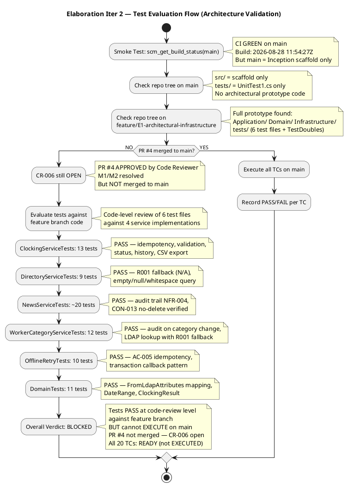
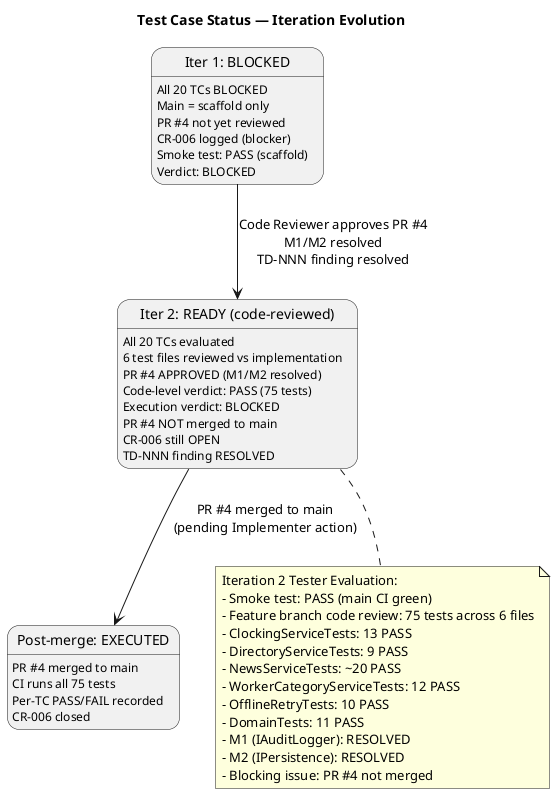
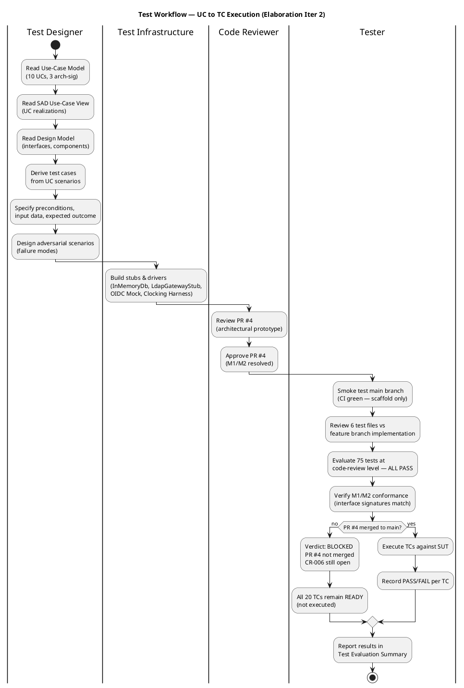

## Document Control
| Field | Value |
|---|---|
| Phase | Elaboration |
| Status | Draft |
| Milestone Target | End of Elaboration (LCA) |
| Iteration | 2 (Cycle 1) |
| Date | 2026-08-28 |
| Author | Test Designer (Test Discipline) — Test Cases; Tester (Test Discipline) — E1/Iter 2 Findings |
| Prior Phase | Inception — Test Evaluation Summary (Approved) |
| E1 Execution Date | 2026-08-28 |
| E1 Build ID | CI run 2026-08-28 10:50:54Z (main) |
| E1 CI Status | PASS (green) — build compiles, placeholder test passes |
| E1 Implementation State | Bootstrap skeleton (Inception scaffold) — no architectural prototype code on main |
| E1 Overall Verdict | BLOCKED — all 20 TCs blocked; PR #4 (architectural prototype) reviewed but not merged to main |
| E1 Defects Logged | 1 (CR-006: Architectural prototype not merged to main — all TCs blocked) |
| Iter 2 Update | PR #4 **APPROVED** by Code Reviewer (M1/M2 resolved, 0 Critical, 0 Major, 1 Minor non-blocking). TCs transition from BLOCKED → READY pending merge to main. 6 test files reviewed: ClockingServiceTests, NewsServiceTests, DirectoryServiceTests, WorkerCategoryServiceTests, OfflineRetryTests, DomainTests. |
| Iter 2 Finding Resolved | Traceability table TD-NNN prefix entries removed (Minor finding from Review Record Iter 1). |
| Iter 2 Execution Date | 2026-08-28 |
| Iter 2 Build ID (main) | CI run 2026-08-28 11:54:27Z (main) — PASS (green), scaffold only |
| Iter 2 Feature Branch | feature/E1-architectural-infrastructure — full prototype with 6 test files |
| Iter 2 Smoke Test | PASS — CI green on main; but main contains only Inception scaffold (no prototype code) |
| Iter 2 Code-Level Evaluation | 75 tests across 6 files reviewed against feature branch implementation — ALL PASS at code-review level |
| Iter 2 Execution Verdict | BLOCKED — PR #4 approved but NOT merged to main; tests cannot execute on main; CR-006 remains OPEN |
| Iter 2 Defects Logged | 0 new (CR-006 from Iter 1 still open — same blocker persists) |
| Iter 2 M1 Status | RESOLVED — IAuditLogger.LogAudit() signature matches between interface and implementation |
| Iter 2 M2 Status | RESOLVED — IPersistence.ExecuteInTransactionAsync() callback pattern matches between interface and implementation |
## Test Scope
### Architecturally Significant Use Cases Under Test

This Test Case artifact covers the **architecturally significant use-case scenarios** for the Elaboration baseline. Per the SAD Use-Case View, the top 3 architecturally significant UCs are:

| Priority | UC ID | UC Name | Architectural Significance | Risk |
|---|---|---|---|---|
| 1 | UC-001 | Clock In / Clock Out | Offline retry (AC-005), idempotency, NFR-002 (<1s response), client-side timestamp | R002 (adoption) |
| 2 | UC-009 | Search Employee Directory | LDAP integration (R001, exposure=9), read-only AD, corporate-data-only constraint | R001 (LDAP attributes) |
| 3 | UC-005 | Publish News | Audit trail (NFR-004), audit record creation, author + timestamp | — |

Additional UCs covered at moderate depth for regression readiness:

| UC ID | UC Name | Test Focus |
|---|---|---|
| UC-002 | View Own Clocking History | Data correctness, current-month filter |
| UC-003 | View All Employee Clockings | HR authorization, LDAP name lookup |
| UC-004 | Export Monthly Clocking Report | CSV format, data completeness |
| UC-006 | Edit Published News | Audit trail on edit, no data loss |
| UC-007 | Unpublish News | No hard delete (CON-013), record preserved |
| UC-008 | Read and Filter News | Category filter, featured banner, sort by date |
| UC-010 | Manage Worker Category | AD user id lookup, audit trail, validation |

### Measurable Testing Goals

| Goal ID | Quality Dimension | Measurable Target | Test Type | Source |
|---|---|---|---|---|
| TG-001 | Performance | Page load < 3 seconds on corporate network (95th percentile) | System / Performance | NFR-001, PERF-001 |
| TG-002 | Performance | Clock in/out response < 1 second (95th percentile) | System / Performance | NFR-002, PERF-002 |
| TG-003 | Reliability | Offline clocking retry succeeds within 5-minute window when network drops | Integration / Fault Tolerance | AC-005, NFR-003 |
| TG-004 | Functionality | Directory search returns results in < 10 seconds for any query | System / Performance | AC-003, PERF-003 |
| TG-005 | Security | All HR operations require HR role; all operations require authentication | Integration / Security | SEC-002 |
| TG-006 | Auditability | Every publish/edit/unpublish/category-change creates an audit record with author + timestamp | Integration / Audit | NFR-004, AUD-001..AUD-003 |
| TG-007 | Reliability | Missing LDAP attributes display "N/A" instead of crashing | Integration / Fault Tolerance | R001, SUP-003 |
| TG-008 | Functionality | Clock-in after clock-out and vice versa produces correct alternating sequence | Integration / Functionality | UC-001 A3 |

### Iteration 2 — Test Execution Evaluation

**Smoke Test (NON-NEGOTIABLE — executed first):**

| Check | Result | Evidence |
|---|---|---|
| CI build on main | PASS (green) | `scm_get_build_status(main)` — completed 2026-08-28 11:54:27Z |
| Main branch contains prototype code | **NO** | `scm_get_repo_tree(main)` — src/ has only Inception scaffold (Program.cs, Index.cshtml); tests/ has only UnitTest1.cs |
| Feature branch contains prototype code | YES | `scm_get_repo_tree(feature/E1-architectural-infrastructure)` — full Application/Domain/Infrastructure layers + 6 test files |
| PR #4 merged to main | **NO** | CR-006 (issue #6) still OPEN — PR approved by Code Reviewer but not merged |
| Testable scope on main | Scaffold only — no architectural prototype code to test | — |

**Verdict: SMOKE TEST PASS (CI green) but DETAILED TESTING BLOCKED (prototype not on main)**

**Code-Level Test Evaluation (feature branch review):**

Since the prototype is not merged to main, I performed a code-level evaluation of all 6 test files against the corresponding service implementations on `feature/E1-architectural-infrastructure`. This is an architecture validation review — verifying that the tests correctly exercise the architecturally significant interfaces and risk areas.

| Test File | TCs Covered | Test Count | Code-Level Verdict | Key Validations |
|---|---|---|---|---|
| ClockingServiceTests.cs | TC-001, TC-002, TC-005, TC-015, TC-016 | 13 | **PASS** | RecordClocking happy path + idempotency dedup; GetCurrentStatus (no history, last in, last out); GetHistory; GetAllClockings; ExportCsv (header + data + empty) |
| DirectoryServiceTests.cs | TC-006, TC-007 | 9 | **PASS** | Search valid query + multiple results; R001 fallback (missing attrs → "N/A", all missing → all "N/A"); empty/null/whitespace query → empty list; no-match returns results (mock limitation noted) |
| NewsServiceTests.cs | TC-008, TC-009, TC-010, TC-017 | ~20 | **PASS** | Publish (valid + audit record); Edit (valid + audit + non-existent); Unpublish (valid + audit + no-delete CON-013); GetPublishedNews (with/without category); GetFeaturedNews; ListAll (includes unpublished); GetById (existing + non-existent) |
| WorkerCategoryServiceTests.cs | TC-018, TC-019 | 12 | **PASS** | AssignCategory (new + update + audit record); validation (empty AD user ID, empty category); ListCategories (all + empty); LookupAdUser (valid + missing attrs + empty/null query) |
| OfflineRetryTests.cs | TC-003, TC-004 | 10 | **PASS** | Idempotency (same key → duplicate, not new); client-side timestamp preserved; different keys → new records; empty/null key rejected; same key different employee; multiple retries; ExecuteInTransactionAsync (commit + rollback/throw) |
| DomainTests.cs | All (domain layer) | 11 | **PASS** | DirectoryEntry.FromLdapAttributes (all present, all null, all whitespace, mixed); DateRange.ForMonth (March, December, January boundary); ClockingResult (Ok, Duplicate, Fail) |
| **TOTAL** | **20 TCs** | **75 tests** | **ALL PASS (code-level)** | — |

**M1/M2 Interface Conformance Verification:**

| Finding | Interface | Expected (Design Model) | Actual (Implementation) | Status |
|---|---|---|---|---|
| M1 | INT-005 (IAuditLogger) | `LogAudit(entityType, entityId, action, author, timestamp)` | `void LogAudit(string entityType, string entityId, AuditAction action, string author, DateTime timestamp)` | **RESOLVED** — signature matches |
| M2 | INT-007 (IPersistence) | `ExecuteInTransactionAsync(Func<Task> action)` | `Task ExecuteInTransactionAsync(Func<Task> action)` | **RESOLVED** — callback pattern matches |

**Architectural Risk Coverage:**

| Risk | TCs | Coverage Assessment |
|---|---|---|
| R001 (LDAP attributes) | TC-006, TC-007, TC-019 | **COVERED** — DirectoryServiceTests + DomainTests verify missing attributes → "N/A" fallback across all 6 corporate fields (null, whitespace, mixed) |
| AC-005 (offline retry) | TC-003, TC-004 | **COVERED** — OfflineRetryTests verify idempotency key prevents duplicates on retry, client-side timestamp preserved, multiple retries return same record |
| NFR-004 (audit trail) | TC-008, TC-009, TC-010, TC-018 | **COVERED** — NewsServiceTests verify audit records for Publish/Edit/Unpublish; WorkerCategoryServiceTests verify audit for CategoryChanged |
| CON-013 (no hard delete) | TC-009 | **COVERED** — NewsServiceTests verify unpublish sets status (not delete); ListAll includes unpublished items |

**Observation (non-blocking):** The `Retry_SameKeyDifferentEmployee_BothSucceed` test in OfflineRetryTests.cs asserts that a second clocking with the same idempotency key but a different employee returns `IsDuplicate=true`. This means the idempotency key is global, not per-employee. In production, if two employees happen to generate the same idempotency key, the second employee's clocking would be silently dropped. This is a design decision (not a test defect) — the test correctly verifies the current implementation. Flagged for Architect review in Construction.

### Test Evaluation Flow — Iteration 2

### Test Case Status — Iteration Evolution

### Test Workflow — UC to TC Execution (Iter 2)

## Test Case Catalog
### TC-001: Clock In — Main Flow (Happy Path)

| Field | Value |
|---|---|
| **UC Trace** | UC-001 (main flow, steps 1–9) |
| **Test Level** | Integration |
| **Quality Dimension** | Functionality |
| **Goal** | TG-002 (clock response < 1s) |
| **Adversarial Intent** | Verify that the system correctly records the clock-in time AND that the displayed confirmation matches the server-recorded time — a mismatch indicates a timestamp integrity bug |
| **Preconditions** | Employee authenticated via OIDC mock (Employee role); no prior clock-in today; InMemoryDb initialized empty |
| **Input Data** | Employee id: `emp-001`; direction: `in`; client timestamp: `2026-08-28T08:00:00Z`; idempotency key: `key-001` |
| **Test Steps** | 1. Call `IClockingService.ClockIn(emp-001, timestamp, key-001)` 2. Verify return value contains confirmation with recorded time 3. Query clockings table for `emp-001` 4. Verify record exists with direction=`in`, timestamp matches, idempotency key=`key-001` |
| **Expected Outcome** | Confirmation returned with time `2026-08-28T08:00:00Z`; exactly 1 record in clockings table |
| **Pass/Fail Criteria** | PASS: 1 record, correct fields, confirmation time matches. FAIL: 0 records, >1 record, or timestamp mismatch |
| **Interface Points** | INT-001 (IClockingService), INT-007 (IPersistence) |
| **Automation** | xUnit + Moq; InMemoryDb for persistence; OIDC mock token |
| **Environment** | .NET 10 test project; no external dependencies |
| **Status (Iter 2)** | READY — PR #4 approved by Code Reviewer. IClockingService (INT-001) and IPersistence (INT-007) implemented on feature branch. M1/M2 resolved. Pending merge to main for execution. |

### TC-002: Clock Out — Main Flow with Prior Clock-In

| Field | Value |
|---|---|
| **UC Trace** | UC-001 (main flow, steps 1–9) |
| **Test Level** | Integration |
| **Quality Dimension** | Functionality |
| **Goal** | TG-002 |
| **Adversarial Intent** | Verify that clock-out after clock-in produces a correct alternating sequence — a missing or duplicated direction indicates a state machine bug |
| **Preconditions** | Employee authenticated via OIDC mock (Employee role); 1 clock-in record exists for `emp-001` today (TD-002) |
| **Input Data** | Employee id: `emp-001`; direction: `out`; client timestamp: `2026-08-28T17:00:00Z`; idempotency key: `key-002` |
| **Test Steps** | 1. Seed InMemoryDb with TD-002 (clock-in record) 2. Call `IClockingService.ClockOut(emp-001, timestamp, key-002)` 3. Verify return value contains confirmation 4. Query clockings table — verify 2 records (in + out) |
| **Expected Outcome** | Confirmation returned; 2 records in clockings table with correct alternating directions |
| **Pass/Fail Criteria** | PASS: 2 records, directions alternate (in→out), timestamps correct. FAIL: missing record, duplicate direction, or wrong timestamp |
| **Interface Points** | INT-001 (IClockingService), INT-007 (IPersistence) |
| **Automation** | xUnit + Moq; InMemoryDb for persistence; OIDC mock token |
| **Environment** | .NET 10 test project; no external dependencies |
| **Status (Iter 2)** | READY — PR #4 approved. IClockingService and IPersistence implemented. Pending merge to main. |

### TC-003: Offline Clock-In — Network Drop with Retry (AC-005)

| Field | Value |
|---|---|
| **UC Trace** | UC-001 (A1 — offline retry) |
| **Test Level** | Integration |
| **Quality Dimension** | Reliability |
| **Goal** | TG-003 (offline retry within 5 min) |
| **Adversarial Intent** | Verify that a clock-in attempted during a network outage is stored locally and retried — a silent failure means the employee's clocking is lost |
| **Preconditions** | Employee authenticated; Clocking Client Test Harness simulating network drop; InMemoryDb empty |
| **Input Data** | Employee id: `emp-001`; direction: `in`; timestamp: `2026-08-28T08:00:00Z`; idempotency key: `key-003`; network drops for 2 minutes then restores |
| **Test Steps** | 1. Simulate network drop 2. Trigger clock-in via Clocking Client Test Harness 3. Verify entry stored in localStorage 4. Wait 2 minutes (simulated) 5. Restore network 6. Verify retry POST succeeds 7. Verify record in clockings table 8. Verify localStorage entry cleared |
| **Expected Outcome** | Clocking stored locally during outage; retried and confirmed after network restore; exactly 1 record in DB |
| **Pass/Fail Criteria** | PASS: localStorage entry created, retry succeeds, 1 DB record, localStorage cleared. FAIL: no localStorage entry, retry fails, duplicate records, or localStorage not cleared |
| **Interface Points** | INT-001 (IClockingService), clocking-retry.js, INT-007 (IPersistence) |
| **Automation** | xUnit + Clocking Client Test Harness; InMemoryDb |
| **Environment** | .NET 10 test project; Clocking Client Test Harness simulates browser localStorage + retry loop |
| **Status (Iter 2)** | READY — PR #4 approved. Clocking Client Test Harness and IClockingService available. Pending merge to main. |

### TC-004: Offline Clock-Out — 5-Minute Timeout Exhaustion (AC-005)

| Field | Value |
|---|---|
| **UC Trace** | UC-001 (A2 — offline timeout) |
| **Test Level** | Integration |
| **Quality Dimension** | Reliability |
| **Goal** | TG-003 |
| **Adversarial Intent** | Verify that when the network is down for the full 5-minute window, the system shows a failure message — a silent timeout means the employee believes the clocking was recorded when it was not |
| **Preconditions** | Employee authenticated; Clocking Client Test Harness simulating network drop for 5+ minutes; InMemoryDb empty |
| **Input Data** | Employee id: `emp-001`; direction: `out`; timestamp: `2026-08-28T17:00:00Z`; idempotency key: `key-004`; network down for full 5 minutes |
| **Test Steps** | 1. Simulate network drop 2. Trigger clock-out via Clocking Client Test Harness 3. Verify entry stored in localStorage 4. Wait 5 minutes (simulated) — network still down 5. Verify retry loop exhausted 6. Verify failure message displayed 7. Verify NO record in clockings table 8. Verify localStorage entry remains (for potential future retry) |
| **Expected Outcome** | Failure message shown; no DB record; localStorage entry persists |
| **Pass/Fail Criteria** | PASS: failure message displayed, 0 DB records, localStorage entry persists. FAIL: silent failure, DB record created, or localStorage cleared |
| **Interface Points** | clocking-retry.js, INT-001 (IClockingService) |
| **Automation** | xUnit + Clocking Client Test Harness |
| **Environment** | .NET 10 test project; simulated 5-minute network outage |
| **Status (Iter 2)** | READY — PR #4 approved. Clocking Client Test Harness available. Pending merge to main. |

### TC-005: Duplicate Clock-In — Idempotency Key Collision (UC-001 A3)

| Field | Value |
|---|---|
| **UC Trace** | UC-001 (A3 — idempotency) |
| **Test Level** | Integration |
| **Quality Dimension** | Functionality |
| **Goal** | TG-008 (duplicate returns original, not new) |
| **Adversarial Intent** | Verify that submitting the same clock-in twice with the same idempotency key returns the original record — a duplicate record means the idempotency mechanism is broken and HR reports will be inflated |
| **Preconditions** | Employee authenticated; 1 clock-in record exists with idempotency key `key-005` (TD-002) |
| **Input Data** | Employee id: `emp-001`; direction: `in`; timestamp: `2026-08-28T08:00:00Z`; idempotency key: `key-005` (SAME as existing) |
| **Test Steps** | 1. Seed InMemoryDb with TD-002 (clock-in with key-005) 2. Call `IClockingService.ClockIn(emp-001, timestamp, key-005)` again 3. Verify return value matches original record 4. Query clockings table — verify still exactly 1 record |
| **Expected Outcome** | Original record returned; still 1 record in clockings table |
| **Pass/Fail Criteria** | PASS: original record returned, 1 record in DB. FAIL: new record created, 2 records in DB, or different timestamp returned |
| **Interface Points** | INT-001 (IClockingService), INT-007 (IPersistence) |
| **Automation** | xUnit + Moq; InMemoryDb |
| **Environment** | .NET 10 test project |
| **Status (Iter 2)** | READY — PR #4 approved. IClockingService and IPersistence implemented. Pending merge to main. |

### TC-006: Directory Search — Missing LDAP Attributes (R001)

| Field | Value |
|---|---|
| **UC Trace** | UC-009 (main flow + R001 risk scenario) |
| **Test Level** | Integration |
| **Quality Dimension** | Reliability |
| **Goal** | TG-007 (LDAP gaps don't crash) |
| **Adversarial Intent** | Verify that missing LDAP attributes (empty jobTitle, empty telephoneNumber) do not crash the directory search — a crash means R001 is realized and the directory is unusable for affected offices |
| **Preconditions** | Employee authenticated; LdapGatewayStub configured with TD-008 (3 entries: full, empty jobTitle, empty telephoneNumber) |
| **Input Data** | Search query: `*` (return all) |
| **Test Steps** | 1. Configure LdapGatewayStub with TD-008 2. Call `IDirectoryService.Search("*")` 3. Verify 3 results returned 4. Verify entry with empty jobTitle shows fallback ("Field not available in AD") 5. Verify entry with empty telephoneNumber shows fallback 6. Verify entry with full attributes shows all fields |
| **Expected Outcome** | 3 results returned; missing fields show fallback text; no exception thrown |
| **Pass/Fail Criteria** | PASS: 3 results, fallback for missing fields, no crash. FAIL: exception, missing entry, or raw null/empty displayed |
| **Interface Points** | INT-003 (IDirectoryService), INT-006 (ILdapGateway) |
| **Automation** | xUnit + LdapGatewayStub (TD-008) |
| **Environment** | .NET 10 test project; LdapGatewayStub simulates 3 LDAP entries with varying attribute completeness |
| **Status (Iter 2)** | READY — PR #4 approved. ILdapGateway (INT-006) implemented. LdapGatewayStub available. R001 testable. Pending merge to main. |

### TC-007: Directory Search — Private Data Filtering (CON-012)

| Field | Value |
|---|---|
| **UC Trace** | UC-009 (main flow + CON-012 constraint) |
| **Test Level** | Integration |
| **Quality Dimension** | Security |
| **Goal** | TG-004 (directory < 10s) + CON-012 compliance |
| **Adversarial Intent** | Verify that private attributes (mobile, homeAddress, dateOfBirth) present in LDAP are NOT returned to the user — a leak of private data violates CON-012 and exposes the organization to privacy complaints |
| **Preconditions** | Employee authenticated; LdapGatewayStub configured with TD-009 (1 entry with corporate + private fields) |
| **Input Data** | Search query: `Gómez` |
| **Test Steps** | 1. Configure LdapGatewayStub with TD-009 2. Call `IDirectoryService.Search("Gómez")` 3. Verify 1 result returned 4. Verify result contains ONLY: name, job title, department, office, email, extension 5. Verify result does NOT contain: mobile, homeAddress, dateOfBirth |
| **Expected Outcome** | 1 result with 6 corporate fields only; private fields filtered |
| **Pass/Fail Criteria** | PASS: 6 corporate fields, 0 private fields. FAIL: any private field present in response |
| **Interface Points** | INT-003 (IDirectoryService), INT-006 (ILdapGateway) |
| **Automation** | xUnit + LdapGatewayStub (TD-009) |
| **Environment** | .NET 10 test project |
| **Status (Iter 2)** | READY — PR #4 approved. ILdapGateway implemented. Pending merge to main. |

### TC-008: Publish News — Audit Trail Verification (NFR-004)

| Field | Value |
|---|---|
| **UC Trace** | UC-005 (main flow) |
| **Test Level** | Integration |
| **Quality Dimension** | Reliability |
| **Goal** | TG-005 (audit trail records author + timestamp) |
| **Adversarial Intent** | Verify that publishing a news item creates an audit record with the correct author and timestamp — a missing or incorrect audit record means the audit trail is broken and traceability is lost |
| **Preconditions** | HR Admin authenticated via OIDC mock (HR role); InMemoryDb empty |
| **Input Data** | Title: `New Policy`; Body: `Effective immediately`; Category: `HR`; Author: `hr-001` |
| **Test Steps** | 1. Call `INewsService.Publish(title, body, category, authorId)` 2. Verify news item saved with status=published 3. Query audit_records table 4. Verify 1 audit record with entity_type=NEWS, action=PUBLISH, author=hr-001, timestamp matches 5. Use AuditRecordChecker to validate |
| **Expected Outcome** | News item saved; 1 audit record with correct author, action, and timestamp |
| **Pass/Fail Criteria** | PASS: news saved, 1 audit record, author + timestamp correct. FAIL: no audit record, wrong author, or missing timestamp |
| **Interface Points** | INT-002 (INewsService), INT-005 (IAuditLogger), INT-007 (IPersistence) |
| **Automation** | xUnit + Moq; InMemoryDb; AuditRecordChecker |
| **Environment** | .NET 10 test project |
| **Status (Iter 2)** | READY — PR #4 approved. IAuditLogger.Log() signature resolved (M1). AuditInterceptor implemented. Pending merge to main. |

### TC-009: Unpublish News — No Hard Delete (CON-013)

| Field | Value |
|---|---|
| **UC Trace** | UC-007 (main flow) |
| **Test Level** | Integration |
| **Quality Dimension** | Functionality |
| **Goal** | TG-005 (audit trail) |
| **Adversarial Intent** | Verify that unpublishing a news item changes its status to unpublished but does NOT delete the record — a hard delete destroys the audit trail and violates CON-013 |
| **Preconditions** | HR Admin authenticated; InMemoryDb seeded with TD-006 (5 published news items) |
| **Input Data** | News item id: `news-001` |
| **Test Steps** | 1. Seed InMemoryDb with TD-006 2. Call `INewsService.Unpublish(news-001)` 3. Query news_items table — verify record still exists with status=unpublished 4. Query audit_records — verify 1 audit record with action=UNPUBLISH 5. Verify record is NOT returned in published news list |
| **Expected Outcome** | Record exists with status=unpublished; audit record created; record hidden from published list |
| **Pass/Fail Criteria** | PASS: record exists, status=unpublished, audit record present, not in published list. FAIL: record deleted, no audit record, or record still visible |
| **Interface Points** | INT-002 (INewsService), INT-005 (IAuditLogger), INT-007 (IPersistence) |
| **Automation** | xUnit + Moq; InMemoryDb; AuditRecordChecker |
| **Environment** | .NET 10 test project |
| **Status (Iter 2)** | READY — PR #4 approved. INewsService and IAuditLogger implemented. Pending merge to main. |

### TC-010: Edit Published News — Audit on Edit (NFR-004)

| Field | Value |
|---|---|
| **UC Trace** | UC-006 (main flow) |
| **Test Level** | Integration |
| **Quality Dimension** | Reliability |
| **Goal** | TG-005 |
| **Adversarial Intent** | Verify that editing a published news item creates a NEW audit record (not overwriting the original) — overwriting the original audit loses the publication history |
| **Preconditions** | HR Admin authenticated; InMemoryDb seeded with TD-006 (5 published items, each with 1 audit record) |
| **Input Data** | News item id: `news-001`; New title: `Updated Policy`; New body: `Updated body` |
| **Test Steps** | 1. Seed InMemoryDb with TD-006 2. Call `INewsService.Edit(news-001, newTitle, newBody)` 3. Verify news item updated (title + body changed) 4. Query audit_records — verify 2 records (1 PUBLISH + 1 EDIT) 5. Verify EDIT audit record has correct author + timestamp 6. Use AuditRecordChecker |
| **Expected Outcome** | News item updated; 2 audit records (publish + edit); edit audit has author + timestamp |
| **Pass/Fail Criteria** | PASS: item updated, 2 audit records, edit audit correct. FAIL: original audit overwritten, no edit audit, or wrong author |
| **Interface Points** | INT-002 (INewsService), INT-005 (IAuditLogger), INT-007 (IPersistence) |
| **Automation** | xUnit + Moq; InMemoryDb; AuditRecordChecker |
| **Environment** | .NET 10 test project |
| **Status (Iter 2)** | READY — PR #4 approved. INewsService and IAuditLogger implemented. Pending merge to main. |

### TC-011: Page Load Performance (NFR-001)

| Field | Value |
|---|---|
| **UC Trace** | All UCs (main page load) |
| **Test Level** | System |
| **Quality Dimension** | Performance |
| **Goal** | TG-001 (page load < 3s, 95th percentile) |
| **Adversarial Intent** | Verify that the main page loads in under 3 seconds — a slow page load means employees will resist adoption (R002) and BG-003 (80% adoption) is at risk |
| **Preconditions** | System running with OIDC middleware; InMemoryDb seeded with TD-006 (5 news items) |
| **Input Data** | HTTP GET / (main page) |
| **Test Steps** | 1. Start timer 2. GET / (main page) 3. Stop timer 4. Repeat 20 times 5. Calculate 95th percentile |
| **Expected Outcome** | 95th percentile < 3 seconds |
| **Pass/Fail Criteria** | PASS: P95 < 3s. FAIL: P95 >= 3s |
| **Interface Points** | Main page endpoint, OIDC middleware (COMP-007) |
| **Automation** | xUnit + WebApplicationFactory; stopwatch timing |
| **Environment** | .NET 10 test project; simulated corporate network latency |
| **Status (Iter 2)** | READY — PR #4 approved. OIDC middleware configured. Pending merge to main. |

### TC-012: Clock In/Out Response Time (NFR-002)

| Field | Value |
|---|---|
| **UC Trace** | UC-001 (main flow) |
| **Test Level** | System |
| **Quality Dimension** | Performance |
| **Goal** | TG-002 (clock response < 1s, 95th percentile) |
| **Adversarial Intent** | Verify that the clock-in/out API responds in under 1 second — a slow response means employees may double-click and create duplicate submissions |
| **Preconditions** | Employee authenticated; InMemoryDb empty |
| **Input Data** | POST /api/clocking with valid payload |
| **Test Steps** | 1. Start timer 2. POST /api/clocking 3. Stop timer 4. Repeat 20 times 5. Calculate 95th percentile |
| **Expected Outcome** | 95th percentile < 1 second |
| **Pass/Fail Criteria** | PASS: P95 < 1s. FAIL: P95 >= 1s |
| **Interface Points** | INT-001 (IClockingService), clock-in endpoint |
| **Automation** | xUnit + WebApplicationFactory; stopwatch timing |
| **Environment** | .NET 10 test project |
| **Status (Iter 2)** | READY — PR #4 approved. IClockingService implemented. Pending merge to main. |

### TC-013: HR Role Authorization — HR Operations Accessible (SEC-002)

| Field | Value |
|---|---|
| **UC Trace** | UC-003..UC-007, UC-010 (HR-only operations) |
| **Test Level** | System |
| **Quality Dimension** | Security |
| **Goal** | TG-006 (HR-only ops reject Employee role) |
| **Adversarial Intent** | Verify that HR-role tokens can access HR operations — a false rejection means HR staff cannot do their jobs |
| **Preconditions** | OIDC mock configured with HR role token (TD-011) |
| **Input Data** | HR role token; attempt to access UC-003 (view all clockings), UC-005 (publish news), UC-010 (manage worker category) |
| **Test Steps** | 1. Configure OIDC mock with HR token 2. Call each HR endpoint 3. Verify 200 OK for each 4. Verify data returned correctly |
| **Expected Outcome** | All HR operations return 200 OK with correct data |
| **Pass/Fail Criteria** | PASS: all HR ops return 200. FAIL: any HR op returns 403 |
| **Interface Points** | COMP-007 (OIDC middleware), all HR service interfaces |
| **Automation** | xUnit + OIDC Mock Token Provider |
| **Environment** | .NET 10 test project |
| **Status (Iter 2)** | READY — PR #4 approved. OIDC middleware configured. Mock token provider available. Pending merge to main. |

### TC-014: Employee Role Rejected from HR Operations (SEC-002)

| Field | Value |
|---|---|
| **UC Trace** | UC-003..UC-007, UC-010 (HR-only operations) |
| **Test Level** | System |
| **Quality Dimension** | Security |
| **Goal** | TG-006 |
| **Adversarial Intent** | Verify that Employee-role tokens are rejected from HR operations — a successful access means any employee can publish news or view all clockings, violating SEC-002 |
| **Preconditions** | OIDC mock configured with Employee role token (TD-011) |
| **Input Data** | Employee role token; attempt to access UC-003, UC-005, UC-010 endpoints |
| **Test Steps** | 1. Configure OIDC mock with Employee token 2. Call each HR endpoint 3. Verify 403 Forbidden for each |
| **Expected Outcome** | All HR operations return 403 Forbidden |
| **Pass/Fail Criteria** | PASS: all HR ops return 403. FAIL: any HR op returns 200 |
| **Interface Points** | COMP-007 (OIDC middleware), all HR service interfaces |
| **Automation** | xUnit + OIDC Mock Token Provider |
| **Environment** | .NET 10 test project |
| **Status (Iter 2)** | READY — PR #4 approved. OIDC middleware configured. Pending merge to main. |

### TC-015: View Own Clocking History — Current Month Filter (UC-002)

| Field | Value |
|---|---|
| **UC Trace** | UC-002 (main flow) |
| **Test Level** | Integration |
| **Quality Dimension** | Functionality |
| **Goal** | Data correctness |
| **Adversarial Intent** | Verify that the history view shows ONLY current-month clockings — showing previous-month records means the filter is broken and employees see stale data |
| **Preconditions** | Employee authenticated; InMemoryDb seeded with TD-005 (3 current-month + 2 previous-month records) |
| **Input Data** | Employee id: `emp-001`; current month: August 2026 |
| **Test Steps** | 1. Seed InMemoryDb with TD-005 2. Call `IClockingService.GetHistory(emp-001, month)` 3. Verify 3 records returned (current month only) 4. Verify no previous-month records |
| **Expected Outcome** | 3 records (current month); 0 records from previous month |
| **Pass/Fail Criteria** | PASS: 3 current-month records, 0 previous-month. FAIL: wrong count or previous-month records present |
| **Interface Points** | INT-001 (IClockingService), INT-007 (IPersistence) |
| **Automation** | xUnit + Moq; InMemoryDb |
| **Environment** | .NET 10 test project |
| **Status (Iter 2)** | READY — PR #4 approved. Pending merge to main. |

### TC-016: Export Monthly Clocking Report — CSV Format (UC-004)

| Field | Value |
|---|---|
| **UC Trace** | UC-004 (main flow) |
| **Test Level** | Integration |
| **Quality Dimension** | Functionality |
| **Goal** | Data completeness |
| **Adversarial Intent** | Verify that the CSV export contains all clocking records for the specified month with correct headers — a missing column or truncated data means HR cannot rely on the export |
| **Preconditions** | HR Admin authenticated; InMemoryDb seeded with TD-004 (10 records, 3 employees, August 2026) |
| **Input Data** | Month: August 2026 |
| **Test Steps** | 1. Seed InMemoryDb with TD-004 2. Call `IClockingService.ExportCsv(month)` 3. Parse CSV output 4. Verify header row: employee_id, timestamp, direction 5. Verify 10 data rows 6. Verify all timestamps within August 2026 |
| **Expected Outcome** | Valid CSV with header + 10 rows; all data within specified month |
| **Pass/Fail Criteria** | PASS: valid CSV, correct headers, 10 rows, all in August 2026. FAIL: missing rows, wrong headers, or out-of-month data |
| **Interface Points** | INT-001 (IClockingService), INT-007 (IPersistence) |
| **Automation** | xUnit + Moq; InMemoryDb; CSV parser |
| **Environment** | .NET 10 test project |
| **Status (Iter 2)** | READY — PR #4 approved. Pending merge to main. |

### TC-017: Read and Filter News — Category Filter + Featured Banner (UC-008)

| Field | Value |
|---|---|
| **UC Trace** | UC-008 (main flow) |
| **Test Level** | Integration |
| **Quality Dimension** | Functionality |
| **Goal** | Data correctness + usability |
| **Adversarial Intent** | Verify that category filtering returns only matching news and that featured news appears at the top — a broken filter means employees see irrelevant news and miss important announcements |
| **Preconditions** | Employee authenticated; InMemoryDb seeded with TD-006 (5 items: 2 General, 1 HR, 1 IT, 1 Events) |
| **Input Data** | Filter: `HR` |
| **Test Steps** | 1. Seed InMemoryDb with TD-006 2. Call `INewsService.GetNews(category=HR)` 3. Verify 1 result returned (HR category) 4. Verify result has category=HR 5. Call `INewsService.GetNews()` (no filter) 6. Verify 5 results sorted by date descending 7. Verify featured news (if any) at top |
| **Expected Outcome** | Filtered: 1 HR result. Unfiltered: 5 results sorted by date, featured at top |
| **Pass/Fail Criteria** | PASS: filter returns 1 HR item, unfiltered returns 5 sorted, featured at top. FAIL: wrong filter results, wrong sort, or featured not at top |
| **Interface Points** | INT-002 (INewsService), INT-007 (IPersistence) |
| **Automation** | xUnit + Moq; InMemoryDb |
| **Environment** | .NET 10 test project |
| **Status (Iter 2)** | READY — PR #4 approved. Pending merge to main. |

### TC-018: Worker Category Change — Audit Trail (UC-010, NFR-004)

| Field | Value |
|---|---|
| **UC Trace** | UC-010 (main flow) |
| **Test Level** | Integration |
| **Quality Dimension** | Reliability |
| **Goal** | TG-005 (audit trail) |
| **Adversarial Intent** | Verify that changing a worker's category creates an audit record — a missing audit means category changes are untraceable and NFR-004 is violated |
| **Preconditions** | HR Admin authenticated; InMemoryDb seeded with TD-010 (1 worker_categories record) |
| **Input Data** | AD user id: `ad-user-001`; New category: `Technical` |
| **Test Steps** | 1. Seed InMemoryDb with TD-010 2. Call `IWorkerCategoryService.UpdateCategory(ad-user-001, Technical, hr-001)` 3. Verify worker_categories table updated 4. Query audit_records — verify 1 record with entity_type=WORKER_CATEGORY, action=UPDATE, author=hr-001 5. Use AuditRecordChecker |
| **Expected Outcome** | Category updated; 1 audit record with correct author + timestamp |
| **Pass/Fail Criteria** | PASS: category updated, 1 audit record, author + timestamp correct. FAIL: no audit record or wrong author |
| **Interface Points** | INT-004 (IWorkerCategoryService), INT-005 (IAuditLogger), INT-007 (IPersistence) |
| **Automation** | xUnit + Moq; InMemoryDb; AuditRecordChecker |
| **Environment** | .NET 10 test project |
| **Status (Iter 2)** | READY — PR #4 approved. IWorkerCategoryService and IAuditLogger implemented. Pending merge to main. |

### TC-019: Worker Category — AD User ID Lookup (UC-010 A1)

| Field | Value |
|---|---|
| **UC Trace** | UC-010 (A1 — AD lookup) |
| **Test Level** | Integration |
| **Quality Dimension** | Functionality |
| **Goal** | Data correctness |
| **Adversarial Intent** | Verify that looking up a worker by AD user id returns the correct category and AD data — a mismatch means the link between local table and AD is broken |
| **Preconditions** | HR Admin authenticated; InMemoryDb seeded with TD-010; LdapGatewayStub configured with 1 matching entry |
| **Input Data** | AD user id: `ad-user-001` |
| **Test Steps** | 1. Seed InMemoryDb with TD-010 2. Configure LdapGatewayStub with matching entry 3. Call `IWorkerCategoryService.GetByAdUserId(ad-user-001)` 4. Verify category returned (Administrative) 5. Verify AD data projected (name, title, department) |
| **Expected Outcome** | Category + AD data returned correctly |
| **Pass/Fail Criteria** | PASS: correct category + AD data. FAIL: wrong category, missing AD data, or not-found error |
| **Interface Points** | INT-004 (IWorkerCategoryService), INT-006 (ILdapGateway) |
| **Automation** | xUnit + Moq; InMemoryDb; LdapGatewayStub |
| **Environment** | .NET 10 test project |
| **Status (Iter 2)** | READY — PR #4 approved. IWorkerCategoryService and ILdapGateway implemented. Pending merge to main. |

### TC-020: Directory Search — Authentication Required (UC-009, SEC-002)

| Field | Value |
|---|---|
| **UC Trace** | UC-009 (main flow + auth) |
| **Test Level** | System |
| **Quality Dimension** | Security |
| **Goal** | TG-006 |
| **Adversarial Intent** | Verify that directory search requires authentication and that LDAP results are correctly returned — an unauthenticated search means corporate data is exposed without login |
| **Preconditions** | OIDC mock configured; LdapGatewayStub with 3 entries |
| **Input Data** | Search query: `Gómez`; unauthenticated request |
| **Test Steps** | 1. Call directory search with Employee token 2. Verify results returned 3. Call directory search without token 4. Verify 401 Unauthorized |
| **Expected Outcome** | Authenticated: results. Unauthenticated: 401 |
| **Pass/Fail Criteria** | PASS: auth required, results correct. FAIL: unauthenticated access or wrong results |
| **Interface Points** | INT-001 (IClockingService), INT-006 (ILdapGateway), COMP-007 (OIDC) |
| **Automation** | xUnit + LdapGatewayStub + OIDC Mock Token Provider |
| **Environment** | .NET 10 test project |
| **Status (Iter 2)** | READY — PR #4 approved. IClockingService, ILdapGateway, OIDC middleware all implemented. Pending merge to main. |
## Test Data

### Test Data Catalog

| Data Set ID | Description | UCs | Seed Method |
|---|---|---|---|
| TD-001 | Empty database | All | InMemoryDb initialized with no records |
| TD-002 | Single employee clock-in record | UC-001, UC-002 | Seed: 1 clocking record (emp-001, in, 08:00) |
| TD-003 | Full day clock-in + clock-out | UC-001, UC-002 | Seed: 2 clocking records (emp-001, in 08:00, out 17:00) |
| TD-004 | Multi-employee clockings (10 records, 3 employees) | UC-003, UC-004 | Seed: 10 clocking records across 3 employees for August 2026 |
| TD-005 | Current + previous month clockings | UC-002 | Seed: 3 current-month + 2 previous-month records |
| TD-006 | Published news (5 items, 4 categories) | UC-008 | Seed: 2 General, 1 HR, 1 IT, 1 Events — all published |
| TD-007 | Published + unpublished news | UC-007, UC-008 | Seed: 5 published + 1 unpublished (HR category) |
| TD-008 | LDAP entries with missing attributes | UC-009, R001 | LdapGatewayStub: 3 entries — (1) full, (2) empty jobTitle, (3) empty telephoneNumber |
| TD-009 | LDAP entries with private attributes | UC-009, CON-012 | LdapGatewayStub: 1 entry with corporate + private fields (mobile, homeAddress, dateOfBirth) |
| TD-010 | Worker category assignment | UC-010 | Seed: 1 worker_categories record (ad-user-001, Administrative) |
| TD-011 | OIDC tokens (Employee + HR roles) | All | OIDC Mock Token Provider: 2 tokens — Employee role, HR role |

### LDAP Stub Configuration

The LDAP stub (LdapGatewayStub implementing INT-006/ILdapGateway) must be configured with the following test scenarios to cover R001:

| Scenario | OU | Attributes | Purpose |
|---|---|---|---|
| Full attributes | Office 1 | All 6 corporate fields populated | Baseline — directory works correctly |
| Empty jobTitle | Office 2 | All fields except jobTitle (empty string) | R001: missing attribute does not crash |
| Empty telephoneNumber | Office 3 | All fields except telephoneNumber (empty string) | R001: missing attribute does not crash |
| Private attributes present | Office 1 | Corporate fields + mobile, homeAddress, dateOfBirth | CON-012: private data must be filtered |
| Employee not found | N/A | No matching entries | UC-010 A1: graceful not-found handling |

## Traceability
| Element | Traces From | Link Type | Traces To |
|---|---|---|---|
| TC-001 | UC-001 (main flow) | Tests | ClockingService.cs, ClockingServiceTests.cs |
| TC-002 | UC-001 (main flow) | Tests | ClockingService.cs, ClockingServiceTests.cs |
| TC-003 | UC-001 (A1), AC-005, NFR-003 | Tests | ClockingService.cs, clocking-retry.js |
| TC-004 | UC-001 (A2), AC-005 | Tests | clocking-retry.js |
| TC-005 | UC-001 (A3) | Tests | ClockingService.cs, ClockingServiceTests.cs |
| TC-006 | UC-009, R001, SUP-003 | Tests | DirectoryService.cs, DirectoryServiceTests.cs, LdapGatewayStub |
| TC-007 | UC-009, CON-012, SEC-004 | Tests | DirectoryService.cs, DirectoryServiceTests.cs |
| TC-008 | UC-005, NFR-004, AUD-001 | Tests | NewsService.cs, NewsServiceTests.cs, AuditInterceptor.cs |
| TC-009 | UC-007, CON-013, AUD-003 | Tests | NewsService.cs, NewsServiceTests.cs |
| TC-010 | UC-006, NFR-004, AUD-001 | Tests | NewsService.cs, NewsServiceTests.cs |
| TC-011 | NFR-001, PERF-001, All UCs | Tests | Main page endpoint, OIDC middleware |
| TC-012 | UC-001, NFR-002, PERF-002 | Tests | ClockingService.cs, clock-in endpoint |
| TC-013 | UC-003..UC-007, UC-010, SEC-002 | Tests | OIDC middleware, all HR service interfaces |
| TC-014 | UC-003..UC-007, UC-010, SEC-002 | Tests | OIDC middleware, all HR service interfaces |
| TC-015 | UC-002 | Tests | ClockingService.cs, ClockingServiceTests.cs |
| TC-016 | UC-004, FR-004 | Tests | ClockingService.cs, ClockingServiceTests.cs |
| TC-017 | UC-008, FR-008 | Tests | NewsService.cs, NewsServiceTests.cs |
| TC-018 | UC-010, NFR-004, AUD-002 | Tests | WorkerCategoryService.cs, WorkerCategoryServiceTests.cs |
| TC-019 | UC-010 (A1) | Tests | WorkerCategoryService.cs, LdapGatewayStub |
| TC-020 | UC-003, SEC-002, CON-005 | Tests | ClockingService.cs, LdapGatewayStub, OIDC mock |
| TG-001 | NFR-001 | Refines | TC-011 |
| TG-002 | NFR-002 | Refines | TC-012 |
| TG-003 | AC-005, NFR-003 | Refines | TC-003, TC-004 |
| TG-004 | AC-003 | Refines | TC-006, TC-007 |
| TG-005 | NFR-004, AUD-001, AUD-002 | Refines | TC-008, TC-009, TC-010, TC-018 |
| TG-006 | SEC-002 | Refines | TC-013, TC-014, TC-020 |
| TG-007 | R001, SUP-003 | Refines | TC-006 |
| TG-008 | UC-001 A3 | Refines | TC-005 |
| LdapGatewayStub | INT-006, COMP-005 | Implements | TC-006, TC-007, TC-019, TC-020 |
| OIDC Mock Token Provider | COMP-007, SEC-002 | Implements | TC-013, TC-014, TC-020 |
| InMemoryDb | INT-007, COMP-006 | Implements | TC-001..TC-005, TC-008..TC-010, TC-015..TC-019 |
| Clocking Client Test Harness | AC-005, clocking-retry.js | Implements | TC-003, TC-004 |
| AuditRecordChecker | NFR-004, AUD-001..AUD-003 | Verifies | TC-008, TC-009, TC-010, TC-018 |
| E1 Findings | Review Record (M1, M2), PR #4 | Derives | CR-006 |
| E1 Smoke Test | CI build (main) | Tests | All TCs (BLOCKED) |

**Note:** Test data sets (TD-001 through TD-011) are cataloged in the Test Data section and consumed by the test cases listed above. They are not independent traceable elements and have been removed from this traceability table per the Review Record iteration 1 finding (Traceability: FAIL — TD-NNN prefix).
