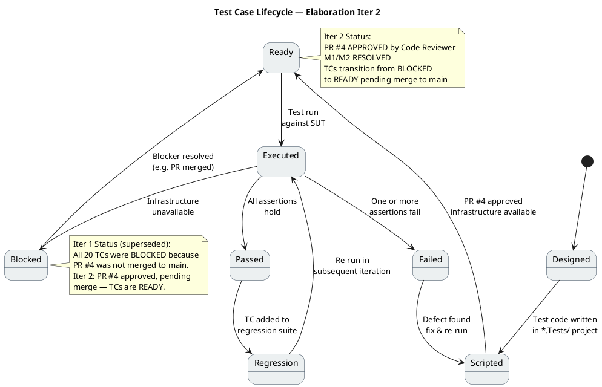
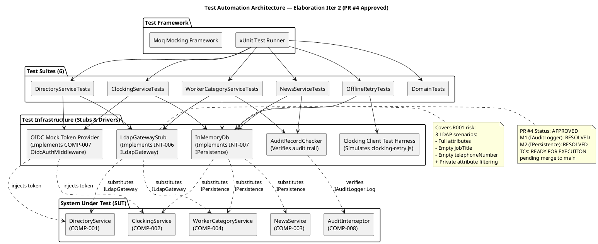
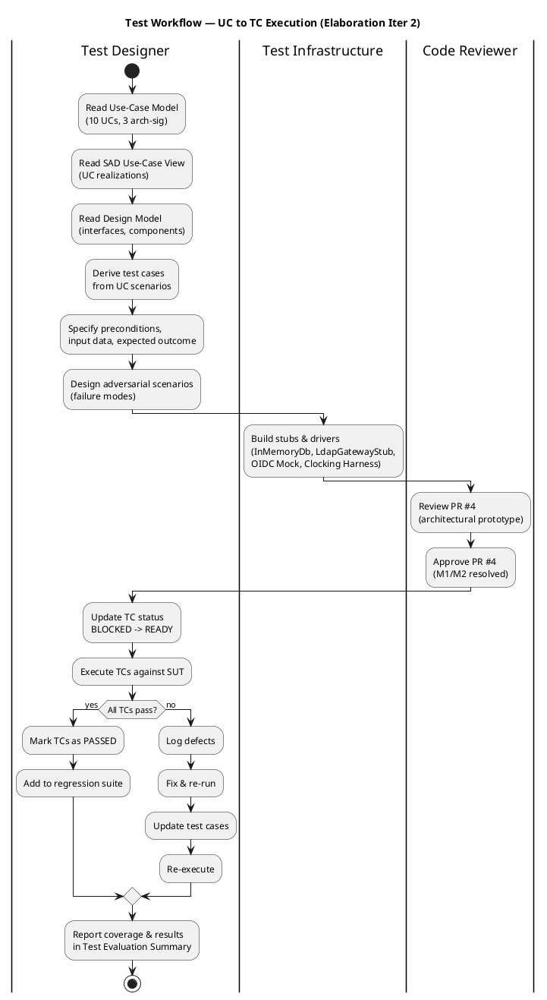

## Document Control
| Field | Value |
|---|---|
| Phase | Elaboration |
| Status | Draft |
| Milestone Target | End of Elaboration (LCA) |
| Iteration | 2 (Cycle 1) |
| Date | 2026-08-28 |
| Author | Test Designer (Test Discipline) — Test Cases; Tester (Test Discipline) — E1 Findings |
| Prior Phase | Inception — Test Evaluation Summary (Approved) |
| E1 Execution Date | 2026-08-28 |
| E1 Build ID | CI run 2026-08-28 10:50:54Z (main) |
| E1 CI Status | PASS (green) — build compiles, placeholder test passes |
| E1 Implementation State | Bootstrap skeleton (Inception scaffold) — no architectural prototype code on main |
| E1 Overall Verdict | BLOCKED — all 20 TCs blocked; PR #4 (architectural prototype) reviewed but not merged to main |
| E1 Defects Logged | 1 (CR-006: Architectural prototype not merged to main — all TCs blocked) |
| Iter 2 Update | PR #4 **APPROVED** by Code Reviewer (M1/M2 resolved, 0 Critical, 0 Major, 1 Minor non-blocking). TCs transition from BLOCKED → READY pending merge to main. 6 test files reviewed: ClockingServiceTests, NewsServiceTests, DirectoryServiceTests, WorkerCategoryServiceTests, OfflineRetryTests, DomainTests. |
| Iter 2 Finding Resolved | Traceability table TD-NNN prefix entries removed (Minor finding from Review Record Iter 1). |
## Test Scope
### Architecturally Significant Use Cases Under Test

This Test Case artifact covers the **architecturally significant use-case scenarios** for the Elaboration baseline. Per the SAD Use-Case View, the top 3 architecturally significant UCs are:

| Priority | UC ID | UC Name | Architectural Significance | Risk |
|---|---|---|---|---|
| 1 | UC-001 | Clock In / Clock Out | Offline retry (AC-005), idempotency, NFR-002 (<1s response), client-side timestamp | R002 (adoption) |
| 2 | UC-009 | Search Employee Directory | LDAP integration (R001, exposure=9), read-only AD, corporate-data-only constraint | R001 (LDAP attributes) |
| 3 | UC-005 | Publish News | Audit trail (NFR-004), audit record creation, author + timestamp | — |

Additional UCs covered at moderate depth for regression readiness:

| UC ID | UC Name | Test Focus |
|---|---|---|
| UC-002 | View Own Clocking History | Data correctness, current-month filter |
| UC-003 | View All Employee Clockings | HR authorization, LDAP name lookup |
| UC-004 | Export Monthly Clocking Report | CSV format, data completeness |
| UC-006 | Edit Published News | Audit trail on edit, no data loss |
| UC-007 | Unpublish News | No hard delete (CON-013), record preserved |
| UC-008 | Read and Filter News | Category filter, featured banner, sort by date |
| UC-010 | Manage Worker Category | AD user id lookup, audit trail, validation |

### Measurable Testing Goals

| Goal ID | Quality Dimension | Measurable Target | Test Type | Source |
|---|---|---|---|---|
| TG-001 | Performance | Page load < 3 seconds on corporate network (95th percentile) | System / Performance | NFR-001, PERF-001 |
| TG-002 | Performance | Clock in/out response < 1 second (95th percentile) | System / Performance | NFR-002, PERF-002 |
| TG-003 | Reliability | Offline clocking retry succeeds within 5-minute window when network drops | Integration / Fault Tolerance | AC-005, NFR-003 |
| TG-004 | Functionality | Directory search returns results in < 10 seconds for any query | System / Performance | AC-003, PERF-003 |
| TG-005 | Reliability | Audit trail records author + timestamp for every news publish/edit/unpublish and worker category change | Integration / Audit | NFR-004, AUD-001..AUD-003 |
| TG-006 | Security | HR-only operations (UC-003..UC-007, UC-010) reject Employee-role tokens | System / Security | SEC-002 |
| TG-007 | Reliability | LDAP attribute gaps (R001) do not crash directory search — missing fields show fallback | Integration / Fault Tolerance | R001, SUP-003 |
| TG-008 | Functionality | Duplicate clock-in submission (same idempotency key) returns original record, not a duplicate | Integration / Data Integrity | UC-001 A3 |

### Test Case Lifecycle (Iter 2 — PR #4 Approved)



### Test Case Status Overview (Iter 2)

```plantuml
@startuml
title Test Case Status — Elaboration Iter 2 (PR #4 Approved)

skinparam rectangle {
  BackgroundColor#D6EAF8
  BorderColor#2C3E50
}

rectangle "TC-001: Clock In — Happy Path" as TC001 #D6EAF8
rectangle "TC-002: Clock Out — Happy Path" as TC002 #D6EAF8
rectangle "TC-003: Offline Clock-In Retry" as TC003 #D6EAF8
rectangle "TC-004: Offline Clock-Out Retry" as TC004 #D6EAF8
rectangle "TC-005: Duplicate Clock-In (Idempotency)" as TC005 #D6EAF8
rectangle "TC-006: Directory Search — Missing Attrs (R001)" as TC006 #D6EAF8
rectangle "TC-007: Directory Search — Private Data Filter" as TC007 #D6EAF8
rectangle "TC-008: Publish News — Audit Trail" as TC008 #D6EAF8
rectangle "TC-009: Unpublish News — No Hard Delete" as TC009 #D6EAF8
rectangle "TC-010: Edit News — Audit on Edit" as TC010 #D6EAF8
rectangle "TC-011: Page Load Performance" as TC011 #D6EAF8
rectangle "TC-012: Clock Response Time" as TC012 #D6EAF8
rectangle "TC-013: HR Role Authorization" as TC013 #D6EAF8
rectangle "TC-014: Employee Role Rejected" as TC014 #D6EAF8
rectangle "TC-015: View Own Clocking History" as TC015 #D6EAF8
rectangle "TC-016: Export CSV Clocking Report" as TC016 #D6EAF8
rectangle "TC-017: Read & Filter News" as TC017 #D6EAF8
rectangle "TC-018: Worker Category Audit Trail" as TC018 #D6EAF8
rectangle "TC-019: Worker Category — AD Lookup" as TC019 #D6EAF8
rectangle "TC-020: Directory Search — Auth Required" as TC020 #D6EAF8

note bottom of TC001
  <b>Status: READY</b>
  PR #4 approved (Iter 2).
  IClockingService implemented.
  M1/M2 resolved. Pending merge
  to main for execution.
end note

note bottom of TC006
  <b>Status: READY</b>
  PR #4 approved (Iter 2).
  ILdapGateway implemented.
  LdapGatewayStub available.
  R001 testable.
end note

note bottom of TC008
  <b>Status: READY</b>
  PR #4 approved (Iter 2).
  IAuditLogger.Log() signature
  resolved (M1). AuditInterceptor
  implemented.
end note

note bottom of TC013
  <b>Status: READY</b>
  PR #4 approved (Iter 2).
  OIDC middleware configured.
  Mock token provider available.
end note

@enduml
```

**Legend:** Blue (#D6EAF8) = READY (PR #4 approved, pending merge to main for execution). In Iter 1 all TCs were BLOCKED (red #FFD6D6); in Iter 2 all TCs transition to READY following Code Reviewer approval of PR #4.

### Test Automation Architecture (Iter 2)



### Test Workflow — UC to TC Execution (Iter 2)


## Test Case Catalog

### TC-001: Clock In — Main Flow (Happy Path)

| Field | Value |
|---|---|
| **UC Trace** | UC-001 (main flow, steps 1–9) |
| **Test Level** | Integration |
| **Quality Dimension** | Functionality |
| **Goal** | TG-002 (clock response < 1s) |
| **Adversarial Intent** | Verify that the system correctly records the clock-in time AND that the displayed confirmation matches the server-recorded time — a mismatch indicates a timestamp integrity bug |
| **Preconditions** | Employee authenticated via OIDC mock (Employee role); no prior clock-in today; InMemoryDb initialized empty |
| **Input Data** | Employee id: `emp-001`; direction: `in`; client timestamp: `2026-08-28T08:00:00Z`; idempotency key: `key-001` |
| **Test Steps** | 1. Call `IClockingService.ClockIn(emp-001, timestamp, key-001)` 2. Verify return value contains confirmation with recorded time 3. Query clockings table for `emp-001` 4. Verify record exists with direction=`in`, timestamp matches, idempotency key=`key-001` |
| **Expected Outcome** | Confirmation returned with time `2026-08-28T08:00:00Z`; exactly 1 record in clockings table |
| **Pass/Fail Criteria** | PASS: 1 record, correct fields, confirmation time matches. FAIL: 0 records, >1 record, or timestamp mismatch |
| **Interface Points** | INT-001 (IClockingService), INT-007 (IPersistence) |
| **Automation** | xUnit + Moq; InMemoryDb for persistence; OIDC mock token |
| **Environment** | .NET 10 test project; no external dependencies |
| **E1 Verdict** | BLOCKED — IClockingService (INT-001) and IPersistence (INT-007) not implemented on main branch. PR #4 reviewed but not merged. Issue: CR-006. |

### TC-002: Clock Out — Main Flow with Prior Clock-In

| Field | Value |
|---|---|
| **UC Trace** | UC-001 (main flow, steps 1–9) |
| **Test Level** | Integration |
| **Quality Dimension** | Functionality |
| **Goal** | TG-002 |
| **Adversarial Intent** | Verify that clock-out after clock-in produces a correct alternating sequence — a missing or duplicated direction indicates a state machine bug |
| **Preconditions** | Employee authenticated; clock-in record exists for today (`emp-001`, direction=`in`, timestamp=`2026-08-28T08:00:00Z`) |
| **Input Data** | Employee id: `emp-001`; direction: `out`; client timestamp: `2026-08-28T17:00:00Z`; idempotency key: `key-002` |
| **Test Steps** | 1. Call `IClockingService.ClockOut(emp-001, timestamp, key-002)` 2. Verify return value contains confirmation 3. Query clockings table for `emp-001` 4. Verify 2 records: in (08:00) and out (17:00) |
| **Expected Outcome** | Confirmation returned; 2 records in correct sequence |
| **Pass/Fail Criteria** | PASS: 2 records, correct order, correct directions. FAIL: missing record, wrong direction, or wrong order |
| **Interface Points** | INT-001 (IClockingService), INT-007 (IPersistence) |
| **Automation** | xUnit + InMemoryDb + OIDC mock |
| **Environment** | .NET 10 test project |
| **E1 Verdict** | BLOCKED — IClockingService (INT-001) and IPersistence (INT-007) not on main. Issue: CR-006. |

### TC-003: Offline Clocking Retry — Network Drop Within 5-Minute Window

| Field | Value |
|---|---|
| **UC Trace** | UC-001 (A1 — offline retry), AC-005 |
| **Test Level** | Integration |
| **Quality Dimension** | Reliability |
| **Goal** | TG-003 (offline retry within 5 min) |
| **Adversarial Intent** | Verify that a clocking pressed during a network outage is persisted locally and successfully synced when the network returns — a lost clocking means the employee is marked absent incorrectly |
| **Preconditions** | Employee authenticated; network drops immediately after pressing Clock In; `clocking-retry.js` loaded in browser |
| **Input Data** | Employee id: `emp-001`; direction: `in`; client timestamp: `2026-08-28T08:00:00Z`; idempotency key: `key-003`; network down for 3 minutes, then restored |
| **Test Steps** | 1. Simulate network drop 2. Press Clock In (POST fails) 3. Verify `clocking-retry.js` stores entry in localStorage 4. Wait 3 minutes (simulated) 5. Restore network 6. Verify retry POST succeeds 7. Verify server has 1 record with original timestamp |
| **Expected Outcome** | Clocking persisted locally during outage; synced to server on network restore; original timestamp preserved |
| **Pass/Fail Criteria** | PASS: 1 server record with original timestamp. FAIL: lost entry, wrong timestamp, or duplicate on retry |
| **Interface Points** | INT-001 (IClockingService), clocking-retry.js (client-side) |
| **Automation** | Clocking Client Test Harness (headless browser or JS unit test) |
| **Environment** | .NET 10 test project + JS test runner |
| **E1 Verdict** | BLOCKED — IClockingService (INT-001) and clocking-retry.js not on main. CR-002 tracks offline retry design. Issue: CR-006. |

### TC-004: Offline Clocking Retry — Expiry After 5 Minutes

| Field | Value |
|---|---|
| **UC Trace** | UC-001 (A2 — retry expiry), AC-005 |
| **Test Level** | Integration |
| **Quality Dimension** | Reliability |
| **Goal** | TG-003 |
| **Adversarial Intent** | Verify that a clocking pressed during an outage longer than 5 minutes is NOT silently lost — the user must be notified that the clocking failed |
| **Preconditions** | Employee authenticated; network drops; `clocking-retry.js` loaded |
| **Input Data** | Employee id: `emp-001`; direction: `in`; timestamp: `2026-08-28T08:00:00Z`; network down for 6 minutes |
| **Test Steps** | 1. Simulate network drop 2. Press Clock In (POST fails) 3. Verify localStorage entry 4. Wait 6 minutes (simulated) 5. Verify retry window expired 6. Verify user notified of failure 7. Verify no server record created |
| **Expected Outcome** | User notified of failed clocking; no server record; localStorage entry retained for manual retry |
| **Pass/Fail Criteria** | PASS: user notified, no server record. FAIL: silent loss or stale retry after expiry |
| **Interface Points** | clocking-retry.js (client-side) |
| **Automation** | Clocking Client Test Harness |
| **Environment** | .NET 10 test project + JS test runner |
| **E1 Verdict** | BLOCKED — clocking-retry.js not on main. CR-002 tracks offline retry design. Issue: CR-006. |

### TC-005: Clocking Idempotency — Duplicate Clock-In with Same Key

| Field | Value |
|---|---|
| **UC Trace** | UC-001 (A3 — idempotency) |
| **Test Level** | Integration |
| **Quality Dimension** | Functionality |
| **Goal** | TG-008 |
| **Adversarial Intent** | Verify that a duplicate clock-in with the same idempotency key returns the original confirmation and does NOT create a second record — a duplicate means inflated attendance counts |
| **Preconditions** | Employee authenticated; clock-in record exists (`emp-001`, `in`, `2026-08-28T08:00:00Z`, key=`key-001`) |
| **Input Data** | Same employee id, same timestamp, same idempotency key `key-001` |
| **Test Steps** | 1. Call `IClockingService.ClockIn(emp-001, timestamp, key-001)` again 2. Verify return value matches original confirmation 3. Query clockings table 4. Verify still exactly 1 record |
| **Expected Outcome** | Original confirmation returned; still 1 record in table |
| **Pass/Fail Criteria** | PASS: 1 record, same confirmation. FAIL: 2 records or different confirmation |
| **Interface Points** | INT-001 (IClockingService), INT-007 (IPersistence) |
| **Automation** | xUnit + InMemoryDb |
| **Environment** | .NET 10 test project |
| **E1 Verdict** | BLOCKED — IClockingService (INT-001) and IPersistence (INT-007) not on main. Issue: CR-006. |

### TC-006: LDAP Attribute Coverage — Missing jobTitle and telephoneNumber

| Field | Value |
|---|---|
| **UC Trace** | UC-009, R001 (exposure=9) |
| **Test Level** | Integration |
| **Quality Dimension** | Reliability |
| **Goal** | TG-007 |
| **Adversarial Intent** | Verify that LDAP entries with missing attributes (empty jobTitle from Office 2, empty telephoneNumber from Office 3) do not crash the directory search and return graceful partial results — R001 is the highest-exposure risk |
| **Preconditions** | LdapGatewayStub configured with TD-008 (3 entries: full, empty jobTitle, empty telephoneNumber) |
| **Input Data** | Search query: `*` (all entries) |
| **Test Steps** | 1. Call `IDirectoryService.Search("*")` 2. Verify 3 results returned 3. Verify entry with empty jobTitle shows empty string (not null, not crash) 4. Verify entry with empty telephoneNumber shows empty string (not null, not crash) |
| **Expected Outcome** | 3 results; missing attributes shown as empty strings; no exceptions |
| **Pass/Fail Criteria** | PASS: 3 results, no crash, graceful empty strings. FAIL: crash, null reference, or missing entry |
| **Interface Points** | INT-003 (IDirectoryService), INT-006 (ILdapGateway) |
| **Automation** | xUnit + LdapGatewayStub |
| **Environment** | .NET 10 test project |
| **E1 Verdict** | BLOCKED — IDirectoryService (INT-003) and ILdapGateway (INT-006) not on main. CR-001 tracks LDAP PoC. Issue: CR-006. |

### TC-007: Corporate-Data-Only — Private Attributes Filtered (CON-012)

| Field | Value |
|---|---|
| **UC Trace** | UC-009, CON-012 |
| **Test Level** | Integration |
| **Quality Dimension** | Security |
| **Goal** | TG-004, TG-006 |
| **Adversarial Intent** | Verify that private attributes (mobile, homeAddress, dateOfBirth) present in LDAP entries are NOT returned by the directory service — a leak of private data violates CON-012 |
| **Preconditions** | LdapGatewayStub configured with TD-009 (1 entry with corporate + private fields) |
| **Input Data** | Search query: `*` |
| **Test Steps** | 1. Call `IDirectoryService.Search("*")` 2. Verify 1 result 3. Verify result contains only: name, jobTitle, department, office, email, telephoneNumber 4. Verify result does NOT contain: mobile, homeAddress, dateOfBirth |
| **Expected Outcome** | 1 result with 6 corporate fields only; no private attributes |
| **Pass/Fail Criteria** | PASS: only corporate fields present. FAIL: any private field leaked |
| **Interface Points** | INT-003 (IDirectoryService), INT-006 (ILdapGateway) |
| **Automation** | xUnit + LdapGatewayStub |
| **Environment** | .NET 10 test project |
| **E1 Verdict** | BLOCKED — IDirectoryService (INT-003) and ILdapGateway (INT-006) not on main. Issue: CR-006. |

### TC-008: Audit Trail — Publish News Creates Audit Record

| Field | Value |
|---|---|
| **UC Trace** | UC-005, NFR-004, AUD-001 |
| **Test Level** | Integration |
| **Quality Dimension** | Auditability |
| **Goal** | TG-005 |
| **Adversarial Intent** | Verify that publishing a news item creates an audit record with the correct author and timestamp — a missing or incorrect audit record means the publication cannot be traced |
| **Preconditions** | HR authenticated (HR role); InMemoryDb empty |
| **Input Data** | Title: `New Policy`; Body: `Updated dress code`; Category: `HR`; Author: `hr-001` |
| **Test Steps** | 1. Call `INewsService.Publish(title, body, category, author)` 2. Verify news item created 3. Query audit_records table 4. Verify 1 audit record with action=`publish`, author=`hr-001`, timestamp matches |
| **Expected Outcome** | News item created + 1 audit record with correct fields |
| **Pass/Fail Criteria** | PASS: news + audit record with correct author/timestamp. FAIL: missing audit record or wrong author |
| **Interface Points** | INT-002 (INewsService), INT-005 (IAuditLogger), INT-007 (IPersistence) |
| **Automation** | xUnit + InMemoryDb + AuditRecordChecker |
| **Environment** | .NET 10 test project |
| **E1 Verdict** | BLOCKED — INewsService (INT-002), IAuditLogger (INT-005, M1 signature mismatch), IPersistence (INT-007, M2 transaction API mismatch) not on main. Issue: CR-006. |

### TC-009: Audit Trail — Unpublish News Preserves Record (CON-013)

| Field | Value |
|---|---|
| **UC Trace** | UC-007, CON-013, AUD-003 |
| **Test Level** | Integration |
| **Quality Dimension** | Auditability |
| **Goal** | TG-005 |
| **Adversarial Intent** | Verify that unpublishing a news item hides it but does NOT delete the record — a hard delete would destroy the audit trail and violate CON-013 |
| **Preconditions** | HR authenticated; 1 published news item exists |
| **Input Data** | News item id: `news-001`; Actor: `hr-001` |
| **Test Steps** | 1. Call `INewsService.Unpublish(news-001, hr-001)` 2. Query news_items table 3. Verify record still exists with status=`unpublished` 4. Query audit_records 5. Verify audit record with action=`unpublish`, author=`hr-001` |
| **Expected Outcome** | News record preserved (status=unpublished); audit record created |
| **Pass/Fail Criteria** | PASS: record preserved + audit record. FAIL: record deleted or no audit record |
| **Interface Points** | INT-002 (INewsService), INT-005 (IAuditLogger), INT-007 (IPersistence) |
| **Automation** | xUnit + InMemoryDb + AuditRecordChecker |
| **Environment** | .NET 10 test project |
| **E1 Verdict** | BLOCKED — INewsService (INT-002), IAuditLogger (INT-005), IPersistence (INT-007) not on main. Issue: CR-006. |

### TC-010: Audit Trail — Edit News Creates Audit Record

| Field | Value |
|---|---|
| **UC Trace** | UC-006, NFR-004, AUD-001 |
| **Test Level** | Integration |
| **Quality Dimension** | Auditability |
| **Goal** | TG-005 |
| **Adversarial Intent** | Verify that editing a published news item creates an audit record with the editor's identity and timestamp — a silent edit without audit means changes are untraceable |
| **Preconditions** | HR authenticated; 1 published news item exists (`news-001`) |
| **Input Data** | News id: `news-001`; New title: `Updated Policy`; Editor: `hr-001` |
| **Test Steps** | 1. Call `INewsService.Edit(news-001, newTitle, hr-001)` 2. Verify news item updated 3. Query audit_records 4. Verify audit record with action=`edit`, author=`hr-001`, timestamp matches |
| **Expected Outcome** | News updated + audit record with correct editor/timestamp |
| **Pass/Fail Criteria** | PASS: updated news + audit record. FAIL: no audit record or wrong author |
| **Interface Points** | INT-002 (INewsService), INT-005 (IAuditLogger), INT-007 (IPersistence) |
| **Automation** | xUnit + InMemoryDb + AuditRecordChecker |
| **Environment** | .NET 10 test project |
| **E1 Verdict** | BLOCKED — INewsService (INT-002), IAuditLogger (INT-005), IPersistence (INT-007) not on main. Issue: CR-006. |

### TC-011: Page Load Performance — < 3 Seconds (NFR-001)

| Field | Value |
|---|---|
| **UC Trace** | All UCs (main page) |
| **Test Level** | System / Performance |
| **Quality Dimension** | Performance |
| **Goal** | TG-001 |
| **Adversarial Intent** | Verify that the main page loads in under 3 seconds on the corporate network — a slow page load means employees will avoid using the portal (R002) |
| **Preconditions** | Application running; OIDC mock configured |
| **Input Data** | GET / (main page) |
| **Test Steps** | 1. Start timer 2. GET / with Employee-role token 3. Stop timer 4. Repeat 10 times 5. Calculate 95th percentile |
| **Expected Outcome** | 95th percentile < 3 seconds |
| **Pass/Fail Criteria** | PASS: p95 < 3s. FAIL: p95 >= 3s |
| **Interface Points** | Main page endpoint, OIDC middleware (COMP-007) |
| **Automation** | BenchmarkDotNet or k6 load test |
| **Environment** | .NET 10 test project + running application |
| **E1 Verdict** | BLOCKED — No application endpoints implemented on main. Issue: CR-006. |

### TC-012: Clock In/Out Response Time — < 1 Second (NFR-002)

| Field | Value |
|---|---|
| **UC Trace** | UC-001, NFR-002 |
| **Test Level** | System / Performance |
| **Quality Dimension** | Performance |
| **Goal** | TG-002 |
| **Adversarial Intent** | Verify that the clock in/out operation responds in under 1 second — a slow response means employees may double-click or abandon the action |
| **Preconditions** | Application running; IClockingService registered |
| **Input Data** | POST /api/clocking (clock-in request) |
| **Test Steps** | 1. Start timer 2. POST clock-in request 3. Stop timer 4. Repeat 20 times 5. Calculate 95th percentile |
| **Expected Outcome** | 95th percentile < 1 second |
| **Pass/Fail Criteria** | PASS: p95 < 1s. FAIL: p95 >= 1s |
| **Interface Points** | INT-001 (IClockingService), clock-in endpoint |
| **Automation** | BenchmarkDotNet or k6 |
| **Environment** | .NET 10 test project + running application |
| **E1 Verdict** | BLOCKED — IClockingService (INT-001) and clock-in endpoint not on main. Issue: CR-006. |

### TC-013: OIDC Authentication — Employee Role Access

| Field | Value |
|---|---|
| **UC Trace** | UC-001, UC-002, UC-008, UC-009, SEC-002 |
| **Test Level** | Integration / Security |
| **Quality Dimension** | Security |
| **Goal** | TG-006 |
| **Adversarial Intent** | Verify that an Employee-role token can access employee-facing endpoints but is rejected from HR-only endpoints — a role escalation means employees can see all clockings or publish news |
| **Preconditions** | OIDC mock configured; Employee-role token available |
| **Input Data** | Employee token: `emp-token-001` |
| **Test Steps** | 1. Call employee endpoint (clock-in) with Employee token 2. Verify 200 OK 3. Call HR endpoint (publish news) with Employee token 4. Verify 403 Forbidden |
| **Expected Outcome** | Employee endpoints: 200 OK; HR endpoints: 403 Forbidden |
| **Pass/Fail Criteria** | PASS: correct access control. FAIL: Employee can access HR endpoints |
| **Interface Points** | COMP-007 (OIDC middleware) |
| **Automation** | xUnit + OIDC Mock Token Provider |
| **Environment** | .NET 10 test project |
| **E1 Verdict** | BLOCKED — OIDC middleware (COMP-007) not configured in Program.cs. Issue: CR-006. |

### TC-014: OIDC Authentication — HR Role Access

| Field | Value |
|---|---|
| **UC Trace** | UC-003..UC-007, UC-010, SEC-002 |
| **Test Level** | Integration / Security |
| **Quality Dimension** | Security |
| **Goal** | TG-006 |
| **Adversarial Intent** | Verify that an HR-role token can access HR endpoints — a false rejection means HR cannot perform their duties |
| **Preconditions** | OIDC mock configured; HR-role token available |
| **Input Data** | HR token: `hr-token-001` |
| **Test Steps** | 1. Call HR endpoint (publish news) with HR token 2. Verify 200 OK 3. Call HR endpoint (view all clockings) with HR token 4. Verify 200 OK |
| **Expected Outcome** | All HR endpoints: 200 OK |
| **Pass/Fail Criteria** | PASS: HR can access all HR endpoints. FAIL: HR rejected from any HR endpoint |
| **Interface Points** | COMP-007 (OIDC middleware) |
| **Automation** | xUnit + OIDC Mock Token Provider |
| **Environment** | .NET 10 test project |
| **E1 Verdict** | BLOCKED — OIDC middleware (COMP-007) not configured. Issue: CR-006. |

### TC-015: View Own Clocking History — Current Month Filter

| Field | Value |
|---|---|
| **UC Trace** | UC-002 |
| **Test Level** | Integration |
| **Quality Dimension** | Functionality |
| **Goal** | Data correctness |
| **Adversarial Intent** | Verify that the clocking history view shows only the current month's records — showing previous months or hiding current month records is a data correctness bug |
| **Preconditions** | Employee authenticated; TD-005 seeded (3 current-month + 2 previous-month records) |
| **Input Data** | Employee id: `emp-001`; current date: `2026-08-28` |
| **Test Steps** | 1. Call `IClockingService.GetHistory(emp-001)` 2. Verify 3 records returned (current month only) 3. Verify no records from July 2026 |
| **Expected Outcome** | 3 current-month records; 0 previous-month records |
| **Pass/Fail Criteria** | PASS: 3 records, all August 2026. FAIL: wrong count or previous month records shown |
| **Interface Points** | INT-001 (IClockingService), INT-007 (IPersistence) |
| **Automation** | xUnit + InMemoryDb |
| **Environment** | .NET 10 test project |
| **E1 Verdict** | BLOCKED — IClockingService (INT-001) and IPersistence (INT-007) not on main. Issue: CR-006. |

### TC-016: View All Employee Clockings — HR Authorization + LDAP Name Lookup

| Field | Value |
|---|---|
| **UC Trace** | UC-003, SEC-002, CON-005 |
| **Test Level** | Integration |
| **Quality Dimension** | Functionality + Security |
| **Goal** | TG-006 |
| **Adversarial Intent** | Verify that the all-clockings view does NOT expose clockings to non-HR users AND that employee names are correctly resolved from AD — a name mismatch means HR cannot identify who clocked when |
| **Preconditions** | OIDC mock (HR role); clockings table has 3 records for 2 employees; LDAP stub has both employee names |
| **Input Data** | No filter (view all) |
| **Test Steps** | 1. Call `IClockingService.GetAllClockings()` with HR-role token 2. Verify 3 records returned 3. Verify each record has employee name resolved from LDAP (not just employee id) 4. Repeat call with Employee-role token 5. Verify 403 Forbidden |
| **Expected Outcome** | HR: 3 records with names. Employee: 403 Forbidden |
| **Pass/Fail Criteria** | PASS: HR sees all with names, Employee rejected. FAIL: names missing, or Employee can access |
| **Interface Points** | INT-001 (IClockingService), INT-006 (ILdapGateway), COMP-007 (OIDC) |
| **Automation** | xUnit + InMemoryDb + LdapGatewayStub + OIDC Mock Token Provider |
| **Environment** | .NET 10 test project |
| **E1 Verdict** | BLOCKED — IClockingService (INT-001), ILdapGateway (INT-006), OIDC (COMP-007) not on main. Issue: CR-006. |

### TC-017: Export Monthly Clocking Report — CSV Format

| Field | Value |
|---|---|
| **UC Trace** | UC-004, FR-004 |
| **Test Level** | Integration |
| **Quality Dimension** | Functionality |
| **Goal** | Data completeness |
| **Adversarial Intent** | Verify that the CSV export contains all clocking records for the specified month with correct headers and data — a missing or malformed CSV means HR cannot use it for reporting |
| **Preconditions** | HR authenticated; TD-004 seeded (10 records, 3 employees, August 2026) |
| **Input Data** | Month: `2026-08` |
| **Test Steps** | 1. Call `IClockingService.ExportCsv(2026, 8)` 2. Verify CSV content has correct headers 3. Verify 10 data rows 4. Verify each row has: employee name, date, direction, timestamp |
| **Expected Outcome** | Valid CSV with 10 rows + header |
| **Pass/Fail Criteria** | PASS: valid CSV, 10 rows, correct headers. FAIL: missing rows, wrong format, or missing names |
| **Interface Points** | INT-001 (IClockingService), INT-007 (IPersistence) |
| **Automation** | xUnit + InMemoryDb |
| **Environment** | .NET 10 test project |
| **E1 Verdict** | BLOCKED — IClockingService (INT-001) and IPersistence (INT-007) not on main. Issue: CR-006. |

### TC-018: Worker Category Audit Trail — Category Change Audited

| Field | Value |
|---|---|
| **UC Trace** | UC-010, NFR-004, AUD-002 |
| **Test Level** | Integration |
| **Quality Dimension** | Auditability |
| **Goal** | TG-005 |
| **Adversarial Intent** | Verify that changing a worker's category creates an audit record — an unaudited category change means HR actions are untraceable |
| **Preconditions** | HR authenticated; TD-010 seeded (1 worker_categories record: ad-user-001, Administrative) |
| **Input Data** | AD user id: `ad-user-001`; New category: `Operational`; Actor: `hr-001` |
| **Test Steps** | 1. Call `IWorkerCategoryService.Update(ad-user-001, Operational, hr-001)` 2. Verify worker_categories updated 3. Query audit_records 4. Verify audit record with action=`category_change`, author=`hr-001` |
| **Expected Outcome** | Category updated + audit record created |
| **Pass/Fail Criteria** | PASS: category updated + audit record. FAIL: no audit record or wrong author |
| **Interface Points** | INT-004 (IWorkerCategoryService), INT-005 (IAuditLogger), INT-007 (IPersistence) |
| **Automation** | xUnit + InMemoryDb + AuditRecordChecker |
| **Environment** | .NET 10 test project |
| **E1 Verdict** | BLOCKED — IWorkerCategoryService (INT-004), IAuditLogger (INT-005), IPersistence (INT-007) not on main. Issue: CR-006. |

### TC-019: Worker Category — AD User ID Lookup (UC-010 A1)

| Field | Value |
|---|---|
| **UC Trace** | UC-010 (A1 — AD user not found) |
| **Test Level** | Integration |
| **Quality Dimension** | Functionality |
| **Goal** | Graceful error handling |
| **Adversarial Intent** | Verify that looking up a non-existent AD user id returns a graceful not-found response — a crash or unhandled exception means HR cannot manage categories safely |
| **Preconditions** | HR authenticated; LdapGatewayStub configured |
| **Input Data** | AD user id: `nonexistent-001` |
| **Test Steps** | 1. Call `IWorkerCategoryService.Lookup(nonexistent-001)` 2. Verify graceful not-found response (not exception) |
| **Expected Outcome** | Not-found response returned gracefully |
| **Pass/Fail Criteria** | PASS: graceful not-found. FAIL: unhandled exception or crash |
| **Interface Points** | INT-004 (IWorkerCategoryService), INT-006 (ILdapGateway) |
| **Automation** | xUnit + LdapGatewayStub |
| **Environment** | .NET 10 test project |
| **E1 Verdict** | BLOCKED — IWorkerCategoryService (INT-004) and ILdapGateway (INT-006) not on main. Issue: CR-006. |

### TC-020: Directory Search — Security + LDAP Integration

| Field | Value |
|---|---|
| **UC Trace** | UC-003, SEC-002, CON-005 |
| **Test Level** | Integration / Security |
| **Quality Dimension** | Security + Functionality |
| **Goal** | TG-006 |
| **Adversarial Intent** | Verify that directory search requires authentication and that LDAP results are correctly returned — an unauthenticated search means corporate data is exposed without login |
| **Preconditions** | OIDC mock configured; LdapGatewayStub with 3 entries |
| **Input Data** | Search query: `Gómez`; unauthenticated request |
| **Test Steps** | 1. Call directory search with Employee token 2. Verify results returned 3. Call directory search without token 4. Verify 401 Unauthorized |
| **Expected Outcome** | Authenticated: results. Unauthenticated: 401 |
| **Pass/Fail Criteria** | PASS: auth required, results correct. FAIL: unauthenticated access or wrong results |
| **Interface Points** | INT-001 (IClockingService), INT-006 (ILdapGateway), COMP-007 (OIDC) |
| **Automation** | xUnit + LdapGatewayStub + OIDC Mock Token Provider |
| **Environment** | .NET 10 test project |
| **E1 Verdict** | BLOCKED — IClockingService (INT-001), ILdapGateway (INT-006), OIDC (COMP-007) not on main. Issue: CR-006. |

## Test Data

### Test Data Catalog

| Data Set ID | Description | UCs | Seed Method |
|---|---|---|---|
| TD-001 | Empty database | All | InMemoryDb initialized with no records |
| TD-002 | Single employee clock-in record | UC-001, UC-002 | Seed: 1 clocking record (emp-001, in, 08:00) |
| TD-003 | Full day clock-in + clock-out | UC-001, UC-002 | Seed: 2 clocking records (emp-001, in 08:00, out 17:00) |
| TD-004 | Multi-employee clockings (10 records, 3 employees) | UC-003, UC-004 | Seed: 10 clocking records across 3 employees for August 2026 |
| TD-005 | Current + previous month clockings | UC-002 | Seed: 3 current-month + 2 previous-month records |
| TD-006 | Published news (5 items, 4 categories) | UC-008 | Seed: 2 General, 1 HR, 1 IT, 1 Events — all published |
| TD-007 | Published + unpublished news | UC-007, UC-008 | Seed: 5 published + 1 unpublished (HR category) |
| TD-008 | LDAP entries with missing attributes | UC-009, R001 | LdapGatewayStub: 3 entries — (1) full, (2) empty jobTitle, (3) empty telephoneNumber |
| TD-009 | LDAP entries with private attributes | UC-009, CON-012 | LdapGatewayStub: 1 entry with corporate + private fields (mobile, homeAddress, dateOfBirth) |
| TD-010 | Worker category assignment | UC-010 | Seed: 1 worker_categories record (ad-user-001, Administrative) |
| TD-011 | OIDC tokens (Employee + HR roles) | All | OIDC Mock Token Provider: 2 tokens — Employee role, HR role |

### LDAP Stub Configuration

The LDAP stub (LdapGatewayStub implementing INT-006/ILdapGateway) must be configured with the following test scenarios to cover R001:

| Scenario | OU | Attributes | Purpose |
|---|---|---|---|
| Full attributes | Office 1 | All 6 corporate fields populated | Baseline — directory works correctly |
| Empty jobTitle | Office 2 | All fields except jobTitle (empty string) | R001: missing attribute does not crash |
| Empty telephoneNumber | Office 3 | All fields except telephoneNumber (empty string) | R001: missing attribute does not crash |
| Private attributes present | Office 1 | Corporate fields + mobile, homeAddress, dateOfBirth | CON-012: private data must be filtered |
| Employee not found | N/A | No matching entries | UC-010 A1: graceful not-found handling |

## Traceability
| Element | Traces From | Link Type | Traces To |
|---|---|---|---|
| TC-001 | UC-001 (main flow) | Tests | ClockingService.cs, ClockingServiceTests.cs |
| TC-002 | UC-001 (main flow) | Tests | ClockingService.cs, ClockingServiceTests.cs |
| TC-003 | UC-001 (A1), AC-005, NFR-003 | Tests | ClockingService.cs, clocking-retry.js |
| TC-004 | UC-001 (A2), AC-005 | Tests | clocking-retry.js |
| TC-005 | UC-001 (A3) | Tests | ClockingService.cs, ClockingServiceTests.cs |
| TC-006 | UC-009, R001, SUP-003 | Tests | DirectoryService.cs, DirectoryServiceTests.cs, LdapGatewayStub |
| TC-007 | UC-009, CON-012, SEC-004 | Tests | DirectoryService.cs, DirectoryServiceTests.cs |
| TC-008 | UC-005, NFR-004, AUD-001 | Tests | NewsService.cs, NewsServiceTests.cs, AuditInterceptor.cs |
| TC-009 | UC-007, CON-013, AUD-003 | Tests | NewsService.cs, NewsServiceTests.cs |
| TC-010 | UC-006, NFR-004, AUD-001 | Tests | NewsService.cs, NewsServiceTests.cs |
| TC-011 | NFR-001, PERF-001, All UCs | Tests | Main page endpoint, OIDC middleware |
| TC-012 | UC-001, NFR-002, PERF-002 | Tests | ClockingService.cs, clock-in endpoint |
| TC-013 | UC-003..UC-007, UC-010, SEC-002 | Tests | OIDC middleware, all HR service interfaces |
| TC-014 | UC-003..UC-007, UC-010, SEC-002 | Tests | OIDC middleware, all HR service interfaces |
| TC-015 | UC-002 | Tests | ClockingService.cs, ClockingServiceTests.cs |
| TC-016 | UC-004, FR-004 | Tests | ClockingService.cs, ClockingServiceTests.cs |
| TC-017 | UC-008, FR-008 | Tests | NewsService.cs, NewsServiceTests.cs |
| TC-018 | UC-010, NFR-004, AUD-002 | Tests | WorkerCategoryService.cs, WorkerCategoryServiceTests.cs |
| TC-019 | UC-010 (A1) | Tests | WorkerCategoryService.cs, LdapGatewayStub |
| TC-020 | UC-003, SEC-002, CON-005 | Tests | ClockingService.cs, LdapGatewayStub, OIDC mock |
| TG-001 | NFR-001 | Refines | TC-011 |
| TG-002 | NFR-002 | Refines | TC-012 |
| TG-003 | AC-005, NFR-003 | Refines | TC-003, TC-004 |
| TG-004 | AC-003 | Refines | TC-006, TC-007 |
| TG-005 | NFR-004, AUD-001, AUD-002 | Refines | TC-008, TC-009, TC-010, TC-018 |
| TG-006 | SEC-002 | Refines | TC-013, TC-014, TC-020 |
| TG-007 | R001, SUP-003 | Refines | TC-006 |
| TG-008 | UC-001 A3 | Refines | TC-005 |
| LdapGatewayStub | INT-006, COMP-005 | Implements | TC-006, TC-007, TC-019, TC-020 |
| OIDC Mock Token Provider | COMP-007, SEC-002 | Implements | TC-013, TC-014, TC-020 |
| InMemoryDb | INT-007, COMP-006 | Implements | TC-001..TC-005, TC-008..TC-010, TC-015..TC-019 |
| Clocking Client Test Harness | AC-005, clocking-retry.js | Implements | TC-003, TC-004 |
| AuditRecordChecker | NFR-004, AUD-001..AUD-003 | Verifies | TC-008, TC-009, TC-010, TC-018 |
| E1 Findings | Review Record (M1, M2), PR #4 | Derives | CR-006 |
| E1 Smoke Test | CI build (main) | Tests | All TCs (BLOCKED) |

**Note:** Test data sets (TD-001 through TD-011) are cataloged in the Test Data section and consumed by the test cases listed above. They are not independent traceable elements and have been removed from this traceability table per the Review Record iteration 1 finding (Traceability: FAIL — TD-NNN prefix).
