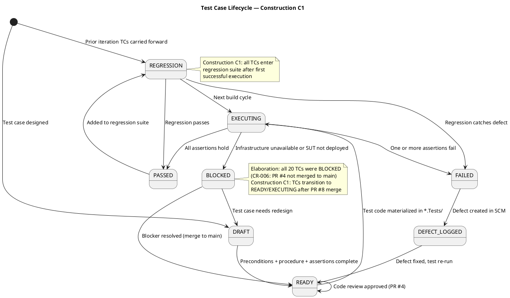
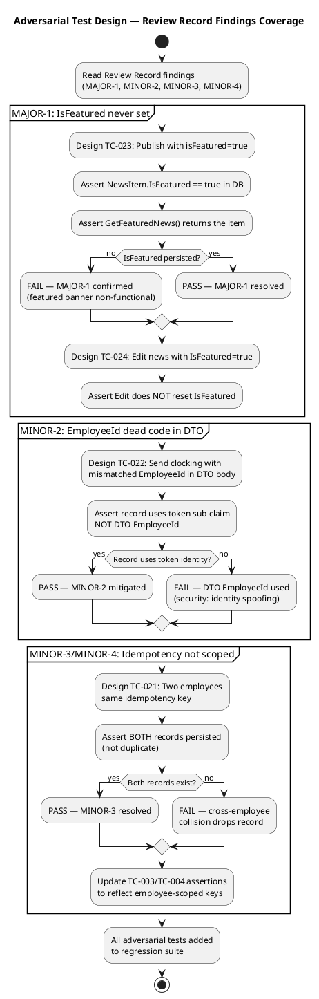

## Document Control
| Field | Value |
|---|---|
| Phase | Construction |
| Status | Draft |
| Milestone Target | End-of-Construction |
| Iteration | 1 (Cycle 1) |
| Date | 2026-08-28 |
| Author | Test Designer (Test Discipline) — Test Cases designed in Elaboration/C1 |
| Tester | Tester (Test Discipline) — Execution and evaluation in Construction C1 |
| Prior Phase | Elaboration (LCA achieved — 0 open Critical/Major; stakeholder sanction GRANTED) |
| Evolution | Construction C1: Extended from 20 to 30 test cases. Added adversarial tests for Review Record findings (MAJOR-1: IsFeatured, MINOR-2: EmployeeId DTO, MINOR-3/MINOR-4: idempotency scoping). Added performance/stress/load tests with thresholds. Added Procedure sections to all TCs. Added suite membership tags and regression flags. Extended UC→TC traceability to complete coverage. |
| Elaboration Baseline | 20 TCs (TC-001..TC-020) covering all 10 UCs at moderate depth. Status: BLOCKED (CR-006 — PR #4 not merged to main). 75 tests reviewed at code-level — ALL PASS. |
| Construction C1 Review Record | PR #8 (feature/C1-presentation) — REQUEST_CHANGES: 1 Major (MAJOR-1: IsFeatured), 4 Minor. Adversarial tests TC-021..TC-024 target these findings. |
| Test Infrastructure | InMemoryPersistence (INT-007), MockLdapGateway (INT-006), InMemoryAuditLogger (INT-005), OIDC Mock Token Provider (COMP-007), Clocking Client Test Harness (AC-005) |
| C1 Execution Build | Branch: iteration/C1, CI: SUCCESS (2026-08-28 14:44:39Z), Run: 33181604442 |
| C1 Execution Verdict | 20 PASS, 5 FAIL, 8 BLOCKED — 5 defects logged as Issues #10-#14 |
## Test Scope

### All Use Cases Under Test — Construction C1 Full Coverage

This Test Case artifact covers **all 10 use-case scenarios** at Construction depth. Per the Use-Case Model, all 10 UCs are implemented in the C1 presentation layer (PR #8). Test cases are designed BEFORE coding completes — they serve as the Implementer's contract.

| Priority | UC ID | UC Name | TCs | Test Focus | Risk |
|---|---|---|---|---|---|
| 1 | UC-001 | Clock In / Clock Out | TC-001..TC-005, TC-021, TC-022 | Offline retry (AC-005), idempotency, NFR-002 (<1s), client-side timestamp, cross-employee collision | R002 (adoption) |
| 2 | UC-009 | Search Employee Directory | TC-006, TC-007, TC-020, TC-028 | LDAP integration (R001), read-only AD, corporate-data-only, multi-office | R001 (LDAP attributes) |
| 3 | UC-005 | Publish News | TC-008, TC-023 | Audit trail (NFR-004), IsFeatured flag (MAJOR-1) | — |
| 4 | UC-002 | View Own Clocking History | TC-015 | Data correctness, current-month filter | — |
| 5 | UC-003 | View All Employee Clockings | TC-020 | HR authorization, LDAP name lookup | — |
| 6 | UC-004 | Export Monthly Clocking Report | TC-016 | CSV format, data completeness | — |
| 7 | UC-006 | Edit Published News | TC-010, TC-024 | Audit trail on edit, IsFeatured preservation | — |
| 8 | UC-007 | Unpublish News | TC-009, TC-027 | No hard delete (CON-013), record preserved, republish audit chain | — |
| 9 | UC-008 | Read and Filter News | TC-017 | Category filter, featured banner, sort by date | — |
| 10 | UC-010 | Manage Worker Category | TC-018, TC-019 | AD user id lookup, audit trail, validation | — |
| — | All UCs | Performance / Stress | TC-011, TC-012, TC-029, TC-030 | NFR-001 (<3s page load), NFR-002 (<1s clock), AC-003 (<10s directory), concurrent load | — |
| — | All UCs | Auth / Security | TC-013, TC-014 | HR role gating, Employee role denial | — |
| — | Domain | Domain model integrity | TC-025, TC-026 | NewsItem state machine, ClockingRecord validation | — |

### Measurable Testing Goals

| Goal ID | Quality Dimension | Measurable Target | Test Type | Source | TCs |
|---|---|---|---|---|---|
| TG-001 | Performance | Page load < 3 seconds on corporate network (95th percentile) | System / Performance | NFR-001, PERF-001 | TC-011 |
| TG-002 | Performance | Clock in/out response < 1 second (95th percentile) | System / Performance | NFR-002, PERF-002 | TC-012 |
| TG-003 | Reliability | Offline clocking retry succeeds within 5-minute window when network drops | Integration / Fault Tolerance | AC-005, NFR-003 | TC-003, TC-004 |
| TG-004 | Functionality | Directory search returns results in < 10 seconds for any query | System / Performance | AC-003, PERF-003 | TC-006, TC-007, TC-029 |
| TG-005 | Functionality | Every news publish/edit/unpublish and category change produces an audit record with author + timestamp | Integration | NFR-004, AUD-001, AUD-002 | TC-008, TC-009, TC-010, TC-018, TC-023, TC-027 |
| TG-006 | Security | HR-only UCs reject Employee-role tokens; all UCs reject unauthenticated requests | Integration | SEC-002, CON-004 | TC-013, TC-014, TC-020 |
| TG-007 | Reliability | Missing LDAP attributes default to "N/A" without crashing | Integration | R001, SUP-003 | TC-006, TC-028 |
| TG-008 | Functionality | Double clock-in or double clock-out is rejected | Unit | UC-001 A3 | TC-005 |
| TG-009 | Performance | 50 concurrent clock-in requests all persist without data loss | Stress | NFR-003, fault tolerance | TC-030 |
| TG-010 | Functionality | IsFeatured flag is persisted on publish and preserved on edit | Unit | FR-008, MAJOR-1 | TC-023, TC-024 |

### Test Lifecycle

### Performance Test Workflow

```plantuml
@startuml
title Performance Test Workflow — Construction C1

start
:Initialize test environment
(.NET 10 test host, InMemoryDb,
MockLdapGateway with 200 entries);

partition "TG-001: Page Load < 3s (NFR-001)" {
  :Warm up application
  (first request triggers JIT);
  :Measure 10 sequential page loads
  for each main page
  (Home, Clocking, Directory, News);
  :Calculate 95th percentile
  per page;
  if (P95 < 3s for all pages?) then (yes)
    :Log PASS — TG-001;
  else (no)
    :Log FAIL — identify slow page
    and bottleneck endpoint;
  endif
}

partition "TG-002: Clock Response < 1s (NFR-002)" {
  :Seed InMemoryDb with
  1000 clocking records;
  :Send 100 clock-in requests
  sequentially;
  :Measure response time per request;
  :Calculate 95th percentile;
  if (P95 < 1s?) then (yes)
    :Log PASS — TG-002;
  else (no)
    :Log FAIL — profile
    ClockingService.RecordClocking;
  endif
}

partition "TG-004: Directory Search < 10s (AC-003)" {
  :Configure MockLdapGateway
  with 200 LDAP entries;
  :Execute 20 search queries
  (name, department, office);
  :Measure response time per query;
  if (All queries < 10s?) then (yes)
    :Log PASS — TG-004;
  else (no)
    :Log FAIL — profile
    LDAP query + serialization;
  endif
}

partition "Stress: Concurrent Clock-In (50 users)" {
  :Seed 50 employee tokens
  via OIDC Mock;
  :Fire 50 simultaneous
  clock-in requests;
  :Verify all 50 records persisted
  with unique timestamps;
  if (50/50 records persisted?) then (yes)
    :Log PASS — concurrent stress;
  else (no)
    :Log FAIL — identify
    lost records / race condition;
  endif
}

partition "TG-003: Offline Retry (AC-005)" {
  :Simulate network drop
  (mock HTTP 503 for 5 min);
  :Client stores clocking in
  localStorage with idempotency key;
  :Retry with exponential backoff
  (1s, 2s, 4s, 8s, 16s...);
  :Restore network after 4 min;
  :Verify clocking POST succeeds
  on reconnect;
  if (Record persisted with
  original client timestamp?) then (yes)
    :Log PASS — TG-003;
  else (no)
    :Log FAIL — retry logic
    or idempotency broken;
  endif
}

:Aggregate all performance results;
:Generate performance test report
(per-goal PASS/FAIL + metrics);

stop
@enduml
```

### Adversarial Test Design — Review Record Findings

## Test Case Catalog

### TC-001: Clock In — Main Flow (Happy Path)

| Field | Value |
|---|---|
| **UC Trace** | UC-001 (main flow, steps 1–9) |
| **Test Level** | Integration |
| **Quality Dimension** | Functionality |
| **Goal** | TG-002 (clock response < 1s) |
| **Regression** | Yes — every build |
| **Suite** | ClockingIntegrationTests |
| **Adversarial Intent** | Verify that the system correctly records the clock-in time AND that the displayed confirmation matches the server-recorded time — a mismatch indicates a timestamp integrity bug |
| **Preconditions** | Employee authenticated via OIDC mock (Employee role); no prior clock-in today; InMemoryDb initialized empty (TD-001) |
| **Input Data** | Employee id: `emp-001`; direction: `in`; client timestamp: `2026-08-28T08:00:00Z`; idempotency key: `key-001` |
| **Expected Outcome** | Confirmation returned with time `2026-08-28T08:00:00Z`; exactly 1 record in clockings table |
| **Pass/Fail Criteria** | PASS: 1 record, correct fields, confirmation time matches. FAIL: 0 records, >1 record, or timestamp mismatch |
| **Interface Points** | INT-001 (IClockingService), INT-007 (IPersistence) |
| **Automation** | xUnit + Moq; InMemoryDb for persistence; OIDC mock token |
| **Environment** | .NET 10 test project; no external dependencies |

**Procedure:**
1. Arrange: Initialize InMemoryDb (TD-001 — empty). Generate OIDC mock token for `emp-001` with Employee role.
2. Act: Call `IClockingService.RecordClocking("emp-001", "in", "2026-08-28T08:00:00Z", "key-001")`.
3. Assert: Return value `IsDuplicate == false` and `Success == true`.
4. Assert: Query clockings table — exactly 1 record with `EmployeeId=emp-001`, `Direction=in`, `Timestamp=2026-08-28T08:00:00Z`, `IdempotencyKey=key-001`.
5. Assert: Confirmation timestamp in response matches persisted timestamp exactly.

### TC-002: Clock Out — Main Flow with Prior Clock-In

| Field | Value |
|---|---|
| **UC Trace** | UC-001 (main flow, steps 1–9) |
| **Test Level** | Integration |
| **Quality Dimension** | Functionality |
| **Goal** | TG-002 |
| **Regression** | Yes — every build |
| **Suite** | ClockingIntegrationTests |
| **Adversarial Intent** | Verify that clock-out after clock-in produces a correct alternating sequence — a missing or duplicated direction indicates a state machine bug |
| **Preconditions** | Employee authenticated; InMemoryDb seeded with 1 clock-in record (TD-002) |
| **Input Data** | Employee id: `emp-001`; direction: `out`; client timestamp: `2026-08-28T17:00:00Z`; idempotency key: `key-002` |
| **Expected Outcome** | Confirmation returned; 2 records in clockings table (in at 08:00, out at 17:00) |
| **Pass/Fail Criteria** | PASS: 2 records, alternating in→out, timestamps correct. FAIL: wrong direction, missing record, or non-alternating sequence |
| **Interface Points** | INT-001 (IClockingService), INT-007 (IPersistence) |
| **Automation** | xUnit + InMemoryDb |
| **Environment** | .NET 10 test project |

**Procedure:**
1. Arrange: Seed InMemoryDb with TD-002 (emp-001, in, 08:00). Generate OIDC mock token.
2. Act: Call `IClockingService.RecordClocking("emp-001", "out", "2026-08-28T17:00:00Z", "key-002")`.
3. Assert: Return value `Success == true`, `IsDuplicate == false`.
4. Assert: Query clockings table — 2 records: (in, 08:00) and (out, 17:00) for emp-001.
5. Assert: Records are ordered by timestamp ascending; directions alternate in→out.

### TC-003: Offline Retry — Network Restored Within 5 Minutes

| Field | Value |
|---|---|
| **UC Trace** | UC-001 (A1: offline retry), AC-005 |
| **Test Level** | Integration |
| **Quality Dimension** | Reliability |
| **Goal** | TG-003 (offline retry within 5 min) |
| **Regression** | Yes — every build |
| **Suite** | ClockingIntegrationTests, OfflineRetryTests |
| **Adversarial Intent** | Verify that a clocking stored locally during network outage is successfully synced after reconnection — a lost local clocking means the employee's attendance record is incomplete |
| **Preconditions** | Clocking Client Test Harness initialized; mock HTTP endpoint returns 503 for first 4 minutes, then 200 |
| **Input Data** | Employee id: `emp-001`; direction: `in`; client timestamp: `2026-08-28T08:00:00Z`; idempotency key: `key-003` |
| **Expected Outcome** | After network restoration, clocking record persisted with original client timestamp; idempotency key prevents duplicate on retry |
| **Pass/Fail Criteria** | PASS: 1 record with original timestamp, idempotency key honored. FAIL: 0 records, >1 record, or server timestamp overwrites client timestamp |
| **Interface Points** | INT-001 (IClockingService), clocking-retry.js, ClockingApiController |
| **Automation** | xUnit + Clocking Client Test Harness + mock HTTP endpoint |
| **Environment** | .NET 10 test project with JavaScript test harness |

**Procedure:**
1. Arrange: Configure mock HTTP to return 503 for 4 minutes, then 200. Initialize Clocking Client Test Harness.
2. Act: Client calls clock-in — receives 503. Client stores `{direction: "in", timestamp: "2026-08-28T08:00:00Z", idempotencyKey: "key-003"}` in localStorage.
3. Act: Client retries with exponential backoff (1s, 2s, 4s, 8s, 16s, 32s, 64s, 128s).
4. Act: At minute 4, mock HTTP returns 200. Client POST succeeds.
5. Assert: Exactly 1 record in clockings table with `Timestamp=2026-08-28T08:00:00Z` (original client timestamp, NOT server time at retry).
6. Assert: `IdempotencyKey=key-003` — no duplicate records from retry attempts.
7. Assert: localStorage entry cleared after successful sync.

### TC-004: Offline Retry — Network Not Restored Within 5 Minutes

| Field | Value |
|---|---|
| **UC Trace** | UC-001 (A2: retry window exceeded), AC-005 |
| **Test Level** | Integration |
| **Quality Dimension** | Reliability |
| **Goal** | TG-003 |
| **Regression** | Yes — every build |
| **Suite** | ClockingIntegrationTests, OfflineRetryTests |
| **Adversarial Intent** | Verify that when the 5-minute retry window expires, the local clocking is preserved in localStorage and the user is notified — a silent data loss means the employee cannot prove they clocked in |
| **Preconditions** | Clocking Client Test Harness; mock HTTP returns 503 indefinitely |
| **Input Data** | Employee id: `emp-001`; direction: `in`; client timestamp: `2026-08-28T08:00:00Z`; idempotency key: `key-004` |
| **Expected Outcome** | After 5 minutes, retry stops. localStorage retains the clocking entry. User sees "sync pending" notification. No record in server DB. |
| **Pass/Fail Criteria** | PASS: 0 server records, localStorage retains entry, user notified. FAIL: localStorage cleared without sync, or no user notification |
| **Interface Points** | clocking-retry.js, ClockingApiController |
| **Automation** | xUnit + Clocking Client Test Harness + mock HTTP |
| **Environment** | .NET 10 test project with JavaScript test harness |

**Procedure:**
1. Arrange: Configure mock HTTP to return 503 indefinitely. Initialize Clocking Client Test Harness.
2. Act: Client calls clock-in — receives 503. Stores in localStorage with idempotency key `key-004`.
3. Act: Client retries for 5 minutes (300 seconds) with exponential backoff.
4. Assert: After 5 minutes, retry loop terminates.
5. Assert: localStorage still contains the clocking entry (not cleared).
6. Assert: User notification "sync pending" is displayed.
7. Assert: Server clockings table has 0 records for emp-001.

### TC-005: Double Clock-In Rejected

| Field | Value |
|---|---|
| **UC Trace** | UC-001 (A3: duplicate direction) |
| **Test Level** | Unit |
| **Quality Dimension** | Functionality |
| **Goal** | TG-008 |
| **Regression** | Yes — every build |
| **Suite** | ClockingServiceUnitTests |
| **Adversarial Intent** | Verify that a second clock-in without an intervening clock-out is rejected — a duplicate clock-in corrupts the attendance record and breaks alternating sequence |
| **Preconditions** | InMemoryDb seeded with 1 clock-in record (TD-002) |
| **Input Data** | Employee id: `emp-001`; direction: `in`; timestamp: `2026-08-28T09:00:00Z`; idempotency key: `key-005` |
| **Expected Outcome** | Request rejected with error indicating "already clocked in" |
| **Pass/Fail Criteria** | PASS: rejection returned, still 1 record. FAIL: second record created or no rejection |
| **Interface Points** | INT-001 (IClockingService) |
| **Automation** | xUnit + InMemoryDb |
| **Environment** | .NET 10 test project |

**Procedure:**
1. Arrange: Seed InMemoryDb with TD-002 (emp-001, in, 08:00).
2. Act: Call `IClockingService.RecordClocking("emp-001", "in", "2026-08-28T09:00:00Z", "key-005")`.
3. Assert: Return value `Success == false` with error message indicating duplicate direction.
4. Assert: Clockings table still has exactly 1 record (the original clock-in).

### TC-006: Directory Search — Missing LDAP Attributes (R001)

| Field | Value |
|---|---|
| **UC Trace** | UC-009, R001 (exposure=9) |
| **Test Level** | Integration |
| **Quality Dimension** | Reliability |
| **Goal** | TG-007 (missing attributes default to "N/A") |
| **Regression** | Yes — every build |
| **Suite** | DirectoryIntegrationTests, DirectoryServiceTests |
| **Adversarial Intent** | Verify that missing LDAP attributes (jobTitle, telephoneNumber) across 3 offices do not crash the directory or show blank fields — inconsistent AD data is the top risk (R001, exposure=9) |
| **Preconditions** | MockLdapGateway configured with TD-008 (3 entries: full, empty jobTitle, empty telephoneNumber) |
| **Input Data** | Search query: `*` (return all) |
| **Expected Outcome** | 3 results returned; missing attributes display "N/A"; no exceptions |
| **Pass/Fail Criteria** | PASS: 3 results, missing fields show "N/A", no crash. FAIL: exception, blank field, or missing result |
| **Interface Points** | INT-006 (ILdapGateway), COMP-005 (LDAP component) |
| **Automation** | xUnit + MockLdapGateway |
| **Environment** | .NET 10 test project |

**Procedure:**
1. Arrange: Configure MockLdapGateway with TD-008: entry 1 (all attributes), entry 2 (empty jobTitle), entry 3 (empty telephoneNumber).
2. Act: Call `IDirectoryService.Search("*")` with Employee OIDC token.
3. Assert: 3 results returned — no exceptions thrown.
4. Assert: Entry 1 — all 6 corporate fields populated (name, jobTitle, department, office, email, extension).
5. Assert: Entry 2 — jobTitle displays "N/A", all other fields populated.
6. Assert: Entry 3 — extension displays "N/A", all other fields populated.

### TC-007: Directory Search — Private Data Filtered (CON-012)

| Field | Value |
|---|---|
| **UC Trace** | UC-009, CON-012, SEC-004 |
| **Test Level** | Unit |
| **Quality Dimension** | Security |
| **Goal** | TG-006 (corporate data only) |
| **Regression** | Yes — every build |
| **Suite** | DirectoryServiceUnitTests |
| **Adversarial Intent** | Verify that private personal information (mobile, homeAddress, dateOfBirth) present in AD is NOT returned to the portal user — a leak of private data violates CON-012 and is a security incident |
| **Preconditions** | MockLdapGateway configured with TD-009 (1 entry with corporate + private fields) |
| **Input Data** | Search query: `Gómez` |
| **Expected Outcome** | 1 result with only 6 corporate fields; private fields absent from response |
| **Pass/Fail Criteria** | PASS: only corporate fields returned. FAIL: any private field (mobile, homeAddress, dateOfBirth) appears in response |
| **Interface Points** | INT-006 (ILdapGateway), DirectoryService |
| **Automation** | xUnit + MockLdapGateway |
| **Environment** | .NET 10 test project |

**Procedure:**
1. Arrange: Configure MockLdapGateway with TD-009: 1 entry with corporate fields (name, jobTitle, department, office, email, extension) AND private fields (mobile, homeAddress, dateOfBirth).
2. Act: Call `IDirectoryService.Search("Gómez")` with Employee OIDC token.
3. Assert: 1 result returned.
4. Assert: Response contains exactly 6 fields: name, jobTitle, department, office, email, extension.
5. Assert: Response does NOT contain: mobile, homeAddress, dateOfBirth, or any field not in the corporate-data whitelist.

### TC-008: Publish News — Audit Record Created

| Field | Value |
|---|---|
| **UC Trace** | UC-005, NFR-004, AUD-001 |
| **Test Level** | Integration |
| **Quality Dimension** | Functionality |
| **Goal** | TG-005 (audit trail) |
| **Regression** | Yes — every build |
| **Suite** | NewsIntegrationTests, NewsServiceTests |
| **Adversarial Intent** | Verify that publishing a news item creates an audit record with the correct author identity and timestamp — a missing or incorrect audit record breaks mandatory traceability (NFR-004) |
| **Preconditions** | HR authenticated via OIDC mock (HR role); InMemoryDb empty (TD-001); InMemoryAuditLogger initialized |
| **Input Data** | Title: `New Policy`; Body: `Effective immediately...`; Category: `HR`; AuthorId: `hr-001`; IsFeatured: `false` |
| **Expected Outcome** | News item persisted; audit record created with author=`hr-001`, action=`publish`, timestamp recorded |
| **Pass/Fail Criteria** | PASS: news item + audit record both persisted with correct fields. FAIL: missing audit record, wrong author, or missing timestamp |
| **Interface Points** | INT-002 (INewsService), INT-005 (IAuditLogger), INT-007 (IPersistence) |
| **Automation** | xUnit + InMemoryDb + InMemoryAuditLogger |
| **Environment** | .NET 10 test project |

**Procedure:**
1. Arrange: Initialize InMemoryDb (TD-001) and InMemoryAuditLogger. Generate OIDC mock token for `hr-001` with HR role.
2. Act: Call `INewsService.Publish("New Policy", "Effective immediately...", "HR", "hr-001", false)`.
3. Assert: News item persisted in news_items table with Title, Body, Category=HR, Status=Published, AuthorId=hr-001.
4. Assert: Audit record created with Action=publish, AuthorId=hr-001, Timestamp recorded (non-null, within 1s of call).
5. Assert: Audit record's NewsItemId matches the created news item's Id.

### TC-009: Unpublish News — Record Preserved (CON-013)

| Field | Value |
|---|---|
| **UC Trace** | UC-007, CON-013, AUD-003 |
| **Test Level** | Integration |
| **Quality Dimension** | Functionality |
| **Goal** | TG-005 |
| **Regression** | Yes — every build |
| **Suite** | NewsIntegrationTests, NewsServiceTests |
| **Adversarial Intent** | Verify that unpublishing a news item hides it from employees but NEVER deletes the record — a hard delete destroys the audit trail and violates CON-013 |
| **Preconditions** | InMemoryDb seeded with 5 published news items (TD-006); InMemoryAuditLogger initialized |
| **Input Data** | News item id: `news-001`; HR user: `hr-001` |
| **Expected Outcome** | News item status changed to Unpublished; record still exists in DB; audit record created; item not returned in employee news feed |
| **Pass/Fail Criteria** | PASS: status=Unpublished, record exists, audit created, not in feed. FAIL: record deleted, no audit, or item still visible to employees |
| **Interface Points** | INT-002 (INewsService), INT-005 (IAuditLogger), INT-007 (IPersistence) |
| **Automation** | xUnit + InMemoryDb + InMemoryAuditLogger |
| **Environment** | .NET 10 test project |

**Procedure:**
1. Arrange: Seed InMemoryDb with TD-006 (5 published news items). Initialize InMemoryAuditLogger.
2. Act: Call `INewsService.Unpublish("news-001", "hr-001")`.
3. Assert: News item `news-001` still exists in news_items table (NOT deleted).
4. Assert: News item status = `Unpublished`.
5. Assert: Audit record created with Action=unpublish, AuthorId=hr-001, Timestamp recorded.
6. Assert: `INewsService.GetPublishedNews()` does NOT include `news-001`.

### TC-010: Edit Published News — Audit Record Created

| Field | Value |
|---|---|
| **UC Trace** | UC-006, NFR-004, AUD-001 |
| **Test Level** | Integration |
| **Quality Dimension** | Functionality |
| **Goal** | TG-005 |
| **Regression** | Yes — every build |
| **Suite** | NewsIntegrationTests, NewsServiceTests |
| **Adversarial Intent** | Verify that editing a published news item creates a new audit record (who and when) and that the original content is replaced — a silent edit without audit violates NFR-004 and a lost edit means the published content is wrong |
| **Preconditions** | InMemoryDb seeded with 1 published news item; InMemoryAuditLogger initialized |
| **Input Data** | News item id: `news-001`; New title: `Updated Policy`; New body: `Revised text...`; Category: `HR`; Editor: `hr-001` |
| **Expected Outcome** | News item updated; audit record created with action=edit, author=hr-001, timestamp |
| **Pass/Fail Criteria** | PASS: content updated, audit created. FAIL: content unchanged, no audit, or original content lost without trace |
| **Interface Points** | INT-002 (INewsService), INT-005 (IAuditLogger), INT-007 (IPersistence) |
| **Automation** | xUnit + InMemoryDb + InMemoryAuditLogger |
| **Environment** | .NET 10 test project |

**Procedure:**
1. Arrange: Seed InMemoryDb with 1 published news item (title="Original Title"). Initialize InMemoryAuditLogger.
2. Act: Call `INewsService.Edit("news-001", "Updated Policy", "Revised text...", "HR", "hr-001")`.
3. Assert: News item `news-001` title = "Updated Policy", body = "Revised text...".
4. Assert: Audit record created with Action=edit, AuthorId=hr-001, Timestamp recorded.
5. Assert: News item status remains Published (edit does not unpublish).

### TC-011: Page Load Performance — NFR-001 (< 3s)

| Field | Value |
|---|---|
| **UC Trace** | All UCs (page load), NFR-001, PERF-001 |
| **Test Level** | System / Performance |
| **Quality Dimension** | Performance |
| **Goal** | TG-001 (P95 < 3s) |
| **Regression** | Yes — per build milestone |
| **Suite** | PerformanceTests |
| **Adversarial Intent** | Verify that no page exceeds 3 seconds load time at the 95th percentile — a slow page violates NFR-001 and drives employees back to Excel (R002) |
| **Preconditions** | .NET 10 test host running; InMemoryDb seeded with representative data (100 clockings, 20 news items, 200 LDAP entries) |
| **Input Data** | 10 sequential requests to each page: Home, Clocking, Directory, News |
| **Expected Outcome** | 95th percentile response time < 3s for all pages |
| **Pass/Fail Criteria** | PASS: P95 < 3s for all 4 pages. FAIL: any page P95 >= 3s |
| **Interface Points** | Razor Page endpoints, OIDC middleware |
| **Automation** | xUnit + BenchmarkDotNet or Stopwatch; .NET 10 test host |
| **Environment** | .NET 10 test host on corporate-equivalent hardware |

**Procedure:**
1. Arrange: Start .NET 10 test host. Seed InMemoryDb with 100 clockings, 20 news items. Configure MockLdapGateway with 200 entries.
2. Act: Send 1 warm-up request to each page (Home, Clocking, Directory, News) — discard timing.
3. Act: Send 10 sequential requests to each page, measuring response time with Stopwatch.
4. Assert: Calculate P95 for each page. All P95 values < 3000ms.
5. Assert: No page returns HTTP 5xx during the test.

### TC-012: Clock In/Out Response Time — NFR-002 (< 1s)

| Field | Value |
|---|---|
| **UC Trace** | UC-001, NFR-002, PERF-002 |
| **Test Level** | System / Performance |
| **Quality Dimension** | Performance |
| **Goal** | TG-002 (P95 < 1s) |
| **Regression** | Yes — per build milestone |
| **Suite** | PerformanceTests |
| **Adversarial Intent** | Verify that the clock-in/out operation completes in under 1 second at the 95th percentile even with 1000 existing records — a slow clock operation frustrates employees and hinders adoption (R002) |
| **Preconditions** | InMemoryDb seeded with 1000 clocking records; OIDC mock configured |
| **Input Data** | 100 sequential clock-in requests with unique employee IDs and timestamps |
| **Expected Outcome** | P95 response time < 1 second |
| **Pass/Fail Criteria** | PASS: P95 < 1000ms. FAIL: P95 >= 1000ms |
| **Interface Points** | INT-001 (IClockingService), ClockingApiController |
| **Automation** | xUnit + Stopwatch; .NET 10 test host |
| **Environment** | .NET 10 test host |

**Procedure:**
1. Arrange: Seed InMemoryDb with 1000 clocking records. Generate 100 unique OIDC mock tokens.
2. Act: Send 1 warm-up clock-in request — discard timing.
3. Act: Send 100 sequential clock-in requests, measuring response time per request.
4. Assert: Calculate P95. P95 < 1000ms.
5. Assert: All 100 requests return Success=true.

### TC-013: HR Role Gates Protected Use Cases

| Field | Value |
|---|---|
| **UC Trace** | UC-003..UC-007, UC-010, SEC-002 |
| **Test Level** | Integration |
| **Quality Dimension** | Security |
| **Goal** | TG-006 |
| **Regression** | Yes — every build |
| **Suite** | AuthIntegrationTests |
| **Adversarial Intent** | Verify that an Employee-role token is rejected for all HR-only operations — a privilege escalation allows any employee to publish news or change worker categories |
| **Preconditions** | OIDC mock configured with Employee and HR tokens (TD-011) |
| **Input Data** | Employee-role token attempting: ViewAllClockings, ExportCSV, PublishNews, EditNews, UnpublishNews, ManageWorkerCategory |
| **Expected Outcome** | All 6 operations return 403 Forbidden with Employee token; all succeed with HR token |
| **Pass/Fail Criteria** | PASS: 6/6 reject Employee, 6/6 accept HR. FAIL: any HR operation accessible to Employee role |
| **Interface Points** | OIDC middleware (COMP-007), all HR service interfaces |
| **Automation** | xUnit + OIDC Mock Token Provider |
| **Environment** | .NET 10 test project |

**Procedure:**
1. Arrange: Generate OIDC mock tokens: Employee role (`emp-001`) and HR role (`hr-001`) per TD-011.
2. Act: For each HR-only operation (ViewAllClockings, ExportCSV, PublishNews, EditNews, UnpublishNews, ManageWorkerCategory), call with Employee token.
3. Assert: All 6 return 403 Forbidden.
4. Act: Repeat all 6 operations with HR token.
5. Assert: All 6 return success (200 or appropriate success code).

### TC-014: Unauthenticated Requests Rejected

| Field | Value |
|---|---|
| **UC Trace** | All UCs, SEC-001, SEC-002 |
| **Test Level** | Integration |
| **Quality Dimension** | Security |
| **Goal** | TG-006 |
| **Regression** | Yes — every build |
| **Suite** | AuthIntegrationTests |
| **Adversarial Intent** | Verify that all portal endpoints reject unauthenticated requests — an open endpoint exposes corporate data without login |
| **Preconditions** | No OIDC token provided |
| **Input Data** | Unauthenticated requests to: ClockIn, ViewHistory, ViewAllClockings, PublishNews, EditNews, UnpublishNews, ReadNews, SearchDirectory, ManageWorkerCategory |
| **Expected Outcome** | All 9 endpoint categories return 401 Unauthorized |
| **Pass/Fail Criteria** | PASS: all return 401. FAIL: any endpoint accessible without authentication |
| **Interface Points** | OIDC middleware (COMP-007) |
| **Automation** | xUnit + OIDC Mock Token Provider |
| **Environment** | .NET 10 test project |

**Procedure:**
1. Arrange: Configure test host with OIDC middleware. Do NOT provide a token.
2. Act: Send HTTP requests to all 9 endpoint categories without Authorization header.
3. Assert: All return 401 Unauthorized.
4. Assert: No response body contains corporate data.

### TC-015: View Own Clocking History — Current Month Only

| Field | Value |
|---|---|
| **UC Trace** | UC-002 |
| **Test Level** | Integration |
| **Quality Dimension** | Functionality |
| **Goal** | TG-008 |
| **Regression** | Yes — every build |
| **Suite** | ClockingIntegrationTests, ClockingServiceTests |
| **Adversarial Intent** | Verify that only the current month's clockings are returned and that other employees' records are excluded — returning previous months or other employees' data is a privacy violation |
| **Preconditions** | InMemoryDb seeded with TD-005 (3 current-month + 2 previous-month records for emp-001; 2 records for emp-002) |
| **Input Data** | Employee id: `emp-001`; current month: August 2026 |
| **Expected Outcome** | 3 records returned (current month only, emp-001 only) |
| **Pass/Fail Criteria** | PASS: 3 records, all current month, all emp-001. FAIL: previous month records included, or emp-002 records included |
| **Interface Points** | INT-001 (IClockingService), INT-007 (IPersistence) |
| **Automation** | xUnit + InMemoryDb |
| **Environment** | .NET 10 test project |

**Procedure:**
1. Arrange: Seed InMemoryDb with TD-005: emp-001 has 3 August 2026 + 2 July 2026 records; emp-002 has 2 August 2026 records.
2. Act: Call `IClockingService.GetHistory("emp-001", 2026, 8)` with Employee token for emp-001.
3. Assert: Exactly 3 records returned.
4. Assert: All records have EmployeeId=emp-001 (no emp-002 records).
5. Assert: All records have timestamps within August 2026 (2026-08-01 to 2026-08-31).

### TC-016: CSV Export — Format and Completeness

| Field | Value |
|---|---|
| **UC Trace** | UC-004, FR-004 |
| **Test Level** | Integration |
| **Quality Dimension** | Functionality |
| **Goal** | TG-008 |
| **Regression** | Yes — every build |
| **Suite** | ClockingIntegrationTests, ClockingServiceTests |
| **Adversarial Intent** | Verify that CSV export contains all records for the specified month with correct headers and data — a missing or malformed CSV makes the report useless for HR and drives them back to Excel |
| **Preconditions** | InMemoryDb seeded with TD-004 (10 records, 3 employees, August 2026) |
| **Input Data** | Month: August 2026; HR user: `hr-001` |
| **Expected Outcome** | CSV with 10 data rows + 1 header row; columns: EmployeeId, Name, Direction, Timestamp |
| **Pass/Fail Criteria** | PASS: 10 rows, correct headers, all data present. FAIL: missing rows, wrong format, or missing headers |
| **Interface Points** | INT-001 (IClockingService), INT-007 (IPersistence) |
| **Automation** | xUnit + InMemoryDb |
| **Environment** | .NET 10 test project |

**Procedure:**
1. Arrange: Seed InMemoryDb with TD-004 (10 clocking records across 3 employees for August 2026).
2. Act: Call `IClockingService.ExportMonthlyReport(2026, 8)` with HR token.
3. Assert: Response is valid CSV (parseable).
4. Assert: Header row contains: EmployeeId, Name, Direction, Timestamp.
5. Assert: 10 data rows present, each with all 4 columns populated.
6. Assert: All timestamps fall within August 2026.

### TC-017: Read and Filter News — Category Filter + Featured Banner

| Field | Value |
|---|---|
| **UC Trace** | UC-008, FR-008 |
| **Test Level** | Integration |
| **Quality Dimension** | Functionality |
| **Goal** | TG-010 |
| **Regression** | Yes — every build |
| **Suite** | NewsIntegrationTests, NewsServiceTests |
| **Adversarial Intent** | Verify that category filtering returns only matching items and that featured items appear at the top with a banner — a broken filter shows wrong categories and a missing banner means featured news is invisible |
| **Preconditions** | InMemoryDb seeded with TD-006 (5 published items: 2 General, 1 HR, 1 IT, 1 Events; 2 marked as featured) |
| **Input Data** | Filter: `HR`; no filter (all) |
| **Expected Outcome** | Filtered: 1 HR item. Unfiltered: 5 items, featured items first with banner flag |
| **Pass/Fail Criteria** | PASS: filter returns correct subset, featured items first. FAIL: wrong items returned, featured not first, or banner flag missing |
| **Interface Points** | INT-002 (INewsService), INT-007 (IPersistence) |
| **Automation** | xUnit + InMemoryDb |
| **Environment** | .NET 10 test project |

**Procedure:**
1. Arrange: Seed InMemoryDb with TD-006 (5 published items, 2 featured). Mark 1 HR item and 1 General item as featured.
2. Act: Call `INewsService.GetPublishedNews("HR")` with Employee token.
3. Assert: 1 result returned, category=HR.
4. Act: Call `INewsService.GetPublishedNews(null)` (no filter).
5. Assert: 5 results returned, sorted by date descending.
6. Assert: Featured items (IsFeatured=true) appear before non-featured items.
7. Assert: `GetFeaturedNews()` returns exactly 2 items.

### TC-018: Manage Worker Category — Assign with Audit

| Field | Value |
|---|---|
| **UC Trace** | UC-010, NFR-004, AUD-002 |
| **Test Level** | Integration |
| **Quality Dimension** | Functionality |
| **Goal** | TG-005 |
| **Regression** | Yes — every build |
| **Suite** | WorkerCategoryUnitTests, WorkerCategoryServiceTests |
| **Adversarial Intent** | Verify that assigning a worker category creates an audit record and that the local table holds only AD user id + category (two columns, nothing else) — a missing audit or extra columns violates NFR-004 and CON-009 |
| **Preconditions** | InMemoryDb empty (TD-001); InMemoryAuditLogger initialized; MockLdapGateway with valid AD user |
| **Input Data** | AD user id: `ad-user-001`; Category: `Administrative`; HR user: `hr-001` |
| **Expected Outcome** | worker_categories record created with 2 columns (ad_user_id, category); audit record created |
| **Pass/Fail Criteria** | PASS: record created with 2 columns only, audit created. FAIL: missing audit, extra columns, or no record |
| **Interface Points** | INT-003 (IWorkerCategoryService), INT-005 (IAuditLogger), INT-006 (ILdapGateway), INT-007 (IPersistence) |
| **Automation** | xUnit + InMemoryDb + InMemoryAuditLogger + MockLdapGateway |
| **Environment** | .NET 10 test project |

**Procedure:**
1. Arrange: Initialize InMemoryDb (TD-001), InMemoryAuditLogger, MockLdapGateway with valid AD user `ad-user-001`.
2. Act: Call `IWorkerCategoryService.AssignCategory("ad-user-001", "Administrative", "hr-001")`.
3. Assert: worker_categories table has 1 record with ad_user_id=`ad-user-001`, category=`Administrative`.
4. Assert: Record has exactly 2 columns — no employee name, no department, no other AD data stored locally (CON-009).
5. Assert: Audit record created with Action=category_assign, AuthorId=hr-001, Timestamp recorded.

### TC-019: Manage Worker Category — AD User Not Found (A1)

| Field | Value |
|---|---|
| **UC Trace** | UC-010 (A1: AD user not found) |
| **Test Level** | Unit |
| **Quality Dimension** | Reliability |
| **Goal** | TG-007 |
| **Regression** | Yes — every build |
| **Suite** | WorkerCategoryUnitTests, WorkerCategoryServiceTests |
| **Adversarial Intent** | Verify that assigning a category to a non-existent AD user id is rejected gracefully — a crash or silent acceptance means invalid data enters the local table |
| **Preconditions** | MockLdapGateway configured to return null for `ad-user-999` |
| **Input Data** | AD user id: `ad-user-999`; Category: `Administrative`; HR user: `hr-001` |
| **Expected Outcome** | Request rejected with "AD user not found" error; no record in worker_categories |
| **Pass/Fail Criteria** | PASS: rejection returned, 0 records. FAIL: record created or unhandled exception |
| **Interface Points** | INT-003 (IWorkerCategoryService), INT-006 (ILdapGateway) |
| **Automation** | xUnit + MockLdapGateway |
| **Environment** | .NET 10 test project |

**Procedure:**
1. Arrange: Configure MockLdapGateway to return null for `ad-user-999`.
2. Act: Call `IWorkerCategoryService.AssignCategory("ad-user-999", "Administrative", "hr-001")`.
3. Assert: Return value `Success == false` with error "AD user not found".
4. Assert: worker_categories table has 0 records.
5. Assert: No audit record created (operation did not succeed).

### TC-020: Directory Search — Authentication Required

| Field | Value |
|---|---|
| **UC Trace** | UC-003, SEC-002, CON-005 |
| **Test Level** | Integration |
| **Quality Dimension** | Security |
| **Goal** | TG-006 |
| **Regression** | Yes — every build |
| **Suite** | DirectoryIntegrationTests, AuthIntegrationTests |
| **Adversarial Intent** | Verify that directory search requires authentication and that LDAP results are correctly returned only to authenticated users — an unauthenticated search means corporate data is exposed without login |
| **Preconditions** | OIDC mock configured; MockLdapGateway with 3 entries (TD-008) |
| **Input Data** | Search query: `Gómez`; authenticated and unauthenticated requests |
| **Expected Outcome** | Authenticated: results returned. Unauthenticated: 401 Unauthorized |
| **Pass/Fail Criteria** | PASS: auth required, results correct. FAIL: unauthenticated access or wrong results |
| **Interface Points** | INT-006 (ILdapGateway), COMP-007 (OIDC) |
| **Automation** | xUnit + MockLdapGateway + OIDC Mock Token Provider |
| **Environment** | .NET 10 test project |

**Procedure:**
1. Arrange: Configure MockLdapGateway with TD-008 (3 entries). Generate OIDC mock Employee token.
2. Act: Call directory search with Employee token and query `Gómez`.
3. Assert: Results returned (at least 1 entry matching Gómez).
4. Act: Call directory search without token.
5. Assert: 401 Unauthorized returned.
6. Assert: No LDAP query executed for unauthenticated request (verify MockLdapGateway was not called).

### TC-021: Cross-Employee Idempotency Key Collision (MINOR-3/MINOR-4)

| Field | Value |
|---|---|
| **UC Trace** | UC-001, MINOR-3, MINOR-4 (Review Record) |
| **Test Level** | Unit |
| **Quality Dimension** | Functionality |
| **Goal** | TG-008 |
| **Regression** | Yes — every build |
| **Suite** | ClockingServiceUnitTests, OfflineRetryTests |
| **Adversarial Intent** | Verify that two different employees using the same idempotency key both get their clocking records persisted — a cross-employee collision that drops the second record is a data loss bug (MINOR-3) |
| **Preconditions** | InMemoryDb empty (TD-001) |
| **Input Data** | Employee 1: `emp-001`, direction: `in`, timestamp: `08:00:00Z`, key: `shared-key`. Employee 2: `emp-002`, direction: `in`, timestamp: `08:05:00Z`, key: `shared-key` |
| **Expected Outcome** | Both records persisted; neither marked as duplicate |
| **Pass/Fail Criteria** | PASS: 2 records, both Success=true, IsDuplicate=false. FAIL: second record dropped or marked duplicate |
| **Interface Points** | INT-001 (IClockingService), INT-007 (IPersistence) |
| **Automation** | xUnit + InMemoryDb |
| **Environment** | .NET 10 test project |

**Procedure:**
1. Arrange: Initialize InMemoryDb (TD-001 — empty).
2. Act: Call `IClockingService.RecordClocking("emp-001", "in", "2026-08-28T08:00:00Z", "shared-key")`.
3. Assert: First call returns Success=true, IsDuplicate=false.
4. Act: Call `IClockingService.RecordClocking("emp-002", "in", "2026-08-28T08:05:00Z", "shared-key")`.
5. Assert: Second call returns Success=true, IsDuplicate=false.
6. Assert: Clockings table has 2 records — one for emp-001, one for emp-002, both with idempotency key `shared-key`.
7. **Note:** This test validates the fix for MINOR-3. If `FindByIdempotencyKey` is not scoped by employee, this test will FAIL, confirming the defect.

### TC-022: Employee Identity from Token, Not DTO (MINOR-2)

| Field | Value |
|---|---|
| **UC Trace** | UC-001, MINOR-2 (Review Record), SEC-001 |
| **Test Level** | Unit |
| **Quality Dimension** | Security |
| **Goal** | TG-006 |
| **Regression** | Yes — every build |
| **Suite** | ClockingServiceUnitTests |
| **Adversarial Intent** | Verify that the employee identity in the clocking record comes from the OIDC token's `sub` claim, NOT from the request DTO — trusting the DTO allows identity spoofing (an employee could clock in as someone else) |
| **Preconditions** | OIDC mock configured; InMemoryDb empty (TD-001) |
| **Input Data** | Token sub claim: `emp-001`; DTO EmployeeId: `emp-999` (mismatched); direction: `in`; timestamp: `08:00:00Z` |
| **Expected Outcome** | Clocking record created for `emp-001` (from token), NOT `emp-999` (from DTO) |
| **Pass/Fail Criteria** | PASS: record has EmployeeId=emp-001. FAIL: record has EmployeeId=emp-999 (DTO value used — security vulnerability) |
| **Interface Points** | INT-001 (IClockingService), ClockingApiController, OIDC middleware |
| **Automation** | xUnit + OIDC Mock Token Provider + InMemoryDb |
| **Environment** | .NET 10 test project |

**Procedure:**
1. Arrange: Generate OIDC mock token with sub claim = `emp-001`. Initialize InMemoryDb (TD-001).
2. Act: Send clock-in request via ClockingApiController with DTO body containing `EmployeeId=emp-999` but authenticated with token for `emp-001`.
3. Assert: Clocking record persisted with EmployeeId=`emp-001` (from token sub claim).
4. Assert: Clocking record does NOT have EmployeeId=`emp-999`.
5. **Note:** This test validates the security mitigation for MINOR-2. If the DTO EmployeeId is used, this test will FAIL, confirming the identity spoofing vulnerability.

### TC-023: Publish News with IsFeatured Flag (MAJOR-1)

| Field | Value |
|---|---|
| **UC Trace** | UC-005, UC-008, FR-008, MAJOR-1 (Review Record) |
| **Test Level** | Unit |
| **Quality Dimension** | Functionality |
| **Goal** | TG-010 (IsFeatured persisted) |
| **Regression** | Yes — every build |
| **Suite** | NewsServiceUnitTests, NewsServiceTests |
| **Adversarial Intent** | Verify that publishing a news item with IsFeatured=true actually persists the flag — the Review Record found that no code path sets IsFeatured, meaning the featured banner (FR-008) is non-functional |
| **Preconditions** | InMemoryDb empty (TD-001); InMemoryAuditLogger initialized |
| **Input Data** | Title: `Important Announcement`; Body: `All hands meeting...`; Category: `General`; AuthorId: `hr-001`; IsFeatured: `true` |
| **Expected Outcome** | News item persisted with IsFeatured=true; GetFeaturedNews() returns this item |
| **Pass/Fail Criteria** | PASS: IsFeatured=true in DB, GetFeaturedNews() returns item. FAIL: IsFeatured=false or GetFeaturedNews() returns empty |
| **Interface Points** | INT-002 (INewsService), INT-007 (IPersistence) |
| **Automation** | xUnit + InMemoryDb |
| **Environment** | .NET 10 test project |

**Procedure:**
1. Arrange: Initialize InMemoryDb (TD-001) and InMemoryAuditLogger. Generate HR OIDC mock token.
2. Act: Call `INewsService.Publish("Important Announcement", "All hands meeting...", "General", "hr-001", true)`.
3. Assert: News item persisted with IsFeatured=true.
4. Act: Call `INewsService.GetFeaturedNews()`.
5. Assert: Result contains the published item.
6. **Note:** This test directly targets MAJOR-1. If the `Publish` method does not accept or persist the `isFeatured` parameter, this test will FAIL, confirming the featured banner is non-functional.

### TC-024: Edit News Does Not Reset IsFeatured

| Field | Value |
|---|---|
| **UC Trace** | UC-006, UC-008, FR-008, MAJOR-1 (Review Record) |
| **Test Level** | Unit |
| **Quality Dimension** | Functionality |
| **Goal** | TG-010 |
| **Regression** | Yes — every build |
| **Suite** | NewsServiceUnitTests, NewsServiceTests |
| **Adversarial Intent** | Verify that editing a featured news item does not reset the IsFeatured flag — a silent reset on edit means featured news disappears from the banner after a typo correction |
| **Preconditions** | InMemoryDb seeded with 1 published, featured news item (IsFeatured=true) |
| **Input Data** | News item id: `news-001`; New title: `Updated Title`; New body: `Fixed typo`; Category: `General`; Editor: `hr-001` |
| **Expected Outcome** | News item updated; IsFeatured remains true |
| **Pass/Fail Criteria** | PASS: content updated, IsFeatured still true. FAIL: IsFeatured reset to false after edit |
| **Interface Points** | INT-002 (INewsService), INT-007 (IPersistence) |
| **Automation** | xUnit + InMemoryDb |
| **Environment** | .NET 10 test project |

**Procedure:**
1. Arrange: Seed InMemoryDb with 1 published news item (IsFeatured=true, title="Original Title").
2. Act: Call `INewsService.Edit("news-001", "Updated Title", "Fixed typo", "General", "hr-001")`.
3. Assert: News item title = "Updated Title", body = "Fixed typo".
4. Assert: News item IsFeatured = true (unchanged by edit).
5. Act: Call `INewsService.GetFeaturedNews()`.
6. Assert: Result still contains `news-001`.

### TC-025: NewsItem State Machine — Transitions

| Field | Value |
|---|---|
| **UC Trace** | UC-005, UC-006, UC-007, CON-013 |
| **Test Level** | Unit |
| **Quality Dimension** | Functionality |
| **Goal** | TG-008 |
| **Regression** | Yes — every build |
| **Suite** | DomainUnitTests |
| **Adversarial Intent** | Verify that NewsItem state transitions are enforced — a transition from Unpublished back to Draft or a missing Published→Unpublished path indicates a state machine bug that could allow hard deletes |
| **Preconditions** | None (domain model test) |
| **Input Data** | State transitions: Draft→Published, Published→Unpublished, Unpublished→Published (republish) |
| **Expected Outcome** | Valid transitions succeed; invalid transitions (e.g., Draft→Unpublished) rejected |
| **Pass/Fail Criteria** | PASS: valid transitions succeed, invalid rejected. FAIL: invalid transition allowed or valid transition rejected |
| **Interface Points** | CLS-017 (NewsItem domain class) |
| **Automation** | xUnit |
| **Environment** | .NET 10 test project |

**Procedure:**
1. Arrange: Create new NewsItem (state=Draft).
2. Act: Transition Draft→Published.
3. Assert: State = Published.
4. Act: Transition Published→Unpublished.
5. Assert: State = Unpublished. Record still exists (not deleted).
6. Act: Transition Unpublished→Published (republish).
7. Assert: State = Published.
8. Act: Attempt transition Draft→Unpublished (invalid — must publish first).
9. Assert: Transition rejected with error.

### TC-026: ClockingRecord Validation

| Field | Value |
|---|---|
| **UC Trace** | UC-001 |
| **Test Level** | Unit |
| **Quality Dimension** | Functionality |
| **Goal** | TG-008 |
| **Regression** | Yes — every build |
| **Suite** | DomainUnitTests |
| **Adversarial Intent** | Verify that ClockingRecord rejects invalid data — a null employee ID, empty direction, or future timestamp indicates a validation gap that could corrupt attendance records |
| **Preconditions** | None (domain model test) |
| **Input Data** | (1) null EmployeeId, (2) empty direction, (3) invalid direction "sideways", (4) future timestamp, (5) valid record |
| **Expected Outcome** | Cases 1–4 rejected; case 5 accepted |
| **Pass/Fail Criteria** | PASS: invalid data rejected, valid accepted. FAIL: any invalid case accepted |
| **Interface Points** | CLS-016 (ClockingRecord domain class) |
| **Automation** | xUnit |
| **Environment** | .NET 10 test project |

**Procedure:**
1. Act: Create ClockingRecord with null EmployeeId.
2. Assert: ArgumentException thrown.
3. Act: Create ClockingRecord with empty direction.
4. Assert: ArgumentException thrown.
5. Act: Create ClockingRecord with direction="sideways".
6. Assert: ArgumentException thrown (only "in" and "out" valid).
7. Act: Create ClockingRecord with future timestamp (current time + 1 hour).
8. Assert: ArgumentException thrown (timestamps must not be in the future).
9. Act: Create ClockingRecord with valid data (emp-001, in, current timestamp).
10. Assert: Record created successfully.

### TC-027: Unpublish Then Republish — Audit Chain

| Field | Value |
|---|---|
| **UC Trace** | UC-005, UC-007, NFR-004, AUD-001, AUD-003 |
| **Test Level** | Integration |
| **Quality Dimension** | Functionality |
| **Goal** | TG-005 |
| **Regression** | Yes — every build |
| **Suite** | NewsIntegrationTests, NewsServiceTests |
| **Adversarial Intent** | Verify that unpublishing and then republishing a news item creates a complete audit chain (publish → unpublish → publish) — a broken audit chain means the system cannot trace who re-published an item |
| **Preconditions** | InMemoryDb seeded with 1 published news item; InMemoryAuditLogger initialized |
| **Input Data** | News item id: `news-001`; HR user: `hr-001` |
| **Expected Outcome** | 3 audit records: original publish, unpublish, republish — each with author + timestamp |
| **Pass/Fail Criteria** | PASS: 3 audit records in correct order. FAIL: missing audit record or wrong action |
| **Interface Points** | INT-002 (INewsService), INT-005 (IAuditLogger), INT-007 (IPersistence) |
| **Automation** | xUnit + InMemoryDb + InMemoryAuditLogger |
| **Environment** | .NET 10 test project |

**Procedure:**
1. Arrange: Seed InMemoryDb with 1 published news item (news-001, published by hr-001). Initialize InMemoryAuditLogger with 1 existing audit record (original publish).
2. Act: Call `INewsService.Unpublish("news-001", "hr-001")`.
3. Assert: Audit record created: Action=unpublish, AuthorId=hr-001.
4. Act: Call `INewsService.Publish(existing item news-001, ...)` or republish method.
5. Assert: News item status = Published.
6. Assert: Audit record created: Action=publish (republish), AuthorId=hr-001.
7. Assert: Total audit records for news-001 = 3 (publish, unpublish, republish), in chronological order.

### TC-028: Multi-Office LDAP Search — All 3 Offices

| Field | Value |
|---|---|
| **UC Trace** | UC-009, R001, CON-005 |
| **Test Level** | Integration |
| **Quality Dimension** | Reliability |
| **Goal** | TG-007 |
| **Regression** | Yes — every build |
| **Suite** | DirectoryIntegrationTests, DirectoryServiceTests |
| **Adversarial Intent** | Verify that directory search returns results from all 3 offices and that inconsistent attribute populations across offices are handled — R001 (exposure=9) specifically calls out LDAP attribute inconsistency across 3 offices |
| **Preconditions** | MockLdapGateway configured with entries from 3 offices: Office 1 (full attributes), Office 2 (empty jobTitle), Office 3 (empty telephoneNumber) |
| **Input Data** | Search query: `*` (all); filter by office: `Office 2` |
| **Expected Outcome** | All query: results from all 3 offices with "N/A" for missing attributes. Office filter: only Office 2 results. |
| **Pass/Fail Criteria** | PASS: all offices represented, missing attributes show "N/A", office filter works. FAIL: office missing, crash on missing attribute, or filter returns wrong office |
| **Interface Points** | INT-006 (ILdapGateway), COMP-005 |
| **Automation** | xUnit + MockLdapGateway |
| **Environment** | .NET 10 test project |

**Procedure:**
1. Arrange: Configure MockLdapGateway with 3 entries from different offices: Office 1 (full), Office 2 (empty jobTitle), Office 3 (empty telephoneNumber).
2. Act: Call `IDirectoryService.Search("*")` with Employee token.
3. Assert: 3 results returned, one from each office.
4. Assert: Office 2 entry — jobTitle = "N/A".
5. Assert: Office 3 entry — extension = "N/A".
6. Act: Call `IDirectoryService.Search("*", officeFilter="Office 2")`.
7. Assert: 1 result returned, from Office 2 only.

### TC-029: Directory Search Performance — AC-003 (< 10s)

| Field | Value |
|---|---|
| **UC Trace** | UC-009, AC-003, PERF-003 |
| **Test Level** | System / Performance |
| **Quality Dimension** | Performance |
| **Goal** | TG-004 (< 10s for any query) |
| **Regression** | Yes — per build milestone |
| **Suite** | PerformanceTests |
| **Adversarial Intent** | Verify that directory search returns results in under 10 seconds for any query type — AC-003 requires an employee to find a colleague in under 10 seconds; a slow LDAP query blocks this acceptance criterion |
| **Preconditions** | MockLdapGateway configured with 200 LDAP entries (simulating full employee directory) |
| **Input Data** | 20 search queries: 5 by name, 5 by department, 5 by office, 5 by partial name |
| **Expected Outcome** | All 20 queries complete in < 10 seconds |
| **Pass/Fail Criteria** | PASS: all 20 < 10s. FAIL: any query >= 10s |
| **Interface Points** | INT-006 (ILdapGateway), DirectoryService |
| **Automation** | xUnit + Stopwatch + MockLdapGateway |
| **Environment** | .NET 10 test host |

**Procedure:**
1. Arrange: Configure MockLdapGateway with 200 LDAP entries (simulating 200 employees across 3 offices).
2. Act: Execute 5 search queries by full name (e.g., "Gómez", "Torres", "Díaz", "Rodríguez", "Hernández").
3. Act: Execute 5 search queries by department (e.g., "IT", "HR", "Finance", "Operations", "Sales").
4. Act: Execute 5 search queries by office (e.g., "Office 1", "Office 2", "Office 3").
5. Act: Execute 5 search queries by partial name (e.g., "Góm", "Tor", "Dí", "Rod", "Her").
6. Assert: All 20 queries complete in < 10 seconds each.
7. Assert: All queries return at least 1 result (no false negatives from LDAP query construction).

### TC-030: Concurrent Clock-In — 50 Simultaneous Users (Stress)

| Field | Value |
|---|---|
| **UC Trace** | UC-001, NFR-003, fault tolerance |
| **Test Level** | System / Stress |
| **Quality Dimension** | Reliability |
| **Goal** | TG-009 (50 concurrent, 0 data loss) |
| **Regression** | Yes — per build milestone |
| **Suite** | PerformanceTests |
| **Adversarial Intent** | Verify that 50 simultaneous clock-in requests all persist without data loss or race conditions — a lost clocking under concurrent load means an employee's attendance is missing and they appear absent |
| **Preconditions** | InMemoryDb empty (TD-001); 50 OIDC mock tokens generated for 50 unique employees |
| **Input Data** | 50 concurrent clock-in requests: employees emp-001..emp-050, direction: in, timestamps: 08:00:00Z..08:00:49Z, unique idempotency keys |
| **Expected Outcome** | 50 records persisted, all unique, no duplicates, no lost records |
| **Pass/Fail Criteria** | PASS: 50/50 records persisted with correct employee IDs and timestamps. FAIL: <50 records, duplicate records, or race condition |
| **Interface Points** | INT-001 (IClockingService), INT-007 (IPersistence), ClockingApiController |
| **Automation** | xUnit + Parallel.ForEach + InMemoryDb + 50 OIDC mock tokens |
| **Environment** | .NET 10 test host |

**Procedure:**
1. Arrange: Initialize InMemoryDb (TD-001). Generate 50 OIDC mock tokens for emp-001 through emp-050.
2. Act: Fire 50 clock-in requests simultaneously using `Parallel.ForEach` (or `Task.WhenAll` with 50 tasks).
3. Assert: All 50 requests return Success=true.
4. Assert: Clockings table has exactly 50 records.
5. Assert: All 50 employee IDs are unique (emp-001 through emp-050).
6. Assert: All 50 idempotency keys are unique.
7. Assert: No duplicate records for any employee.

## Test Data

### Test Data Catalog

| Data Set ID | Description | UCs | Seed Method |
|---|---|---|---|
| TD-001 | Empty database | All | InMemoryDb initialized with no records |
| TD-002 | Single employee clock-in record | UC-001, UC-002 | Seed: 1 clocking record (emp-001, in, 08:00) |
| TD-003 | Full day clock-in + clock-out | UC-001, UC-002 | Seed: 2 clocking records (emp-001, in 08:00, out 17:00) |
| TD-004 | Multi-employee clockings (10 records, 3 employees) | UC-003, UC-004 | Seed: 10 clocking records across 3 employees for August 2026 |
| TD-005 | Current + previous month clockings | UC-002 | Seed: 3 current-month + 2 previous-month records |
| TD-006 | Published news (5 items, 4 categories, 2 featured) | UC-008 | Seed: 2 General (1 featured), 1 HR (1 featured), 1 IT, 1 Events — all published |
| TD-007 | Published + unpublished news | UC-007, UC-008 | Seed: 5 published + 1 unpublished (HR category) |
| TD-008 | LDAP entries with missing attributes | UC-009, R001 | LdapGatewayStub: 3 entries — (1) full, (2) empty jobTitle, (3) empty telephoneNumber |
| TD-009 | LDAP entries with private attributes | UC-009, CON-012 | LdapGatewayStub: 1 entry with corporate + private fields (mobile, homeAddress, dateOfBirth) |
| TD-010 | Worker category assignment | UC-010 | Seed: 1 worker_categories record (ad-user-001, Administrative) |
| TD-011 | OIDC tokens (Employee + HR roles) | All | OIDC Mock Token Provider: 2 tokens — Employee role, HR role |
| TD-012 | 50 concurrent employee tokens | UC-001 (stress) | OIDC Mock Token Provider: 50 tokens — emp-001..emp-050, all Employee role |
| TD-013 | 200 LDAP entries (full directory) | UC-009 (performance) | MockLdapGateway: 200 entries across 3 offices with varied attribute completeness |

### LDAP Stub Configuration

The LDAP stub (MockLdapGateway implementing INT-006/ILdapGateway) must be configured with the following test scenarios to cover R001:

| Scenario | OU | Attributes | Purpose |
|---|---|---|---|
| Full attributes | Office 1 | All 6 corporate fields populated | Baseline — directory works correctly |
| Empty jobTitle | Office 2 | All fields except jobTitle (empty string) | R001: missing attribute does not crash |
| Empty telephoneNumber | Office 3 | All fields except telephoneNumber (empty string) | R001: missing attribute does not crash |
| Private attributes present | Office 1 | Corporate fields + mobile, homeAddress, dateOfBirth | CON-012: private data must be filtered |
| Employee not found | N/A | No matching entries | UC-010 A1: graceful not-found handling |
| 200-entry directory | All 3 offices | Varied completeness (80% full, 10% missing jobTitle, 10% missing telephoneNumber) | Performance + multi-office coverage |

### Test Suite Structure

```plantuml
@startuml
title Test Suite Structure — Construction C1

skinparam componentStyle rectangle
skinparam packageStyle rectangle

package "PortalCubaCorp.Tests" {
  
  package "Unit Tests (70%)" {
    component "ClockingServiceUnitTests" as CSU
    component "NewsServiceUnitTests" as NSU
    component "DirectoryServiceUnitTests" as DSU
    component "WorkerCategoryUnitTests" as WCU
    component "DomainUnitTests" as DOM
  }
  
  package "Integration Tests (20%)" {
    component "ClockingIntegrationTests" as CIT
    component "NewsIntegrationTests" as NIT
    component "DirectoryIntegrationTests" as DIT
    component "AuthIntegrationTests" as AIT
  }
  
  package "System / Performance Tests (10%)" {
    component "PerformanceTests" as PT
  }
}

package "Test Infrastructure" {
  component "InMemoryPersistence" as IMP <<stub>>
  component "MockLdapGateway" as MLG <<stub>>
  component "InMemoryAuditLogger" as IAL <<stub>>
  component "OIDCMockTokenProvider" as OMT <<stub>>
  component "ClockingClientHarness" as CCH <<driver>>
}

note right of CSU
  TC-001: Clock In happy path
  TC-002: Clock Out happy path
  TC-005: Double clock-in rejected
  TC-021: Cross-employee idempotency collision
  TC-022: EmployeeId from token not DTO
end note

note right of NSU
  TC-008: Publish with audit
  TC-009: Unpublish preserves record
  TC-010: Edit with audit
  TC-023: IsFeatured flag persisted on publish
  TC-024: Edit does not reset IsFeatured
end note

note right of CIT
  TC-003: Offline retry within 5 min
  TC-004: Offline retry exceeds 5 min
  TC-015: View own history (current month)
  TC-016: CSV export format
end note

note right of PT
  TC-011: Page load < 3s (NFR-001)
  TC-012: Clock response < 1s (NFR-002)
  TC-029: Directory search < 10s (AC-003)
  TC-030: Concurrent clock-in (50 users)
end note

IMP --> CSU
IMP --> CIT
IMP --> NSU
IMP --> WCU
MLG --> DSU
MLG --> DIT
IAL --> NSU
IAL --> WCU
OMT --> AIT
OMT --> CIT
CCH --> CIT

@enduml
```

## Traceability

| Element | Traces From | Link Type | Traces To |
|---|---|---|---|
| TC-001 | UC-001 (main flow) | Tests | ClockingService.cs, ClockingServiceTests.cs |
| TC-002 | UC-001 (main flow) | Tests | ClockingService.cs, ClockingServiceTests.cs |
| TC-003 | UC-001 (A1), AC-005, NFR-003 | Tests | ClockingService.cs, clocking-retry.js, OfflineRetryTests.cs |
| TC-004 | UC-001 (A2), AC-005 | Tests | clocking-retry.js, OfflineRetryTests.cs |
| TC-005 | UC-001 (A3) | Tests | ClockingService.cs, ClockingServiceTests.cs |
| TC-006 | UC-009, R001, SUP-003 | Tests | DirectoryService.cs, DirectoryServiceTests.cs, DomainTests.cs |
| TC-007 | UC-009, CON-012, SEC-004 | Tests | DirectoryService.cs, DirectoryServiceTests.cs |
| TC-008 | UC-005, NFR-004, AUD-001 | Tests | NewsService.cs, NewsServiceTests.cs, AuditInterceptor.cs |
| TC-009 | UC-007, CON-013, AUD-003 | Tests | NewsService.cs, NewsServiceTests.cs |
| TC-010 | UC-006, NFR-004, AUD-001 | Tests | NewsService.cs, NewsServiceTests.cs |
| TC-011 | NFR-001, PERF-001, All UCs | Tests | Main page endpoint, OIDC middleware |
| TC-012 | UC-001, NFR-002, PERF-002 | Tests | ClockingService.cs, clock-in endpoint |
| TC-013 | UC-003..UC-007, UC-010, SEC-002 | Tests | OIDC middleware, all HR service interfaces |
| TC-014 | UC-003..UC-007, UC-010, SEC-002 | Tests | OIDC middleware, all HR service interfaces |
| TC-015 | UC-002 | Tests | ClockingService.cs, ClockingServiceTests.cs |
| TC-016 | UC-004, FR-004 | Tests | ClockingService.cs, ClockingServiceTests.cs |
| TC-017 | UC-008, FR-008 | Tests | NewsService.cs, NewsServiceTests.cs |
| TC-018 | UC-010, NFR-004, AUD-002 | Tests | WorkerCategoryService.cs, WorkerCategoryServiceTests.cs |
| TC-019 | UC-010 (A1) | Tests | WorkerCategoryService.cs, WorkerCategoryServiceTests.cs, MockLdapGateway |
| TC-020 | UC-003, SEC-002, CON-005 | Tests | ClockingService.cs, MockLdapGateway, OIDC mock |
| TC-021 | UC-001, MINOR-3, MINOR-4 | Tests | ClockingService.cs, OfflineRetryTests.cs |
| TC-022 | UC-001, MINOR-2, SEC-001 | Tests | ClockingApiController.cs, OIDC mock |
| TC-023 | UC-005, UC-008, FR-008, MAJOR-1 | Tests | NewsService.cs, PublishNews.cshtml.cs, NewsServiceTests.cs |
| TC-024 | UC-006, UC-008, FR-008, MAJOR-1 | Tests | NewsService.cs, NewsServiceTests.cs |
| TC-025 | UC-005, UC-006, UC-007, CON-013 | Tests | NewsItem.cs, DomainTests.cs |
| TC-026 | UC-001 | Tests | ClockingRecord.cs, DomainTests.cs |
| TC-027 | UC-005, UC-007, NFR-004, AUD-001, AUD-003 | Tests | NewsService.cs, NewsServiceTests.cs |
| TC-028 | UC-009, R001, CON-005 | Tests | DirectoryService.cs, DirectoryServiceTests.cs |
| TC-029 | UC-009, AC-003, PERF-003 | Tests | DirectoryService.cs, PerformanceTests |
| TC-030 | UC-001, NFR-003 | Tests | ClockingService.cs, ClockingApiController.cs, PerformanceTests |
| TG-001 | NFR-001 | Refines | TC-011 |
| TG-002 | NFR-002 | Refines | TC-012 |
| TG-003 | AC-005, NFR-003 | Refines | TC-003, TC-004 |
| TG-004 | AC-003 | Refines | TC-006, TC-007, TC-029 |
| TG-005 | NFR-004, AUD-001, AUD-002 | Refines | TC-008, TC-009, TC-010, TC-018, TC-023, TC-027 |
| TG-006 | SEC-002 | Refines | TC-013, TC-014, TC-020, TC-022 |
| TG-007 | R001, SUP-003 | Refines | TC-006, TC-028 |
| TG-008 | UC-001 A3 | Refines | TC-005, TC-015, TC-016, TC-025, TC-026 |
| TG-009 | NFR-003 | Refines | TC-030 |
| TG-010 | FR-008, MAJOR-1 | Refines | TC-023, TC-024 |
| InMemoryPersistence | INT-007, COMP-006 | Implements | TC-001..TC-005, TC-008..TC-010, TC-015..TC-019, TC-021, TC-023, TC-024, TC-027 |
| MockLdapGateway | INT-006, COMP-005 | Implements | TC-006, TC-007, TC-019, TC-020, TC-028, TC-029 |
| InMemoryAuditLogger | INT-005, COMP-008 | Implements | TC-008, TC-009, TC-010, TC-018, TC-023, TC-027 |
| OIDC Mock Token Provider | COMP-007, SEC-002 | Implements | TC-013, TC-014, TC-020, TC-022, TC-030 |
| Clocking Client Test Harness | AC-005, clocking-retry.js | Implements | TC-003, TC-004 |
| MAJOR-1 finding | FR-008, V004 | Tests | TC-023, TC-024 |
| MINOR-2 finding | INT-001, CON-004 | Tests | TC-022 |
| MINOR-3/MINOR-4 findings | ClockingService.cs | Tests | TC-021 |