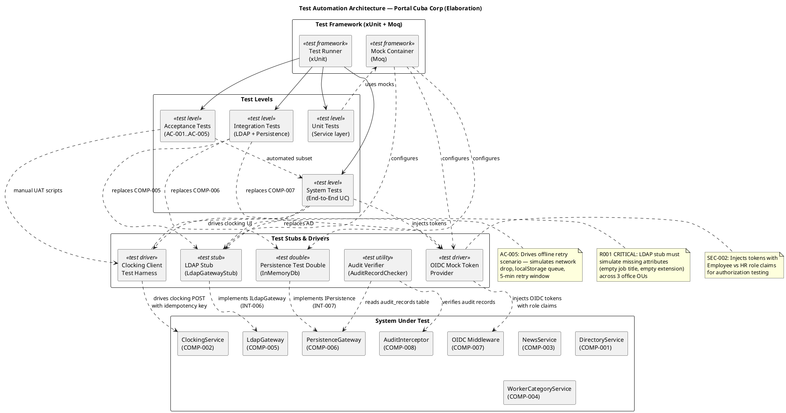
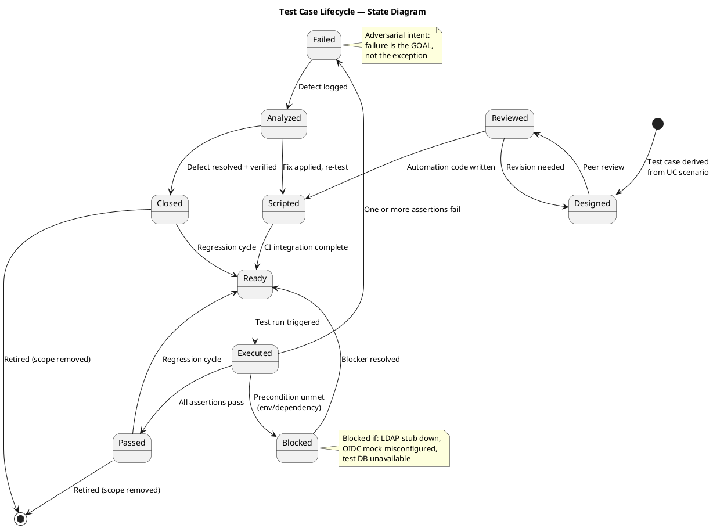
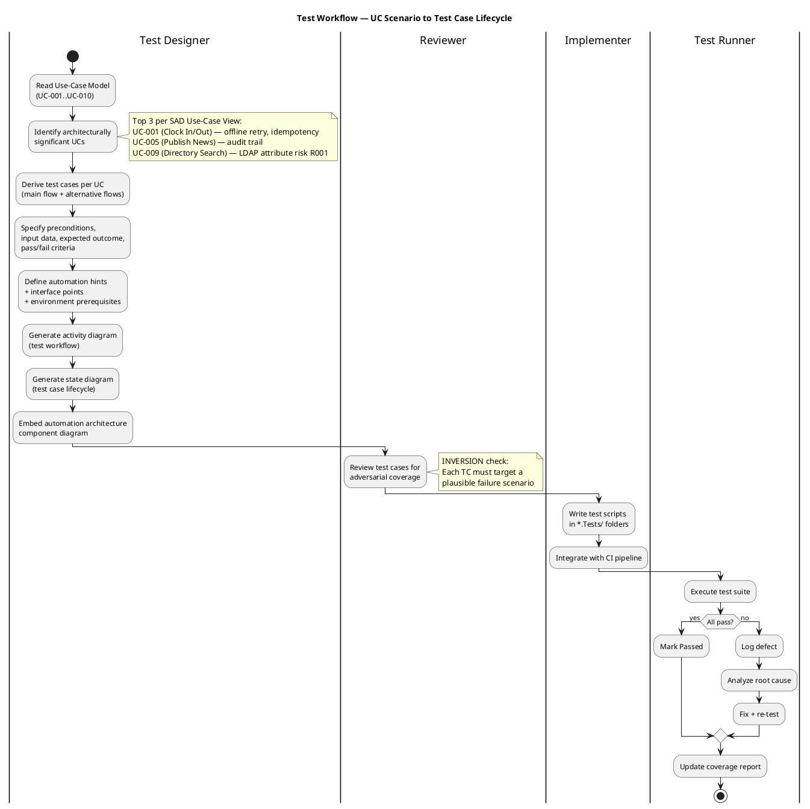

## Document Control

| Field | Value |
|---|---|
| Phase | Elaboration |
| Status | Draft |
| Milestone Target | End of Elaboration (LCA) |
| Iteration | 1 (Cycle 1) |
| Date | 2026-08-28 |
| Author | Test Designer (Test Discipline) |
| Prior Phase | Inception — Test Evaluation Summary (Approved) |

## Test Scope

### Architecturally Significant Use Cases Under Test

This Test Case artifact covers the **architecturally significant use-case scenarios** for the Elaboration baseline. Per the SAD Use-Case View, the top 3 architecturally significant UCs are:

| Priority | UC ID | UC Name | Architectural Significance | Risk |
|---|---|---|---|---|
| 1 | UC-001 | Clock In / Clock Out | Offline retry (AC-005), idempotency, NFR-002 (<1s response), client-side timestamp | R002 (adoption) |
| 2 | UC-009 | Search Employee Directory | LDAP integration (R001, exposure=9), read-only AD, corporate-data-only constraint | R001 (LDAP attributes) |
| 3 | UC-005 | Publish News | Audit trail (NFR-004), audit record creation, author + timestamp | — |

Additional UCs covered at moderate depth for regression readiness:

| UC ID | UC Name | Test Focus |
|---|---|---|
| UC-002 | View Own Clocking History | Data correctness, current-month filter |
| UC-003 | View All Employee Clockings | HR authorization, LDAP name lookup |
| UC-004 | Export Monthly Clocking Report | CSV format, data completeness |
| UC-006 | Edit Published News | Audit trail on edit, no data loss |
| UC-007 | Unpublish News | No hard delete (CON-013), record preserved |
| UC-008 | Read and Filter News | Category filter, featured banner, sort by date |
| UC-010 | Manage Worker Category | AD user id lookup, audit trail, validation |

### Measurable Testing Goals

| Goal ID | Quality Dimension | Measurable Target | Test Type | Source |
|---|---|---|---|---|
| TG-001 | Performance | Page load < 3 seconds on corporate network (95th percentile) | System / Performance | NFR-001, PERF-001 |
| TG-002 | Performance | Clock in/out response < 1 second (95th percentile) | System / Performance | NFR-002, PERF-002 |
| TG-003 | Reliability | Offline clocking retry succeeds within 5-minute window when network drops | Integration / Fault Tolerance | AC-005, NFR-003 |
| TG-004 | Functionality | Directory search returns results in < 10 seconds for any query | System / Performance | AC-003, PERF-003 |
| TG-005 | Functionality | 100% of news publish/edit/unpublish operations create audit records with author + timestamp | Integration / Functional | NFR-004, AUD-001 |
| TG-006 | Security | HR-only UCs (UC-003..UC-007, UC-010) reject Employee-role tokens | System / Security | SEC-002 |
| TG-007 | Reliability | LDAP queries with missing attributes (empty job title, empty extension) do not crash the directory | Integration / Fault Tolerance | R001, SUP-003 |
| TG-008 | Functionality | Idempotency: duplicate POST with same key returns original confirmation, no duplicate record | Integration / Functional | UC-001 A3 |

### Test Types Mapped to Quality Dimensions

| Quality Dimension | Test Types | Test Cases | Automation Level |
|---|---|---|---|
| Reliability | Fault tolerance, offline retry, idempotency | TC-001, TC-002, TC-003 | Automated (xUnit + test harness) |
| Functionality | Functional correctness, audit trail, data validation | TC-004, TC-005, TC-006, TC-007, TC-008, TC-009, TC-010 | Automated (xUnit) + Manual UAT |
| Performance | Response time, page load | TC-011, TC-012 | Automated (benchmark) + Manual |
| Security | Authorization, role-based access | TC-013, TC-014 | Automated (xUnit with mock tokens) |

### Test Automation Architecture

The following component diagram defines the test automation architecture — framework, stubs, drivers, and their relationships to the System Under Test.

**Stubs and Drivers Summary:**

| Stub/Driver | Type | Replaces | Interface | Purpose |
|---|---|---|---|---|
| LdapGatewayStub | Test Stub | COMP-005 (LdapGateway) | INT-006 (ILdapGateway) | Simulate AD responses with missing/empty attributes (R001); simulate 3 office OUs |
| OIDC Mock Token Provider | Test Driver | COMP-007 (OIDC Middleware) | N/A (injects tokens) | Inject tokens with Employee vs HR role claims for authorization testing (SEC-002) |
| InMemoryDb (EF Core InMemory) | Test Double | COMP-006 (PersistenceGateway) | INT-007 (IPersistence) | Fast persistence without PostgreSQL dependency; **NOTE: Review Record M2 finding — IPersistence transaction API mismatch must be resolved before integration tests can use real transaction semantics** |
| Clocking Client Test Harness | Test Driver | Browser + clocking-retry.js | N/A | Simulates network drop, localStorage queue, 5-min retry window (AC-005) |
| AuditRecordChecker | Test Utility | N/A | N/A | Reads audit_records table to verify author + timestamp + action for every audited operation |

### Test Case Lifecycle

### Test Workflow — UC to Test Case

## Test Case Catalog

### TC-001: Clock In — Main Flow (Happy Path)

| Field | Value |
|---|---|
| **UC Trace** | UC-001 (main flow, steps 1–9) |
| **Test Level** | Integration |
| **Quality Dimension** | Functionality |
| **Goal** | TG-002 (clock response < 1s) |
| **Adversarial Intent** | Verify that the system correctly records the clock-in time AND that the displayed confirmation matches the server-recorded time — a mismatch indicates a timestamp integrity bug |
| **Preconditions** | Employee authenticated via OIDC mock (Employee role); no prior clock-in today; InMemoryDb initialized empty |
| **Input Data** | Employee id: `emp-001`; direction: `in`; client timestamp: `2026-08-28T08:00:00Z`; idempotency key: `key-001` |
| **Test Steps** | 1. Call `IClockingService.ClockIn(emp-001, timestamp, key-001)` 2. Verify return value contains confirmation with recorded time 3. Query clockings table for `emp-001` 4. Verify record exists with direction=`in`, timestamp matches, idempotency key=`key-001` |
| **Expected Outcome** | Confirmation returned with time `2026-08-28T08:00:00Z`; exactly 1 record in clockings table |
| **Pass/Fail Criteria** | PASS: 1 record, correct fields, confirmation time matches. FAIL: 0 records, >1 record, or timestamp mismatch |
| **Interface Points** | INT-001 (IClockingService), INT-007 (IPersistence) |
| **Automation** | xUnit + Moq; InMemoryDb for persistence; OIDC mock token |
| **Environment** | .NET 10 test project; no external dependencies |

### TC-002: Clock Out — Main Flow with Prior Clock-In

| Field | Value |
|---|---|
| **UC Trace** | UC-001 (main flow, steps 1–9) |
| **Test Level** | Integration |
| **Quality Dimension** | Functionality |
| **Goal** | TG-002 |
| **Adversarial Intent** | Verify that clock-out after clock-in produces a correct alternating sequence — a missing or duplicated direction indicates a state machine bug |
| **Preconditions** | Employee authenticated; clock-in record exists for today (`emp-001`, direction=`in`, timestamp=`2026-08-28T08:00:00Z`) |
| **Input Data** | Employee id: `emp-001`; direction: `out`; client timestamp: `2026-08-28T17:00:00Z`; idempotency key: `key-002` |
| **Test Steps** | 1. Call `IClockingService.ClockOut(emp-001, timestamp, key-002)` 2. Verify confirmation returned 3. Query clockings table for `emp-001` ordered by timestamp 4. Verify 2 records: first `in`, second `out` |
| **Expected Outcome** | 2 records in correct order; confirmation displays `17:00:00` |
| **Pass/Fail Criteria** | PASS: 2 records, correct order, correct directions. FAIL: wrong direction, missing record, or wrong order |
| **Interface Points** | INT-001 (IClockingService), INT-007 (IPersistence) |
| **Automation** | xUnit + Moq; InMemoryDb |
| **Environment** | .NET 10 test project |

### TC-003: Offline Clocking Retry — Network Drop and Recovery (AC-005)

| Field | Value |
|---|---|
| **UC Trace** | UC-001 (alternative flow A1 — offline retry) |
| **Test Level** | Integration / Fault Tolerance |
| **Quality Dimension** | Reliability |
| **Goal** | TG-003 (offline retry succeeds within 5-min window) |
| **Adversarial Intent** | Demonstrate that a network drop does NOT silently lose the clocking — if the retry fails or the timestamp is wrong, the employee's attendance record is corrupted |
| **Preconditions** | Employee authenticated; portal main page loaded; clocking-retry.js active; network simulated as down |
| **Input Data** | Employee presses "Clock In" at `T=0`; network restored at `T=120s` (within 5-min window); client timestamp: `2026-08-28T08:00:00Z`; idempotency key: `key-offline-001` |
| **Test Steps** | 1. Simulate network down 2. Employee presses Clock In — client stores in localStorage 3. Verify POST fails (network error) 4. Client retries every N seconds 5. At T=120s, restore network 6. Verify POST succeeds with original client timestamp 7. Verify server records timestamp=`2026-08-28T08:00:00Z` (press time, not retry time) 8. Verify confirmation displayed |
| **Expected Outcome** | Clocking record persisted with original press timestamp; confirmation shown; localStorage entry cleared |
| **Pass/Fail Criteria** | PASS: record exists with press-time timestamp, not retry-time. FAIL: record has retry-time timestamp, record missing, or localStorage not cleared |
| **Interface Points** | INT-001 (IClockingService), clocking-retry.js (client), INT-007 (IPersistence) |
| **Automation** | Clocking Client Test Harness (simulates network drop + localStorage); xUnit for server-side assertions |
| **Environment** | .NET 10 test project + headless browser or HTTP client mock for client behavior |

### TC-004: Offline Clocking Retry — Network Not Restored Within 5 Minutes (AC-005)

| Field | Value |
|---|---|
| **UC Trace** | UC-001 (alternative flow A2 — network not restored) |
| **Test Level** | Integration / Fault Tolerance |
| **Quality Dimension** | Reliability |
| **Goal** | TG-003 |
| **Adversarial Intent** | Verify that the system does NOT silently discard the clocking attempt — the employee must be explicitly informed that the clocking was not recorded |
| **Preconditions** | Employee authenticated; portal main page loaded; network simulated as down |
| **Input Data** | Employee presses "Clock In" at `T=0`; network remains down for >5 minutes; idempotency key: `key-offline-002` |
| **Test Steps** | 1. Simulate network down 2. Employee presses Clock In — client stores in localStorage 3. Client retries for 5 minutes 4. At T=300s+, verify client stops retrying 5. Verify "Clocking not recorded — report to HR" message displayed 6. Verify NO record in clockings table |
| **Expected Outcome** | No clocking record; error message displayed; localStorage entry retained for manual reporting |
| **Pass/Fail Criteria** | PASS: no record, error message shown, retry stopped. FAIL: record created (should not be), no error message, or retry continues past 5 min |
| **Interface Points** | clocking-retry.js (client), INT-001 (IClockingService) |
| **Automation** | Clocking Client Test Harness with extended timeout simulation |
| **Environment** | .NET 10 test project + client behavior mock |

### TC-005: Idempotency — Duplicate POST Returns Original Confirmation (UC-001 A3)

| Field | Value |
|---|---|
| **UC Trace** | UC-001 (alternative flow A3 — duplicate POST) |
| **Test Level** | Integration |
| **Quality Dimension** | Functionality |
| **Goal** | TG-008 (idempotency) |
| **Adversarial Intent** | Demonstrate that a network retry that causes a duplicate POST does NOT create a second clocking record — a duplicate would corrupt attendance data |
| **Preconditions** | Employee authenticated; first POST already succeeded (record exists with key=`key-dup-001`) |
| **Input Data** | Second POST with same employee id, same timestamp, same idempotency key=`key-dup-001` |
| **Test Steps** | 1. Verify first record exists (1 record with key=`key-dup-001`) 2. Send duplicate POST with same idempotency key 3. Verify response returns original confirmation 4. Query clockings table 5. Verify still exactly 1 record with key=`key-dup-001` |
| **Expected Outcome** | Response returns original confirmation; record count remains 1 |
| **Pass/Fail Criteria** | PASS: 1 record, original confirmation returned. FAIL: 2 records, or different confirmation returned |
| **Interface Points** | INT-001 (IClockingService), INT-007 (IPersistence) |
| **Automation** | xUnit + InMemoryDb |
| **Environment** | .NET 10 test project |

### TC-006: Directory Search — Missing LDAP Attributes (R001)

| Field | Value |
|---|---|
| **UC Trace** | UC-009 (main flow + R001 risk scenario) |
| **Test Level** | Integration |
| **Quality Dimension** | Reliability / Functionality |
| **Goal** | TG-007 (LDAP missing attributes do not crash) |
| **Adversarial Intent** | Demonstrate that LDAP entries with missing `jobTitle` or `telephoneNumber` attributes (inconsistent across 3 offices) do NOT crash the directory search or display broken entries |
| **Preconditions** | OIDC mock (Employee role); LDAP stub configured with 3 test entries: (1) full attributes, (2) empty jobTitle, (3) empty telephoneNumber |
| **Input Data** | Search query: "García" (matches entry with empty jobTitle) |
| **Test Steps** | 1. Call `IDirectoryService.Search("García")` 2. Verify results returned (not empty, not error) 3. Verify entry with empty jobTitle displays with blank or "N/A" for job title field 4. Verify entry with empty telephoneNumber displays with blank or "N/A" for extension field 5. Verify no exception thrown |
| **Expected Outcome** | Results returned with graceful handling of missing attributes; no crash |
| **Pass/Fail Criteria** | PASS: results returned, missing fields handled gracefully. FAIL: exception thrown, empty results, or broken display |
| **Interface Points** | INT-003 (IDirectoryService), INT-006 (ILdapGateway) |
| **Automation** | xUnit + LdapGatewayStub configured with missing-attribute entries |
| **Environment** | .NET 10 test project; LDAP stub (no real AD needed) |

### TC-007: Directory Search — Corporate Data Only (CON-012)

| Field | Value |
|---|---|
| **UC Trace** | UC-009 (main flow, CON-012 constraint) |
| **Test Level** | Integration / Security |
| **Quality Dimension** | Security / Functionality |
| **Goal** | Verify no private personal information is exposed |
| **Adversarial Intent** | Demonstrate that the directory does NOT expose private fields (mobile phone, home address, date of birth) even if they exist in AD — a leak violates CON-012 |
| **Preconditions** | OIDC mock (Employee role); LDAP stub configured with an entry that has both corporate attributes AND private attributes (mobile, homeAddress, dateOfBirth) |
| **Input Data** | Search query: "*" (return all) |
| **Test Steps** | 1. Call `IDirectoryService.Search("*")` 2. Inspect returned DTOs 3. Verify each entry has exactly: name, jobTitle, department, office, email, extension 4. Verify NO entry contains: mobile, homeAddress, dateOfBirth, or any private field |
| **Expected Outcome** | Only corporate fields returned; private attributes filtered out |
| **Pass/Fail Criteria** | PASS: only 6 corporate fields present. FAIL: any private field present in response |
| **Interface Points** | INT-003 (IDirectoryService), INT-006 (ILdapGateway) |
| **Automation** | xUnit + LdapGatewayStub with extra private attributes |
| **Environment** | .NET 10 test project |

### TC-008: Publish News — Audit Trail Verification (NFR-004)

| Field | Value |
|---|---|
| **UC Trace** | UC-005 (main flow, audit trail) |
| **Test Level** | Integration |
| **Quality Dimension** | Functionality |
| **Goal** | TG-005 (100% audit record creation) |
| **Adversarial Intent** | Demonstrate that a news publication WITHOUT an audit record is detectable — a missing audit record means the system cannot prove who published what, violating NFR-004 |
| **Preconditions** | OIDC mock (HR role, user=`hr-admin-001`); InMemoryDb initialized empty |
| **Input Data** | Title: "New Policy"; Body: "Effective immediately..."; Category: `HR`; Date: `2026-08-28` |
| **Test Steps** | 1. Call `INewsService.Publish(title, body, category, date, authorId=hr-admin-001)` 2. Verify news item created in news_items table 3. Query audit_records table for action=`NewsPublished` 4. Verify audit record has: author=`hr-admin-001`, timestamp matches publish time, action=`NewsPublished`, entity reference to news item |
| **Expected Outcome** | News item created; exactly 1 audit record with correct author, timestamp, and action |
| **Pass/Fail Criteria** | PASS: news item + audit record both present with correct fields. FAIL: audit record missing, wrong author, or wrong action |
| **Interface Points** | INT-002 (INewsService), INT-005 (IAuditLogger), INT-007 (IPersistence) |
| **Automation** | xUnit + InMemoryDb + AuditRecordChecker utility |
| **Environment** | .NET 10 test project |
| **Note** | Review Record M1 finding: IAuditLogger signature mismatch must be resolved before this test can execute against the real AuditInterceptor. Test is designed against the Design Model interface contract, not the current implementation. |

### TC-009: Unpublish News — No Hard Delete, Record Preserved (CON-013)

| Field | Value |
|---|---|
| **UC Trace** | UC-007 (main flow, CON-013) |
| **Test Level** | Integration |
| **Quality Dimension** | Functionality |
| **Goal** | Verify CON-013: news items are never hard-deleted |
| **Adversarial Intent** | Demonstrate that unpublishing does NOT remove the news record from the database — if the record is deleted, the audit trail is destroyed, violating CON-013 and NFR-004 |
| **Preconditions** | OIDC mock (HR role); news item exists with status=`Published` (id=`news-001`) |
| **Input Data** | Unpublish news item id=`news-001` |
| **Test Steps** | 1. Call `INewsService.Unpublish(news-001, authorId=hr-admin-001)` 2. Query news_items table for id=`news-001` 3. Verify record still exists (NOT deleted) 4. Verify status changed to `Unpublished` 5. Query audit_records for action=`NewsUnpublished` 6. Verify audit record has correct author + timestamp |
| **Expected Outcome** | Record exists with status=`Unpublished`; audit record created |
| **Pass/Fail Criteria** | PASS: record preserved, status changed, audit record present. FAIL: record deleted, status unchanged, or audit record missing |
| **Interface Points** | INT-002 (INewsService), INT-005 (IAuditLogger), INT-007 (IPersistence) |
| **Automation** | xUnit + InMemoryDb + AuditRecordChecker |
| **Environment** | .NET 10 test project |

### TC-010: Edit Published News — Audit Trail on Edit (NFR-004)

| Field | Value |
|---|---|
| **UC Trace** | UC-006 (main flow, audit trail) |
| **Test Level** | Integration |
| **Quality Dimension** | Functionality |
| **Goal** | TG-005 |
| **Adversarial Intent** | Demonstrate that editing a news item creates a NEW audit record — if the edit is not audited, a malicious change could be made without traceability |
| **Preconditions** | OIDC mock (HR role); news item exists with status=`Published` (id=`news-002`, original title="Old Title") |
| **Input Data** | New title: "Corrected Title"; authorId=`hr-admin-001` |
| **Test Steps** | 1. Call `INewsService.Edit(news-002, newTitle, authorId=hr-admin-001)` 2. Verify news item title updated in news_items table 3. Query audit_records for action=`NewsEdited` referencing news-002 4. Verify audit record has author=`hr-admin-001`, timestamp, action=`NewsEdited` |
| **Expected Outcome** | Title updated; audit record created with correct fields |
| **Pass/Fail Criteria** | PASS: title changed + audit record present. FAIL: title unchanged, or audit record missing |
| **Interface Points** | INT-002 (INewsService), INT-005 (IAuditLogger), INT-007 (IPersistence) |
| **Automation** | xUnit + InMemoryDb + AuditRecordChecker |
| **Environment** | .NET 10 test project |

### TC-011: Page Load Performance (NFR-001)

| Field | Value |
|---|---|
| **UC Trace** | All UCs (main page load) |
| **Test Level** | System / Performance |
| **Quality Dimension** | Performance |
| **Goal** | TG-001 (page load < 3s, 95th percentile) |
| **Adversarial Intent** | Demonstrate that the page does NOT exceed the 3-second budget under realistic load — a slow page violates NFR-001 and risks adoption failure (R002) |
| **Preconditions** | System deployed on internal Windows Server; corporate network; OIDC mock or real Keycloak; LDAP stub with 200 entries |
| **Input Data** | 50 concurrent page load requests (simulating peak morning clock-in rush) |
| **Test Steps** | 1. Warm up application 2. Send 50 concurrent GET requests to main page 3. Measure response time for each request 4. Calculate 95th percentile |
| **Expected Outcome** | 95th percentile response time < 3000ms |
| **Pass/Fail Criteria** | PASS: P95 < 3000ms. FAIL: P95 >= 3000ms |
| **Interface Points** | HTTP endpoint (main page), OIDC middleware, LDAP stub |
| **Automation** | BenchmarkDotNet or k6 load testing script; CI-integrated |
| **Environment** | Internal Windows Server or equivalent test environment; corporate network simulation |

### TC-012: Clock In/Out Response Time (NFR-002)

| Field | Value |
|---|---|
| **UC Trace** | UC-001 (main flow) |
| **Test Level** | System / Performance |
| **Quality Dimension** | Performance |
| **Goal** | TG-002 (clock response < 1s, 95th percentile) |
| **Adversarial Intent** | Demonstrate that the clocking POST does NOT exceed the 1-second budget — a slow clock-in frustrates users and drives them back to Excel (R002) |
| **Preconditions** | System deployed; OIDC mock; InMemoryDb or PostgreSQL test instance |
| **Input Data** | 20 sequential clock-in POST requests |
| **Test Steps** | 1. Warm up application 2. Send 20 sequential POST requests to clock-in endpoint 3. Measure response time for each 4. Calculate 95th percentile |
| **Expected Outcome** | 95th percentile response time < 1000ms |
| **Pass/Fail Criteria** | PASS: P95 < 1000ms. FAIL: P95 >= 1000ms |
| **Interface Points** | INT-001 (IClockingService), HTTP endpoint |
| **Automation** | BenchmarkDotNet or k6 script |
| **Environment** | .NET 10 test project or deployed system |

### TC-013: HR Authorization — Employee Role Rejected for HR-Only UCs (SEC-002)

| Field | Value |
|---|---|
| **UC Trace** | UC-003, UC-004, UC-005, UC-006, UC-007, UC-010 (authorization) |
| **Test Level** | System / Security |
| **Quality Dimension** | Security |
| **Goal** | TG-006 (HR-only UCs reject Employee-role tokens) |
| **Adversarial Intent** | Demonstrate that an Employee-role user CANNOT access HR-only functions — if authorization fails, any employee could publish news or view all clockings |
| **Preconditions** | OIDC mock configured with Employee-role token (not HR role) |
| **Input Data** | Employee-role token; attempt to access: (a) View All Clockings, (b) Export CSV, (c) Publish News, (d) Edit News, (e) Unpublish News, (f) Manage Worker Category |
| **Test Steps** | 1. Inject Employee-role OIDC token 2. Call each HR-only endpoint/service method 3. Verify each returns 403 Forbidden or equivalent authorization failure 4. Verify no data is returned or modified |
| **Expected Outcome** | All 6 HR-only operations rejected with authorization error |
| **Pass/Fail Criteria** | PASS: all 6 rejected. FAIL: any HR-only operation succeeds with Employee role |
| **Interface Points** | COMP-007 (OIDC Middleware), all HR service interfaces |
| **Automation** | xUnit with OIDC Mock Token Provider (Employee role) |
| **Environment** | .NET 10 test project |

### TC-014: HR Authorization — HR Role Accepted for HR-Only UCs (SEC-002)

| Field | Value |
|---|---|
| **UC Trace** | UC-003, UC-004, UC-005, UC-006, UC-007, UC-010 (authorization) |
| **Test Level** | System / Security |
| **Quality Dimension** | Security |
| **Goal** | TG-006 |
| **Adversarial Intent** | Verify that the HR role is correctly recognized — if the HR role check is too strict, HR users cannot do their job (false positive blocking) |
| **Preconditions** | OIDC mock configured with HR-role token |
| **Input Data** | HR-role token; attempt to access all 6 HR-only operations |
| **Test Steps** | 1. Inject HR-role OIDC token 2. Call each HR-only endpoint/service method 3. Verify each returns 200 OK or equivalent success 4. Verify data is returned or operation succeeds |
| **Expected Outcome** | All 6 HR-only operations succeed |
| **Pass/Fail Criteria** | PASS: all 6 succeed. FAIL: any HR-only operation rejected despite HR role |
| **Interface Points** | COMP-007 (OIDC Middleware), all HR service interfaces |
| **Automation** | xUnit with OIDC Mock Token Provider (HR role) |
| **Environment** | .NET 10 test project |

### TC-015: View Own Clocking History — Current Month Filter (UC-002)

| Field | Value |
|---|---|
| **UC Trace** | UC-002 (main flow) |
| **Test Level** | Integration |
| **Quality Dimension** | Functionality |
| **Goal** | Verify current-month filtering is correct |
| **Adversarial Intent** | Demonstrate that the history view does NOT show clockings from previous months — a leak of old data or a missing current-month record both indicate a filter bug |
| **Preconditions** | Employee authenticated; clockings table has entries for current month (3 records) and previous month (2 records) |
| **Input Data** | Employee id: `emp-001`; current date: `2026-08-28` |
| **Test Steps** | 1. Call `IClockingService.GetHistory(emp-001)` 2. Verify exactly 3 records returned (current month only) 3. Verify all timestamps are within August 2026 4. Verify no records from July 2026 |
| **Expected Outcome** | 3 records, all from current month |
| **Pass/Fail Criteria** | PASS: 3 records, all current month. FAIL: wrong count, or records from other months present |
| **Interface Points** | INT-001 (IClockingService), INT-007 (IPersistence) |
| **Automation** | xUnit + InMemoryDb with seeded data |
| **Environment** | .NET 10 test project |

### TC-016: Export Monthly Clocking Report — CSV Format (UC-004)

| Field | Value |
|---|---|
| **UC Trace** | UC-004 (main flow) |
| **Test Level** | Integration |
| **Quality Dimension** | Functionality |
| **Goal** | Verify CSV export correctness |
| **Adversarial Intent** | Demonstrate that the CSV export does NOT omit records or produce malformed CSV — a missing row or broken format makes the report useless for HR |
| **Preconditions** | OIDC mock (HR role); clockings table has 10 records across 3 employees for August 2026 |
| **Input Data** | Month: August 2026 |
| **Test Steps** | 1. Call `IClockingService.ExportMonthlyReport(2026, 8)` 2. Verify response is CSV format 3. Parse CSV 4. Verify 10 data rows (excluding header) 5. Verify header contains: employee id, timestamp, direction 6. Verify each row has valid data |
| **Expected Outcome** | Valid CSV with 10 rows + header; all fields populated |
| **Pass/Fail Criteria** | PASS: 10 rows, valid CSV, correct header. FAIL: wrong row count, malformed CSV, or missing header |
| **Interface Points** | INT-001 (IClockingService), INT-007 (IPersistence) |
| **Automation** | xUnit + InMemoryDb with seeded data; CSV parsing assertion |
| **Environment** | .NET 10 test project |

### TC-017: Read and Filter News — Category Filter (UC-008)

| Field | Value |
|---|---|
| **UC Trace** | UC-008 (main flow, category filter) |
| **Test Level** | Integration |
| **Quality Dimension** | Functionality |
| **Goal** | Verify category filtering and date sorting |
| **Adversarial Intent** | Demonstrate that the category filter does NOT show news from other categories — a leak means employees see IT announcements under an HR filter, undermining trust |
| **Preconditions** | Employee authenticated; news_items table has: 2 `General`, 1 `HR`, 1 `IT`, 1 `Events` (all published); 1 `HR` unpublished |
| **Input Data** | Filter: category=`HR` |
| **Test Steps** | 1. Call `INewsService.GetPublishedNews(category=HR)` 2. Verify exactly 1 result returned (only published HR) 3. Verify unpublished HR item is NOT in results 4. Verify result is sorted by date (most recent first) |
| **Expected Outcome** | 1 result, category=HR, published, sorted by date desc |
| **Pass/Fail Criteria** | PASS: 1 result, correct category, published only. FAIL: wrong count, unpublished shown, or wrong category |
| **Interface Points** | INT-002 (INewsService), INT-007 (IPersistence) |
| **Automation** | xUnit + InMemoryDb with seeded news data |
| **Environment** | .NET 10 test project |

### TC-018: Manage Worker Category — Audit Trail (UC-010, NFR-004)

| Field | Value |
|---|---|
| **UC Trace** | UC-010 (main flow, audit trail) |
| **Test Level** | Integration |
| **Quality Dimension** | Functionality |
| **Goal** | TG-005 (audit trail for category changes) |
| **Adversarial Intent** | Demonstrate that a worker category change WITHOUT an audit record is detectable — a missing audit means HR could silently reassign categories without traceability |
| **Preconditions** | OIDC mock (HR role, user=`hr-admin-001`); LDAP stub has employee with AD user id=`ad-user-001`; worker_categories table empty |
| **Input Data** | AD user id: `ad-user-001`; category: `Administrative` |
| **Test Steps** | 1. Call `IWorkerCategoryService.AssignCategory(ad-user-001, "Administrative", authorId=hr-admin-001)` 2. Verify worker_categories table has 1 record: (ad-user-001, Administrative) 3. Query audit_records for action=`CategoryChanged` 4. Verify audit record has: author=`hr-admin-001`, timestamp, action=`CategoryChanged`, entity reference to ad-user-001 |
| **Expected Outcome** | Category link created; audit record created with correct fields |
| **Pass/Fail Criteria** | PASS: category link + audit record both present. FAIL: audit record missing, wrong author, or wrong action |
| **Interface Points** | INT-004 (IWorkerCategoryService), INT-005 (IAuditLogger), INT-006 (ILdapGateway), INT-007 (IPersistence) |
| **Automation** | xUnit + InMemoryDb + LdapGatewayStub + AuditRecordChecker |
| **Environment** | .NET 10 test project |

### TC-019: Manage Worker Category — Employee Not Found in AD (UC-010 A1)

| Field | Value |
|---|---|
| **UC Trace** | UC-010 (alternative flow A1) |
| **Test Level** | Integration |
| **Quality Dimension** | Functionality |
| **Goal** | Verify graceful handling of AD lookup failure |
| **Adversarial Intent** | Demonstrate that searching for a non-existent AD user does NOT create a category link — a silent creation would mean categories assigned to phantom users |
| **Preconditions** | OIDC mock (HR role); LDAP stub configured to return no results for `ad-user-999` |
| **Input Data** | AD user id: `ad-user-999` (does not exist in AD) |
| **Test Steps** | 1. Call `IWorkerCategoryService.LookupAdUser(ad-user-999)` 2. Verify "Employee not found in AD" response 3. Attempt to assign category 4. Verify assignment is rejected 5. Verify worker_categories table is still empty |
| **Expected Outcome** | Lookup fails gracefully; no category link created |
| **Pass/Fail Criteria** | PASS: error message, no record created. FAIL: record created, or unhandled exception |
| **Interface Points** | INT-004 (IWorkerCategoryService), INT-006 (ILdapGateway) |
| **Automation** | xUnit + LdapGatewayStub (configured for not-found) |
| **Environment** | .NET 10 test project |

### TC-020: View All Employee Clockings — HR Authorization + LDAP Name Lookup (UC-003)

| Field | Value |
|---|---|
| **UC Trace** | UC-003 (main flow) |
| **Test Level** | Integration |
| **Quality Dimension** | Functionality / Security |
| **Goal** | Verify HR can view all clockings with employee names resolved from AD |
| **Adversarial Intent** | Demonstrate that the all-clockings view does NOT expose clockings to non-HR users AND that employee names are correctly resolved from AD — a name mismatch means HR cannot identify who clocked when |
| **Preconditions** | OIDC mock (HR role); clockings table has 3 records for 2 employees; LDAP stub has both employee names |
| **Input Data** | No filter (view all) |
| **Test Steps** | 1. Call `IClockingService.GetAllClockings()` with HR-role token 2. Verify 3 records returned 3. Verify each record has employee name resolved from LDAP (not just employee id) 4. Repeat call with Employee-role token 5. Verify 403 Forbidden |
| **Expected Outcome** | HR: 3 records with names. Employee: 403 Forbidden |
| **Pass/Fail Criteria** | PASS: HR sees all with names, Employee rejected. FAIL: names missing, or Employee can access |
| **Interface Points** | INT-001 (IClockingService), INT-006 (ILdapGateway), COMP-007 (OIDC) |
| **Automation** | xUnit + InMemoryDb + LdapGatewayStub + OIDC Mock Token Provider |
| **Environment** | .NET 10 test project |

## Test Data

### Test Data Catalog

| Data Set ID | Description | UCs | Seed Method |
|---|---|---|---|
| TD-001 | Empty database | All | InMemoryDb initialized with no records |
| TD-002 | Single employee clock-in record | UC-001, UC-002 | Seed: 1 clocking record (emp-001, in, 08:00) |
| TD-003 | Full day clock-in + clock-out | UC-001, UC-002 | Seed: 2 clocking records (emp-001, in 08:00, out 17:00) |
| TD-004 | Multi-employee clockings (10 records, 3 employees) | UC-003, UC-004 | Seed: 10 clocking records across 3 employees for August 2026 |
| TD-005 | Current + previous month clockings | UC-002 | Seed: 3 current-month + 2 previous-month records |
| TD-006 | Published news (5 items, 4 categories) | UC-008 | Seed: 2 General, 1 HR, 1 IT, 1 Events — all published |
| TD-007 | Published + unpublished news | UC-007, UC-008 | Seed: 5 published + 1 unpublished (HR category) |
| TD-008 | LDAP entries with missing attributes | UC-009, R001 | LdapGatewayStub: 3 entries — (1) full, (2) empty jobTitle, (3) empty telephoneNumber |
| TD-009 | LDAP entries with private attributes | UC-009, CON-012 | LdapGatewayStub: 1 entry with corporate + private fields (mobile, homeAddress, dateOfBirth) |
| TD-010 | Worker category assignment | UC-010 | Seed: 1 worker_categories record (ad-user-001, Administrative) |
| TD-011 | OIDC tokens (Employee + HR roles) | All | OIDC Mock Token Provider: 2 tokens — Employee role, HR role |

### LDAP Stub Configuration

The LDAP stub (LdapGatewayStub implementing INT-006/ILdapGateway) must be configured with the following test scenarios to cover R001:

| Scenario | OU | Attributes | Purpose |
|---|---|---|---|
| Full attributes | Office 1 | All 6 corporate fields populated | Baseline — directory works correctly |
| Empty jobTitle | Office 2 | All fields except jobTitle (empty string) | R001: missing attribute does not crash |
| Empty telephoneNumber | Office 3 | All fields except telephoneNumber (empty string) | R001: missing attribute does not crash |
| Private attributes present | Office 1 | Corporate fields + mobile, homeAddress, dateOfBirth | CON-012: private data must be filtered |
| Employee not found | N/A | No matching entries | UC-010 A1: graceful not-found handling |

## Traceability

| Element | Traces From | Link Type | Traces To |
|---|---|---|---|
| TC-001 | UC-001 (main flow) | Tests | ClockingService.cs, ClockingServiceTests.cs |
| TC-002 | UC-001 (main flow) | Tests | ClockingService.cs, ClockingServiceTests.cs |
| TC-003 | UC-001 (A1), AC-005, NFR-003 | Tests | ClockingService.cs, clocking-retry.js |
| TC-004 | UC-001 (A2), AC-005 | Tests | clocking-retry.js |
| TC-005 | UC-001 (A3) | Tests | ClockingService.cs, ClockingServiceTests.cs |
| TC-006 | UC-009, R001, SUP-003 | Tests | DirectoryService.cs, DirectoryServiceTests.cs, LdapGatewayStub |
| TC-007 | UC-009, CON-012, SEC-004 | Tests | DirectoryService.cs, DirectoryServiceTests.cs |
| TC-008 | UC-005, NFR-004, AUD-001 | Tests | NewsService.cs, NewsServiceTests.cs, AuditInterceptor.cs |
| TC-009 | UC-007, CON-013, AUD-003 | Tests | NewsService.cs, NewsServiceTests.cs |
| TC-010 | UC-006, NFR-004, AUD-001 | Tests | NewsService.cs, NewsServiceTests.cs |
| TC-011 | NFR-001, PERF-001, All UCs | Tests | Main page endpoint, OIDC middleware |
| TC-012 | UC-001, NFR-002, PERF-002 | Tests | ClockingService.cs, clock-in endpoint |
| TC-013 | UC-003..UC-007, UC-010, SEC-002 | Tests | OIDC middleware, all HR service interfaces |
| TC-014 | UC-003..UC-007, UC-010, SEC-002 | Tests | OIDC middleware, all HR service interfaces |
| TC-015 | UC-002 | Tests | ClockingService.cs, ClockingServiceTests.cs |
| TC-016 | UC-004, FR-004 | Tests | ClockingService.cs, ClockingServiceTests.cs |
| TC-017 | UC-008, FR-008 | Tests | NewsService.cs, NewsServiceTests.cs |
| TC-018 | UC-010, NFR-004, AUD-002 | Tests | WorkerCategoryService.cs, WorkerCategoryServiceTests.cs |
| TC-019 | UC-010 (A1) | Tests | WorkerCategoryService.cs, LdapGatewayStub |
| TC-020 | UC-003, SEC-002, CON-005 | Tests | ClockingService.cs, LdapGatewayStub, OIDC mock |
| TG-001 | NFR-001 | Refines | TC-011 |
| TG-002 | NFR-002 | Refines | TC-012 |
| TG-003 | AC-005, NFR-003 | Refines | TC-003, TC-004 |
| TG-004 | AC-003 | Refines | TC-006, TC-007 |
| TG-005 | NFR-004, AUD-001, AUD-002 | Refines | TC-008, TC-009, TC-010, TC-018 |
| TG-006 | SEC-002 | Refines | TC-013, TC-014, TC-020 |
| TG-007 | R001, SUP-003 | Refines | TC-006 |
| TG-008 | UC-001 A3 | Refines | TC-005 |
| TD-008 | R001 | Tests | TC-006 |
| TD-009 | CON-012 | Tests | TC-007 |
| TD-011 | SEC-002 | Tests | TC-013, TC-014, TC-020 |
| LdapGatewayStub | INT-006, COMP-005 | Implements | TC-006, TC-007, TC-019, TC-020 |
| OIDC Mock Token Provider | COMP-007, SEC-002 | Implements | TC-013, TC-014, TC-020 |
| InMemoryDb | INT-007, COMP-006 | Implements | TC-001..TC-005, TC-008..TC-010, TC-015..TC-019 |
| Clocking Client Test Harness | AC-005, clocking-retry.js | Implements | TC-003, TC-004 |
| AuditRecordChecker | NFR-004, AUD-001..AUD-003 | Verifies | TC-008, TC-009, TC-010, TC-018 |