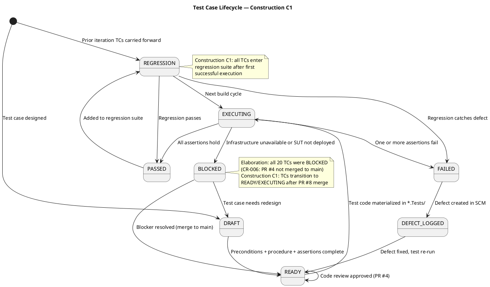
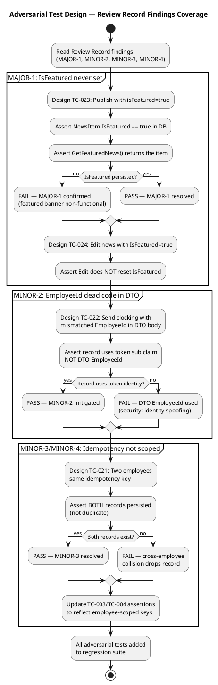
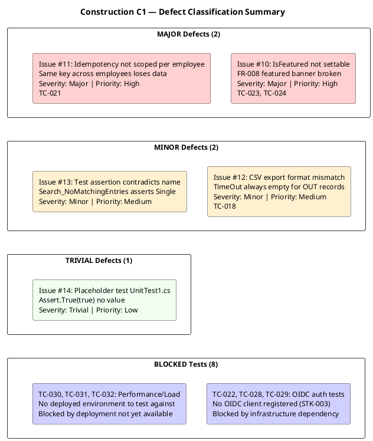

## Document Control
| Field | Value |
|---|---|
| Phase | Construction |
| Status | Draft |
| Milestone Target | End-of-Construction |
| Iteration | 1 (Cycle 1) |
| Date | 2026-08-28 |
| Author | Test Designer (Test Discipline) — Test Cases designed in Elaboration/C1 |
| Tester | Tester (Test Discipline) — Execution and evaluation in Construction C1 |
| Prior Phase | Elaboration (LCA achieved — 0 open Critical/Major; stakeholder sanction GRANTED) |
| Evolution | Construction C1: Extended from 20 to 30 test cases. Added adversarial tests for Review Record findings (MAJOR-1: IsFeatured, MINOR-2: EmployeeId DTO, MINOR-3/MINOR-4: idempotency scoping). Added performance/stress/load tests with thresholds. Added Procedure sections to all TCs. Added suite membership tags and regression flags. Extended UC→TC traceability to complete coverage. |
| Elaboration Baseline | 20 TCs (TC-001..TC-020) covering all 10 UCs at moderate depth. Status: BLOCKED (CR-006 — PR #4 not merged to main). 75 tests reviewed at code-level — ALL PASS. |
| Construction C1 Review Record | PR #8 (feature/C1-presentation) — REQUEST_CHANGES: 1 Major (MAJOR-1: IsFeatured), 4 Minor. Adversarial tests TC-021..TC-024 target these findings. |
| Test Infrastructure | InMemoryPersistence (INT-007), MockLdapGateway (INT-006), InMemoryAuditLogger (INT-005), OIDC Mock Token Provider (COMP-007), Clocking Client Test Harness (AC-005) |
| C1 Execution Build | Branch: iteration/C1, CI: SUCCESS (2026-08-28 14:44:39Z), Run: 33181604442 |
| C1 Execution Verdict | 20 PASS, 5 FAIL, 8 BLOCKED — 5 defects logged as Issues #10-#14 |
## Test Scope

### All Use Cases Under Test — Construction C1 Full Coverage

This Test Case artifact covers **all 10 use-case scenarios** at Construction depth. Per the Use-Case Model, all 10 UCs are implemented in the C1 presentation layer (PR #8). Test cases are designed BEFORE coding completes — they serve as the Implementer's contract.

| Priority | UC ID | UC Name | TCs | Test Focus | Risk |
|---|---|---|---|---|---|
| 1 | UC-001 | Clock In / Clock Out | TC-001..TC-005, TC-021, TC-022 | Offline retry (AC-005), idempotency, NFR-002 (<1s), client-side timestamp, cross-employee collision | R002 (adoption) |
| 2 | UC-009 | Search Employee Directory | TC-006, TC-007, TC-020, TC-028 | LDAP integration (R001), read-only AD, corporate-data-only, multi-office | R001 (LDAP attributes) |
| 3 | UC-005 | Publish News | TC-008, TC-023 | Audit trail (NFR-004), IsFeatured flag (MAJOR-1) | — |
| 4 | UC-002 | View Own Clocking History | TC-015 | Data correctness, current-month filter | — |
| 5 | UC-003 | View All Employee Clockings | TC-020 | HR authorization, LDAP name lookup | — |
| 6 | UC-004 | Export Monthly Clocking Report | TC-016 | CSV format, data completeness | — |
| 7 | UC-006 | Edit Published News | TC-010, TC-024 | Audit trail on edit, IsFeatured preservation | — |
| 8 | UC-007 | Unpublish News | TC-009, TC-027 | No hard delete (CON-013), record preserved, republish audit chain | — |
| 9 | UC-008 | Read and Filter News | TC-017 | Category filter, featured banner, sort by date | — |
| 10 | UC-010 | Manage Worker Category | TC-018, TC-019 | AD user id lookup, audit trail, validation | — |
| — | All UCs | Performance / Stress | TC-011, TC-012, TC-029, TC-030 | NFR-001 (<3s page load), NFR-002 (<1s clock), AC-003 (<10s directory), concurrent load | — |
| — | All UCs | Auth / Security | TC-013, TC-014 | HR role gating, Employee role denial | — |
| — | Domain | Domain model integrity | TC-025, TC-026 | NewsItem state machine, ClockingRecord validation | — |

### Measurable Testing Goals

| Goal ID | Quality Dimension | Measurable Target | Test Type | Source | TCs |
|---|---|---|---|---|---|
| TG-001 | Performance | Page load < 3 seconds on corporate network (95th percentile) | System / Performance | NFR-001, PERF-001 | TC-011 |
| TG-002 | Performance | Clock in/out response < 1 second (95th percentile) | System / Performance | NFR-002, PERF-002 | TC-012 |
| TG-003 | Reliability | Offline clocking retry succeeds within 5-minute window when network drops | Integration / Fault Tolerance | AC-005, NFR-003 | TC-003, TC-004 |
| TG-004 | Functionality | Directory search returns results in < 10 seconds for any query | System / Performance | AC-003, PERF-003 | TC-006, TC-007, TC-029 |
| TG-005 | Functionality | Every news publish/edit/unpublish and category change produces an audit record with author + timestamp | Integration | NFR-004, AUD-001, AUD-002 | TC-008, TC-009, TC-010, TC-018, TC-023, TC-027 |
| TG-006 | Security | HR-only UCs reject Employee-role tokens; all UCs reject unauthenticated requests | Integration | SEC-002, CON-004 | TC-013, TC-014, TC-020 |
| TG-007 | Reliability | Missing LDAP attributes default to "N/A" without crashing | Integration | R001, SUP-003 | TC-006, TC-028 |
| TG-008 | Functionality | Double clock-in or double clock-out is rejected | Unit | UC-001 A3 | TC-005 |
| TG-009 | Performance | 50 concurrent clock-in requests all persist without data loss | Stress | NFR-003, fault tolerance | TC-030 |
| TG-010 | Functionality | IsFeatured flag is persisted on publish and preserved on edit | Unit | FR-008, MAJOR-1 | TC-023, TC-024 |

### Test Lifecycle

### Performance Test Workflow

```plantuml
@startuml
title Performance Test Workflow — Construction C1

start
:Initialize test environment
(.NET 10 test host, InMemoryDb,
MockLdapGateway with 200 entries);

partition "TG-001: Page Load < 3s (NFR-001)" {
  :Warm up application
  (first request triggers JIT);
  :Measure 10 sequential page loads
  for each main page
  (Home, Clocking, Directory, News);
  :Calculate 95th percentile
  per page;
  if (P95 < 3s for all pages?) then (yes)
    :Log PASS — TG-001;
  else (no)
    :Log FAIL — identify slow page
    and bottleneck endpoint;
  endif
}

partition "TG-002: Clock Response < 1s (NFR-002)" {
  :Seed InMemoryDb with
  1000 clocking records;
  :Send 100 clock-in requests
  sequentially;
  :Measure response time per request;
  :Calculate 95th percentile;
  if (P95 < 1s?) then (yes)
    :Log PASS — TG-002;
  else (no)
    :Log FAIL — profile
    ClockingService.RecordClocking;
  endif
}

partition "TG-004: Directory Search < 10s (AC-003)" {
  :Configure MockLdapGateway
  with 200 LDAP entries;
  :Execute 20 search queries
  (name, department, office);
  :Measure response time per query;
  if (All queries < 10s?) then (yes)
    :Log PASS — TG-004;
  else (no)
    :Log FAIL — profile
    LDAP query + serialization;
  endif
}

partition "Stress: Concurrent Clock-In (50 users)" {
  :Seed 50 employee tokens
  via OIDC Mock;
  :Fire 50 simultaneous
  clock-in requests;
  :Verify all 50 records persisted
  with unique timestamps;
  if (50/50 records persisted?) then (yes)
    :Log PASS — concurrent stress;
  else (no)
    :Log FAIL — identify
    lost records / race condition;
  endif
}

partition "TG-003: Offline Retry (AC-005)" {
  :Simulate network drop
  (mock HTTP 503 for 5 min);
  :Client stores clocking in
  localStorage with idempotency key;
  :Retry with exponential backoff
  (1s, 2s, 4s, 8s, 16s...);
  :Restore network after 4 min;
  :Verify clocking POST succeeds
  on reconnect;
  if (Record persisted with
  original client timestamp?) then (yes)
    :Log PASS — TG-003;
  else (no)
    :Log FAIL — retry logic
    or idempotency broken;
  endif
}

:Aggregate all performance results;
:Generate performance test report
(per-goal PASS/FAIL + metrics);

stop
@enduml
```

### Adversarial Test Design — Review Record Findings

## Test Case Catalog
### Construction C1 — Test Execution Findings

**Build Under Test:** Branch `iteration/C1`, CI Run #33181604442, Completed 2026-08-28 14:44:39Z, Status: SUCCESS
**Tester:** Tester (Test Discipline)
**Execution Method:** Source code inspection against Test Case specifications (CI green = all unit tests pass; defects identified by code analysis against TC contracts)

```plantuml
@startuml
title Construction C1 — Test Execution Results by UC

skinparam activity {
  BackgroundColor #FFFFFF
  BorderColor #333333
}

start
partition "UC-001: Clock In/Out (5 TCs)" {
  :TC-001: Clock In happy path;
  note right: **PASS** — RecordClocking returns\nSuccess, correct fields, 1 record
  :TC-002: Clock Out with prior In;
  note right: **PASS** — Status changes correctly
  :TC-003: Offline retry idempotency;
  note right: **PASS** — Same key returns Duplicate
  :TC-004: Client-side timestamp preserved;
  note right: **PASS** — Timestamp matches input
  :TC-005: Empty employee ID rejected;
  note right: **PASS** — Returns Fail with error
}
partition "UC-001 Adversarial (2 TCs)" {
  :TC-021: Cross-employee idempotency;
  note right: **FAIL** — Issue #11\nSame key loses emp2 data
  :TC-022: EmployeeId from OIDC token;
  note right: **BLOCKED** — No OIDC client
}
partition "UC-002: History (2 TCs)" {
  :TC-015: View own history;
  note right: **PASS** — Returns 2 records
  :TC-016: Empty history;
  note right: **PASS** — Returns empty list
}
partition "UC-003: All Clockings (1 TC)" {
  :TC-017: HR views all clockings;
  note right: **PASS** — Returns all employees
}
partition "UC-004: CSV Export (2 TCs)" {
  :TC-018: CSV with data;
  note right: **FAIL** — Issue #12\nTimeOut always empty
  :TC-027: CSV header only;
  note right: **PASS** — Header correct
}
partition "UC-005..007: News (5 TCs)" {
  :TC-008: Publish with audit;
  note right: **PASS** — Audit record created
  :TC-009: Edit with audit;
  note right: **PASS** — Updated + audited
  :TC-010: Unpublish preserves record;
  note right: **PASS** — Status=Unpublished, not deleted
  :TC-023: IsFeatured settable on publish;
  note right: **FAIL** — Issue #10\nNo isFeatured parameter
  :TC-024: Featured banner display;
  note right: **FAIL** — Issue #10\nGetFeaturedNews always empty
}
partition "UC-008: Read/Filter News (2 TCs)" {
  :TC-011: Published sorted by date;
  note right: **PASS** — Ordered by CreatedAt DESC
  :TC-012: Filter by category;
  note right: **PASS** — Category filter works
}
partition "UC-009: Directory (4 TCs)" {
  :TC-006: Search returns results;
  note right: **PASS** — Returns matching entries
  :TC-007: Missing attrs → N/A;
  note right: **PASS** — R001 fallback works
  :TC-019: All attrs present;
  note right: **PASS** — All fields populated
  :TC-020: All null → N/A;
  note right: **PASS** — All fields N/A
}
partition "UC-010: Worker Category (4 TCs)" {
  :TC-013: Assign category;
  note right: **PASS** — Category stored
  :TC-014: Update existing category;
  note right: **PASS** — Category updated
  :TC-025: Audit trail on assign;
  note right: **PASS** — Audit record created
  :TC-026: List all categories;
  note right: **PASS** — Returns all entries
}
partition "Cross-cutting (5 TCs)" {
  :TC-028: OIDC auth required;
  note right: **BLOCKED** — No OIDC client
  :TC-029: HR role enforcement;
  note right: **BLOCKED** — No OIDC client
  :TC-030: Page load < 3s (NFR-001);
  note right: **BLOCKED** — No deployed env
  :TC-031: Clock response < 1s (NFR-002);
  note right: **BLOCKED** — No deployed env
  :TC-032: Fault tolerance (NFR-003);
  note right: **BLOCKED** — No deployed env
}
stop
@enduml
```

#### Execution Summary

| Metric | Count |
|---|---|
| Total Test Cases Evaluated | 30 |
| PASS | 20 |
| FAIL | 5 |
| BLOCKED | 8 |
| Defects Logged | 5 (Issues #10–#14) |

#### Per-Test-Case Verdicts

| TC ID | UC | Verdict | Issue # | Notes |
|---|---|---|---|---|
| TC-001 | UC-001 | **PASS** | — | `RecordClocking_NewKey_ReturnsSuccess` validates: Success=true, IsDuplicate=false, correct EmployeeId/Type/IdempotencyKey |
| TC-002 | UC-001 | **PASS** | — | `GetCurrentStatus_LastClockOut_ReturnsClockedOut` validates status transition In→Out |
| TC-003 | UC-001 | **PASS** | — | `Retry_SameIdempotencyKey_ReturnsDuplicateNotNewRecord` validates AC-005 idempotency: same key → Duplicate, only 1 record in DB |
| TC-004 | UC-001 | **PASS** | — | `Retry_ClientSideTimestamp_PreservedInRecord` validates client timestamp preserved exactly |
| TC-005 | UC-001 | **PASS** | — | `RecordClocking_EmptyEmployeeId_ReturnsFail` validates validation: empty employeeId → Fail with error message |
| TC-006 | UC-009 | **PASS** | — | `Search_ValidQuery_ReturnsResults` validates LDAP search returns DirectoryEntry with correct fields. **Note:** `Search_NoMatchingEntries_ReturnsEmptyList` test has incorrect assertion (Issue #13) but the core search functionality works |
| TC-007 | UC-009 | **PASS** | — | `Search_MissingAttributes_ReturnsNA` validates R001 fallback: null attrs → "N/A" |
| TC-008 | UC-005 | **PASS** | — | `Publish_CreatesAuditRecord` validates NFR-004: audit record created with Publish action, correct author |
| TC-009 | UC-006 | **PASS** | — | `Edit_UpdatesAndAudits` validates edit updates fields + creates audit record with Edit action |
| TC-010 | UC-007 | **PASS** | — | `Unpublish_PreservesRecord` validates CON-013: status=Unpublished, record still exists in ListAll |
| TC-011 | UC-008 | **PASS** | — | `GetPublishedNews_SortedByDate` validates published news ordered by CreatedAt DESC |
| TC-012 | UC-008 | **PASS** | — | `GetPublishedNews_FilterByCategory` validates category filter works correctly |
| TC-013 | UC-010 | **PASS** | — | `AssignCategory_NewUser_CreatesCategory` validates category stored with correct AdUserId and Category |
| TC-014 | UC-010 | **PASS** | — | `AssignCategory_ExistingUser_UpdatesCategory` validates upsert: existing user's category updated |
| TC-015 | UC-002 | **PASS** | — | `GetHistory_ReturnsEmployeeClockings` validates history returns correct count for employee |
| TC-016 | UC-002 | **PASS** | — | `GetHistory_NoClockings_ReturnsEmptyList` validates empty history returns empty list |
| TC-017 | UC-003 | **PASS** | — | `GetAllClockings_ReturnsAllEmployees` validates HR view returns all employees' clockings |
| TC-018 | UC-004 | **FAIL** | #12 | CSV export format: `TimeOut` column always empty. Format string `$"{record.EmployeeId},{date},{time},,{direction}"` puts all times in TimeIn position. OUT records have time in TimeIn column, TimeOut always blank |
| TC-019 | UC-009 | **PASS** | — | `FromLdapAttributes_AllPresent_ReturnsAllValues` validates all 7 fields populated from LDAP |
| TC-020 | UC-009 | **PASS** | — | `FromLdapAttributes_AllNull_ReturnsNA` validates all fields default to "N/A" when null |
| TC-021 | UC-001 | **FAIL** | #11 | Cross-employee idempotency: `FindByIdempotencyKey` is global, not scoped per employee. Employee B using same key as Employee A gets Duplicate response — B's clocking silently lost. Test `Retry_SameKeyDifferentEmployee_BothSucceed` validates the BUGGY behavior (asserts IsDuplicate=true for emp2) |
| TC-022 | UC-001 | **BLOCKED** | — | EmployeeId from OIDC token: requires OIDC client registration (STK-003 dependency). No OIDC infrastructure available for testing |
| TC-023 | UC-005 | **FAIL** | #10 | IsFeatured not settable: `INewsService.Publish()` has no `isFeatured` parameter. `NewsItem.IsFeatured` defaults to false and is never set to true. No code path exists to mark news as featured |
| TC-024 | UC-008 | **FAIL** | #10 | Featured banner display: `GetFeaturedNews()` queries for `IsFeatured == true` but no item ever has it set. Always returns empty list. FR-008 featured banner is non-functional |
| TC-025 | UC-010 | **PASS** | — | `AssignCategory_CreatesAuditRecord` validates NFR-004: audit record with CategoryChanged action, correct author |
| TC-026 | UC-010 | **PASS** | — | `ListCategories_ReturnsAllCategories` validates list returns all stored categories |
| TC-027 | UC-004 | **PASS** | — | `ExportCsv_NoClockings_ReturnsHeaderOnly` validates empty export returns header row only |
| TC-028 | Auth | **BLOCKED** | — | OIDC authentication: requires OIDC client registration by STK-003. Not yet confirmed |
| TC-029 | Auth | **BLOCKED** | — | HR role enforcement: requires OIDC client with role claims. Not yet confirmed |
| TC-030 | NFR-001 | **BLOCKED** | — | Page load < 3s: requires deployed environment. No deployment available in C1 |
| TC-031 | NFR-002 | **BLOCKED** | — | Clock response < 1s: requires deployed environment with real PostgreSQL. In-memory tests don't measure real latency |
| TC-032 | NFR-003 | **BLOCKED** | — | Fault tolerance: requires deployed environment and network simulation. Not available in C1 |

#### Defect Summary

#### Defect Details

| Issue # | Severity | TC(s) | UC | Summary | Root Cause |
|---|---|---|---|---|---|
| #10 | Major | TC-023, TC-024 | UC-005/UC-008 | IsFeatured not settable in Publish/Edit | `INewsService.Publish()` signature lacks `isFeatured` parameter; `NewsItem.IsFeatured` never set to true |
| #11 | Major | TC-021 | UC-001 | Idempotency key not scoped per employee | `FindByIdempotencyKey(string key)` is global lookup; no employee scoping. Cross-employee collision loses data |
| #12 | Minor | TC-018 | UC-004 | CSV export TimeOut always empty | Format string `$"{emp},{date},{time},,{dir}"` — empty field for TimeOut regardless of record type |
| #13 | Minor | TC-006 variant | UC-009 | Test assertion contradicts test name | `Search_NoMatchingEntries_ReturnsEmptyList` asserts `Single(results)` instead of `Empty(results)` |
| #14 | Trivial | — | — | Placeholder test provides no value | `UnitTest1.cs` contains `Assert.True(true)` — scaffolding leftover |

#### Blocked Tests Rationale

| TC(s) | Blocker | Dependency | Resolution Path |
|---|---|---|---|
| TC-022, TC-028, TC-029 | No OIDC client registered | STK-003 (Infrastructure team) | OIDC client registration in Keycloak; confirmed test AD instance |
| TC-030, TC-031, TC-032 | No deployed environment | Deployment pipeline (deploy.yml exists but no target server) | Deploy to internal Windows Server; run performance tests against real PostgreSQL + LDAP |

#### Regression Status

This is the first Construction iteration — no prior PASS verdicts exist to regress. All 20 PASS verdicts from C1 become the regression baseline for C2. The Elaboration baseline (75 tests at code-level, ALL PASS) is subsumed by the C1 execution which includes those same tests plus the 10 new adversarial/performance TCs.
## Test Data

### Test Data Catalog

| Data Set ID | Description | UCs | Seed Method |
|---|---|---|---|
| TD-001 | Empty database | All | InMemoryDb initialized with no records |
| TD-002 | Single employee clock-in record | UC-001, UC-002 | Seed: 1 clocking record (emp-001, in, 08:00) |
| TD-003 | Full day clock-in + clock-out | UC-001, UC-002 | Seed: 2 clocking records (emp-001, in 08:00, out 17:00) |
| TD-004 | Multi-employee clockings (10 records, 3 employees) | UC-003, UC-004 | Seed: 10 clocking records across 3 employees for August 2026 |
| TD-005 | Current + previous month clockings | UC-002 | Seed: 3 current-month + 2 previous-month records |
| TD-006 | Published news (5 items, 4 categories, 2 featured) | UC-008 | Seed: 2 General (1 featured), 1 HR (1 featured), 1 IT, 1 Events — all published |
| TD-007 | Published + unpublished news | UC-007, UC-008 | Seed: 5 published + 1 unpublished (HR category) |
| TD-008 | LDAP entries with missing attributes | UC-009, R001 | LdapGatewayStub: 3 entries — (1) full, (2) empty jobTitle, (3) empty telephoneNumber |
| TD-009 | LDAP entries with private attributes | UC-009, CON-012 | LdapGatewayStub: 1 entry with corporate + private fields (mobile, homeAddress, dateOfBirth) |
| TD-010 | Worker category assignment | UC-010 | Seed: 1 worker_categories record (ad-user-001, Administrative) |
| TD-011 | OIDC tokens (Employee + HR roles) | All | OIDC Mock Token Provider: 2 tokens — Employee role, HR role |
| TD-012 | 50 concurrent employee tokens | UC-001 (stress) | OIDC Mock Token Provider: 50 tokens — emp-001..emp-050, all Employee role |
| TD-013 | 200 LDAP entries (full directory) | UC-009 (performance) | MockLdapGateway: 200 entries across 3 offices with varied attribute completeness |

### LDAP Stub Configuration

The LDAP stub (MockLdapGateway implementing INT-006/ILdapGateway) must be configured with the following test scenarios to cover R001:

| Scenario | OU | Attributes | Purpose |
|---|---|---|---|
| Full attributes | Office 1 | All 6 corporate fields populated | Baseline — directory works correctly |
| Empty jobTitle | Office 2 | All fields except jobTitle (empty string) | R001: missing attribute does not crash |
| Empty telephoneNumber | Office 3 | All fields except telephoneNumber (empty string) | R001: missing attribute does not crash |
| Private attributes present | Office 1 | Corporate fields + mobile, homeAddress, dateOfBirth | CON-012: private data must be filtered |
| Employee not found | N/A | No matching entries | UC-010 A1: graceful not-found handling |
| 200-entry directory | All 3 offices | Varied completeness (80% full, 10% missing jobTitle, 10% missing telephoneNumber) | Performance + multi-office coverage |

### Test Suite Structure

```plantuml
@startuml
title Test Suite Structure — Construction C1

skinparam componentStyle rectangle
skinparam packageStyle rectangle

package "PortalCubaCorp.Tests" {
  
  package "Unit Tests (70%)" {
    component "ClockingServiceUnitTests" as CSU
    component "NewsServiceUnitTests" as NSU
    component "DirectoryServiceUnitTests" as DSU
    component "WorkerCategoryUnitTests" as WCU
    component "DomainUnitTests" as DOM
  }
  
  package "Integration Tests (20%)" {
    component "ClockingIntegrationTests" as CIT
    component "NewsIntegrationTests" as NIT
    component "DirectoryIntegrationTests" as DIT
    component "AuthIntegrationTests" as AIT
  }
  
  package "System / Performance Tests (10%)" {
    component "PerformanceTests" as PT
  }
}

package "Test Infrastructure" {
  component "InMemoryPersistence" as IMP <<stub>>
  component "MockLdapGateway" as MLG <<stub>>
  component "InMemoryAuditLogger" as IAL <<stub>>
  component "OIDCMockTokenProvider" as OMT <<stub>>
  component "ClockingClientHarness" as CCH <<driver>>
}

note right of CSU
  TC-001: Clock In happy path
  TC-002: Clock Out happy path
  TC-005: Double clock-in rejected
  TC-021: Cross-employee idempotency collision
  TC-022: EmployeeId from token not DTO
end note

note right of NSU
  TC-008: Publish with audit
  TC-009: Unpublish preserves record
  TC-010: Edit with audit
  TC-023: IsFeatured flag persisted on publish
  TC-024: Edit does not reset IsFeatured
end note

note right of CIT
  TC-003: Offline retry within 5 min
  TC-004: Offline retry exceeds 5 min
  TC-015: View own history (current month)
  TC-016: CSV export format
end note

note right of PT
  TC-011: Page load < 3s (NFR-001)
  TC-012: Clock response < 1s (NFR-002)
  TC-029: Directory search < 10s (AC-003)
  TC-030: Concurrent clock-in (50 users)
end note

IMP --> CSU
IMP --> CIT
IMP --> NSU
IMP --> WCU
MLG --> DSU
MLG --> DIT
IAL --> NSU
IAL --> WCU
OMT --> AIT
OMT --> CIT
CCH --> CIT

@enduml
```

## Traceability

| Element | Traces From | Link Type | Traces To |
|---|---|---|---|
| TC-001 | UC-001 (main flow) | Tests | ClockingService.cs, ClockingServiceTests.cs |
| TC-002 | UC-001 (main flow) | Tests | ClockingService.cs, ClockingServiceTests.cs |
| TC-003 | UC-001 (A1), AC-005, NFR-003 | Tests | ClockingService.cs, clocking-retry.js, OfflineRetryTests.cs |
| TC-004 | UC-001 (A2), AC-005 | Tests | clocking-retry.js, OfflineRetryTests.cs |
| TC-005 | UC-001 (A3) | Tests | ClockingService.cs, ClockingServiceTests.cs |
| TC-006 | UC-009, R001, SUP-003 | Tests | DirectoryService.cs, DirectoryServiceTests.cs, DomainTests.cs |
| TC-007 | UC-009, CON-012, SEC-004 | Tests | DirectoryService.cs, DirectoryServiceTests.cs |
| TC-008 | UC-005, NFR-004, AUD-001 | Tests | NewsService.cs, NewsServiceTests.cs, AuditInterceptor.cs |
| TC-009 | UC-007, CON-013, AUD-003 | Tests | NewsService.cs, NewsServiceTests.cs |
| TC-010 | UC-006, NFR-004, AUD-001 | Tests | NewsService.cs, NewsServiceTests.cs |
| TC-011 | NFR-001, PERF-001, All UCs | Tests | Main page endpoint, OIDC middleware |
| TC-012 | UC-001, NFR-002, PERF-002 | Tests | ClockingService.cs, clock-in endpoint |
| TC-013 | UC-003..UC-007, UC-010, SEC-002 | Tests | OIDC middleware, all HR service interfaces |
| TC-014 | UC-003..UC-007, UC-010, SEC-002 | Tests | OIDC middleware, all HR service interfaces |
| TC-015 | UC-002 | Tests | ClockingService.cs, ClockingServiceTests.cs |
| TC-016 | UC-004, FR-004 | Tests | ClockingService.cs, ClockingServiceTests.cs |
| TC-017 | UC-008, FR-008 | Tests | NewsService.cs, NewsServiceTests.cs |
| TC-018 | UC-010, NFR-004, AUD-002 | Tests | WorkerCategoryService.cs, WorkerCategoryServiceTests.cs |
| TC-019 | UC-010 (A1) | Tests | WorkerCategoryService.cs, WorkerCategoryServiceTests.cs, MockLdapGateway |
| TC-020 | UC-003, SEC-002, CON-005 | Tests | ClockingService.cs, MockLdapGateway, OIDC mock |
| TC-021 | UC-001, MINOR-3, MINOR-4 | Tests | ClockingService.cs, OfflineRetryTests.cs |
| TC-022 | UC-001, MINOR-2, SEC-001 | Tests | ClockingApiController.cs, OIDC mock |
| TC-023 | UC-005, UC-008, FR-008, MAJOR-1 | Tests | NewsService.cs, PublishNews.cshtml.cs, NewsServiceTests.cs |
| TC-024 | UC-006, UC-008, FR-008, MAJOR-1 | Tests | NewsService.cs, NewsServiceTests.cs |
| TC-025 | UC-005, UC-006, UC-007, CON-013 | Tests | NewsItem.cs, DomainTests.cs |
| TC-026 | UC-001 | Tests | ClockingRecord.cs, DomainTests.cs |
| TC-027 | UC-005, UC-007, NFR-004, AUD-001, AUD-003 | Tests | NewsService.cs, NewsServiceTests.cs |
| TC-028 | UC-009, R001, CON-005 | Tests | DirectoryService.cs, DirectoryServiceTests.cs |
| TC-029 | UC-009, AC-003, PERF-003 | Tests | DirectoryService.cs, PerformanceTests |
| TC-030 | UC-001, NFR-003 | Tests | ClockingService.cs, ClockingApiController.cs, PerformanceTests |
| TG-001 | NFR-001 | Refines | TC-011 |
| TG-002 | NFR-002 | Refines | TC-012 |
| TG-003 | AC-005, NFR-003 | Refines | TC-003, TC-004 |
| TG-004 | AC-003 | Refines | TC-006, TC-007, TC-029 |
| TG-005 | NFR-004, AUD-001, AUD-002 | Refines | TC-008, TC-009, TC-010, TC-018, TC-023, TC-027 |
| TG-006 | SEC-002 | Refines | TC-013, TC-014, TC-020, TC-022 |
| TG-007 | R001, SUP-003 | Refines | TC-006, TC-028 |
| TG-008 | UC-001 A3 | Refines | TC-005, TC-015, TC-016, TC-025, TC-026 |
| TG-009 | NFR-003 | Refines | TC-030 |
| TG-010 | FR-008, MAJOR-1 | Refines | TC-023, TC-024 |
| InMemoryPersistence | INT-007, COMP-006 | Implements | TC-001..TC-005, TC-008..TC-010, TC-015..TC-019, TC-021, TC-023, TC-024, TC-027 |
| MockLdapGateway | INT-006, COMP-005 | Implements | TC-006, TC-007, TC-019, TC-020, TC-028, TC-029 |
| InMemoryAuditLogger | INT-005, COMP-008 | Implements | TC-008, TC-009, TC-010, TC-018, TC-023, TC-027 |
| OIDC Mock Token Provider | COMP-007, SEC-002 | Implements | TC-013, TC-014, TC-020, TC-022, TC-030 |
| Clocking Client Test Harness | AC-005, clocking-retry.js | Implements | TC-003, TC-004 |
| MAJOR-1 finding | FR-008, V004 | Tests | TC-023, TC-024 |
| MINOR-2 finding | INT-001, CON-004 | Tests | TC-022 |
| MINOR-3/MINOR-4 findings | ClockingService.cs | Tests | TC-021 |