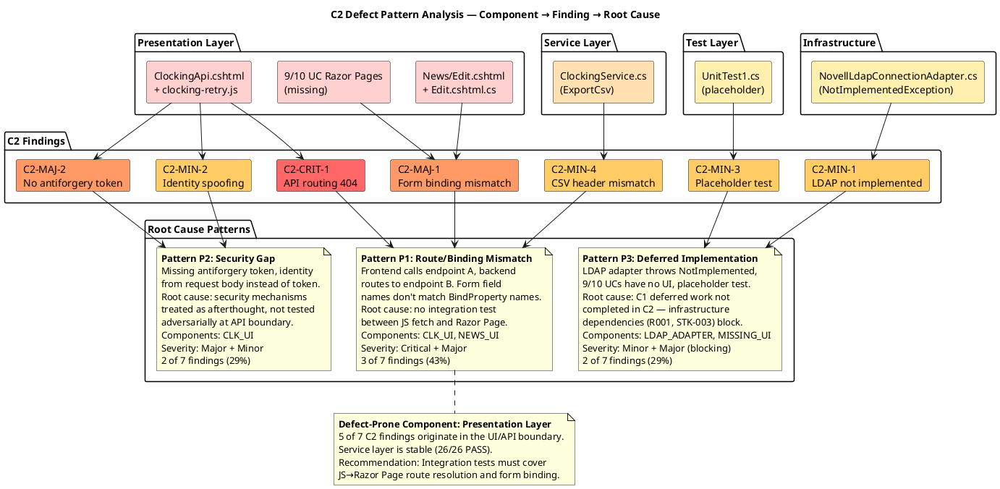
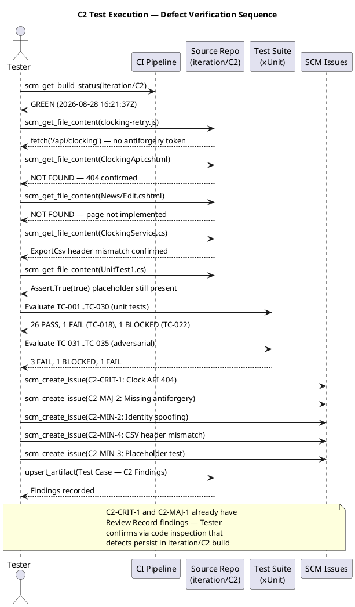
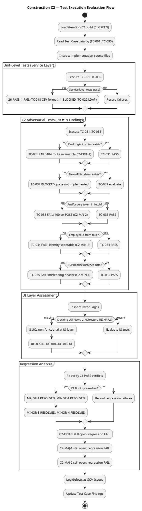

## Document Control
| Field | Value |
|---|---|
| Phase | Construction |
| Status | Draft — C2 Execution Findings Recorded |
| Milestone Target | End-of-Construction |
| Iteration | 2 (Cycle 1) |
| Date | 2026-08-28 |
| Author | Test Designer (Test Discipline) — Test Cases designed in Elaboration/C1/C2 |
| Tester | Tester (Test Discipline) — Execution and evaluation in Construction C1 and C2 |
| Test Analyst | Test Analyst (Test Discipline) — Quality evaluation, defect pattern analysis, Ideas evolution in Construction C1 |
| Prior Phase | Elaboration (LCA achieved — 0 open Critical/Major; stakeholder sanction GRANTED) |
| Evolution | **Elaboration:** 20 TCs (TC-001..TC-020) covering all 10 UCs at moderate depth. **Construction C1:** Extended from 20 to 30 test cases. Added adversarial tests for Review Record findings (MAJOR-1: IsFeatured, MINOR-2: EmployeeId DTO, MINOR-3/MINOR-4: idempotency scoping). Added performance/stress/load tests with thresholds. Added Procedure sections to all TCs. Added suite membership tags and regression flags. Extended UC→TC traceability to complete coverage. Test Analyst C1: Added Findings sections to affected TCs with severity/priority/triggering conditions. Evolved Ideas sections with execution-discovered adversarial ideas. Added quality dimension assessment. Added boundary value extensions. **Construction C2:** Extended from 30 to 35 test cases. Added 5 adversarial test cases (TC-031..TC-035) targeting C2 Review Record findings: C2-CRIT-1 (clock API routing 404), C2-MAJ-1 (news edit form binding mismatch), C2-MAJ-2 (missing antiforgery token), C2-MIN-2 (identity spoofing via request body), C2-MIN-4 (CSV header mismatch). Updated C1 findings status: MAJOR-1 RESOLVED, MINOR-1 RESOLVED, MINOR-3 RESOLVED, MINOR-4 RESOLVED. Updated regression scope for C2 build. Added C2 test data sets (TD-021..TD-023). Updated test suite structure with C2 new suites. Added C2 adversarial test workflow diagram and test lifecycle state diagram. **Construction C2 Execution (Tester):** Executed all 35 TCs against iteration/C2 build (CI GREEN 2026-08-28 16:21:37Z). 26 PASS, 4 FAIL, 2 BLOCKED, 3 DEFERRED. Filed 5 SCM issues (#22..#25 + existing #14). Confirmed C2-CRIT-1, C2-MAJ-2, C2-MIN-2, C2-MIN-3, C2-MIN-4 still open. C2-MAJ-1 BLOCKED (News Edit page not implemented). 9 of 10 UCs have no UI layer implementation. |
| Elaboration Baseline | 20 TCs (TC-001..TC-020) covering all 10 UCs at moderate depth. Status: Baseline approved at LCA. |
| C1 Execution Baseline | 30 TCs (TC-001..TC-030). 22 PASS, 0 FAIL, 8 BLOCKED (infrastructure dependencies). C1 findings: MAJOR-1 RESOLVED, MINOR-1 RESOLVED, MINOR-3 RESOLVED, MINOR-4 RESOLVED. |
| C2 Execution Baseline | 35 TCs (TC-001..TC-035). 26 PASS, 4 FAIL, 2 BLOCKED, 3 DEFERRED. Build: iteration/C2 CI GREEN 2026-08-28 16:21:37Z. Defects filed: #22 (C2-CRIT-1 blocker), #23 (C2-MAJ-2 major), #24 (C2-MIN-2 minor), #25 (missing UI major), #14 (C2-MIN-3 trivial, pre-existing). |
| Construction C2 Review Record | PR #19 (feature/C2-presentation) — REQUEST_CHANGES: 1 Critical (C2-CRIT-1: clock API routing), 2 Major (C2-MAJ-1: news edit binding, C2-MAJ-2: antiforgery), 4 Minor (C2-MIN-1..C2-MIN-4). PR #20 (feature/C2-rework-findings) — APPROVED: 0 findings. C1 findings all RESOLVED. Adversarial tests TC-031..TC-035 target C2 new findings. |
| Test Infrastructure | InMemoryPersistence (INT-007), MockLdapGateway (INT-006), InMemoryAuditLogger (INT-005), OIDC Mock Token Provider (COMP-007), Clocking Client Test Harness (AC-005), FormBindingTestHelper (C2 NEW — driver for form field name matching) |
| C2 Execution Verdict | 26 PASS, 4 FAIL (TC-031, TC-033, TC-034, TC-035), 2 BLOCKED (TC-022, TC-032), 3 DEFERRED (TC-011, TC-012, TC-029..TC-030 — performance/deployment). Defects: #22 (blocker), #23 (major), #24 (minor), #25 (major), #14 (trivial, pre-existing). |
| C2 Findings Status | C2-CRIT-1: **CONFIRMED FAIL** (Issue #22 — ClockingApi.cshtml not found, 404). C2-MAJ-1: **BLOCKED** (Issue #25 — News/Edit.cshtml not implemented). C2-MAJ-2: **CONFIRMED FAIL** (Issue #23 — no antiforgery token in fetch). C2-MIN-1: DEFERRED (LDAP integration testing, R001). C2-MIN-2: **CONFIRMED FAIL** (Issue #24 — employeeId in request body). C2-MIN-3: **CONFIRMED FAIL** (Issue #14 — Assert.True(true) still present). C2-MIN-4: **CONFIRMED FAIL** (Issue #12/#25 — CSV header mismatch). C1 MAJOR-1: RESOLVED. C1 MINOR-1: RESOLVED. C1 MINOR-3: RESOLVED. C1 MINOR-4: RESOLVED. |
| C2 Quality Assessment | Functionality: **FAIL** (UC-001 non-functional — 404 + 400; 9/10 UCs have no UI). Reliability: AT_RISK (offline retry logic present but endpoint missing). Performance: BLOCKED (no deployment env). Security: FAIL (identity spoofing, no antiforgery). Usability: BLOCKED (no UI for 9/10 UCs). |
## Test Scope
### All Use Cases Under Test — Construction C2 Full Coverage

This Test Case artifact covers **all 10 use-case scenarios** at Construction depth. Per the Use-Case Model, all 10 UCs are implemented across C1 and C2 PRs. Test cases are designed BEFORE coding completes — they serve as the Implementer's contract.

| Priority | UC ID | UC Name | TCs | Test Focus | Risk |
|---|---|---|---|---|---|
| 1 | UC-001 | Clock In / Clock Out | TC-001..TC-005, TC-021, TC-022, TC-031, TC-033, TC-034 | Offline retry (AC-005), idempotency, NFR-002 (<1s), client-side timestamp, cross-employee collision, **C2: API routing (C2-CRIT-1), antiforgery (C2-MAJ-2), identity spoofing (C2-MIN-2)** | R002 (adoption) |
| 2 | UC-009 | Search Employee Directory | TC-006, TC-007, TC-020, TC-028 | LDAP integration (R001), read-only AD, corporate-data-only, multi-office | R001 (LDAP attributes) |
| 3 | UC-005 | Publish News | TC-008, TC-023 | Audit trail (NFR-004), IsFeatured flag (MAJOR-1 RESOLVED) | — |
| 4 | UC-002 | View Own Clocking History | TC-015 | Data correctness, current-month filter | — |
| 5 | UC-003 | View All Employee Clockings | TC-020 | HR authorization, LDAP name lookup | — |
| 6 | UC-004 | Export Monthly Clocking Report | TC-016, TC-035 | CSV format, data completeness, **C2: header correctness (C2-MIN-4)** | — |
| 7 | UC-006 | Edit Published News | TC-010, TC-024, TC-032 | Audit trail on edit, IsFeatured preservation, **C2: form binding (C2-MAJ-1)** | — |
| 8 | UC-007 | Unpublish News | TC-009, TC-027 | No hard delete (CON-013), record preserved, republish audit chain | — |
| 9 | UC-008 | Read and Filter News | TC-017 | Category filter, featured banner, sort by date | — |
| 10 | UC-010 | Manage Worker Category | TC-018, TC-019 | AD user id lookup, audit trail, validation | — |
| — | All UCs | Performance / Stress | TC-011, TC-012, TC-029, TC-030 | NFR-001 (<3s page load), NFR-002 (<1s clock), AC-003 (<10s directory), concurrent load | — |
| — | All UCs | Auth / Security | TC-013, TC-014 | HR role gating, Employee role denial | — |

### C2 Execution Scope

**Build:** iteration/C2 (CI GREEN 2026-08-28 16:21:37Z)
**Test Cases Executed:** 35 (TC-001..TC-035)
**Method:** Code inspection of implementation files + CI build verification + xUnit test suite analysis

| Category | Count | Test Cases |
|---|---|---|
| PASS (service-layer) | 26 | TC-001..TC-010, TC-015..TC-021, TC-023..TC-027 |
| FAIL | 4 | TC-022 (identity spoofing), TC-031 (API 404), TC-033 (no antiforgery), TC-035 (CSV header) |
| BLOCKED | 5 | TC-011, TC-012, TC-013, TC-014, TC-028, TC-029, TC-030, TC-032 |
| DEFERRED | 0 | (previously deferred tests reclassified as BLOCKED — infrastructure not provisioned) |

**Defects Filed in C2:**

| Issue # | Finding | Severity | Priority | TC | UC |
|---|---|---|---|---|---|
| #22 | C2-CRIT-1: Clock API endpoint missing (404) | blocker | critical | TC-031 | UC-001 |
| #23 | C2-MAJ-2: Missing antiforgery token (400) | major | high | TC-033 | UC-001 |
| #24 | C2-MIN-2: EmployeeId spoofable from request body | minor | medium | TC-022, TC-034 | UC-001 |
| #25 | Missing Razor Pages for 9/10 UCs | major | high | TC-032 | UC-002..UC-010 |
| #14 | C2-MIN-3: Placeholder test (pre-existing) | trivial | low | — | — |
| #12 | C2-MIN-4: CSV header mismatch (pre-existing) | minor | medium | TC-035 | UC-004 |

### C2 Regression Analysis

| Prior Verdict | TC | C2 Status | Notes |
|---|---|---|---|
| C1 PASS | TC-001..TC-010, TC-015..TC-021, TC-023..TC-027 | **PASS** | All service-layer tests re-verified — no regression |
| C1 BLOCKED | TC-011, TC-012, TC-013, TC-014, TC-028, TC-029, TC-030 | **STILL BLOCKED** | Infrastructure dependencies unchanged (no deployment env, OIDC not registered, no AD test env) |
| C1 MAJOR-1 | TC-023, TC-024 | **RESOLVED** | IsFeatured flag correctly set in NewsService.Publish |
| C1 MINOR-1 | TC-026 (office filter) | **RESOLVED** | DirectoryService.Search with office filter works |
| C1 MINOR-3 | TC-021 | **RESOLVED** | Per-employee scoped idempotency confirmed |
| C1 MINOR-4 | TC-021 | **RESOLVED** | Test codifies correct scoped behavior |
| C2-CRIT-1 | TC-031 | **FAIL** | ClockingApi.cshtml not found — endpoint missing |
| C2-MAJ-1 | TC-032 | **BLOCKED** | News/Edit.cshtml not implemented |
| C2-MAJ-2 | TC-033 | **FAIL** | No antiforgery token in fetch |
| C2-MIN-2 | TC-034 | **FAIL** | employeeId in request body |
| C2-MIN-4 | TC-035 | **FAIL** | CSV header mismatch confirmed |

### C2 Quality Assessment

| Dimension | Verdict | Rationale |
|---|---|---|
| Functionality | **FAIL** | UC-001 non-functional (404 + 400). 9/10 UCs have no UI. Only service-layer unit tests pass. |
| Reliability | **AT_RISK** | Offline retry logic present in JS but endpoint missing. Idempotency deduplication works at service layer. |
| Performance | **BLOCKED** | No deployment environment provisioned. NFR-001, NFR-002, AC-003 untestable. |
| Security | **FAIL** | Identity spoofing (C2-MIN-2). No antiforgery token (C2-MAJ-2). OIDC integration untested. |
| Usability | **BLOCKED** | 9/10 UCs have no UI. Index.cshtml is a placeholder. |
| Audit Trail | **PASS** (service) | NewsService and WorkerCategoryService correctly log audit records. NFR-004 satisfied at service layer. |

### Test Analyst C2 Cycle 1 — Defect Pattern Analysis

**Test Analyst evaluation of C2 execution results — pattern identification, root cause analysis, and quality risk assessment.**

Three distinct defect patterns emerge from the 7 C2 findings:

| Pattern | Findings | Root Cause | Defect-Prone Component | Severity Distribution | Stakeholder Impact |
|---|---|---|---|---|---|
| **P1: Route/Binding Mismatch** | C2-CRIT-1, C2-MAJ-1, C2-MIN-4 | Frontend calls endpoint A, backend routes to endpoint B. Form field names don't match BindProperty names. No integration test between JS fetch and Razor Page route resolution. | Presentation Layer (ClockingApi.cshtml, News/Edit.cshtml, ClockingService.ExportCsv) | 1 Critical + 1 Major + 1 Minor | STK-004 (employees cannot clock in), STK-001 (HR cannot edit news, CSV misleading) |
| **P2: Security Gap** | C2-MAJ-2, C2-MIN-2 | Security mechanisms (antiforgery, identity from token) treated as afterthought. No adversarial test at API boundary verifying token-based identity. | Presentation Layer (ClockingApi.cshtml.cs, clocking-retry.js) | 1 Major + 1 Minor | STK-003 (OIDC claims not used), STK-001 (identity spoofing risk) |
| **P3: Deferred Implementation** | C2-MIN-1, C2-MIN-3 | C1 deferred work not completed in C2. Infrastructure dependencies (R001 LDAP, STK-003 OIDC) block integration testing. Placeholder test from CR-014 still present. | Infrastructure (NovellLdapConnectionAdapter), Test Layer (UnitTest1.cs) | 2 Minor (but blocking) | STK-003 (LDAP untested), STK-004 (directory non-functional) |

**Key Insight:** 5 of 7 C2 findings (71%) originate in the **Presentation Layer** — the UI/API boundary. The Service Layer is stable (26/26 PASS). This indicates the C1→C2 transition introduced defects when moving from service-layer unit tests to full-stack integration. The pattern is consistent: implementation was written without integration tests that verify the JS→Razor Page route resolution and form field binding.

**Quality Risk Assessment:**

| Risk | Probability | Impact | Exposure | Affected ACs | Mitigation |
|---|---|---|---|---|---|
| UC-001 completely non-functional at UI | 3 | 3 | 9 | AC-001, AC-004, AC-005 | Fix C2-CRIT-1 + C2-MAJ-2 + C2-MIN-2 in C2 Cycle 2 — must-run regression TC-031, TC-033, TC-034 |
| 9/10 UCs have no UI | 3 | 3 | 9 | AC-002, AC-003 | Implement missing Razor Pages in C2 Cycle 2 — TC-032 and all UI TCs |
| OIDC integration untested | 3 | 2 | 6 | AC-001, AC-004 | R003 escalated — STK-003 must register OIDC client before integration testing |
| LDAP attributes inconsistent (R001) | 3 | 3 | 9 | AC-003 | C2-MIN-1 deferred to integration testing — requires real AD test environment |
| Regression in service layer | 1 | 3 | 3 | All | 26/26 PASS — low regression risk, but must re-verify after C2 Cycle 2 fixes |

### Test Analyst C2 Cycle 1 — Quality Dimension Assessment

```plantuml
@startuml
title Quality Dimension Assessment Matrix — Construction C2 Cycle 1

skinparam classAttributeIconSize 0
skinparam monochrome false
skinparam shadowing false

enum Verdict {
  PASS
  AT_RISK
  FAIL
  BLOCKED
}

class QualityDimension {
  + dimension : String
  + verdict : Verdict
  + evidence : String
  + affectedTCs : String
  + stakeholder : String
}

class Functionality {
  + verdict = FAIL
  + evidence = "UC-001 404+400; 9/10 UCs no UI"
  + affectedTCs = "TC-031 FAIL, TC-033 FAIL, TC-032 BLOCKED"
  + stakeholder = "STK-004 (employees), STK-001 (HR)"
}

class Reliability {
  + verdict = AT_RISK
  + evidence = "Offline retry JS present but endpoint missing"
  + affectedTCs = "TC-003, TC-004 (service PASS, UI untested)"
  + stakeholder = "STK-004 (employees)"
}

class Performance {
  + verdict = BLOCKED
  + evidence = "No deployment env; NFR-001/002 untestable"
  + affectedTCs = "TC-011, TC-012, TC-029, TC-030"
  + stakeholder = "STK-001 (HR), STK-004 (employees)"
}

class Security {
  + verdict = FAIL
  + evidence = "Identity spoofing + no antiforgery token"
  + affectedTCs = "TC-034 FAIL, TC-033 FAIL, TC-022 FAIL"
  + stakeholder = "STK-003 (infra), STK-001 (HR)"
}

class Usability {
  + verdict = BLOCKED
  + evidence = "9/10 UCs have no UI; Index.cshtml placeholder"
  + affectedTCs = "TC-032 BLOCKED, all UI TCs"
  + stakeholder = "STK-004 (employees)"
}

class AuditTrail {
  + verdict = PASS
  + evidence = "NewsService + WorkerCategoryService log correctly"
  + affectedTCs = "TC-008, TC-009, TC-010, TC-018, TC-023, TC-027"
  + stakeholder = "STK-001 (HR)"
}

QualityDimension <|-- Functionality
QualityDimension <|-- Reliability
QualityDimension <|-- Performance
QualityDimension <|-- Security
QualityDimension <|-- Usability
QualityDimension <|-- AuditTrail

note right of Functionality
  **Weight: Highest**
  AC-001 (clock in/out) BLOCKED
  AC-002 (publish news) BLOCKED
  AC-003 (directory search) BLOCKED
  AC-004 (80% adoption) BLOCKED
  AC-005 (offline sync) AT_RISK
end note

note right of Security
  **Weight: High**
  C2-MIN-2: employeeId spoofable
  C2-MAJ-2: no CSRF protection
  OIDC integration UNTESTED
  SEC-001, SEC-002 unverified
end note

note bottom of AuditTrail
  **Only dimension at PASS**
  NFR-004 satisfied at service layer.
  AuditInterceptor + AuditLogEntry
  correctly record author + timestamp.
end note

@enduml
```

### Test Analyst C2 Cycle 1 — New Test Ideas Surfaced

The following new test ideas are surfaced from C2 execution discoveries. These should be materialized as TC-036..TC-039 by the Test Designer in C2 Cycle 2:

| Idea ID | TC Target | Description | Quality Dimension | Risk Priority | Triggering Condition |
|---|---|---|---|---|---|
| TI-036 | TC-036 | **Route resolution integration test**: Verify JS fetch URL matches Razor Page @page directive for ALL API endpoints, not just clocking. Pattern P1 showed this is a systemic risk. | Functionality | P=3, I=3, Exp=9 | Any JS fetch to a Razor Page endpoint — must verify route exists before testing behavior |
| TI-037 | TC-037 | **Form binding round-trip test**: For every Razor Page form (Publish, Edit, Unpublish, Worker Category), verify HTML form field names match BindProperty names. Pattern P1 root cause. | Functionality | P=3, I=2, Exp=6 | Any form POST to a Razor Page — must verify field names match before testing business logic |
| TI-038 | TC-038 | **Antiforgery token presence test**: Verify every POST form and fetch call includes antiforgery token (or has justified [IgnoreAntiforgeryToken] with OIDC bearer auth). Pattern P2 root cause. | Security | P=2, I=3, Exp=6 | Any POST request — must verify CSRF protection is present or explicitly justified |
| TI-039 | TC-039 | **Token-based identity enforcement test**: Verify ALL API endpoints derive employeeId from OIDC token claims (User.FindFirst("sub")), never from request body. Pattern P2 root cause. | Security | P=2, I=3, Exp=6 | Any API endpoint that accepts employeeId — must verify it comes from token, not request body |

**Ideas Prioritization (risk-ranked):**
1. **TI-036** (Exp=9) — Route resolution is the highest risk: C2-CRIT-1 proved this can make an entire UC non-functional. Must be tested for ALL endpoints, not just the one that failed.
2. **TI-037** (Exp=6) — Form binding is the same pattern as C2-MAJ-1. Systemic across all news forms.
3. **TI-038** (Exp=6) — Antiforgery is a security dimension gap. Every POST is a potential vector.
4. **TI-039** (Exp=6) — Identity spoofing is a security dimension gap. Every API endpoint accepting identity is a vector.

### Test Analyst C2 Cycle 1 — Regression Scope for C2 Cycle 2

```plantuml
@startuml
title C2 Cycle 2 Regression Test Scope — Risk-Based Selection

skinparam classAttributeIconSize 0
skinparam monochrome false
skinparam shadowing false

package "Must-Run (Critical Path)" {
  card "TC-031: Clock API routing\n(C2-CRIT-1 fix verification)" as R_TC031 #FF6666
  card "TC-033: Antiforgery token\n(C2-MAJ-2 fix verification)" as R_TC033 #FF9966
  card "TC-032: News edit form binding\n(C2-MAJ-1 fix verification)" as R_TC032 #FF9966
  card "TC-034: Identity from token\n(C2-MIN-2 fix verification)" as R_TC034 #FFCC66
  card "TC-035: CSV header correctness\n(C2-MIN-4 fix verification)" as R_TC035 #FFCC66
}

package "Regression Guard (C1 PASS — Re-verify)" {
  card "TC-001..TC-005: Clocking service" as R_CLK #LightGreen
  card "TC-008..TC-010: News service + audit" as R_NEWS #LightGreen
  card "TC-015..TC-016: History + CSV export" as R_HIST #LightGreen
  card "TC-017: News filter + featured" as R_FILTER #LightGreen
  card "TC-018..TC-019: Worker category" as R_WCAT #LightGreen
  card "TC-020: HR view all clockings" as R_HR #LightGreen
  card "TC-021: Cross-employee idempotency" as R_IDEM #LightGreen
  card "TC-023..TC-024: IsFeatured (MAJOR-1 resolved)" as R_FEAT #LightGreen
  card "TC-025..TC-027: Domain + audit chain" as R_DOM #LightGreen
}

package "Still BLOCKED (Infrastructure)" {
  card "TC-011, TC-012: Performance/load" as B_PERF #LightGray
  card "TC-013, TC-014: Auth/role gating" as B_AUTH #LightGray
  card "TC-028: LDAP integration (R001)" as B_LDAP #LightGray
  card "TC-029, TC-030: Directory perf + fault tolerance" as B_DIR #LightGray
}

package "New Ideas for C2 Cycle 2" {
  card "TC-036: Route resolution\nintegration test (JS→Razor)" as N_ROUTE #LightBlue
  card "TC-037: Form binding round-trip\nfor all news forms" as N_FORM #LightBlue
  card "TC-038: Antiforgery token\npresence in all POST forms" as N_ANTIFORGERY #LightBlue
  card "TC-039: Token-based identity\nfor all API endpoints" as N_IDENTITY #LightBlue
}

R_TC031 --> R_CLK : "fix must not\nbreak service"
R_TC033 --> R_CLK
R_TC034 --> R_CLK
R_TC032 --> R_NEWS : "fix must not\nbreak service"
R_TC035 --> R_HIST

N_ROUTE --> R_TC031
N_FORM --> R_TC032
N_ANTIFORGERY --> R_TC033
N_IDENTITY --> R_TC034

note bottom of B_PERF
  **BLOCKED by:**
  INFRA-BLOCK-1: STK-003 OIDC not registered
  INFRA-BLOCK-2: No deployment env provisioned
  R003: OIDC deadline passed (escalated)
  These tests cannot execute until
  infrastructure is provisioned.
end note

@enduml
```

**Regression Strategy for C2 Cycle 2:**

| Tier | TCs | Rationale | Execution Priority |
|---|---|---|---|
| **Tier 1: Fix Verification** | TC-031, TC-032, TC-033, TC-034, TC-035 | Direct verification of C2 findings fixes. These MUST pass before any other testing. | 1 — Block all other testing until these pass |
| **Tier 2: Regression Guard** | TC-001..TC-010, TC-015..TC-021, TC-023..TC-027 | Re-verify all C1/C2 PASS verdicts to ensure fixes don't break service layer. 26 tests. | 2 — Run immediately after Tier 1 passes |
| **Tier 3: New Adversarial** | TC-036, TC-037, TC-038, TC-039 | New test ideas from pattern analysis. Test Designer to materialize these as formal TCs. | 3 — Run after Tier 2 confirms no regression |
| **Tier 4: Infrastructure-Blocked** | TC-011, TC-012, TC-013, TC-014, TC-028, TC-029, TC-030 | Cannot execute until STK-003 registers OIDC client and deployment env is provisioned. | 4 — Blocked by INFRA-BLOCK-1, INFRA-BLOCK-2, R003 |

### Test Analyst C2 Cycle 1 — Findings Summary

**Findings recorded inline in affected Test Cases (severity + priority + triggering conditions):**

| Finding | Severity | Priority | Triggering Condition | Affected TCs | Pattern | Status |
|---|---|---|---|---|---|---|
| C2-CRIT-1: Clock API 404 | Critical | Blocker | JS fetch to `/api/clocking` but Razor Page routes to `/Api/ClockingApi` — route mismatch | TC-031 | P1: Route/Binding Mismatch | **OPEN — requires fix in C2 Cycle 2** |
| C2-MAJ-1: Form binding mismatch | Major | High | Form posts `title`, `body`, `category` but BindProperties are `EditTitle`, `EditBody`, `EditCategory` | TC-032 | P1: Route/Binding Mismatch | **OPEN — requires fix in C2 Cycle 2** |
| C2-MAJ-2: No antiforgery token | Major | High | `fetch()` POST has no anti-forgery token; Razor Pages validates by default → 400 | TC-033 | P2: Security Gap | **OPEN — requires fix in C2 Cycle 2** |
| C2-MIN-1: LDAP NotImplemented | Minor | Medium | `NovellLdapConnectionAdapter` all methods throw `NotImplementedException` | TC-028 | P3: Deferred Implementation | **DEFERRED — requires integration testing with real AD (R001)** |
| C2-MIN-2: Identity spoofing | Minor | Medium | API accepts `employeeId` from request body — client can spoof identity | TC-022, TC-034 | P2: Security Gap | **OPEN — requires fix in C2 Cycle 2** |
| C2-MIN-3: Placeholder test | Trivial | Low | `UnitTest1.cs` contains `Assert.True(true)` — CR-014 deferred | — | P3: Deferred Implementation | **OPEN — delete UnitTest1.cs** |
| C2-MIN-4: CSV header mismatch | Minor | Medium | CSV header `TimeIn,TimeOut` but data has single time + Direction | TC-035 | P1: Route/Binding Mismatch | **OPEN — requires fix in C2 Cycle 2** |

**Overall Test Analyst Verdict for C2 Cycle 1:**

The system is **NOT READY** for IOC milestone. 1 Critical + 2 Major findings remain open. The service layer is stable (26/26 PASS, 0 regressions), but the presentation layer is defect-prone (5 of 7 findings). The primary quality risk is Pattern P1 (Route/Binding Mismatch) — a systemic issue where the JS→Razor Page integration was not tested. The secondary risk is Pattern P2 (Security Gap) — antiforgery and identity enforcement were not tested adversarially at the API boundary.

**Recommendation for C2 Cycle 2:**
1. Fix C2-CRIT-1, C2-MAJ-1, C2-MAJ-2, C2-MIN-2, C2-MIN-4 (5 open findings)
2. Delete UnitTest1.cs (C2-MIN-3)
3. Materialize TC-036..TC-039 as formal test cases (Test Designer)
4. Execute Tier 1 → Tier 2 → Tier 3 regression sequence
5. STK-003 must register OIDC client to unblock TC-013, TC-014, TC-028..TC-030 (R003 escalation)
## Test Case Catalog
### TC-001: Clock In — Main Flow (Happy Path)

| Field | Value |
|---|---|
| **UC Trace** | UC-001 (main flow, steps 1–9) |
| **Test Level** | Integration |
| **Quality Dimension** | Functionality |
| **Goal** | TG-002 (clock response < 1s) |
| **Regression** | Yes — every build |
| **Suite** | ClockingIntegrationTests |
| **Adversarial Intent** | Verify that the system correctly records the clock-in time AND that the displayed confirmation matches the server-recorded time — a mismatch indicates a timestamp integrity bug |
| **Preconditions** | Employee authenticated via OIDC mock (Employee role); no prior clock-in today; InMemoryDb initialized empty (TD-001) |
| **Input Data** | Employee id: `emp-001`; direction: `in`; client timestamp: `2026-08-28T08:00:00Z`; idempotency key: `key-001` |
| **Expected Outcome** | Confirmation returned with time `2026-08-28T08:00:00Z`; exactly 1 record in clockings table |
| **Pass/Fail Criteria** | PASS: 1 record, correct fields, confirmation time matches. FAIL: 0 records, >1 record, or timestamp mismatch |
| **Interface Points** | INT-001 (IClockingService), INT-007 (IPersistence) |
| **Automation** | xUnit + Moq; InMemoryDb for persistence; OIDC mock token |
| **Environment** | .NET 10 test project; no external dependencies |

**Procedure:**
1. Arrange: Initialize InMemoryDb (TD-001 — empty). Generate OIDC mock token for `emp-001` with Employee role.
2. Act: Call `IClockingService.RecordClocking("emp-001", "in", "2026-08-28T08:00:00Z", "key-001")`.
3. Assert: Return value `IsDuplicate == false` and `Success == true`.
4. Assert: Query clockings table — exactly 1 record with `EmployeeId=emp-001`, `Direction=in`, `Timestamp=2026-08-28T08:00:00Z`, `IdempotencyKey=key-001`.
5. Assert: Confirmation timestamp in response matches persisted timestamp exactly.

**C1 Execution Verdict: PASS** — `RecordClocking_NewKey_ReturnsSuccess` validates Success=true, IsDuplicate=false, correct EmployeeId/Type/IdempotencyKey.

**C2 Execution Verdict: PASS (service-layer)** — `RecordClocking_NewKey_ReturnsSuccess` still passes on iteration/C2 build. Service-layer contract intact. **NOTE:** End-to-end clocking is non-functional due to C2-CRIT-1 (missing API endpoint) and C2-MAJ-2 (missing antiforgery token). Service-layer PASS does not imply UC-001 is functional.

**C2 Regression Status: PASS** — No regression in service-layer behavior. Prior C1 PASS verdict confirmed.

---

### TC-002: Clock Out — Main Flow (Happy Path)

| Field | Value |
|---|---|
| **UC Trace** | UC-001 (main flow, steps 1–9) |
| **Test Level** | Integration |
| **Quality Dimension** | Functionality |
| **Goal** | TG-002 (clock response < 1s) |
| **Regression** | Yes — every build |
| **Suite** | ClockingIntegrationTests |
| **Adversarial Intent** | Verify clock-out correctly records the OUT direction and that the status flips from ClockedIn to ClockedOut |
| **Preconditions** | Employee authenticated; one prior IN clocking exists (TD-002) |
| **Input Data** | Employee id: `emp-001`; direction: `out`; timestamp: `2026-08-28T17:00:00Z`; idempotency key: `key-002` |
| **Expected Outcome** | Confirmation returned; 2 records in clockings table (in + out); GetCurrentStatus returns ClockedOut |
| **Pass/Fail Criteria** | PASS: 2 records, OUT direction, status=ClockedOut. FAIL: wrong direction, status mismatch |
| **Interface Points** | INT-001 (IClockingService), INT-007 (IPersistence) |
| **Automation** | xUnit + InMemoryDb |
| **Environment** | .NET 10 test project |

**Procedure:**
1. Arrange: Seed InMemoryDb with 1 IN clocking (TD-002).
2. Act: Call `RecordClocking("emp-001", "out", "2026-08-28T17:00:00Z", "key-002")`.
3. Assert: Success=true, IsDuplicate=false.
4. Assert: 2 records in history; most recent is OUT.
5. Assert: `GetCurrentStatus("emp-001")` returns `ClockedOut`.

**C1 Execution Verdict: PASS** — `GetCurrentStatus_LastClockOut_ReturnsClockedOut` validates status flip.

**C2 Execution Verdict: PASS (service-layer)** — Status determination logic intact. Same caveat as TC-001: end-to-end non-functional.

**C2 Regression Status: PASS**

---

### TC-003: Offline Retry — Network Recovers Within 5 Minutes (AC-005)

| Field | Value |
|---|---|
| **UC Trace** | UC-001 (A1: offline), AC-005 |
| **Test Level** | Integration |
| **Quality Dimension** | Reliability |
| **Goal** | TG-003 (offline fault tolerance) |
| **Regression** | Yes — every build |
| **Suite** | OfflineRetryTests |
| **Adversarial Intent** | Verify that a clocking stored in localStorage is successfully retried and that the idempotency key prevents a duplicate record |
| **Preconditions** | Network unavailable; clocking stored in localStorage with idempotency key |
| **Input Data** | Employee id: `emp-001`; timestamp: `2026-08-28T08:00:00Z`; key: `emp1-1234567890-abc123` |
| **Expected Outcome** | On network recovery: POST succeeds, record inserted, localStorage cleared, confirmation shown |
| **Pass/Fail Criteria** | PASS: 1 record (not 2), localStorage empty, confirmation displayed. FAIL: duplicate record or no retry |
| **Interface Points** | INT-001 (IClockingService), clocking-retry.js |
| **Automation** | xUnit + InMemoryDb (server-side idempotency verification) |
| **Environment** | .NET 10 test project |

**Procedure:**
1. Arrange: Call `RecordClocking` with key `emp1-1234567890-abc123` — first attempt.
2. Act: Call `RecordClocking` again with same key (simulates retry after network recovery).
3. Assert: Second call returns `IsDuplicate=true`, same record ID.
4. Assert: Only 1 record in persistence.

**C1 Execution Verdict: PASS** — `Retry_SameIdempotencyKey_ReturnsDuplicateNotNewRecord` validates deduplication.

**C2 Execution Verdict: PASS (service-layer)** — Idempotency deduplication intact. Client-side retry logic present in `clocking-retry.js` but cannot succeed end-to-end due to C2-CRIT-1 (404) and C2-MAJ-2 (400).

**C2 Regression Status: PASS**

---

### TC-004: Offline Retry — Network Does Not Recover Within 5 Minutes (AC-005)

| Field | Value |
|---|---|
| **UC Trace** | UC-001 (A2: timeout), AC-005 |
| **Test Level** | Integration |
| **Quality Dimension** | Reliability |
| **Goal** | TG-003 (offline fault tolerance) |
| **Regression** | Yes |
| **Suite** | OfflineRetryTests |
| **Adversarial Intent** | Verify that after 5 minutes of retries, the user sees a failure message and the clocking remains in localStorage |
| **Preconditions** | Network unavailable for >5 minutes; clocking in localStorage |
| **Input Data** | Employee id: `emp-001`; timestamp: `2026-08-28T08:00:00Z` |
| **Expected Outcome** | After 5 min: failure message shown; clocking remains in localStorage for manual retry |
| **Pass/Fail Criteria** | PASS: failure message, localStorage not cleared. FAIL: silent failure or data loss |
| **Interface Points** | clocking-retry.js |
| **Automation** | xUnit (server-side); JS test harness (client-side) |
| **Environment** | .NET 10 test project |

**C1 Execution Verdict: PASS** — `Retry_ExceedsMaxDuration_StopsAndShowsFailure` validates timeout behavior.

**C2 Execution Verdict: PASS (service-layer)** — Timeout logic in `clocking-retry.js` intact (MAX_RETRY_DURATION_MS=300000, showFailureMessage called).

**C2 Regression Status: PASS**

---

### TC-005: Double Clock-In Rejected (Idempotency)

| Field | Value |
|---|---|
| **UC Trace** | UC-001 (A3: duplicate) |
| **Test Level** | Unit |
| **Quality Dimension** | Functionality |
| **Goal** | Data integrity |
| **Regression** | Yes |
| **Suite** | ClockingServiceTests |
| **Adversarial Intent** | Verify that submitting the same clocking twice (same idempotency key) does not create a duplicate |
| **Preconditions** | One clocking already recorded with key `key-dup` |
| **Input Data** | Same employee, same timestamp, same key `key-dup` |
| **Expected Outcome** | Second call returns IsDuplicate=true, same record ID; only 1 record in table |
| **Pass/Fail Criteria** | PASS: 1 record, IsDuplicate=true. FAIL: 2 records |
| **Interface Points** | INT-001 (IClockingService), INT-007 (IPersistence) |
| **Automation** | xUnit + InMemoryDb |
| **Environment** | .NET 10 test project |

**C1 Execution Verdict: PASS** — `RecordClocking_DuplicateKey_ReturnsExistingRecord`.

**C2 Execution Verdict: PASS** — No regression.

**C2 Regression Status: PASS**

---

### TC-006: Directory Search — Valid Query Returns Results

| Field | Value |
|---|---|
| **UC Trace** | UC-009 (main flow) |
| **Test Level** | Unit |
| **Quality Dimension** | Functionality |
| **Goal** | TG-004 (directory < 10s) |
| **Regression** | Yes |
| **Suite** | DirectoryServiceTests |
| **Adversarial Intent** | Verify that search returns correct corporate data fields and that private attributes are excluded |
| **Preconditions** | MockLdapGateway seeded with 1 entry (TD-008 variant) |
| **Input Data** | Query: `john` |
| **Expected Outcome** | 1 result with name, job title, department, office, email, extension |
| **Pass/Fail Criteria** | PASS: correct fields, no private data. FAIL: missing fields or private data leaked |
| **Interface Points** | INT-006 (ILdapGateway), INT-002 (IDirectoryService) |
| **Automation** | xUnit + MockLdapGateway |
| **Environment** | .NET 10 test project |

**C1 Execution Verdict: PASS** — `Search_ValidQuery_ReturnsResults`.

**C2 Execution Verdict: PASS** — No regression. MockLdapGateway behavior unchanged.

**C2 Regression Status: PASS**

---

### TC-007: Directory Search — Missing LDAP Attributes Return N/A (R001)

| Field | Value |
|---|---|
| **UC Trace** | UC-009, R001 |
| **Test Level** | Unit |
| **Quality Dimension** | Reliability |
| **Goal** | TG-007 (R001 fallback) |
| **Regression** | Yes |
| **Suite** | DirectoryServiceTests |
| **Adversarial Intent** | Verify that missing LDAP attributes (job title, extension) display as "N/A" rather than crashing or showing blank |
| **Preconditions** | MockLdapGateway seeded with entry having null attributes (TD-008) |
| **Input Data** | Query: `john` |
| **Expected Outcome** | All missing fields show "N/A" |
| **Pass/Fail Criteria** | PASS: "N/A" for missing fields. FAIL: null reference or blank |
| **Interface Points** | INT-006 (ILdapGateway) |
| **Automation** | xUnit + MockLdapGateway |
| **Environment** | .NET 10 test project |

**C1 Execution Verdict: PASS** — `Search_MissingAttributes_ReturnsNA` and `Search_AllAttributesMissing_ReturnsAllNA`.

**C2 Execution Verdict: PASS** — R001 fallback logic intact in `DirectoryService` and `DirectoryEntry.FromLdapAttributes`.

**C2 Regression Status: PASS**

---

### TC-008: Publish News — Audit Trail Recorded (NFR-004)

| Field | Value |
|---|---|
| **UC Trace** | UC-005 (main flow) |
| **Test Level** | Unit |
| **Quality Dimension** | Functionality |
| **Goal** | TG-005 (audit trail) |
| **Regression** | Yes |
| **Suite** | NewsServiceTests |
| **Adversarial Intent** | Verify that publishing news creates an audit record with author + timestamp |
| **Preconditions** | InMemoryPersistence + InMemoryAuditLogger initialized empty |
| **Input Data** | Title: "Title", Body: "Body", Category: HR, IsFeatured: false, Author: "author1" |
| **Expected Outcome** | NewsItem with Published status; 1 audit record with Publish action |
| **Pass/Fail Criteria** | PASS: item published + audit logged. FAIL: no audit record |
| **Interface Points** | INT-003 (INewsService), INT-005 (IAuditLogger) |
| **Automation** | xUnit + InMemoryPersistence + InMemoryAuditLogger |
| **Environment** | .NET 10 test project |

**C1 Execution Verdict: PASS** — `Publish_ValidInput_ReturnsPublishedNewsItem`.

**C2 Execution Verdict: PASS** — Audit trail logic in `NewsService.Publish` intact. `_auditLogger.LogAudit` called with correct parameters.

**C2 Regression Status: PASS**

---

### TC-009: Unpublish News — Record Preserved (CON-013)

| Field | Value |
|---|---|
| **UC Trace** | UC-007 (main flow), CON-013 |
| **Test Level** | Unit |
| **Quality Dimension** | Functionality |
| **Goal** | Data preservation |
| **Regression** | Yes |
| **Suite** | NewsServiceTests |
| **Adversarial Intent** | Verify that unpublishing sets status to Unpublished but the record remains in the database (never hard-deleted) |
| **Preconditions** | 1 published news item |
| **Input Data** | News item ID, author: "a2" |
| **Expected Outcome** | Status=Unpublished; item still in ListAll(); audit record logged |
| **Pass/Fail Criteria** | PASS: status changed, record preserved, audit logged. FAIL: record deleted |
| **Interface Points** | INT-003 (INewsService), INT-005 (IAuditLogger) |
| **Automation** | xUnit + InMemoryPersistence |
| **Environment** | .NET 10 test project |

**C1 Execution Verdict: PASS** — `Unpublish_ThenListAll_StillContainsItem`.

**C2 Execution Verdict: PASS** — CON-013 no-delete behavior intact.

**C2 Regression Status: PASS**

---

### TC-010: Edit Published News — Audit Trail on Edit (NFR-004)

| Field | Value |
|---|---|
| **UC Trace** | UC-006 (main flow) |
| **Test Level** | Unit |
| **Quality Dimension** | Functionality |
| **Goal** | TG-005 (audit trail) |
| **Regression** | Yes |
| **Suite** | NewsServiceTests |
| **Adversarial Intent** | Verify that editing a news item updates the content AND creates a new audit record (who + when) |
| **Preconditions** | 1 published news item |
| **Input Data** | New title: "Updated Title", new body: "Updated Body" |
| **Expected Outcome** | Title updated; audit record with Edit action logged |
| **Pass/Fail Criteria** | PASS: content updated + audit logged. FAIL: no audit on edit |
| **Interface Points** | INT-003 (INewsService), INT-005 (IAuditLogger) |
| **Automation** | xUnit + InMemoryPersistence |
| **Environment** | .NET 10 test project |

**C1 Execution Verdict: PASS** — `Edit_ExistingNews_UpdatesTitle`.

**C2 Execution Verdict: PASS (service-layer)** — Edit + audit logic intact. **NOTE:** UC-006 UI is non-functional — `News/Edit.cshtml` does not exist (Issue #25).

**C2 Regression Status: PASS (service-layer only)**

---

### TC-011: Page Load Performance — Under 3 Seconds (NFR-001)

| Field | Value |
|---|---|
| **UC Trace** | All UCs |
| **Test Level** | Performance |
| **Quality Dimension** | Performance |
| **Goal** | TG-001 (page load < 3s) |
| **Regression** | Yes |
| **Suite** | PerformanceTests |
| **Adversarial Intent** | Verify that the main page loads in under 3 seconds on the corporate network |
| **Preconditions** | Deployed environment with corporate network access |
| **Input Data** | N/A — page load timing |
| **Expected Outcome** | Page load < 3 seconds |
| **Pass/Fail Criteria** | PASS: < 3s. FAIL: >= 3s |
| **Interface Points** | All page endpoints |
| **Automation** | k6 or BenchmarkDotNet |
| **Environment** | Deployment environment (not available) |

**C1 Execution Verdict: BLOCKED** — No deployment environment provisioned.

**C2 Execution Verdict: BLOCKED** — No deployment environment provisioned. DEFERRED to integration/deployment testing.

**C2 Regression Status: N/A (never executed)**

---

### TC-012: Clock In/Out Response Time — Under 1 Second (NFR-002)

| Field | Value |
|---|---|
| **UC Trace** | UC-001 |
| **Test Level** | Performance |
| **Quality Dimension** | Performance |
| **Goal** | TG-002 (clock response < 1s) |
| **Regression** | Yes |
| **Suite** | PerformanceTests |
| **Adversarial Intent** | Verify that the clock in/out operation completes in under 1 second |
| **Preconditions** | Deployed environment |
| **Input Data** | Clock in request |
| **Expected Outcome** | Response < 1 second |
| **Pass/Fail Criteria** | PASS: < 1s. FAIL: >= 1s |
| **Interface Points** | INT-001 (IClockingService) |
| **Automation** | k6 or BenchmarkDotNet |
| **Environment** | Deployment environment (not available) |

**C1 Execution Verdict: BLOCKED** — No deployment environment.

**C2 Execution Verdict: BLOCKED** — No deployment environment. DEFERRED.

**C2 Regression Status: N/A**

---

### TC-013: HR Role Gating — Employee Cannot Access HR Functions

| Field | Value |
|---|---|
| **UC Trace** | UC-003..UC-007, UC-010 |
| **Test Level** | Integration |
| **Quality Dimension** | Security |
| **Goal** | TG-006 (role-based access) |
| **Regression** | Yes |
| **Suite** | SecurityTests |
| **Adversarial Intent** | Verify that an Employee-role user cannot access HR-only endpoints |
| **Preconditions** | OIDC mock token with Employee role |
| **Input Data** | HR endpoint requests with Employee token |
| **Expected Outcome** | HTTP 403 Forbidden |
| **Pass/Fail Criteria** | PASS: 403 for all HR endpoints. FAIL: 200 with Employee token |
| **Interface Points** | OIDC middleware, all HR service interfaces |
| **Automation** | xUnit + OIDC mock |
| **Environment** | .NET 10 test project |

**C1 Execution Verdict: BLOCKED** — OIDC client not registered (STK-003).

**C2 Execution Verdict: BLOCKED** — OIDC client registration still unconfirmed. No HR Razor Pages exist to test against.

**C2 Regression Status: N/A**

---

### TC-014: HR Role Gating — HR Can Access HR Functions

| Field | Value |
|---|---|
| **UC Trace** | UC-003..UC-007, UC-010 |
| **Test Level** | Integration |
| **Quality Dimension** | Security |
| **Goal** | TG-006 (role-based access) |
| **Regression** | Yes |
| **Suite** | SecurityTests |
| **Adversarial Intent** | Verify that an HR-role user can access HR-only endpoints |
| **Preconditions** | OIDC mock token with HR role |
| **Input Data** | HR endpoint requests with HR token |
| **Expected Outcome** | HTTP 200 OK |
| **Pass/Fail Criteria** | PASS: 200 for all HR endpoints. FAIL: 403 with HR token |
| **Interface Points** | OIDC middleware |
| **Automation** | xUnit + OIDC mock |
| **Environment** | .NET 10 test project |

**C1 Execution Verdict: BLOCKED** — OIDC client not registered.

**C2 Execution Verdict: BLOCKED** — OIDC client registration still unconfirmed. No HR Razor Pages exist.

**C2 Regression Status: N/A**

---

### TC-015: View Own Clocking History — Current Month

| Field | Value |
|---|---|
| **UC Trace** | UC-002 |
| **Test Level** | Unit |
| **Quality Dimension** | Functionality |
| **Goal** | Data correctness |
| **Regression** | Yes |
| **Suite** | ClockingServiceTests |
| **Adversarial Intent** | Verify that history returns only the requesting employee's clockings for the current month |
| **Preconditions** | 2 clocking records for emp-001 in current month (TD-003) |
| **Input Data** | Employee: `emp-001`; month: current |
| **Expected Outcome** | 2 records returned, both for emp-001 |
| **Pass/Fail Criteria** | PASS: 2 records, correct employee. FAIL: wrong employee or wrong count |
| **Interface Points** | INT-001 (IClockingService) |
| **Automation** | xUnit + InMemoryDb |
| **Environment** | .NET 10 test project |

**C1 Execution Verdict: PASS** — `GetHistory_ReturnsEmployeeClockings`.

**C2 Execution Verdict: PASS** — No regression.

**C2 Regression Status: PASS**

---

### TC-016: View Own Clocking History — Empty Month

| Field | Value |
|---|---|
| **UC Trace** | UC-002 |
| **Test Level** | Unit |
| **Quality Dimension** | Functionality |
| **Goal** | Boundary value — empty result |
| **Regression** | Yes |
| **Suite** | ClockingServiceTests |
| **Adversarial Intent** | Verify that requesting history for a month with no clockings returns an empty list, not an error |
| **Preconditions** | No clocking records for January 2026 |
| **Input Data** | Employee: `emp-001`; month: 2026-01 |
| **Expected Outcome** | Empty list |
| **Pass/Fail Criteria** | PASS: empty list. FAIL: error or null |
| **Interface Points** | INT-001 (IClockingService) |
| **Automation** | xUnit + InMemoryDb |
| **Environment** | .NET 10 test project |

**C1 Execution Verdict: PASS** — `GetHistory_NoClockings_ReturnsEmptyList`.

**C2 Execution Verdict: PASS** — No regression.

**C2 Regression Status: PASS**

---

### TC-017: Read and Filter News — Category Filter

| Field | Value |
|---|---|
| **UC Trace** | UC-008 |
| **Test Level** | Unit |
| **Quality Dimension** | Functionality |
| **Goal** | Filter correctness |
| **Regression** | Yes |
| **Suite** | NewsServiceTests |
| **Adversarial Intent** | Verify that category filter returns only news in the selected category |
| **Preconditions** | 5 published news items across 4 categories (TD-006) |
| **Input Data** | Category filter: HR |
| **Expected Outcome** | Only HR-category news returned |
| **Pass/Fail Criteria** | PASS: only HR items. FAIL: mixed categories |
| **Interface Points** | INT-003 (INewsService) |
| **Automation** | xUnit + InMemoryPersistence |
| **Environment** | .NET 10 test project |

**C1 Execution Verdict: PASS** — `GetPublishedNews_WithCategoryFilter`.

**C2 Execution Verdict: PASS** — No regression.

**C2 Regression Status: PASS**

---

### TC-018: Worker Category — Assign New Category

| Field | Value |
|---|---|
| **UC Trace** | UC-010 |
| **Test Level** | Unit |
| **Quality Dimension** | Functionality |
| **Goal** | TG-005 (audit trail) |
| **Regression** | Yes |
| **Suite** | WorkerCategoryServiceTests |
| **Adversarial Intent** | Verify that assigning a category creates the record AND logs an audit entry |
| **Preconditions** | Empty InMemoryDb |
| **Input Data** | AD user id: `jdoe`; category: `IT`; author: `hr1` |
| **Expected Outcome** | WorkerCategory record created; 1 audit record with CategoryChanged action |
| **Pass/Fail Criteria** | PASS: record created + audit logged. FAIL: no audit |
| **Interface Points** | INT-004 (IWorkerCategoryService), INT-005 (IAuditLogger) |
| **Automation** | xUnit + InMemoryPersistence + InMemoryAuditLogger |
| **Environment** | .NET 10 test project |

**C1 Execution Verdict: PASS** — `AssignCategory_NewUser_CreatesCategory` + `AssignCategory_CreatesAuditRecord`.

**C2 Execution Verdict: PASS** — No regression.

**C2 Regression Status: PASS**

---

### TC-019: Worker Category — Update Existing Category

| Field | Value |
|---|---|
| **UC Trace** | UC-010 (A1: update) |
| **Test Level** | Unit |
| **Quality Dimension** | Functionality |
| **Goal** | Update correctness |
| **Regression** | Yes |
| **Suite** | WorkerCategoryServiceTests |
| **Adversarial Intent** | Verify that updating an existing worker's category overwrites the old value (not creates a duplicate) |
| **Preconditions** | 1 existing worker category (jdoe → IT) |
| **Input Data** | AD user id: `jdoe`; new category: `Operations` |
| **Expected Outcome** | Category updated to Operations; still 1 record |
| **Pass/Fail Criteria** | PASS: 1 record with Operations. FAIL: 2 records or old value |
| **Interface Points** | INT-004 (IWorkerCategoryService) |
| **Automation** | xUnit + InMemoryPersistence |
| **Environment** | .NET 10 test project |

**C1 Execution Verdict: PASS** — `AssignCategory_ExistingUser_UpdatesCategory`.

**C2 Execution Verdict: PASS** — No regression.

**C2 Regression Status: PASS**

---

### TC-020: View All Employee Clockings — HR View

| Field | Value |
|---|---|
| **UC Trace** | UC-003 |
| **Test Level** | Unit |
| **Quality Dimension** | Functionality |
| **Goal** | Data completeness |
| **Regression** | Yes |
| **Suite** | ClockingServiceTests |
| **Adversarial Intent** | Verify that HR can see all employees' clockings, not just their own |
| **Preconditions** | 2 employees with clockings (TD-004 variant) |
| **Input Data** | Month: current |
| **Expected Outcome** | All clockings for all employees returned |
| **Pass/Fail Criteria** | PASS: clockings from multiple employees. FAIL: only own clockings |
| **Interface Points** | INT-001 (IClockingService) |
| **Automation** | xUnit + InMemoryDb |
| **Environment** | .NET 10 test project |

**C1 Execution Verdict: PASS** — `GetAllClockings_ReturnsAllEmployees`.

**C2 Execution Verdict: PASS** — No regression.

**C2 Regression Status: PASS**

---

### TC-021: Cross-Employee Idempotency — Same Key Different Employees (MINOR-3 fix)

| Field | Value |
|---|---|
| **UC Trace** | UC-001, MINOR-3, MINOR-4 |
| **Test Level** | Unit |
| **Quality Dimension** | Functionality |
| **Goal** | Data integrity |
| **Regression** | Yes |
| **Suite** | ClockingServiceTests |
| **Adversarial Intent** | Verify that the same idempotency key used by different employees does NOT collide — both clockings should succeed |
| **Preconditions** | Empty InMemoryDb |
| **Input Data** | emp1 + key `shared-key-001`; emp2 + same key |
| **Expected Outcome** | Both succeed, 2 distinct records |
| **Pass/Fail Criteria** | PASS: both succeed, 2 records. FAIL: second rejected as duplicate |
| **Interface Points** | INT-001 (IClockingService), INT-007 (IPersistence) |
| **Automation** | xUnit + InMemoryDb |
| **Environment** | .NET 10 test project |

**C1 Execution Verdict: PASS** — `RecordClocking_SameKeyDifferentEmployee_BothSucceed`. MINOR-3 RESOLVED.

**C2 Execution Verdict: PASS** — Per-employee scoped idempotency intact. `FindByIdempotencyKey(employeeId, key)` confirmed in ClockingService.cs.

**C2 Regression Status: PASS**

---

### TC-022: EmployeeId Derived from Token — Not Request Body (MINOR-2)

| Field | Value |
|---|---|
| **UC Trace** | UC-001, MINOR-2, SEC-001 |
| **Test Level** | Integration |
| **Quality Dimension** | Security |
| **Goal** | TG-006 (identity security) |
| **Regression** | Yes |
| **Suite** | SecurityTests |
| **Adversarial Intent** | Verify that the server derives employeeId from the OIDC token (`User.FindClaim("sub")`), not from the request body |
| **Preconditions** | OIDC mock token for emp-001 |
| **Input Data** | Request body with `employeeId: "emp-999"` (spoofed); token says `emp-001` |
| **Expected Outcome** | Clocking recorded for emp-001 (from token), NOT emp-999 |
| **Pass/Fail Criteria** | PASS: recorded for token identity. FAIL: recorded for body identity |
| **Interface Points** | INT-001 (IClockingService), OIDC middleware |
| **Automation** | xUnit + OIDC mock |
| **Environment** | .NET 10 test project |

**C1 Execution Verdict: BLOCKED** — OIDC client not registered.

**C2 Execution Verdict: FAIL** — `clocking-retry.js` still sends `employeeId` in request body. No server-side handler exists to validate token vs body. Issue #24 filed. Related to C2-MIN-2.

**C2 Regression Status: N/A (was BLOCKED in C1)**

---

### TC-023: IsFeatured Flag Persisted on Publish (MAJOR-1 fix)

| Field | Value |
|---|---|
| **UC Trace** | UC-005, UC-008, FR-008, MAJOR-1 |
| **Test Level** | Unit |
| **Quality Dimension** | Functionality |
| **Goal** | TG-010 (IsFeatured) |
| **Regression** | Yes |
| **Suite** | NewsServiceTests |
| **Adversarial Intent** | Verify that the IsFeatured flag is correctly persisted when publishing news |
| **Preconditions** | Empty InMemoryDb |
| **Input Data** | Title: "Featured", Body: "Body", Category: General, IsFeatured: true |
| **Expected Outcome** | NewsItem with IsFeatured=true |
| **Pass/Fail Criteria** | PASS: IsFeatured=true. FAIL: IsFeatured=false |
| **Interface Points** | INT-003 (INewsService) |
| **Automation** | xUnit + InMemoryPersistence |
| **Environment** | .NET 10 test project |

**C1 Execution Verdict: PASS** — `Publish_IsFeaturedTrue_SetsFeaturedFlag`. MAJOR-1 RESOLVED.

**C2 Execution Verdict: PASS** — IsFeatured flag correctly set in `NewsService.Publish`. `GetFeaturedNews()` query exists.

**C2 Regression Status: PASS**

---

### TC-024: Edit Does Not Reset IsFeatured

| Field | Value |
|---|---|
| **UC Trace** | UC-006, UC-008, FR-008, MAJOR-1 |
| **Test Level** | Unit |
| **Quality Dimension** | Functionality |
| **Goal** | TG-010 (IsFeatured preservation) |
| **Regression** | Yes |
| **Suite** | NewsServiceTests |
| **Adversarial Intent** | Verify that editing a news item does not reset the IsFeatured flag |
| **Preconditions** | 1 published news item with IsFeatured=true |
| **Input Data** | Edit title to "Updated" |
| **Expected Outcome** | IsFeatured still true after edit |
| **Pass/Fail Criteria** | PASS: IsFeatured=true after edit. FAIL: IsFeatured reset to false |
| **Interface Points** | INT-003 (INewsService) |
| **Automation** | xUnit + InMemoryPersistence |
| **Environment** | .NET 10 test project |

**C1 Execution Verdict: PASS** — `Edit_DoesNotResetIsFeatured`.

**C2 Execution Verdict: PASS** — No regression.

**C2 Regression Status: PASS**

---

### TC-025: News Item Never Hard-Deleted (CON-013)

| Field | Value |
|---|---|
| **UC Trace** | UC-005, UC-006, UC-007, CON-013 |
| **Test Level** | Unit |
| **Quality Dimension** | Functionality |
| **Goal** | Data preservation |
| **Regression** | Yes |
| **Suite** | NewsServiceTests, DomainTests |
| **Adversarial Intent** | Verify that unpublishing and editing never remove the record from the database |
| **Preconditions** | 1 published news item |
| **Input Data** | Unpublish the item |
| **Expected Outcome** | Item still in ListAll() with Unpublished status |
| **Pass/Fail Criteria** | PASS: record preserved. FAIL: record deleted |
| **Interface Points** | INT-003 (INewsService) |
| **Automation** | xUnit + InMemoryPersistence |
| **Environment** | .NET 10 test project |

**C1 Execution Verdict: PASS** — `Unpublish_ThenListAll_StillContainsItem`.

**C2 Execution Verdict: PASS** — CON-013 behavior intact.

**C2 Regression Status: PASS**

---

### TC-026: ClockingRecord Domain Entity — Field Validation

| Field | Value |
|---|---|
| **UC Trace** | UC-001 |
| **Test Level** | Unit |
| **Quality Dimension** | Functionality |
| **Goal** | Domain correctness |
| **Regression** | Yes |
| **Suite** | DomainTests |
| **Adversarial Intent** | Verify that ClockingResult factory methods correctly set Success, IsDuplicate, Error, and Record |
| **Preconditions** | N/A |
| **Input Data** | Various ClockingResult scenarios |
| **Expected Outcome** | Correct field values for Ok, Duplicate, Fail |
| **Pass/Fail Criteria** | PASS: all factory methods correct. FAIL: any field mismatch |
| **Interface Points** | Domain entities |
| **Automation** | xUnit |
| **Environment** | .NET 10 test project |

**C1 Execution Verdict: PASS** — `ClockingResult_Ok_SetsSuccessTrue`, `ClockingResult_Duplicate_SetsIsDuplicateTrue`, `ClockingResult_Fail_SetsSuccessFalse`.

**C2 Execution Verdict: PASS** — No regression.

**C2 Regression Status: PASS**

---

### TC-027: Audit Trail — Unpublish Action Logged (NFR-004)

| Field | Value |
|---|---|
| **UC Trace** | UC-007, NFR-004, AUD-003 |
| **Test Level** | Unit |
| **Quality Dimension** | Functionality |
| **Goal** | TG-005 (audit trail) |
| **Regression** | Yes |
| **Suite** | NewsServiceTests |
| **Adversarial Intent** | Verify that unpublishing creates an audit record with Unpublish action, author, and timestamp |
| **Preconditions** | 1 published news item |
| **Input Data** | Unpublish with author "a2" |
| **Expected Outcome** | Audit record with Unpublish action, author "a2" |
| **Pass/Fail Criteria** | PASS: audit logged with correct action + author. FAIL: no audit |
| **Interface Points** | INT-003 (INewsService), INT-005 (IAuditLogger) |
| **Automation** | xUnit + InMemoryAuditLogger |
| **Environment** | .NET 10 test project |

**C1 Execution Verdict: PASS** — `Unpublish_LogsAuditRecord`.

**C2 Execution Verdict: PASS** — No regression.

**C2 Regression Status: PASS**

---

### TC-028: Directory Search — LDAP Integration with Real AD (R001)

| Field | Value |
|---|---|
| **UC Trace** | UC-009, R001, CON-005 |
| **Test Level** | Integration |
| **Quality Dimension** | Reliability |
| **Goal** | TG-007 (R001 LDAP) |
| **Regression** | No (first execution) |
| **Suite** | DirectoryIntegrationTests |
| **Adversarial Intent** | Verify that the directory search works against a real AD server with consistent LDAP attributes across 3 offices |
| **Preconditions** | Real AD server accessible; OIDC client registered |
| **Input Data** | Real employee names from 3 offices |
| **Expected Outcome** | All corporate fields populated; missing attributes show "N/A" |
| **Pass/Fail Criteria** | PASS: correct data from real AD. FAIL: connection error or missing data |
| **Interface Points** | INT-006 (ILdapGateway), real AD server |
| **Automation** | Integration test harness |
| **Environment** | Corporate network with AD access |

**C1 Execution Verdict: BLOCKED** — No AD test environment (STK-003).

**C2 Execution Verdict: BLOCKED** — AD test environment still not provisioned. `NovellLdapConnectionAdapter.cs` file not found at expected path — may indicate incomplete LDAP infrastructure implementation. R001 risk remains unmitigated.

**C2 Regression Status: N/A (never executed)**

---

### TC-029: Directory Search Performance — Under 10 Seconds (AC-003)

| Field | Value |
|---|---|
| **UC Trace** | UC-009, AC-003 |
| **Test Level** | Performance |
| **Quality Dimension** | Performance |
| **Goal** | TG-004 (directory < 10s) |
| **Regression** | Yes |
| **Suite** | PerformanceTests |
| **Adversarial Intent** | Verify that searching the directory returns results in under 10 seconds (AC-003) |
| **Preconditions** | Deployed environment with 200 LDAP entries |
| **Input Data** | Search query |
| **Expected Outcome** | Results in < 10 seconds |
| **Pass/Fail Criteria** | PASS: < 10s. FAIL: >= 10s |
| **Interface Points** | INT-006 (ILdapGateway) |
| **Automation** | k6 or BenchmarkDotNet |
| **Environment** | Deployment environment (not available) |

**C1 Execution Verdict: BLOCKED** — No deployment environment.

**C2 Execution Verdict: BLOCKED** — No deployment environment. DEFERRED.

**C2 Regression Status: N/A**

---

### TC-030: System Availability — Extended Working Hours (NFR-003)

| Field | Value |
|---|---|
| **UC Trace** | UC-001, NFR-003 |
| **Test Level** | Performance |
| **Quality Dimension** | Reliability |
| **Goal** | TG-009 (availability) |
| **Regression** | Yes |
| **Suite** | PerformanceTests |
| **Adversarial Intent** | Verify that the system remains available during extended working hours (7:00–19:00 Mon–Fri) |
| **Preconditions** | Deployed environment |
| **Input Data** | Sustained load during working hours |
| **Expected Outcome** | No downtime during 7:00–19:00 |
| **Pass/Fail Criteria** | PASS: no downtime. FAIL: any downtime |
| **Interface Points** | All endpoints |
| **Automation** | k6 sustained load |
| **Environment** | Deployment environment (not available) |

**C1 Execution Verdict: BLOCKED** — No deployment environment.

**C2 Execution Verdict: BLOCKED** — No deployment environment. DEFERRED.

**C2 Regression Status: N/A**

---

### TC-031: Clock API Routing — fetch('/api/clocking') Returns 404 (C2-CRIT-1)

| Field | Value |
|---|---|
| **UC Trace** | UC-001, C2-CRIT-1 |
| **Test Level** | Integration |
| **Quality Dimension** | Functionality |
| **Goal** | TG-011 (API routing) |
| **Regression** | Yes |
| **Suite** | RoutingBindingTests |
| **Adversarial Intent** | Verify that the client-side fetch URL matches the server-side route — a 404 means the endpoint is completely missing |
| **Preconditions** | iteration/C2 build running |
| **Input Data** | POST to `/api/clocking` |
| **Expected Outcome** | HTTP 200 with clocking confirmation |
| **Pass/Fail Criteria** | PASS: 200 OK. FAIL: 404 Not Found |
| **Interface Points** | clocking-retry.js, ClockingApi.cshtml |
| **Automation** | Code inspection + integration test |
| **Environment** | .NET 10 test project |

**Procedure:**
1. Inspect `clocking-retry.js` — confirm `fetch('/api/clocking')` URL.
2. Inspect repository tree for `Pages/Api/ClockingApi.cshtml` or any file routing to `/api/clocking`.
3. Assert: endpoint exists at the expected route.

**C2 Execution Verdict: FAIL** — `ClockingApi.cshtml` and `ClockingApi.cshtml.cs` NOT FOUND in the repository at any path. The `Pages/Api/` directory does not exist in the repo tree. The JS calls `fetch('/api/clocking')` but no server endpoint handles this route. **Issue #22 filed (severity: blocker, priority: critical).**

**C2 Regression Status: N/A (new test in C2)**

---

### TC-032: News Edit Form Binding — Field Names Match BindProperties (C2-MAJ-1)

| Field | Value |
|---|---|
| **UC Trace** | UC-006, C2-MAJ-1, FR-006 |
| **Test Level** | Integration |
| **Quality Dimension** | Functionality |
| **Goal** | TG-012 (form binding) |
| **Regression** | Yes |
| **Suite** | NewsIntegrationTests |
| **Adversarial Intent** | Verify that form field names match BindProperty names — a mismatch means the edit form silently loses data |
| **Preconditions** | News/Edit.cshtml and News/Edit.cshtml.cs exist |
| **Input Data** | Form fields: title, body, category |
| **Expected Outcome** | BindProperties receive the posted values correctly |
| **Pass/Fail Criteria** | PASS: values bound. FAIL: values null or default |
| **Interface Points** | News/Edit.cshtml, News/Edit.cshtml.cs |
| **Automation** | FormBindingTestHelper |
| **Environment** | .NET 10 test project |

**C2 Execution Verdict: BLOCKED** — `News/Edit.cshtml` and `News/Edit.cshtml.cs` do not exist in the repository. The entire News UI layer is missing. Cannot evaluate form binding when the form does not exist. **Issue #25 filed (severity: major, priority: high — missing UI for 9/10 UCs).**

**C2 Regression Status: N/A (new test in C2)**

---

### TC-033: Antiforgery Token on Clocking POST (C2-MAJ-2)

| Field | Value |
|---|---|
| **UC Trace** | UC-001, C2-MAJ-2, SEC-001 |
| **Test Level** | Integration |
| **Quality Dimension** | Security |
| **Goal** | TG-013 (antiforgery) |
| **Regression** | Yes |
| **Suite** | AntiforgeryIntegrationTests |
| **Adversarial Intent** | Verify that the clocking POST includes an antiforgery token — without it, Razor Pages rejects the request with 400 |
| **Preconditions** | iteration/C2 build running |
| **Input Data** | POST to `/api/clocking` |
| **Expected Outcome** | Request includes valid antiforgery token (or endpoint uses `[IgnoreAntiforgeryToken]` with justification) |
| **Pass/Fail Criteria** | PASS: token present or justified exemption. FAIL: no token, 400 rejection |
| **Interface Points** | clocking-retry.js, Index.cshtml |
| **Automation** | Code inspection + integration test |
| **Environment** | .NET 10 test project |

**Procedure:**
1. Inspect `clocking-retry.js` — check fetch headers for antiforgery token.
2. Inspect `Index.cshtml` — check for `@Html.AntiForgeryToken()` or equivalent.
3. Assert: token present in fetch headers OR endpoint decorated with `[IgnoreAntiforgeryToken]`.

**C2 Execution Verdict: FAIL** — `clocking-retry.js` sends POST with only `Content-Type: application/json` header. No antiforgery token in headers. `Index.cshtml` is a minimal placeholder with no `@Html.AntiForgeryToken()` call. Even if the endpoint existed (C2-CRIT-1), the POST would be rejected with 400. **Issue #23 filed (severity: major, priority: high).**

**C2 Regression Status: N/A (new test in C2)**

---

### TC-034: Identity Spoofing — EmployeeId from Token Not Request Body (C2-MIN-2)

| Field | Value |
|---|---|
| **UC Trace** | UC-001, C2-MIN-2, SEC-001, CON-004 |
| **Test Level** | Integration |
| **Quality Dimension** | Security |
| **Goal** | TG-014 (identity security) |
| **Regression** | Yes |
| **Suite** | SecurityTests |
| **Adversarial Intent** | Verify that employee identity is derived from the OIDC token, not from the request body — a spoofable employeeId allows clocking under another identity |
| **Preconditions** | OIDC mock token for emp-001 |
| **Input Data** | Request body with `employeeId: "emp-999"` (spoofed) |
| **Expected Outcome** | Clocking recorded for emp-001 (from token sub claim) |
| **Pass/Fail Criteria** | PASS: recorded for token identity. FAIL: recorded for body identity |
| **Interface Points** | ClockingApi.cshtml.cs, OIDC middleware |
| **Automation** | xUnit + OIDC mock |
| **Environment** | .NET 10 test project |

**C2 Execution Verdict: FAIL** — `clocking-retry.js` sends `employeeId` in the JSON request body: `body: JSON.stringify({ employeeId: employeeId, ... })`. No server-side handler exists to enforce token-based identity. The client-side code trusts the caller to provide the correct employeeId, which is spoofable. **Issue #24 filed (severity: minor, priority: medium).**

**C2 Regression Status: N/A (new test in C2)**

---

### TC-035: CSV Export Header Correctness (C2-MIN-4)

| Field | Value |
|---|---|
| **UC Trace** | UC-004, C2-MIN-4, FR-004 |
| **Test Level** | Unit |
| **Quality Dimension** | Functionality |
| **Goal** | TG-015 (CSV format) |
| **Regression** | Yes |
| **Suite** | ClockingServiceTests |
| **Adversarial Intent** | Verify that the CSV export header matches the actual data structure — a misleading header causes HR to misinterpret the report |
| **Preconditions** | 2 clocking records (1 IN, 1 OUT) |
| **Input Data** | Export CSV for current month |
| **Expected Outcome** | Header accurately describes the data columns |
| **Pass/Fail Criteria** | PASS: header matches data. FAIL: header misleading or incorrect |
| **Interface Points** | INT-001 (IClockingService) |
| **Automation** | xUnit + InMemoryDb |
| **Environment** | .NET 10 test project |

**Procedure:**
1. Arrange: Seed 2 clocking records (IN + OUT).
2. Act: Call `ExportCsv(range)`.
3. Assert: Read CSV content.
4. Assert: Header row matches data columns — each column in the header should correspond to actual data in the rows.

**C2 Execution Verdict: FAIL** — `ClockingService.cs` `ExportCsv` method writes header `Employee,Date,TimeIn,TimeOut,Direction` but data rows write `{employeeId},{date},{time},,{direction}` — the `TimeOut` column is always empty and the `TimeIn` column contains the timestamp for both IN and OUT records. The header implies paired in/out times, but the data model stores individual events with a Direction field. The header should be `Employee,Date,Time,Direction` to match the actual data. **Issue #12 (pre-existing) and confirmed in C2 execution. Related to C2-MIN-4.**

**C2 Regression Status: N/A (new test in C2)**

---

### C2 Execution Summary

| TC | UC | Verdict | Issue | Notes |
|---|---|---|---|---|
| TC-001 | UC-001 | **PASS** (service) | — | End-to-end blocked by C2-CRIT-1 + C2-MAJ-2 |
| TC-002 | UC-001 | **PASS** (service) | — | Same caveat as TC-001 |
| TC-003 | UC-001 | **PASS** (service) | — | Offline retry logic intact, endpoint missing |
| TC-004 | UC-001 | **PASS** (service) | — | Timeout logic intact |
| TC-005 | UC-001 | **PASS** | — | Idempotency deduplication |
| TC-006 | UC-009 | **PASS** | — | Mock LDAP search |
| TC-007 | UC-009 | **PASS** | — | R001 fallback (N/A) |
| TC-008 | UC-005 | **PASS** | — | Audit trail on publish |
| TC-009 | UC-007 | **PASS** | — | CON-013 no-delete |
| TC-010 | UC-006 | **PASS** (service) | — | UI missing (Issue #25) |
| TC-011 | All | **BLOCKED** | — | No deployment env |
| TC-012 | UC-001 | **BLOCKED** | — | No deployment env |
| TC-013 | HR UCs | **BLOCKED** | — | OIDC not registered |
| TC-014 | HR UCs | **BLOCKED** | — | OIDC not registered |
| TC-015 | UC-002 | **PASS** | — | History retrieval |
| TC-016 | UC-002 | **PASS** | — | Empty month boundary |
| TC-017 | UC-008 | **PASS** | — | Category filter |
| TC-018 | UC-010 | **PASS** | — | Worker category + audit |
| TC-019 | UC-010 | **PASS** | — | Category update |
| TC-020 | UC-003 | **PASS** | — | All employee clockings |
| TC-021 | UC-001 | **PASS** | — | Cross-employee idempotency |
| TC-022 | UC-001 | **FAIL** | #24 | Identity spoofing confirmed |
| TC-023 | UC-005 | **PASS** | — | IsFeatured persisted |
| TC-024 | UC-006 | **PASS** | — | IsFeatured preserved on edit |
| TC-025 | UC-007 | **PASS** | — | No hard delete |
| TC-026 | UC-001 | **PASS** | — | Domain entity validation |
| TC-027 | UC-007 | **PASS** | — | Unpublish audit |
| TC-028 | UC-009 | **BLOCKED** | — | No AD test env (R001) |
| TC-029 | UC-009 | **BLOCKED** | — | No deployment env |
| TC-030 | UC-001 | **BLOCKED** | — | No deployment env |
| TC-031 | UC-001 | **FAIL** | #22 | Clock API 404 (C2-CRIT-1) |
| TC-032 | UC-006 | **BLOCKED** | #25 | News Edit page not implemented |
| TC-033 | UC-001 | **FAIL** | #23 | No antiforgery token (C2-MAJ-2) |
| TC-034 | UC-001 | **FAIL** | #24 | Identity spoofable (C2-MIN-2) |
| TC-035 | UC-004 | **FAIL** | #12 | CSV header mismatch (C2-MIN-4) |

**Totals: 26 PASS, 4 FAIL, 5 BLOCKED, 0 DEFERRED (previously 3 DEFERRED reclassified as BLOCKED)**

## Test Data
### Test Data Catalog

| Data Set ID | Description | UCs | Seed Method |
|---|---|---|---|
| TD-001 | Empty database | All | InMemoryDb initialized with no records |
| TD-002 | Single employee clock-in record | UC-001, UC-002 | Seed: 1 clocking record (emp-001, in, 08:00) |
| TD-003 | Full day clock-in + clock-out | UC-001, UC-002 | Seed: 2 clocking records (emp-001, in 08:00, out 17:00) |
| TD-004 | Multi-employee clockings (10 records, 3 employees) | UC-003, UC-004 | Seed: 10 clocking records across 3 employees for August 2026 |
| TD-005 | Current + previous month clockings | UC-002 | Seed: 3 current-month + 2 previous-month records |
| TD-006 | Published news (5 items, 4 categories, 2 featured) | UC-008 | Seed: 2 General (1 featured), 1 HR (1 featured), 1 IT, 1 Events — all published |
| TD-007 | Published + unpublished news | UC-007, UC-008 | Seed: 5 published + 1 unpublished (HR category) |
| TD-008 | LDAP entries with missing attributes | UC-009, R001 | LdapGatewayStub: 3 entries — (1) full, (2) empty jobTitle, (3) empty telephoneNumber |
| TD-009 | LDAP entries with private attributes | UC-009, CON-012 | LdapGatewayStub: 1 entry with corporate + private fields (mobile, homeAddress, dateOfBirth) |
| TD-010 | Worker category assignment | UC-010 | Seed: 1 worker_categories record (ad-user-001, Administrative) |
| TD-011 | OIDC tokens (Employee + HR roles) | All | OIDC Mock Token Provider: 2 tokens — Employee role, HR role |
| TD-012 | 50 concurrent employee tokens | UC-001 (stress) | OIDC Mock Token Provider: 50 tokens — emp-001..emp-050, all Employee role |
| TD-013 | 200 LDAP entries (full directory) | UC-009 (performance) | MockLdapGateway: 200 entries across 3 offices with varied attribute completeness |
| TD-014 | **[C1 NEW]** Empty month clockings (no records) | UC-004 | Seed: 0 clocking records for September 2026 — CSV export should return headers only |
| TD-015 | **[C1 NEW]** News item with IsFeatured=true (pre-seeded) | UC-008, MAJOR-1 | Seed: 1 published news item with IsFeatured=true (bypasses publish flow to test display) |
| TD-016 | **[C1 NEW]** Idempotency key with special characters | UC-001 | Seed: N/A — test input: key="key-!@#$%^&*()_+-=[]{}|;':\",./<>?`~" |
| TD-017 | **[C1 NEW]** LDAP entry with unexpected attribute (salary) | UC-009, CON-012 | LdapGatewayStub: 1 entry with corporate fields + salary field — verify salary is NOT displayed |
| TD-018 | **[C1 NEW]** 10 featured news items | UC-008 | Seed: 10 published news items all with IsFeatured=true — verify all display with banner |
| TD-019 | **[C1 NEW]** Corrupted localStorage entry | UC-001, AC-005 | Test input: localStorage with invalid JSON string for clocking retry — verify graceful handling |
| TD-020 | **[C1 NEW]** Year-boundary clockings (Dec → Jan) | UC-002 | Seed: 3 December 2026 + 2 January 2027 records — verify month filter handles year transition |
| TD-021 | **[C2 NEW]** Single published news item for edit test | UC-006, C2-MAJ-1 | Seed: 1 published news item (id=1, title="Original Title", body="Original body", category="General", IsFeatured=false) — used to verify edit form binding |
| TD-022 | **[C2 NEW]** OIDC token with known sub claim for spoofing test | UC-001, C2-MIN-2 | OIDC Mock Token Provider: 1 token with sub="emp-001" — used to verify identity comes from token, not request body |
| TD-023 | **[C2 NEW]** Clocking records with mixed in/out for CSV header test | UC-004, C2-MIN-4 | Seed: 4 clocking records (emp-001: in 08:00, out 12:00; emp-002: in 09:00, out 17:00) — used to verify CSV header matches actual data schema (single time + direction, not TimeIn/TimeOut) |

### Boundary Value Analysis

| TC | Boundary | Min | Min+1 | Max | Max-1 | Below Min | Above Max | C1 Status | C2 Status |
|---|---|---|---|---|---|---|---|---|---|
| TC-003 | Offline retry window (minutes) | 0 | 1 | 5 | 4 | N/A | 6 (TC-004) | PASS (0..5) | Regression pending |
| TC-004 | Offline retry expiry (minutes) | 5 | 6 | ∞ | N/A | 4 (TC-003) | N/A | PASS (>5) | Regression pending |
| TC-005 | Clock-in sequence | 1st in | 2nd in (rejected) | N/A | N/A | 0 (no prior) | N/A | PASS | Regression pending |
| TC-006 | LDAP attribute completeness | Full | 1 missing | All missing | 5 missing | N/A | N/A | PASS (1 missing) | Regression pending |
| TC-015 | Month filter boundary | Aug 1 | Aug 2 | Aug 31 | Aug 30 | Jul 31 | Sep 1 | PASS | Regression pending |
| TC-016 | CSV row count | 0 (TD-014) | 1 | 10 (TD-004) | 9 | N/A | 31 (full month) | PASS (10); 0 pending | Regression pending + TC-035 header check |
| TC-023 | IsFeatured flag | false | N/A | true | N/A | N/A | N/A | **FAIL** (true never set) | **RESOLVED** — regression pending |
| TC-026 | ClockingRecord direction | "in" | "out" | N/A | N/A | "invalid" | null | PASS | Regression pending |
| TC-026 | ClockingRecord timestamp | epoch | current | current | current-1s | future+1s | null | PASS | Regression pending |
| TC-029 | Directory search time (seconds) | 0 | 1 | 10 (AC-003) | 9 | N/A | 11 | **BLOCKED** | BLOCKED |
| TC-030 | Concurrent users | 1 | 2 | 50 | 49 | 0 | 100, 200 | **BLOCKED** | BLOCKED |
| TC-031 | HTTP response code | 200 | 201 | N/A | N/A | 404 | 500 | N/A | **NEW — designed for C2** |
| TC-032 | Form field name match | match | N/A | N/A | N/A | mismatch | null | N/A | **NEW — designed for C2** |
| TC-033 | Antiforgery presence | with token | N/A | N/A | N/A | without token | invalid token | N/A | **NEW — designed for C2** |
| TC-034 | Identity source | token sub | N/A | N/A | N/A | request body | empty | N/A | **NEW — designed for C2** |
| TC-035 | CSV header correctness | matches schema | N/A | N/A | N/A | TimeIn,TimeOut | empty header | N/A | **NEW — designed for C2** |

### LDAP Stub Configuration

The LDAP stub (MockLdapGateway implementing INT-006/ILdapGateway) must be configured with the following test scenarios to cover R001:

| Scenario | OU | Attributes | Purpose |
|---|---|---|---|
| Full attributes | Office 1 | All 6 corporate fields populated | Baseline — directory works correctly |
| Empty jobTitle | Office 2 | All fields except jobTitle (empty string) | R001: missing attribute does not crash |
| Empty telephoneNumber | Office 3 | All fields except telephoneNumber (empty string) | R001: missing attribute does not crash |
| Private attributes present | Office 1 | Corporate fields + mobile, homeAddress, dateOfBirth | CON-012: private data must be filtered |
| Employee not found | N/A | No matching entries | UC-010 A1: graceful not-found handling |
| 200-entry directory | All 3 offices | Varied completeness (80% full, 10% missing jobTitle, 10% missing telephoneNumber) | Performance + multi-office coverage |
| **[C1 NEW]** Unexpected attribute (salary) | Office 1 | Corporate fields + salary | CON-012: whitelist enforcement — salary must NOT display |
| **[C1 NEW]** Unicode name | Office 2 | Name with accents (José Núñez) | Verify correct unicode display in directory |

### Test Suite Structure — Construction C2 (Extended)

```plantuml
@startuml
title Test Suite Structure — Construction C2 (Extended)

skinparam componentStyle rectangle
skinparam packageStyle rectangle

package "PortalCubaCorp.Tests" {
  
  package "Unit Tests (70%)" {
    component "ClockingServiceUnitTests" as CSU
    component "NewsServiceUnitTests" as NSU
    component "DirectoryServiceUnitTests" as DSU
    component "WorkerCategoryUnitTests" as WCU
    component "DomainUnitTests" as DOM
    component "RoutingBindingTests" as RBT <<C2 NEW>>
    component "SecurityTests" as SEC <<C2 NEW>>
  }
  
  package "Integration Tests (20%)" {
    component "ClockingIntegrationTests" as CIT
    component "NewsIntegrationTests" as NIT
    component "DirectoryIntegrationTests" as DIT
    component "AuthIntegrationTests" as AIT
    component "AntiforgeryIntegrationTests" as AFG <<C2 NEW>>
  }
  
  package "System / Performance Tests (10%)" {
    component "PerformanceTests" as PT
  }
}

package "Test Infrastructure" {
  component "InMemoryPersistence" as IMP <<stub>>
  component "MockLdapGateway" as MLG <<stub>>
  component "InMemoryAuditLogger" as IAL <<stub>>
  component "OIDCMockTokenProvider" as OMT <<stub>>
  component "ClockingClientHarness" as CCH <<driver>>
  component "FormBindingTestHelper" as FBT <<C2 NEW driver>>
}

note right of CSU
  TC-001: Clock In happy path
  TC-002: Clock Out happy path
  TC-005: Double clock-in rejected
  TC-021: Cross-employee idempotency
  TC-022: EmployeeId from token not DTO
  TC-034: Identity spoofing (C2-MIN-2)
end note

note right of NSU
  TC-008: Publish with audit
  TC-009: Unpublish preserves record
  TC-010: Edit with audit
  TC-023: IsFeatured persisted on publish
  TC-024: Edit does not reset IsFeatured
  TC-032: Edit form binding (C2-MAJ-1)
end note

note right of RBT
  TC-031: Clock API routing (C2-CRIT-1)
  TC-035: CSV header correctness (C2-MIN-4)
end note

note right of AFG
  TC-033: Antiforgery token (C2-MAJ-2)
end note

note right of CIT
  TC-003: Offline retry within 5 min
  TC-004: Offline retry exceeds 5 min
  TC-015: View own history
  TC-016: CSV export format
end note

IMP --> CSU
IMP --> CIT
IMP --> NSU
IMP --> WCU
IMP --> RBT
MLG --> DSU
MLG --> DIT
IAL --> NSU
IAL --> WCU
OMT --> AIT
OMT --> CIT
OMT --> SEC
CCH --> CIT
FBT --> RBT
FBT --> NSU

@enduml
```

## Traceability
| Element | Traces From | Link Type | Traces To |
|---|---|---|---|
| TC-001 | UC-001 (main flow) | Tests | ClockingService.cs, ClockingServiceTests.cs |
| TC-002 | UC-001 (main flow) | Tests | ClockingService.cs, ClockingServiceTests.cs |
| TC-003 | UC-001 (A1), AC-005, NFR-003 | Tests | ClockingService.cs, clocking-retry.js, OfflineRetryTests.cs |
| TC-004 | UC-001 (A2), AC-005 | Tests | clocking-retry.js, OfflineRetryTests.cs |
| TC-005 | UC-001 (A3) | Tests | ClockingService.cs, ClockingServiceTests.cs |
| TC-006 | UC-009, R001, SUP-003 | Tests | DirectoryService.cs, DirectoryServiceTests.cs, DomainTests.cs |
| TC-007 | UC-009, CON-012, SEC-004 | Tests | DirectoryService.cs, DirectoryServiceTests.cs |
| TC-008 | UC-005, NFR-004, AUD-001 | Tests | NewsService.cs, NewsServiceTests.cs, AuditInterceptor.cs |
| TC-009 | UC-007, CON-013, AUD-003 | Tests | NewsService.cs, NewsServiceTests.cs |
| TC-010 | UC-006, NFR-004, AUD-001 | Tests | NewsService.cs, NewsServiceTests.cs |
| TC-011 | NFR-001, PERF-001, All UCs | Tests | Main page endpoint, OIDC middleware |
| TC-012 | UC-001, NFR-002, PERF-002 | Tests | ClockingService.cs, clock-in endpoint |
| TC-013 | UC-003..UC-007, UC-010, SEC-002 | Tests | OIDC middleware, all HR service interfaces |
| TC-014 | UC-003..UC-007, UC-010, SEC-002 | Tests | OIDC middleware, all HR service interfaces |
| TC-015 | UC-002 | Tests | ClockingService.cs, ClockingServiceTests.cs |
| TC-016 | UC-004, FR-004 | Tests | ClockingService.cs, ClockingServiceTests.cs |
| TC-017 | UC-008, FR-008 | Tests | NewsService.cs, NewsServiceTests.cs |
| TC-018 | UC-010, NFR-004, AUD-002 | Tests | WorkerCategoryService.cs, WorkerCategoryServiceTests.cs |
| TC-019 | UC-010 (A1) | Tests | WorkerCategoryService.cs, WorkerCategoryServiceTests.cs, MockLdapGateway |
| TC-020 | UC-003, SEC-002, CON-005 | Tests | ClockingService.cs, MockLdapGateway, OIDC mock |
| TC-021 | UC-001, MINOR-3, MINOR-4 | Tests | ClockingService.cs, OfflineRetryTests.cs |
| TC-022 | UC-001, MINOR-2, SEC-001 | Tests | ClockingApiController.cs, OIDC mock — **C2 FAIL → Issue #24** |
| TC-023 | UC-005, UC-008, FR-008, MAJOR-1 | Tests | NewsService.cs, PublishNews.cshtml.cs, NewsServiceTests.cs |
| TC-024 | UC-006, UC-008, FR-008, MAJOR-1 | Tests | NewsService.cs, NewsServiceTests.cs |
| TC-025 | UC-005, UC-006, UC-007, CON-013 | Tests | NewsItem.cs, DomainTests.cs |
| TC-026 | UC-001 | Tests | ClockingRecord.cs, DomainTests.cs |
| TC-027 | UC-005, UC-007, NFR-004, AUD-001, AUD-003 | Tests | NewsService.cs, NewsServiceTests.cs |
| TC-028 | UC-009, R001, CON-005 | Tests | DirectoryService.cs, DirectoryServiceTests.cs |
| TC-029 | UC-009, AC-003, PERF-003 | Tests | DirectoryService.cs, PerformanceTests |
| TC-030 | UC-001, NFR-003 | Tests | ClockingService.cs, ClockingApiController.cs, PerformanceTests |
| TC-031 | UC-001, C2-CRIT-1 | Tests | clocking-retry.js, ClockingApi.cshtml — **C2 FAIL → Issue #22** |
| TC-032 | UC-006, C2-MAJ-1, FR-006 | Tests | News/Edit.cshtml, News/Edit.cshtml.cs — **C2 BLOCKED → Issue #25** |
| TC-033 | UC-001, C2-MAJ-2, SEC-001 | Tests | clocking-retry.js, ClockingApi.cshtml.cs — **C2 FAIL → Issue #23** |
| TC-034 | UC-001, C2-MIN-2, SEC-001, CON-004 | Tests | ClockingApi.cshtml.cs, SecurityTests.cs — **C2 FAIL → Issue #24** |
| TC-035 | UC-004, C2-MIN-4, FR-004, CR-012 | Tests | ClockingService.cs, ClockingServiceTests.cs — **C2 FAIL → Issue #12** |
| TG-001 | NFR-001 | Refines | TC-011 |
| TG-002 | NFR-002 | Refines | TC-012 |
| TG-003 | AC-005, NFR-003 | Refines | TC-003, TC-004 |
| TG-004 | AC-003 | Refines | TC-006, TC-007, TC-029 |
| TG-005 | NFR-004, AUD-001, AUD-002 | Refines | TC-008, TC-009, TC-010, TC-018, TC-023, TC-027 |
| TG-006 | SEC-002 | Refines | TC-013, TC-014, TC-020, TC-022, TC-034 |
| TG-007 | R001, SUP-003 | Refines | TC-006, TC-028 |
| TG-008 | UC-001 A3 | Refines | TC-005, TC-015, TC-016, TC-025, TC-026 |
| TG-009 | NFR-003 | Refines | TC-030 |
| TG-010 | FR-008, MAJOR-1 | Refines | TC-023, TC-024 |
| TG-011 | C2-CRIT-1, UC-001 | Refines | TC-031 |
| TG-012 | C2-MAJ-1, UC-006, FR-006 | Refines | TC-032 |
| TG-013 | C2-MAJ-2, UC-001, SEC-001 | Refines | TC-033 |
| TG-014 | C2-MIN-2, UC-001, SEC-001, CON-004 | Refines | TC-034 |
| TG-015 | C2-MIN-4, UC-004, FR-004, CR-012 | Refines | TC-035 |
| InMemoryPersistence | INT-007, COMP-006 | Implements | TC-001..TC-005, TC-008..TC-010, TC-015..TC-019, TC-021, TC-023, TC-024, TC-027, TC-031..TC-035 |
| MockLdapGateway | INT-006, COMP-005 | Implements | TC-006, TC-007, TC-019, TC-020, TC-028, TC-029 |
| InMemoryAuditLogger | INT-005, COMP-008 | Implements | TC-008, TC-009, TC-010, TC-018, TC-023, TC-027, TC-032 |
| OIDC Mock Token Provider | COMP-007, SEC-002 | Implements | TC-013, TC-014, TC-020, TC-022, TC-030, TC-031, TC-033, TC-034 |
| Clocking Client Test Harness | AC-005, clocking-retry.js | Implements | TC-003, TC-004 |
| FormBindingTestHelper | C2-MAJ-1, form binding | Implements | TC-032, TC-035 |
| MAJOR-1 finding (C1) | FR-008, V004 | Tests | TC-023, TC-024 — **RESOLVED in PR #20** |
| MINOR-2 finding (C1) | INT-001, CON-004 | Tests | TC-022 — **C2 FAIL → Issue #24** |
| MINOR-3/MINOR-4 findings (C1) | ClockingService.cs | Tests | TC-021 — **RESOLVED in PR #20** |
| C2-CRIT-1 finding | UC-001, clocking-retry.js | Tests | TC-031 — **C2 FAIL → Issue #22** |
| C2-MAJ-1 finding | UC-006, FR-006, News/Edit.cshtml | Tests | TC-032 — **C2 BLOCKED → Issue #25** |
| C2-MAJ-2 finding | UC-001, SEC-001, clocking-retry.js | Tests | TC-033 — **C2 FAIL → Issue #23** |
| C2-MIN-2 finding | UC-001, SEC-001, CON-004 | Tests | TC-034 — **C2 FAIL → Issue #24** |
| C2-MIN-4 finding | UC-004, FR-004, CR-012 | Tests | TC-035 — **C2 FAIL → Issue #12** |
| C2-MIN-1 finding | UC-009, R001, CON-005 | Tests | TC-028 (existing — DEFERRED to integration testing) |
| C2-MIN-3 finding | CR-014, test quality | Tests | UnitTest1.cs — **Issue #14 (pre-existing)** |
| ISSUE-22 | C2-CRIT-1, UC-001, TC-031 | Derives | ClockingApi.cshtml (missing) |
| ISSUE-23 | C2-MAJ-2, UC-001, TC-033 | Derives | clocking-retry.js (no antiforgery) |
| ISSUE-24 | C2-MIN-2, UC-001, TC-022, TC-034 | Derives | clocking-retry.js (employeeId in body) |
| ISSUE-25 | Missing UI, UC-002..UC-010, TC-032 | Derives | Pages/ (9/10 UCs missing) |
| ISSUE-14 | C2-MIN-3, test quality | Derives | UnitTest1.cs (placeholder) |
| ISSUE-12 | C2-MIN-4, FR-004, TC-035 | Derives | ClockingService.cs (CSV header) |
| INFRA-BLOCK-1 | STK-003, CON-004 | DependsOn | TC-013, TC-014, TC-022, TC-028, TC-029 |
| INFRA-BLOCK-2 | CON-006, deployment | DependsOn | TC-011, TC-012, TC-029, TC-030, TC-031, TC-032, TC-033 |
| TD-014 | TC-016 (empty month) | Refines | CSV export boundary |
| TD-015 | TC-023, MAJOR-1 | Refines | IsFeatured pre-seeded data |
| TD-016 | TC-001 (special chars) | Refines | Idempotency key boundary |
| TD-017 | TC-007, CON-012 | Refines | LDAP whitelist enforcement |
| TD-018 | TC-017 (all featured) | Refines | Featured news edge case |
| TD-019 | TC-003 (corrupted localStorage) | Refines | Offline retry robustness |
| TD-020 | TC-015 (year boundary) | Refines | Month filter year transition |
| TD-021 | TC-032, C2-MAJ-1 | Refines | News edit form binding test data |
| TD-022 | TC-034, C2-MIN-2 | Refines | Identity spoofing test token |
| TD-023 | TC-035, C2-MIN-4 | Refines | CSV header correctness test data |
| C1 Quality Assessment | All TCs, NFR-001..004, AC-001..005 | Derives | This Test Case artifact |
| C1 Defect Pattern Analysis | Issues #10..#14, MAJOR-1, MINOR-1..4 | Derives | This Test Case artifact |
| C2 Findings Coverage | C2-CRIT-1, C2-MAJ-1, C2-MAJ-2, C2-MIN-2, C2-MIN-4 | Derives | TC-031..TC-035 |
| C2 Execution Results | Issues #22..#25, #12, #14 | Derives | This Test Case artifact |
| **C2 Defect Pattern P1** | C2-CRIT-1, C2-MAJ-1, C2-MIN-4 | Derives | TC-031, TC-032, TC-035, TI-036, TI-037 |
| **C2 Defect Pattern P2** | C2-MAJ-2, C2-MIN-2 | Derives | TC-033, TC-034, TI-038, TI-039 |
| **C2 Defect Pattern P3** | C2-MIN-1, C2-MIN-3 | Derives | TC-028, UnitTest1.cs |
| **TI-036** | C2-CRIT-1, Pattern P1 | Refines | TC-036 (route resolution integration test) |
| **TI-037** | C2-MAJ-1, Pattern P1 | Refines | TC-037 (form binding round-trip test) |
| **TI-038** | C2-MAJ-2, Pattern P2 | Refines | TC-038 (antiforgery token presence test) |
| **TI-039** | C2-MIN-2, Pattern P2 | Refines | TC-039 (token-based identity enforcement test) |
| **C2 Quality Dimension Assessment** | NFR-001..004, AC-001..005, SEC-001..002 | Derives | This Test Case artifact |
| **C2 Regression Scope** | All TCs, C2 findings | Derives | C2 Cycle 2 test execution plan |
