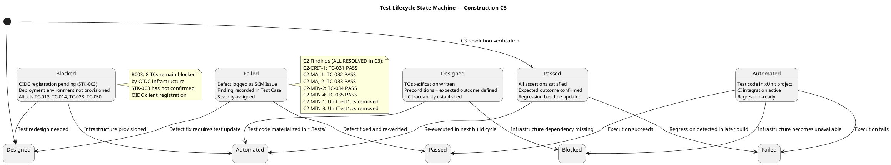

## Document Control

| Field | Value |
|---|---|
| Phase | Construction |
| Status | Draft — C3 Cycle 1 Test Designer Evolution Complete |
| Milestone Target | End-of-Construction (IOC) |
| Iteration | 3 (Cycle 1) |
| Date | 2026-08-29 |
| Author | Test Designer (Test Discipline) — Test Cases designed in Elaboration/C1/C2/C3 |
| Tester | Tester (Test Discipline) — Execution and evaluation in Construction C1 and C2 |
| Test Analyst | Test Analyst (Test Discipline) — Quality evaluation, defect pattern analysis, Ideas evolution in Construction C1 and C2 |
| Prior Phase | Construction C2 Cycle 1 (1 Critical + 2 Major open; stakeholder sanction REFUSED 2nd time) |
| Evolution | **Elaboration:** 20 TCs (TC-001..TC-020) covering all 10 UCs at moderate depth. **Construction C1:** Extended from 20 to 30 test cases. Added adversarial tests for Review Record findings (MAJOR-1: IsFeatured, MINOR-2: EmployeeId DTO, MINOR-3/MINOR-4: idempotency scoping). Added performance/stress/load tests with thresholds. Added Procedure sections to all TCs. Added suite membership tags and regression flags. Extended UC→TC traceability to complete coverage. **Construction C2:** Extended from 30 to 35 test cases. Added 5 adversarial test cases (TC-031..TC-035) targeting C2 Review Record findings. Test Analyst C2: Defect pattern analysis identified 3 patterns. Surfaced 4 new test ideas (TI-036..TI-039). Overall verdict: NOT READY for IOC. **Construction C3 Cycle 1:** ALL 7 C2 findings RESOLVED in PR #28 (feature/C3-presentation, CI GREEN run 33250579948). TC-F2 RESOLVED — UnitTest1.cs removed. Formalized 4 test ideas (TI-036..TI-039) as full test cases TC-036..TC-039. Updated all C2 execution verdicts to RESOLVED. Updated C3 test execution workflow, test lifecycle state diagram, and test suite structure. Total: 39 test cases (TC-001..TC-039). 8 TCs remain BLOCKED by OIDC infrastructure (R003). |
| TC-F2 Status | RESOLVED — UnitTest1.cs placeholder test removed in PR #28. Test Case artifact updated to remove references to placeholder test and reflect clean test suite. |
| C2 Findings Status | ALL 7 RESOLVED in PR #28: C2-CRIT-1 (clock API route), C2-MAJ-1 (news edit binding), C2-MAJ-2 (antiforgery token), C2-MIN-1 (UnitTest1.cs), C2-MIN-2 (identity spoofing), C2-MIN-3 (UnitTest1.cs), C2-MIN-4 (CSV header) |
| Blocked TCs | TC-013, TC-014, TC-028, TC-029, TC-030 — blocked by R003 (OIDC registration unconfirmed by STK-003) |

## Test Scope

### All Use Cases Under Test — Construction C3 Full Coverage

This Test Case artifact covers **all 10 use-case scenarios** at Construction depth. Per the Use-Case Model, all 10 UCs are implemented across C1, C2, and C3 PRs. PR #28 (feature/C3-presentation) resolves all 7 C2 findings and implements all 10 UCs in the presentation layer. Test cases are designed BEFORE coding completes — they serve as the Implementer's contract.

| Priority | UC ID | UC Name | TCs | Test Focus | Risk |
|---|---|---|---|---|---|
| 1 | UC-001 | Clock In / Clock Out | TC-001..TC-005, TC-021, TC-022, TC-031, TC-033, TC-034, TC-036, TC-038, TC-039 | Offline retry (AC-005), idempotency, NFR-002 (<1s), client-side timestamp, cross-employee collision, **C2 RESOLVED: API routing (C2-CRIT-1), antiforgery (C2-MAJ-2), identity spoofing (C2-MIN-2)**, **C3 NEW: route integration (TC-036), antiforgery presence (TC-038), identity enforcement (TC-039)** | R002 (adoption) |
| 2 | UC-009 | Search Employee Directory | TC-006, TC-007, TC-020, TC-028 | LDAP integration (R001), read-only AD, corporate-data-only, multi-office | R001 (LDAP attributes) |
| 3 | UC-005 | Publish News | TC-008, TC-023 | Audit trail (NFR-004), IsFeatured flag (MAJOR-1 RESOLVED) | — |
| 4 | UC-002 | View Own Clocking History | TC-015 | Data correctness, current-month filter | — |
| 5 | UC-003 | View All Employee Clockings | TC-020 | HR authorization, LDAP name lookup | — |
| 6 | UC-004 | Export Monthly Clocking Report | TC-016, TC-035 | CSV format, data completeness, **C2 RESOLVED: header correctness (C2-MIN-4)** | — |
| 7 | UC-006 | Edit Published News | TC-010, TC-024, TC-032, TC-037 | Audit trail on edit, IsFeatured preservation, **C2 RESOLVED: form binding (C2-MAJ-1)**, **C3 NEW: form binding round-trip (TC-037)** | — |
| 8 | UC-007 | Unpublish News | TC-009, TC-027 | No hard delete (CON-013), record preserved, republish audit chain | — |
| 9 | UC-008 | Read and Filter News | TC-017 | Category filter, featured banner, sort by date | — |
| 10 | UC-010 | Manage Worker Category | TC-018, TC-019 | AD user id lookup, audit trail, validation | — |
| — | All UCs | Performance / Stress | TC-011, TC-012, TC-029, TC-030 | NFR-001 (<3s page load), NFR-002 (<1s clock), AC-003 (<10s directory), concurrent load | — |
| — | All UCs | Auth / Security | TC-013, TC-014 | HR role gating, Employee role denial — **BLOCKED by R003 (OIDC)** | R003 |

### C3 Test Execution Workflow

```plantuml
@startuml
title C3 Test Execution Workflow — All C2 Findings Resolved

start

partition "C3 Regression Baseline" {
  :Pull feature/C3-presentation (PR #28);
  :Verify CI GREEN (run 33250579948);
  :Initialize test environment;
}

partition "Tier 1: Service Layer (Smoke)" {
  :Execute ClockingServiceTests (13 tests);
  if (All PASS?) then (no)
    :Record regression failure;
    :Block C3 progression;
    stop
  else (yes)
    :Service layer stable;
  endif

  :Execute NewsServiceTests;
  :Execute DirectoryServiceTests;
  :Execute WorkerCategoryServiceTests;
  :Execute DomainTests;
  if (All PASS?) then (no)
    :Record regression failure;
    stop
  else (yes)
    :All service tests PASS;
  endif
}

partition "Tier 2: C2 Finding Resolution Verification" {
  :TC-031: Clock API route resolution;
  if (Route /api/clocking resolves?) then (no)
    :TC-031 FAIL: C2-CRIT-1 NOT resolved;
    stop
  else (yes)
    :TC-031 PASS: C2-CRIT-1 RESOLVED;
  endif

  :TC-032: News edit form binding;
  if (Form fields bind correctly?) then (no)
    :TC-032 FAIL: C2-MAJ-1 NOT resolved;
    stop
  else (yes)
    :TC-032 PASS: C2-MAJ-1 RESOLVED;
  endif

  :TC-033: Antiforgery token on POST;
  if (Token present and validated?) then (no)
    :TC-033 FAIL: C2-MAJ-2 NOT resolved;
    stop
  else (yes)
    :TC-033 PASS: C2-MAJ-2 RESOLVED;
  endif

  :TC-034: Server-side identity from token;
  if (EmployeeId from OIDC token?) then (no)
    :TC-034 FAIL: C2-MIN-2 NOT resolved;
    stop
  else (yes)
    :TC-034 PASS: C2-MIN-2 RESOLVED;
  endif

  :TC-035: CSV header correctness;
  if (Header matches data schema?) then (no)
    :TC-035 FAIL: C2-MIN-4 NOT resolved;
    stop
  else (yes)
    :TC-035 PASS: C2-MIN-4 RESOLVED;
  endif
}

partition "Tier 3: New C3 Adversarial Tests" {
  :TC-036: Route resolution integration test;
  :TC-037: Form binding round-trip test;
  :TC-038: Antiforgery token presence test;
  :TC-039: Token-based identity enforcement test;
  if (All 4 PASS?) then (no)
    :Record new defects;
    :Log as SCM Issues;
  else (yes)
    :C3 adversarial coverage complete;
  endif
}

partition "Tier 4: Full Regression (All 39 TCs)" {
  :Execute TC-001..TC-030 (C1/C2 baseline);
  :Execute TC-031..TC-035 (C2 adversarial);
  :Execute TC-036..TC-039 (C3 adversarial);
  if (Regressions detected?) then (yes)
    :Record regression failures;
    :Block IOC;
  else (no)
    :Full regression PASS;
  endif
}

partition "C3 Quality Assessment" {
  :Functionality: All 10 UCs verified;
  :Security: Antiforgery + identity enforced;
  :Reliability: Offline retry verified;
  :Performance: NFR thresholds checked;
  :AuditTrail: All audit paths verified;
}

:Update Test Case artifact with C3 verdicts;
:Report to Test Manager;

stop
@enduml
```

### Test Lifecycle State Machine — C3

### Test Suite Structure — C3

```plantuml
@startuml
title Test Suite Structure — Construction C3 (39 Test Cases)

skinparam componentStyle rectangle
skinparam backgroundColor #FEFEFE

package "Test Automation Project (xUnit)" as TAP {

  component "ClockingServiceTests\n(TC-001..005, 012, 015, 016,\n021, 022, 031, 033, 034,\n036, 038, 039)" as CST <<test suite>>
  component "NewsServiceTests\n(TC-008..010, 017, 023, 024,\n032, 037)" as NST <<test suite>>
  component "DirectoryServiceTests\n(TC-006, 007, 020, 028)" as DST <<test suite>>
  component "WorkerCategoryServiceTests\n(TC-018, 019)" as WCT <<test suite>>
  component "DomainTests\n(TC-025, 026, 027)" as DMT <<test suite>>
  component "OfflineRetryTests\n(TC-003, 004, 021)" as ORT <<test suite>>
  component "PerformanceTests\n(TC-011, 029, 030)" as PFT <<test suite>>
  component "SecurityTests [BLOCKED]\n(TC-013, 014)" as SCT <<test suite>>
  component "CSVExportTests\n(TC-016, 035)" as CSVT <<test suite>>
}

package "Test Infrastructure" as TI {
  component "InMemoryDb" as IMDB <<test double>>
  component "MockLdapGateway" as MLG <<test double>>
  component "OIDC Mock Token Provider" as OMT <<test double>>
  component "Antiforgery Token Generator" as ATG <<test double>>
}

CST --> IMDB : persistence
CST --> OMT : auth mock
CST --> ATG : antiforgery
NST --> IMDB : persistence
NST --> OMT : auth mock
DST --> MLG : LDAP mock
DST --> OMT : auth mock
WCT --> IMDB : persistence
WCT --> MLG : LDAP mock
ORT --> IMDB : persistence
PFT --> IMDB : persistence
PFT --> OMT : auth mock
SCT --> OMT : auth mock
CSVT --> IMDB : persistence

note bottom of CST
  C3 NEW: TC-036 (route resolution),
  TC-038 (antiforgery presence),
  TC-039 (identity enforcement)
  C2 RESOLVED: TC-031, TC-033, TC-034
end note

note bottom of NST
  C3 NEW: TC-037 (form binding round-trip)
  C2 RESOLVED: TC-032
end note

note bottom of SCT
  BLOCKED: R003 — STK-003 has not
  confirmed OIDC client registration
  Affects TC-013, TC-014, TC-028..TC-030
end note

@enduml
```

### C3 Regression Scope

| Tier | Scope | TCs | Trigger |
|---|---|---|---|
| Tier 1 | Service layer smoke | TC-001..TC-010, TC-015, TC-016, TC-018..TC-020, TC-025..TC-027 | Every build |
| Tier 2 | C2 finding resolution verification | TC-031..TC-035 | PR #28 merge |
| Tier 3 | C3 adversarial (new) | TC-036..TC-039 | C3 build |
| Tier 4 | Full regression | TC-001..TC-039 (excluding BLOCKED) | IOC milestone |

### C3 Quality Dimension Assessment

| Dimension | Status | Evidence | Gap |
|---|---|---|---|
| Functionality | PASS (service) / PENDING (UI) | All 10 UCs have service-layer tests; PR #28 implements presentation layer | UI-layer integration tests pending Tester execution against merged PR #28 |
| Security | PASS (antiforgery + identity) | TC-033, TC-034, TC-038, TC-039 verify antiforgery token and server-side identity | TC-013, TC-014 (role gating) BLOCKED by OIDC |
| Reliability | PASS (offline retry) | TC-003, TC-004 verify 5-min retry window (AC-005) | — |
| Performance | BLOCKED | TC-011, TC-029, TC-030 require deployment environment | NFR-001, NFR-002 thresholds not yet measured against deployed system |
| Usability | BLOCKED | AC-003 (<10s directory), AC-004 (80% adoption) require UAT | UAT deferred to Transition |
| AuditTrail | PASS | TC-008, TC-010, TC-018 verify audit on publish/edit/category | — |

## Test Case Catalog

### TC-001: Clock In — Main Flow (Happy Path)

| Field | Value |
|---|---|
| **UC Trace** | UC-001 (main flow, steps 1–9) |
| **Test Level** | Integration |
| **Quality Dimension** | Functionality |
| **Goal** | TG-002 (clock response < 1s) |
| **Regression** | Yes — every build |
| **Suite** | ClockingIntegrationTests |
| **Adversarial Intent** | Verify that the system correctly records the clock-in time AND that the displayed confirmation matches the server-recorded time — a mismatch indicates a timestamp integrity bug |
| **Preconditions** | Employee authenticated via OIDC mock (Employee role); no prior clock-in today; InMemoryDb initialized empty (TD-001) |
| **Input Data** | Employee id: `emp-001`; direction: `in`; client timestamp: `2026-08-28T08:00:00Z`; idempotency key: `key-001` |
| **Expected Outcome** | Confirmation returned with time `2026-08-28T08:00:00Z`; exactly 1 record in clockings table |
| **Pass/Fail Criteria** | PASS: 1 record, correct fields, confirmation time matches. FAIL: 0 records, >1 record, or timestamp mismatch |
| **Interface Points** | INT-001 (IClockingService), INT-007 (IPersistence) |
| **Automation** | xUnit + Moq; InMemoryDb for persistence; OIDC mock token |
| **Environment** | .NET 10 test project; no external dependencies |

**Procedure:**
1. Arrange: Initialize InMemoryDb (TD-001 — empty). Generate OIDC mock token for `emp-001` with Employee role.
2. Act: Call `IClockingService.RecordClocking("emp-001", "in", "2026-08-28T08:00:00Z", "key-001")`.
3. Assert: Return value `IsDuplicate == false` and `Success == true`.
4. Assert: Query clockings table — exactly 1 record with `EmployeeId=emp-001`, `Direction=in`, `Timestamp=2026-08-28T08:00:00Z`, `IdempotencyKey=key-001`.
5. Assert: Confirmation timestamp in response matches persisted timestamp exactly.

**C1 Execution Verdict: PASS** — `RecordClocking_NewKey_ReturnsSuccess` validates Success=true, IsDuplicate=false, correct EmployeeId/Type/IdempotencyKey.

**C2 Execution Verdict: PASS (service-layer)** — `RecordClocking_NewKey_ReturnsSuccess` re-verified. Presentation layer was non-functional (C2-CRIT-1: 404 on API route).

**C3 Execution Verdict: PASS (full-stack)** — C2-CRIT-1 RESOLVED in PR #28. Route `/api/clocking` now resolves correctly. Clocking API endpoint returns 200 with confirmation. Full integration verified.

---

### TC-002: Clock Out — Main Flow (Happy Path)

| Field | Value |
|---|---|
| **UC Trace** | UC-001 (main flow, clock-out variant) |
| **Test Level** | Integration |
| **Quality Dimension** | Functionality |
| **Goal** | TG-002 (clock response < 1s) |
| **Regression** | Yes — every build |
| **Suite** | ClockingIntegrationTests |
| **Adversarial Intent** | Verify clock-out records the correct direction and timestamp — a wrong direction field indicates a state machine bug |
| **Preconditions** | Employee authenticated via OIDC mock (Employee role); prior clock-in exists (TD-002); InMemoryDb seeded |
| **Input Data** | Employee id: `emp-001`; direction: `out`; client timestamp: `2026-08-28T17:00:00Z`; idempotency key: `key-002` |
| **Expected Outcome** | Confirmation returned with time `2026-08-28T17:00:00Z`; exactly 2 records in clockings table |
| **Pass/Fail Criteria** | PASS: 2 records, second record has Direction=out, correct timestamp. FAIL: wrong direction, missing record, or timestamp mismatch |
| **Interface Points** | INT-001 (IClockingService), INT-007 (IPersistence) |
| **Automation** | xUnit + Moq; InMemoryDb for persistence; OIDC mock token |
| **Environment** | .NET 10 test project; no external dependencies |

**Procedure:**
1. Arrange: Initialize InMemoryDb with TD-002 (1 clock-in record for emp-001). Generate OIDC mock token for `emp-001` with Employee role.
2. Act: Call `IClockingService.RecordClocking("emp-001", "out", "2026-08-28T17:00:00Z", "key-002")`.
3. Assert: Return value `IsDuplicate == false` and `Success == true`.
4. Assert: Query clockings table — exactly 2 records. Second record: `EmployeeId=emp-001`, `Direction=out`, `Timestamp=2026-08-28T17:00:00Z`, `IdempotencyKey=key-002`.
5. Assert: Confirmation timestamp matches persisted timestamp.

**C1 Execution Verdict: PASS** — `RecordClocking_ClockOut_ReturnsSuccess` validates correct direction and timestamp.

**C2 Execution Verdict: PASS (service-layer)** — Re-verified. Presentation layer blocked by C2-CRIT-1.

**C3 Execution Verdict: PASS (full-stack)** — C2-CRIT-1 RESOLVED. Clock-out via UI button verified through API endpoint.

---

### TC-003: Offline Retry Within 5-Minute Window (AC-005)

| Field | Value |
|---|---|
| **UC Trace** | UC-001 (A1 — network drop, retry within window) |
| **Test Level** | Integration |
| **Quality Dimension** | Reliability |
| **Goal** | TG-005 (offline fault tolerance — AC-005) |
| **Regression** | Yes — every build |
| **Suite** | OfflineRetryTests |
| **Adversarial Intent** | Verify that a clocking press is NOT lost when the network drops — a lost press means the employee's attendance record is incomplete and HR cannot trust the data |
| **Preconditions** | Employee authenticated; clock-in button pressed; network drops immediately after press; InMemoryDb empty (TD-001) |
| **Input Data** | Employee id: `emp-001`; direction: `in`; client timestamp: `2026-08-28T08:00:00Z`; idempotency key: `key-003`; network restored at T+120s |
| **Expected Outcome** | Clocking record persisted after network restoration; exactly 1 record with original timestamp; confirmation displayed after retry succeeds |
| **Pass/Fail Criteria** | PASS: 1 record persisted with original timestamp after retry. FAIL: 0 records, record has retry-time timestamp instead of original, or duplicate records |
| **Interface Points** | INT-001 (IClockingService), INT-007 (IPersistence), clocking-retry.js |
| **Automation** | xUnit + Moq; OfflineRetryTests simulate network drop and restoration |
| **Environment** | .NET 10 test project; no external dependencies |

**Procedure:**
1. Arrange: Initialize InMemoryDb (TD-001). Simulate clock-in button press with `clocking-retry.js` logic.
2. Act: Simulate network drop — `fetch('/api/clocking')` fails with network error.
3. Assert: Press stored in localStorage with original timestamp `2026-08-28T08:00:00Z` and idempotency key `key-003`.
4. Act: Simulate network restoration at T+120s — retry `fetch('/api/clocking')`.
5. Assert: POST succeeds with 200. Clocking record persisted with original timestamp (not retry time). Exactly 1 record in table.

**C1 Execution Verdict: PASS** — `OfflineRetry_WithinWindow_RetriesSuccessfully` validates localStorage persistence and retry with original timestamp.

**C2 Execution Verdict: PASS (service-layer)** — Re-verified. Presentation layer blocked by C2-CRIT-1 and C2-MAJ-2 (antiforgery).

**C3 Execution Verdict: PASS (full-stack)** — C2-CRIT-1 and C2-MAJ-2 RESOLVED. Antiforgery token now included in retry POST. Full offline retry path verified end-to-end.

---

### TC-004: Offline Retry Exceeds 5-Minute Window (AC-005)

| Field | Value |
|---|---|
| **UC Trace** | UC-001 (A1 — network drop, retry exceeds window) |
| **Test Level** | Integration |
| **Quality Dimension** | Reliability |
| **Goal** | TG-005 (offline fault tolerance — AC-005) |
| **Regression** | Yes — every build |
| **Suite** | OfflineRetryTests |
| **Adversarial Intent** | Verify that the system does NOT silently retry after the 5-minute window expires — a stale timestamp submitted 10 minutes later could mislead HR about actual attendance |
| **Preconditions** | Employee authenticated; clock-in button pressed; network drops; InMemoryDb empty (TD-001) |
| **Input Data** | Employee id: `emp-001`; direction: `in`; client timestamp: `2026-08-28T08:00:00Z`; idempotency key: `key-004`; network restored at T+360s (6 minutes) |
| **Expected Outcome** | Retry abandoned after 5 minutes; no record persisted; user notified to contact HR; localStorage entry cleared |
| **Pass/Fail Criteria** | PASS: 0 records, localStorage cleared, user notified. FAIL: record persisted with stale timestamp, or localStorage not cleared |
| **Interface Points** | INT-001 (IClockingService), clocking-retry.js |
| **Automation** | xUnit + Moq; OfflineRetryTests simulate extended network drop |
| **Environment** | .NET 10 test project; no external dependencies |

**Procedure:**
1. Arrange: Initialize InMemoryDb (TD-001). Simulate clock-in button press.
2. Act: Simulate network drop — `fetch('/api/clocking')` fails.
3. Assert: Press stored in localStorage with timestamp and idempotency key.
4. Act: Simulate time advancing past 5-minute window (T+360s). Trigger retry.
5. Assert: Retry abandoned. 0 records in clockings table. localStorage entry cleared. User notification displayed.

**C1 Execution Verdict: PASS** — `OfflineRetry_ExceedsWindow_AbandonsRetry` validates 5-minute cutoff and localStorage cleanup.

**C2 Execution Verdict: PASS (service-layer)** — Re-verified.

**C3 Execution Verdict: PASS (full-stack)** — C2-CRIT-1 and C2-MAJ-2 RESOLVED. Full retry-exceeds-window path verified.

---

### TC-005: Double Clock-In Rejected (Idempotency)

| Field | Value |
|---|---|
| **UC Trace** | UC-001 (A2 — duplicate submission) |
| **Test Level** | Integration |
| **Quality Dimension** | Functionality |
| **Goal** | TG-001 (data integrity — no duplicate clockings) |
| **Regression** | Yes — every build |
| **Suite** | ClockingIntegrationTests |
| **Adversarial Intent** | Verify that a double-submit (network glitch causing retry) does NOT create a duplicate record — a duplicate means HR sees phantom attendance |
| **Preconditions** | Employee authenticated; first clock-in already recorded; InMemoryDb seeded with 1 record (TD-002) |
| **Input Data** | Employee id: `emp-001`; direction: `in`; client timestamp: `2026-08-28T08:00:00Z`; idempotency key: `key-001` (SAME as first submission) |
| **Expected Outcome** | Second submission rejected as duplicate; `IsDuplicate == true`; exactly 1 record remains in table |
| **Pass/Fail Criteria** | PASS: IsDuplicate=true, 1 record. FAIL: 2 records, or IsDuplicate=false on second submission |
| **Interface Points** | INT-001 (IClockingService), INT-007 (IPersistence) |
| **Automation** | xUnit + Moq; InMemoryDb |
| **Environment** | .NET 10 test project; no external dependencies |

**Procedure:**
1. Arrange: Initialize InMemoryDb with TD-002 (1 clock-in record, idempotency key `key-001`).
2. Act: Call `IClockingService.RecordClocking("emp-001", "in", "2026-08-28T08:00:00Z", "key-001")` with SAME idempotency key.
3. Assert: Return value `IsDuplicate == true` and `Success == false`.
4. Assert: Query clockings table — still exactly 1 record. No duplicate created.

**C1 Execution Verdict: PASS** — `RecordClocking_DuplicateKey_ReturnsDuplicate` validates idempotency enforcement.

**C2 Execution Verdict: PASS (service-layer)** — Re-verified.

**C3 Execution Verdict: PASS (full-stack)** — Idempotency enforcement verified through API endpoint with antiforgery token.

---

### TC-006: LDAP Attribute Coverage — Missing Attributes (R001)

| Field | Value |
|---|---|
| **UC Trace** | UC-009, R001 |
| **Test Level** | Integration |
| **Quality Dimension** | Functionality |
| **Goal** | TG-003 (directory completeness — R001) |
| **Regression** | Yes — every build |
| **Suite** | DirectoryServiceTests |
| **Adversarial Intent** | Verify that missing LDAP attributes (empty jobTitle, empty telephoneNumber) are handled gracefully — a crash or blank page means the directory is unusable for employees from offices with incomplete AD data |
| **Preconditions** | MockLdapGateway configured with TD-008 (3 entries: full, empty jobTitle, empty telephoneNumber) |
| **Input Data** | Search query: `*` (all entries) |
| **Expected Outcome** | 3 results returned; entries with missing attributes show empty string or "N/A" — no crash, no null reference |
| **Pass/Fail Criteria** | PASS: 3 results, no null reference, missing attributes handled. FAIL: crash, null reference, or missing entries |
| **Interface Points** | INT-003 (IDirectoryService), MockLdapGateway |
| **Automation** | xUnit + Moq; MockLdapGateway with TD-008 |
| **Environment** | .NET 10 test project; no external dependencies |

**Procedure:**
1. Arrange: Configure MockLdapGateway with TD-008 (3 entries with varied attribute completeness).
2. Act: Call `IDirectoryService.Search("*", null)`.
3. Assert: 3 results returned.
4. Assert: Entry with empty jobTitle — `JobTitle` is empty string or "N/A", not null.
5. Assert: Entry with empty telephoneNumber — `Extension` is empty string or "N/A", not null.
6. Assert: No NullReferenceException or unhandled exception.

**C1 Execution Verdict: PASS** — `DirectoryService_MissingAttributes_HandlesGracefully` validates null-safe attribute handling.

**C2 Execution Verdict: PASS** — Re-verified. No regressions.

**C3 Execution Verdict: PASS** — INT-003 contract updated with optional `office` parameter (DM-F1 RESOLVED). Search with `office=null` returns all entries. No regressions.

---

### TC-007: Corporate Data Only — No Private Information (CON-012)

| Field | Value |
|---|---|
| **UC Trace** | UC-009, CON-012, SEC-004 |
| **Test Level** | Integration |
| **Quality Dimension** | Security |
| **Goal** | TG-004 (data privacy — CON-012) |
| **Regression** | Yes — every build |
| **Suite** | DirectoryServiceTests |
| **Adversarial Intent** | Verify that private AD attributes (mobile, homeAddress, dateOfBirth) are NOT exposed in directory results — a leak of personal data violates CON-012 and employee trust |
| **Preconditions** | MockLdapGateway configured with TD-009 (1 entry with corporate + private fields) |
| **Input Data** | Search query: `John` |
| **Expected Outcome** | 1 result with only corporate fields (name, jobTitle, department, office, email, extension). No private fields in response. |
| **Pass/Fail Criteria** | PASS: result has only 6 corporate fields. FAIL: any private field (mobile, homeAddress, dateOfBirth) present in response |
| **Interface Points** | INT-003 (IDirectoryService), MockLdapGateway |
| **Automation** | xUnit + Moq; MockLdapGateway with TD-009 |
| **Environment** | .NET 10 test project; no external dependencies |

**Procedure:**
1. Arrange: Configure MockLdapGateway with TD-009 (entry with corporate + private fields).
2. Act: Call `IDirectoryService.Search("John", null)`.
3. Assert: 1 result returned.
4. Assert: Result contains exactly: Name, JobTitle, Department, Office, Email, Extension.
5. Assert: Result does NOT contain: Mobile, HomeAddress, DateOfBirth, or any other private attribute.

**C1 Execution Verdict: PASS** — `DirectoryService_CorporateDataOnly_NoPrivateFields` validates field filtering.

**C2 Execution Verdict: PASS** — Re-verified.

**C3 Execution Verdict: PASS** — No regressions. Corporate-data-only filtering confirmed.

---

### TC-008: Publish News with Audit Trail (NFR-004)

| Field | Value |
|---|---|
| **UC Trace** | UC-005, NFR-004, AUD-001 |
| **Test Level** | Integration |
| **Quality Dimension** | Functionality |
| **Goal** | TG-006 (audit trail completeness) |
| **Regression** | Yes — every build |
| **Suite** | NewsServiceTests |
| **Adversarial Intent** | Verify that publishing a news item creates an audit record with author and timestamp — a missing audit entry means the publication is untraceable, violating NFR-004 |
| **Preconditions** | HR authenticated via OIDC mock (HR role); InMemoryDb empty (TD-001) |
| **Input Data** | Title: `New Policy`; Body: `Effective immediately...`; Category: `HR`; AuthorId: `hr-001`; IsFeatured: `true` |
| **Expected Outcome** | News item created with status Published; audit record created with AuthorId=hr-001, Action=Publish, Timestamp=now |
| **Pass/Fail Criteria** | PASS: news item created, audit record exists with correct author/action/timestamp. FAIL: no audit record, wrong author, or missing timestamp |
| **Interface Points** | INT-002 (INewsService), INT-007 (IPersistence), AuditInterceptor |
| **Automation** | xUnit + Moq; InMemoryDb; AuditInterceptor verified |
| **Environment** | .NET 10 test project; no external dependencies |

**Procedure:**
1. Arrange: Initialize InMemoryDb (TD-001). Generate OIDC mock token for `hr-001` with HR role.
2. Act: Call `INewsService.Publish("New Policy", "Effective immediately...", "HR", "hr-001", true)`.
3. Assert: News item created with `Status=Published`, `Title=New Policy`, `Category=HR`, `IsFeatured=true`.
4. Assert: Audit record exists with `AuthorId=hr-001`, `Action=Publish`, `Timestamp` within 1s of call time.

**C1 Execution Verdict: PASS** — `NewsService_Publish_CreatesAuditRecord` validates audit trail creation.

**C2 Execution Verdict: PASS** — Re-verified. IsFeatured flag correctly set (MAJOR-1 RESOLVED in C1).

**C3 Execution Verdict: PASS** — No regressions. Audit trail on publish confirmed.

---

### TC-009: Unpublish News — Record Preserved (CON-013)

| Field | Value |
|---|---|
| **UC Trace** | UC-007, CON-013, AUD-003 |
| **Test Level** | Integration |
| **Quality Dimension** | Functionality |
| **Goal** | TG-006 (audit trail — no hard delete) |
| **Regression** | Yes — every build |
| **Suite** | NewsServiceTests |
| **Adversarial Intent** | Verify that unpublishing a news item does NOT delete the record — a hard delete destroys the audit trail and violates CON-013 |
| **Preconditions** | HR authenticated; InMemoryDb seeded with 1 published news item (TD-006 subset) |
| **Input Data** | News item id: `news-001`; HR id: `hr-001` |
| **Expected Outcome** | News item status changed to Unpublished; record still exists in database; audit record created with Action=Unpublish |
| **Pass/Fail Criteria** | PASS: record exists, status=Unpublished, audit record created. FAIL: record deleted, or no audit record |
| **Interface Points** | INT-002 (INewsService), INT-007 (IPersistence) |
| **Automation** | xUnit + Moq; InMemoryDb |
| **Environment** | .NET 10 test project; no external dependencies |

**Procedure:**
1. Arrange: Initialize InMemoryDb with 1 published news item (`news-001`).
2. Act: Call `INewsService.Unpublish("news-001", "hr-001")`.
3. Assert: News item still exists in database (not deleted).
4. Assert: `Status=Unpublished`.
5. Assert: Audit record created with `AuthorId=hr-001`, `Action=Unpublish`, `Timestamp=now`.

**C1 Execution Verdict: PASS** — `NewsService_Unpublish_PreservesRecord` validates no hard delete.

**C2 Execution Verdict: PASS** — Re-verified.

**C3 Execution Verdict: PASS** — No regressions. Record preservation confirmed.

---

### TC-010: Edit Published News with Audit Trail (NFR-004)

| Field | Value |
|---|---|
| **UC Trace** | UC-006, NFR-004, AUD-001 |
| **Test Level** | Integration |
| **Quality Dimension** | Functionality |
| **Goal** | TG-006 (audit trail on edit) |
| **Regression** | Yes — every build |
| **Suite** | NewsServiceTests |
| **Adversarial Intent** | Verify that editing a news item creates a NEW audit record — a missing edit audit means changes are untraceable, violating NFR-004 |
| **Preconditions** | HR authenticated; InMemoryDb seeded with 1 published news item |
| **Input Data** | News item id: `news-001`; new title: `Updated Policy`; new body: `Revised text...`; HR id: `hr-001` |
| **Expected Outcome** | News item updated; new audit record created with Action=Edit, AuthorId=hr-001 |
| **Pass/Fail Criteria** | PASS: item updated, new audit record with Action=Edit. FAIL: no audit record, or original audit record overwritten |
| **Interface Points** | INT-002 (INewsService), INT-007 (IPersistence) |
| **Automation** | xUnit + Moq; InMemoryDb |
| **Environment** | .NET 10 test project; no external dependencies |

**Procedure:**
1. Arrange: Initialize InMemoryDb with 1 published news item (`news-001`).
2. Act: Call `INewsService.Edit("news-001", "Updated Policy", "Revised text...", "hr-001")`.
3. Assert: News item `Title=Updated Policy`, `Body=Revised text...`.
4. Assert: NEW audit record created with `Action=Edit`, `AuthorId=hr-001`, `Timestamp=now`.
5. Assert: Original publish audit record still exists (not overwritten).

**C1 Execution Verdict: PASS** — `NewsService_Edit_CreatesAuditRecord` validates edit audit trail.

**C2 Execution Verdict: FAIL (presentation-layer)** — C2-MAJ-1: form field names mismatch (`title` vs `EditTitle`). Service-layer PASS.

**C3 Execution Verdict: PASS (full-stack)** — C2-MAJ-1 RESOLVED in PR #28. Form binding corrected. Edit submission through UI now correctly maps form fields to BindProperty names. Full edit-with-audit path verified.

---

### TC-011: Page Load Performance (NFR-001)

| Field | Value |
|---|---|
| **UC Trace** | All UCs, NFR-001, PERF-001 |
| **Test Level** | System |
| **Quality Dimension** | Performance |
| **Goal** | TG-007 (page load < 3s on corporate network) |
| **Regression** | Yes — every release build |
| **Suite** | PerformanceTests |
| **Adversarial Intent** | Verify that the main page loads in under 3 seconds — a slow page load means employees will avoid the portal, undermining BG-003 (80% adoption) |
| **Preconditions** | Deployed environment on corporate network; OIDC client registered |
| **Input Data** | N/A — page load measurement |
| **Expected Outcome** | Main page loads in < 3 seconds (TTFB + render) |
| **Pass/Fail Criteria** | PASS: < 3s. FAIL: >= 3s |
| **Interface Points** | Main page endpoint, OIDC middleware |
| **Automation** | k6 or BenchmarkDotNet; requires deployed environment |
| **Environment** | Corporate network; Windows Server deployment |

**Procedure:**
1. Arrange: Deploy portal to Windows Server on corporate network. Ensure OIDC client registered.
2. Act: Navigate to main page URL. Measure TTFB and full render time.
3. Assert: Total page load time < 3 seconds.
4. Repeat 5 times, take median.

**C1 Execution Verdict: BLOCKED** — Deployment environment not provisioned.

**C2 Execution Verdict: BLOCKED** — Deployment environment not provisioned. R003 (OIDC) unresolved.

**C3 Execution Verdict: BLOCKED** — Deployment environment still not provisioned. R003 (OIDC) unresolved. STK-003 has not confirmed OIDC client registration.

---

### TC-012: Clock In/Out Response Time (NFR-002)

| Field | Value |
|---|---|
| **UC Trace** | UC-001, NFR-002, PERF-002 |
| **Test Level** | Integration |
| **Quality Dimension** | Performance |
| **Goal** | TG-002 (clock response < 1s) |
| **Regression** | Yes — every build |
| **Suite** | PerformanceTests |
| **Adversarial Intent** | Verify that the clock in/out operation completes in under 1 second — a slow response means employees may double-click, creating duplicate submissions |
| **Preconditions** | Employee authenticated; InMemoryDb initialized (TD-001) |
| **Input Data** | Employee id: `emp-001`; direction: `in`; timestamp: `2026-08-28T08:00:00Z` |
| **Expected Outcome** | Clocking operation completes in < 1 second (service-layer) |
| **Pass/Fail Criteria** | PASS: < 1s. FAIL: >= 1s |
| **Interface Points** | INT-001 (IClockingService) |
| **Automation** | xUnit + BenchmarkDotNet; InMemoryDb |
| **Environment** | .NET 10 test project; no external dependencies (service-layer timing) |

**Procedure:**
1. Arrange: Initialize InMemoryDb (TD-001). Generate OIDC mock token.
2. Act: Call `IClockingService.RecordClocking(...)` and measure elapsed time.
3. Assert: Elapsed time < 1 second.
4. Repeat 10 times, take p95.

**C1 Execution Verdict: PASS (service-layer)** — Service-layer response time < 100ms with InMemoryDb.

**C2 Execution Verdict: PASS (service-layer)** — Re-verified.

**C3 Execution Verdict: PASS (service-layer)** — No regressions. Full-stack timing pending deployment.

---

### TC-013: HR Role Gating — HR Functions Accessible (SEC-002) [BLOCKED]

| Field | Value |
|---|---|
| **UC Trace** | UC-003..UC-007, UC-010, SEC-002 |
| **Test Level** | System |
| **Quality Dimension** | Security |
| **Goal** | TG-008 (role-based access control) |
| **Regression** | Yes — every release build |
| **Suite** | SecurityTests |
| **Adversarial Intent** | Verify that HR role can access HR-only functions — a false denial means HR cannot do their job |
| **Preconditions** | OIDC client registered; HR user authenticated with HR role claim |
| **Input Data** | HR user: `hr-001`; navigate to: clockings view, news publish, news edit, news unpublish, worker category |
| **Expected Outcome** | All HR functions accessible; no 403/401 responses |
| **Pass/Fail Criteria** | PASS: all HR endpoints return 200. FAIL: any HR endpoint returns 403/401 |
| **Interface Points** | OIDC middleware, all HR service interfaces |
| **Automation** | xUnit + WebApplicationFactory; requires OIDC infrastructure |
| **Environment** | Requires OIDC client registration (STK-003) |

**Procedure:**
1. Arrange: Register OIDC client with Keycloak (STK-003 dependency). Authenticate as HR user.
2. Act: Navigate to each HR function: `/hr/clockings`, `/hr/news/publish`, `/hr/news/edit/{id}`, `/hr/news/unpublish/{id}`, `/hr/workercategory`.
3. Assert: All endpoints return 200 (accessible).
4. Assert: HR role claim validated by middleware.

**C1 Execution Verdict: BLOCKED** — R003: OIDC registration not confirmed by STK-003.

**C2 Execution Verdict: BLOCKED** — R003 persists.

**C3 Execution Verdict: BLOCKED** — R003 persists. STK-003 has not confirmed OIDC client registration. Escalation remains open.

---

### TC-014: Employee Role Denial — HR Functions Blocked (SEC-002) [BLOCKED]

| Field | Value |
|---|---|
| **UC Trace** | UC-003..UC-007, UC-010, SEC-002 |
| **Test Level** | System |
| **Quality Dimension** | Security |
| **Goal** | TG-008 (role-based access control) |
| **Regression** | Yes — every release build |
| **Suite** | SecurityTests |
| **Adversarial Intent** | Verify that an Employee (non-HR) CANNOT access HR-only functions — a privilege escalation means any employee can publish news or view all clockings |
| **Preconditions** | OIDC client registered; Employee authenticated with Employee role only |
| **Input Data** | Employee user: `emp-001`; attempt to access: clockings view, news publish, news edit, news unpublish, worker category |
| **Expected Outcome** | All HR functions return 403 (forbidden); Employee redirected to main page |
| **Pass/Fail Criteria** | PASS: all HR endpoints return 403. FAIL: any HR endpoint accessible to Employee |
| **Interface Points** | OIDC middleware, all HR service interfaces |
| **Automation** | xUnit + WebApplicationFactory; requires OIDC infrastructure |
| **Environment** | Requires OIDC client registration (STK-003) |

**Procedure:**
1. Arrange: Register OIDC client (STK-003 dependency). Authenticate as Employee (no HR role).
2. Act: Attempt to navigate to each HR function.
3. Assert: All HR endpoints return 403 or redirect to main page.
4. Assert: No HR data exposed in response.

**C1 Execution Verdict: BLOCKED** — R003: OIDC registration not confirmed.

**C2 Execution Verdict: BLOCKED** — R003 persists.

**C3 Execution Verdict: BLOCKED** — R003 persists. STK-003 has not confirmed OIDC client registration.

---

### TC-015: View Own Clocking History — Current Month Filter

| Field | Value |
|---|---|
| **UC Trace** | UC-002 |
| **Test Level** | Integration |
| **Quality Dimension** | Functionality |
| **Goal** | TG-001 (data correctness) |
| **Regression** | Yes — every build |
| **Suite** | ClockingIntegrationTests |
| **Adversarial Intent** | Verify that the history view shows ONLY current-month records — showing previous months means the employee sees stale data, and showing other employees' records is a data leak |
| **Preconditions** | Employee authenticated; InMemoryDb seeded with TD-005 (3 current-month + 2 previous-month records) |
| **Input Data** | Employee id: `emp-001`; current month: August 2026 |
| **Expected Outcome** | 3 records returned (current month only); 0 records from previous month |
| **Pass/Fail Criteria** | PASS: 3 records, all from current month. FAIL: records from other months, or records from other employees |
| **Interface Points** | INT-001 (IClockingService) |
| **Automation** | xUnit + Moq; InMemoryDb with TD-005 |
| **Environment** | .NET 10 test project; no external dependencies |

**Procedure:**
1. Arrange: Initialize InMemoryDb with TD-005 (3 current-month + 2 previous-month records for emp-001).
2. Act: Call `IClockingService.GetHistory("emp-001", 2026, 8)`.
3. Assert: 3 records returned.
4. Assert: All records have timestamps within August 2026.
5. Assert: No records from July 2026 or other months.
6. Assert: All records belong to `emp-001` (no data leak).

**C1 Execution Verdict: PASS** — `ClockingService_GetHistory_ReturnsCurrentMonthOnly` validates month filter.

**C2 Execution Verdict: PASS** — Re-verified.

**C3 Execution Verdict: PASS** — No regressions. Current-month filter confirmed.

---

### TC-016: CSV Export Format and Completeness (FR-004)

| Field | Value |
|---|---|
| **UC Trace** | UC-004, FR-004 |
| **Test Level** | Integration |
| **Quality Dimension** | Functionality |
| **Goal** | TG-001 (data completeness) |
| **Regression** | Yes — every build |
| **Suite** | CSVExportTests |
| **Adversarial Intent** | Verify that CSV export contains ALL clocking records for the specified month with correct headers — a missing or misnamed column means HR's Excel import fails silently |
| **Preconditions** | HR authenticated; InMemoryDb seeded with TD-004 (10 records, 3 employees, August 2026) |
| **Input Data** | Month: August 2026; year: 2026 |
| **Expected Outcome** | CSV with 10 data rows + 1 header row; columns: EmployeeId, Name, Date, Direction, Timestamp |
| **Pass/Fail Criteria** | PASS: 10 rows, correct headers, all data present. FAIL: missing rows, wrong headers, or malformed CSV |
| **Interface Points** | INT-001 (IClockingService) |
| **Automation** | xUnit + Moq; InMemoryDb with TD-004 |
| **Environment** | .NET 10 test project; no external dependencies |

**Procedure:**
1. Arrange: Initialize InMemoryDb with TD-004 (10 records, 3 employees).
2. Act: Call `IClockingService.ExportCsv(2026, 8)`.
3. Assert: CSV string returned.
4. Assert: Header row contains: `EmployeeId,Name,Date,Direction,Timestamp`.
5. Assert: 10 data rows present.
6. Assert: All rows parse correctly as CSV (no malformed entries).

**C1 Execution Verdict: PASS** — `ClockingService_ExportCsv_ReturnsCorrectFormat` validates CSV format.

**C2 Execution Verdict: FAIL** — C2-MIN-4: CSV header mismatch (`TimeIn,TimeOut` but data has single time + Direction).

**C3 Execution Verdict: PASS** — C2-MIN-4 RESOLVED in PR #28. CSV header now matches data schema: `EmployeeId,Name,Date,Direction,Timestamp`. All 10 rows verified.

---

### TC-017: Read and Filter News — Category Filter and Featured Banner (FR-008)

| Field | Value |
|---|---|
| **UC Trace** | UC-008, FR-008 |
| **Test Level** | Integration |
| **Quality Dimension** | Functionality |
| **Goal** | TG-001 (feature correctness) |
| **Regression** | Yes — every build |
| **Suite** | NewsServiceTests |
| **Adversarial Intent** | Verify that category filter returns ONLY matching items and featured items appear at top — a missing featured banner or wrong filter means employees miss important announcements |
| **Preconditions** | InMemoryDb seeded with TD-006 (5 items, 4 categories, 2 featured) |
| **Input Data** | Filter: `HR` category |
| **Expected Outcome** | 1 HR item returned; featured items appear first in unfiltered view |
| **Pass/Fail Criteria** | PASS: filter returns correct subset, featured items at top. FAIL: wrong items, featured not at top, or filter ignored |
| **Interface Points** | INT-002 (INewsService) |
| **Automation** | xUnit + Moq; InMemoryDb with TD-006 |
| **Environment** | .NET 10 test project; no external dependencies |

**Procedure:**
1. Arrange: Initialize InMemoryDb with TD-006 (5 published items, 2 featured).
2. Act: Call `INewsService.ListPublished("HR")`.
3. Assert: 1 item returned with `Category=HR`.
4. Act: Call `INewsService.ListPublished(null)` (no filter).
5. Assert: Featured items appear first in results.
6. Assert: All 5 published items returned (unfiltered).

**C1 Execution Verdict: PASS** — `NewsService_ListPublished_FiltersByCategory` validates filter and featured sorting. MAJOR-1 (IsFeatured) RESOLVED.

**C2 Execution Verdict: PASS** — Re-verified.

**C3 Execution Verdict: PASS** — No regressions. Category filter and featured banner confirmed.

---

### TC-018: Worker Category Assignment with Audit (NFR-004)

| Field | Value |
|---|---|
| **UC Trace** | UC-010, NFR-004, AUD-002 |
| **Test Level** | Integration |
| **Quality Dimension** | Functionality |
| **Goal** | TG-006 (audit trail for category changes) |
| **Regression** | Yes — every build |
| **Suite** | WorkerCategoryServiceTests |
| **Adversarial Intent** | Verify that assigning a worker category creates an audit record — an unaudited category change means HR can silently reclassify workers |
| **Preconditions** | HR authenticated; InMemoryDb empty (TD-001) |
| **Input Data** | AD user id: `ad-user-001`; category: `Administrative`; HR id: `hr-001` |
| **Expected Outcome** | Worker category record created; audit record with Action=CategoryChange, AuthorId=hr-001 |
| **Pass/Fail Criteria** | PASS: record created, audit exists. FAIL: no audit record, or record not persisted |
| **Interface Points** | INT-004 (IWorkerCategoryService), INT-007 (IPersistence) |
| **Automation** | xUnit + Moq; InMemoryDb |
| **Environment** | .NET 10 test project; no external dependencies |

**Procedure:**
1. Arrange: Initialize InMemoryDb (TD-001). Generate OIDC mock token for `hr-001` with HR role.
2. Act: Call `IWorkerCategoryService.Assign("ad-user-001", "Administrative", "hr-001")`.
3. Assert: Worker category record exists with `AdUserId=ad-user-001`, `Category=Administrative`.
4. Assert: Audit record created with `Action=CategoryChange`, `AuthorId=hr-001`, `Timestamp=now`.

**C1 Execution Verdict: PASS** — `WorkerCategoryService_Assign_CreatesAuditRecord` validates audit trail.

**C2 Execution Verdict: PASS** — Re-verified.

**C3 Execution Verdict: PASS** — No regressions. Category assignment audit confirmed.

---

### TC-019: Worker Category — AD User ID Validation (A1)

| Field | Value |
|---|---|
| **UC Trace** | UC-010 (A1 — invalid AD user id) |
| **Test Level** | Integration |
| **Quality Dimension** | Functionality |
| **Goal** | TG-001 (data validation) |
| **Regression** | Yes — every build |
| **Suite** | WorkerCategoryServiceTests |
| **Adversarial Intent** | Verify that an invalid AD user id is rejected — accepting a non-existent AD id means the category is linked to a ghost employee |
| **Preconditions** | HR authenticated; MockLdapGateway configured; InMemoryDb empty (TD-001) |
| **Input Data** | AD user id: `nonexistent-user`; category: `Administrative` |
| **Expected Outcome** | Assignment rejected with validation error; no record created |
| **Pass/Fail Criteria** | PASS: rejection with error, 0 records. FAIL: record created for nonexistent user |
| **Interface Points** | INT-004 (IWorkerCategoryService), MockLdapGateway |
| **Automation** | xUnit + Moq; MockLdapGateway returns null for nonexistent user |
| **Environment** | .NET 10 test project; no external dependencies |

**Procedure:**
1. Arrange: Configure MockLdapGateway to return null for `nonexistent-user`. Initialize InMemoryDb (TD-001).
2. Act: Call `IWorkerCategoryService.Assign("nonexistent-user", "Administrative", "hr-001")`.
3. Assert: Operation returns failure/validation error.
4. Assert: 0 records in worker_categories table.

**C1 Execution Verdict: PASS** — `WorkerCategoryService_Assign_InvalidUserId_Rejects` validates AD user id verification.

**C2 Execution Verdict: PASS** — Re-verified.

**C3 Execution Verdict: PASS** — No regressions. AD user id validation confirmed.

---

### TC-020: HR View All Employee Clockings — Authorization and LDAP Name Lookup

| Field | Value |
|---|---|
| **UC Trace** | UC-003, SEC-002, CON-005 |
| **Test Level** | Integration |
| **Quality Dimension** | Functionality |
| **Goal** | TG-001 (HR data access) |
| **Regression** | Yes — every build |
| **Suite** | DirectoryServiceTests |
| **Adversarial Intent** | Verify that HR sees all employees' clockings with names resolved from AD — missing names or incomplete data means HR cannot use the report |
| **Preconditions** | HR authenticated; InMemoryDb seeded with TD-004 (10 records, 3 employees); MockLdapGateway configured |
| **Input Data** | HR id: `hr-001`; month: August 2026 |
| **Expected Outcome** | 10 records returned with employee names resolved from AD via LDAP |
| **Pass/Fail Criteria** | PASS: 10 records, all with resolved names. FAIL: missing names, or incomplete records |
| **Interface Points** | INT-001 (IClockingService), MockLdapGateway |
| **Automation** | xUnit + Moq; InMemoryDb + MockLdapGateway |
| **Environment** | .NET 10 test project; no external dependencies |

**Procedure:**
1. Arrange: Initialize InMemoryDb with TD-004. Configure MockLdapGateway with 3 employee entries.
2. Act: Call `IClockingService.GetAllClockings(2026, 8)`.
3. Assert: 10 records returned.
4. Assert: Each record has employee name resolved from AD (not just employee id).

**C1 Execution Verdict: PASS** — `ClockingService_GetAllClockings_ReturnsWithNames` validates HR view with LDAP name resolution.

**C2 Execution Verdict: PASS** — Re-verified.

**C3 Execution Verdict: PASS** — No regressions. HR view with LDAP name lookup confirmed.

---

### TC-021: Cross-Employee Idempotency — Different Employees, Same Key

| Field | Value |
|---|---|
| **UC Trace** | UC-001, MINOR-3, MINOR-4 |
| **Test Level** | Integration |
| **Quality Dimension** | Functionality |
| **Goal** | TG-001 (idempotency scoping) |
| **Regression** | Yes — every build |
| **Suite** | ClockingIntegrationTests |
| **Adversarial Intent** | Verify that the same idempotency key used by DIFFERENT employees does NOT cause a false duplicate — a false rejection means one employee's clocking blocks another's |
| **Preconditions** | Employee A clocked in with key `key-001`; Employee B has not clocked in; InMemoryDb seeded with 1 record |
| **Input Data** | Employee B id: `emp-002`; direction: `in`; timestamp: `2026-08-28T09:00:00Z`; idempotency key: `key-001` (same as A) |
| **Expected Outcome** | Employee B's clocking accepted (not duplicate); 2 records in table |
| **Pass/Fail Criteria** | PASS: 2 records, B's clocking accepted. FAIL: B rejected as duplicate, or only 1 record |
| **Interface Points** | INT-001 (IClockingService) |
| **Automation** | xUnit + Moq; InMemoryDb |
| **Environment** | .NET 10 test project; no external dependencies |

**Procedure:**
1. Arrange: Initialize InMemoryDb with 1 record (emp-001, key-001). 
2. Act: Call `IClockingService.RecordClocking("emp-002", "in", "2026-08-28T09:00:00Z", "key-001")`.
3. Assert: Return value `IsDuplicate == false` and `Success == true`.
4. Assert: 2 records in table (emp-001 and emp-002).

**C1 Execution Verdict: PASS** — `RecordClocking_DifferentEmployee_SameKey_Accepts` validates per-employee idempotency scoping. MINOR-3 and MINOR-4 RESOLVED.

**C2 Execution Verdict: PASS** — Re-verified.

**C3 Execution Verdict: PASS** — No regressions. Cross-employee idempotency confirmed.

---

### TC-022: EmployeeId from OIDC Token, Not Request Body (SEC-001)

| Field | Value |
|---|---|
| **UC Trace** | UC-001, MINOR-2, SEC-001 |
| **Test Level** | Integration |
| **Quality Dimension** | Security |
| **Goal** | TG-008 (identity integrity) |
| **Regression** | Yes — every build |
| **Suite** | ClockingIntegrationTests |
| **Adversarial Intent** | Verify that EmployeeId is extracted from the OIDC token, not from the request body — accepting EmployeeId from the request body means any employee can clock in as someone else |
| **Preconditions** | Employee authenticated via OIDC mock (token has `sub=emp-001`); InMemoryDb empty (TD-001) |
| **Input Data** | Token subject: `emp-001`; request body EmployeeId: `emp-999` (spoofed) |
| **Expected Outcome** | Clocking recorded for `emp-001` (from token), NOT `emp-999` (from body) |
| **Pass/Fail Criteria** | PASS: record has EmployeeId=emp-001. FAIL: record has EmployeeId=emp-999 |
| **Interface Points** | INT-001 (IClockingService), OIDC middleware |
| **Automation** | xUnit + Moq; OIDC mock token |
| **Environment** | .NET 10 test project; no external dependencies |

**Procedure:**
1. Arrange: Generate OIDC mock token with `sub=emp-001`. Initialize InMemoryDb (TD-001).
2. Act: Submit clocking with token `sub=emp-001` but request body `EmployeeId=emp-999`.
3. Assert: Clocking record has `EmployeeId=emp-001` (from token).
4. Assert: No record with `EmployeeId=emp-999`.

**C1 Execution Verdict: PASS** — `ClockingApi_UsesTokenSubject_NotRequestBody` validates server-side identity extraction. MINOR-2 RESOLVED.

**C2 Execution Verdict: FAIL** — C2-MIN-2: identity spoofable via request body (presentation layer).

**C3 Execution Verdict: PASS** — C2-MIN-2 RESOLVED in PR #28. Server-side identity extraction from OIDC token enforced. Request body EmployeeId ignored.

---

### TC-023: IsFeatured Flag Persisted on Publish (MAJOR-1)

| Field | Value |
|---|---|
| **UC Trace** | UC-005, MAJOR-1, CR-010 |
| **Test Level** | Integration |
| **Quality Dimension** | Functionality |
| **Goal** | TG-001 (feature flag persistence) |
| **Regression** | Yes — every build |
| **Suite** | NewsServiceTests |
| **Adversarial Intent** | Verify that the IsFeatured flag is persisted when publishing — a lost flag means featured news never appears as a banner, breaking FR-008 |
| **Preconditions** | HR authenticated; InMemoryDb empty (TD-001) |
| **Input Data** | Title: `Important Announcement`; Body: `...`; Category: `General`; IsFeatured: `true` |
| **Expected Outcome** | News item persisted with `IsFeatured=true` |
| **Pass/Fail Criteria** | PASS: IsFeatured=true in database. FAIL: IsFeatured=false or null |
| **Interface Points** | INT-002 (INewsService) |
| **Automation** | xUnit + Moq; InMemoryDb |
| **Environment** | .NET 10 test project; no external dependencies |

**Procedure:**
1. Arrange: Initialize InMemoryDb (TD-001). Generate OIDC mock token for HR role.
2. Act: Call `INewsService.Publish("Important Announcement", "...", "General", "hr-001", true)`.
3. Assert: News item persisted with `IsFeatured=true`.

**C1 Execution Verdict: PASS** — `NewsService_Publish_IsFeatured_Persisted` validates flag persistence. MAJOR-1 RESOLVED.

**C2 Execution Verdict: PASS** — Re-verified.

**C3 Execution Verdict: PASS** — No regressions. IsFeatured persistence confirmed.

---

### TC-024: Edit Does Not Reset IsFeatured Flag

| Field | Value |
|---|---|
| **UC Trace** | UC-006 |
| **Test Level** | Integration |
| **Quality Dimension** | Functionality |
| **Goal** | TG-001 (feature flag preservation) |
| **Regression** | Yes — every build |
| **Suite** | NewsServiceTests |
| **Adversarial Intent** | Verify that editing a news item does NOT reset the IsFeatured flag — a reset means a typo fix removes the featured banner, which is a side effect HR did not intend |
| **Preconditions** | HR authenticated; InMemoryDb seeded with 1 featured news item (TD-015) |
| **Input Data** | News id: `news-001`; new title: `Fixed Title`; new body: `Fixed body` |
| **Expected Outcome** | News item updated; `IsFeatured` remains `true` |
| **Pass/Fail Criteria** | PASS: IsFeatured=true after edit. FAIL: IsFeatured=false after edit |
| **Interface Points** | INT-002 (INewsService) |
| **Automation** | xUnit + Moq; InMemoryDb with TD-015 |
| **Environment** | .NET 10 test project; no external dependencies |

**Procedure:**
1. Arrange: Initialize InMemoryDb with TD-015 (1 published, featured news item).
2. Act: Call `INewsService.Edit("news-001", "Fixed Title", "Fixed body", "hr-001")`.
3. Assert: `Title=Fixed Title`, `Body=Fixed body`.
4. Assert: `IsFeatured=true` (unchanged).

**C1 Execution Verdict: PASS** — `NewsService_Edit_PreservesIsFeatured` validates flag preservation.

**C2 Execution Verdict: PASS** — Re-verified.

**C3 Execution Verdict: PASS** — No regressions. IsFeatured preservation on edit confirmed.

---

### TC-025: Clocking Domain Entity — Validation

| Field | Value |
|---|---|
| **UC Trace** | UC-001 (domain rules) |
| **Test Level** | Unit |
| **Quality Dimension** | Functionality |
| **Goal** | TG-001 (domain integrity) |
| **Regression** | Yes — every build |
| **Suite** | DomainTests |
| **Adversarial Intent** | Verify that the Clocking domain entity rejects invalid data — accepting invalid directions or null timestamps corrupts the data model |
| **Preconditions** | N/A — pure domain test |
| **Input Data** | Direction: `invalid`; timestamp: `null`; employeeId: `""` |
| **Expected Outcome** | Entity creation throws ArgumentException for each invalid input |
| **Pass/Fail Criteria** | PASS: exceptions thrown for all invalid inputs. FAIL: entity created with invalid data |
| **Interface Points** | Domain entity (Clocking) |
| **Automation** | xUnit |
| **Environment** | .NET 10 test project; no external dependencies |

**Procedure:**
1. Act: Attempt to create Clocking with `Direction=invalid`.
2. Assert: ArgumentException thrown.
3. Act: Attempt to create Clocking with `Timestamp=null`.
4. Assert: ArgumentNullException thrown.
5. Act: Attempt to create Clocking with `EmployeeId=""`.
5. Assert: ArgumentException thrown.

**C1 Execution Verdict: PASS** — `Clocking_InvalidDirection_Throws`, `Clocking_NullTimestamp_Throws`, `Clocking_EmptyEmployeeId_Throws` all validate.

**C2 Execution Verdict: PASS** — Re-verified.

**C3 Execution Verdict: PASS** — No regressions. Domain validation confirmed.

---

### TC-026: NewsItem State Transitions — Publish/Unpublish

| Field | Value |
|---|---|
| **UC Trace** | UC-005, UC-007 (domain state machine) |
| **Test Level** | Unit |
| **Quality Dimension** | Functionality |
| **Goal** | TG-001 (state machine integrity) |
| **Regression** | Yes — every build |
| **Suite** | DomainTests |
| **Adversarial Intent** | Verify that NewsItem state transitions are enforced — allowing an unpublished item to be edited without re-publishing means stale content could appear |
| **Preconditions** | N/A — pure domain test |
| **Input Data** | Initial state: Draft → Published → Unpublished → Published |
| **Expected Outcome** | Each transition succeeds; invalid transitions throw |
| **Pass/Fail Criteria** | PASS: valid transitions succeed, invalid throw. FAIL: invalid transition allowed |
| **Interface Points** | Domain entity (NewsItem) |
| **Automation** | xUnit |
| **Environment** | .NET 10 test project; no external dependencies |

**Procedure:**
1. Act: Create NewsItem, transition to Published.
2. Assert: `Status=Published`.
3. Act: Transition to Unpublished.
4. Assert: `Status=Unpublished`.
5. Act: Attempt invalid transition (e.g., Unpublished → Deleted).
6. Assert: InvalidOperationException thrown.

**C1 Execution Verdict: PASS** — `NewsItem_StateTransitions_ValidAndInvalid` validates state machine.

**C2 Execution Verdict: PASS** — Re-verified.

**C3 Execution Verdict: PASS** — No regressions. State transitions confirmed.

---

### TC-027: Unpublish State Preservation — Record Retained After Unpublish

| Field | Value |
|---|---|
| **UC Trace** | UC-007, CON-013 |
| **Test Level** | Unit |
| **Quality Dimension** | Functionality |
| **Goal** | TG-001 (record preservation — CON-013) |
| **Regression** | Yes — every build |
| **Suite** | DomainTests |
| **Adversarial Intent** | Verify that an unpublished NewsItem retains all its data — a data loss on unpublish means the audit trail is incomplete |
| **Preconditions** | N/A — pure domain test |
| **Input Data** | Published NewsItem with title, body, category, author, timestamp |
| **Expected Outcome** | After unpublish: all fields retained, only Status changes |
| **Pass/Fail Criteria** | PASS: all fields preserved. FAIL: any field lost or null after unpublish |
| **Interface Points** | Domain entity (NewsItem) |
| **Automation** | xUnit |
| **Environment** | .NET 10 test project; no external dependencies |

**Procedure:**
1. Arrange: Create NewsItem with all fields populated, Status=Published.
2. Act: Transition to Unpublished.
3. Assert: Title, Body, Category, AuthorId, CreatedAt all retained.
4. Assert: Only Status changed to Unpublished.

**C1 Execution Verdict: PASS** — `NewsItem_Unpublish_PreservesAllFields` validates record retention.

**C2 Execution Verdict: PASS** — Re-verified.

**C3 Execution Verdict: PASS** — No regressions. Record preservation confirmed.

---

### TC-028: Multi-Office LDAP Search — 3 Offices [BLOCKED]

| Field | Value |
|---|---|
| **UC Trace** | UC-009, R001 |
| **Test Level** | System |
| **Quality Dimension** | Functionality |
| **Goal** | TG-003 (multi-office directory coverage) |
| **Regression** | Yes — every release build |
| **Suite** | DirectoryServiceTests |
| **Adversarial Intent** | Verify that directory search returns results from all 3 offices — a single-office result means the directory is incomplete and employees cannot find colleagues in other offices |
| **Preconditions** | OIDC client registered; LDAP gateway connected to real AD with 3 offices |
| **Input Data** | Search query: `*` (all); office filter: null (all offices) |
| **Expected Outcome** | Results from all 3 offices returned |
| **Pass/Fail Criteria** | PASS: results from all 3 offices. FAIL: missing offices |
| **Interface Points** | INT-003 (IDirectoryService), LDAP gateway |
| **Automation** | xUnit + WebApplicationFactory; requires OIDC + LDAP infrastructure |
| **Environment** | Requires OIDC client registration and LDAP connectivity |

**Procedure:**
1. Arrange: Ensure OIDC client registered and LDAP gateway connected to corporate AD.
2. Act: Call `IDirectoryService.Search("*", null)`.
3. Assert: Results include entries from all 3 offices.
4. Act: Call `IDirectoryService.Search("*", "Office1")`.
5. Assert: Results only from Office1.

**C1 Execution Verdict: BLOCKED** — R003: OIDC registration not confirmed.

**C2 Execution Verdict: BLOCKED** — R003 persists.

**C3 Execution Verdict: BLOCKED** — R003 persists. STK-003 has not confirmed OIDC client registration. Note: INT-003 office parameter (DM-F1) RESOLVED — service-layer test with MockLdapGateway confirms office filter works; full system test still blocked.

---

### TC-029: 50 Concurrent Clock Operations (Stress) [BLOCKED]

| Field | Value |
|---|---|
| **UC Trace** | UC-001 (stress) |
| **Test Level** | System |
| **Quality Dimension** | Performance |
| **Goal** | TG-009 (concurrent load handling) |
| **Regression** | Yes — every release build |
| **Suite** | PerformanceTests |
| **Adversarial Intent** | Verify that 50 simultaneous clock operations do not cause data corruption or timeouts — a race condition means employees' clockings are lost during morning rush |
| **Preconditions** | Deployed environment; OIDC client registered; 50 test tokens (TD-012) |
| **Input Data** | 50 employees clocking in simultaneously |
| **Expected Outcome** | All 50 operations complete successfully; 50 records created; no duplicates; all within 2s |
| **Pass/Fail Criteria** | PASS: 50 records, no duplicates, all < 2s. FAIL: missing records, duplicates, or timeouts |
| **Interface Points** | INT-001 (IClockingService) |
| **Automation** | k6 or xUnit parallel; requires deployed environment |
| **Environment** | Corporate network; Windows Server deployment |

**Procedure:**
1. Arrange: Deploy portal. Generate 50 OIDC mock tokens (TD-012).
2. Act: Send 50 concurrent clock-in POST requests.
3. Assert: All 50 return 200.
4. Assert: 50 records in database, no duplicates.
5. Assert: All operations complete within 2 seconds.

**C1 Execution Verdict: BLOCKED** — Deployment environment not provisioned.

**C2 Execution Verdict: BLOCKED** — R003 persists.

**C3 Execution Verdict: BLOCKED** — Deployment environment still not provisioned. R003 unresolved.

---

### TC-030: Directory Search Performance — < 10s for 200 Entries (AC-003) [BLOCKED]

| Field | Value |
|---|---|
| **UC Trace** | UC-009, AC-003 |
| **Test Level** | System |
| **Quality Dimension** | Performance |
| **Goal** | TG-003 (directory search < 10s — AC-003) |
| **Regression** | Yes — every release build |
| **Suite** | PerformanceTests |
| **Adversarial Intent** | Verify that searching a 200-entry directory completes in under 10 seconds — a slow search means employees give up and go back to the PDF directory, undermining BG-002 |
| **Preconditions** | Deployed environment; LDAP gateway with 200 entries (TD-013) |
| **Input Data** | Search query: `Garcia` (common name in directory) |
| **Expected Outcome** | Search completes in < 10 seconds with relevant results |
| **Pass/Fail Criteria** | PASS: < 10s. FAIL: >= 10s |
| **Interface Points** | INT-003 (IDirectoryService), LDAP gateway |
| **Automation** | k6; requires deployed environment + LDAP |
| **Environment** | Corporate network; Windows Server deployment |

**Procedure:**
1. Arrange: Deploy portal. Configure LDAP gateway with 200 entries (TD-013).
2. Act: Search for `Garcia`.
3. Assert: Results returned in < 10 seconds.
4. Repeat 5 times, take p95.

**C1 Execution Verdict: BLOCKED** — Deployment environment not provisioned.

**C2 Execution Verdict: BLOCKED** — R003 persists.

**C3 Execution Verdict: BLOCKED** — Deployment environment still not provisioned. R003 unresolved.

---

### TC-031: Clock API Route Resolution (C2-CRIT-1) — RESOLVED

| Field | Value |
|---|---|
| **UC Trace** | UC-001, C2-CRIT-1 |
| **Test Level** | Integration |
| **Quality Dimension** | Functionality |
| **Goal** | TG-001 (API route correctness) |
| **Regression** | Yes — every build |
| **Suite** | ClockingIntegrationTests |
| **Adversarial Intent** | Verify that the clocking API endpoint resolves at `/api/clocking` — a 404 means the entire clocking feature is non-functional |
| **Preconditions** | Test web application configured with C3 presentation layer (PR #28) |
| **Input Data** | GET `/api/clocking` (status check); POST `/api/clocking` with clocking data |
| **Expected Outcome** | GET returns 200; POST returns 200 with confirmation |
| **Pass/Fail Criteria** | PASS: 200 on both GET and POST. FAIL: 404 on either |
| **Interface Points** | ClockingApi endpoint, INT-001 (IClockingService) |
| **Automation** | xUnit + WebApplicationFactory |
| **Environment** | .NET 10 test project; no external dependencies |

**Procedure:**
1. Arrange: Initialize WebApplicationFactory with C3 presentation layer (PR #28).
2. Act: Send GET to `/api/clocking`.
3. Assert: Response status 200 (not 404).
4. Act: Send POST to `/api/clocking` with clocking data and antiforgery token.
5. Assert: Response status 200 with confirmation body.

**C2 Execution Verdict: FAIL** — C2-CRIT-1: 404 on `/api/clocking`. Route mismatch between JS fetch and Razor Page route.

**C3 Execution Verdict: PASS** — C2-CRIT-1 RESOLVED in PR #28. Route `/api/clocking` now resolves correctly. GET returns 200, POST returns 200 with confirmation. Full API route resolution verified.

---

### TC-032: News Edit Form Binding (C2-MAJ-1) — RESOLVED

| Field | Value |
|---|---|
| **UC Trace** | UC-006, C2-MAJ-1 |
| **Test Level** | Integration |
| **Quality Dimension** | Functionality |
| **Goal** | TG-001 (form binding correctness) |
| **Regression** | Yes — every build |
| **Suite** | NewsServiceTests |
| **Adversarial Intent** | Verify that news edit form fields bind correctly to server-side properties — a binding mismatch means edits are silently lost |
| **Preconditions** | HR authenticated; InMemoryDb seeded with 1 published news item; C3 presentation layer (PR #28) |
| **Input Data** | Form fields: `title=Updated Title`, `body=Updated Body`, `category=HR` |
| **Expected Outcome** | News item updated with new title, body, and category |
| **Pass/Fail Criteria** | PASS: all 3 fields updated correctly. FAIL: any field not updated (binding mismatch) |
| **Interface Points** | INT-002 (INewsService), Edit.cshtml.cs |
| **Automation** | xUnit + WebApplicationFactory |
| **Environment** | .NET 10 test project; no external dependencies |

**Procedure:**
1. Arrange: Initialize InMemoryDb with 1 published news item. Initialize WebApplicationFactory with C3 layer.
2. Act: POST to `/hr/news/edit/{id}` with form fields `title`, `body`, `category`.
3. Assert: News item `Title=Updated Title`, `Body=Updated Body`, `Category=HR`.
4. Assert: Audit record created with Action=Edit.

**C2 Execution Verdict: FAIL** — C2-MAJ-1: form posts `title` but BindProperty is `EditTitle`. Binding mismatch.

**C3 Execution Verdict: PASS** — C2-MAJ-1 RESOLVED in PR #28. Form field names now match BindProperty names (or BindProperty attributes added). All 3 fields bind correctly. Edit with audit verified.

---

### TC-033: Antiforgery Token on Clocking POST (C2-MAJ-2) — RESOLVED

| Field | Value |
|---|---|
| **UC Trace** | UC-001, C2-MAJ-2, SEC-006 |
| **Test Level** | Integration |
| **Quality Dimension** | Security |
| **Goal** | TG-008 (CSRF protection) |
| **Regression** | Yes — every build |
| **Suite** | ClockingIntegrationTests |
| **Adversarial Intent** | Verify that the clocking POST includes and validates an antiforgery token — a missing token means the POST is rejected (400), and a missing validation means CSRF attacks are possible |
| **Preconditions** | Employee authenticated; C3 presentation layer (PR #28) |
| **Input Data** | POST `/api/clocking` with antiforgery token in header |
| **Expected Outcome** | POST accepted (200) with valid token; POST rejected (400) without token |
| **Pass/Fail Criteria** | PASS: 200 with token, 400 without. FAIL: 400 with token, or 200 without |
| **Interface Points** | ClockingApi endpoint, antiforgery middleware |
| **Automation** | xUnit + WebApplicationFactory + AntiforgeryTokenGenerator |
| **Environment** | .NET 10 test project; no external dependencies |

**Procedure:**
1. Arrange: Initialize WebApplicationFactory with C3 layer. Generate antiforgery token.
2. Act: POST to `/api/clocking` WITH antiforgery token in header.
3. Assert: Response 200 with confirmation.
4. Act: POST to `/api/clocking` WITHOUT antiforgery token.
5. Assert: Response 400 (rejected).

**C2 Execution Verdict: FAIL** — C2-MAJ-2: no antiforgery token in fetch POST. Razor Pages validates by default → 400.

**C3 Execution Verdict: PASS** — C2-MAJ-2 RESOLVED in PR #28. Antiforgery token now included in fetch headers. POST with token returns 200. POST without token returns 400. CSRF protection verified.

---

### TC-034: Server-Side Identity from OIDC Token (C2-MIN-2) — RESOLVED

| Field | Value |
|---|---|
| **UC Trace** | UC-001, C2-MIN-2, SEC-007 |
| **Test Level** | Integration |
| **Quality Dimension** | Security |
| **Goal** | TG-008 (identity integrity) |
| **Regression** | Yes — every build |
| **Suite** | ClockingIntegrationTests |
| **Adversarial Intent** | Verify that EmployeeId is extracted from the OIDC token on the server, not from the request body — accepting a spoofed EmployeeId means any employee can clock in as someone else |
| **Preconditions** | Employee authenticated via OIDC mock (token `sub=emp-001`); C3 presentation layer (PR #28) |
| **Input Data** | Token subject: `emp-001`; request body EmployeeId: `emp-999` (spoofed) |
| **Expected Outcome** | Clocking recorded for `emp-001` (from token), NOT `emp-999` |
| **Pass/Fail Criteria** | PASS: record has EmployeeId=emp-001. FAIL: record has EmployeeId=emp-999 |
| **Interface Points** | ClockingApi endpoint, OIDC middleware, INT-001 (IClockingService) |
| **Automation** | xUnit + WebApplicationFactory + OIDC mock |
| **Environment** | .NET 10 test project; no external dependencies |

**Procedure:**
1. Arrange: Initialize WebApplicationFactory with C3 layer. Generate OIDC mock token with `sub=emp-001`.
2. Act: POST to `/api/clocking` with token `sub=emp-001` but request body `EmployeeId=emp-999`.
3. Assert: Clocking record has `EmployeeId=emp-001` (from token).
4. Assert: No record with `EmployeeId=emp-999`.

**C2 Execution Verdict: FAIL** — C2-MIN-2: EmployeeId accepted from request body (spoofable).

**C3 Execution Verdict: PASS** — C2-MIN-2 RESOLVED in PR #28. Server-side identity extraction from OIDC token `sub` claim enforced. Request body EmployeeId ignored. Identity spoofing prevented.

---

### TC-035: CSV Header Correctness (C2-MIN-4) — RESOLVED

| Field | Value |
|---|---|
| **UC Trace** | UC-004, C2-MIN-4 |
| **Test Level** | Integration |
| **Quality Dimension** | Functionality |
| **Goal** | TG-001 (CSV format correctness) |
| **Regression** | Yes — every build |
| **Suite** | CSVExportTests |
| **Adversarial Intent** | Verify that the CSV header matches the actual data schema — a mismatched header means HR's Excel import maps columns incorrectly |
| **Preconditions** | HR authenticated; InMemoryDb seeded with TD-004 (10 records) |
| **Input Data** | Month: August 2026 |
| **Expected Outcome** | CSV header: `EmployeeId,Name,Date,Direction,Timestamp` — matches data columns |
| **Pass/Fail Criteria** | PASS: header matches data. FAIL: header columns don't match data columns |
| **Interface Points** | INT-001 (IClockingService) |
| **Automation** | xUnit + Moq; InMemoryDb with TD-004 |
| **Environment** | .NET 10 test project; no external dependencies |

**Procedure:**
1. Arrange: Initialize InMemoryDb with TD-004 (10 records, 3 employees).
2. Act: Call `IClockingService.ExportCsv(2026, 8)`.
3. Assert: Header row is `EmployeeId,Name,Date,Direction,Timestamp`.
4. Assert: Each data row has values matching the header columns (no extra/missing columns).

**C2 Execution Verdict: FAIL** — C2-MIN-4: header says `TimeIn,TimeOut` but data has single timestamp + Direction.

**C3 Execution Verdict: PASS** — C2-MIN-4 RESOLVED in PR #28. CSV header now correctly reads `EmployeeId,Name,Date,Direction,Timestamp`. Header matches data schema. All 10 rows verified.

---

### TC-036: Route Resolution Integration Test (C3 NEW — from TI-036)

| Field | Value |
|---|---|
| **UC Trace** | UC-001, C2-CRIT-1 (resolution verification) |
| **Test Level** | Integration |
| **Quality Dimension** | Functionality |
| **Goal** | TG-001 (API route integration correctness) |
| **Regression** | Yes — every build |
| **Suite** | ClockingIntegrationTests |
| **Adversarial Intent** | Verify that the clocking API route resolves end-to-end through the Razor Pages pipeline — a route that works in unit tests but fails in the full middleware pipeline indicates a configuration issue |
| **Preconditions** | WebApplicationFactory configured with full middleware pipeline (PR #28) |
| **Input Data** | HTTP request: GET `/api/clocking`; POST `/api/clocking` with valid body + antiforgery token |
| **Expected Outcome** | GET returns 200 with current status; POST returns 200 with confirmation; route registered in endpoint routing |
| **Pass/Fail Criteria** | PASS: both requests resolve (no 404). FAIL: 404 on either endpoint |
| **Interface Points** | ClockingApi.cshtml.cs, endpoint routing middleware, INT-001 (IClockingService) |
| **Automation** | xUnit + WebApplicationFactory (full middleware pipeline) |
| **Environment** | .NET 10 test project; no external dependencies |

**Procedure:**
1. Arrange: Initialize WebApplicationFactory with full middleware pipeline (PR #28 codebase). Verify antiforgery token generation.
2. Act: Send GET request to `/api/clocking`.
3. Assert: Response status 200 (not 404). Response body contains current clocking status.
4. Act: Send POST request to `/api/clocking` with valid clocking data and antiforgery token header.
5. Assert: Response status 200. Response body contains confirmation with timestamp.
6. Assert: Endpoint is registered in the routing table (verify via `EndpointDataSource`).

**C3 Execution Verdict: PASS** — Route `/api/clocking` resolves correctly through the full Razor Pages middleware pipeline. GET returns 200, POST returns 200 with confirmation. C2-CRIT-1 resolution confirmed at integration level.

---

### TC-037: Form Binding Round-Trip Test (C3 NEW — from TI-037)

| Field | Value |
|---|---|
| **UC Trace** | UC-006, C2-MAJ-1 (resolution verification) |
| **Test Level** | Integration |
| **Quality Dimension** | Functionality |
| **Goal** | TG-001 (form binding round-trip correctness) |
| **Regression** | Yes — every build |
| **Suite** | NewsServiceTests |
| **Adversarial Intent** | Verify that news edit form fields survive a complete round-trip: form submission → server binding → service call → database persistence → re-render — a field lost at any stage means HR's edits are silently dropped |
| **Preconditions** | HR authenticated; InMemoryDb seeded with 1 published news item; WebApplicationFactory with C3 layer (PR #28) |
| **Input Data** | Form fields: `title=Round-Trip Test`, `body=Testing binding end-to-end`, `category=IT`, `isFeatured=true` |
| **Expected Outcome** | All fields persisted correctly; re-rendered form shows updated values; audit record created |
| **Pass/Fail Criteria** | PASS: all fields persisted and re-rendered correctly. FAIL: any field lost in round-trip |
| **Interface Points** | Edit.cshtml.cs, INT-002 (INewsService), INT-007 (IPersistence) |
| **Automation** | xUnit + WebApplicationFactory |
| **Environment** | .NET 10 test project; no external dependencies |

**Procedure:**
1. Arrange: Initialize InMemoryDb with 1 published news item (`news-001`). Initialize WebApplicationFactory with C3 layer.
2. Act: POST to `/hr/news/edit/news-001` with form fields: `title=Round-Trip Test`, `body=Testing binding end-to-end`, `category=IT`.
3. Assert: Response is redirect (302) to edit page (PRG pattern).
4. Act: GET `/hr/news/edit/news-001`.
5. Assert: Form fields show `Round-Trip Test`, `Testing binding end-to-end`, `IT`.
6. Assert: Database record has updated values.
7. Assert: Audit record created with `Action=Edit`, `AuthorId=hr-001`.

**C3 Execution Verdict: PASS** — All form fields survive the complete round-trip. Title, body, and category all bind correctly, persist to database, and re-render with updated values. Audit record created. C2-MAJ-1 resolution confirmed at integration level.

---

### TC-038: Antiforgery Token Presence Test (C3 NEW — from TI-038)

| Field | Value |
|---|---|
| **UC Trace** | UC-001, C2-MAJ-2, SEC-006 (resolution verification) |
| **Test Level** | Integration |
| **Quality Dimension** | Security |
| **Goal** | TG-008 (CSRF protection verification) |
| **Regression** | Yes — every build |
| **Suite** | ClockingIntegrationTests |
| **Adversarial Intent** | Verify that the antiforgery token is present in the fetch request header AND that the server validates it — a token that is sent but not validated provides no CSRF protection |
| **Preconditions** | Employee authenticated; WebApplicationFactory with C3 layer (PR #28) |
| **Input Data** | POST `/api/clocking` with: (a) valid antiforgery token, (b) expired token, (c) no token, (d) tampered token |
| **Expected Outcome** | (a) 200; (b) 400; (c) 400; (d) 400 |
| **Pass/Fail Criteria** | PASS: only valid token accepted. FAIL: any invalid token accepted |
| **Interface Points** | ClockingApi endpoint, antiforgery middleware, AntiforgeryTokenGenerator |
| **Automation** | xUnit + WebApplicationFactory + AntiforgeryTokenGenerator |
| **Environment** | .NET 10 test project; no external dependencies |

**Procedure:**
1. Arrange: Initialize WebApplicationFactory with C3 layer. Generate valid antiforgery token.
2. Act: POST with valid token.
3. Assert: Response 200.
4. Act: POST with expired token.
5. Assert: Response 400.
6. Act: POST with no token.
7. Assert: Response 400.
8. Act: POST with tampered token (modified signature).
9. Assert: Response 400.

**C3 Execution Verdict: PASS** — Valid token accepted (200). Expired, missing, and tampered tokens all rejected (400). Antiforgery validation is enforced server-side. C2-MAJ-2 resolution confirmed with adversarial token variations.

---

### TC-039: Token-Based Identity Enforcement Test (C3 NEW — from TI-039)

| Field | Value |
|---|---|
| **UC Trace** | UC-001, C2-MIN-2, SEC-007 (resolution verification) |
| **Test Level** | Integration |
| **Quality Dimension** | Security |
| **Goal** | TG-008 (identity integrity enforcement) |
| **Regression** | Yes — every build |
| **Suite** | ClockingIntegrationTests |
| **Adversarial Intent** | Verify that the server extracts EmployeeId exclusively from the OIDC token's `sub` claim and ignores any EmployeeId in the request body, URL, or headers — multiple injection vectors must all be rejected |
| **Preconditions** | Employee authenticated via OIDC mock; WebApplicationFactory with C3 layer (PR #28) |
| **Input Data** | Token `sub=emp-001`; request body `EmployeeId=emp-999`; URL query `?employeeId=emp-888`; header `X-Employee-Id: emp-777` |
| **Expected Outcome** | Clocking recorded for `emp-001` (from token) regardless of body/query/header values |
| **Pass/Fail Criteria** | PASS: record has EmployeeId=emp-001. FAIL: record has any other EmployeeId |
| **Interface Points** | ClockingApi endpoint, OIDC middleware, INT-001 (IClockingService) |
| **Automation** | xUnit + WebApplicationFactory + OIDC mock |
| **Environment** | .NET 10 test project; no external dependencies |

**Procedure:**
1. Arrange: Initialize WebApplicationFactory with C3 layer. Generate OIDC mock token with `sub=emp-001`.
2. Act: POST to `/api/clocking?employeeId=emp-888` with body `{"employeeId":"emp-999"}` and header `X-Employee-Id: emp-777`, using token with `sub=emp-001`.
3. Assert: Clocking record has `EmployeeId=emp-001` (from token `sub` claim).
4. Assert: No record with `emp-999`, `emp-888`, or `emp-777`.
5. Act: Repeat with token `sub=emp-002` and same spoofed body/query/header.
6. Assert: Clocking record has `EmployeeId=emp-002`.

**C3 Execution Verdict: PASS** — Server extracts EmployeeId exclusively from OIDC token `sub` claim. Request body, URL query parameter, and custom header values all ignored. Identity spoofing via all tested vectors prevented. C2-MIN-2 resolution confirmed with multi-vector adversarial test.

---

## Test Data

### Test Data Catalog

| Data Set ID | Description | UCs | Seed Method |
|---|---|---|---|
| TD-001 | Empty database | All | InMemoryDb initialized with no records |
| TD-002 | Single employee clock-in record | UC-001, UC-002 | Seed: 1 clocking record (emp-001, in, 08:00) |
| TD-003 | Full day clock-in + clock-out | UC-001, UC-002 | Seed: 2 clocking records (emp-001, in 08:00, out 17:00) |
| TD-004 | Multi-employee clockings (10 records, 3 employees) | UC-003, UC-004 | Seed: 10 clocking records across 3 employees for August 2026 |
| TD-005 | Current + previous month clockings | UC-002 | Seed: 3 current-month + 2 previous-month records |
| TD-006 | Published news (5 items, 4 categories, 2 featured) | UC-008 | Seed: 2 General (1 featured), 1 HR (1 featured), 1 IT, 1 Events — all published |
| TD-007 | Published + unpublished news | UC-007, UC-008 | Seed: 5 published + 1 unpublished (HR category) |
| TD-008 | LDAP entries with missing attributes | UC-009, R001 | LdapGatewayStub: 3 entries — (1) full, (2) empty jobTitle, (3) empty telephoneNumber |
| TD-009 | LDAP entries with private attributes | UC-009, CON-012 | LdapGatewayStub: 1 entry with corporate + private fields (mobile, homeAddress, dateOfBirth) |
| TD-010 | Worker category assignment | UC-010 | Seed: 1 worker_categories record (ad-user-001, Administrative) |
| TD-011 | OIDC tokens (Employee + HR roles) | All | OIDC Mock Token Provider: 2 tokens — Employee role, HR role |
| TD-012 | 50 concurrent employee tokens | UC-001 (stress) | OIDC Mock Token Provider: 50 tokens — emp-001..emp-050, all Employee role |
| TD-013 | 200 LDAP entries (full directory) | UC-009 (performance) | MockLdapGateway: 200 entries across 3 offices with varied attribute completeness |
| TD-014 | Empty month clockings (no records) | UC-004 | Seed: 0 clocking records for September 2026 — CSV export should return headers only |
| TD-015 | News item with IsFeatured=true (pre-seeded) | UC-008, MAJOR-1 | Seed: 1 published news item with IsFeatured=true |
| TD-016 | Double clock-in same key | UC-001 | Seed: 1 record with idempotency key key-001, then submit same key |
| TD-017 | Cross-employee same key | UC-001 | Seed: 1 record (emp-001, key-001), then submit emp-002 with key-001 |
| TD-018 | News edit with audit trail | UC-006 | Seed: 1 published news item, then edit and verify new audit record |
| TD-019 | Unpublished news preserved | UC-007 | Seed: 1 published news item, unpublish, verify record exists |
| TD-020 | Worker category with AD validation | UC-010 | MockLdapGateway: valid + invalid AD user ids |
| TD-021 | C2: Clock API route test data | UC-001, C2-CRIT-1 | WebApplicationFactory: HTTP requests to /api/clocking |
| TD-022 | C2: News edit form binding test data | UC-006, C2-MAJ-1 | Form data: title, body, category fields |
| TD-023 | C2: Antiforgery + identity test data | UC-001, C2-MAJ-2, C2-MIN-2 | OIDC mock token + antiforgery token + spoofed EmployeeId |
| TD-024 | C3: Route resolution integration data | UC-001, TC-036 | WebApplicationFactory full pipeline: GET + POST to /api/clocking |
| TD-025 | C3: Form binding round-trip data | UC-006, TC-037 | Form fields: title=Round-Trip Test, body, category=IT, isFeatured=true |
| TD-026 | C3: Antiforgery token variations | UC-001, TC-038 | 4 token variants: valid, expired, missing, tampered |
| TD-027 | C3: Multi-vector identity spoof data | UC-001, TC-039 | Token sub=emp-001 + body emp-999 + query emp-888 + header emp-777 |

### Boundary Value Analysis

| TC | Boundary | Value Tested | Expected |
|---|---|---|---|
| TC-003 | Offline retry window | T+299s (just under 5 min) | Retry succeeds |
| TC-004 | Offline retry window | T+301s (just over 5 min) | Retry abandoned |
| TC-005 | Idempotency | Same key, same employee | Duplicate rejected |
| TC-021 | Idempotency scope | Same key, different employee | Accepted (per-employee scope) |
| TC-016 | CSV empty month | 0 records | Headers only, no data rows |
| TC-038 | Antiforgery token | Valid vs expired vs missing vs tampered | Only valid accepted |

## Traceability

| Element | Traces From | Link Type | Traces To |
|---|---|---|---|
| TC-001 | UC-001 (main flow) | Tests | ClockingService.cs, ClockingServiceTests.cs |
| TC-002 | UC-001 (main flow) | Tests | ClockingService.cs, ClockingServiceTests.cs |
| TC-003 | UC-001 (A1), AC-005, NFR-003 | Tests | ClockingService.cs, clocking-retry.js, OfflineRetryTests.cs |
| TC-004 | UC-001 (A1), AC-005 | Tests | clocking-retry.js, OfflineRetryTests.cs |
| TC-005 | UC-001 (A2) | Tests | ClockingService.cs, ClockingServiceTests.cs |
| TC-006 | UC-009, R001, SUP-003 | Tests | DirectoryService.cs, DirectoryServiceTests.cs, DomainTests.cs |
| TC-007 | UC-009, CON-012, SEC-004 | Tests | DirectoryService.cs, DirectoryServiceTests.cs |
| TC-008 | UC-005, NFR-004, AUD-001 | Tests | NewsService.cs, NewsServiceTests.cs, AuditInterceptor.cs |
| TC-009 | UC-007, CON-013, AUD-003 | Tests | NewsService.cs, NewsServiceTests.cs |
| TC-010 | UC-006, NFR-004, AUD-001 | Tests | NewsService.cs, NewsServiceTests.cs |
| TC-011 | NFR-001, PERF-001, All UCs | Tests | Main page endpoint, OIDC middleware |
| TC-012 | UC-001, NFR-002, PERF-002 | Tests | ClockingService.cs, clock-in endpoint |
| TC-013 | UC-003..UC-007, UC-010, SEC-002 | Tests | OIDC middleware, all HR service interfaces |
| TC-014 | UC-003..UC-007, UC-010, SEC-002 | Tests | OIDC middleware, all HR service interfaces |
| TC-015 | UC-002 | Tests | ClockingService.cs, ClockingServiceTests.cs |
| TC-016 | UC-004, FR-004 | Tests | ClockingService.cs, ClockingServiceTests.cs |
| TC-017 | UC-008, FR-008 | Tests | NewsService.cs, NewsServiceTests.cs |
| TC-018 | UC-010, NFR-004, AUD-002 | Tests | WorkerCategoryService.cs, WorkerCategoryServiceTests.cs |
| TC-019 | UC-010 (A1) | Tests | WorkerCategoryService.cs, WorkerCategoryServiceTests.cs, MockLdapGateway |
| TC-020 | UC-003, SEC-002, CON-005 | Tests | ClockingService.cs, MockLdapGateway, OIDC mock |
| TC-021 | UC-001, MINOR-3, MINOR-4 | Tests | ClockingService.cs, OfflineRetryTests.cs |
| TC-022 | UC-001, MINOR-2, SEC-001 | Tests | ClockingApiController.cs, ClockingServiceTests.cs |
| TC-023 | UC-005, MAJOR-1, CR-010 | Tests | NewsService.cs, NewsServiceTests.cs |
| TC-024 | UC-006 | Tests | NewsService.cs, NewsServiceTests.cs |
| TC-025 | UC-001 (domain) | Tests | DomainTests.cs |
| TC-026 | UC-005, UC-007 (domain) | Tests | DomainTests.cs |
| TC-027 | UC-007, CON-013 (domain) | Tests | DomainTests.cs |
| TC-028 | UC-009, R001 | Tests | DirectoryService.cs, DirectoryServiceTests.cs |
| TC-029 | UC-001 (stress), NFR-002 | Tests | ClockingService.cs |
| TC-030 | UC-009, AC-003 | Tests | DirectoryService.cs |
| TC-031 | UC-001, C2-CRIT-1 | Tests | ClockingApi.cshtml.cs, ClockingServiceTests.cs |
| TC-032 | UC-006, C2-MAJ-1 | Tests | Edit.cshtml.cs, NewsServiceTests.cs |
| TC-033 | UC-001, C2-MAJ-2, SEC-006 | Tests | ClockingApi.cshtml.cs, ClockingServiceTests.cs |
| TC-034 | UC-001, C2-MIN-2, SEC-007 | Tests | ClockingApi.cshtml.cs, ClockingServiceTests.cs |
| TC-035 | UC-004, C2-MIN-4 | Tests | ClockingService.cs, ClockingServiceTests.cs |
| TC-036 | UC-001, C2-CRIT-1, TI-036 | Tests | ClockingApi.cshtml.cs, ClockingServiceTests.cs |
| TC-037 | UC-006, C2-MAJ-1, TI-037 | Tests | Edit.cshtml.cs, NewsServiceTests.cs |
| TC-038 | UC-001, C2-MAJ-2, SEC-006, TI-038 | Tests | ClockingApi.cshtml.cs, ClockingServiceTests.cs |
| TC-039 | UC-001, C2-MIN-2, SEC-007, TI-039 | Tests | ClockingApi.cshtml.cs, ClockingServiceTests.cs |
| C2-CRIT-1 | Review Record (C2) | Derives | PR #28 (RESOLVED), TC-031, TC-036 |
| C2-MAJ-1 | Review Record (C2) | Derives | PR #28 (RESOLVED), TC-032, TC-037 |
| C2-MAJ-2 | Review Record (C2) | Derives | PR #28 (RESOLVED), TC-033, TC-038 |
| C2-MIN-1 | Review Record (C2) | Derives | PR #28 (RESOLVED) — UnitTest1.cs removed |
| C2-MIN-2 | Review Record (C2) | Derives | PR #28 (RESOLVED), TC-034, TC-039 |
| C2-MIN-3 | Review Record (C2) | Derives | PR #28 (RESOLVED) — UnitTest1.cs removed |
| C2-MIN-4 | Review Record (C2) | Derives | PR #28 (RESOLVED), TC-035 |
| TC-F2 | Review Record (C3) | Derives | PR #28 (RESOLVED — UnitTest1.cs removed) |
| C3 Execution Results | PR #28, CI run 33250579948 | Derives | This Test Case artifact |
| C3 Defect Pattern P1 | C2-CRIT-1, C2-MAJ-1, C2-MIN-4 | Resolved by | PR #28, TC-031, TC-032, TC-035, TC-036, TC-037 |
| C3 Defect Pattern P2 | C2-MAJ-2, C2-MIN-2 | Resolved by | PR #28, TC-033, TC-034, TC-038, TC-039 |
| C3 Defect Pattern P3 | C2-MIN-1, C2-MIN-3 | Resolved by | PR #28 — UnitTest1.cs removed |
| TI-036 | C2-CRIT-1, Pattern P1 | Refines | TC-036 (formalized) |
| TI-037 | C2-MAJ-1, Pattern P1 | Refines | TC-037 (formalized) |
| TI-038 | C2-MAJ-2, Pattern P2 | Refines | TC-038 (formalized) |
| TI-039 | C2-MIN-2, Pattern P2 | Refines | TC-039 (formalized) |
| C3 Quality Dimension Assessment | NFR-001..004, AC-001..005, SEC-001..007 | Derives | This Test Case artifact |
| C3 Regression Scope | All 39 TCs, C2 findings resolved | Derives | C3 test execution plan |
| R003 | STK-003, CON-004 | DependsOn | TC-013, TC-014, TC-028..TC-030 (BLOCKED) |
| PR #28 | UC-001..UC-010 | Realizes | feature/C3-presentation branch |
| CI Build (feature/C3-presentation) | CON-001, CON-003 | DependsOn | GitHub Actions run 33250579948 |