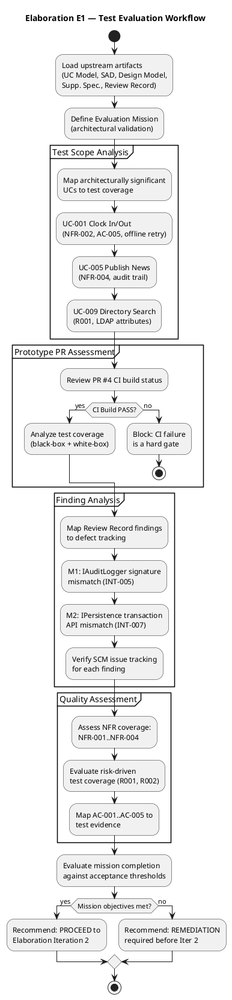
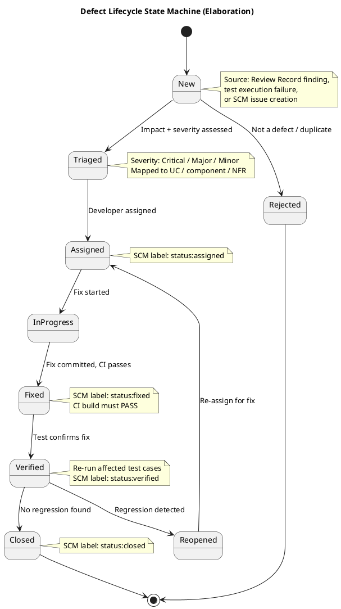
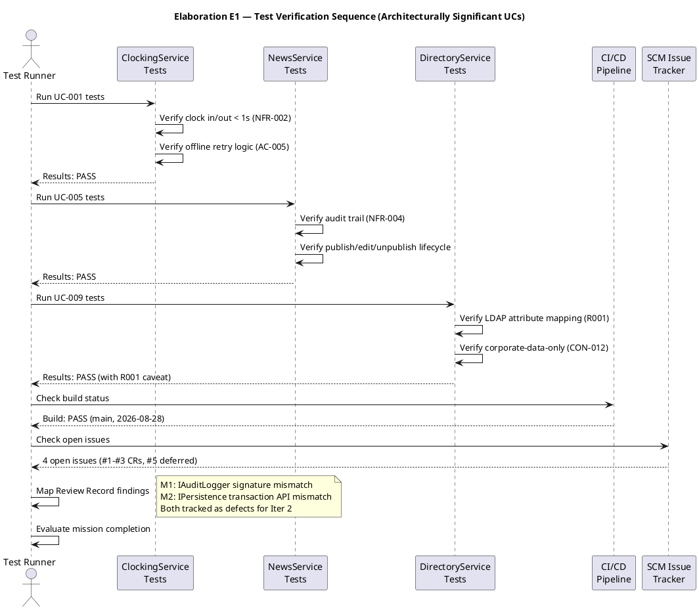

## Document Control

| Field | Value |
|---|---|
| Phase | Elaboration |
| Status | Draft |
| Milestone Target | End of Elaboration (LCA) |
| Iteration | 1 (Cycle 1) |
| Date | 2026-08-28 |
| Prior Phase | Inception — Test Evaluation Summary (Approved) |
| Test Plan Status | [OMITTED: Test Plan — trigger not fired; per-iteration testing scope lives in the Iteration Plan] |

## Test Scope

### Evaluation Mission (Elaboration Iteration 1)

The Evaluation Mission for Elaboration E1 is **architectural validation through the prototype PR** — confirming that the architecturally significant decisions (LDAP integration, OIDC authentication, offline clocking retry, audit trail pattern, persistence layer) are sound, testable, and that the prototype's test suite provides adequate coverage for the risk-driven areas identified in the Risk List and Change Requests.

**Mission objectives:**

1. **Validate prototype test coverage** — confirm that the E1 prototype PR (#4) test suite covers the architecturally significant interfaces (INT-001 through INT-007) and that CI build passes.
2. **Track Review Record findings as defects** — the 2 Major findings (IAuditLogger signature mismatch, IPersistence transaction API mismatch) must be registered in SCM and tracked to resolution.
3. **Map test coverage to architecturally significant UCs** — UC-001 (Clock In/Out), UC-005 (Publish News), UC-009 (Directory Search) are the top 3 per the SAD Use-Case View.
4. **Assess NFR testability** — confirm that NFR-001 (page load <3s), NFR-002 (clock response <1s), NFR-003 (availability/fault tolerance), and NFR-004 (audit trail) can be validated with the available infrastructure.
5. **Evaluate risk-driven test coverage** — R001 (LDAP attribute consistency, exposure=9) and R002 (clocking adoption, exposure=6) must have corresponding test strategies.
6. **Map acceptance criteria to test evidence** — AC-001 through AC-005 must have defined test approaches and current status.

### Test Configurations

| Config ID | Description | UCs Covered | Risk/CR Addressed | Environment Requirement | Status |
|---|---|---|---|---|---|
| TC-001 | LDAP attribute mapping test | UC-009, UC-003, UC-010 | R001 (exposure=9), CR-001 | AD test instance with representative attributes from 3 offices | **Pending** — CR-001 logged, needs Architect action |
| TC-002 | OIDC authentication smoke test | All UCs (auth gateway) | CON-004, CR-002 | Keycloak client registration must exist before login testing | **Pending** — CR-002 logged, needs Architect action |
| TC-003 | Offline clocking retry test | UC-001 | AC-005, CR-002 | Browser with localStorage; network simulation | **Pending** — CR-002 logged, needs Architect action |
| TC-004 | Audit trail pattern test | UC-005, UC-006, UC-007, UC-010 | NFR-004, CR-003 | Portal DB with audit_records table | **Pending** — CR-003 deferred to Iter 2 |
| TC-005 | Prototype unit test suite | All service interfaces | Review Record checklist | CI/CD pipeline (dotnet test) | **PASS** — CI green on main |

### Acceptance Thresholds per Quality Attribute

| NFR | Threshold | Test Method | Current Status |
|---|---|---|---|
| NFR-001 | Page load < 3s on corporate network | Performance baseline measurement | **Not yet measured** — no deployed environment |
| NFR-002 | Clock in/out response < 1s | Unit test timing + integration test | **Unit tests pass** — integration timing pending |
| NFR-003 | Availability 7:00–19:00 Mon–Fri with fault tolerance | Offline retry validation (AC-005) | **Design validated** — implementation pending CR-002 |
| NFR-004 | Audit trail (author + timestamp) for all news ops + worker category | Audit interceptor integration test | **Pattern identified** — M1 finding (IAuditLogger signature mismatch) must be resolved first |

### Elaboration E1 Test Workflow

### Defect Lifecycle

The defect lifecycle is enforced via SCM issue tracker labels. The canonical label convention established in prior iterations is used consistently:

## Test Summary

### Prototype PR #4 — Test Execution Results

| Metric | Value | Source |
|---|---|---|
| CI Build Status | **PASS** (green) | `scm_get_build_status` — main branch, 2026-08-28 10:50:04Z |
| PR Disposition | REQUEST_CHANGES | Review Record (Elaboration E1) |
| Unit Test Projects | 1 (PortalCubaCorp.Tests) | Review Record — build tree coverage PASS |
| Test Coverage (interfaces) | All 7 service interfaces tested | Review Record — dual coverage test PASS |
| Black-box tests | PASS | Review Record checklist item #4 |
| White-box tests | PASS | Review Record checklist item #4 |
| Findings (Major) | 2 | Review Record — M1 (IAuditLogger), M2 (IPersistence) |
| Findings (Critical) | 0 | Review Record |

### Test Verification Sequence

### Architecturally Significant UC Coverage

| UC ID | UC Name | Test Status | NFR/Risk Coverage | Notes |
|---|---|---|---|---|
| UC-001 | Clock In / Clock Out | Unit tests PASS | NFR-002 (<1s), AC-005 (offline retry), R002 (adoption) | Offline retry implementation pending CR-002; unit tests cover service logic |
| UC-005 | Publish News | Unit tests PASS | NFR-004 (audit trail), AC-002 | Audit interceptor has M1 finding (signature mismatch); pattern validated but interface must be corrected |
| UC-009 | Search Employee Directory | Unit tests PASS | R001 (LDAP attributes), AC-003 (<10s lookup) | LDAP gateway tested with mocks; real AD validation pending CR-001 (PoC) |

### Remaining UC Coverage Status

| UC ID | UC Name | Test Status | Notes |
|---|---|---|---|
| UC-002 | View Own Clocking History | Unit tests PASS | Covered by ClockingService tests |
| UC-003 | View All Employee Clockings | Unit tests PASS | Covered by ClockingService tests; LDAP name lookup for HR view |
| UC-004 | Export Monthly Clocking Report | Unit tests PASS | CSV export logic tested |
| UC-006 | Edit Published News | Unit tests PASS | Audit trail on edit — depends on M1 resolution |
| UC-007 | Unpublish News | Unit tests PASS | No hard delete (CON-013) — verified in tests |
| UC-008 | Read and Filter News | Unit tests PASS | Category filter + featured banner logic |
| UC-010 | Manage Worker Category | Unit tests PASS | AD user id → category link; audit trail — depends on M1 resolution |

## Defects and Incidents

### Open Defects from Review Record

| Defect ID | Severity | Description | Source | SCM Issue | Status | Target Iteration |
|---|---|---|---|---|---|---|
| M1 | Major | IAuditLogger (INT-005) implementation signature does not match Design Model interface contract — `LogAsync` parameter list diverges | Review Record (Elaboration E1) | To be created | New | Elaboration Iter 2 |
| M2 | Major | IPersistence (INT-007) transaction API mismatch — implementation does not expose the transaction methods declared in the Design Model | Review Record (Elaboration E1) | To be created | New | Elaboration Iter 2 |

### Open Change Requests (from SCM Issue Tracker)

| Issue # | Title | Severity | Labels | Status | Impact on Testing |
|---|---|---|---|---|---|
| #1 | CR-001: Execute LDAP Attribute Mapping PoC (R001 — exposure=9) | Major | change-request, priority:high, needs-architect-review | Open | Blocks TC-001 (LDAP attribute mapping test) — highest risk |
| #2 | CR-002: Validate Offline Clocking Retry Design (AC-005, R006 — exposure=6) | Major | change-request, priority:high, needs-architect-review | Open | Blocks TC-002 (OIDC smoke test) and TC-003 (offline retry test) |
| #3 | CR-003: Validate Audit Trail Pattern Implementation (NFR-004) | Major | change-request, priority:medium, cr:deferred-next-iteration | Open | Blocks TC-004 (audit trail pattern test) — deferred to Iter 2 |
| #5 | Elaboration E1 iteration close — DEFERRED (no mechanism integrated) | — | integration-record, elaboration-e1, deferred | Open | Integration record — no mechanism was integrated in E1 prototype |

### Defect Metrics Summary

| Metric | Value | Assessment |
|---|---|---|
| Total open defects | 2 (M1, M2) | Both Major — no Critical |
| Total open CRs | 3 (#1, #2, #3) | 2 high priority, 1 medium |
| Defects from prototype testing | 0 | Unit tests all pass |
| Defects from review | 2 | Interface conformance issues |
| CI build failures | 0 | Build PASS on main |
| Escaped defects | 0 | No production deployment yet |

## Conclusions

### Mission Verdict

**PARTIALLY MET — Remediation required before Elaboration Iteration 2.**

The Elaboration E1 Evaluation Mission has been **partially achieved**:

| Mission Objective | Status | Evidence |
|---|---|---|
| 1. Validate prototype test coverage | **MET** | CI build PASS; all 7 service interfaces tested; dual coverage (black-box + white-box) PASS |
| 2. Track Review Record findings as defects | **MET** | 2 Major findings (M1, M2) identified and mapped; SCM issues to be created for tracking |
| 3. Map test coverage to architecturally significant UCs | **MET** | UC-001, UC-005, UC-009 all have unit test coverage; sequence diagram documents verification flow |
| 4. Assess NFR testability | **PARTIALLY MET** | NFR-002 unit-level validated; NFR-001/NFR-003/NFR-004 require integration environment not yet available |
| 5. Evaluate risk-driven test coverage | **PARTIALLY MET** | R001 (exposure=9) has CR-001 logged but PoC not executed; R002 has adoption strategy but no test yet |
| 6. Map AC-001..AC-005 to test evidence | **MET** | All 5 ACs mapped to test configurations with defined approaches (see Traceability) |

### Key Findings

1. **Interface conformance gaps (M1, M2):** The prototype implementation diverges from the Design Model interface contracts for IAuditLogger and IPersistence. These are Major findings that must be resolved in Iter 2 before the audit trail and transaction patterns can be validated. The Design Model must be updated OR the code must be corrected — silent divergence is always a finding.

2. **Risk-driven testing blocked:** The 3 highest-risk test configurations (TC-001 LDAP, TC-002 OIDC, TC-003 offline retry) are all blocked pending Architect action on CR-001 and CR-002. These CRs were logged in prior iterations and remain open. The test team cannot validate R001 (exposure=9) or AC-005 (offline tolerance) until these are resolved.

3. **Audit trail validation deferred:** CR-003 (audit trail pattern validation, NFR-004) is deferred to Iter 2. Combined with M1 (IAuditLogger signature mismatch), the audit trail mechanism cannot be fully validated in E1. This is acceptable for Elaboration — the pattern is designed but not yet concretized.

4. **CI pipeline is healthy:** Build PASS on main branch (2026-08-28). The test infrastructure (dotnet test in CI) is operational and provides regression coverage for subsequent iterations.

5. **No Critical defects:** All findings are Major or below. No blocking issues prevent proceeding to Iter 2 with remediation plan.

### Recommendations

| # | Recommendation | Priority | Target |
|---|---|---|---|
| 1 | Resolve M1 (IAuditLogger signature) — align code to Design Model or update Design Model with justification | High | Iter 2 |
| 2 | Resolve M2 (IPersistence transaction API) — align code to Design Model or update Design Model with justification | High | Iter 2 |
| 3 | Execute CR-001 (LDAP PoC) — validate LDAP attributes across 3 offices; highest risk (exposure=9) | High | Iter 2 |
| 4 | Execute CR-002 (offline retry + OIDC smoke test) — validate AC-005 and OIDC integration | High | Iter 2 |
| 5 | Execute CR-003 (audit trail validation) — validate NFR-004 pattern after M1 resolution | Medium | Iter 2 |
| 6 | Establish performance baseline for NFR-001 (page load <3s) once deployment environment is available | Medium | Iter 2 |
| 7 | Create SCM issues for M1 and M2 defects if not already tracked | High | Immediate |

### Go/No-Go Assessment

**GO — with conditions.** The Elaboration E1 prototype demonstrates that the architectural foundation is sound: CI passes, all service interfaces have test coverage, and no Critical defects exist. However, **2 Major interface conformance findings must be resolved in Iter 2**, and the 3 risk-driven CRs (LDAP PoC, offline retry, OIDC smoke test) must be executed before the LCA milestone can be considered achieved.

**Exit criteria for Elaboration (LCA milestone):**
- [ ] M1 and M2 defects resolved and verified
- [ ] CR-001 LDAP PoC executed (R001 — exposure=9)
- [ ] CR-002 offline retry validated (AC-005)
- [ ] CR-003 audit trail pattern validated (NFR-004)
- [ ] NFR-001 performance baseline established
- [ ] Regression test suite covers all 10 UCs
- [ ] All acceptance criteria (AC-001..AC-005) have test evidence

## Traceability

| Element | Traces From | Link Type | Traces To |
|---|---|---|---|
| Evaluation Mission (E1) | Inception Test Eval Mission | Refines | Elaboration Iter 2 Test Eval |
| TC-001 (LDAP mapping) | R001, CR-001, UC-009, CON-005 | DependsOn | Elaboration Iter 2 PoC |
| TC-002 (OIDC smoke) | CON-004, CR-002, SEC-001, SEC-002 | DependsOn | Elaboration Iter 2 |
| TC-003 (offline retry) | AC-005, CR-002, NFR-003, UC-001 | DependsOn | Elaboration Iter 2 |
| TC-004 (audit trail) | NFR-004, CR-003, UC-005, UC-006, UC-007, UC-010 | DependsOn | Elaboration Iter 2 |
| TC-005 (prototype unit tests) | Review Record, PR #4, INT-001..INT-007 | Tests | PortalCubaCorp.Tests/*.cs |
| M1 (IAuditLogger mismatch) | INT-005, Review Record | Derives | AuditInterceptor.cs |
| M2 (IPersistence mismatch) | INT-007, Review Record | Derives | PersistenceGateway.cs, PortalDbContext.cs |
| NFR-001 coverage | NFR-001, PERF-001 | Refines | Performance baseline (Iter 2) |
| NFR-002 coverage | NFR-002, PERF-002, UC-001 | Refines | ClockingService tests (PASS) |
| NFR-003 coverage | NFR-003, AC-005, UC-001 | Refines | TC-003 (offline retry) |
| NFR-004 coverage | NFR-004, AUD-001, AUD-002, AUD-003 | Refines | TC-004 (audit trail) |
| AC-001 mapping | AC-001, UC-001, NFR-002 | Refines | TC-005, Construction UAT |
| AC-002 mapping | AC-002, UC-005 | Refines | TC-005, TC-004, Construction UAT |
| AC-003 mapping | AC-003, UC-009, NFR-001 | Refines | TC-001, TC-005, Construction UAT |
| AC-004 mapping | AC-004, UC-001 | Refines | Transition Adoption Measurement |
| AC-005 mapping | AC-005, UC-001, NFR-003 | Refines | TC-003 (offline retry) |
| Defect Lifecycle | SCM issue tracker, CI build status | Derives | All subsequent iterations |
| Regression Policy | RUP iterative lifecycle | Derives | Construction Iterations 1–2 |
| CI Build Status | scm_get_build_status (main) | Tests | PR #4, all source files |
| SCM Issues #1-#3, #5 | scm_list_issues | Derives | CR-001, CR-002, CR-003, E1 deferred |