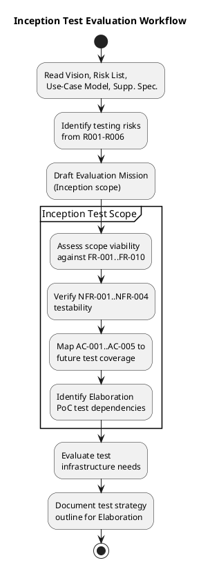
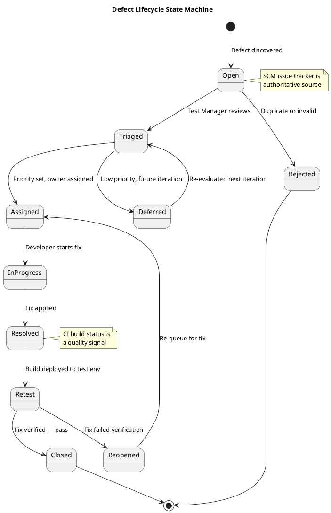

## Document Control

| Field | Value |
|---|---|
| Phase | Inception |
| Status | Draft |
| Milestone Target | End of Inception (LCO) |
| Iteration | 1 (Cycle 1) |
| Date | 2026-08-28 |

## Test Scope

### Evaluation Mission (Inception)

The Evaluation Mission for Inception Iteration 1 is to **establish the test strategy foundation** — confirming that the declared scope (10 functional requirements, 4 NFRs, 5 acceptance criteria) is testable, identifying the testing risks that will drive Elaboration's PoC validation, and outlining the test approach for the cross-iteration roadmap. No code exists yet; this is a planning and assessment mission, not an execution mission.

**Mission objectives:**

1. **Verify testability of all declared requirements** — confirm that each FR-001..FR-010, NFR-001..NFR-004, and AC-001..AC-005 can be tested with the available technology stack and infrastructure.
2. **Identify testing risks** — derive test-specific risks from the project Risk List (R001–R006) and define how they constrain the test approach.
3. **Map acceptance criteria to future test coverage** — establish which UCs and NFRs each AC-001..AC-005 will exercise, so Elaboration and Construction iterations inherit a coverage blueprint.
4. **Assess test infrastructure needs** — identify what environments, tools, and data are required for Elaboration PoC testing and Construction functional testing.
5. **Outline the cross-iteration test strategy** — define how testing evolves from Inception (assessment) through Elaboration (PoC + integration) to Construction (functional + regression) and Transition (acceptance).

### Inception Test Workflow

### Requirements Testability Assessment

| Requirement | Testable? | Test Approach | Notes |
|---|---|---|---|
| FR-001 (Clock In/Out) | Yes | Functional + performance (NFR-002: <1s) + offline retry (AC-005) | Most complex test target — combines functional, performance, and offline resilience |
| FR-002 (View Own History) | Yes | Functional — verify current-month filter and data accuracy | Straightforward CRUD read |
| FR-003 (View All Clockings) | Yes | Functional + authorization (HR role only) | Role-based access test required |
| FR-004 (Export CSV) | Yes | Functional — verify CSV format, completeness, date range filtering | File format validation |
| FR-005 (Publish News) | Yes | Functional + audit trail verification (NFR-004) | Audit fields must be verified |
| FR-006 (Edit News) | Yes | Functional + audit trail — every edit records author + timestamp | Audit trail is the critical test path |
| FR-007 (Unpublish News) | Yes | Functional + audit trail + no-delete verification (CON-013) | Verify record persists after unpublish |
| FR-008 (Read/Filter News) | Yes | Functional — category filter, featured banner, date sorting | UI interaction testing |
| FR-009 (Search Directory) | Yes | Functional + LDAP integration + performance (AC-003: <10s) | R001 risk — LDAP attribute consistency across 3 offices |
| FR-010 (Manage Worker Category) | Yes | Functional + audit trail + AD read-only verification | Verify no AD writes, local table only |

| NFR | Testable? | Test Approach | Notes |
|---|---|---|---|
| NFR-001 (Page load <3s) | Yes | Performance test on corporate network | Load test with representative data volume |
| NFR-002 (Clock response <1s) | Yes | Performance test — single operation latency | Includes offline retry path |
| NFR-003 (Availability 7:00–19:00 Mon–Fri) | Yes | Operational test — fault tolerance within corporate network | Extended hours, not 24/7 |
| NFR-004 (Mandatory audit trail) | Yes | Functional verification — author + timestamp on every publish/edit/unpublish/category change | Cross-cutting; tested via UC-005..UC-007, UC-010 |

### Acceptance Criteria → Test Coverage Mapping

| AC | Description | UCs/NFRs Exercised | Test Phase |
|---|---|---|---|
| AC-001 | Employee clocks in/out without help | UC-001, NFR-002 | Construction + Transition (user acceptance) |
| AC-002 | HR publishes news without technical assistance | UC-005 | Construction + Transition (user acceptance) |
| AC-003 | Employee finds colleague's phone/email in <10s | UC-009, NFR-001 | Construction (performance) + Transition (user acceptance) |
| AC-004 | 80% of employees complete a clocking with no training | UC-001 | Transition (adoption measurement) |
| AC-005 | System tolerates 5-min network drop for clocking | UC-001 (offline retry), REL-003, REL-004 | Elaboration (PoC) + Construction (integration) |

### Testing Risks (Derived from Risk List)

| Risk ID | Project Risk | Testing Implication | Mitigation |
|---|---|---|---|
| R001 (P=3, I=3, exp=9) | AD LDAP attribute inconsistency across 3 offices | Directory tests may fail due to missing attributes, not code defects. Test data must include incomplete AD records. | Elaboration PoC must include LDAP attribute coverage test with data from all 3 offices. Test Designer creates test cases with missing/empty attributes. |
| R002 (P=3, I=2, exp=6) | Digital clocking adoption — employees keep using Excel | Not a code defect — adoption is a Transition-phase measurement. Test strategy includes usability validation in Construction. | Transition acceptance test measures AC-004 (80% adoption). Usability test cases in Construction verify clocking is intuitive (AC-001). |
| R003 (P=2, I=3, exp=6) | Keycloak OIDC client not registered before login testing | All functional tests depend on authentication. If OIDC client is not ready, no UC can be tested. | Elaboration Iter 1: verify OIDC client registration with Infrastructure team (STK-003) before any integration test. Smoke test: authenticated page load. |
| R004 (P=2, I=2, exp=4) | Performance under concurrent clocking (200 users, morning peak) | NFR-002 (<1s) must be tested under load, not just single-user. | Construction: load test simulating morning peak (7:00–9:00) with concurrent clock-in operations. |
| R005 (P=2, I=2, exp=4) | UI design compliance (CON-011 — mandatory custom design) | Visual regression testing needed to ensure implementation matches design. | Construction: visual comparison test against docs/inputs/employee-portal-design.html. |
| R006 (P=3, I=2, exp=6) | Offline clocking mechanism complexity | Offline retry (localStorage + idempotency key) is novel — test paths include: normal POST, network drop during POST, retry after reconnection, duplicate rejection. | Elaboration PoC: dedicated test scenarios for offline retry. Construction: integration test covering 5-min drop and recovery. |

### Defect Lifecycle

The SCM issue tracker is the authoritative source for defect data. CI build status is a quality signal. The following state machine governs defect progression:

### Test Infrastructure Needs Assessment

| Need | Phase Required | Justification | Status |
|---|---|---|---|
| Test AD instance with representative data from 3 offices | Elaboration Iter 1 | R001 — LDAP attribute consistency must be validated before architecture baseline | [ASSUMPTION] — Infrastructure team (STK-003) to provide test AD access or sample data |
| Keycloak OIDC client registered for test environment | Elaboration Iter 1 | R003 — all functional tests require authentication | [ASSUMPTION] — Infrastructure team (STK-003) to register test OIDC client |
| Test PostgreSQL database | Elaboration Iter 1 | Clocking, news, worker category data storage | Local development instance sufficient for Elaboration |
| Corporate network test environment | Construction | NFR-001 (<3s page load) and NFR-002 (<1s clocking) must be measured on the real network | [ASSUMPTION] — deployment to internal Windows Server (CON-006) for performance testing |
| Load testing tool | Construction | R004 — concurrent clocking simulation (200 users, morning peak) | Open-source tool sufficient (e.g., k6 or NBomber for .NET) |
| Visual regression comparison | Construction | R005 — CON-011 mandatory UI design compliance | Manual comparison against design HTML; no specialized tool needed for 200-user intranet |

### Cross-Iteration Test Strategy Outline

| Phase | Iterations | Test Focus | Key Deliverables |
|---|---|---|---|
| Inception | 1 | Requirements testability assessment, risk identification, strategy outline | This document — Test Evaluation Summary |
| Elaboration | 2 | PoC validation (R001 LDAP, R006 offline), OIDC integration smoke test, architecture testability | PoC test results, integration test cases for critical paths |
| Construction | 2 | Functional testing of all UCs, performance testing (NFR-001, NFR-002), audit trail verification (NFR-004), regression testing per iteration | Test case suite, regression test pack, performance test results |
| Transition | 1 | User acceptance testing (AC-001..AC-005), adoption measurement (AC-004), deployment verification | Acceptance test results, final Test Evaluation Summary |

**Regression testing policy:** Every Construction iteration must include regression testing of all previously passing UCs. No iteration skips regression — undiscovered defect debt is unacceptable.

## Test Summary

### Inception Iteration 1 — Test Execution Status

No code has been produced in Inception. The CI pipeline is green on main with a bootstrap skeleton, but there are no functional tests to execute. This is expected — Inception is a planning phase, not an execution phase.

| Metric | Value |
|---|---|
| Test cases executed | 0 (no code to test) |
| Pass rate | N/A |
| Defects found | 0 (no code to test) |
| CI build status | Green (bootstrap skeleton) |
| Test coverage | N/A (no functional code) |

### Inception Test Effort Assessment

The Inception test effort focused on **strategy and risk identification**, not execution. The key outputs are:

1. **All 10 FRs confirmed testable** with the declared technology stack
2. **All 4 NFRs confirmed testable** with measurable thresholds
3. **All 5 ACs mapped to future test phases** with clear ownership
4. **6 testing risks identified** with mitigations tied to the project Risk List
5. **Test infrastructure needs assessed** with 2 external dependencies on STK-003 (AD test access, OIDC client registration)
6. **Defect lifecycle defined** using SCM issue tracker as authoritative source
7. **Cross-iteration test strategy outlined** with regression testing policy established

## Defects and Incidents

No defects or incidents to report for Inception Iteration 1. No functional code has been produced.

### Open Test Dependencies (Not Defects)

| ID | Dependency | Owner | Target Iteration | Blocking? |
|---|---|---|---|---|
| TD-001 | Test AD instance with 3-office representative data | STK-003 (Infrastructure) | Elaboration Iter 1 | Yes — blocks R001 PoC testing |
| TD-002 | Keycloak OIDC client registration for test environment | STK-003 (Infrastructure) | Elaboration Iter 1 | Yes — blocks all integration testing |

## Conclusions

### Evaluation Mission Verdict

**Mission status: ACHIEVED (for Inception scope)**

The Inception Evaluation Mission aimed to establish the test strategy foundation. All five mission objectives were met:

1. ✅ All 10 FRs and 4 NFRs confirmed testable
2. ✅ 6 testing risks identified with mitigations
3. ✅ 5 acceptance criteria mapped to test phases
4. ✅ Test infrastructure needs assessed (2 external dependencies identified)
5. ✅ Cross-iteration test strategy outlined with regression policy

### Recommendations for Elaboration

1. **Prioritize R001 (LDAP) and R006 (offline) PoC testing** in Elaboration Iteration 1 — these are the highest-exposure risks and their test results determine whether the architecture baseline is viable.
2. **Resolve TD-001 and TD-002 before Elaboration Iter 1 begins** — the Infrastructure team (STK-003) must provide test AD access and register the OIDC client. These are blocking dependencies.
3. **Establish a smoke test for OIDC authentication** as the first test case in Elaboration — all subsequent functional tests depend on it.
4. **Create LDAP attribute coverage test cases** that include missing/empty/inconsistent attributes from all 3 offices — this directly confronts R001.

### LCO Readiness from Test Perspective

From the Test discipline, the project is **ready to proceed to Elaboration** provided that:
- TD-001 and TD-002 are communicated to STK-003 with sufficient lead time
- The Elaboration Iteration Plan includes PoC test cases for R001 and R006
- The regression testing policy is accepted by the Project Manager

## Traceability

| Element | Traces From | Link Type | Traces To |
|---|---|---|---|
| Evaluation Mission | Vision (FR-001..FR-010, NFR-001..NFR-004, AC-001..AC-005) | Derives | Elaboration Test Plan, Construction Test Cases |
| Testing Risk R001 | R001 (Risk List) | Refines | Elaboration PoC (UC-009) |
| Testing Risk R002 | R002 (Risk List) | Refines | Transition Acceptance Test (AC-004) |
| Testing Risk R003 | R003 (Risk List) | Refines | Elaboration Smoke Test (SEC-001) |
| Testing Risk R004 | R004 (Risk List) | Refines | Construction Load Test (NFR-002) |
| Testing Risk R005 | R005 (Risk List) | Refines | Construction Visual Regression (CON-011) |
| Testing Risk R006 | R006 (Risk List) | Refines | Elaboration PoC (UC-001 offline) |
| AC-001 mapping | AC-001, UC-001, NFR-002 | Refines | Construction Test Cases, Transition UAT |
| AC-002 mapping | AC-002, UC-005 | Refines | Construction Test Cases, Transition UAT |
| AC-003 mapping | AC-003, UC-009, NFR-001 | Refines | Construction Performance Test, Transition UAT |
| AC-004 mapping | AC-004, UC-001 | Refines | Transition Adoption Measurement |
| AC-005 mapping | AC-005, UC-001, REL-003, REL-004 | Refines | Elaboration PoC, Construction Integration Test |
| TD-001 | R001, STK-003, CON-005 | DependsOn | Elaboration Iter 1 PoC |
| TD-002 | R003, STK-003, CON-004 | DependsOn | Elaboration Iter 1 Smoke Test |
| Defect Lifecycle | SCM issue tracker, CI build status | Derives | All subsequent iterations |
| Regression Policy | RUP iterative lifecycle | Derives | Construction Iterations 1–2 |