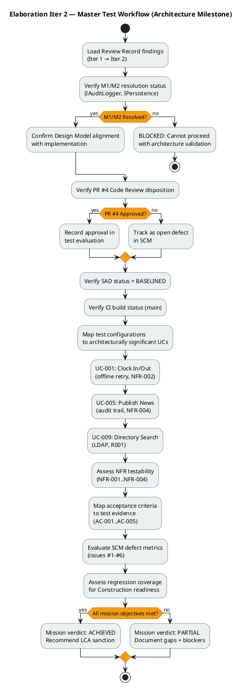
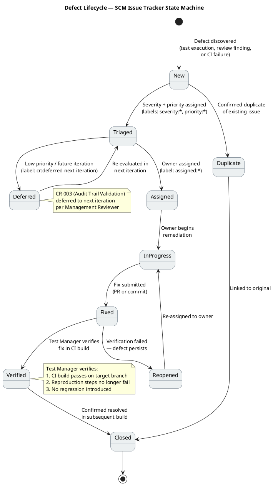
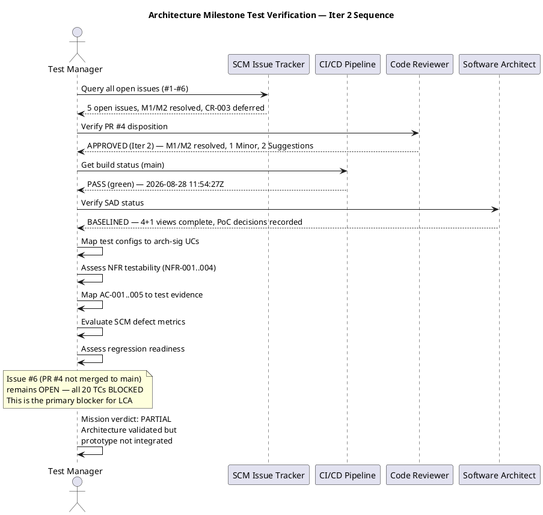

## Document Control

| Field | Value |
|---|---|
| Phase | Elaboration |
| Status | Draft |
| Milestone Target | End of Elaboration (LCA) |
| Iteration | 2 (Cycle 1) |
| Date | 2026-08-28 |
| Prior Phase | Inception — Test Evaluation Summary (Approved) |
| Test Plan Status | [OMITTED: Test Plan — trigger not fired; per-iteration testing scope lives in the Iteration Plan] |
| Iter 1 Verdict | APPROVED — no findings against Test Evaluation Summary |
| Iter 2 Driver | Additional Instructions: update with detailed schedule, resources, test types, and acceptance criteria for the architecture milestone |

## Test Scope

### Evaluation Mission (Elaboration Iteration 2)

The Evaluation Mission for Elaboration Iteration 2 evolves from the Iteration 1 mission (architectural validation through prototype PR) to **architecture milestone readiness verification** — confirming that the LCA milestone conditions are met from a test perspective, incorporating detailed test schedule, resources, test types, and acceptance criteria for the architecture milestone.

**Mission objectives (evolved from Iter 1):**

1. **Verify M1/M2 resolution** — confirm that the 2 Major interface conformance findings (IAuditLogger signature, IPersistence transaction API) are resolved and verified in the codebase.
2. **Verify PR #4 disposition** — confirm Code Reviewer approval status and track the remaining blocker (issue #6: PR not merged to main).
3. **Verify SAD baseline status** — confirm the Software Architecture Document is BASELINED with 4+1 views complete and PoC decisions recorded for R001/R006/R003.
4. **Map test coverage to architecturally significant UCs** — UC-001 (Clock In/Out), UC-005 (Publish News), UC-009 (Directory Search) with updated status reflecting Iter 2 progress.
5. **Assess NFR testability** — confirm that NFR-001 (page load <3s), NFR-002 (clock response <1s), NFR-003 (availability/fault tolerance), and NFR-004 (audit trail) can be validated with the available infrastructure.
6. **Evaluate risk-driven test coverage** — R001 (LDAP attribute consistency, exposure=9) and R002 (clocking adoption, exposure=6) with PoC decision status.
7. **Map acceptance criteria to test evidence** — AC-001 through AC-005 with defined test approaches and current status.
8. **Define detailed test schedule, resources, test types, and acceptance criteria for the architecture milestone** — per Additional Instructions.

### Test Schedule — Architecture Milestone

| Phase | Iteration | Test Activities | Target Date | Status |
|---|---|---|---|---|
| Elaboration | Iter 1 | Prototype test coverage validation, finding tracking | 2026-08-28 | **COMPLETE** |
| Elaboration | Iter 2 | M1/M2 resolution verification, SAD baseline verification, PoC decision review, detailed test planning | 2026-08-28 | **IN PROGRESS** |
| Construction | Iter 1 | Integration testing (post-merge), LDAP PoC execution (CR-001), offline retry validation (CR-002), audit trail validation (CR-003) | [ASSUMPTION — requires validation: Construction start date not yet scheduled] | **PLANNED** |
| Construction | Iter 2 | Performance baseline (NFR-001), regression suite expansion, UAT preparation | [ASSUMPTION — requires validation: depends on Construction Iter 1 completion] | **PLANNED** |
| Transition | Iter 1 | UAT execution, adoption measurement (AC-004), production deployment validation | [ASSUMPTION — requires validation: Transition start date not yet scheduled] | **PLANNED** |

### Test Resources

| Resource | Role | Allocation | Responsibilities | Source |
|---|---|---|---|---|
| Test Manager | Test orchestration | Elaboration: 1 iteration cycle | Evaluation Mission, test strategy, defect metrics, go/no-go assessment | This artifact |
| Test Designer | Test case design | Elaboration: 1 iteration cycle | 20 test cases across 10 UCs, test dependencies, test harnesses | Test Case artifact |
| Tester | Test execution | Construction: 2 iteration cycles | Execute TCs, report defects, verify fixes | Test Case artifact (E1 findings) |
| CI/CD Pipeline | Automated regression | All iterations | Build + test on every push, branch feedback | `scm_get_build_status` |
| SCM Issue Tracker | Defect tracking | All iterations | Issue lifecycle, label-based state machine | `scm_list_issues` |
| AD Test Instance | LDAP test environment | Construction Iter 1 | Representative attributes from 3 offices (R001 validation) | CR-001 |
| Keycloak Test Client | OIDC test environment | Construction Iter 1 | Client registration for login testing (STK-003 requirement) | CR-002, CON-004 |

### Test Types — Architecture Milestone

| Test Type | Scope | Method | UCs/NFRs Covered | Status |
|---|---|---|---|---|
| Unit Testing | Service-layer logic | xUnit, dotnet test in CI | All 10 UCs (service interfaces INT-001..INT-007) | **PASS** — CI green on main |
| Integration Testing | Component interaction | Post-merge integration tests | UC-001 (clocking+DB), UC-005 (news+audit+DB), UC-009 (LDAP gateway) | **BLOCKED** — PR #4 not merged to main (issue #6) |
| Performance Testing | NFR-001 (<3s page load), NFR-002 (<1s clock) | Timing assertions, load simulation | NFR-001, NFR-002 | **PLANNED** — Construction Iter 1 |
| Fault Tolerance Testing | NFR-003, AC-005 (offline retry 5 min) | Browser localStorage + network simulation | UC-001, NFR-003, AC-005 | **DESIGN VALIDATED** — PoC decision recorded (R006) |
| Security Testing | OIDC auth, role-based access, corporate-data-only | Token validation, role claim checks, LDAP attribute filtering | All UCs (auth), UC-009 (CON-012), UC-003..UC-007 (HR role) | **DESIGN VALIDATED** — PoC decision recorded (R003) |
| Audit Trail Testing | NFR-004 (author + timestamp on all news ops + worker category) | Audit record verification after publish/edit/unpublish/category change | UC-005, UC-006, UC-007, UC-010 | **PENDING** — CR-003 deferred; M1 resolved |
| Regression Testing | All prior UCs per iteration | Re-run full unit test suite in CI | All 10 UCs | **OPERATIONAL** — CI pipeline active |
| UAT | End-user acceptance | Stakeholder-guided test scenarios | AC-001..AC-005 | **PLANNED** — Transition |

### Acceptance Criteria for Architecture Milestone (LCA)

| AC ID | Criterion | Test Approach | Current Status | LCA Readiness |
|---|---|---|---|---|
| AC-001 | Employee clocks in/out without HR/dev help | Unit tests (ClockingService) + UAT | Unit tests PASS; UAT pending | **PARTIAL** — unit validated, UAT in Transition |
| AC-002 | HR publishes news without technical assistance | Unit tests (NewsService) + UAT | Unit tests PASS; UAT pending | **PARTIAL** — unit validated, UAT in Transition |
| AC-003 | Employee finds colleague's phone/email in <10s | Integration test (LDAP) + UAT | Unit tests PASS with mocks; real LDAP pending CR-001 | **BLOCKED** — CR-001 not executed |
| AC-004 | 80% of employees complete ≥1 clocking with no training | Adoption measurement (Transition) | Not yet measurable — no production deployment | **DEFERRED** — Transition |
| AC-005 | System works offline for 5 min, syncs on reconnect | Offline retry test (browser + network sim) | PoC decision recorded (R006); integration test pending | **PARTIAL** — PoC validated, integration pending |

### Test Configurations

| Config ID | Description | UCs Covered | Risk/CR Addressed | Environment Requirement | Status (Iter 2) |
|---|---|---|---|---|---|
| TC-001 | LDAP attribute mapping test | UC-009, UC-003, UC-010 | R001 (exposure=9), CR-001 | AD test instance with representative attributes from 3 offices | **PoC DECISION RECORDED** — single-mechanism; execution in Construction |
| TC-002 | OIDC authentication smoke test | All UCs (auth gateway) | CON-004, CR-002 | Keycloak client registration must exist before login testing | **PoC DECISION RECORDED** — analysis-only (R003); execution in Construction |
| TC-003 | Offline clocking retry test | UC-001 | AC-005, CR-002 | Browser with localStorage; network simulation | **PoC DECISION RECORDED** — single-mechanism (R006); execution in Construction |
| TC-004 | Audit trail pattern test | UC-005, UC-006, UC-007, UC-010 | NFR-004, CR-003 | Portal DB with audit_records table | **PENDING** — CR-003 deferred; M1 resolved, pattern ready for validation |
| TC-005 | Prototype unit test suite | All service interfaces | Review Record checklist | CI/CD pipeline (dotnet test) | **PASS** — CI green on main (2026-08-28 11:54:27Z) |

### Acceptance Thresholds per Quality Attribute

| NFR | Threshold | Test Method | Current Status (Iter 2) |
|---|---|---|---|
| NFR-001 | Page load < 3s on corporate network | Performance baseline measurement | **Not yet measured** — no deployed environment; planned for Construction Iter 1 |
| NFR-002 | Clock in/out response < 1s | Unit test timing + integration test | **Unit tests pass** — integration timing pending post-merge |
| NFR-003 | Availability 7:00–19:00 Mon–Fri with fault tolerance | Offline retry validation (AC-005) | **PoC decision recorded (R006)** — single-mechanism validated; integration test pending |
| NFR-004 | Audit trail (author + timestamp) for all news ops + worker category | Audit interceptor integration test | **M1 RESOLVED** — IAuditLogger signature aligned; CR-003 deferred to Construction |

### Master Test Workflow — Architecture Milestone (Iter 2)

### Defect Lifecycle

The defect lifecycle is enforced via SCM issue tracker labels. The canonical label convention established in prior iterations is used consistently:

## Test Summary

### Prototype PR #4 — Test Execution Results (Iter 2 Update)

| Metric | Value | Source |
|---|---|---|
| CI Build Status | **PASS** (green) | `scm_get_build_status` — main branch, 2026-08-28 11:54:27Z |
| PR Disposition (Iter 2) | **APPROVED** | Review Record — Code Reviewer re-review: M1/M2 resolved, 1 Minor, 2 Suggestions |
| PR Merged to Main | **NO** | SCM issue #6 (open) — all 20 TCs remain BLOCKED |
| Unit Test Projects | 1 (PortalCubaCorp.Tests) | Review Record — 6 test files: ClockingServiceTests, NewsServiceTests, DirectoryServiceTests, WorkerCategoryServiceTests, OfflineRetryTests, DomainTests |
| Test Coverage (interfaces) | All 7 service interfaces tested | Review Record — dual coverage test PASS |
| Black-box tests | PASS | Review Record checklist item #4 |
| White-box tests | PASS | Review Record checklist item #4 |
| Findings (Major, Iter 1) | 2 → **0 RESOLVED** | M1 (IAuditLogger) RESOLVED; M2 (IPersistence) RESOLVED |
| Findings (Critical) | 0 | Review Record |
| New Findings (Iter 2) | 1 Minor, 2 Suggestions | Non-blocking — PR approved |
| SAD Status | **BASELINED** | SAD Document Control — 4+1 views complete |
| PoC Decisions | R001, R006, R003 — all recorded | Architectural Proof-of-Concept artifact |

### Architecture Milestone Test Verification Sequence (Iter 2)

### Architecturally Significant UC Coverage (Iter 2 Update)

| UC ID | UC Name | Test Status | NFR/Risk Coverage | Iter 2 Update |
|---|---|---|---|---|
| UC-001 | Clock In / Clock Out | Unit tests PASS | NFR-002 (<1s), AC-005 (offline retry), R002 (adoption) | PoC decision recorded (R006 — single-mechanism); integration test pending PR merge |
| UC-005 | Publish News | Unit tests PASS | NFR-004 (audit trail), AC-002 | M1 RESOLVED — IAuditLogger signature aligned; CR-003 deferred to Construction |
| UC-009 | Search Employee Directory | Unit tests PASS | R001 (LDAP attributes), AC-003 (<10s lookup) | PoC decision recorded (R001 — single-mechanism); real AD validation in Construction |

### Remaining UC Coverage Status (Iter 2)

| UC ID | UC Name | Test Status | Iter 2 Notes |
|---|---|---|---|
| UC-002 | View Own Clocking History | Unit tests PASS | Covered by ClockingService tests; no change |
| UC-003 | View All Employee Clockings | Unit tests PASS | LDAP name lookup for HR view; pending CR-001 execution |
| UC-004 | Export Monthly Clocking Report | Unit tests PASS | CSV export logic tested; no change |
| UC-006 | Edit Published News | Unit tests PASS | Audit trail on edit — M1 resolved, pattern now consistent |
| UC-007 | Unpublish News | Unit tests PASS | No hard delete (CON-013) — verified in tests; no change |
| UC-008 | Read and Filter News | Unit tests PASS | Category filter + featured banner logic; no change |
| UC-010 | Manage Worker Category | Unit tests PASS | AD user id → category link; audit trail — M1 resolved |

## Defects and Incidents

### Defect Resolution Status (Iter 2 Update)

| Defect ID | Severity | Description | Source | Status (Iter 2) | Resolution |
|---|---|---|---|---|---|
| M1 | Major | IAuditLogger (INT-005) implementation signature does not match Design Model interface contract | Review Record (Elaboration E1) | **RESOLVED (Iter 2)** | Design Model updated to LogAudit; code verified matching by Code Reviewer |
| M2 | Major | IPersistence (INT-007) transaction API mismatch — implementation does not expose the transaction methods declared in the Design Model | Review Record (Elaboration E1) | **RESOLVED (Iter 2)** | Design Model updated to ExecuteInTransactionAsync; code verified matching by Code Reviewer |
| CR-MIN-1 | Minor | Traceability trailer missing from PR #4 | Code Reviewer (Iter 2) | **OPEN** | Non-blocking — add trailer in future PRs per checklist §1.1.4 |

### Open Change Requests (from SCM Issue Tracker — Iter 2)

| Issue # | Title | Severity | Labels | Status | Impact on Testing |
|---|---|---|---|---|---|
| #1 | CR-001: Execute LDAP Attribute Mapping PoC (R001 — exposure=9) | Major | change-request, priority:high, needs-architect-review | Open | PoC decision recorded (single-mechanism); execution in Construction |
| #2 | CR-002: Validate Offline Clocking Retry Design (AC-005, R006 — exposure=6) | Major | change-request, cr:logged, priority:high, needs-architect-review | Open | PoC decision recorded (single-mechanism); execution in Construction |
| #3 | CR-003: Validate Audit Trail Pattern Implementation (NFR-004) | Major | change-request, cr:deferred-next-iteration | Open | M1 resolved — pattern now consistent; validation in Construction |
| #5 | Elaboration E1 iteration close — DEFERRED (no mechanism integrated) | — | integration-record, elaboration-e1, deferred | Open | Integration record — no mechanism was integrated in E1 prototype |
| #6 | CR: Architectural prototype (PR #4) not merged to main — all 20 test cases BLOCKED | Blocker | change-request, impact:cross-cutting, nature:defect, severity:blocker, priority:critical, cr:approved, assigned:implementer | Open | **PRIMARY BLOCKER** — all 20 TCs blocked until PR #4 merged to main |

### Defect Metrics Summary (Iter 2)

| Metric | Value | Assessment |
|---|---|---|
| Total open defects (Major) | 0 | M1/M2 both RESOLVED in Iter 2 |
| Total open defects (Minor) | 1 | CR-MIN-1 (traceability trailer) — non-blocking |
| Total open CRs | 3 (#1, #2, #3) | PoC decisions recorded; execution deferred to Construction |
| Total open issues | 5 | Including #5 (integration record) and #6 (blocker) |
| Blocker issues | 1 (#6) | PR #4 not merged to main — all TCs blocked |
| Defects from prototype testing | 0 | Unit tests all pass |
| Defects from review (Iter 1) | 2 → 0 | Both resolved in Iter 2 |
| CI build failures | 0 | Build PASS on main (2026-08-28 11:54:27Z) |
| Escaped defects | 0 | No production deployment yet |
| Defect removal efficiency | 100% (Iter 1 findings) | 2/2 Major findings resolved in Iter 2 |

## Conclusions

### Mission Verdict (Elaboration Iteration 2)

**PARTIALLY MET — Architecture validated, prototype integration pending.**

The Elaboration Iteration 2 Evaluation Mission has been **partially achieved**:

| Mission Objective | Status | Evidence |
|---|---|---|
| 1. Verify M1/M2 resolution | **MET** | Both Major findings RESOLVED — Design Model updated to match implementation; Code Reviewer verified conformance in PR #4 re-review |
| 2. Verify PR #4 disposition | **MET** | Code Reviewer disposition: APPROVED (Iter 2) — 0 Critical, 0 Major, 1 Minor, 2 Suggestions |
| 3. Verify SAD baseline status | **MET** | SAD status: BASELINED — 4+1 views complete, PoC decisions recorded for R001/R006/R003 |
| 4. Map test coverage to arch-sig UCs | **MET** | UC-001, UC-005, UC-009 all have unit test coverage; PoC decisions recorded for associated risks |
| 5. Assess NFR testability | **PARTIALLY MET** | NFR-002 unit-level validated; NFR-003 PoC decision recorded (R006); NFR-001/NFR-004 require integration environment (Construction) |
| 6. Evaluate risk-driven test coverage | **PARTIALLY MET** | R001 PoC decision recorded (single-mechanism); R006 PoC decision recorded (single-mechanism); R003 analysis-only; execution deferred to Construction |
| 7. Map AC-001..AC-005 to test evidence | **MET** | All 5 ACs mapped to test configurations with updated status (see Test Scope) |
| 8. Define detailed schedule, resources, test types, ACs | **MET** | Test schedule, resources, test types, and acceptance criteria for architecture milestone defined in Test Scope section |

### Key Findings (Iter 2)

1. **M1/M2 RESOLVED:** Both Major interface conformance findings are resolved. The Design Model was updated to match the implementation (IAuditLogger → LogAudit, IPersistence → ExecuteInTransactionAsync). Code Reviewer verified conformance in the PR #4 re-review. This unblocks audit trail validation (CR-003) and persistence pattern validation.

2. **PR #4 APPROVED but NOT MERGED:** The Code Reviewer approved PR #4 in Iter 2, but SCM issue #6 (open, blocker severity) indicates the PR has not been merged to main. This means all 20 test cases remain BLOCKED at the integration level. Unit tests pass on the feature branch, but no integration testing is possible on main until the merge occurs. **This is the primary blocker for LCA closure.**

3. **SAD BASELINED:** The Software Architecture Document is now BASELINED with all 4+1 views complete. PoC decisions are recorded for all 3 technical risks (R001 LDAP single-mechanism, R006 offline retry single-mechanism, R003 OIDC analysis-only). This satisfies the architecture baseline condition for LCA.

4. **CI pipeline healthy:** Build PASS on main (2026-08-28 11:54:27Z). The test infrastructure (dotnet test in CI) is operational and provides regression coverage for subsequent iterations.

5. **No Critical defects:** All findings are Minor or below. The 2 Major findings from Iter 1 are resolved. 1 Minor (CR-MIN-1, traceability trailer) is non-blocking.

6. **PoC decisions recorded but not executed:** The PoC decisions for R001 (LDAP), R006 (offline retry), and R003 (OIDC) are recorded in the Architectural Proof-of-Concept artifact. The actual execution of integration tests against real AD, Keycloak, and offline retry scenarios is deferred to Construction. This is acceptable for Elaboration — the architecture is validated by design, and empirical validation occurs in Construction.

### Recommendations (Iter 2)

| # | Recommendation | Priority | Target |
|---|---|---|---|
| 1 | Merge PR #4 to main — unblocks all 20 test cases for integration testing | **Critical** | Immediate — before LCA closure |
| 2 | Execute CR-001 (LDAP PoC) in Construction Iter 1 — validate LDAP attributes across 3 offices | High | Construction Iter 1 |
| 3 | Execute CR-002 (offline retry + OIDC smoke test) in Construction Iter 1 — validate AC-005 and OIDC integration | High | Construction Iter 1 |
| 4 | Execute CR-003 (audit trail validation) in Construction Iter 1 — M1 resolved, pattern ready for validation | Medium | Construction Iter 1 |
| 5 | Establish performance baseline for NFR-001 (page load <3s) once deployment environment is available | Medium | Construction Iter 1 |
| 6 | Add traceability trailer to future PRs per Code Reviewer checklist §1.1.4 (CR-MIN-1) | Low | Construction Iter 1 |
| 7 | Expand regression test suite to cover all 10 UCs at integration level post-merge | High | Construction Iter 1 |

### Go/No-Go Assessment for LCA Milestone

**CONDITIONAL GO — architecture validated, integration pending.**

The Elaboration Iteration 2 test evaluation demonstrates that the architectural foundation is sound:
- M1/M2 resolved and verified ✓
- PR #4 approved by Code Reviewer ✓
- SAD baselined with 4+1 views ✓
- PoC decisions recorded for all 3 technical risks ✓
- CI pipeline operational ✓
- No Critical defects ✓

**Remaining condition for LCA closure:**
- PR #4 must be merged to main (issue #6) — this unblocks all 20 test cases for integration testing

**Exit criteria for LCA milestone (updated):**
- [x] M1 and M2 defects resolved and verified — **DONE**
- [x] SAD BASELINED with 4+1 views — **DONE**
- [x] PoC decisions recorded for R001, R006, R003 — **DONE**
- [x] PR #4 approved by Code Reviewer — **DONE**
- [ ] PR #4 merged to main (issue #6) — **BLOCKER**
- [ ] CR-001 LDAP PoC executed (R001 — exposure=9) — Construction
- [ ] CR-002 offline retry validated (AC-005) — Construction
- [ ] CR-003 audit trail pattern validated (NFR-004) — Construction
- [ ] NFR-001 performance baseline established — Construction
- [ ] Regression test suite covers all 10 UCs at integration level — Construction
- [ ] All acceptance criteria (AC-001..AC-005) have integration test evidence — Construction/Transition

## Traceability

| Element | Traces From | Link Type | Traces To |
|---|---|---|---|
| Evaluation Mission (E2) | Evaluation Mission (E1), Review Record (Iter 1→2) | Refines | Construction Test Eval |
| TC-001 (LDAP mapping) | R001, CR-001, UC-009, CON-005 | DependsOn | Construction Iter 1 (PoC execution) |
| TC-002 (OIDC smoke) | CON-004, CR-002, SEC-001, SEC-002 | DependsOn | Construction Iter 1 |
| TC-003 (offline retry) | AC-005, CR-002, NFR-003, UC-001 | DependsOn | Construction Iter 1 |
| TC-004 (audit trail) | NFR-004, CR-003, UC-005, UC-006, UC-007, UC-010 | DependsOn | Construction Iter 1 (M1 resolved) |
| TC-005 (prototype unit tests) | Review Record, PR #4, INT-001..INT-007 | Tests | PortalCubaCorp.Tests/*.cs |
| M1 (IAuditLogger) | INT-005, Review Record (Iter 1) | Derives | **RESOLVED** — Design Model updated, code verified |
| M2 (IPersistence) | INT-007, Review Record (Iter 1) | Derives | **RESOLVED** — Design Model updated, code verified |
| CR-MIN-1 (traceability trailer) | Code Reviewer (Iter 2) | Derives | Future PRs per checklist §1.1.4 |
| Issue #6 (PR not merged) | PR #4, Review Record (Iter 2) | Derives | All 20 TCs BLOCKED |
| SAD Baseline | SAD Document Control | Realizes | LCA milestone condition |
| PoC-R001 (LDAP) | R001, ADR-003, AC-003, CON-012 | Derives | COMP-005, Architectural Proof-of-Concept |
| PoC-R006 (Offline Retry) | R006, ADR-004, AC-005 | Derives | COMP-002, clocking-retry.js |
| PoC-R003 (OIDC Analysis) | R003, ADR-005, CON-004 | Derives | COMP-007, STK-003 |
| NFR-001 coverage | NFR-001, PERF-001 | Refines | Performance baseline (Construction) |
| NFR-002 coverage | NFR-002, PERF-002, UC-001 | Refines | ClockingService tests (PASS) |
| NFR-003 coverage | NFR-003, AC-005, UC-001 | Refines | TC-003 (offline retry — PoC decision recorded) |
| NFR-004 coverage | NFR-004, AUD-001, AUD-002, AUD-003 | Refines | TC-004 (audit trail — M1 resolved) |
| AC-001 mapping | AC-001, UC-001, NFR-002 | Refines | TC-005, Construction UAT |
| AC-002 mapping | AC-002, UC-005 | Refines | TC-005, TC-004, Construction UAT |
| AC-003 mapping | AC-003, UC-009, NFR-001 | Refines | TC-001, TC-005, Construction UAT |
| AC-004 mapping | AC-004, UC-001 | Refines | Transition Adoption Measurement |
| AC-005 mapping | AC-005, UC-001, NFR-003 | Refines | TC-003 (offline retry — PoC decision recorded) |
| Defect Lifecycle | SCM issue tracker, CI build status | Derives | All subsequent iterations |
| Regression Policy | RUP iterative lifecycle | Derives | Construction Iterations 1–2 |
| CI Build Status | scm_get_build_status (main) | Tests | PR #4, all source files |
| SCM Issues #1-#3, #5, #6 | scm_list_issues | Derives | CR-001, CR-002, CR-003, E1 deferred, PR merge blocker |
| Test Schedule | Additional Instructions (Work Order) | Refines | Architecture milestone test plan |
| Test Resources | Additional Instructions (Work Order) | Refines | Construction/Transition resource allocation |
| Test Types | Additional Instructions (Work Order) | Refines | Architecture milestone test approach |
| Acceptance Criteria (LCA) | AC-001..AC-005, Additional Instructions | Refines | LCA milestone go/no-go |