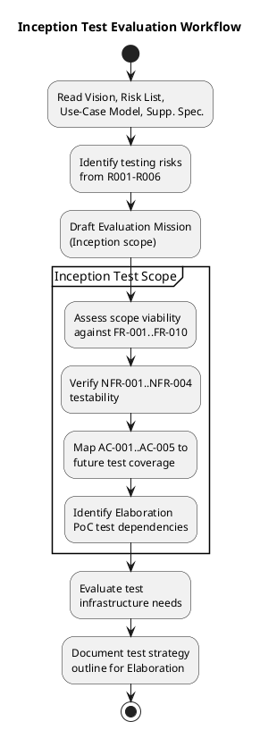
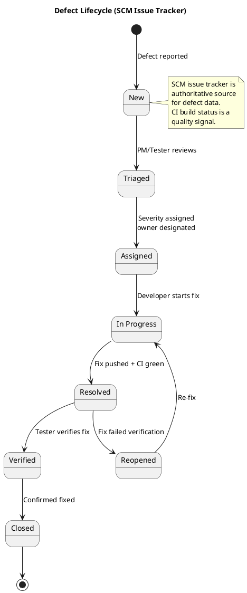

## Document Control

| Field | Value |
|---|---|
| Phase | Inception |
| Status | Draft |
| Milestone Target | End of Inception (LCO) |
| Iteration | 2 (Cycle 1) |
| Date | 2026-08-28 |

## Test Scope

### Evaluation Mission (Inception)

The Evaluation Mission for Inception is to **establish the test strategy foundation** — confirming that the declared scope (10 functional requirements, 4 NFRs, 5 acceptance criteria) is testable, identifying the testing risks that will drive Elaboration's PoC validation, and outlining the test approach for the cross-iteration roadmap. No code exists yet; this is a planning and assessment mission, not an execution mission.

**Mission objectives:**

1. **Verify testability of all declared requirements** — confirm that each FR-001..FR-010, NFR-001..NFR-004, and AC-001..AC-005 can be tested with the available technology stack and infrastructure.
2. **Identify testing risks** — derive test-specific risks from the project Risk List (R001–R006) and define how they constrain the test approach.
3. **Map acceptance criteria to future test coverage** — establish which UCs and NFRs each AC-001..AC-005 will exercise, so Elaboration and Construction iterations inherit a coverage blueprint.
4. **Assess test infrastructure needs** — identify what environments, tools, and data are required for Elaboration PoC testing and Construction functional testing.
5. **Outline the cross-iteration test strategy** — define how testing evolves from Inception (assessment) through Elaboration (PoC + integration) to Construction (functional + regression) and Transition (acceptance).

### Inception Test Workflow

### Requirements Testability Assessment

| Requirement | Description | Testable? | Test Approach | Key Risk |
|---|---|---|---|---|
| FR-001 | Clock In and Clock Out | ✅ Yes | Functional test: button state, timestamp recording, confirmation display. Offline retry via localStorage + idempotency key (AC-005). | R006 (offline retry) |
| FR-002 | View Own Clocking History | ✅ Yes | Functional test: current-month history display, data accuracy | — |
| FR-003 | View All Employee Clockings | ✅ Yes | Functional test: HR role access, all-employee view, data accuracy | — |
| FR-004 | Export Monthly Clocking Report | ✅ Yes | Functional test: CSV export, date range selection, data completeness | — |
| FR-005 | Publish News | ✅ Yes | Functional test: create, publish, audit trail (author + timestamp) | — |
| FR-006 | Edit Published News | ✅ Yes | Functional test: edit, audit trail on every edit (who + when) | — |
| FR-007 | Unpublish News | ✅ Yes | Functional test: unpublish hides item, record preserved, no hard delete | — |
| FR-008 | Read and Filter News | ✅ Yes | Functional test: category filter, featured banner, date sort, read-only | — |
| FR-009 | Search Employee Directory | ✅ Yes | Functional test: search by name/department/office, LDAP attribute display | R001 (LDAP attribute gaps) |
| FR-010 | Manage Worker Category | ✅ Yes | Functional test: AD user id → category CRUD, audit trail on changes | — |
| NFR-001 | Page Load < 3s | ✅ Yes | Performance test: measure page load on corporate network | — |
| NFR-002 | Clock In/Out < 1s | ✅ Yes | Performance test: measure clock operation response time | — |
| NFR-003 | Availability 7:00–19:00 Mon–Fri | ✅ Yes | Fault tolerance test: server stays up during brief network partition | R006 |
| NFR-004 | Mandatory Audit Trail | ✅ Yes | Verification test: audit entries for publish/edit/unpublish/category change | — |

### Acceptance Criteria Test Coverage Mapping

| AC | Description | UCs Exercised | NFRs Exercised | Test Phase | Test Approach |
|---|---|---|---|---|---|
| AC-001 | Employee clocks in/out without help | UC-001 | NFR-002 | Construction + Transition | Functional test + UAT |
| AC-002 | HR publishes news without assistance | UC-005 | — | Construction + Transition | Functional test + UAT |
| AC-003 | Find colleague's phone/email < 10s | UC-009 | NFR-001 | Construction + Transition | Performance test + UAT |
| AC-004 | 80% complete clocking with no training | UC-001 | — | Transition | Adoption measurement |
| AC-005 | System tolerates 5-min network drop | UC-001 | NFR-003 | Elaboration + Construction | PoC + integration test |

### Testing Risks (Derived from Risk List)

| Testing Risk | Source Risk | Exposure | Test Mitigation | Target Iteration |
|---|---|---|---|---|
| LDAP attribute coverage | R001 | 9 (HIGH) | TC-001: Test AD instance with 3-office representative data; test missing/empty/inconsistent attributes | Elaboration Iter 1 |
| Clocking adoption resistance | R002 | 6 (SIGNIFICANT) | UAT with real employees in Transition; measure adoption rate (AC-004) | Transition |
| OIDC integration with Keycloak | R003 | 6 (SIGNIFICANT) | TC-002: OIDC smoke test as first Elaboration test case; verify token validation and role claims | Elaboration Iter 1 |
| Performance under load | R004 | 4 (MODERATE) | Load test with 200 concurrent users (NFR-001, NFR-002) | Construction |
| UI conformance to mandatory design | R005 | 4 (MODERATE) | Visual regression testing against CON-011 design template | Construction |
| Offline clocking retry | R006 | 6 (SIGNIFICANT) | PoC: simulate 5-min network drop, verify localStorage retry + idempotency key | Elaboration Iter 1 |

### Test Infrastructure Needs

| Need | Description | Owner | Target |
|---|---|---|---|
| Test AD instance | AD with representative data from all 3 offices (job title, department, office, email, extension) | STK-003 | Before Elaboration Iter 1 |
| OIDC client registration | Keycloak client registered for test environment | STK-003 | Before Elaboration Iter 1 |
| Test PostgreSQL instance | Database for portal test data (clockings, news, worker categories) | Test team | Elaboration Iter 1 |
| CI test pipeline | Automated test execution on push (xUnit + integration tests) | Dev team | Elaboration Iter 1 |
| Corporate network test env | Windows Server test environment on internal network | Infrastructure | Construction Iter 1 |

### Defect Lifecycle

### Cross-Iteration Test Strategy Outline

| Phase | Iterations | Test Focus | Key Deliverables |
|---|---|---|---|
| Inception | 1 | Requirements testability assessment, risk identification, strategy outline | This document — Test Evaluation Summary |
| Elaboration | 2 | PoC validation (R001 LDAP, R006 offline), OIDC integration smoke test, architecture testability | PoC test results, integration test cases for critical paths |
| Construction | 2 | Functional testing of all UCs, performance testing (NFR-001, NFR-002), audit trail verification (NFR-004), regression testing per iteration | Test case suite, regression test pack, performance test results |
| Transition | 1 | User acceptance testing (AC-001..AC-005), adoption measurement (AC-004), deployment verification | Acceptance test results, final Test Evaluation Summary |

**Regression testing policy:** Every Construction iteration must include regression testing of all previously passing UCs. No iteration skips regression — undiscovered defect debt is unacceptable.

## Test Summary

### Inception — Test Execution Status

No code has been produced in Inception. The CI pipeline is green on main with a bootstrap skeleton, but there are no functional tests to execute. This is expected — Inception is a planning phase, not an execution phase.

| Metric | Value |
|---|---|
| Test cases executed | 0 (no code to test) |
| Pass rate | N/A |
| Defects found | 0 (no code to test) |
| CI build status | Green (bootstrap skeleton) |
| Test coverage | N/A (no functional code) |

### Inception Test Effort Assessment

The Inception test effort focused on **strategy and risk identification**, not execution. The key outputs are:

1. **All 10 FRs confirmed testable** with the declared technology stack
2. **All 4 NFRs confirmed testable** with measurable thresholds
3. **All 5 ACs mapped to future test phases** with clear ownership
4. **6 testing risks identified** with mitigations tied to the project Risk List
5. **Test infrastructure needs assessed** with 2 external dependencies on STK-003 (AD test access, OIDC client registration)
6. **Defect lifecycle defined** using SCM issue tracker as authoritative source
7. **Cross-iteration test strategy outlined** with regression testing policy established

## Defects and Incidents

No defects or incidents to report for Inception. No functional code has been produced.

### Open Test Dependencies (Not Defects)

| ID | Dependency | Owner | Target Iteration | Blocking? |
|---|---|---|---|---|
| TC-001 | Test AD instance with 3-office representative data | STK-003 (Infrastructure) | Elaboration Iter 1 | Yes — blocks R001 PoC testing |
| TC-002 | Keycloak OIDC client registration for test environment | STK-003 (Infrastructure) | Elaboration Iter 1 | Yes — blocks all integration testing |

## Conclusions

### Evaluation Mission Verdict

**Mission status: ACHIEVED (for Inception scope)**

The Inception Evaluation Mission aimed to establish the test strategy foundation. All five mission objectives were met:

1. ✅ All 10 FRs and 4 NFRs confirmed testable
2. ✅ 6 testing risks identified with mitigations
3. ✅ 5 acceptance criteria mapped to test phases
4. ✅ Test infrastructure needs assessed (2 external dependencies identified)
5. ✅ Cross-iteration test strategy outlined with regression policy

### Recommendations for Elaboration

1. **Prioritize R001 (LDAP) and R006 (offline) PoC testing** in Elaboration Iteration 1 — these are the highest-exposure risks and their test results determine whether the architecture baseline is viable.
2. **Resolve TC-001 and TC-002 before Elaboration Iter 1 begins** — the Infrastructure team (STK-003) must provide test AD access and register the OIDC client. These are blocking dependencies.
3. **Establish a smoke test for OIDC authentication** as the first test case in Elaboration — all subsequent functional tests depend on it.
4. **Create LDAP attribute coverage test cases** that include missing/empty/inconsistent attributes from all 3 offices — this directly confronts R001.

### LCO Readiness from Test Perspective

From the Test discipline, the project is **ready to proceed to Elaboration** provided that:
- TC-001 and TC-002 are communicated to STK-003 with sufficient lead time
- The Elaboration Iteration Plan includes PoC test cases for R001 and R006
- The regression testing policy is accepted by the Project Manager

## Traceability

| Element | Traces From | Link Type | Traces To |
|---|---|---|---|
| Evaluation Mission | Vision (FR-001..FR-010, NFR-001..NFR-004, AC-001..AC-005) | Derives | Elaboration Test Plan, Construction Test Cases |
| Testing Risk R001 | R001 (Risk List) | Refines | Elaboration PoC (UC-009) |
| Testing Risk R002 | R002 (Risk List) | Refines | Transition Acceptance Test (AC-004) |
| Testing Risk R003 | R003 (Risk List) | Refines | Elaboration Smoke Test (TC-002) |
| Testing Risk R004 | R004 (Risk List) | Refines | Construction Load Test (NFR-002) |
| Testing Risk R005 | R005 (Risk List) | Refines | Construction Visual Regression (CON-011) |
| Testing Risk R006 | R006 (Risk List) | Refines | Elaboration PoC (UC-001 offline) |
| AC-001 mapping | AC-001, UC-001, NFR-002 | Refines | Construction Test Cases, Transition UAT |
| AC-002 mapping | AC-002, UC-005 | Refines | Construction Test Cases, Transition UAT |
| AC-003 mapping | AC-003, UC-009, NFR-001 | Refines | Construction Performance Test, Transition UAT |
| AC-004 mapping | AC-004, UC-001 | Refines | Transition Adoption Measurement |
| AC-005 mapping | AC-005, UC-001, NFR-003 | Refines | Elaboration PoC, Construction Integration Test |
| TC-001 | R001, STK-003, CON-005 | DependsOn | Elaboration Iter 1 PoC |
| TC-002 | R003, STK-003, CON-004 | DependsOn | Elaboration Iter 1 Smoke Test |
| Defect Lifecycle | SCM issue tracker, CI build status | Derives | All subsequent iterations |
| Regression Policy | RUP iterative lifecycle | Derives | Construction Iterations 1–2 |